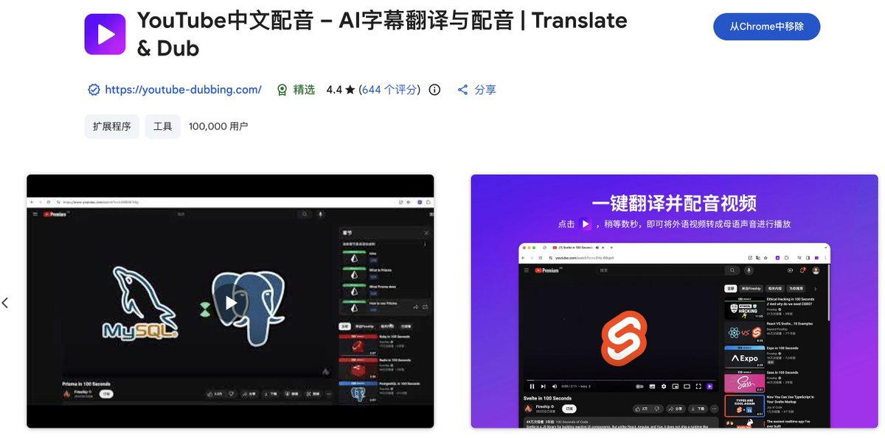
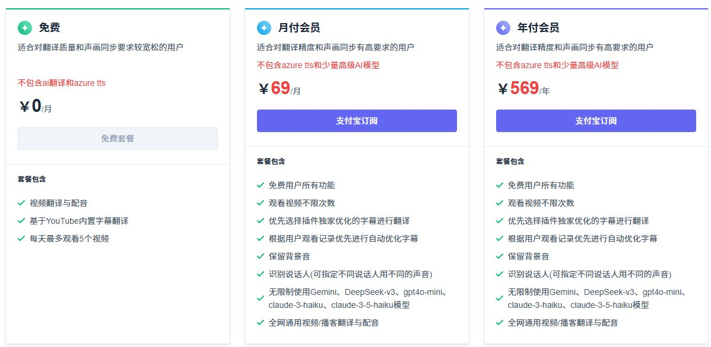

你还在低头对中英文字幕理解Youtuber在讲什么吗？

今天发现一个神器 YouTube Dubbing

它不是字幕，而是把 YouTube 的英文内容直接“配音”成你的母语播放，让你更高效地吸收视频内容，而不是在云里雾里地练英语听力😂

目前超过了十万下载量，获得了谷歌应用商店“精选”徽章。

还是免费的！b

## 💬 Replies

### 1 @Jesse_meta (Jesse) (Author)

*Wed Dec 24 02:13:24 +0000 2025*

下载链接
[chromewebstore.google.com/detail/youtube…](https://chromewebstore.google.com/detail/youtube-dubbing-%E2%80%93-transla/oglffgiaiekgeicdgkdlnlkhliajdlja?hl=zh-CN&utm_source=chatgpt.com)

### 2 @yanhua1010 (Yanhua)

*Wed Dec 24 10:45:36 +0000 2025*

@jessezheng 顺便推荐下这块免费的插件trancy, 也很好用
[x.com/yanhua1010/sta…](https://x.com/yanhua1010/status/1977024835927884094?s=20)

### 3 @Jesse_meta (Jesse) (Author)

*Thu Dec 25 10:08:11 +0000 2025*

@yanhua1010 看起来比沉浸翻译好，因为有上下文。晚点试一下

### 4 @Cato_KT (Cato_KT)

*Tue Dec 23 15:03:03 +0000 2025*

@jessezheng 直播可以同步翻译吗？

### 5 @Jesse_meta (Jesse) (Author)

*Tue Dec 23 15:23:50 +0000 2025*

@CatoKt4 可以的

### 6 @youtubedubbing (李志博)

*Wed Dec 24 05:46:09 +0000 2025*

@jessezheng 谢谢大佬推荐，我是插件的作者🤝

### 7 @Jesse_meta (Jesse) (Author)

*Wed Dec 24 06:04:31 +0000 2025*

@youtubedubbing 牛啊  大家对这需求挺大的

### 8 @shuzikuangtu (数字狂徒)

*Tue Dec 23 22:26:19 +0000 2025*

@jessezheng AI 时代学好英语反而更难了，有太多逃课的方式啦

### 9 @Jesse_meta (Jesse) (Author)

*Wed Dec 24 00:59:05 +0000 2025*

@shuzikuangtu 确实啊 文字可以用沉浸翻译 

现在只有生活在海外，有强烈交流需求的人才会下功夫去学

### 10 @cfa5321 (tomás hongo)

*Tue Dec 23 23:39:39 +0000 2025*

@jessezheng 油管已经有多语言配音了。听起来简直是折磨😫

### 11 @Jesse_meta (Jesse) (Author)

*Wed Dec 24 00:44:00 +0000 2025*

@cfa5321 官方内置的吗

### 12 @shuospark (烁点未来)

*Thu Dec 25 10:00:03 +0000 2025*

@jessezheng 这是订购方案 

### 13 @Jesse_meta (Jesse) (Author)

*Thu Dec 25 10:03:51 +0000 2025*

@shuospark 嗯嗯 我目前没有付费 看起来这费用也不算贵 大家可以各取所需

### 14 @zhengyu230769 (ZhengJing.BUT)

*Wed Dec 24 01:54:29 +0000 2025*

@jessezheng app store 里面搜索不到

### 15 @Jesse_meta (Jesse) (Author)

*Wed Dec 24 02:14:00 +0000 2025*

@zhengyu230769 [chromewebstore.google.com/detail/youtube…](https://chromewebstore.google.com/detail/youtube-dubbing-%E2%80%93-transla/oglffgiaiekgeicdgkdlnlkhliajdlja?hl=zh-CN&utm_source=chatgpt.com)

### 16 @ECalifornians (Tony Guan)

*Wed Dec 24 17:24:40 +0000 2025*

@jessezheng Youtube 已经内嵌这个功能了。

### 17 @Jesse_meta (Jesse) (Author)

*Thu Dec 25 00:59:35 +0000 2025*

@ECalifornians 我刚刚研究了一下，Youtube这个内嵌功能需要两个前提，一个是创作者开通了可以多语言自动翻译的权限，二是作者开通的语言权限刚好是用户想要的。

@youtubedubbing 是这样吗

### 18 @Lamdam30797422 (Lam dam)

*Wed Dec 24 02:05:09 +0000 2025*

@jessezheng 支持Mac嗎？

### 19 @Jesse_meta (Jesse) (Author)

*Wed Dec 24 02:11:03 +0000 2025*

@Lamdam30797422 支持的 这个是谷歌插件

### 20 @xu_hui49469 (Eddie xu)

*Wed Dec 24 04:20:31 +0000 2025*

@jessezheng 我需要学习英文，有什么推荐吗？

### 21 @Jesse_meta (Jesse) (Author)

*Wed Dec 24 05:16:32 +0000 2025*

@xu\_hui49469 我今天在使用Gemini3的Live功能进行聊天。

我再优化一下提示词，晚点发出来

### 22 @Reboottttttt (Reboot.Btc)

*Wed Dec 24 12:08:58 +0000 2025*

@jessezheng 学习了老师

### 23 @i_m_m_ (黑眼圈| 美股合约首选Gate)

*Wed Dec 24 06:30:56 +0000 2025*

@jessezheng 太需要了！

### 24 @WanWeb3Dev (Wan | Web3 Dev(互fo版))

*Wed Dec 24 00:32:42 +0000 2025*

@jessezheng 昨天折腾了半天没找到合适的实时字幕翻译，抽空试试

### 25 @suke2826 (马克)

*Wed Dec 24 02:29:58 +0000 2025*

@jessezheng 很好

### 26 @jason129476911 (Jason.在路上)

*Wed Dec 24 13:26:33 +0000 2025*

@jessezheng 谢谢！非常好用

### 27 @linxinsnakeone (millionairelin)

*Wed Dec 24 00:46:45 +0000 2025*

@jessezheng 直播也可以翻译那确实挺不错的可以试试

### 28 @Mangoofthday (Mango)

*Wed Dec 24 10:15:19 +0000 2025*

@jessezheng youtube本身就有这个功能

### 29 @James496183 (James 玄浩真人)

*Wed Dec 24 13:46:02 +0000 2025*

@jessezheng 属于Google扩展程序，Google浏览器无需下载可直接用，单有免费数量的，每天限五个视频，还好我看英文视频不多哈哈

