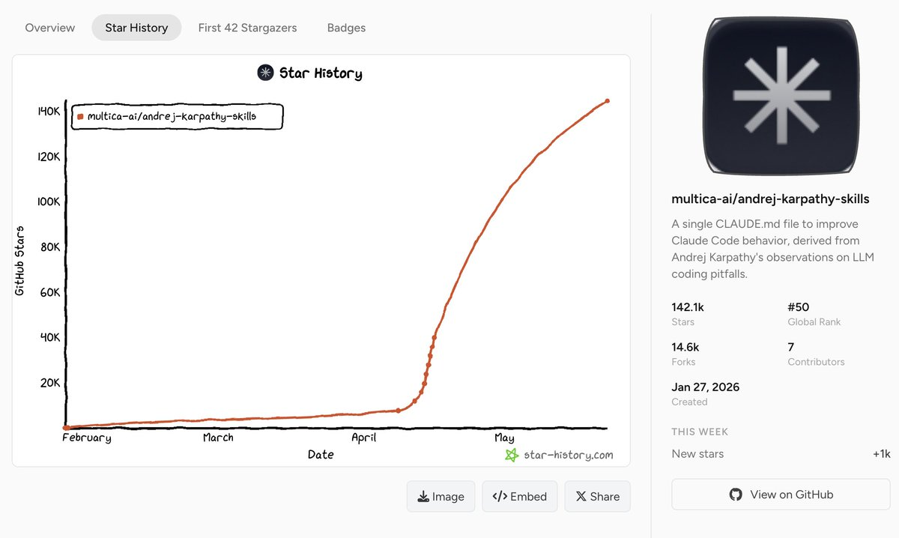

andrej-karpathy-skills 成为了 GitHub 历史前 50 的项目。

[github.com/multica-ai/and…](https://github.com/multica-ai/andrej-karpathy-skills) 

## 💬 Replies

### 1 @AlchainHust (花叔)

*Fri May 22 11:00:33 +0000 2026*

@jiayuan\_jy nb

### 2 @enzyme_dev (船长老刘)

*Fri May 22 11:07:35 +0000 2026*

@jiayuan\_jy readme里看到claude code、cursor。。
为啥不提codex和opencode🤪

### 3 @AndrewK404 (Andrew Kuncevich)

*Fri May 22 18:59:21 +0000 2026*

@jiayuan\_jy This is kind of insane.

The file doesn’t contain any unique information, and structuring Karpathy’s thoughts doesn’t add any quality to agents at all.

### 4 @0xdeusyu (Rainman)

*Sat May 23 10:03:17 +0000 2026*

@jiayuan\_jy multica 顶尖的harness 理解！

### 5 @Card198454 (Cunningham Card)

*Fri May 22 10:44:40 +0000 2026*

@jiayuan\_jy confused but congratulations

### 6 @ai_edisonZ (edisonZ)

*Fri May 22 11:17:20 +0000 2026*

@jiayuan\_jy 🐂 ，刚用上！

### 7 @arknights60 (Lewis)

*Fri May 22 10:34:41 +0000 2026*

@jiayuan\_jy nbility

### 8 @BuzaliFacu (facundo)

*Fri May 22 19:31:42 +0000 2026*

@jiayuan\_jy The GOAT is the GOAT 🐐

### 9 @orz99 (燐夜 Lava)

*Thu May 28 15:46:58 +0000 2026*

真心覺得這個 repo 最厲害的，是把 Karpathy 那條 thread 從「抱怨」變成「可執行 CLAUDE.md」——這個轉化本身就是貢獻、實至名歸。

我們發現在 Opus 4.7 上、原 66 行可精簡到 19 行。但 Karpathy 真正的洞見其實是使用者端的紀律、不是 LLM 自我約束——「給成功標準，看著它跑完。/dec 把這條紀律變成工具——直接寫好可貼進 /goal 的契約字串、貼進去就 loop 收斂。

詳細：
• N=40 A/B 三組（v1 65 行／v2 19 行／無 CLAUDE.md）Fisher exact p=1.000 無統計顯著差異

• v1 的 surgical changes、不過度抽象、不為不可能場景寫錯誤處理、不擅自 refactor 這些 guardrail，逐字對照觀測到的 Opus 4.7 系統提示詞 snapshot 都看得到（snapshot 已 commit）

• Anthropic 已內建大部分原 guardrail，重複只是稀釋新指令權重——不是規則沒用，是太多重述讓新加的規則沒位置

/dec 也適用 Codex CLI 的 /goal。

[github.com/aeopress/andre…](https://github.com/aeopress/andrej-karpathy-skills.TW)

(Claude Code v2.1.139+ / Opus 4.7 驗證、MIT)

### 10 @geren8te (Eren Suner)

*Fri May 22 13:22:19 +0000 2026*

@jiayuan\_jy What happened at the end of April?

### 11 @Yilin0x (Yilin)

*Fri May 22 11:42:07 +0000 2026*

@jiayuan\_jy 恭喜！

### 12 @Felixfisher20 (OpenFish🐟)

*Sat May 23 02:18:02 +0000 2026*

@jiayuan\_jy gemini cli不久就下线了，请问啥时候接入 antigravity cli呀

### 13 @chainlockw (TheSaltwaterRoom)

*Tue May 26 00:40:37 +0000 2026*

@jiayuan\_jy 可以支持codex吗

