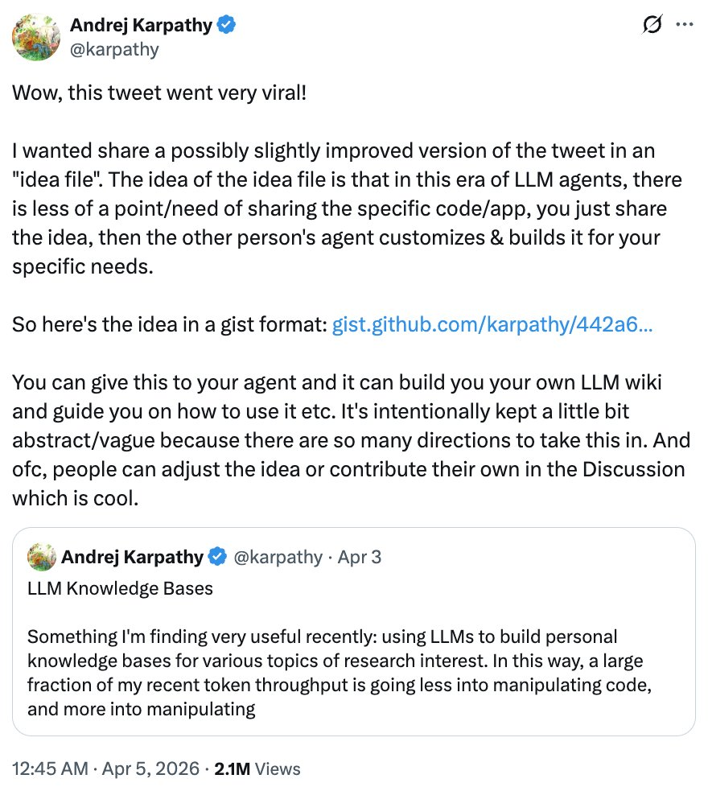
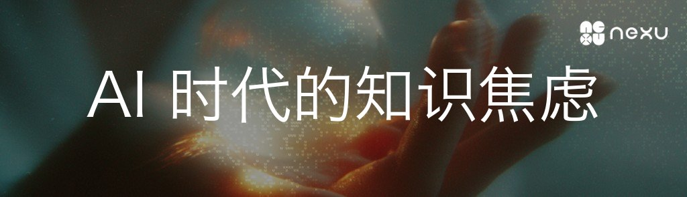
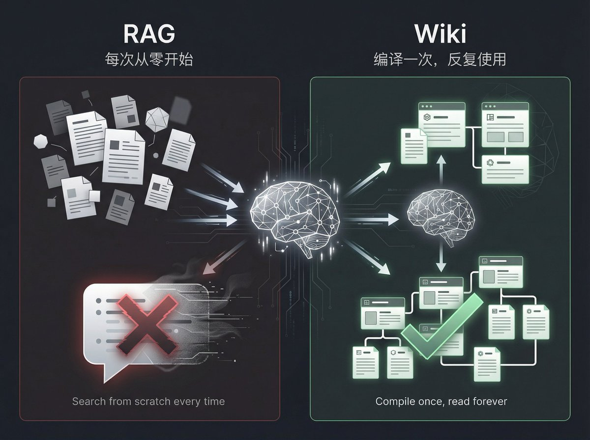
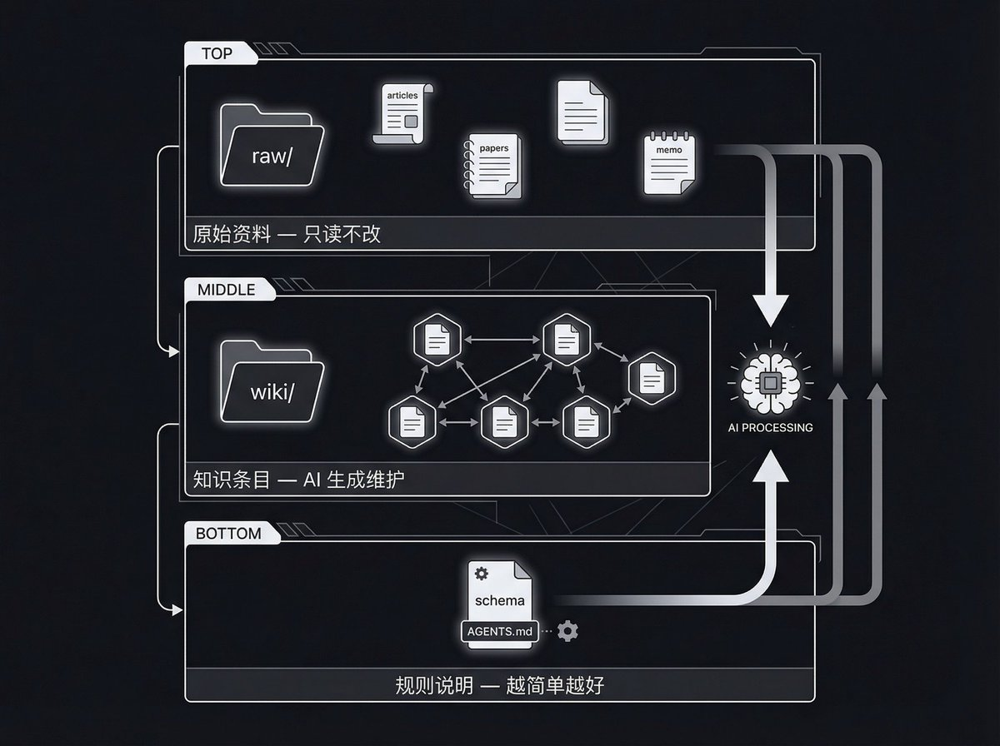
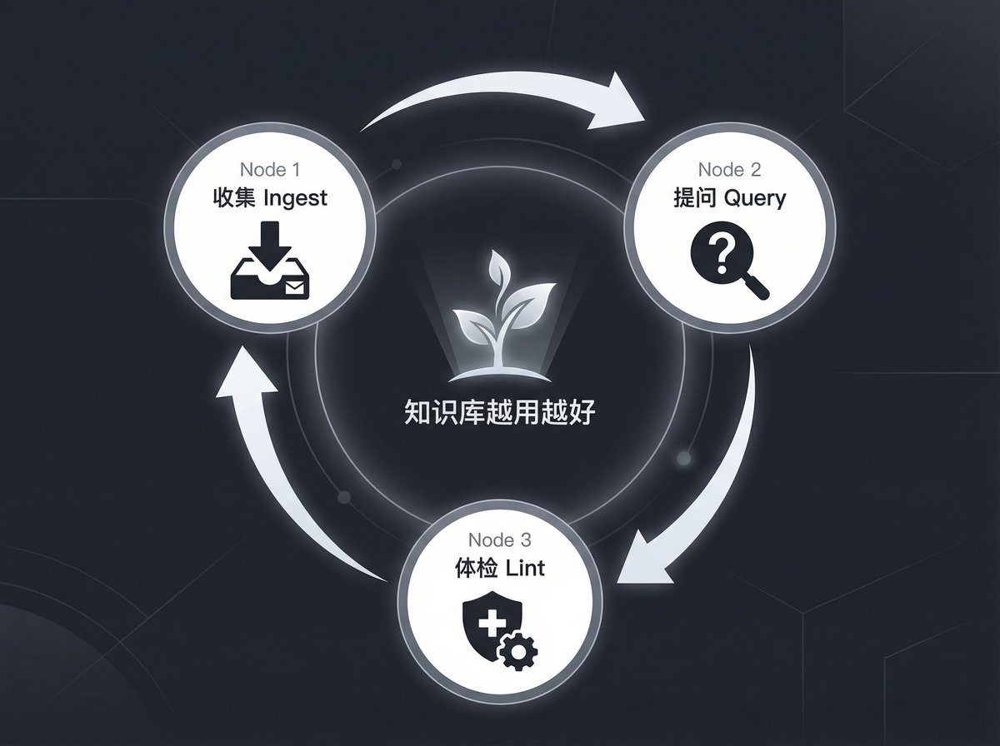
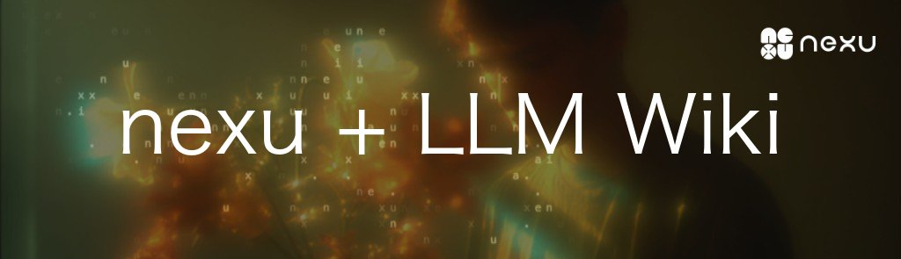
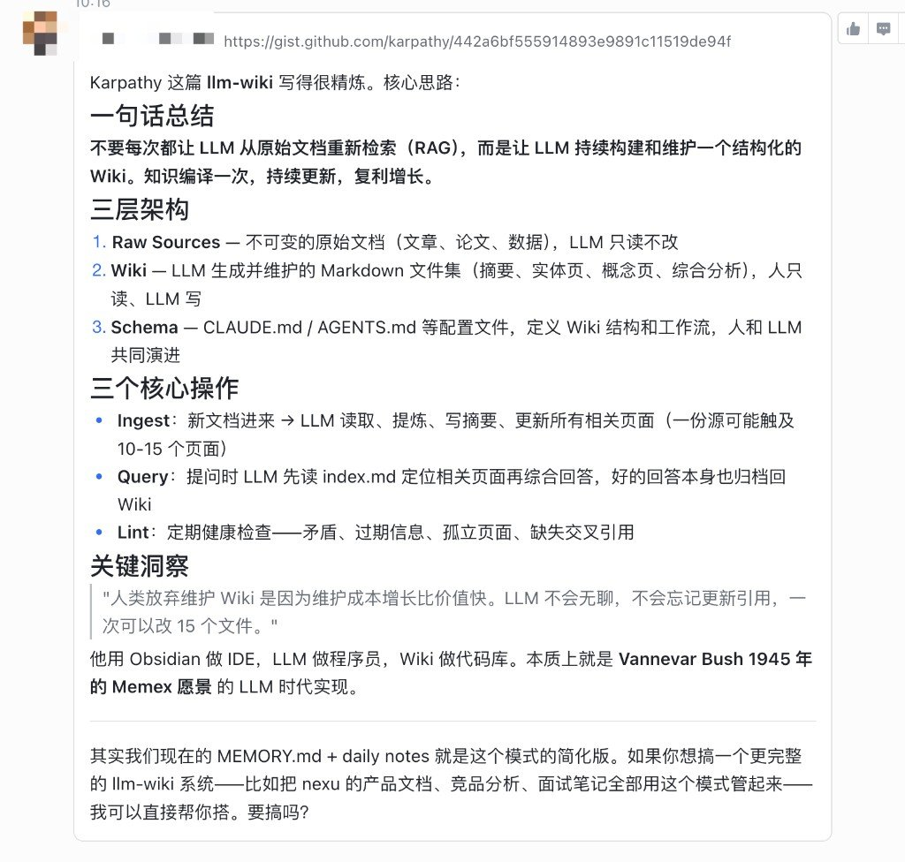
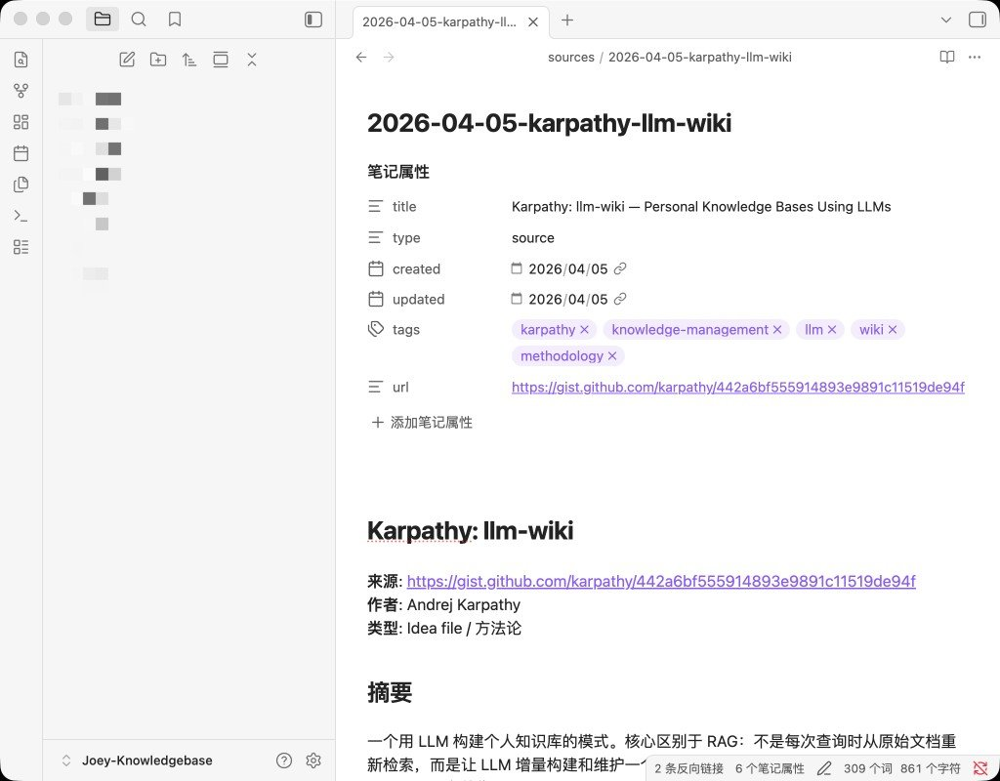
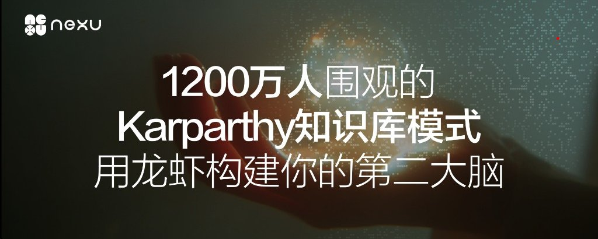

# 📰 1200 万人围观的 Karpathy 知识库模式，用龙虾为你搭建第二大脑

> nexu 是一个可以一键安装的 OpenClaw 桌面客户端，让你在本地用 AI 操控一切。GitHub：https://github.com/nexu-io/nexu ，觉得有用的话帮忙点个 Star 支持一下 🌟

4 月 3 号，Andrej Karpathy 发了一条推，聊他最近怎么用 LLM 搭个人知识库。

1200 万浏览，4.3 万收藏，6100 转发。 炸了。

他说的事情其实不复杂：把文章、论文、笔记这些原始资料丢进一个文件夹，然后让 AI 把它们"编译"成一套互相链接的 Wiki。你不用自己写 Wiki，AI 写，AI 维护，你只管看。

第二天他又追了一条推，直接甩出一个 GitHub Gist，叫 LLM Wiki。1600 Star，289 Fork。

他管这份 Gist 叫 Idea File。不是代码，不是 App，就是一份想法说明——你把它丢给自己的 AI Agent，Agent 会帮你把整套知识库搭出来。

Gist 地址：https://gist.github.com/karpathy/442a6bf555914893e9891c11519de94f

下面讲讲 Karpathy 到底说了什么，以及我是怎么用 nexu 落地的。

---

Karpathy 在原始推文里说了一句很关键的话：

> 我最近大量的 token 消耗，正在从「操作代码」转向「操作知识」。

他发现自己越来越多地用 AI 来处理 Markdown 和图片形式的知识，而不是写代码。但现有的工具有一个根本问题：

大多数人用 AI 处理文档的方式是 RAG——上传一堆文件，问问题时 AI 现场检索、现场拼答案。NotebookLM、ChatGPT 文件上传、大部分知识库产品都是这个模式。

问题在于：每次都是从零开始。 AI 不会记住上次的综合结论，不会把五篇文章之间的关联提前建好，不会标注新资料和旧结论的矛盾。问一个需要综合多篇文档的问题，AI 每次都要重新拼一遍。

Karpathy 的思路是：别每次都现场推导，让 AI 提前把知识整理好，存成一份持久化的 Wiki。

---

在 Gist 里，他把整个系统拆成三层：

Raw（原始资料）——你收集的文章、论文、笔记、会议纪要。放在 \`raw/\` 文件夹里，只读不改。这是事实来源。

Wiki（知识条目）——AI 生成和维护的 Markdown 文件。每个重要概念一个页面，互相链接，有摘要、有综述、有对比。你不写，AI 写。你只管看。

Schema（规则说明）——一份配置文件，告诉 AI 这个知识库怎么组织、什么规范、新资料进来走什么流程。Karpathy 说他用的是一个简单的 AGENTS.md，"just a nested directory of .md files"，越简单越好。

他用了一个比喻，我觉得特别到位：

> Obsidian 是 IDE，LLM 是程序员，Wiki 是代码库。

AI 负责写代码（写 Wiki），你负责提需求（选资料、问问题、定方向）。Obsidian 就是你看代码的编辑器。

---

Karpathy 在推文和 Gist 里都提到了三个核心操作：

收集资料（Ingest）

往 \`raw/\` 里丢一篇新文章，告诉 AI 处理。AI 读完后会写摘要、更新索引、检查已有页面需不需要补充或修正。Karpathy 说他喜欢一篇一篇来，边入库边看产出。

提问探索（Query）

在已有 Wiki 上问问题。AI 先读索引找到相关页面，再综合回答。他在推文里特别提到：回答不应该只在聊天窗口里出现一次就消失——好的回答应该存回 Wiki，变成新的知识条目。这样你的每次提问都会让知识库变得更丰富。

他举了几种输出形式：Markdown 页面、对比表格、Marp 幻灯片、matplotlib 图表。不只是文字回答。

定期体检（Lint）

让 AI 检查 Wiki 的健康度：有没有页面之间的矛盾？有没有被新资料推翻的旧结论？有没有孤儿页面？有没有该建还没建的条目？

Karpathy 在 Gist 里写了一句话我很认同：人类放弃维护 Wiki，因为维护成本涨得比价值快。AI 不会嫌烦，不会忘记更新交叉引用，一次可以改 15 个文件。

---

Karpathy 在第二条推文里解释了为什么用 Gist 而不是发一个代码仓库：

> 在 LLM Agent 的时代，分享具体代码/App 的意义越来越小了。你只需要分享想法，对方的 Agent 会根据具体需求自己定制和构建。

这份 Gist 故意保持抽象——没有规定用什么模型、什么 IDE、什么目录命名。他说：

> 这份文档的任务只是传达一个 pattern。你的 AI 能搞定剩下的。

---

看完 Karpathy 的推文和 Gist，我觉得这套东西和 nexu 是天然搭配。

nexu 是开源的桌面 AI Agent 平台，所有数据在本地，Agent 直接操作你电脑上的文件。维护一套本地 Wiki 需要的正是这种能力——不是一问一答的网页对话，而是一个能反复读写你文件系统的常驻 Agent。

我的做法：

1\. 把 Gist 做成 nexu 的 Skill

Karpathy 说这份 Gist 就是给 Agent 的工作说明。nexu 的 Skill 体系正好干这个——一份 Markdown 规格文件，定义好 Agent 的行为。我把 Gist 内容稍微改了一下，变成了一个 nexu Skill：约定了 \`raw/\`、\`wiki/\` 的结构，入库时更新哪些文件，体检时检查哪些项。换个研究方向，复制这个 Skill 就能起一个新的知识库。

2\. 在微信里随手入库

nexu 连了微信、飞书、Slack 六大 IM。看到一篇好文章，转发给 nexu bot，它帮我跑完整个入库流程。不用开电脑，手机上就能喂资料。这是 Karpathy 没提到的——他的流程还是得在终端里操作，nexu 把入口拉到了 IM 里。

3\. 模型随意切

入库时用 Claude 做深度理解，日常查询用经济模型省钱。nexu 支持 Claude、GPT、Gemini、DeepSeek、Ollama 等 10+ 模型，在设置里切一下就行。

4\. Obsidian 继续当主界面

和 Karpathy 说的一样：Obsidian 是 IDE，nexu 上的 Agent 是 Programmer。我用 Obsidian 看图谱、浏览页面；nexu 的 Agent 负责写摘要、建链接、跑体检。各管各的。

---

Karpathy 在 Gist 最后引用了 1945 年 Vannevar Bush 的 Memex 概念——私人的、策展式的知识存储，强调文档之间的关联。Bush 当年没解决的问题是谁来做维护。80 年后，AI 能接这个活了。

如果你想试，最小闭环就是：一个文件夹、一份规则文件、一个 Agent。 Karpathy 自己的知识库大约 100 篇资料、400K 字，用 index.md 就能导航，不需要向量数据库。

把这份 Gist 丢给 nexu，让它帮你搭起来：
https://gist.github.com/karpathy/442a6bf555914893e9891c11519de94f

nexu 是一个可以一键安装的 OpenClaw 桌面客户端，让你在本地用 AI 操控一切。如果觉得这篇文章有帮助，去 GitHub 给我们点个 Star 吧 🌟

GitHub：https://github.com/nexu-io/nexu

扫码加入龙虾社区，一起交流 AI Agent 和个人知识库搭建：

### 🖼️ Attached Media

## 💬 Replies

### 1 @QK6783432331761 (Q.K)

*Sun Apr 05 15:12:10 +0000 2026*

@JoyLi629 这套打法下来真觉得可以，把过往的任何信息和知识全部让AI去帮你看着，wiki就是图书馆，还是个检索高效的图书馆，长期用下来，你一生的知识库就有了，可以留给下一代，😄你的孙子，孙孙辈，可以了解他们的祖先了。

### 2 @xiamiluo (虾米)

*Sun Apr 05 09:34:45 +0000 2026*

@JoyLi629 @tuturetom 哎呀 这个好
我现在有一个龙虾版的 会存db 
我一直想改成copoit 版 无成功

