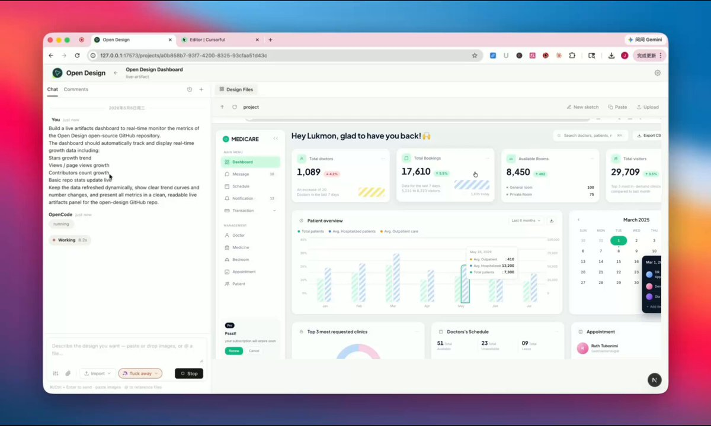
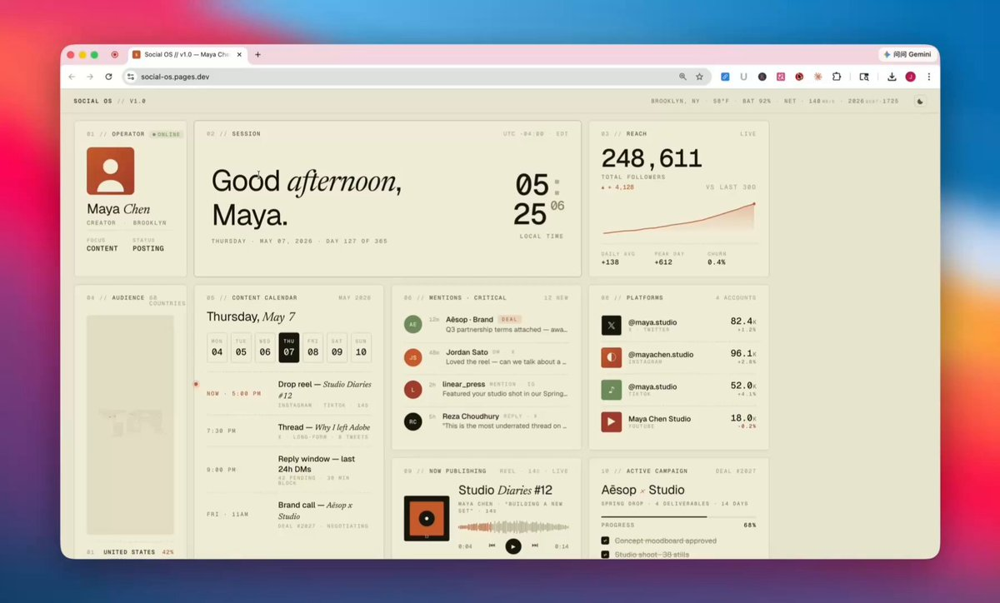
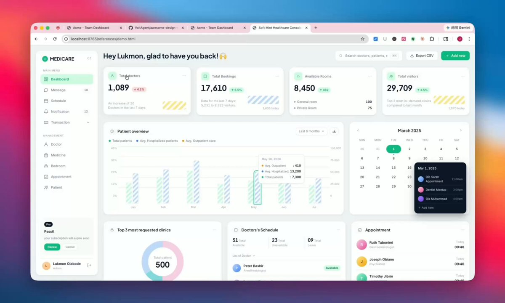
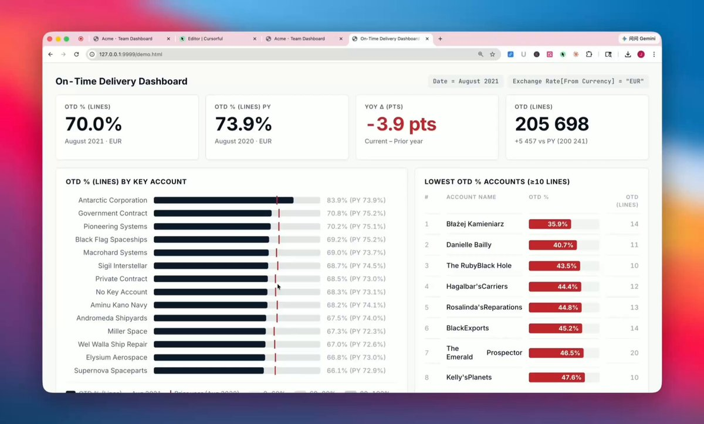
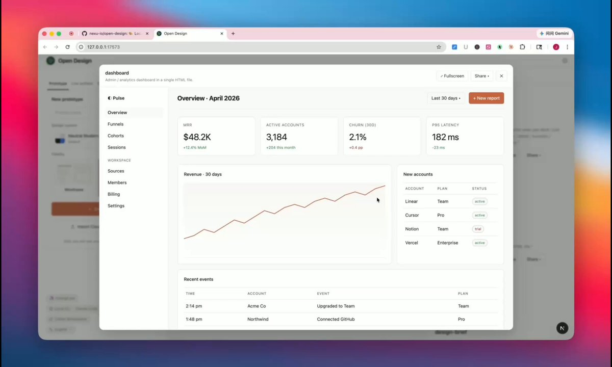

团队个性化仪表盘的时代到来！🚀

Open Design 开源了 claude live artifacts全套能力🔥

支持链接X、Github、Notion、Linear、Stripe等 180 多个数据源 + 数据实时更新✨

🎯自媒体仪表盘、项目日报、销售看板、工程监控...一个 artifact 全搞[github.com/nexu-io/open-d…](https://github.com/nexu-io/open-design)PqKN

## 💬 Replies

### 1 @JoyLi629 (Joey Lee) (Author)

*Thu May 07 13:34:21 +0000 2026*

内置 10 多套生产级 dashboard 模板一键使用

还能5分钟快速复刻各种爆火🔥仪表盘样式：
1、抓取仪表盘参考图片
2、提供给live artifacts 作为参考图
3、连接 connector，接入自己的数据，开始制作a

### 2 @yzg75001 (CryptoClaw)

*Fri May 08 05:48:49 +0000 2026*

@JoyLi629 180+ data sources with live updates is the key differentiator here. Most dashboard tools are static snapshots. The fact that it's open source means teams can self-host and customize — huge for privacy-conscious orgs.

### 3 @JoyLi629 (Joey Lee) (Author)

*Fri May 08 12:07:12 +0000 2026*

@yzg75001 Exactly. Static dashboards die the moment your stack changes. Live + self-hosted means the dashboard ships with your data, not against it. Apache-2.0, BYOK, runs on Claude Code / Codex / Cursor / OpenCode / Hermes.

