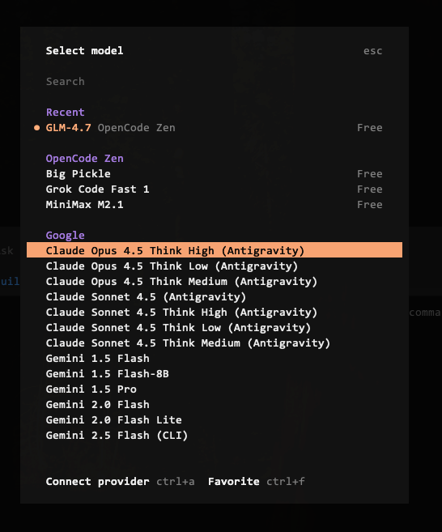

[opencode.ai](https://opencode.ai) 是个好东西，自带的 glm4.7 免费不说，还可以通过安装插件把 Google 家的 Antigravity 内置的 Claude 和 Gemini 额度导入进来

配合上 Google AI Pro 的六人共享搬家套餐，美滋滋 

## 💬 Replies

### 1 @interjc (Justin) (Author)

*Tue Jan 06 02:52:42 +0000 2026*

插件：
[github.com/NoeFabris/open…](https://github.com/NoeFabris/opencode-antigravity-auth)

### 2 @YILS2048 (YILS)

*Wed Jan 07 05:52:25 +0000 2026*

@interjc 再提供一个白嫖方案，实测效果还不错

[x.com/YILS2048/statu…](https://x.com/YILS2048/status/2008461443151393276?s=20)

### 3 @interjc (Justin) (Author)

*Wed Jan 07 05:58:03 +0000 2026*

@YILS2048 这个不错

### 4 @kedoupi (珂抖屁(CodePi))

*Tue Jan 06 07:52:06 +0000 2026*

@interjc 登录cc有人说有封号的风险

### 5 @interjc (Justin) (Author)

*Tue Jan 06 08:14:25 +0000 2026*

@kedoupi 登录 Google 就行，CC 就用他自己的客户端啊

### 6 @hkdom (hkdom)

*Tue Jan 06 08:10:20 +0000 2026*

@interjc 會封Claude，別試

### 7 @interjc (Justin) (Author)

*Tue Jan 06 08:13:28 +0000 2026*

@hkdom 这是 opencode 啊，接的也是 google 的额度

### 8 @kylesean6 (Ky1eSean)

*Tue Jan 06 08:39:29 +0000 2026*

@interjc 很好奇，antigravity 对 opus 只有 4.5 think,为什么用了这种 2api 插件导入到这里会有 三个 thinking level 呢？

### 9 @interjc (Justin) (Author)

*Tue Jan 06 08:49:39 +0000 2026*

@kylesean6 还有 gemini cli 以及 一些别的渠道吧可能

### 10 @thePixelsAI (Pixels.AI)

*Mon Jan 12 10:47:51 +0000 2026*

@interjc 刚买了 GLM 的跨年特惠套餐，然后发现 opencode 免费自带 glm4.7 …我真是大冤种抱头🥴🥴🥴

### 11 @interjc (Justin) (Author)

*Mon Jan 12 10:59:42 +0000 2026*

@xAI54200 opencode 送的 glm 在高峰期很慢，自己买的还是稳一些😂

### 12 @jaxxchen003 (硅基练习生 JAXX)

*Wed Jan 07 16:16:47 +0000 2026*

@interjc 可以加codex么

### 13 @interjc (Justin) (Author)

*Wed Jan 07 16:24:46 +0000 2026*

@jaxxchen003 各个主流平台的账号都可以登

### 14 @kkaeloy (kkaeloy)

*Tue Jan 06 11:19:01 +0000 2026*

@interjc 谷歌会员共享的人也可以用antigravity？

### 15 @interjc (Justin) (Author)

*Tue Jan 06 11:20:55 +0000 2026*

@kkaeloy 可以的，六个人除了网盘 2T 空间共享以外，其他都是独立的

### 16 @LocationCk (Kiro有点Yes)

*Tue Jan 06 08:52:26 +0000 2026*

@interjc 我也是用Antigravity 内置的 额度 特别是claude特别容易提醒：Model capacity exhausted for claude. Retrying in 1m

### 17 @interjc (Justin) (Author)

*Tue Jan 06 09:01:33 +0000 2026*

@LocationCk 切一下 gemini 呗，关键时刻再用 Claude

### 18 @nummanali (Numman Ali)

*Tue Jan 06 09:03:40 +0000 2026*

@interjc And ChatGPT 😉
[x.com/nummanali/stat…](https://x.com/nummanali/status/2007975206711967764?s=20)5

### 19 @nocoffeenobrain (Mr.Coffee)

*Tue Jan 06 08:10:46 +0000 2026*

@interjc Glm 加上cc 已經很夠用了

### 20 @JettHuu (meath)

*Tue Jan 06 12:25:45 +0000 2026*

@interjc 这就来学习

### 21 @putther27 (Suraj Satheesh)

*Tue Jan 06 11:36:37 +0000 2026*

@interjc also claude code 😉[syntackle.com/blog/claude-co…](https://syntackle.com/blog/claude-code-free-using-antigravity-proxy/)Q

### 22 @sep12th (samvv)

*Tue Jan 06 06:27:44 +0000 2026*

@interjc 再加一个插件[github.com/code-yeongyu/o…](https://github.com/code-yeongyu/oh-my-opencode)

### 23 @TristanLi99 (Tristan Lee)

*Tue Jan 06 08:17:45 +0000 2026*

@interjc 还是人家谷歌大方

### 24 @UCIOWNSI (Uciownsi)

*Tue Jan 06 06:27:32 +0000 2026*

@interjc 我试过免费的glm有并发限制

### 25 @Hamzaa_i (Hamza)

*Tue Jan 06 19:29:42 +0000 2026*

@interjc @FactoryAI something to consider?

### 26 @NossaCoisa1 (chico linguiça da silva)

*Tue Jan 06 18:45:55 +0000 2026*

@interjc @Neutzz

### 27 @hackeryzm (苏打 da 汽水)

*Wed Jan 07 05:21:11 +0000 2026*

@interjc antigravity 内置模型反代出来，Google 账号会容易被封

### 28 @changtimwu (Tim Wu)

*Tue Jan 06 09:30:43 +0000 2026*

@interjc 在 opencode 有支援類似 claude for chrome 的功能嗎？

