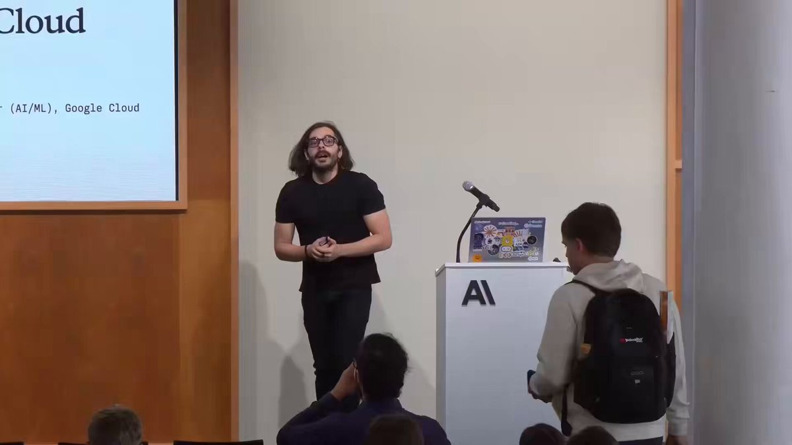

Anthropic engineer:

"You're not supposed to prompt Claude. You're supposed to build a system that prompts itself."

this is one of the best workflows I've seen in a long time

in this video he breaks down exactly how most people are using Claude:

\- the 14% you lose to CLAUDE.md before typing a word
\- the plugins that 95% of users have never installed
\- the caching setup that keeps it at 95% hit rate and almost free
\- why starting every chat from zero is the slowest way to use Claude

if you've been using Claude for more than a month and never left the chat window, you've been using one project when you could be running a team of them

instead of another show tonight, watch this

make sure to bookmark it before it gets lost in your feed

full guide in the article below

### 🖼️ Attached Media

## 💬 Replies

### 1 @eng_khairallah1 (Khairallah AL-Awady) (Author)

*Sat Jun 06 16:45:43 +0000 2026*

reasons why you should save &amp; bookmark the post:

\- you will need it
\- easy access to it later

you will definitely thank yourself later

original link: [youtu.be/SqHsS737CeA?si…](https://youtu.be/SqHsS737CeA?si=jVPpBQWFYXtvvLNw)

### 2 @eng_khairallah1 (Khairallah AL-Awady) (Author)

*Sun Jun 07 09:07:04 +0000 2026*

30 Copy-Paste System Prompts That Make Claude an Expert at Anything:
[x.com/eng\_khairallah…](https://x.com/eng_khairallah1/status/2063545603955785778)

### 3 @nrqa__ (Nelly;)

*Sat Jun 06 15:55:27 +0000 2026*

@eng\_khairallah1 the best workflows always stop feeling like chats after a while

### 4 @eng_khairallah1 (Khairallah AL-Awady) (Author)

*Sat Jun 06 15:59:23 +0000 2026*

@nrqa\_\_ totally agree with you Nelly 💯

### 5 @sairahul1 (Rahul)

*Sat Jun 06 14:52:23 +0000 2026*

@eng\_khairallah1 Suggested for everyone to read this setup

### 6 @eng_khairallah1 (Khairallah AL-Awady) (Author)

*Sat Jun 06 14:52:38 +0000 2026*

@sairahul1 thank youu a lot bro

### 7 @alphabatcher (Alpha Batcher)

*Sat Jun 06 15:01:16 +0000 2026*

@eng\_khairallah1 in one day i'll be engineer in Anthropic

matter of time

### 8 @eng_khairallah1 (Khairallah AL-Awady) (Author)

*Sat Jun 06 15:05:56 +0000 2026*

@alphabatcher yesssss lets gooooo my man

### 9 @Av1dlive (Avid)

*Sat Jun 06 15:14:44 +0000 2026*

@eng\_khairallah1 @Web3Arabs Nice

### 10 @eng_khairallah1 (Khairallah AL-Awady) (Author)

*Sat Jun 06 15:15:16 +0000 2026*

@Av1dlive @Web3Arabs thank youuuu Avid

### 11 @web3_tech_ (jeff)

*Sat Jun 06 15:17:11 +0000 2026*

@eng\_khairallah1 I needed this thanks fren

### 12 @eng_khairallah1 (Khairallah AL-Awady) (Author)

*Sat Jun 06 15:17:36 +0000 2026*

@web3\_tech\_ my pleasure Jeff!

### 13 @Web3Arabs (Web3Arabs)

*Sat Jun 06 15:00:22 +0000 2026*

@eng\_khairallah1 🥳😍😍

### 14 @eng_khairallah1 (Khairallah AL-Awady) (Author)

*Sat Jun 06 15:06:01 +0000 2026*

@Web3Arabs 🙌🙌

### 15 @videleth (Videl)

*Sat Jun 06 14:54:05 +0000 2026*

@eng\_khairallah1 I just bookmarked it brother

### 16 @eng_khairallah1 (Khairallah AL-Awady) (Author)

*Sat Jun 06 14:54:29 +0000 2026*

@videleth thank youuu Videl

### 17 @ziwenxu_ (Ziwen)

*Sat Jun 06 16:42:31 +0000 2026*

@eng\_khairallah1 Nice one!!

### 18 @HarrisDecodes (HarriStack)

*Sun Jun 07 08:43:05 +0000 2026*

@eng\_khairallah1 This “build a system that prompts itself” Claude workflow from the Anthropic engineer is straight fire.  Already bookmarking the video and rebuilding my whole setup tonight

### 19 @Parul_Gautam7 (Parul Gautam)

*Sun Jun 07 08:25:44 +0000 2026*

@eng\_khairallah1 Excellent Roadmap, will be helpful

### 20 @HarryTandy (Harry Tandy)

*Sun Jun 07 14:57:15 +0000 2026*

@eng\_khairallah1 caching setup is exactly what my local agents needed

### 21 @Defipeniel (DΞFI PΞNIΞL (🧠,🧠))

*Tue Jun 16 10:45:49 +0000 2026*

@eng\_khairallah1 The real leverage comes from the workflow, not the prompt.

### 22 @Benzempire2021 (𝐁𝐞𝐧𝐳 )

*Sat Jun 06 16:50:29 +0000 2026*

@eng\_khairallah1 this changes everything, already building the system

### 23 @51bodila (bodila)

*Sun Jun 07 14:21:28 +0000 2026*

@eng\_khairallah1 he looks like professional in his area

### 24 @AgentGuard_AI (AgentGuard 🛡️)

*Mon Jun 08 14:26:50 +0000 2026*

The CLAUDE.md point is the real one and it's underrated. The trap nobody mentions: a bloated CLAUDE.md is worse than none. Every line is tokens on every turn forever. Treat it like an index, not a manual, point to detail, don't inline it. That's where the "14%" actually comes back.

### 25 @Alec_Coughlin (Alec Coughlin)

*Mon Jun 08 10:42:23 +0000 2026*

@eng\_khairallah1 Thanks for sharing. This is pure signal.

### 26 @Levi_Researcher (Levi)

*Sun Jun 07 00:52:28 +0000 2026*

@eng\_khairallah1 funny how everyone keeps prompting claude like it’s chatgpt when the whole game is making it talk to itself

### 27 @0x_lun (Lunari)

*Sat Jun 06 14:56:39 +0000 2026*

@eng\_khairallah1 honestly most people treating claude like a fancy search bar when the whole point is to get it generating its own context

### 28 @SWNiko (Sergii)

*Mon Jun 08 03:45:33 +0000 2026*

@eng\_khairallah1 Nothing mentioned in the post is in this video. The video is all about google cloud and how to run claude code in google cloud using basic claude code features that everybody is using.  I.e. click bate plus silly google cloud ads.

### 29 @cloudtechbigunk (cloudtechbigunk)

*Mon Jun 08 08:51:53 +0000 2026*

@eng\_khairallah1 Interesting

### 30 @Ash_Roy_ (Ash Roy)

*Sun Jun 07 07:34:41 +0000 2026*

@eng\_khairallah1 He is basically saying spend on tokens

### 31 @TheoSotiriou (Theo Sotiriou)

*Sun Jun 07 10:53:17 +0000 2026*

@eng\_khairallah1 Interesting

### 32 @Zee_Braugh (Braugh)

*Sun Jun 07 08:46:03 +0000 2026*

@eng\_khairallah1 Has anyone verified that using this approach does really help? I see alot of “thank you” messages, but have anyone of tuose who posted them checked if it is helping?

### 33 @OInnocxnt (Emeka)

*Mon Jun 08 01:17:35 +0000 2026*

@eng\_khairallah1 I'm sorry but the opening line doesn't make sense.

### 34 @liu360567 (book or technique)

*Sat Jun 06 23:39:22 +0000 2026*

@eng\_khairallah1 This is the real cheat code.
Most people are still typing like it’s 2023.

### 35 @0xJeyx (Jey)

*Sun Jun 07 08:23:50 +0000 2026*

@eng\_khairallah1 how long did it take you to set up that caching?

### 36 @prabhu_ai (prabhu💢)

*Sun Jun 07 03:42:33 +0000 2026*

@eng\_khairallah1 Nice one!

