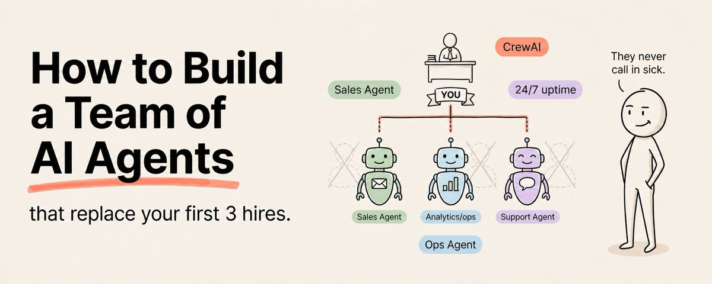

# 📰 How to Build a Team of AI Agents That Replace Your First 3 Hires (Full Course)

Every solo founder hits the same wall.

Save this :)

There is more work than one person can do. Revenue is coming in, but not enough to hire three full-time people at $60,000 a year each. So you keep doing everything yourself. Marketing, research, customer support, content, operations, bookkeeping.

You become the bottleneck for your own business.

In 2026, the smartest solo founders are not hiring their first three employees. They are building them.

Not in some far-off theoretical way. Right now, today, using Claude, MCP servers, and agentic workflows, you can build three AI agents that handle the three roles every early-stage business needs.

A research agent that handles market intelligence, competitor analysis, and opportunity identification.

A content agent that handles ideation, drafting, editing, and repurposing across every channel you publish on.

An operations agent that handles email triage, meeting prep, weekly reporting, and administrative tasks that eat your day alive.

These are not chatbots. They are systems. Each one has a defined role, a set of tools, a knowledge base, and a workflow that runs with minimal supervision.

Here is exactly how to build all three.

## Agent 1: The Research Agent

What It Does

This agent is your full-time market intelligence analyst.

It monitors your competitors, tracks industry trends, identifies opportunities, and delivers weekly briefs that tell you exactly what is changing in your space and what you should do about it.

Most founders do research reactively. Something happens and they scramble to understand it. A research agent does it proactively. It watches the landscape continuously and alerts you to changes before your competitors notice them.

How to Build It

Start with the knowledge base. Feed it everything about your industry. Your top ten competitors. Their products, pricing, positioning, and recent announcements. Your target market. Your ideal customer profile. The industry publications and thought leaders you follow.

Then give it tools. An MCP server connected to a web search API so it can monitor the internet for relevant news and updates. A connection to your Google Drive or Notion so it can access your existing research. A connection to your email so it can flag incoming messages that contain competitive intelligence.

Finally, give it a workflow. Every Monday morning it runs a sweep. It checks competitor websites, searches for industry news, scans relevant social channels, and compiles everything into a structured brief. The brief lands in your inbox before you start your week.

The Prompt Architecture

Your research agent needs three prompt layers.

The system prompt defines its role, expertise, and output standards. It is an experienced market analyst specializing in your industry who produces concise, actionable intelligence briefs.

The workflow prompt defines what it does each cycle. Check these sources. Look for these signals. Compare against last week's brief. Flag anything that changed. Prioritize by potential impact on the business.

The output prompt defines the format. Executive summary at the top. Three key developments with context. One recommended action per development. Links to sources. Everything on one page.

What to Do

- Write the complete system prompt for your research agent

- Set up MCP servers for web search, Google Drive, and email access

- Build the weekly workflow that runs every Monday

- Test it for three weeks and refine based on what it misses or gets wrong

- Tune the output format until the brief is genuinely useful, not just long

## Agent 2: The Content Agent

What It Does

This agent handles the full content lifecycle for your business.

Ideation, research, first drafts, editing, formatting, repurposing, and scheduling. It takes your content strategy and turns it into actual published content across every channel you care about.

The most time-consuming part of content creation is not the creative work. It is the production work. Formatting posts, writing variations, repurposing across platforms, scheduling, tracking performance. Your content agent handles all of it.

How to Build It

Start with your voice and brand documents. Every piece of content this agent produces needs to sound like you. Feed it your top 20 best performing posts, your style guide, your audience profile, your content pillars, and your anti-examples.

Give it tools. A connection to your CMS or scheduling platform. Web search for research. Access to your analytics so it can see which content performed best and adjust accordingly.

Build the workflow. At the beginning of each month, it generates 30 content ideas based on your pillars and current trends. It drafts all 30 pieces. It runs each one through an editing pass that checks against your style guide. It repurposes each long-form piece into short-form variants. It presents everything for your final review.

The Critical Difference: Quality Gates

The reason most AI content feels generic is that people publish first drafts.

Your content agent must have quality gates. After every draft, it scores the output on voice match, hook strength, value density, and originality. Anything below your threshold gets automatically rewritten. This loop runs until every piece meets your standard.

Then you do a final human pass. Add personal stories, insider perspectives, and hot takes that only you can provide. The agent handles 80% of the production. You handle 20% of the soul.

What to Do

- Build your complete voice and brand context document

- Set up MCP servers for web search and your publishing platform

- Build the monthly content workflow from ideation to final output

- Create quality scoring prompts that enforce your standards

- Test with ten pieces, refine, then scale to a full month

## Agent 3: The Operations Agent

What It Does

This is your chief of staff.

It handles the operational work that eats hours out of every founder's day. Email triage. Meeting preparation. Weekly reporting. Follow-up tracking. Data collection. Administrative tasks that are important but should not require your best thinking.

Most founders spend 1 to 2 hours a day on operational tasks. An operations agent cuts that to 15 minutes of review.

How to Build It

Give it access to your email, calendar, and project management tools through MCP servers.

Build three core workflows.

Email triage: Every morning it reads your inbox, categorizes each email by urgency and topic, drafts responses for anything routine, and flags anything that needs your personal attention. You review the flags and approve the drafts.

Meeting prep: Before every meeting it pulls the relevant documents, summarizes the last interaction with that person, lists open action items, and creates a one-page brief. You walk into every meeting prepared in 60 seconds.

Weekly reporting: Every Friday it compiles your key metrics, summarizes what got done, flags what did not, and identifies the top three priorities for next week. You start every Monday with perfect clarity.

What to Do

- Set up MCP servers for email, calendar, and your project management tool

- Build the email triage workflow with categories and urgency levels specific to your business

- Build the meeting prep workflow with templates for different meeting types

- Build the weekly reporting workflow with your key metrics defined

- Run all three for two weeks and refine based on what needs human judgment and what does not

## How to Make All Three Agents Work Together

The real power comes when your agents share information.

Your research agent discovers a competitor launched a new feature. It flags this in the weekly brief. Your content agent picks up the flag and creates three pieces of content responding to the competitive move. Your operations agent sends you a prepared email draft reaching out to customers who might be affected.

That is not three separate tools. That is a team.

Build a shared knowledge base that all three agents can read and write to. When the research agent discovers something, it adds it to the shared base. The content agent and operations agent check the shared base at the start of every workflow.

This shared memory is what transforms three independent agents into a coordinated team.

## The Honest Math

Three full-time employees at $60,000 a year each costs $180,000 annually plus benefits, management overhead, onboarding time, and all the risk that comes with early-stage hiring.

Three AI agents cost your Claude subscription and the time it takes to build them.

The agents will not do everything a human would do. They will not have judgment calls, emotional intelligence, or creative breakthroughs. You still need humans eventually.

But for the first 12 to 18 months of a business, when every dollar matters and every hour counts, three well-built AI agents can cover 70 to 80 percent of what those three hires would have done.

That is the difference between staying stuck as a solo operator and scaling like a funded startup.

Build the research agent first. It takes one week. Then build the content agent. Another week. Then the operations agent. Another week.

Three weeks from now you either have three agents working for you 24 hours a day.

Or you are still doing everything yourself.

Follow me [@eng\_khairallah1](https://x.com/@eng_khairallah1) for more automation architectures, workflow designs, and business AI playbooks.

hope this was useful for you, Khairallah [❤️](https://abs.twimg.com/emoji/v2/svg/2764.svg)

### 🖼️ Attached Media

## 💬 Replies

### 1 @DD____ (DD ❤️DOGE /🕊️)

*Tue May 05 09:35:51 +0000 2026*

@eng\_khairallah1 Spot on article

### 2 @eng_khairallah1 (Khairallah AL-Awady) (Author)

*Tue May 05 09:37:10 +0000 2026*

@DD\_\_\_\_ lets gooooo

### 3 @exploraX_ (m0h)

*Tue May 05 10:10:51 +0000 2026*

@eng\_khairallah1 the guide for building your one man million dollar dollar company.

### 4 @eng_khairallah1 (Khairallah AL-Awady) (Author)

*Tue May 05 10:54:13 +0000 2026*

@exploraX\_ a lot of money habibi

### 5 @_Jamisky (©️Jamisky)

*Tue May 05 09:36:24 +0000 2026*

@eng\_khairallah1 How about how to build a team of this? 

### 6 @eng_khairallah1 (Khairallah AL-Awady) (Author)

*Tue May 05 09:36:55 +0000 2026*

@\_Jamisky lmaooooooo 🤣🤣🤣🤣🤣

### 7 @emptystdotcom (jimmy)

*Tue May 05 09:38:57 +0000 2026*

@eng\_khairallah1 spot on

### 8 @eng_khairallah1 (Khairallah AL-Awady) (Author)

*Tue May 05 09:43:37 +0000 2026*

@emptystdotcom lfggggg

### 9 @i_am_vickyd (Cmvng)

*Tue May 05 09:34:30 +0000 2026*

@eng\_khairallah1 Another banger article... Time to study

### 10 @eng_khairallah1 (Khairallah AL-Awady) (Author)

*Tue May 05 09:34:45 +0000 2026*

@i\_am\_vickyd lets goooo habibi

### 11 @Av1dlive (Avid)

*Tue May 05 09:40:00 +0000 2026*

@eng\_khairallah1 W khair

### 12 @eng_khairallah1 (Khairallah AL-Awady) (Author)

*Tue May 05 09:43:44 +0000 2026*

@Av1dlive big W habibi

### 13 @CodeByPoonam (Poonam Soni)

*Tue May 05 12:31:28 +0000 2026*

@eng\_khairallah1 Excellent guide

### 14 @mhdfaran (Farhan)

*Tue May 05 10:04:28 +0000 2026*

@eng\_khairallah1 one of the best articles i have seen recently.

### 15 @cyrilXBT (CyrilXBT)

*Tue May 05 12:32:02 +0000 2026*

@eng\_khairallah1 Good share bro

### 16 @0x_Samir (0xSamir)

*Tue May 05 09:35:52 +0000 2026*

@eng\_khairallah1 

### 17 @rohit4verse (Rohit)

*Tue May 05 10:09:01 +0000 2026*

@eng\_khairallah1 Crazy one

### 18 @alphabatcher (Alpha Batcher)

*Tue May 05 11:35:11 +0000 2026*

@eng\_khairallah1 daily article banger from Khairallah : completed

### 19 @codewithhajra (H A J R A)

*Tue May 05 12:40:52 +0000 2026*

@eng\_khairallah1 Great share

### 20 @Damn_coder (D-Coder)

*Wed May 06 05:51:07 +0000 2026*

@eng\_khairallah1 Excellent guide. Appreciate your sharing

### 21 @emelucrypto (emelu)

*Tue May 05 17:13:05 +0000 2026*

@eng\_khairallah1 with team of agents, no need for hires

### 22 @neil_xbt (NeilXbt)

*Tue May 05 18:44:32 +0000 2026*

@eng\_khairallah1 Very detailed article, fam, really enjoyed it!

### 23 @0xdelula (delulaᴗ✧)

*Tue May 05 13:22:34 +0000 2026*

@eng\_khairallah1 research agent alone could save founders hours

### 24 @gerardsans (Gerard Sans | Axiom 🇬🇧)

*Wed May 06 21:54:46 +0000 2026*

@eng\_khairallah1 [x.com/gerardsans/sta…](https://x.com/gerardsans/status/2048775578409476398)

### 25 @painn_x (painn)

*Tue May 05 09:36:35 +0000 2026*

@eng\_khairallah1 khai strikes again

### 26 @Toobbss (Tobi)

*Tue May 05 09:57:29 +0000 2026*

@eng\_khairallah1 Thanks for sharing this

### 27 @web3_tech_ (jeff)

*Tue May 05 11:18:39 +0000 2026*

@eng\_khairallah1 Love this article

### 28 @notjazii (J A Z I I)

*Tue May 05 09:39:52 +0000 2026*

@eng\_khairallah1 Love the banger bro

planning to join hackathons so I'll make my whole team agents that can help me alot

### 29 @shushant_l (Shushant Lakhyani)

*Tue May 05 11:45:10 +0000 2026*

@eng\_khairallah1 anyone can build a team of AI agents now

### 30 @fllowlly (Fllowlly)

*Wed May 06 11:41:00 +0000 2026*

@eng\_khairallah1 Good read for solo founder

### 31 @qingqingdilaiP (轻轻地来🕯️🕯️🕯️-2 （Pray for Charlie Kirk ! ))

*Wed May 06 06:24:57 +0000 2026*

@eng\_khairallah1 down grade the cost with
 Local LLM deployment

### 32 @AWar1586398 (A War)

*Thu May 07 13:02:15 +0000 2026*

@eng\_khairallah1 Examples of the prompts would be helpful. Never sure how detailed they should be.

### 33 @aias_0 (Coffee fans)

*Tue May 05 09:36:54 +0000 2026*

@eng\_khairallah1 Nice find. I’ll save this for a quiet afternoon when I can actually take it in.

### 34 @dwinetri (Binoculars)

*Wed May 06 03:08:36 +0000 2026*

@eng\_khairallah1 this guy has nailed it [medium.com/@dilip.chenani…](https://medium.com/@dilip.chenani/spec-driven-development-a-practical-framework-for-building-software-with-ai-57bba5051c0f)

### 35 @Chingiz92MI (Chingiz Mammadov)

*Wed May 06 04:37:05 +0000 2026*

@eng\_khairallah1 Okay, but what about the price? I create new session every 15-20 minutes and it is not enough, even with 100$ subscription. How it will clear context and start new session?🙈

### 36 @ai_super_niko (Niko爱学习)

*Wed May 06 14:33:39 +0000 2026*

@eng\_khairallah1 Some personal insights and reflections：[x.com/ai\_super\_niko/…](https://x.com/ai_super_niko/status/2051817587064136094)

