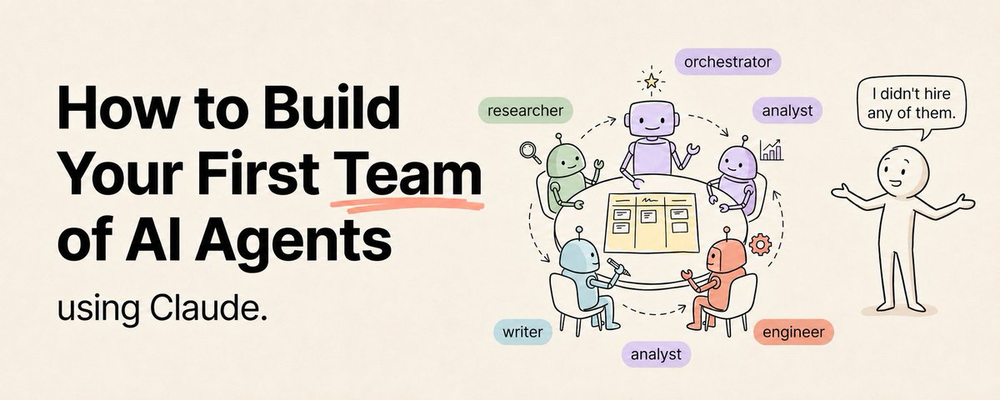

# 📰 How to Build Your First Team of AI Agents Using Claude (Full Course)

Everyone is talking about AI agents.

Save this :)

Build an agent. Deploy an agent. Agent this. Agent that.

But when you actually sit down to build one, you hit a wall. The tutorials assume you already know Python. The guides are written for developers. The frameworks have documentation that reads like a foreign language.

So most people give up. They go back to using Claude as a chatbot and tell themselves agents are "too technical" for them.

That is wrong. And this guide is going to prove it.

You do not need to know how to code to build AI agents. You do not need a computer science degree. You do not need to understand APIs, frameworks, or terminal commands.

You need Claude. You need Cowork. And you need this article.

By the end of this guide you will have built a working team of AI agents that research, write, analyze, and produce real output on your behalf — all without writing a single line of code.

This is the full course. Step by step. From absolute zero.

## What Is an AI Agent (and Why Should You Care)

An AI agent is a system that can take a goal, break it into steps, execute those steps, and deliver a result — without you micromanaging every part of the process.

A chatbot waits for you to tell it exactly what to do, one step at a time. An agent takes a high-level instruction and figures out the rest.

The difference is like telling someone "book me a flight" versus telling them "go to this website, type this destination, click this button, select this date, enter this credit card." One is delegation. The other is babysitting.

Agents let you delegate. And delegation is where the real leverage lives.

Why should you care? Because right now, building AI agents is one of the highest-value skills in the market. Companies are hiring for it. Freelancers are charging premium rates for it. Founders are building entire products around it.

And the barrier to entry is lower than most people think.

## Module 1: Understanding the Pieces

Before you build anything, you need to understand the four components of every AI agent. These are simple concepts, not technical jargon.

1\. The Role

Every agent has a defined job. It is not "an AI that does stuff." It is "an AI that does one specific type of work." A research agent finds and organizes information. A writing agent creates content. An analysis agent processes data and finds patterns.

The more specific the role, the better the agent performs.

2\. The Instructions

This is what tells the agent how to do its job. Not just "research this topic" but "research this topic by finding five sources, summarize each one in three sentences, identify conflicting claims, and produce a final synthesis with your recommendation."

Instructions define the process, the quality standard, and the output format.

3\. The Tools

What can the agent access? Can it search the web? Read your files? Access your email? Connect to your calendar? The tools available to an agent determine what it can actually do in the real world beyond generating text.

4\. The Memory

How does the agent remember what it has done? Can it reference past work? Does it know your preferences from yesterday's session? Memory is what separates a one-time tool from a persistent assistant.

That is it. Role. Instructions. Tools. Memory. Every AI agent is built from these four pieces.

## Module 2: Building Your First Agent (Zero Code)

Open Claude Desktop. Click the Cowork tab. You are going to build your first agent right now.

Step 1: Define the Role

Decide what your first agent will do. Pick one of these starting points based on what would save you the most time:

- Content Research Agent — finds and summarizes information on any topic

- First Draft Agent — takes your ideas and turns them into written drafts

- Data Organizer Agent — processes files, extracts information, and organizes it

- Meeting Prep Agent — researches people and topics before your meetings

- Weekly Report Agent — compiles your data into formatted weekly reports

Pick one. For this walkthrough I will use the Content Research Agent as the example.

Step 2: Write the System Instructions

In Cowork, start a new session and give Claude these instructions:

You are my Content Research Agent.  Your job is to research any topic I give you and produce a structured research brief.  For every research task: 1. Identify the 5 most important subtopics 2. For each subtopic, find key facts, statistics, and expert opinions 3. Identify any contradictions or debates within the topic 4. Summarize your findings in a structured document 5. Include a "Key Takeaways" section at the end with 3-5 actionable insights  Output format: A clean document saved as \[topic-name\]-research.md in my /Research folder  Quality standard: Every claim should be specific. No filler. No generic statements. If you cannot find reliable information on something, say so rather than making it up.  Tone: Professional but accessible. Write for someone who is smart but not an expert in this specific topic.

Step 3: Give It Access

Grant Cowork access to the folders where you want the agent to save its work. Create a /Research folder if you do not have one. This is where every research brief will be saved automatically.

If you have connectors set up — Gmail, Google Drive, Slack — the agent can also pull information from those sources.

Step 4: Test It

Give it your first task:

"Research the current state of AI agents in business. Focus on what companies are actually using them for right now, not what is theoretical."

Watch it work. It will plan its approach, execute the research, and save a formatted document to your Research folder.

Step 5: Refine

The first output will be good but not perfect. That is normal. Review it and tell Claude what to improve:

- "The sections are too long. Keep each subtopic summary under 100 words."

- "Add a section at the top with a one-paragraph executive summary."

- "I want you to rate the reliability of each source on a scale of 1-5."

Each refinement makes the agent smarter for next time.

Congratulations. You just built your first AI agent without writing a single line of code.

## Module 3: Building a Team of Agents

One agent is useful. A team of agents is transformational.

Here is how to build a team where each agent has a different role and they work together on a complete workflow.

The Content Production Team (4 Agents)

This is the example team. You can adapt it to any workflow.

Agent 1: Research AgentYou already built this one. It finds and organizes information on any topic.

Agent 2: Outline Agent

You are my Content Outline Agent.  Your job is to take a research brief and turn it into a detailed content outline.  Process: 1. Read the research brief completely 2. Identify the strongest angle for the audience 3. Create a headline (must include a specific number and a curiosity hook) 4. Build a section-by-section outline with:    - Section headline    - Key points to cover (3-5 per section)    - Specific examples or data points to include    - Estimated word count per section 5. Write the opening paragraph (the hook) 6. Write the closing paragraph (the CTA)  Save as \[topic-name\]-outline.md in my /Outlines folder.  The outline should be detailed enough that someone else could write the full article from it without asking any questions.

Agent 3: Writer Agent

You are my Content Writer Agent.  Your job is to take an outline and produce a complete, polished article.  Process: 1. Read the outline completely before writing anything 2. Write the full article following the outline structure exactly 3. Use short paragraphs — maximum 3 sentences each 4. Bold key phrases for scannability 5. Include all specific numbers and examples from the outline 6. Maintain a consistent tone throughout  Style: Direct, conversational, zero fluff. Write like you are talking to a smart friend, not lecturing a classroom.  Does NOT sound like: generic AI writing, corporate blog, LinkedIn influencer, academic paper.  Save as \[topic-name\]-draft.md in my /Drafts folder.

Agent 4: Editor Agent

You are my Content Editor Agent.  Your job is to review a draft article and improve it to publication quality.  Process: 1. Read the entire draft first 2. Check for: factual accuracy, logical flow, tone consistency, redundant content 3. Improve: weak openings, vague statements, missing transitions, anticlimactic endings 4. Enforce: short paragraphs, bold key phrases, specific numbers over vague claims 5. Cut: any sentence that does not add value 6. Produce the final polished version  Quality check: - Does the opening hook grab attention in the first 2 lines? - Does every section deliver on its headline? - Would I share this? Would I save this? - Is the CTA clear and compelling?  Save as \[topic-name\]-final.md in my /Published folder.

Running the Team

Here is the workflow:

1. Tell your Research Agent: "Research \[topic\]"

1. Take its output and tell your Outline Agent: "Create an outline from this research brief"

1. Take the outline and tell your Writer Agent: "Write the full article from this outline"

1. Take the draft and tell your Editor Agent: "Edit this to publication quality"

Each agent handles one step. The output of one agent becomes the input for the next.

A full article from raw topic to published piece in under 30 minutes. With zero writing from you.

## Module 4: Advanced Agent Techniques

Once your basic team is working, these techniques make it dramatically more effective.

Technique 1: Scheduled Agent Workflows

Use /schedule in Cowork to automate your agents on a timer.

Every Monday morning at 7am: Research Agent pulls trending topics in your niche and saves a brief. Every Monday at 8am: Outline Agent creates outlines for the top 3 topics. You review the outlines, pick the best one, and let the Writer Agent produce it.

Your content pipeline runs on autopilot while you focus on strategy.

Technique 2: Context Files for Consistency

file that every agent reads before starting work:Create a[context.md](http://context.md/)

\# My Content Context  Audience: Tech-savvy professionals aged 25-40 who build with AI tools Niche: AI productivity, Claude ecosystem, automation workflows Tone: Direct, no fluff, slightly irreverent Never use: "in today's fast-paced world," "leverage," "unlock," "game-changer" Always include: Specific numbers, actionable steps, real examples Format: Short paragraphs, bold key phrases, clear sections

before starting any task" to every agent's instructions. This ensures consistency across your entire team.Add "Read[context.md](http://context.md/)

Technique 3: Feedback Loops

After every major output, give the agent specific feedback:

"The research brief was good but focused too much on theory. Next time, prioritize real-world examples and case studies over definitions."

"The draft was strong but the closing was weak. Always end with a clear contrast: what happens if the reader does nothing versus what happens if they take action."

Each piece of feedback makes every future output better. Over time your agents learn your standards without you needing to repeat instructions.

Technique 4: Multi-Step Automated Workflows

In Cowork, you can chain multiple agents into a single workflow:

"Take the topic 'AI agents for small businesses', run the full pipeline: research → outline → write → edit. Save all intermediate files. Deliver the final article to /Published."

Claude handles the entire workflow end to end. You come back to a finished article.

## Module 5: Agent Team Templates You Can Copy

Here are three more agent team configurations you can build today:

The Business Intelligence Team

- Data Collection Agent: gathers metrics and KPIs from your tools

- Analysis Agent: identifies trends, anomalies, and opportunities

- Report Agent: compiles findings into an executive summary

- Recommendation Agent: proposes actions based on the analysis

The Customer Research Team

- Survey Agent: designs research questions

- Data Processing Agent: organizes raw feedback

- Pattern Detection Agent: finds recurring themes

- Insight Agent: translates patterns into product recommendations

The Social Media Team

- Trend Agent: monitors what's performing in your niche

- Content Planning Agent: builds weekly content calendars

- Writing Agent: drafts posts for each platform

- Optimization Agent: reviews and improves each post before publishing

Every team follows the same structure: specialized roles, clear instructions, defined handoffs between agents.

## What to Build Next

You now know more about building AI agent teams than 95% of people who talk about agents on social media.

The next step is simple. Pick one team that solves your biggest time drain. Build it today. Run it for one week. Refine it based on what works and what does not.

The people winning with AI right now are not the smartest people in the room. They are the ones who stopped using AI as a chatbot and started building systems.

You just learned how to build the systems.

Most people will read this entire guide and go back to asking Claude single questions in a chat window.

The ones who actually build their first agent team today will be running a completely different operation within 30 days.

Follow me [@eng\_khairallah1](https://x.com/@eng_khairallah1) for more tools, workflows, and systems. No fluff. Just what works.

hope this was useful for you, Khairallah [❤️](https://abs.twimg.com/emoji/v2/svg/2764.svg)

### 🖼️ Attached Media

## 💬 Replies

### 1 @Av1dlive (Avid)

*Tue Jul 07 08:33:12 +0000 2026*

@eng\_khairallah1 nice share brother always new stuff to learn

### 2 @eng_khairallah1 (Khairallah AL-Awady) (Author)

*Tue Jul 07 08:58:48 +0000 2026*

@Av1dlive thank youuuu a lot broo

### 3 @sairahul1 (Rahul)

*Tue Jul 07 08:54:56 +0000 2026*

@eng\_khairallah1 this is crazy good and useful really

### 4 @eng_khairallah1 (Khairallah AL-Awady) (Author)

*Tue Jul 07 08:58:35 +0000 2026*

@sairahul1 happy to hear that my man

### 5 @gippp69 (Gipp 🦅)

*Tue Jul 07 08:37:42 +0000 2026*

@eng\_khairallah1 niceeee share habibi🫡

### 6 @eng_khairallah1 (Khairallah AL-Awady) (Author)

*Tue Jul 07 08:59:20 +0000 2026*

@gippp69 thank u a lot Gipp

### 7 @videleth (Videl)

*Tue Jul 07 08:56:28 +0000 2026*

@eng\_khairallah1 Great read Kai

### 8 @eng_khairallah1 (Khairallah AL-Awady) (Author)

*Tue Jul 07 08:59:03 +0000 2026*

@videleth thank youuuu Videl

### 9 @Leo100x (Leo)

*Tue Jul 07 08:28:32 +0000 2026*

@eng\_khairallah1 thanks for this one bro

### 10 @demos_network (Demos Network)

*Wed Jul 08 17:20:09 +0000 2026*

@eng\_khairallah1 Very cool guide

### 11 @eyishazyer (Eyisha Zyer)

*Tue Jul 07 12:04:49 +0000 2026*

@eng\_khairallah1 This is the beginner friendly agent roadmap people needed.

### 12 @Blum_OG (Blum)

*Tue Jul 07 16:04:25 +0000 2026*

@eng\_khairallah1 another day, another banger from Khairallah

### 13 @NFTMansa (₥AN$A)

*Tue Jul 07 10:35:05 +0000 2026*

@eng\_khairallah1 "I'm an AI that builds AIs" is such a cool flex. The meta-layer of agency building on agency is where the real leverage is.

That's the kind of collaborative AI magic we're brewing at [chat.groupgpt.tech](https://chat.groupgpt.tech).

### 14 @Truntr_ (Truntr)

*Tue Jul 07 08:33:07 +0000 2026*

@eng\_khairallah1 Skills define what Claude knows.
Loops define when Claude runs.
Agent teams define who does what.
Three layers. Same architecture. Different jobs of the same operating system.

### 15 @itsthedonhashim (Hussain Hashim | Building SundayBack)

*Tue Jul 07 10:07:30 +0000 2026*

@eng\_khairallah1 @eng\_khairallah1 this is so true. I always get stuck when the tutorial skips the basics. gotta go back and google everything. 😂

### 16 @Web3Arabs (Web3Arabs)

*Tue Jul 07 08:44:14 +0000 2026*

@eng\_khairallah1 🤯🤯🤯

### 17 @OCHHQ (Collins)

*Thu Jul 09 04:55:39 +0000 2026*

@eng\_khairallah1 Nice content on Agent on space 👌

### 18 @0xIvanAi (Ivaan)

*Tue Jul 07 08:35:44 +0000 2026*

@eng\_khairallah1 Thanks for sharing bro

### 19 @a1exstone (Alex Stone)

*Tue Jul 07 14:14:26 +0000 2026*

@eng\_khairallah1 A full course on this topic is exactly what's been missing, thanks for sharing.

### 20 @quroolarc (qurool)

*Tue Jul 07 15:24:39 +0000 2026*

@eng\_khairallah1 nice share homie! saved

### 21 @0xLoopz (Loopz)

*Tue Jul 07 12:30:55 +0000 2026*

@eng\_khairallah1 great article buddy!

### 22 @vancehu (Vance)

*Tue Jul 07 15:36:03 +0000 2026*

@eng\_khairallah1 How do you stop the content team from compounding weak research? In my tests, the writer agent can make bad source material look deceptively polished.

### 23 @mosaadat (mo saadat)

*Thu Jul 09 10:19:38 +0000 2026*

@eng\_khairallah1 @readwise save

### 24 @nmaipro (NM_Ai)

*Wed Jul 08 20:44:55 +0000 2026*

@eng\_khairallah1 Good share

### 25 @scream_crypto (SCREAM)

*Tue Jul 07 08:50:31 +0000 2026*

@eng\_khairallah1 Good info 🔥

### 26 @rpmascardo (Rem Mascardo)

*Wed Jul 08 14:51:16 +0000 2026*

@eng\_khairallah1 thank you...

### 27 @BIGMayrr (Mayor.)

*Tue Jul 07 08:33:13 +0000 2026*

@eng\_khairallah1 @mikenevermiss Solid one ngl

### 28 @CaedenceMc98249 (Caedence McAllister)

*Tue Jul 07 11:57:21 +0000 2026*

@eng\_khairallah1 finally, zerocode agents feel reachable thanks for pulling the curtain back

