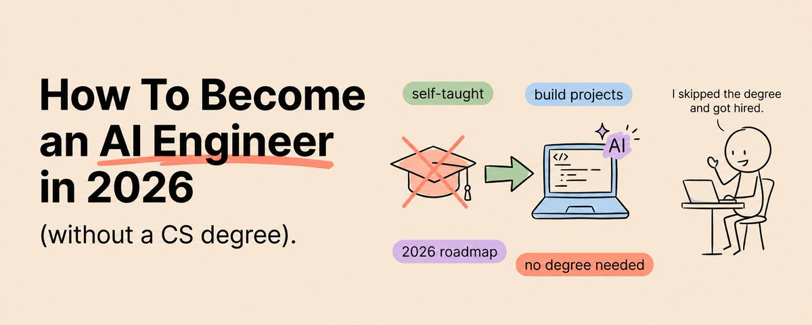

# 📰 How To Become An AI Engineer in 2026 (Without a CS Degree)

Most people think you need a computer science degree to work in AI.

Save this :)

A small group of people figured out that the highest-paid building role in tech right now doesn't care what your diploma says. It cares what you've shipped.

The difference between those two groups is not credentials.

It is a portfolio.

An AI engineer is the person who builds the systems that connect large language models to real products. The support bot that actually resolves the ticket. The internal search that finds the answer buried in ten thousand documents. The agent that runs a multi-step workflow without a human babysitting it. This is not research. It is not training models from scratch. It is building production software with AI at the core, and it is one of the most in-demand jobs in the entire market.

Here is the part nobody told you. For the majority of these roles, a portfolio of shipped projects carries more weight than a degree. Hiring managers will tell you plainly that they've watched self-taught engineers run circles around PhD holders, because shipping is a different skill than studying. The credential gate is mostly an illusion, and the people who realize it early get years ahead of the people still waiting for permission.

This is the path. No degree required. Here's exactly what it looks like.

## First, Understand What This Job Actually Is

Before you learn anything, get the role clear in your head, because most people aim at the wrong target.

There are two roles people confuse. The machine learning researcher invents new models and trains them. That work genuinely benefits from advanced degrees and heavy math, and it's a small slice of the market. The AI engineer takes models that already exist and builds useful things with them. That work rewards software skill, product sense, and shipping discipline far more than academic credentials. The vast majority of open roles and the ones you can break into without a degree are the second kind.

You're aiming to become the engineer who builds with AI, not the scientist who builds the AI. That distinction will save you from wasting months on math you don't need yet.

The role sits at the intersection of three things: software engineering, a working understanding of how language models behave, and product thinking. You don't need to be elite at all three on day one. You need to be competent and improving, and you need proof.

## Phase 1 (Months 1–3): Learn to Code Properly

This is the step you cannot skip, and the step most people try to skip.

You must be able to write real, working code before anything else makes sense. Python is the language. Almost every AI library, framework, and tool is built for Python first, so this is not a preference, it's the standard.

Spend these months getting genuinely comfortable. Not "I watched a tutorial" comfortable. "I can build a small program from a blank file without looking up basic syntax" comfortable. Variables, data types, control flow, functions, working with files, calling APIs, handling errors, and reading other people's code. Learn how to use Git and put everything on GitHub from day one, because your GitHub is the first half of your portfolio.

If the math worry is nagging at you, set it down. You need comfort with basic statistics and a feel for how numbers behave. You do not need to master linear algebra and calculus to start building with LLMs. The deep math matters for research; you're building. Pick it up later if a specific project demands it.

What to Do This Phase

- Complete a structured Python course and write code every single day, even thirty minutes

- Build five tiny programs from scratch: a calculator, a file organizer, a script that calls a public API, a simple data cleaner, a command-line note taker

- Learn Git fundamentals and push all five projects to a public GitHub

- Join one community of people doing the same thing so you're not learning in a vacuum

## Phase 2 (Months 3–5): Master the LLM API

Now you start working with the thing that defines the job.

The chat interface is the consumer product. AI engineers work through the API, sending requests from their own code and handling the responses programmatically. This is where the real leverage lives, and getting fluent here is the moment you stop being a user and start being a builder.

Learn to send messages to a model from your own script. Learn to handle streaming responses, manage conversation history, control output format, and deal with rate limits and errors gracefully. Learn the difference between a prompt that gets a decent answer and a prompt that gets a precise, repeatable, production-ready answer every time, because in a real product "usually right" is a bug.

This is also where you learn tool use, sometimes called function calling. This is how you let a model take actions: call a function, query a system, fetch data. The moment you understand tool use, the whole world of agents opens up, because agents are just models with tools and a loop.

What to Do This Phase

- Get an API key and make your first call from a Python script in your first hour

- Build a command-line tool that takes any text you paste and does something useful with it

- Build a chatbot with memory that remembers earlier parts of the conversation

- Implement tool use: give the model one function it can call, and make it call it correctly

## Phase 3 (Months 5–7): Build RAG Systems

This is the skill that gets people hired, because it's what most real AI products are actually doing under the hood.

RAG stands for retrieval-augmented generation, and the idea is simple once you see it. A model only knows what it was trained on and what you put in front of it. RAG is the technique of fetching the right information from your own data and putting it in front of the model so it answers accurately about things it was never trained on. Your company's documents. A product manual. A knowledge base.

You'll learn to break documents into chunks, turn those chunks into embeddings (numerical representations of meaning), store them in a vector database, and retrieve the most relevant ones for any given question. Then you feed those to the model and get a grounded, sourced answer instead of a confident guess.

Building one RAG application that actually works, end to end, with real documents, puts you ahead of a huge share of people who only talk about AI. This is portfolio project number one.

What to Do This Phase

- Learn how embeddings and vector databases work, conceptually first, then in code

- Build a RAG app over a real document set: your own notes, a set of PDFs, a wiki

- Add proper retrieval evaluation: is it actually finding the right chunks, or just nearby ones?

- Deploy it somewhere a stranger can use it, even a simple hosted version

## Phase 4 (Months 7–9): Build Agents

Now you build the thing everyone is talking about and few can actually deliver.

An agent is a model that can take a goal, break it into steps, use tools to complete each step, and decide what to do next based on what happened. A RAG app answers a question. An agent gets a job done.

You already learned tool use in Phase 2. Now you learn to put it in a loop with a goal, give the agent multiple tools, and handle the messy reality that agents sometimes go in circles, call the wrong tool, or get stuck. Learning to build agents that are reliable, not just impressive in a demo, is exactly the skill the market is starving for.

The honest part: a demo agent is easy and a reliable agent is hard. The gap between the two is failure handling, clear tool design, and evaluation. Spend your effort there, because that gap is precisely what separates a hireable engineer from someone with a flashy video.

What to Do This Phase

- Build a single-agent system that uses several tools to complete a real multi-step task

- Build a small multi-agent system where two or more agents collaborate or check each other

- Add explicit failure handling: what the agent does when a tool fails or returns nothing

- Make this portfolio project number two: a multi-agent system that solves a real problem

## Phase 5 (Months 9–11): Learn Evaluation and Deployment

This is the boring phase that makes you employable, and it's the one amateurs skip entirely.

Anyone can get an AI feature to work once. Companies pay for things that work the ten-thousandth time. The skills that prove you can do that are evaluation and deployment.

Evaluation means building a way to measure whether your system is actually good, and whether a change made it better or worse. For generation tasks you'll measure things like factual accuracy, relevance, and consistency against reference answers, sometimes using another model to score outputs, sometimes using human review. An engineer who builds evals is an engineer who can be trusted with production.

Deployment means getting your system out of your laptop and into the world: hosting it, monitoring it, handling load, watching costs, and catching failures before users do. This cluster of skills is sometimes called MLOps, and even a basic grasp of it makes you dramatically more hireable than someone who can only build on their own machine.

What to Do This Phase

- Build an evaluation suite for one of your earlier projects with a set of test cases and scoring

- Take one project and deploy it properly with monitoring and basic cost tracking

- Make this portfolio project number three: a deployed system with evaluation and monitoring

- Document what you measured and how you'd improve it, because thinking out loud is a hireable signal

## Phase 6 (Months 11–12): Get Hired

The final phase isn't about new technical skills. It's about making sure the right people see what you've built.

By now you have three real projects: a RAG application with evaluation, a multi-agent system that solves a real problem, and a deployed system with monitoring. That portfolio opens more doors than a master's degree for most AI engineering roles. The work now is positioning.

Write up each project as a clear case study: the problem, your approach, what you measured, what you'd do differently. Build in public, share your process, and post your breakdowns. The field is moving so fast that visible, consistent builders get noticed quickly. Then apply, and apply to the right tier. The realistic entry path is often an AI-augmented software engineering role first, then a full AI engineer role, with salaries commonly landing somewhere from roughly $120K at entry up past $200K with experience, depending heavily on company and location.

When the interview asks you to "reason about how an agent should handle a tool failure" or "explain how you'd evaluate a RAG system," you won't be reciting theory. You'll be describing what you actually did. That's the whole game.

What to Do This Phase

- Write a clear case study for each of your three portfolio projects

- Publish at least one technical breakdown showing how you built something hard

- Apply broadly, including AI-augmented software roles as a realistic first step

- In interviews, talk about what you shipped and what you'd improve, not what you memorized

## The Honest Truth About This Path

Twelve months is a real timeline, and it only works if you're building the entire time.

Reading about AI engineering is not becoming an AI engineer. Watching tutorials is not building a portfolio. The people who come out of this employed are the ones who shipped something every single phase and weren't precious about it being perfect. The ones who stay stuck are the ones who kept "preparing" and never put anything in front of a real user.

And here's the question on everyone's mind, so let's answer it: if AI writes so much code now, why learn this at all? Because someone has to design the system, integrate it, evaluate whether the output is correct, and decide what to build. AI tools make a skilled AI engineer more valuable, not obsolete. The person who can direct these tools and judge their output is exactly the person the market is paying for. You're not learning to compete with the tools. You're learning to command them.

The credential gate that's keeping most people out is one most companies have already stopped enforcing.

A year from today you can either still be telling yourself you need a degree first.

Or you can be the engineer with three shipped projects that prove you never did.

The only thing standing between you and Phase 1 is opening a blank file today.

If you found this useful, follow me @eng\_khairallah1 for more AI content like this. I post breakdowns, courses, and tools every week.

hope this was useful for you, Khairallah [❤️](https://abs.twimg.com/emoji/v2/svg/2764.svg)

### 🖼️ Attached Media

## 💬 Replies

### 1 @sairahul1 (Rahul)

*Tue Jun 23 08:57:01 +0000 2026*

@eng\_khairallah1 bro. this is gold

### 2 @eng_khairallah1 (Khairallah AL-Awady) (Author)

*Tue Jun 23 08:59:15 +0000 2026*

@sairahul1 thank youu my man

### 3 @Av1dlive (Avid)

*Sun Jun 28 19:19:12 +0000 2026*

@eng\_khairallah1 Thanks for sharing.

### 4 @eng_khairallah1 (Khairallah AL-Awady) (Author)

*Sun Jun 28 19:21:00 +0000 2026*

@Av1dlive my pleasure habibi 🫶🫶

### 5 @Av1dlive (Avid)

*Tue Jun 23 09:45:55 +0000 2026*

@eng\_khairallah1 Good one

### 6 @eng_khairallah1 (Khairallah AL-Awady) (Author)

*Tue Jun 23 09:46:34 +0000 2026*

@Av1dlive and absolutely the best one

### 7 @Web3Arabs (Web3Arabs)

*Tue Jun 23 08:52:53 +0000 2026*

@eng\_khairallah1 😍😍

### 8 @eng_khairallah1 (Khairallah AL-Awady) (Author)

*Tue Jun 23 08:59:28 +0000 2026*

@Web3Arabs 🙌🙌

### 9 @videleth (Videl)

*Tue Jun 23 08:58:39 +0000 2026*

@eng\_khairallah1 great article brother

### 10 @eng_khairallah1 (Khairallah AL-Awady) (Author)

*Tue Jun 23 08:59:22 +0000 2026*

@videleth thank youuu Videl

### 11 @kepochnik (kepo)

*Tue Jun 23 10:19:31 +0000 2026*

@eng\_khairallah1 new day, new banger article

will QRT you soon

### 12 @Blum_OG (Blum)

*Tue Jun 23 15:40:31 +0000 2026*

@eng\_khairallah1 when it comes to CS, formal education matters less and less

what matters is how ambitious people are about learning and proving it

### 13 @cyrilXBT (CyrilXBT)

*Sun Jun 28 19:40:31 +0000 2026*

@eng\_khairallah1 Alpha my man

### 14 @neil_xbt (NeilXbt)

*Wed Jun 24 00:03:54 +0000 2026*

@eng\_khairallah1 loved this write-up!

### 15 @aziz4ai (AZIZ | AI 🇸🇦)

*Fri Jul 03 14:28:03 +0000 2026*

@eng\_khairallah1 Bookmarked 💎

### 16 @Kryp_Toon (KrypToon)

*Thu Jun 25 11:10:43 +0000 2026*

@eng\_khairallah1 Good morning

### 17 @alphabatcher (Alpha Batcher)

*Tue Jun 23 17:22:32 +0000 2026*

@eng\_khairallah1 become an AI Engineer it's like a dream for me

### 18 @malhanis69 (Malhanis)

*Wed Jun 24 13:10:32 +0000 2026*

@eng\_khairallah1 thanks bro, bookmarked

### 19 @salvazion_ (Salvazion)

*Mon Jul 27 01:55:00 +0000 2026*

@eng\_khairallah1 Congratulations on your article, very interesting. By 2026 it will be a reality. We need to encourage more founders of purpose-driven startups. [x.com/salvazion\_/sta…](https://x.com/salvazion_/status/1801658507155870121)

### 20 @gaoooric (eric gao)

*Thu Jul 23 23:58:29 +0000 2026*

@eng\_khairallah1 @pangram ai?

### 21 @SpoogemanGhost (Voltage (Fella))

*Wed Jul 08 06:05:27 +0000 2026*

@eng\_khairallah1 I am Extremely grateful for this post sir, thank you! This is exactly the path I must walk, given my long experience in ISP engineering and operations since 1992 (Sojourn Systems Ltd). Now my path is clear, I will follow this to the letter. Cheers to you! 🙏👏

### 22 @aritj (Ari Tjahjawandita)

*Wed Jul 01 19:26:05 +0000 2026*

@eng\_khairallah1 @threadreaderapp unroll

### 23 @Dalkilic_Alper (Alperen.Dalkilic)

*Wed Jul 29 23:38:46 +0000 2026*

@eng\_khairallah1 @summarize\_that please summarize

### 24 @aiseomastery (AI Mastery Guide)

*Wed Jun 24 04:34:28 +0000 2026*

@eng\_khairallah1 build projects over chasing a degree on paper still feels like the right call for getting hired in this field

### 25 @_parsimei (RoberKay)

*Mon Jun 29 04:37:38 +0000 2026*

@eng\_khairallah1 "The only thing standing between you and Phase 1 is opening a blank file today".I love this.

### 26 @johnolisa_ (The Bloomer 👨🏼‍💻)

*Mon Jun 29 05:12:08 +0000 2026*

@eng\_khairallah1 Hi @eng\_khairallah1 I have gone thru this article abs it’s very helpful and remarkable.
Want to ask, What do you think is the best course to take for a beginner wanting to start AI engineering?? Python programming also.

### 27 @StuyBoyNY (StuyBoy From NYC)

*Sat Jun 27 13:51:19 +0000 2026*

@eng\_khairallah1 @readwise save

### 28 @devloperhs (harsh)

*Sun Jun 28 06:00:13 +0000 2026*

@eng\_khairallah1 This is the kind of playbook , I would follow if I had to start over.

### 29 @cyrilgupta (Cyril Gupta)

*Thu Jul 02 15:24:27 +0000 2026*

@eng\_khairallah1 Computer Science degree is not waste, if you have it. It becomes a plus for you

### 30 @EliaAlberti (EliaAlberti)

*Fri Jun 26 08:38:17 +0000 2026*

@eng\_khairallah1 The concepts are the easy part. 

What slowed me down was redoing the same setup for every agent: model wiring, layout, approval gates. 

I made a Claude Code skill that scaffolds a runnable LangChain agent in one command, any model incl local: 

[github.com/EliaAlberti/dc…](https://github.com/EliaAlberti/dcode-agent-kit)

### 31 @lawal_tolu6 (TOLU ☆)

*Mon Jun 29 09:41:50 +0000 2026*

@eng\_khairallah1 bookmarked

### 32 @Jagadeeshveera (Jagadeesh Veeraraghavan)

*Sat Jun 27 06:53:11 +0000 2026*

@eng\_khairallah1 “@threadreaderapp unroll”

### 33 @Definite_dev (Independent George)

*Thu Jul 02 02:15:03 +0000 2026*

@eng\_khairallah1 This was relevant a year ago.  The job market is getting saturated, it's already too late for this portfolio strategy to work.

### 34 @Olamphzy (Olamphzy)

*Mon Jun 29 08:31:22 +0000 2026*

@eng\_khairallah1 This is really amazing with every breakdown, thanks bud

### 35 @EdwinChan160917 (Edwin Chan)

*Mon Jun 29 16:31:55 +0000 2026*

@eng\_khairallah1 Love your sharing, thanks!

### 36 @ai_panorama (Artificial Intelligence Panorama)

*Thu Jul 02 10:53:26 +0000 2026*

@eng\_khairallah1 This post is very informative and comprehensive in scope. Though  becoming an AI engineer is not as simple as it sounds. It's a lot of hard work

