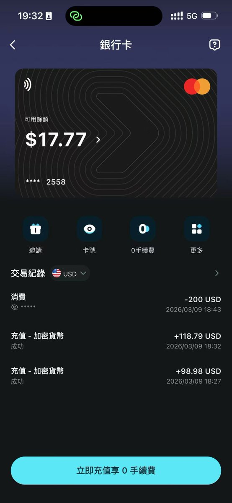
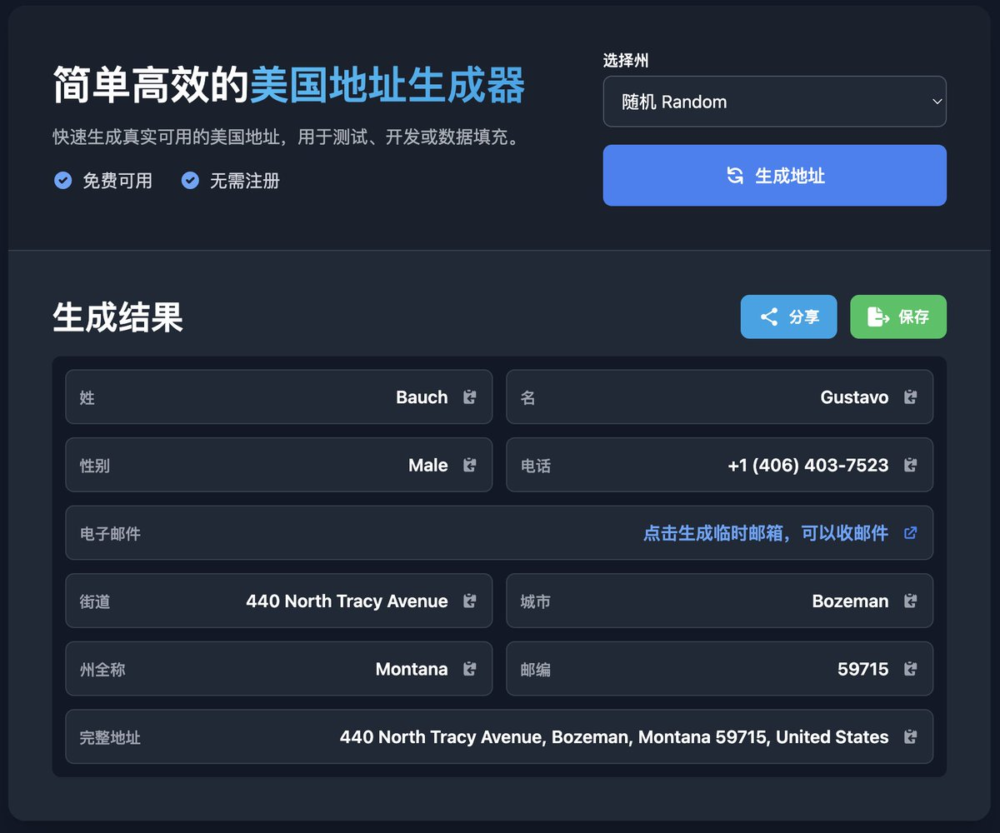
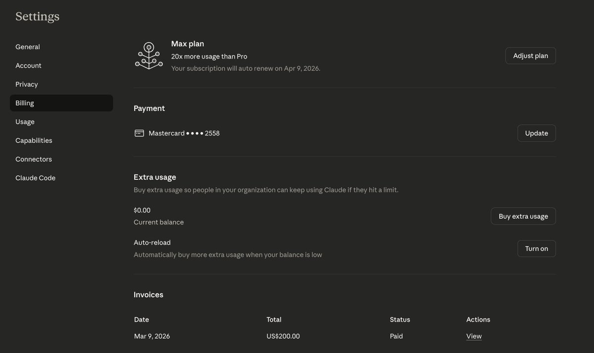
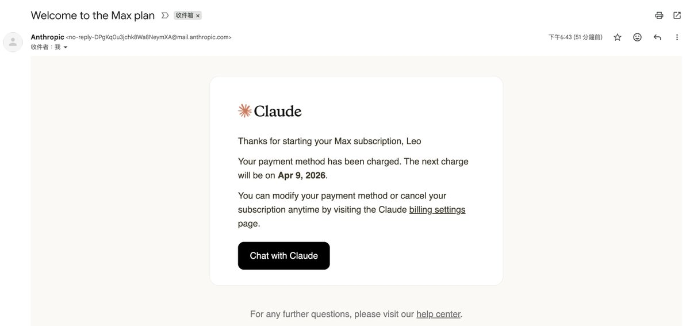
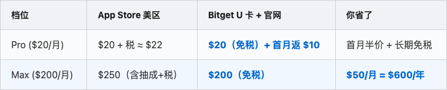

# 📰 一张 U 卡搞定所有 AI 订阅：不封号，首月返现 50%，Max 一年省 $600 

我之前两个月一直在 App Store 美区订阅 Claude Max，每个月 $250。前几天终于下定决心切到官网直订，价格直接降到了 $200，一年算下来能省 $600。

如果你订的是 Pro（$20/月），这套方案同样适用。而且赶上现在的活动，首月还能拿到 $10 的返现，相当于首月半价用 Claude。

整个操作流程大概 20 分钟就能搞定，下面一步步讲。

## 之前怎么订的

Claude Max 在国内是没法直接付款的，官网不接受国内信用卡。我之前用的方案比较曲线救国：先在闲鱼上买美区 App Store 礼品卡，充值到美区 Apple ID，然后在 App Store 里面订阅 Claude。

这个方案能用，但是真的贵。App Store 有 30% 的抽成，加上税费，Claude Max 每个月要 $250。闲鱼的礼品卡本身还有几块钱的溢价。算下来两个月交了 $500，其中差不多 $100 纯粹是在给 Apple 交税。

## 尼日利亚区？别折腾了

之前在推上看到有人说切到尼日利亚区能便宜不少，我也试了一下。结论是：放弃了。那边的支付环境太复杂，绑卡一直过不了，折腾了一晚上也没搞定。

如果你搞定了欢迎告诉我怎么弄的，但我建议大多数人别在这上面花时间，性价比太低了。

## 现在的方案：Bitget U 卡 + 官网直订

后来想明白了，思路其实很简单：绕过 App Store，直接在 claude.ai 官网订阅，用一张能刷美元的虚拟卡来付款就行了。

我用的是 [Bitget Wallet 的 U 卡](https://web3.bitget.com/share/1lP1OU?inviteCode=runesleo)。往里面充 USDC 就能当美元花，走的是 Mastercard 通道，支持全球消费。充值秒到账，而且没有手续费。

## 操作流程

第一步：开卡充值

先下载 Bitget Wallet，在 App 里找到「银行卡」页面，申请开卡。开卡需要用护照做 KYC 认证，所以建议先把护照准备好再开始操作。认证通过之后，往卡里充 USDC 就可以了，到账即可使用。

我自己是分了两笔充的，$98.98 和 $118.79，实际到账 $217.77。充值过程中没有任何手续费，USDC 兑美元就是 1:1。这里有个小提醒：充值的时候建议比订阅费多充一点，保证卡里余额大于 $200，预留一些余量，防止因为余额不足导致扣费失败。

第二步：生成免税州地址

claude.ai 的订阅走的是 Stripe 支付，Stripe 会根据你填的账单地址来决定收不收税。所以这一步的关键是：用一个美国免税州的地址作为账单地址。

具体操作很简单，用 usaddressgen.com 这个网站就能在线生成一个免税州地址。美国一共有五个免税州：阿拉斯加（AK）、特拉华（DE）、蒙大拿（MT）、新罕布什尔（NH）、俄勒冈（OR）。我选的是特拉华，你随便选一个都行。

第三步：官网订阅

到这一步就是正式付款了。先开全局代理，节点选美国（最好和你账单地址选的州一致，这样最稳）。另外建议用浏览器的无痕模式打开，干净的浏览器环境下支付成功率会更高一些。

然后打开 claude.ai → Settings → Billing → 选择你要订阅的 plan（我选的 Max）→ 填入 U 卡的卡号、有效期、CVV → 账单地址填上面生成的免税州地址 → 提交。

这里提一个小细节：Stripe 首次绑卡的时候，可能会临时冻结大约 $5 做一个验证扣款，这个不用慌，过几分钟就会自动释放回来。

我提交之后扣款 $200，秒到。很快就收到了 Anthropic 发来的确认邮件：「Welcome to the Max plan」。从开始操作到订阅成功，整个过程不到 20 分钟。

还没开卡的话，[可以点这里申请 Bitget U 卡](https://web3.bitget.com/share/1lP1OU?inviteCode=runesleo)，填邀请码 runesleo，开卡之后首次刷卡还能拿到 5U 的空投奖励。

## 费用对比

直接上数字，这样最直观：

如果你是 Max 用户，每个月直接省 $50，一年下来就是 $600。如果是 Pro 用户，首月相当于半价，后续也省掉了 App Store 那部分税费。而且最关键的是——再也不用去闲鱼买礼品卡了，那个流程真的很烦。

🔥 叠加 3 月活动的话更划算：新用户首月 AI 订阅返现 50%（最高 $10），加上首刷的 5U 空投。Pro 用户首月实际成本算下来就是：$20 - $10 返现 - $5 空投 = $5。Max 用户首月也能额外省 $15。活动截止到 3 月 31 日，想薅的话抓紧。

## 限时活动：AI 订阅返现 50%

正好赶上 Bitget Wallet 在搞一个 AI 订阅的专属活动（3 月 2 日到 3 月 31 日），力度还挺大的，这里单独说一下：

玩法一：新用户开卡首月半价。活动期间开通 U 卡，然后用它去订阅任意 AI 服务，首月返现 50%，最高返 $10。也就是说你订个 Claude Pro，首月实际只花 $10。

玩法二：老用户邀请也返。你邀请一个朋友开卡，朋友用卡完成了 AI 订阅之后，你自己当月的 AI 订阅费也能拿到 50% 返现（最高也是 $10）。等于你拉个朋友一起用，两个人都省钱。

玩法三：连续订阅奖励。连续 3 个月用 U 卡续费 AI 服务的话，还能解锁额外的惊喜奖励。具体是什么官方还没公布，但反正你本来就要续费，顺手就拿了。

返现奖励每周四发放到你的奖励账户。活动支持的 AI 服务范围很广：ChatGPT、Claude、Gemini、Midjourney、Notion AI 这些主流的都包含在内。参与入口在 Bitget Wallet App 里的「赚币中心」。

再加上开卡首刷的 5U 空投（也是每周四发），两个优惠叠起来，新用户第一个月基本就是白嫖的节奏。

## 日常使用体验

这张卡开了之后你会发现，它远不只是用来订 Claude 的。ChatGPT、Cursor、Midjourney，所有支持 Mastercard 的海外服务都能直接刷。我现在基本上所有的海外订阅都走这张卡了，省得每次都要去找各种奇奇怪怪的支付方式。

除了线上订阅，它还能绑微信、支付宝、Apple Pay，日常线下消费也能用。汇率方面我实际体验下来，刷卡汇率基本接近谷歌实时汇率，没有什么额外的损耗和隐藏费用，用起来和普通的 Visa/Mastercard 信用卡一样透明。

额度方面说一下：普通用户每个月的消费上限是 400U，创世用户（早期注册的用户）每个月是 600U。订阅 Claude Max 每月 $200，完全在额度范围内，剩下的额度还够覆盖日常消费。额度内的消费都是 0 手续费的。总的来说，开了这张卡之后就相当于多了一张随时可用的全能消费卡。

👉 开卡链接[：Bitget U 卡申](https://web3.bitget.com/share/1lP1OU?inviteCode=runesleo)请（邀请码 runesleo）。通过这个链接开卡，我们都能拿到返现。

## 常见问题

会不会封号？

这个是大家最关心的问题。我自己的经历是：之前用了两个月 App Store 订阅，切到官网直订之后一切正常，没有任何异常。claude.ai 官网本身就支持全球信用卡付款，Stripe 是国际通用的正规支付渠道，U 卡走的是 Mastercard 通道，对 Stripe 来说和你用一张美国银行的信用卡没有任何区别。

支付被 Decline 怎么办？

如果支付的时候被拒了，90% 的原因是 IP 地址和账单地址不匹配。你需要确认三件事：第一，全局代理开了没有；第二，节点选的是不是美国；第三，代理的 IP 所在州和你填的账单地址是不是同一个州。确认之后换个浏览器无痕模式重试一下，一般就能过了。如果还是连续失败的话，别急，等几个小时再试，不要短时间内连续刷，否则可能触发风控。

充多少 USDC 够？

建议比你要订阅的金额多充 $15 到 $20。如果订 Pro 的话充 $40 左右就够了，订 Max 的话充 $220 比较保险。多出来的钱不会浪费，留在卡里下个月续费的时候接着用，或者绑定微信当作日常消费也可以。

续费会自动扣吗？

会的，Claude 的订阅是每月自动续费。所以你需要确保卡里的余额够下个月扣款。如果后面不想续了，记得提前在 claude.ai 的 Settings → Billing 里手动取消，不然到期会自动扣。

只能订 Max 吗？Pro 也行？

都行的。这个方案适用于 Claude 的所有档位：Pro 每月 $20，Max 每月 $200。操作流程完全一样，唯一的区别就是选 plan 的时候选不同的档位而已。

除了 Claude 还能订什么？

基本上所有支持 Mastercard 的海外服务都可以。ChatGPT Plus、Cursor Pro、Midjourney、GitHub Copilot，甚至 Netflix、Spotify 这些也都能刷。我现在就是一张卡搞定了所有海外订阅，再也不用到处找支付方式了。

搞定这个之后，我每个月的 AI 工具开支从 $250 降到了 $200。省下来的 $50 够订两个半月的 ChatGPT Plus 了。早知道这么简单就不在 App Store 多花那两个月的冤枉钱了。

实测日期：2026-03-09 \| 订阅档位：Claude Max ($200/月)
支付工具：[Bitget Wallet U 卡](https://web3.bitget.com/share/1lP1OU?inviteCode=runesleo) (Mastercard) \| 账单地址：特拉华州（免税）
适用范围：Claude Pro/Max、ChatGPT Plus、Cursor Pro 等支持信用卡的海外 AI 订阅

### 🖼️ Attached Media

## 💬 Replies

### 1 @runes_leo (Leo｜LeoLabs.me) (Author)

*Wed Mar 11 03:09:48 +0000 2026*

⚠️⚠️⚠️

Bitget U卡实测封号！一觉醒来收到退款邮件了，没活过48小时。大家先别按这个搞了🤦

### 2 @taozui123 (perfect123)

*Wed Mar 11 01:31:37 +0000 2026*

@runes\_leo 我更在在乎自己的数据  好不容易跟ai聊了那么多  多花点钱值得 万一被封  损失太大

### 3 @runes_leo (Leo｜LeoLabs.me) (Author)

*Wed Mar 11 03:10:54 +0000 2026*

@taozui123 被封了，幸好大多数重点记忆和经验都保存成文档了，不然哭死

### 4 @haife123 (捡到一只月亮)

*Tue Mar 10 16:22:18 +0000 2026*

@runes\_leo 很好，下次可以用上，礼品卡确实有点绕

### 5 @runes_leo (Leo｜LeoLabs.me) (Author)

*Tue Mar 10 16:34:29 +0000 2026*

@haife123 是的，关键是max订阅费省下来了，这样未来续费或者订阅其他也都方便了

### 6 @Keji715 (柯基是只猫)

*Wed Mar 11 14:51:01 +0000 2026*

@runes\_leo 最近bitget的U卡被claude封的厉害

### 7 @runes_leo (Leo｜LeoLabs.me) (Author)

*Wed Mar 11 17:41:17 +0000 2026*

@Keji715 是的，批量封，推上刷到好多了

### 8 @ouchaohui (任野灵风)

*Wed Mar 11 10:05:11 +0000 2026*

@runes\_leo Claude  封号太严重了 我被封了两个了

### 9 @runes_leo (Leo｜LeoLabs.me) (Author)

*Wed Mar 11 17:42:49 +0000 2026*

@ouchaohui 还是用app store吧 贵50u至少稳定

### 10 @0x1900 (Jay1900)

*Wed Mar 11 08:47:12 +0000 2026*

@runes\_leo 花了10min看完 结果review：ban！

### 11 @runes_leo (Leo｜LeoLabs.me) (Author)

*Wed Mar 11 17:41:26 +0000 2026*

@0x1900 俺们太难了

### 12 @0xmused (mused)

*Wed Mar 11 01:24:12 +0000 2026*

@runes\_leo 這卡容易被拒被封

### 13 @runes_leo (Leo｜LeoLabs.me) (Author)

*Wed Mar 11 03:11:49 +0000 2026*

@0xmused 感受到了

### 14 @iBigQiang (强子手记)

*Wed Mar 11 00:38:28 +0000 2026*

@runes\_leo 这个不错，看看过几次这个卡也准备申请一张玩玩，之前众安卡有些地方还有限制，也不支持虚拟币

### 15 @runes_leo (Leo｜LeoLabs.me) (Author)

*Wed Mar 11 03:10:55 +0000 2026*

@iBigQiang 别搞了，封号

### 16 @LanTi123488 (LeoLitan)

*Wed Mar 11 00:53:17 +0000 2026*

@runes\_leo 正好准备订阅呢 👍老哥

### 17 @runes_leo (Leo｜LeoLabs.me) (Author)

*Wed Mar 11 03:11:10 +0000 2026*

@LanTi123488 STOP

### 18 @hoky (Hoky)

*Wed Mar 11 03:18:13 +0000 2026*

@runes\_leo 这封号了，充的200刀咋回来？

### 19 @runes_leo (Leo｜LeoLabs.me) (Author)

*Wed Mar 11 03:33:56 +0000 2026*

@hoky 收到退款邮件了，说是会原路退回

### 20 @lilaizhencn (Tokdou.com)

*Wed Mar 11 16:16:09 +0000 2026*

@runes\_leo 注册后能直接申请下来吗

### 21 @runes_leo (Leo｜LeoLabs.me) (Author)

*Wed Mar 11 16:16:49 +0000 2026*

@lilaizhencn 卡是申请通过的很快的，只是这两天很多人claude 都有封号情况，可能跟bitget u卡有关

### 22 @Penrose0912 (Penrose)

*Wed Mar 11 00:27:54 +0000 2026*

@runes\_leo 申请开卡的地址填中国大陆可以吗

### 23 @runes_leo (Leo｜LeoLabs.me) (Author)

*Wed Mar 11 03:34:05 +0000 2026*

@Penrose0912 别搞了

### 24 @WuDarion (darion wu)

*Wed Mar 11 08:38:48 +0000 2026*

@runes\_leo 请问后面如何订阅 ，什么卡好用?

### 25 @runes_leo (Leo｜LeoLabs.me) (Author)

*Wed Mar 11 08:40:38 +0000 2026*

@WuDarion 我准备还是先走美国app store了，250美金贵点就贵点吧

### 26 @kajiweb3 (kajiQ)

*Wed Mar 11 13:59:34 +0000 2026*

大家订阅Claude被封号的问题主要出在账号 IP / VPN 环境被检测到在 CN。如果被识别出有 CN 迹象，Claude 就很容易触发风控。

我自己也是用这张 U 卡开的 Claude，所以时刻谨记着用海外的VPN，目前一直正常使用，被封一般和支付卡关系不大，主要看平台对 CN 用户的友好度。

我已经反馈给 PayFi 组，尽快为大家提供一份 CN 用户使用美元卡订阅 AI 的注意事项和防封指南🙏

### 27 @SvenPPegg (卖鸡公煲的Sven)

*Tue Mar 10 17:47:33 +0000 2026*

@runes\_leo 感觉很容易被封啊

### 28 @Lil_O_yuan (YuanOOOOOO)

*Wed Mar 11 01:13:12 +0000 2026*

@runes\_leo 不能定gpt呀，我被拒了

### 29 @happiness_1024 (Happy)

*Wed Mar 11 10:18:00 +0000 2026*

@runes\_leo 是不是因为账单地址不一样？

### 30 @ZJKing23 (King Lab)

*Wed Mar 11 18:32:25 +0000 2026*

@runes\_leo 太惨了，尼卡也是千万别搞啊，坑死了

### 31 @hooray90848513 (hooray)

*Tue Mar 10 19:22:31 +0000 2026*

@runes\_leo @readwise save thread

