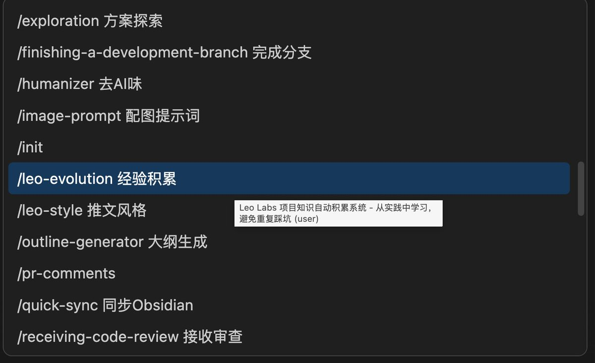

昨天分享了 Claude/Codex/Gemini 共享 Skills，有人问：装了几十个 skill，菜单全是英文记不住怎么办？

改一行配置就行。

打开 \~/.claude/skills/xxx/SKILL.md，把 name 字段改成「英文名 中文说明」：

name: systematic-debugging 系统化调试
name: verification-before-completion 完成前验证
name: humanizer 去AI味

重启后斜杠菜单直接显示中文，不用再猜了。

我把常用的 28 个都加了，现在输入 / 一眼就知道选哪个。中文用户 skill 装多了，这个小改动省不少脑子。

### 🖼️ Attached Media

## 💬 Replies

### 1 @gocloud3 (Cloud Huang)

*Sun Jan 25 14:19:21 +0000 2026*

@runes\_leo 可以用纯中文吗？就是不要前面的那些英文。

### 2 @runes_leo (Leo｜LeoLabs.me) (Author)

*Sun Jan 25 15:33:32 +0000 2026*

@gocloud3 这个我还没试过，不过纯种中文触发肯定是可以的，在skill里加上prompt就可以了

### 3 @fanfanfanfanyu (TechPulse)

*Sun Jan 25 14:54:10 +0000 2026*

@runes\_leo 这个小技巧挺方便

### 4 @runes_leo (Leo｜LeoLabs.me) (Author)

*Sun Jan 25 15:33:40 +0000 2026*

@fanfanfanfanyu 😁

### 5 @hydra111222333 (hydra)

*Mon Jan 26 06:35:08 +0000 2026*

@runes\_leo openskills试过吗 那个好像也能同步 但是它是通过注册进入[agents.md](http://agents.md)实现的

### 6 @runes_leo (Leo｜LeoLabs.me) (Author)

*Mon Jan 26 06:54:50 +0000 2026*

@hydra111222333 没有诶

