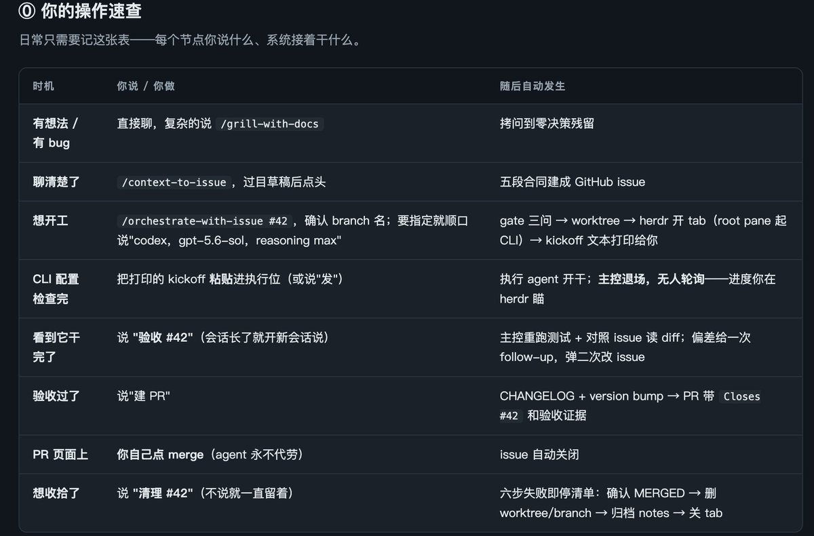

herdr非常适合harness一起组队干活！

发现 Herdr 最牛逼的一点：harness 之间可以互相调，而且不是无头的！

• Kimi 写完代码 → 使用/herdr skill拉起 Grok Build 使用/code-review命令审核代码

• Claude Code里用 Fable5 拆好任务 → 使用/herdr拉起Kimi K3 / GPT-5.6 Sol / Grok 4.5组队干活

docs: [herdr.dev/docs/agent-ski…](https://herdr.dev/docs/agent-skill/)

### 🖼️ Attached Media

## 💬 Replies

### 1 @gliang9 (Leo Ge)

*Sat Aug 01 10:45:06 +0000 2026*

@LinearUncle 可以试试Orca Ade，多项目，多Worktree，多Agent…

### 2 @LinearUncle (LinearUncle) (Author)

*Sat Aug 01 10:51:09 +0000 2026*

@gliang9 嗯嗯，早用上了, orca 不错
[x.com/LinearUncle/st…](https://x.com/LinearUncle/status/2071807005275111658)

### 3 @lee2py (leepy)

*Fri Jul 31 08:41:16 +0000 2026*

@LinearUncle 但是如何获取agent最后的输出呢？这个我在herdr中没看到比较好方案也。

### 4 @LinearUncle (LinearUncle) (Author)

*Fri Jul 31 08:43:16 +0000 2026*

@lee2py 自动会获取啊，herdr skill 里说明了herdr agent CLI 如何timeoutWait 获取结果

### 5 @MouseDig (digmouse)

*Fri Jul 31 07:16:28 +0000 2026*

@LinearUncle 这样本质上还是串行吧

### 6 @LinearUncle (LinearUncle) (Author)

*Fri Jul 31 09:14:51 +0000 2026*

@MouseDig 当做subagent

### 7 @Lonely__MH (Lonely)

*Fri Jul 31 04:16:25 +0000 2026*

@LinearUncle 早有耳闻，周末试试

### 8 @ajs6888 (安叫兽|Bird🕊️ 🔶 BNB)

*Fri Jul 31 05:43:22 +0000 2026*

@LinearUncle 这就像给 harness 加了个群聊功能

### 9 @LiuweijiaVip (Wei佳)

*Fri Jul 31 04:08:44 +0000 2026*

@LinearUncle 能把调度关系显式化就很重要。多 Agent 互相调用时，失败归因和上下文交接往往比模型能力更先卡住。

### 10 @Feichuans (扉川川)

*Fri Jul 31 08:21:02 +0000 2026*

@LinearUncle [github.com/feichuans/skil…](https://github.com/feichuans/skills/blob/main/herdr-orchestrator/SKILL.md)

### 11 @fangwangme (Fang Wang)

*Fri Jul 31 15:16:58 +0000 2026*

@LinearUncle 结合 GitHub issue 补充上下文, 现在用 herdr 感觉还挺流畅的 

### 12 @alanlab_ai (阿蓝)

*Fri Jul 31 07:33:56 +0000 2026*

@LinearUncle 我就说x上能学到东西吧。之前我都是疯狂落文档 切工具，读文档，虽然后面我也沉淀成skill，但是后面没怎么优化流程了。我倒要学习一下herdr是怎么做的

### 13 @Stephen4171127 (熊布朗)

*Fri Jul 31 13:00:08 +0000 2026*

@LinearUncle 谢谢介绍，第一次听说

### 14 @JiweiYuan (Jiwei Yuan)

*Fri Jul 31 21:17:31 +0000 2026*

@LinearUncle 有兴趣评测一下 [termio.sh](http://termio.sh) 嘛和 Herdr 一样的能力更好的UI 设计

### 15 @x_tom_jp (tom)

*Fri Jul 31 11:41:52 +0000 2026*

@LinearUncle @threadreaderapp unroll

### 16 @jacklondon778 (jacklondon)

*Fri Jul 31 06:32:19 +0000 2026*

@LinearUncle 我怎么感觉干重活不如orca agent呢? 它的优点在于优雅

