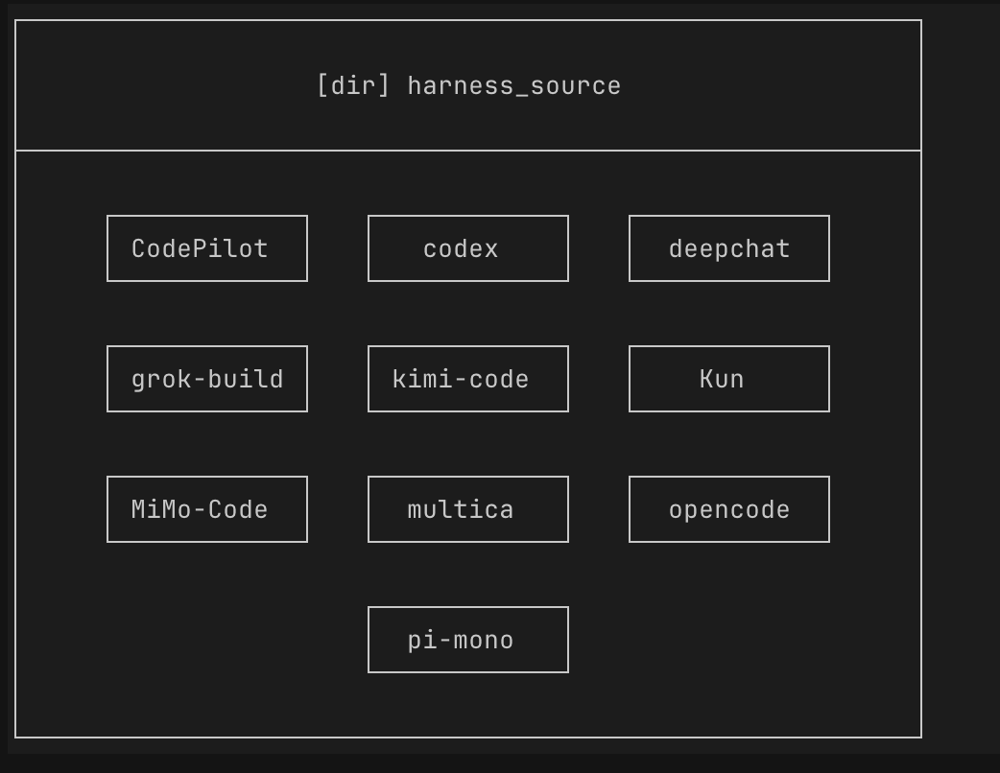
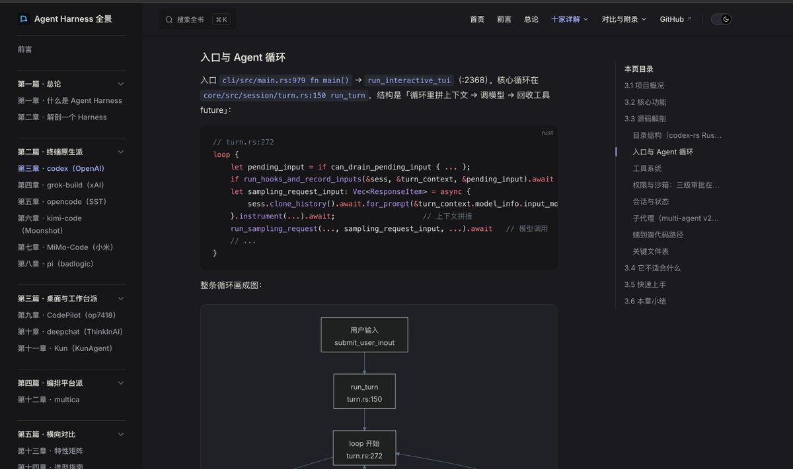

最近在做harness，建议大家把下面这些大佬的开源harness项目全部下载下来参考。

不会实现的feature，就让AI 去代码里挖一下学习。

特别是在公司内部做harness 的X 友们。 

## 💬 Replies

### 1 @Xsir01 (Xsir)

*Tue Aug 04 04:36:53 +0000 2026*

@LinearUncle 我都按分类总结了一遍，根本没人看🤣

### 2 @LinearUncle (LinearUncle) (Author)

*Tue Aug 04 05:42:08 +0000 2026*

@Xsir01 有想法的人自然会看：）

字越少看到人越多，你得教他们怎么用，我就很实际，我自己也是这么用的，用AI 挖实现方案。

### 3 @jtx_ai (姜同学)

*Wed Aug 05 04:51:05 +0000 2026*

推荐1个团队Agent协作新范式，Agent Claim NetworkAgent Claim Network是基于Rust的开源通用领域TUI Agent Runtime，具备完整Harness如工具调用、记忆、上下文管理与持久化、MCP、运行时隔离、自定义provider等能力。目前已支持deepseek/glm/gpt/claude等系列模型。

ACN主要面向agent团队协作场景，尝试解决团队协作场景中的agent经验共享问题，不把团队知识直接写入另一个 Agent 的上下文。以人类的学习过程模拟agent之间的学习过程，在设计哲学上强调所有外部信息必须经过agent结合自身上下文内化后才能被使用，并允许这些外部信息内化后产物（Claim，判断/断言）不同。Claim是ACN 跨 Agent 协作的基本单位，表示某个 Agent 在某个上下文下持有的判断，被脱敏后上传到团队服务器。不同的Claim在交互过程中流动、碰撞、演化，并生成新的Claim或Dispute（冲突）。

相比常规团队Wiki方案，ACN解决了团队知识库动态更新要求人工干预的痛点，更重要的是不需要再维护一份中心化的团队事实库。外部信息不再权威地sudo写入agent上下文，agent的判断与经验可发现、可追溯、可冲突，推动harness在不同人员的agent之间流动，对“agent教agent”这件事情给出我们的探讨——这是ACN的愿景。

当然，作为通用AI助手，ACN也可以不接入团队服务单人使用，并具备完整的harness能力。试试看吧！[github.com/FTShare-Lab/ag…](https://github.com/FTShare-Lab/agent-claim-network)

### 4 @LinearUncle (LinearUncle) (Author)

*Wed Aug 05 04:53:10 +0000 2026*

@jtx\_ai 学习下，感谢

### 5 @WEEXAILabs (WEEX AI Labs)

*Tue Aug 04 14:25:26 +0000 2026*

@LinearUncle 🐎

### 6 @ajs6888 (安叫兽|Bird🕊️ 🔶 BNB)

*Wed Aug 05 06:10:51 +0000 2026*

@LinearUncle 让AI翻源码这招省不少弯路

### 7 @lxz2677 (李行之)

*Tue Aug 04 17:57:10 +0000 2026*

@LinearUncle 我的方案是 pi 为主理解核心模块，然后 codex 源码看工程上特有的设计，看的多了反而乱了。[x.com/lxz2677/status…](https://x.com/lxz2677/status/2084105976639000838)

### 8 @LewTsong (Tsong Lew)

*Wed Aug 05 07:04:57 +0000 2026*

@LinearUncle 感谢大佬分享，做了个网站分析以上框架特性
[tsonglew.github.io/awesome-harness](https://tsonglew.github.io/awesome-harness) 

### 9 @ch1lam_ (ch1lam☮️)

*Tue Aug 04 06:22:33 +0000 2026*

@LinearUncle 光是pi的分析文章都看不过来, 篇篇都新收获😂, 而且一个周末回来pi又更新了100+commit

### 10 @XShude (随机比特)

*Tue Aug 04 04:41:06 +0000 2026*

@LinearUncle 把开源 Harness 下载下来让 AI“考古”很实用，但别只抄 feature。更值得挖的是失败路径：工具调用中断后怎么恢复、上下文怎么裁剪、验收失败怎么返工。把这些行为连同测试一起搬回来，才不容易得到一套表面功能齐全、出错就重跑的壳。

### 11 @TaXue2025 (踏雪寻仙)

*Tue Aug 04 04:40:06 +0000 2026*

@LinearUncle 要换一个思路，真正在做的，其实已经对这些很了解了。而且有一些闭源的harness做的其实也相当优秀，不能仅局限于开源、闭源这种框架当中

### 12 @being99 (Booker Zhao)

*Tue Aug 04 05:32:19 +0000 2026*

@LinearUncle 吸收下😄

### 13 @ieuforu (ieuforu)

*Tue Aug 04 13:09:33 +0000 2026*

@LinearUncle @akazwz\_

### 14 @fxmqs (风雪漫千山)

*Wed Aug 05 01:48:02 +0000 2026*

@LinearUncle 先挖失败路径，比抄功能值钱

### 15 @LiuweijiaVip (Wei佳)

*Tue Aug 04 04:37:15 +0000 2026*

@LinearUncle 这个方法挺实用，先把能跑的项目下载下来，再让 AI 去看具体实现，比只听概念靠谱多了。

### 16 @nanerziqiang (山人有妙招)

*Tue Aug 04 14:41:31 +0000 2026*

@LinearUncle AI as a code archaeologist—digging through repos to learn how to build things instead of just asking ChatGPT for the answer.

### 17 @LongXiao4082 (Rivers)

*Tue Aug 04 04:59:17 +0000 2026*

@LinearUncle 收藏该 harness ，丢到我的知识储藏室。

### 18 @lfrodriguesit (Luís Rodrigues)

*Tue Aug 04 15:07:31 +0000 2026*

@LinearUncle Open-source harnesses are becoming the playbooks for building reliable agents.

### 19 @JasonCaoJiong (Jason Cao)

*Tue Aug 04 23:18:35 +0000 2026*

@LinearUncle 正在refactor

### 20 @xswl123321 (miao)

*Tue Aug 04 05:00:19 +0000 2026*

@LinearUncle @grok 这里面都是开源的？

### 21 @EthanL_v5 (Ethan L)

*Thu Aug 06 05:45:01 +0000 2026*

@LinearUncle 桌面端架构应该来看看

[github.com/hAcKlyc/MyAgen…](https://github.com/hAcKlyc/MyAgents)

