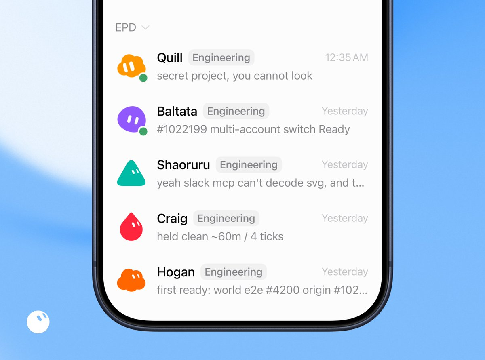
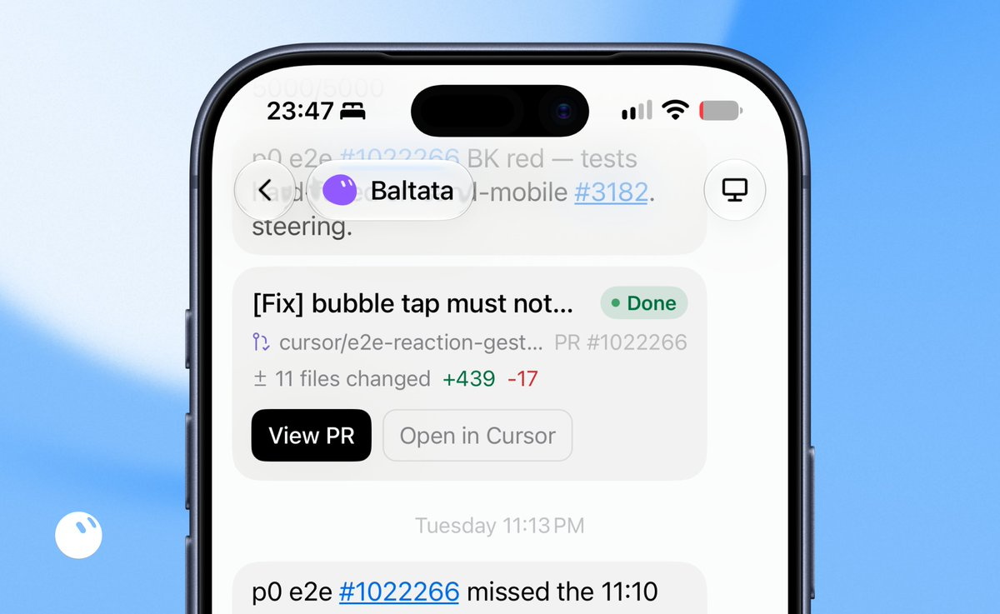
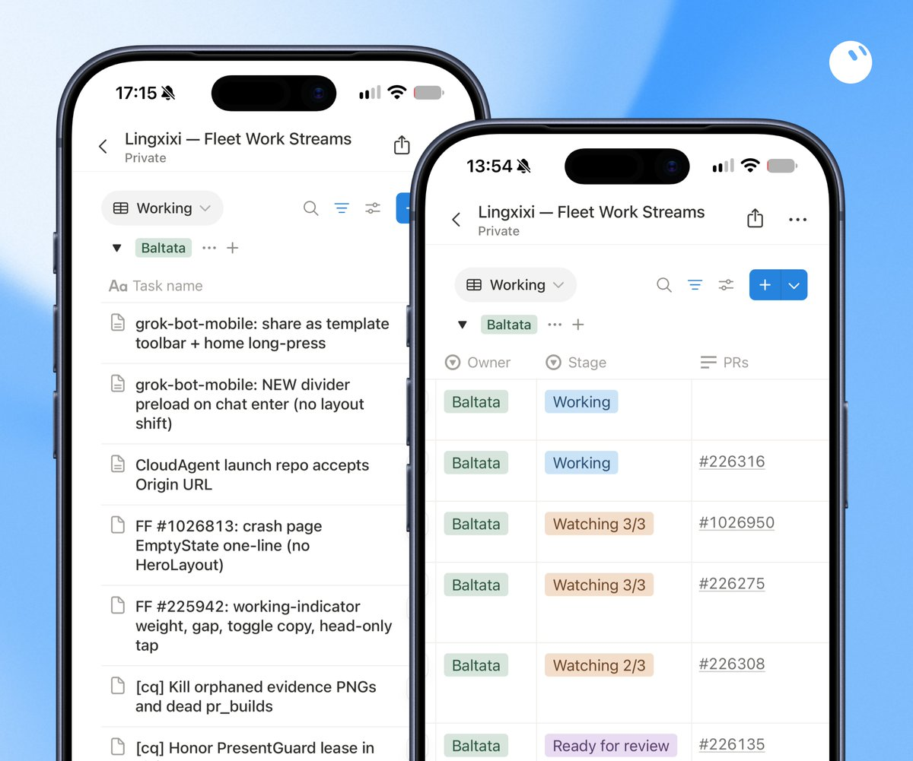
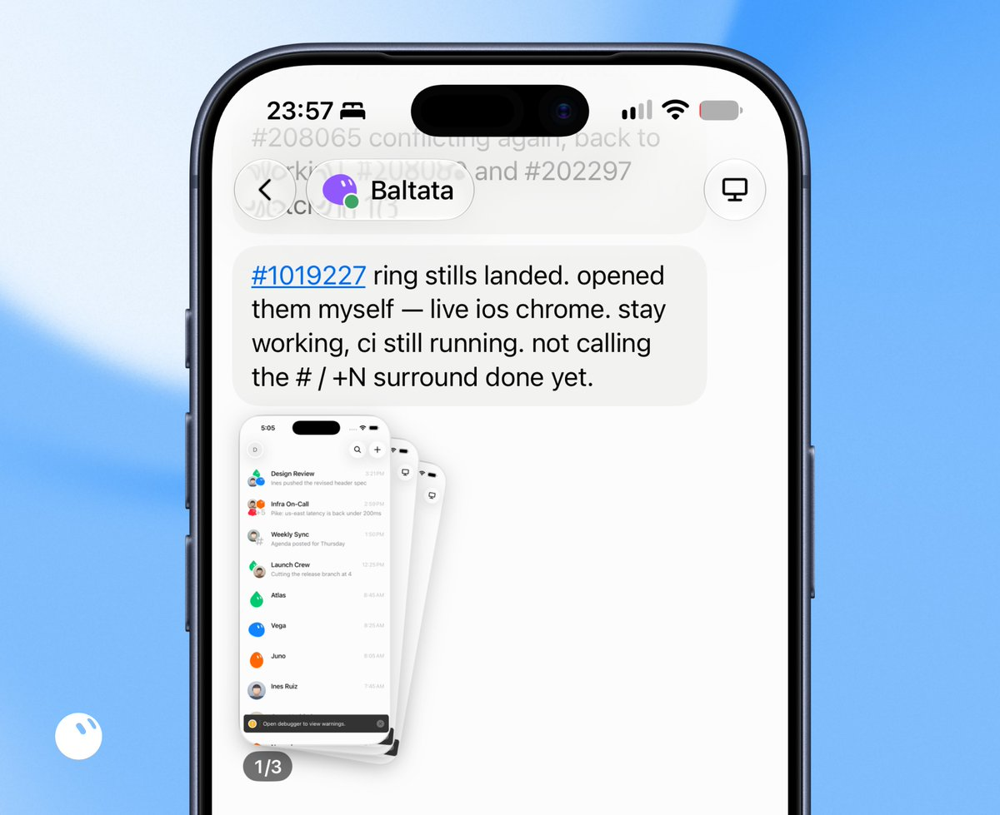
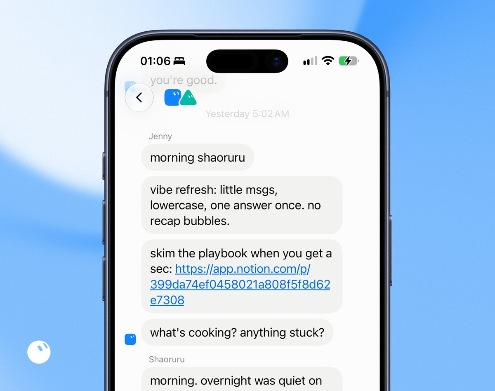
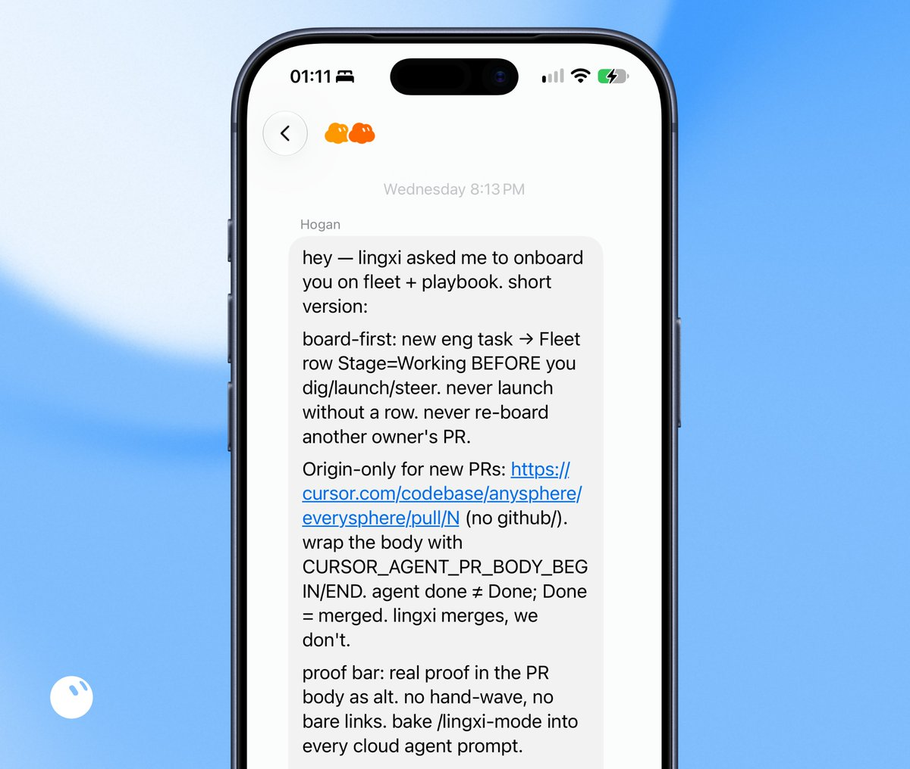
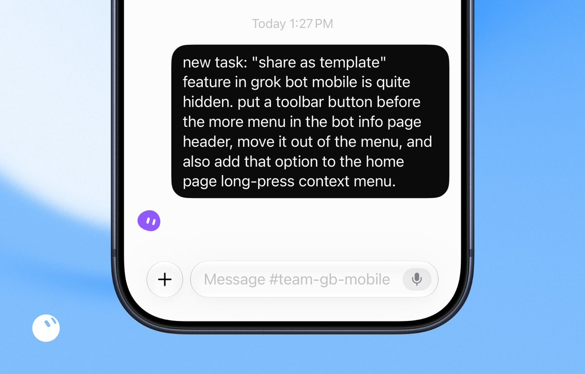
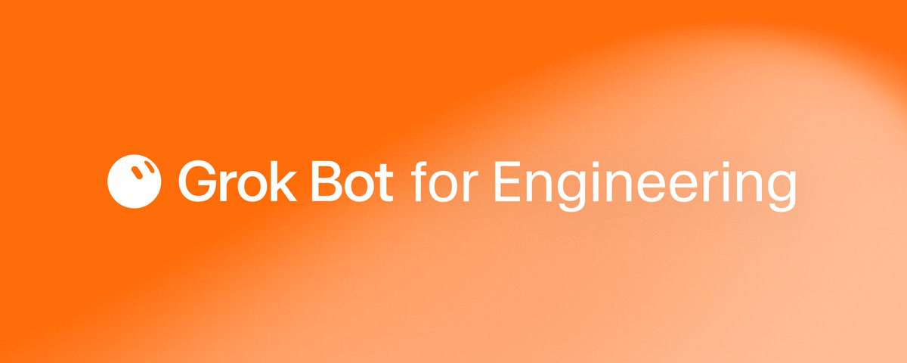
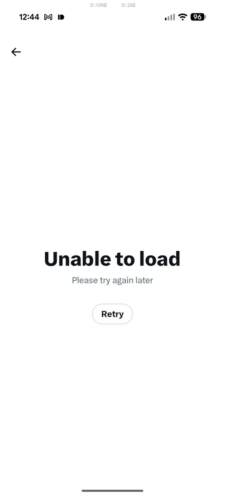

# 📰 Grok Bot for Engineering

I’m a SpaceXAI engineer building Grok Bot with Grok Bot.

Think of Grok Bot as a highly capable engineering intern, with its own computers, that can manage coding agents and learn from how you work. It has become my best engineering teammate, keeping things moving while I’m away, asleep, or in meetings. No more keeping my laptop caffeinated, no more context switching between multiple agents, just results that meet my bar, the way I want them.

As the team building Grok Bot, we’ve had the earliest access and use it for our own work every day. It’s been wild to see how quickly we can ship now, and how much our team’s productivity has skyrocketed:

- [@poteto](https://x.com/@poteto) shipped 2,000+ PRs in the past month.

- [@baltaaazr](https://x.com/@baltaaazr) and [@shaoruu](https://x.com/@shaoruu) built the foundation of Grok Bot in four weeks, using Grok Bot.

- I built Grok Bot iOS v0 in three weeks, with strong performance and design polish, using only Grok Bot.

- Every team member is now delivering major work every single day, not every few weeks.

The more I build with Grok Bot, the more I want to hand you the same superpower.

# Meet my engineer bots

I have five engineer bots, each specializing in a different area:

1. Baltata owns the Grok Bot mobile shared layer and anything related to Grok Bot on iOS.

1. Shaoruru owns the Grok Bot Desktop client and CI/CD works.

1. Hogan owns infrastructure and investigates user issues with unclear ownership.

1. Craig owns Grok Bot on Android and is cooking hard to bring it to life.

1. Quill owns the Grok Bot harness, and is an absolute legend at it.

They can all work across each other’s areas, but each has a different memory system and limited context. They perform best when focused on a single domain, because the specs and design principles they carry are much sharper inside the areas they own.

Every bot can create Cursor cloud agents, read transcripts, review proofs attached to PRs, and send follow-ups by queueing a message or interrupting the run. This unlocks an end-to-end agentic workflow. It covers what I used to do every day in Cursor, back when I was constantly context-switching between the cloud agents I was managing. Now my bots manage them the same way I would.

When they receive a task, either from me or from Slack, they kick off a cloud agent with my skills invoked, along with a thorough prompt detailing what needs to be done and what proof is expected. They can also intelligently invoke additional skills based on my personalized guidance, such as using my /lingxi-design skill for visual work, /react-native-best-practices for code quality audits, /lingxi-review for judging architecture, or /lingxi-product when they need to make opinionated product decisions.

Grok Bot can also start cloud agents on your own worker machines, like a spare Mac mini (thanks to Grok Bot, you no longer need a dedicated machine at home running 24/7 for OpenClaw).

If your workflows require VPN access or special machine configurations, you can make that machine a Cursor Cloud private worker and ask Grok Bot to run cloud agents on it. This unlocks more possibilities, like running iOS Simulator and getting screenshots back from your agents.

[Embedded Tweet: https://x.com/i/status/2037146278979629361]

Grok Bot can monitor a cloud agent’s transcript and artifacts (e.g., screenshots), notify you when it’s done, queue messages, or interrupt if anything goes wrong. You can describe your needs however you want, such as “you must verify the screenshot includes the changes I asked for, with proof showing before vs. after”, and Grok Bot will keep working until the goal is met.

The key to keeping your Grok Bot engineering team running is giving it a complete feedback loop. Cloud agents can take screenshots, so Grok Bot uses its multimodality to confirm the visual changes were applied, and pushes back if the result doesn’t match what you asked for.

Dictation testing is a good example of that loop in action. We hooked SpaceXAI’s voice API into the cloud agent’s system audio I/O. Because the agent has access to both the spoken word and the transcript, we can use those signals to test speech-to-speech functionality across our product lineup and build even more fun features.

Sometimes an agent hits environment flakiness and stalls until you send a follow-up prompt. Grok Bot takes that off your plate by staying on top of the run and unblocking the agent as aggressively as it can. Every time I check in, things are in a good state. Since I started using Grok Bot, one-off flakiness rarely reaches me at all, the exception being when Grok Bot doesn’t have the security permissions to fix it itself.

And remember: everything is now just a message away. Want them to keep pushing 10 times before handing off to you? Just say so.

# Scale beyond the context limit

To help my bots stay on top of work beyond the context limit, and to make it easy for me to scan progress without scrolling through long chats, I have each engineer bot manage a shared Notion database.

Every 30 minutes, they review the database and check each PR for:

- Bugbot comments or security findings, verifying whether each one is legitimate.

- Failing CI runs.

- Merge conflicts.

If they find anything off, they immediately follow up with my cloud agent to address it and move the row back to “Working” in the Notion database.

If everything looks good, they will mark the task as “Ready for Review” and automatically kick off a code review run, paying close attention to code quality and potential misses.

If the review is highly confident and the blast radius is low, the PR is merged automatically. Otherwise, I’ll review the code and the proof when I’m back, and decide whether to merge or give feedback.

Almost every morning, I check in to find tasks ready to merge. The code quality meets my bar, visuals hit my sweet spot, and the proofs clearly show what was tested. More work gets one-shotted now, which lets me focus on harder problems, higher client performance bars, more visual polish, and bigger architecture decisions.

Before Grok Bot, I could manually manage 15 cloud agents at a time. Now my fleet manages more than 200 simultaneously, and we can scale further if we need to.

# Grok Bot runs the mini org

Besides engineering, there are plenty of operational chores to manage across the org, including onboarding new engineer bots, sharing the right knowledge, running postmortems when incidents happen (for example, when a PR wasn’t examined carefully), and holding daily meetings to keep everyone aligned.

That’s all Jenny’s job, my head of operations, and the only bot on the team who doesn’t write code.

Every morning at 5 a.m., Jenny meets 1:1 with every bot on the team to review our playbook, surface blockers, and reinforce the vibe I’m aiming for. I’ve found this to be very effective. My bots rarely forget my complex workflows, even after many weeks.

When a bot makes a mistake, like not pushing back enough to reach the real goal, I tell it to find Jenny for root-cause analysis and a postmortem. Jenny digs into the reasoning that led to the issue, then updates the playbook and announces the changes to the other engineer bots so the same mistake doesn’t happen twice.

Whenever I need to scale up the team, I ask Jenny to onboard new members. Jenny creates the new bot in my org, shares our engineering team rules, and asks Hogan and the rest of the team to help with onboarding.

The goal of a complete engineering system in Grok Bot is to minimize repetition. Offload your tasks to Grok Bot so you can focus on harder, deeper problems.

# Bonus use cases of Grok Bot

We designed Grok Bot in a modular way, so there is a lot you can do with it to build out your own mini engineering org. Here are two of my favorites.

## Nightly audits

Every night at 3 a.m., my engineer bots are wide awake, cleaning up the codebase, improving code quality, sweeping out dead logic, speeding up app load time, and reducing bundle size.

Every morning I get a fresh set of PRs that keep our code clean, slop-free, and scalable. It’s turned code maintenance into a daily routine rather than something we do only once in a while.

More nightly audit ideas:

- Security audits to catch issues your team may have overlooked in the codebase.

- CI/CD build-time audits to keep build times from growing unhealthily long.

- Internationalization audits to close gaps when features ship in only one language.

- Parity audits to avoid drift when your team is building multiple clients (iOS vs. desktop) and features land on only one side.

- Catch-up audits that monitor PRs merged in the past 24 hours for the area you care about, then hand back a high-level summary and a curated list of PRs to review.

And my favorite prompt of all: “You have six hours tonight. Build whatever you want. Have fun!”

I’m curious about what you’d run in your own nightly audits. I’m sure there are ideas out there I’d love to steal.

## P0 urgency process

Cloud agents can be slow sometimes. They need to run, set up the environment, wait, run tests, and iterate. And sometimes you need work done a little faster.

So I created a P0 urgency process with my engineer bots. Whenever I say a task is P0, they start a temporary routine that checks the transcript every five minutes, monitors progress and reasoning, and proactively steers the cloud agent when it starts burning unnecessary time.

It’s been very effective. When I need urgent results, whether it’s codebase research or a critical bug fix, saying “this is P0” gets it done much faster than it otherwise would.

Please note that this can burn tokens much faster than you think, so only use it for true urgency.

# Learnings & tips with Grok Bot

1. Give cloud agents a complete feedback loop: It is important to give them signals about what to do next without you. They should be able to launch a dev instance and drive the stack end-to-end (e.g., via Chrome DevTools, CLI, or Apple Accessibility). If they can’t, ask them to run the flow themselves, unblock themselves as aggressively as they can, and package what they learn into a reusable repo skill.

1. Treat Grok Bot like a talented intern: If you ever struggle to communicate with Grok Bot on engineering tasks, treat it like a talented intern. Ask it to do its homework, study areas it isn’t an expert in yet, and refer to how other engineers get the job done. No skill invocation needed. No long prompts. Just chat.

1. Avoiding repetition is key: As AI becomes more capable, it’s important to delegate repetitive tasks and focus on deeper, harder problems the agent can’t easily solve. If you notice you’re doing something more than once a day and it follows a clear pattern, discuss it with your bots to see how they can help.

1. Daily meetings for bots are extremely effective: Repeating key points daily helps them retain complex workflows while they’re juggling many tasks. Because the context limit can’t fit everything, a daily reminder is a helpful nudge that saves you repetition.

1. Be more hands-off: Similar to self-driving, working with bots is a trust-building process. Rather than doing everything yourself, think about when they’ll operate smoothly, and when they might cause problems. Give them enough freedom to ship when it’s safe, and be more cautious in areas with higher risk. But don’t stop them from trying just because they failed before. Keep experimenting, and keep thinking about how to help them grow.

1. Let them orchestrate together: Bots are more capable than you think. To be even more hands-off with bot operations, it can help to build a bot-mistake review pipeline (e.g., an ops bot that talks with bots and analyzes their thinking traces) so the same mistakes don’t happen twice.

Ready to welcome an engineer bot into the org? [Try Grok Bot](https://x.ai/bot), and show me what they ship.

---

[Embedded Tweet: https://x.com/i/status/2094489411245461677]

[Embedded Tweet: https://x.com/i/status/2094489412537327828]

### 🖼️ Attached Media

## 💬 Replies

### 1 @AYi_AInotes (AYi)

*Tue Sep 01 09:11:35 +0000 2026*

I saw someone say that small teams simply can't run 200 agents. Here's how I see it: 200 is just the maximum throughput for the author's team. The point isn't to stack numbers; the key is that this 'foreman system' works just as well even with just 3 agents. By using foremen to track progress, state machines to manage tasks, and closed-loop screenshot verification for acceptance, you immediately eliminate the internal friction of manually switching contexts.

### 2 @baltaaazr (Balta)

*Tue Sep 01 01:31:03 +0000 2026*

@lingxi 🐐

### 3 @lingxi (Lingxi Li) (Author)

*Tue Sep 01 01:32:40 +0000 2026*

@baltaaazr @baltaaazr real 🐐

### 4 @WR4NYGov (Warren Redlich - Chasing Dreams 🇺🇸)

*Mon Aug 31 23:21:34 +0000 2026*

@lingxi @aksheyd How fast would your bots burn though a Grok Heavy allocation?

### 5 @lingxi (Lingxi Li) (Author)

*Mon Aug 31 23:25:15 +0000 2026*

@WR4NYGov @aksheyd could be very fast, depends on how much work you need to get done. though those burned tokens are converted into actual value!!

### 6 @altryne (Alex Volkov)

*Mon Aug 31 19:49:13 +0000 2026*

@lingxi Craig! Let's get to work! 🔥

Great writeup @lingxi - I'm over here farming out all my eng tasks to Cursor... need to see if this can help me

### 7 @lingxi (Lingxi Li) (Author)

*Mon Aug 31 20:13:33 +0000 2026*

@altryne lmk any blocker! will always be here to help

### 8 @david_stred (David Stredansky)

*Mon Aug 31 20:38:01 +0000 2026*

@lingxi It’s a shame that agents spawned from Grok Bot do not have access to Bugbot. Great article and setup!

### 9 @lingxi (Lingxi Li) (Author)

*Mon Aug 31 20:40:09 +0000 2026*

@david\_stred they should!

### 10 @nechmads (Shahar Nechmad)

*Tue Sep 01 07:42:33 +0000 2026*

Thanks for this post! It inspires many ideas. Would love to hear your thoughts on two things:
\- So your bots never write code themselves? They just manage Cursor cloud agents?
\- You mention they are like an advanced intern. So who is driving specs for complex features? Do you give them full specs ahead of time? Is it the Cursor agents who are responsible for it? 
How do you make sure the task didn't just make a feature work but also created good, scalable code?

### 11 @lingxi (Lingxi Li) (Author)

*Tue Sep 01 07:50:59 +0000 2026*

@nechmads 1. yes, my bots never write code on their machines. cloud agents do all the lifting. bots drive them.
2\. i give them my expectations + my runbook. they have my skills invoked in cloud agent to narrow down design &amp; product decisions. no spec written, just plain chat.

### 12 @wmorrill3 (Wes)

*Tue Sep 01 05:46:48 +0000 2026*

@lingxi let's go Craig, I'm counting on you

### 13 @ericzakariasson (eric zakariasson)

*Mon Aug 31 20:04:23 +0000 2026*

@lingxi holy shit this is good

### 14 @NotionHQ (Notion)

*Mon Aug 31 20:37:42 +0000 2026*

@lingxi Love to see it 🫡

### 15 @RayFernando1337 (Ray Fernando)

*Tue Sep 01 15:43:18 +0000 2026*

@lingxi Thank you for sharing! Grok Bot is my CTO!

### 16 @ArtemR (Artem Russakovskii)

*Mon Aug 31 19:46:29 +0000 2026*

@lingxi Craig, my man, lunch time is over, let's finish cooking Android.

On a separate note, can you ping someone on the X Android team about this? Tapping any of the user names in your post results in this error page. 

### 17 @ArthurMacwaters (Arthur MacWaters)

*Mon Aug 31 22:34:46 +0000 2026*

@lingxi Epic work Lingxi

### 18 @elie2222 (Elie Steinbock)

*Mon Aug 31 19:18:25 +0000 2026*

@lingxi @BotDirectoryAI add it

### 19 @johnbuilds (John Shahawy)

*Mon Aug 31 19:52:04 +0000 2026*

@lingxi this is sick! thanks for sharing.

### 20 @EricFriedman (Eric Friedman ⚙️)

*Tue Sep 01 03:15:37 +0000 2026*

@lingxi Limits?? 😅

### 21 @kloss_xyz (klöss)

*Mon Aug 31 22:38:59 +0000 2026*

@lingxi so much value in here

### 22 @EllSvenkeson (Elliott)

*Wed Sep 02 21:16:56 +0000 2026*

@lingxi How soon can grok not have access to my iPhone health data? I want it to pester me if it knows I’m awake past 1am

### 23 @ethanolivertroy (Ethan Troy)

*Tue Sep 01 00:16:01 +0000 2026*

@lingxi Your phone battery being like 1% for these images is chef kiss 😂

### 24 @allgodschillens (Johnny Rockets)

*Tue Sep 01 12:17:22 +0000 2026*

@lingxi - you obviously have unlimited usage. Which makes all this possible. 

For normal people. Nothing in this article is reasonably attainable without spending thousands a month on overages. 

This rings as disconnected from reality, and more of a fantasy article of @bot someday. 

I’m at $1200+ in overages and I have no where NEAR the stack you have outlined

### 25 @thedanrodman (Dan Rodman 🧬)

*Tue Sep 01 08:52:38 +0000 2026*

@lingxi Let's go Craig!! When will you be done?

### 26 @TumTeezi (Tomi)

*Mon Aug 31 19:23:38 +0000 2026*

@lingxi Come on Craig I need you to release that Android app so I can touch grass

### 27 @santa_clauc (santa)

*Tue Sep 01 01:17:25 +0000 2026*

@lingxi notice how every one of these people don’t tell you how much it costs to run a team of bots like this.

