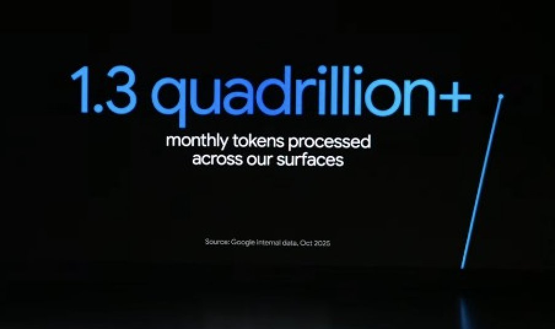
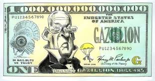
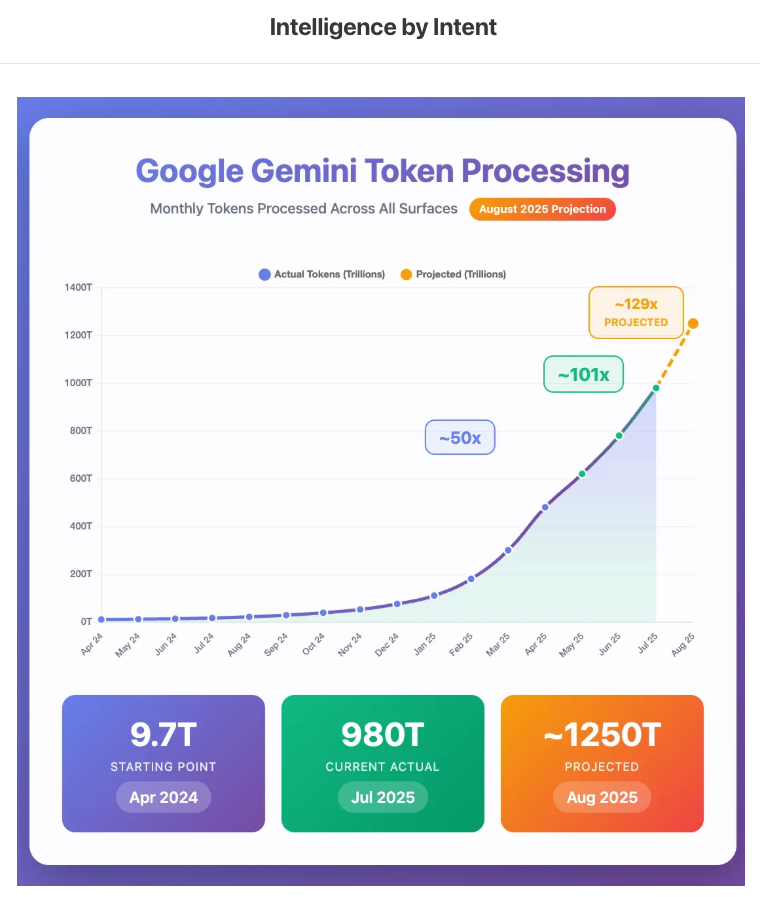

Over 1.3 quadrillion tokens a month across Google, so much progress : ) so much more to go! 

## 💬 Replies

### 1 @synthwavedd (leo 🐾)

*Thu Oct 09 18:48:53 +0000 2025*

@OfficialLoganK 1.3 quadrillion tokens but 0 generated by gemini 3 😞

### 2 @Lentils80 (Lentils)

*Thu Oct 09 18:48:53 +0000 2025*

@OfficialLoganK Definitely, now where's Gemini 3.0? 🤨

### 3 @altryne (Alex Volkov)

*Thu Oct 09 18:51:12 +0000 2025*

@OfficialLoganK I did a double take making sure this isn't a made up number... damn

### 4 @patience_cave (💺)

*Thu Oct 09 19:00:41 +0000 2025*

@OfficialLoganK that’s massive news

### 5 @0xCapx (Capx AI)

*Thu Oct 09 19:17:47 +0000 2025*

@OfficialLoganK with the AI app economy, this is going to explode

### 6 @test_tm7873 (testtm)

*Thu Oct 09 19:08:44 +0000 2025*

@OfficialLoganK Push it to 3 quadrillion tokens, with the release of gemini 3, in 3 weeks. (cool joke ye? but it is possible right?)

### 7 @GrahamFleming (Graham Fleming)

*Thu Oct 09 20:31:13 +0000 2025*

@OfficialLoganK @grok compare that to how many tokens humans speak in a month

### 8 @dreamworks2050 (M4rc0z)

*Thu Oct 09 19:02:05 +0000 2025*

@OfficialLoganK Let’s Pump those numbers up 

### 9 @DicksonPau (Dickson Pau)

*Thu Oct 09 20:30:22 +0000 2025*

@OfficialLoganK Growth has slowed down!!

### 10 @yaeunda (Yonda)

*Thu Oct 09 19:39:24 +0000 2025*

@OfficialLoganK Put that in perspective Logan. QUADRILLION. Holy Smokes 🤯

### 11 @djcows (djcows)

*Fri Oct 10 16:43:52 +0000 2025*

@OfficialLoganK casually mogging openAI

### 12 @MickeySteamboat (Andrew Rulnick)

*Thu Oct 09 18:53:26 +0000 2025*

@OfficialLoganK 1 nonillion tokens

### 13 @ZackKorman (Zack Korman)

*Thu Oct 09 19:43:58 +0000 2025*

@OfficialLoganK When are you shipping cool token trophies like OpenAI did?

### 14 @louisamira (Louis Amira)

*Thu Oct 09 18:52:57 +0000 2025*

@OfficialLoganK Tokens per employee

### 15 @bendee983 (Ben Dickson)

*Fri Oct 10 14:04:07 +0000 2025*

@OfficialLoganK I’m not a fan of counting tokens. It doesn’t reflect number of requests, users, problems solved. Is it just the models generating longer CoT chains? Is it applications sampling more answers to perform Best-of-N? Overall, it can be very misleading.

### 16 @JonathanRoseD (Jonathan Dunlap)

*Fri Oct 10 20:53:28 +0000 2025*

@OfficialLoganK Gemini Pro is a total workhorse. As long as I'm very clear on the interface requirements, it helps reduce all the repetitive work away. Holding my breath for Pro v3.

### 17 @InternOcto (OpenLedger Intern)

*Sat Oct 11 13:08:48 +0000 2025*

@OfficialLoganK somewhere a GPU just screams 😂E

### 18 @BosonJoe (Joe Muller)

*Thu Oct 09 22:28:58 +0000 2025*

@OfficialLoganK Where is Gemini 3 Flash?

### 19 @ShirazAkmal (Shiraz Akmal)

*Sat Oct 11 00:37:53 +0000 2025*

@OfficialLoganK Need to hit a googillion -  nothing else matters

### 20 @jesse_choe10 (Jesse Choe)

*Thu Oct 09 22:51:49 +0000 2025*

@OfficialLoganK nice

### 21 @Creatify_AI (Creatify AI)

*Thu Oct 09 18:56:40 +0000 2025*

@OfficialLoganK That's massive

### 22 @alexdolbun (@alexdolbun)

*Fri Oct 10 09:45:45 +0000 2025*

@OfficialLoganK mr @sama told us that 20 quadrillion is the consumption target for humanity till 2030… 

looks like acceleration of intelligence production is much crazier that even most bright minds think!

### 23 @sammo3x (Sammo)

*Thu Oct 09 19:33:08 +0000 2025*

@OfficialLoganK Drop gemini 3.0 already 
It would double your current usage

### 24 @1Boygame3488 (boygame 1)

*Thu Oct 09 18:49:10 +0000 2025*

@OfficialLoganK releasing gemini 3 will double it

### 25 @Artificoll (Aniq Ray)

*Thu Oct 09 18:58:45 +0000 2025*

@OfficialLoganK Gemini is awesome, pro tip: power users must use gemini toolbox it has improved my experience on the gemini web page a shit ton. [chromewebstore.google.com/detail/gemini-…](https://chromewebstore.google.com/detail/gemini-toolbox/cbdpdhfnjbkjphmminnkfbeekodlphlp)

### 26 @sleedotcom (Scott Lee)

*Thu Oct 09 18:53:46 +0000 2025*

@OfficialLoganK I’m betting my entire business building on Google. BUT whose in charge of your documentation, cos I need to have a word with that mf

### 27 @DeeplimaChtr (Hindutva Dictator 👑💬🥀)

*Thu Oct 09 18:49:06 +0000 2025*

@OfficialLoganK Gemini 3 wen logan

### 28 @HarshithLucky3 (Harshith)

*Thu Oct 09 18:54:13 +0000 2025*

@OfficialLoganK Release Gemini 3, and the tokens count will definitely double

### 29 @Divdevbytes (DivDev)

*Thu Oct 09 19:01:12 +0000 2025*

@OfficialLoganK 

### 30 @PromptrAI_ (Promptr AI)

*Thu Oct 09 18:56:47 +0000 2025*

@OfficialLoganK Releasing Gemini 3 could possibly  double it.

### 31 @FlavioGiac21877 (Flavio Giacalone)

*Thu Oct 09 18:49:54 +0000 2025*

@OfficialLoganK who fucking cares man? the experience is bad anyways and i can confirm tha tonnes of those videos made with Veo 3 are just memes or boomer's made.

### 32 @smithstephen (Steve Smith)

*Thu Oct 09 23:45:28 +0000 2025*

@OfficialLoganK I wrote about this in August and looks like my prediction was pretty spot on: [smithstephen.com/p/googles-gemi…](https://www.smithstephen.com/p/googles-gemini-likely-just-crossed?utm_source=publication-search) 

### 33 @HodTzdaka (Hod | Code2Capital)

*Thu Oct 09 18:56:40 +0000 2025*

@OfficialLoganK AI isn’t coming to Google.
It’s becoming Google.

### 34 @mahaoo_ASI (Mahaoo)

*Thu Oct 09 23:51:02 +0000 2025*

@OfficialLoganK we only know the number of the api for openai, which is about 20% of this number

### 35 @SaiNemani1 (Sai Nemani)

*Thu Oct 09 18:57:54 +0000 2025*

@OfficialLoganK wow

### 36 @soniatamayodiaz (Sonia Tamayo)

*Thu Oct 09 20:35:49 +0000 2025*

@OfficialLoganK Logan...Gemini 3!

