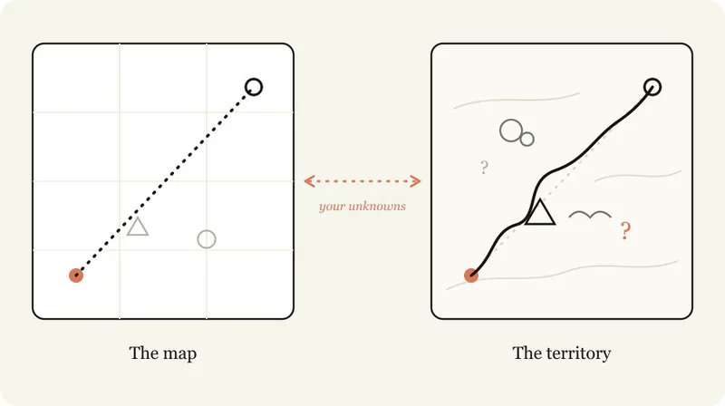
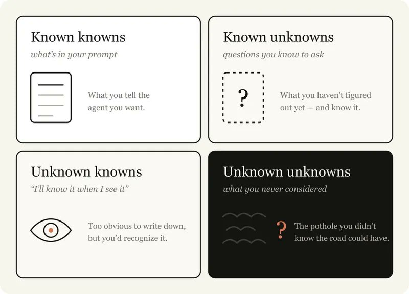
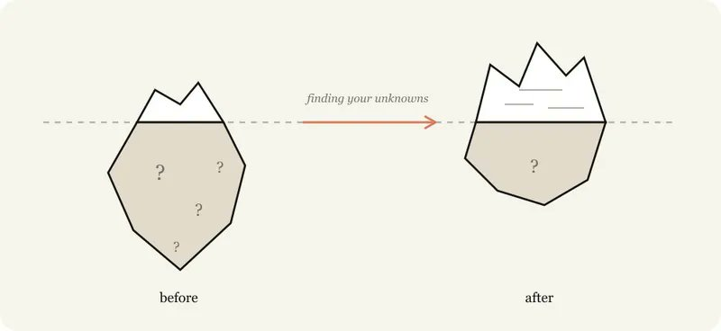
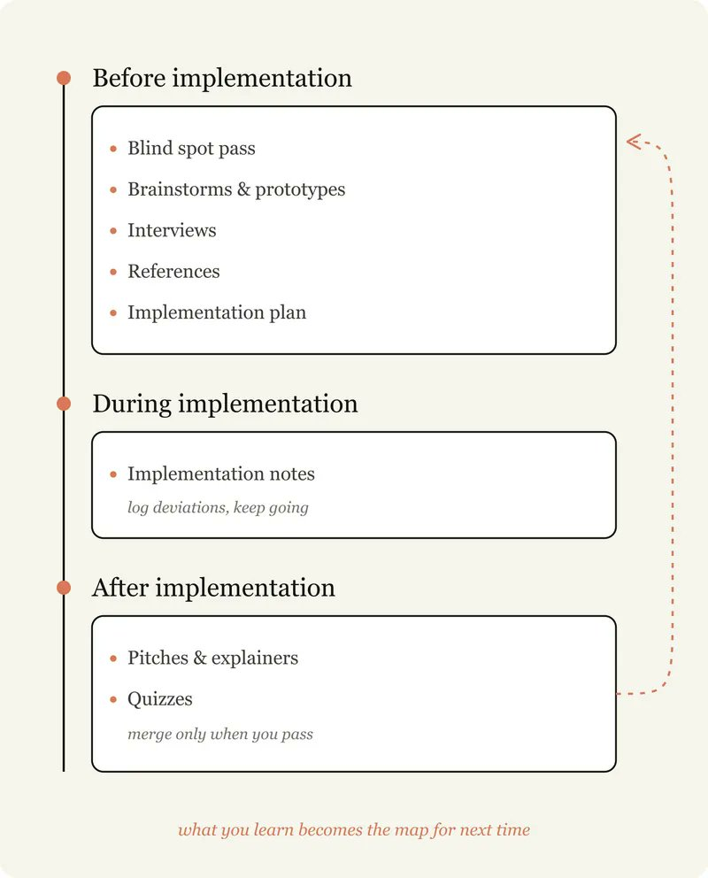
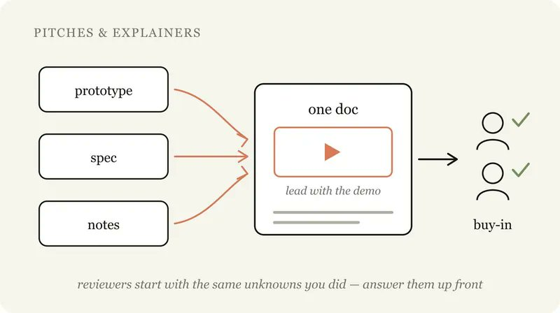

# 📰 Fable 5 实战指南：发现你的未知「译」

> 这篇文章写的很好，作者是 Claude code 核心研发人员。

> 主要观点：模型越强，写代码的瓶颈就越不在模型，而在你能不能把自己的「不懂和盲区」给 AI 讲清楚。

> 作者把认知心理学的“四象限”理论，落地成一套与 Claude 协作的工作流：盲区扫描 → 头脑风暴 → 深度访谈 → 实施计划 → 实施笔记 → 交付物打包 → 事后测验。

---

原文：[A Field Guide to Fable: Finding Your Unknowns](https://x.com/trq212/article/2073100352921215386)

作者 [@trq212](https://x.com/trq212)

---

使用 Claude Fable 5 的过程，不断让我重温一个古老的教训：地图不等于疆域。

地图——对要做的工作的表征——是我的提示词、技能和上下文，是我给 Claude 的东西。疆域才是工作真正发生的地方：代码库、真实世界、它的实际约束。

地图与疆域之间的差距，我称之为未知。当 Claude 遇到一个未知，它必须基于对“我想要什么”的最佳猜测来做决定。工作量越大，Claude 可能遇到的未知就越多。

Fable 是第一个让我感到工作质量的上限取决于我澄清未知的能力的模型。

重要的是，提前规划并不总是够用。未知可能在实现深处才冒出来，也可能你的未知直接指向一个事实：你本该用完全不同的方式来解决问题。

我发现，与 Fable 协作是一个在实施前、实施中、实施后不断发现未知的迭代过程。

## 你的未知是什么？

当我带着问题去找 Claude 时，我倾向于把它拆成四种情况：

- 已知的已知：基本上就是写进提示词里的东西。我告诉 agent 我想要什么。

- 已知的未知：我还没搞清楚、但我知道自己还没搞清楚的东西。

- 未知的已知：那些太显而易见、我永远不会写下来，但看到了就能认出来的东西。

- 未知的未知：我完全没考虑过的东西。我不知道什么知识？我知道一件事可以做得有多好吗？

最优秀的 agentic 程序员拥有相对较少的未知。看 [Boris](https://www.linkedin.com/in/bcherny) 或 [Jarred](https://www.linkedin.com/in/jarred-sumner-a8772425) 写提示词，很明显他们对自己想要什么了如指掌。他们与代码库和模型行为深度同步。

但他们也在预设未知。从很多方面来看，减少和规划未知，就是 agentic 编程的核心技能。好消息是，这是一项可以通过与 Claude 协作来提高的技能。

指导 Claude 是一种微妙的平衡。如果你太具体，Claude 会照你的指令走，即使转向更合适；如果你太模糊，Claude 往往会基于行业最佳实践做出选择，而这些选择可能并不适配你的任务。

当你没有考虑到未知时，两种方向都会失败：你不知道什么时候路上全是障碍，也不知道什么时候路是畅通的——但你仍然希望 Claude 能灵活转向。

Claude 可以帮你更快地发现未知。它能极快地搜索你的代码库和互联网，对大多数话题的了解也远超于你。它还能从失败中更快迭代。

这个过程中最关键的是给 Claude 提供你的起点上下文。比如，告诉它你处于思考过程中的哪个阶段；坦白你对问题和代码库的经验水平；让它像思维伙伴一样与你协作。

[Embedded Tweet: https://x.com/i/status/2052809885763747935]

在本文中，我将详细介绍一些我用来发现未知的模式。我不一定每次都把每种技巧都用上，但手里有一套可用的技术工具箱是很有价值的。

## 一、盲区扫描：找出你不知道自己不知道的东西

开始工作时，最有价值的事情之一是了解你的盲区。比如，你要在代码库的一个新区域写功能，或者让 Claude 帮你做一些你不熟悉的工作（如设计迭代），你很可能有大量未知的未知。

你可能不知道该问什么问题，不知道“好”是什么样子，不知道历史上做过什么工作，也不知道有哪些坑要避。

这时候，你可以让 Claude 帮你找出你的未知的未知，并解释给你听。我倾向于直接使用字面词“盲区扫描”（blindspot pass）和“未知的未知”。给 Claude 提供你是谁、你知道什么的上下文，通常很重要。

示例提示词：

- “我正在添加一个新的认证方式，但我不了解这个代码库里的认证模块。你能帮我做一个盲区扫描，找出我相关的未知的未知，并帮我更好地给你写提示词吗。”

- “我不知道什么是调色，但我需要给这个视频调色。你能教我理解我在调色领域的未知的未知，这样我就能给出更好的提示词吗？”

## 二、头脑风暴与原型：发现你的未知已知

当我在一个包含大量未知的已知的领域工作——那些只有看到了才能定义的标准——我喜欢让 Claude 和我一起头脑风暴、一起做原型。

在原型阶段尽早识别并用语言表达出未知的已知是极其有价值的，因为到了实现阶段才发现这些，代价会相对昂贵。功能或规格的微小变化，可能在代码层面导致截然不同的实现，而且 agent 要回滚之前的修改也会更困难。

比如，你可能只是想看看一个按钮放在某个框架里好不好看，而不需要真的接上后端路由或维护前端的状态。

视觉设计对我来说就是这样：很难用语言表达，但我看到的时候就知道自己要什么。这种情况下，我会让 Claude 对一个 artifact 给出几种不同的设计方案。

此外，我几乎每次编码会话都从探索或头脑风暴阶段开始。这能帮我带着“定义项目范围”的意图去启动。Claude 经常会找到我本会错过的高价值方案，有时也会只见树木不见森林。头脑风暴能防止我把范围设得太窄或太宽。

示例提示词：

- “我想为这些数据做一个仪表盘，但我没有视觉品味，也不知道有什么可能性。帮我做一个 HTML 页面，包含四种截然不同的设计方向，让我来做反应式筛选。”

- “在接任何东西之前，先用假数据做一个单独的 HTML 文件 mock 新的编辑器工具栏。我想在你碰真实应用之前先对布局做出反应。”

- “这是我粗略的问题：用户在 onboarding 之后就流失了。搜索代码库，头脑风暴出 10 个我们可以干预的地方，从最便宜到最大胆排序。我会告诉你哪些让我有感觉。”

## 三、访谈模式：让 Claude 问你问题

做完足够的头脑风暴之后，我可能仍然有未知。

这时候，我会让 Claude 针对任何未知或模糊之处采访我。让 Claude 采访你时，试着给它一些关于你的问题的上下文，来引导它的问题。

示例提示词：

- “一个一个地采访我，问任何模糊的地方，优先问那些我的回答会改变架构的问题。”

## 四、参考驱动：当你无法描述时，指向它

有时候你无法详细描述你想要什么。比如你可能没有相应的语言，或者事情太复杂，要花很久才能说清楚。

这种情况下，最好的答案就是提供一个参考。你可以用图表、文档或图片，但绝对最好的参考是源代码。

如果你有一个库以某种方式实现了某件事，或者有一个你很喜欢的设计组件，直接把 Fable 指向那个文件夹，告诉它要关注什么，哪怕用的是不同的编程语言。

这也是 Claude Design 的工作方式。你不需要给它一个文件（当然你也可以那样做）。你可以指向一个你喜欢的网站上的模块，它会去读底层代码，而不仅仅是截图。这能提供关于标记、结构以及组件是如何实际构建的更丰富的细节。

示例提示词：

- “vendor/rate-limiter 里的这个 Rust crate 实现了我想要的退避行为。读它，然后用同样的语义在我们的 TypeScript API 客户端里重新实现。”

## 五、实施计划：在动手前暴露可能的变化

当我觉得准备好实施了，我倾向于让 Claude 整理一份实施计划供我审阅，重点关注那些最可能发生变化的部分——比如审阅数据模型、类型接口或 UX 流程。这让 Claude 能把那些我可能真正需要调整的东西推到表面。

示例提示词：

- “用 HTML 写一份实施计划，但把那些我最可能调整的决策放在前面：数据模型变化、新的类型接口、任何面向用户的东西。把机械性的重构埋在底部，那部分我信得过你。”

## 六、实施笔记：捕捉过程中的未知的未知

当我满意计划后，我会开一个新的会话，把相关的 artifact 传进提示词。比如，我可能传入一份 spec 文件和一个原型，然后让 agent 去实现。

但事实是，无论你做了多少规划，总会有未知的未知潜伏着。agent 可能在工作中发现，由于在代码里遇到了某个边缘情况，需要采取不同的策略。

我让 Claude Code 维护一个临时的 implementation-notes.md（或 .html）文件，记录它在过程中做的决策，这样我们可以从下一次尝试中学习。

示例提示词：

- “维护一个 implementation-notes.md 文件。如果你遇到一个边缘情况迫使你偏离计划，选择保守方案，记录在 ‘Deviations’ 下，然后继续。”

## 七、交付物打包：加速认同与审批

把东西真正交付出去，最重要的一部分是获得支持和批准。在最终的文档中构建展示和说明性的 artifact 有助于：

- 加速理解：审阅者和你出发点一样，有相同的未知。

- 加速审批：专家想看到你已经考虑了那些他们会预见的未知和常见失败点。

示例提示词：

- “把原型、spec 和实施笔记打包成一份文档，我可以直接丢进 Slack 获得认可。用 demo GIF 开头。”

## 八、事后测验：确保自己真正理解了变更

经过一个漫长的协作会话，Claude 可能完成了比我意识到的多得多的事情。光读代码 diff 只能让我对发生了什么有一个浅层的理解，因为很多行为依赖于已有的代码路径。

让 Claude 在给我大量上下文之后出题考我，帮我真正理解发生了什么。我只在完全通过测验之后才合并代码。

示例提示词：

- “我想确保我理解了这个变更里发生的所有事情。给我一份 HTML 报告来阅读和理解，包含上下文、直觉、做了什么等等。报告底部附带一个关于变更的测验，我必须通过。”

## 真实案例：Fable 发布视频的故事

所以我从我知道的东西开始。我知道 Claude 可以用代码编辑视频和转录，但我不确定它是否足够精确。然后我让 Claude 给我解释 Whisper 这类转录是如何工作的，以及我是否能用 ffmpeg 精确地剪掉“嗯”和长时间停顿。

我想让 Claude 创建一个与我说的词同步的 UI，但不确定能不能做到，所以我让 Claude 用 Remotion 和转录结果做一个原型视频来看看是否可行。

最后，视频本身看起来有点发灰。我知道这和调色有关，但我其实不知道调色到底是什么。我的第一反应是让 Claude 做几个变体让我选，但我意识到我不知道调色的“好”是什么样。所以，我转而让 Claude 教我调色来发现我的未知。

## 结语

模型越好，正确的方法能帮你实现的东西就越多。当一个长周期任务跑出来是错的，很可能你需要花更多时间来定义你的未知，或者创建一个能让 Claude 临场应变的实施计划。

每一次讲解、每一次头脑风暴、每一次访谈、每一个原型、每一个参考——都是在修正之前，用低成本的方式找出你不知道的东西。

所以，你的下一个项目，不妨从让 Claude 帮你发现你的未知开始。

### 🖼️ Attached Media

## 💬 Replies

### 1 @ModengSir (Modengsir AI)

*Sat Jul 04 08:08:53 +0000 2026*

@Lonely\_\_MH 学习了

### 2 @Lonely__MH (Lonely) (Author)

*Sat Jul 04 09:51:19 +0000 2026*

@ModengSir 借助Fable 5 把你的网站好好优化下

### 3 @ddny09 (Evan.Z)

*Sat Jul 04 06:34:39 +0000 2026*

@Lonely\_\_MH “访谈模式”这个点很有启发，让 Claude 一个一个问我问题，尤其是优先问会改变架构的。之前我总是一股脑丢需求，现在想想确实很多模糊点没被挖出来，架构经常中途推倒重来。

### 4 @Lonely__MH (Lonely) (Author)

*Sat Jul 04 06:37:26 +0000 2026*

@ddny09 最近发现这个模式真的有点意思，让 AI 来采访你，然后挖掘出更深层次的需求

### 5 @alleywu270684 (alley wu)

*Sat Jul 04 10:31:59 +0000 2026*

@Lonely\_\_MH fable太贵了，可以考虑让它指导codex干活

### 6 @Lonely__MH (Lonely) (Author)

*Sat Jul 04 10:50:50 +0000 2026*

@alleywu270684 是的，它规划，脏活便宜模型 gpt 5.5干

