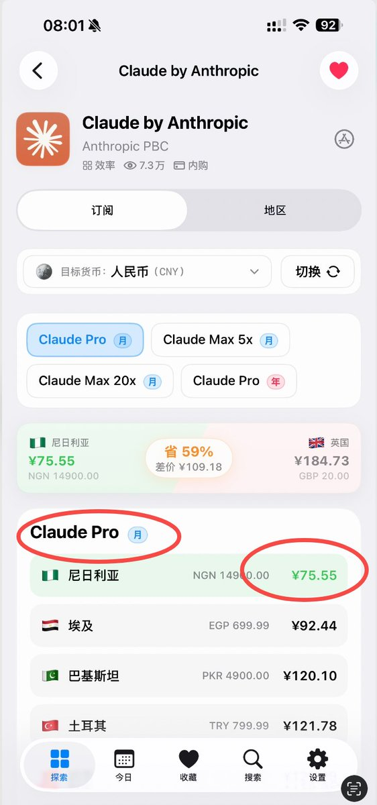
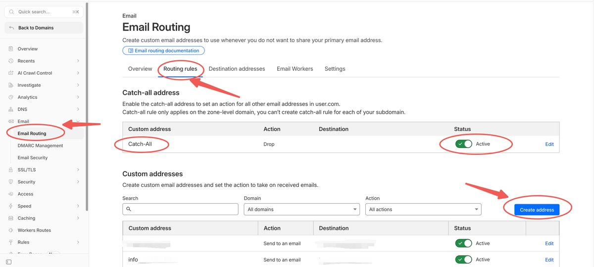
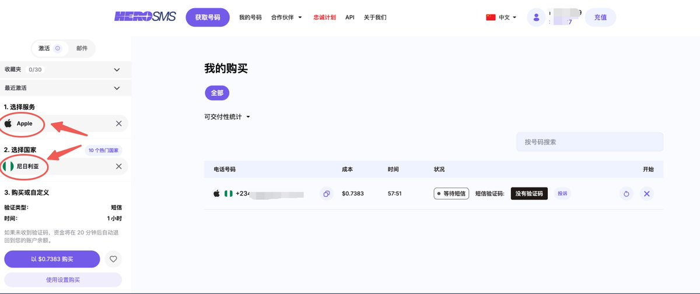
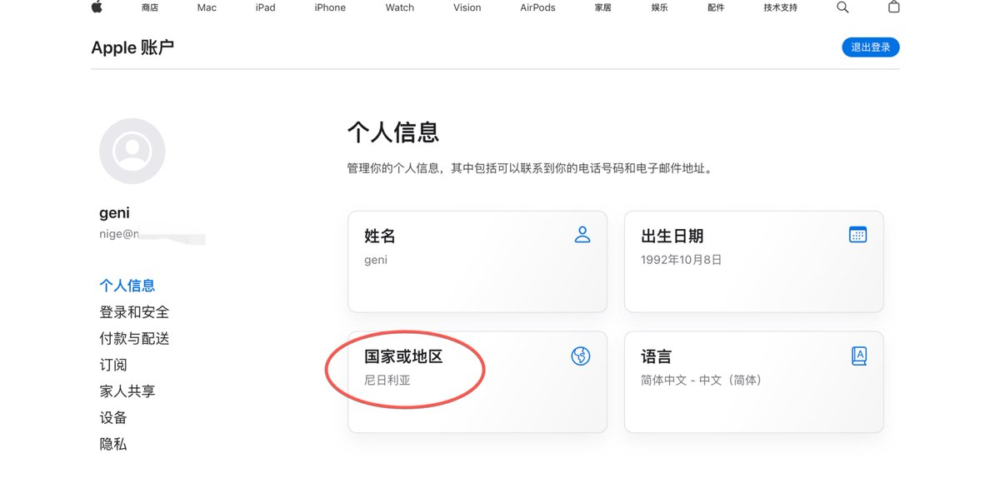
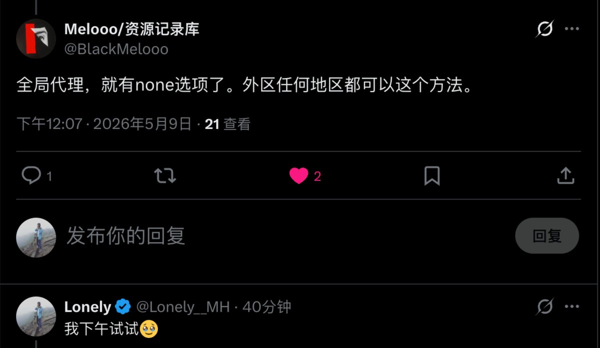
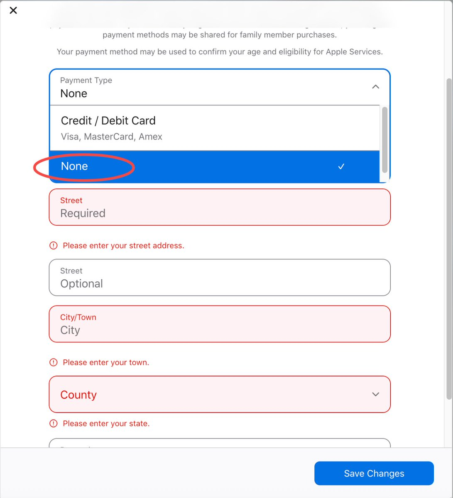
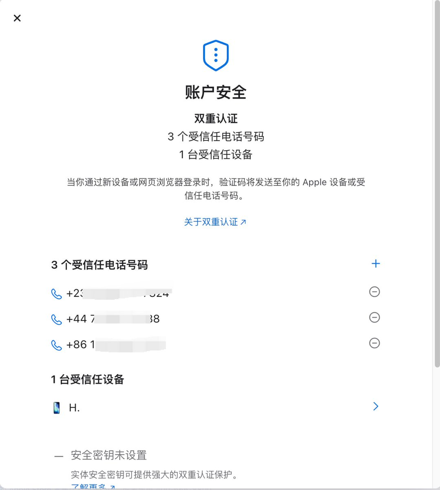
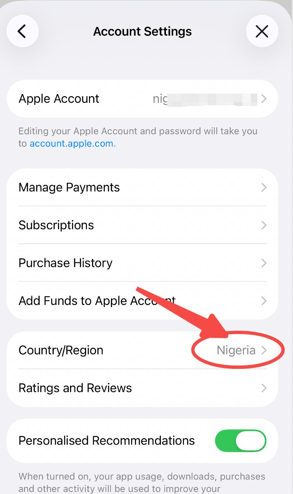
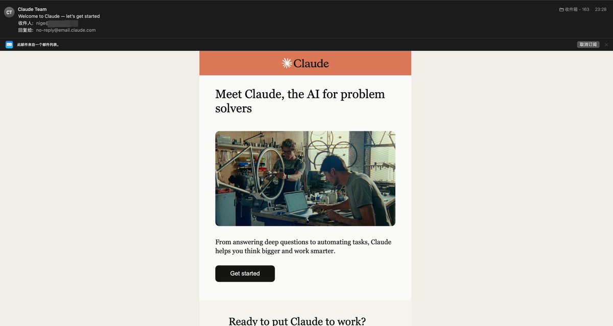
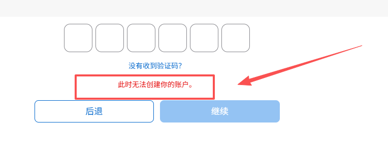

# 📰 🚀 全网最稳的尼日利亚 Apple ID 注册教程：半价订阅Claude Pro「有手就行」

> 注册一个尼日利亚区 Apple ID，Claude Pro 订阅约 ¥76/月，全球最低价。 

> 含金量媲美土区ChatGPT Plus！合法合规，贼稳定！

> 目前含金量最高的几个Apple ID:  美区、土区、尼区、港区

## [🗺](https://abs.twimg.com/emoji/v2/svg/1f5fa.svg)️ 为什么是尼日利亚

一张图自己看😄

---

## [🛠](https://abs.twimg.com/emoji/v2/svg/1f6e0.svg)️ 准备材料

1. 邮箱：见下方两种方式

1. 接码平台：获取尼日利亚临时手机号，注册时用本地号，建议使用尼日利亚号码，风控几率小，注册成功率高，实测稳如老狗（+86也可以，但是我实测不行，可能脸黑🌚）

1. 自己的 +86 手机号：注册完后换绑用

邮箱准备：两种方式

方式一：注册一个新的 Gmail 或 Outlook，QQ邮箱也可以，不要用注册过其他 Apple ID 的邮箱。

方式二：如果你有域名，开启 [Cloudflare](https://dash.cloudflare.com/) Email Routing 的 Catch-all 功能，直接拥有无限个邮箱地址。apple01@域名.com、apple02@域名.com……

任意前缀都是有效邮箱，所有验证码统一转发到你的主邮箱，注册失败换个前缀继续，不用重新注册新邮箱。

设置路径：

CF 后台 → 域名 → Email → Email Routing → Enable → 绑定主邮箱 → 开启 Catch-all

---

[Embedded Tweet: https://x.com/i/status/2055617718628528439]

---

## [1️⃣](https://abs.twimg.com/emoji/v2/svg/31-20e3.svg) 注册 Apple ID

两种方式，选一种：

方式一：全新注册（推荐，稳🔥）

先去接码平台租一个尼日利亚临时号码，注册时必须用本地号。

传送门：[https://hero-sms.com/?ref=532529](https://hero-sms.com/?ref=532529)，搜索「Apple」服务，选 Nigeria。

然后 Safari 开无痕模式，打开 https://account.apple.com/account，填写信息：

- 国家/地区：Nigeria（尼日利亚）

- 出生日期：大于 18 岁

- 姓名：随便填英文名

- 手机号：填接码平台的尼日利亚号码

- 邮箱：填准备好的新邮箱

- 密码：8 位以上，含大写字母 + 数字 + 符号

提交后短信验证码去接码平台查收，完成验证。

也可以参考这篇文章，原理一样。

[Embedded Tweet: https://x.com/i/status/2031540200082649090]

方式二：已有Apple ID 换区（评论区大神支招）

> 📢亲测有效！！！

已有其他地区Apple ID 的，不用接码平台，直接换区：

切换地区的时候，一般都会出现绑定支付方式，不要慌！按照以下步骤：

1. [⚠️](https://abs.twimg.com/emoji/v2/svg/26a0.svg)切换全局代理

1. [⚠️](https://abs.twimg.com/emoji/v2/svg/26a0.svg)切换全局代理

1. [⚠️](https://abs.twimg.com/emoji/v2/svg/26a0.svg)切换全局代理（重要的事情说3遍）

1. 电脑端登录 Apple ID 操作换区

1. 绑定支付方式选择 None

1. 完善下地区信息：用地址生成器随机生成一个填进去

传送门（尼日利亚地址生成）：[https://cn.americaaddress.com/nigeria-address/](https://cn.americaaddress.com/nigeria-address/)

---

## [2️⃣](https://abs.twimg.com/emoji/v2/svg/32-20e3.svg) 换绑手机号 + 补充地区信息

通过 方式一 注册成功后立刻登录网页版 Apple ID：

传送门：[https://appleid.apple.com](https://appleid.apple.com/)

1. 「登录和安全」→ 添加 +86 手机号 → 验证完成后删除临时号码

1. 「个人信息」→ 补充尼日利亚地址，用地址生成器随机生成一个填进去

传送门（尼日利亚地址生成）：[https://cn.americaaddress.com/nigeria-address/](https://cn.americaaddress.com/nigeria-address/)

换绑完成后，账号完全掌握在自己手里，不再依赖接码平台。

---

## [3️⃣](https://abs.twimg.com/emoji/v2/svg/33-20e3.svg) 在 App Store 登录 & 下载应用

1. App Store → 右上角头像 → 登录账号 → 查看地区是否正确显示‘Nigeria’

1. 下载一个免费App （试下Apple ID 是否正常）

1. 我下载了Claude ，并完成了账号注册，等过几天再充值 Claude Pro （后面会继续出教程，请关注我！😄）

---

## 🚨Apple ID 养号 3 到 7 天

> [⚠️](https://abs.twimg.com/emoji/v2/svg/26a0.svg)网上看到不少人说需要养号，不然容易风控，建议养号

每天打开 App Store 浏览几下，免费下载一两个 App，先别充值。

新账号 + 外区 + 大额消费同时触发，容易被风控。等几天再操作充值和订阅。

养号期间我会继续研究礼品卡渠道和订阅流程，后续单独再写一篇教程。

如果大家有尼区 Apple 礼品卡渠道推荐，欢迎评论区留言，不胜感激[👏](https://abs.twimg.com/emoji/v2/svg/1f44f-1f3fb.svg)🏻

Claude 封号这么严重，我不信邪，挑战下，看能否成功半价订阅 Claude Pro，并且苟下去！😄

---

## [❓](https://abs.twimg.com/emoji/v2/svg/2753.svg) 常见问题

Q：能不能直接用 +86 注册？ 

评论区不少人说可以使用 +86，但是我试了几次都不行，估计随缘。我使用的这个尼日利亚手机号方式应该是非常稳的，注册通过率非常高。当然你可以优先使用+86号码试下，说不定你可以成功😄

Q：接码平台收不到验证码怎么办？ 换一个号码重试，号码质量参差不齐，多试几个。

Q：换绑之后接码平台的号码还要保留吗？ 不需要，+86 验证完直接在 Apple ID 页面删掉临时号码。

Q：出现此时无法创建你的账户 

评论区大神建议：联系Apple客户解决！

---

## 🚀 帮你快速选注册方式

不确定该用哪种方式？我做了一个小工具，回答 2 个问题，直接给你对应的步骤（后面会完善下放出来）

这个选择器页面是用蚂蚁百灵 Ring-2.6-1T 生成的，演示录屏如下：

Ring-2.6-1T 是万亿参数旗舰思考模型，昨天刚上线 OpenRouter，限时免费 

几个核心能力：

- 可调节思考深度：可以动态控制模型在推理深度、速度和 Token 消耗之间的平衡，简单任务快速过，复杂任务深度想

- 代理优化：为多步骤工作流专门调优，工具调用稳定，适合跑自动化任务和 Agent 流程

- 深度思考模式：释放模型上限，用于数学、逻辑推理和研究类任务

- 蚂蚁模型矩阵：Ling 负责快执行，Ring 负责深推理，Ming 负责多模态——Ring 就是其中推理最强的那条线

目前限时免费 1 周，大家赶紧蹬起来，不嫖白不嫖😄

传送门[👉](https://abs.twimg.com/emoji/v2/svg/1f449-1f3fb.svg)🏻：https://openrouter.ai/inclusionai/ring-2.6-1t:free

---

---

## 📚 历史文章汇总

1. [Hermes Agent完全指南-实战篇](https://x.com/Lonely__MH/status/2065003176319967480?s=20)

1. 土区半价订阅ChatGPT Plus  [https://x.com/Lonely\_\_MH/status/2050968016826048899?s=20](https://x.com/Lonely__MH/status/2050968016826048899?s=20)

1. 美区Apple ID 注册教程：[https://x.com/Lonely\_\_MH/status/2031540200082649090?s=20](https://x.com/Lonely__MH/status/2031540200082649090?s=20)

1. Claude/ChatGPT/Gemini 支付宝订阅： [https://x.com/Lonely\_\_MH/status/2030996442521985167?s=20](https://x.com/Lonely__MH/status/2030996442521985167?s=20)

1. VPS搭建VLESS + Hysteria2教程：[https://x.com/Lonely\_\_MH/status/2040062011002990968?s=20](https://x.com/Lonely__MH/status/2040062011002990968?s=20)

1. Mac 本地部署大模型完整教程：[https://x.com/Lonely\_\_MH/status/2041027838531506625?s=20](https://x.com/Lonely__MH/status/2041027838531506625?s=20)

1. Hermes Agent 不完全指南：[https://x.com/Lonely\_\_MH/status/2041872607876985295?s=20](https://x.com/Lonely__MH/status/2041872607876985295?s=20)

1. IP质量检查：[https://x.com/Lonely\_\_MH/status/2042623947871785130?s=20](https://x.com/Lonely__MH/status/2042623947871785130?s=20)

1. 为什么豆包不推荐你的品牌：[https://x.com/Lonely\_\_MH/status/2047484659307876751?s=20](https://x.com/Lonely__MH/status/2047484659307876751?s=20)

1. 怎么和你奶奶解释豆包说的不是真的：[https://x.com/Lonely\_\_MH/status/2048924931417866588?s=20](https://x.com/Lonely__MH/status/2048924931417866588?s=20)

---

如果这篇教程对你有帮助，欢迎 关注 + 收藏 + 转发 [👏](https://abs.twimg.com/emoji/v2/svg/1f44f-1f3fb.svg)🏻

关注 [@Lonely\_\_MH](https://x.com/@Lonely__MH)，持续分享新手友好的教程和 AI 工具使用心得。

### 🖼️ Attached Media

## 💬 Replies

### 1 @Lonely__MH (Lonely) (Author)

*Sat May 09 15:00:41 +0000 2026*

🚨尼区Apple ID 注册 补充几点细节：

1.注册Apple ID时，全程没有使用🪜节点

2\. 已有Apple ID 换区时，挂🪜，切全局模式，这样支付方式才会出现 None

3\. Apple ID 注册成功后，不要记着充值，先养几天号，模拟正常下载/浏览，可以有效降低风控

4\. Claude 先下载，免费用几天，等充值后，再尝试订阅

以上，个人经验，供参考。

### 2 @Lonely__MH (Lonely) (Author)

*Sun May 10 00:53:58 +0000 2026*

⚠️评论区推友提醒：

如果接码平台没有收到验证码，请尝试开启电脑🪜，并更换稳定节点，悉知。

如果注册过程中遇到什么问题，请在评论区留言，看到都会回复🙂

### 3 @Lonely__MH (Lonely) (Author)

*Sun May 10 06:08:07 +0000 2026*

想在 X 上赚点工资的小伙伴，看过来，集合了😄
[x.com/Lonely\_\_MH/sta…](https://x.com/Lonely__MH/status/2053355543096676573?s=20)D

### 4 @yanhua1010 (Yanhua)

*Sat May 09 14:03:16 +0000 2026*

@Lonely\_\_MH 牛逼的 前有土区ChatGPT，现在又有 尼区Claude，慢点薅哈哈哈

### 5 @Lonely__MH (Lonely) (Author)

*Sat May 09 14:09:02 +0000 2026*

@yanhua1010 大环境不好，大家能省点就省点。😄

### 6 @dingyi (Ding)

*Sun May 10 01:41:08 +0000 2026*

@Lonely\_\_MH 收藏了

### 7 @Lonely__MH (Lonely) (Author)

*Sun May 10 01:53:04 +0000 2026*

@dingyi 感谢丁总🙂

### 8 @gxjdian (纯棉短裤)

*Sat May 09 13:28:48 +0000 2026*

@Lonely\_\_MH 你这挺全面啊，尼区订阅Claude最便宜

土区订阅ChatGPT最便宜

### 9 @Lonely__MH (Lonely) (Author)

*Sat May 09 13:33:30 +0000 2026*

@gxjdian 我靠，被你发现了😄

土区 ChatGPT Plus
尼区 Claude Pro 

接下来我要挑战下Claude 订阅🥳

### 10 @xiaomovps (小墨同学)

*Sat May 09 13:48:20 +0000 2026*

@Lonely\_\_MH 不错 省钱教程

### 11 @Lonely__MH (Lonely) (Author)

*Sat May 09 13:49:12 +0000 2026*

@legacyvps 接下来 冲破 Anthropic 封锁，争取订阅成功！

### 12 @liyue_ai (李岳)

*Sun May 10 14:05:17 +0000 2026*

@Lonely\_\_MH 半价订阅官方的Claude Pro，有点香啊，这羊毛得薅。

### 13 @Lonely__MH (Lonely) (Author)

*Sun May 10 14:06:42 +0000 2026*

@liyue\_ai 不封号就更香了，过两天开始订阅

### 14 @Zesee (Rachel🥥)

*Sun May 10 13:19:07 +0000 2026*

@Lonely\_\_MH 夸张，全球最低价的claude，当真是信息差了

### 15 @Lonely__MH (Lonely) (Author)

*Sun May 10 13:20:26 +0000 2026*

@Zesee 现在知道也不晚

### 16 @AI_jacksaku (阿川 | AI thinking)

*Sun May 10 02:41:06 +0000 2026*

@Lonely\_\_MH 兄弟，你真的是掌管注册外区的神，靠这个我也好到羊毛了

### 17 @Lonely__MH (Lonely) (Author)

*Sun May 10 02:50:27 +0000 2026*

@AI\_jacksaku 正规途径订阅，只是很多人不知道。

我只是整理下😁，恭喜注册成功🎉

### 18 @msjiaozhu (MapleShaw)

*Mon May 11 07:57:03 +0000 2026*

@Lonely\_\_MH 很详细！收藏了！

### 19 @Lonely__MH (Lonely) (Author)

*Mon May 11 08:05:53 +0000 2026*

@msjiaozhu Nice

### 20 @FLMdongtianfudi (Fang)

*Sun May 10 05:32:32 +0000 2026*

@Lonely\_\_MH claude也能如此便宜！先生大善！

### 21 @Lonely__MH (Lonely) (Author)

*Sun May 10 05:49:06 +0000 2026*

@FLMdongtianfudi 祈求阿迪王发发善心，不要再封号了

### 22 @MinLiBuilds (实践哥 Li)

*Sat May 09 13:28:08 +0000 2026*

@Lonely\_\_MH 我一定要搞一个，这是你的第三篇尼区注册，错不了

### 23 @Lonely__MH (Lonely) (Author)

*Sat May 09 13:34:15 +0000 2026*

@MinLiBuilds 接下来我要冲破Anthropic 的封锁，成功订阅Claude Pro!

### 24 @innomad_io (Innomad 一挪迈)

*Sat May 09 13:36:38 +0000 2026*

@Lonely\_\_MH L 总这篇太详细了，没法再详细了

### 25 @Lonely__MH (Lonely) (Author)

*Sat May 09 13:46:19 +0000 2026*

@innomad\_io 谢谢一总的夸奖！🥳

### 26 @AshlynHe1129 (Ashlyn He)

*Mon May 11 08:55:45 +0000 2026*

@Lonely\_\_MH 卧槽终于有不被封号的办法

### 27 @Lonely__MH (Lonely) (Author)

*Mon May 11 09:01:18 +0000 2026*

@AshlynHe1129 但愿吧😁

### 28 @Astronaut_1216 (叫我阿杭)

*Sat May 09 13:39:18 +0000 2026*

@Lonely\_\_MH 这个组合确实性价比拉满了
补充个亲测的坑：操作的时候一定要用干净 IP，这个得找个合适的厂商，不然很容易卡账户验证或者被风控，别问我怎么知道的… 
蹲一个 Claude 订阅成功的反馈！

### 29 @Lonely__MH (Lonely) (Author)

*Sat May 09 13:42:12 +0000 2026*

@Astronaut\_1216 1. 我注册尼区ID的时候没有使用梯子
2\. 注册Claude使用的新加坡节点
3.我先养几天，过两天订阅Claude Pro, 等我好消息😄

