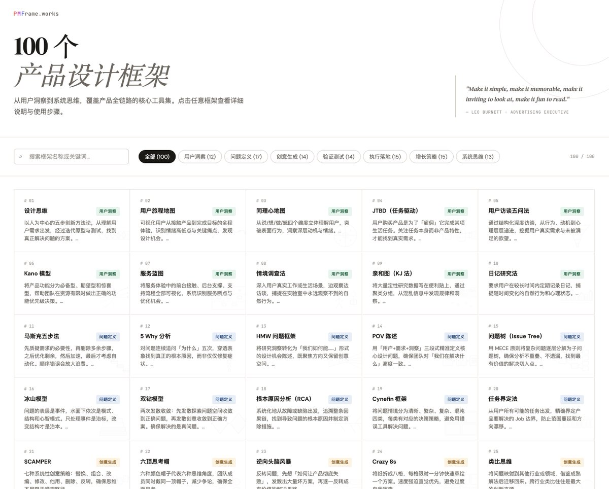
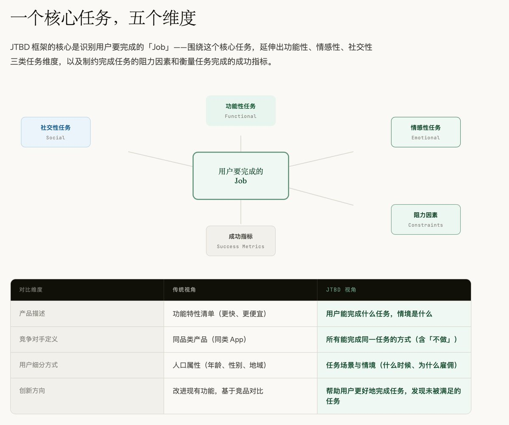
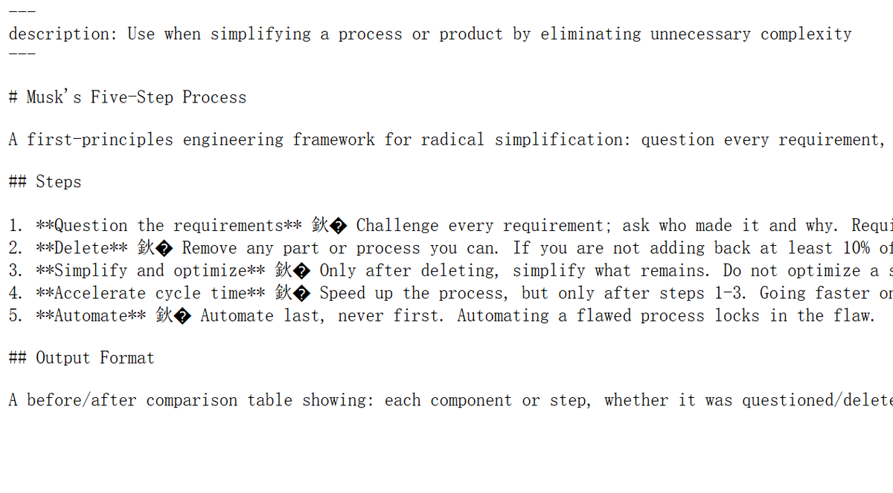

我经常需要在做产品的过程中，快速索引各种框架、方法论和思维工具。

设计思维、JTBD、Kano 模型、精益画布、北极星指标、AARRR……

这些框架你可能都听过，但下次要用的时候，你还是会打开 Google 或者 Claude 从头搜。

我也一样。所以我顺手做了 [pmframe.works](http://pmframe.works)——100 个产品思维框架的索引站。每个框架都有：
· 可视化结构图
· 真实案例拆解
· 可下载的 Skill

站在巨人的肩膀上，少走弯路。
免费开放，拿去用。

### 🖼️ Attached Media

## 💬 Replies

### 1 @cnjunyi (cnjunyi🔆)

*Sun Apr 05 16:16:27 +0000 2026*

@goocarlos 老板，有没有做成skill的版本，我要拿去跟PM对轰

### 2 @goocarlos (Luyu Zhang) (Author)

*Sun Apr 05 20:53:18 +0000 2026*

@cnjunyi 有的，里面有下载，

### 3 @Caldis_Chen (Caldis)

*Sun Apr 05 11:55:06 +0000 2026*

@goocarlos [sdframe.caldis.me](https://sdframe.caldis.me/)
很好的模板 ! 顺着这个思路让 claude 复刻了一个 《100 个软件设计框架》

### 4 @goocarlos (Luyu Zhang) (Author)

*Sun Apr 05 20:53:41 +0000 2026*

@Caldis\_Chen 牛逼

### 5 @xiaochou1945 (Leo AIPhi)

*Sun Apr 05 01:27:48 +0000 2026*

@goocarlos 要是能再加个“我的收藏夹”或 AI 搜索推荐框架的功能，会更完美。

### 6 @goocarlos (Luyu Zhang) (Author)

*Sun Apr 05 03:51:56 +0000 2026*

@xiaochou1945 已经加了的。

### 7 @null12022202 (非典型程序员)

*Sun Apr 05 10:48:10 +0000 2026*

@goocarlos 这个真棒！反馈一个小问题：[pmframe.works/skills/musk-fi…](https://pmframe.works/skills/musk-five-steps.md) 这个页面在 Windows Chrome 中打开，有少数乱码。 

### 8 @goocarlos (Luyu Zhang) (Author)

*Sun Apr 05 20:54:39 +0000 2026*

@null12022202 UTF-8 编码的问题，稍后修复。

### 9 @lambonedz (羊骨头)

*Mon Apr 06 05:36:57 +0000 2026*

@goocarlos 花了半天时间研究了一下细节，发现几个问题，最主要的一个是，首页分类与详细页分类不一致，不知哪一个更准确。用户洞察 (12)问题定义 (17)创意生成 (14)验证测试 (14)执行落地 (15)增长策略 (15)系统思维 (13)， 比如#31， 痛苦解决方案矩阵，卡片上是“创意生成”。 但页面上是“验证与测试”

### 10 @goocarlos (Luyu Zhang) (Author)

*Mon Apr 06 17:34:25 +0000 2026*

@lambonedz 谢谢反馈，我来修复，因为之前确实调整过一点。

### 11 @NPCkui (NPCkui)

*Sun Apr 05 06:42:44 +0000 2026*

@goocarlos 手机的 Web 版没有下载 skill的地方，是不是必须得用电脑的网页版才能看到呀？

### 12 @goocarlos (Luyu Zhang) (Author)

*Sun Apr 05 07:37:45 +0000 2026*

@NPCkui 显然是刻意去掉了呀，为什么会用手机下 skill

### 13 @binghe (冰河)

*Sat Apr 04 13:40:47 +0000 2026*

@goocarlos 我曾经在小红书买过一个 100 多个思维框架的虚拟产品。

类似你这样的设计框架内容。

我把它全转成了 skill ,然后我有问题就调用 skill ,它帮我找到合适的思维模式去回答问题。也非常有意思。。

你这是做成网页端了。真不错。

### 14 @pingchn (Ping.)

*Sun Apr 05 03:20:46 +0000 2026*

@goocarlos 这个和这正在做的一个东西异曲同工！

### 15 @Btcniumowang (牛魔王 | OP_CAT)

*Sun Apr 05 11:14:29 +0000 2026*

@goocarlos 太实用了 已收藏

### 16 @pingchn (Ping.)

*Sun Apr 05 03:18:54 +0000 2026*

@goocarlos 有意思！

### 17 @drmrzhong (AI设计钟师傅)

*Sat Apr 04 12:28:25 +0000 2026*

@goocarlos 果断收藏,感谢分享

### 18 @0xReggieJ (ReggieJ)

*Sat Apr 04 12:43:52 +0000 2026*

@goocarlos 学无止境了家人们

### 19 @Lonely__MH (Lonely)

*Sun Apr 05 10:40:08 +0000 2026*

@goocarlos 太棒了👏，感谢分享!

### 20 @justic_hot (tang | AI Product Maker)

*Sun Apr 05 00:50:21 +0000 2026*

做自己的 AI 视频产品时没有刻意套框架，但碰到「用户来了没回来」自然就把 activation 和 retention 拆开想了——框架这东西用到了才知道名字叫什么。

但有个意外发现：框架名字在跟 AI 协作时特别好使。跟 Claude 说「用 JTBD 分析这个功能」比自然语言描述同样的意思效果好得多。框架名就是压缩好的 prompt，收藏了。

### 21 @z1hanAI (zihan)

*Sat Apr 04 22:08:59 +0000 2026*

@goocarlos 我也做了一个 [dmgt.z1han.com](http://dmgt.z1han.com)

### 22 @melodicgin (金晩)

*Sat Apr 04 11:44:24 +0000 2026*

@goocarlos 真·用心，点赞👍

### 23 @a_fei46647 (阿飞)

*Sat Apr 04 15:52:02 +0000 2026*

@goocarlos 这波我站你，你终于发点干货了！

### 24 @fukui_wuzhi (傅奎)

*Sun Apr 05 05:06:23 +0000 2026*

@goocarlos 这个太实用了！

### 25 @teach_fireworks (烟花老师)

*Sun Apr 05 16:29:28 +0000 2026*

@goocarlos 感谢分享

### 26 @mylifcc (lifcc)

*Sat Apr 04 09:27:10 +0000 2026*

@goocarlos 太有共鸣了，每次做新功能前都要重新搜一遍这些框架，搜到一半就跑偏了。我后来的做法是把每个框架的核心判断问题抽成 checklist，需要时直接对着过，比翻原文档快很多。JTBD 就浓缩成三个问题就够了

### 27 @daodao (盗盗)

*Sun Apr 05 14:18:30 +0000 2026*

@goocarlos 审美也是无敌

### 28 @zuogl448 (左同学)

*Sat Apr 04 14:26:15 +0000 2026*

@goocarlos 已收藏转发，感谢分享。
界面做的真的太棒了！

### 29 @realxyk (柯小宇kk)

*Sat Apr 04 13:01:13 +0000 2026*

@goocarlos 感谢分享！

### 30 @zx377359832 (北落)

*Sat Apr 04 13:22:55 +0000 2026*

@goocarlos 好东西，必须收藏

### 31 @Aaronwn6 (可乐)

*Sat Apr 04 08:22:08 +0000 2026*

@goocarlos 好东西，感谢！

### 32 @Caldis_Chen (Caldis)

*Sun Apr 05 06:42:02 +0000 2026*

@goocarlos 真棒! 我感觉从 dev 的角度也可以做一个软件的设计框架和设计模式的速查手册 (虽然大概率已经不用人读了🤣

### 33 @zhngjny52976818 (Kevinzhang)

*Sun Apr 05 03:59:08 +0000 2026*

@goocarlos 还缺失真的产品设计框架，比如B端、C端、社交等这些产品的框架，这些产品框架才是产品经理需要的。最后可以补充下我的《简易设计》产品框架，可以发给您[mp.weixin.qq.com/s/oqbtYyrxJ2Ep…](https://mp.weixin.qq.com/s/oqbtYyrxJ2EpbXPjys34wA)

### 34 @MaiYangAI (Mai Yang)

*Sun Apr 05 14:55:09 +0000 2026*

@goocarlos 学习他们让我们用 ai 产出价值更大

### 35 @z1hanAI (zihan)

*Sun Apr 05 16:38:29 +0000 2026*

@goocarlos 卧槽看了一下这个也太牛了 好有深度 收藏

