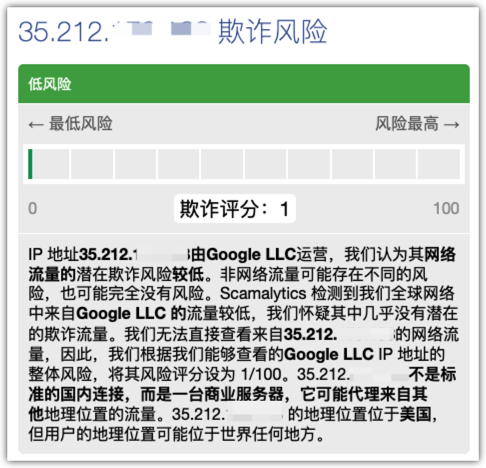
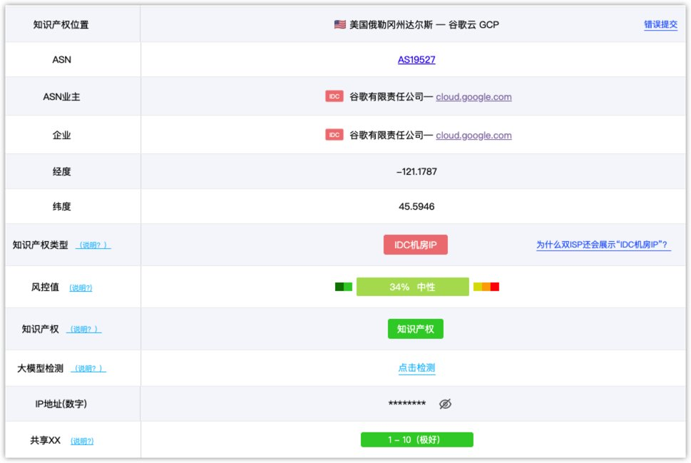
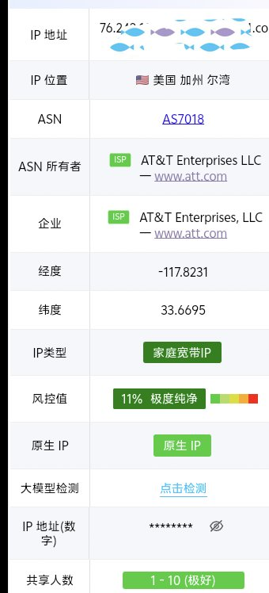
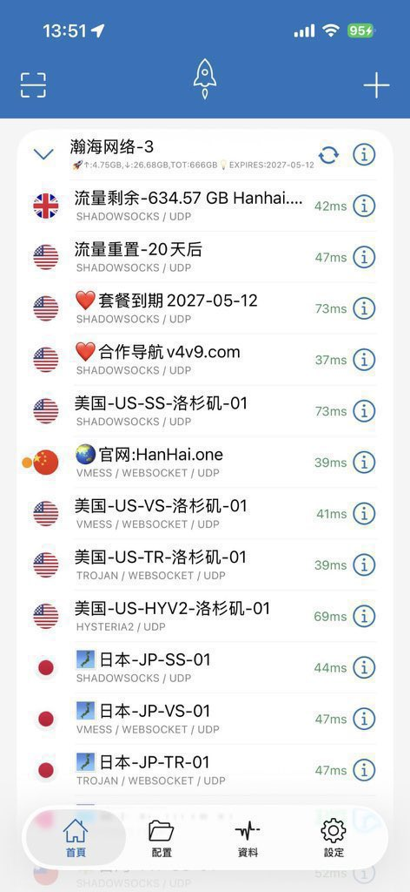
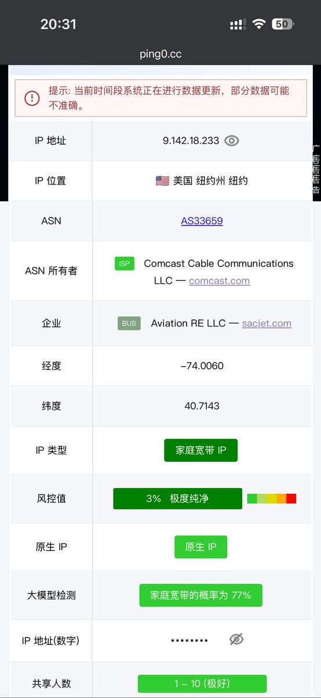

白嫖Google的GCP VPS，

这 IP 干净的一批！

### 🖼️ Attached Media

## 💬 Replies

### 1 @xiaomovps (小墨同学)

*Wed Feb 25 00:53:43 +0000 2026*

@wlzh 谷歌云的IP基本上都被滥用了，看一个网站的风险程度其实没多大意义，而且已经是机房IP了。

有兴趣可以看看我写的判断IP质量的文章

### 2 @wlzh (M.) (Author)

*Wed Feb 25 01:17:04 +0000 2026*

@legacyvps 可别乱讲啊，GCP的IP相当好，我每台都很好！

### 3 @ban_hu92952 (5元高速翻墙)

*Tue Feb 24 17:15:38 +0000 2026*

@wlzh 我举个简单的例子，你就知道这玩意多不靠谱了。你先测一下自己手机流量或者家宽的ip，评分大概从十几到三四十。比你这个脏不少，但是，这是真家宽ip，在诸多应用和注册中，是不会被限制的，而你这所谓的干净ip，甚至一些即时通讯软件都注册不了，更别提交友软件了。

### 4 @wlzh (M.) (Author)

*Tue Feb 24 23:30:55 +0000 2026*

@ban\_hu92952 注册 Google 账户稳的一批啊🤣

### 5 @skaas777 (Jason Lee)

*Tue Feb 24 16:42:45 +0000 2026*

@wlzh 好的不说了，我说一下坏的：GCP的机房ip，干净也用处不大。

### 6 @wlzh (M.) (Author)

*Tue Feb 24 23:31:09 +0000 2026*

@skaas777 注册 Google 账户稳的一批啊🤣

### 7 @zjcxdj33 (jason)

*Tue Feb 24 23:52:32 +0000 2026*

@wlzh 什么网站测的？

### 8 @wlzh (M.) (Author)

*Wed Feb 25 00:14:57 +0000 2026*

@zjcxdj33 [x.com/wlzh/status/18…](https://x.com/wlzh/status/1893208642465239198?s=20Just) a quick check online.

### 9 @jinfez (今非昨)

*Wed Feb 25 04:24:03 +0000 2026*

@wlzh 我也白嫖了，好用，感谢谷歌

### 10 @wlzh (M.) (Author)

*Wed Feb 25 04:39:50 +0000 2026*

@jinfez 谁用谁香！🤣

### 11 @AIxFoolSage (Awoo)

*Wed Feb 25 02:07:51 +0000 2026*

@wlzh claude不能用

### 12 @wlzh (M.) (Author)

*Wed Feb 25 02:55:37 +0000 2026*

@0x7FoolSage 嗯得最好家宽

### 13 @qicaibeijiguang (火焰)

*Wed Feb 25 00:09:41 +0000 2026*

@wlzh 流量单收费。。。。。

### 14 @wlzh (M.) (Author)

*Wed Feb 25 00:12:57 +0000 2026*

@qicaibeijiguang 可以完全不收费的，具体发出来我帮你看看

### 15 @joelz0715 (随风)

*Wed Feb 25 04:18:46 +0000 2026*

@wlzh 慢成狗了

### 16 @wlzh (M.) (Author)

*Wed Feb 25 04:40:02 +0000 2026*

@joelz0715 加上链式！

### 17 @wt6686 (哟哟哎哟)

*Wed Feb 25 05:30:33 +0000 2026*

@wlzh 每月一点点免费资源，任何服务都是钱，小心被反薅。

### 18 @wlzh (M.) (Author)

*Wed Feb 25 06:38:10 +0000 2026*

@wt6686 学会用就好

### 19 @soulforfreeYy (天无奥)

*Wed Feb 25 06:22:15 +0000 2026*

@wlzh 还可以白嫖吗，以前用过

### 20 @wlzh (M.) (Author)

*Wed Feb 25 06:37:53 +0000 2026*

@soulforfreeYy 看上面视频可以搞

### 21 @shangguancifu (​🌐 shangguan｜全球数智出海专家)

*Tue Feb 24 17:38:23 +0000 2026*

@wlzh 我只用 ATT 

### 22 @wumao748 (五毛没烦恼)

*Tue Feb 24 16:35:51 +0000 2026*

@wlzh @grok IP地址有“干净肮脏”的概念吗？

### 23 @justme191126 (WuXiaoHua)

*Wed Feb 25 05:05:02 +0000 2026*

@wlzh 推荐梯子,社媒养号&amp;海外营销&amp;AI服务&amp;海外KYC专用,不封号不降智不限流,免费独享纯净原生住宅IP,IP干净网络稳定,不限设备不限流量 [skyvpn.me/isp](https://skyvpn.me/isp)

### 24 @VastSeaNet (VastSeaNetwork)

*Wed Feb 25 16:21:00 +0000 2026*

@wlzh 优质ip
稳定快速的小火箭节点就在[hanhai.app](http://hanhai.app) 

### 25 @server1517394 (server)

*Wed Feb 25 12:31:45 +0000 2026*

@wlzh 唯一不爽的就是有个BUS 

