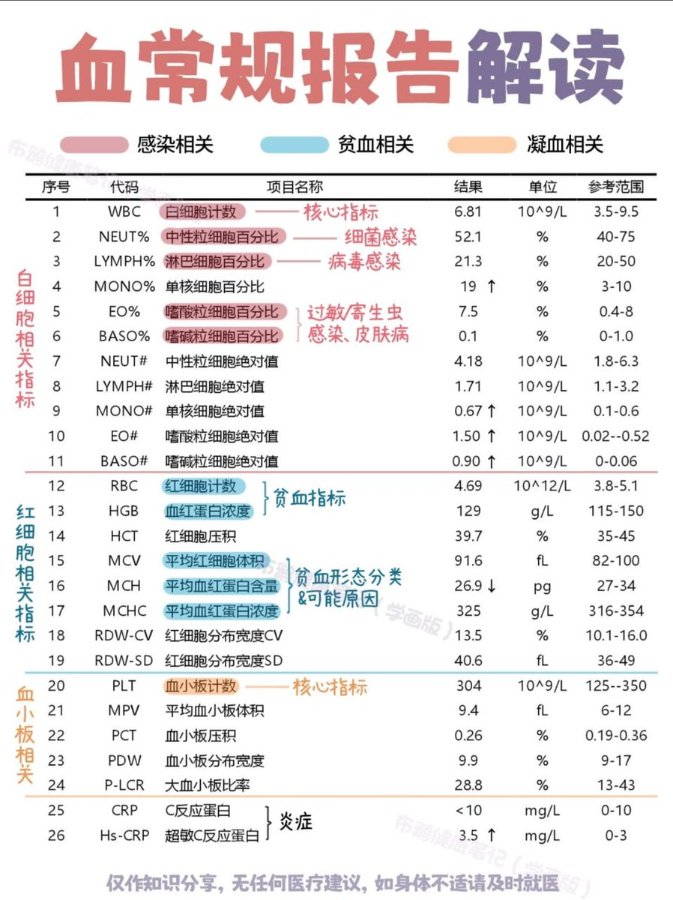

血常规报告解读 

## 💬 Replies

### 1 @CocoaNiu (Cocoa)

*Wed Oct 29 01:18:16 +0000 2025*

@zaprobest 有用👍
[x.com/cocoaniu/statu…](https://x.com/cocoaniu/status/1983083655074656667?s=46)j

### 2 @kaka95276 (kakalt)

*Tue Oct 28 15:30:12 +0000 2025*

@zaprobest 有gpt就不需要这些

### 3 @KUAN6699 (阿寬)

*Wed Oct 29 11:00:23 +0000 2025*

@zaprobest 得到了有用的知識

### 4 @Frank_Kcalse (frank.kcalse kang)

*Wed Oct 29 16:52:00 +0000 2025*

@zaprobest ok

### 5 @FTransfrom29670 (face transfrom)

*Tue Oct 28 07:51:04 +0000 2025*

@zaprobest 是你的么？

### 6 @rokowang (Roko)

*Wed Oct 29 05:58:14 +0000 2025*

@zaprobest 不行了，看到这些我头晕

### 7 @xrhhfiVfpXPZPZI (梓豪)

*Tue Oct 28 21:40:34 +0000 2025*

@zaprobest 参考范围是健康还是不健康？

### 8 @chuntianmiaobz (guodamiaozi)

*Tue Oct 28 15:44:44 +0000 2025*

@zaprobest 血

### 9 @wutangzhengyu (正域彼四方)

*Tue Oct 28 17:48:17 +0000 2025*

@zaprobest 全都正常，但是我还是感觉体质差经常生病长痘痘

### 10 @JennyChenXL (Jenny)

*Wed Oct 29 04:25:25 +0000 2025*

@zaprobest 请问肺气肿病人血红蛋白总是超标，需要定期放血吗

