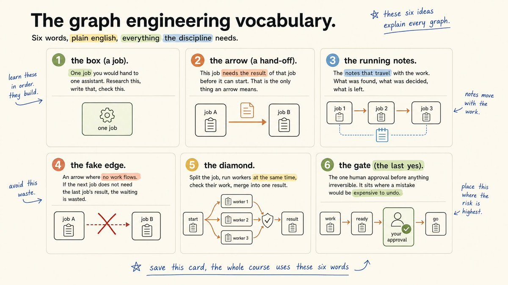
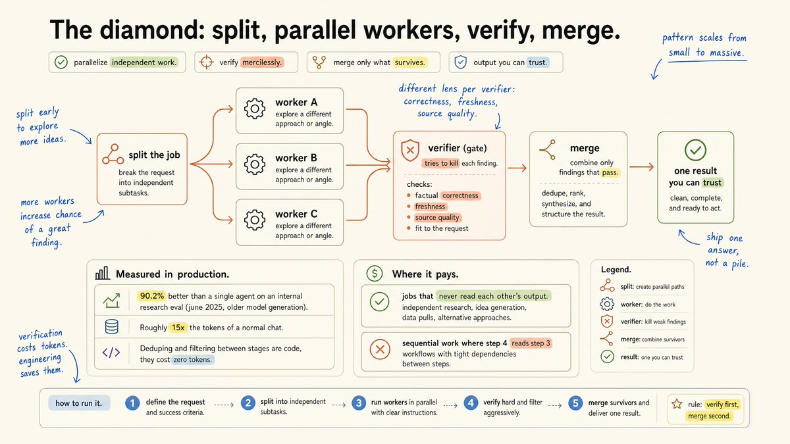
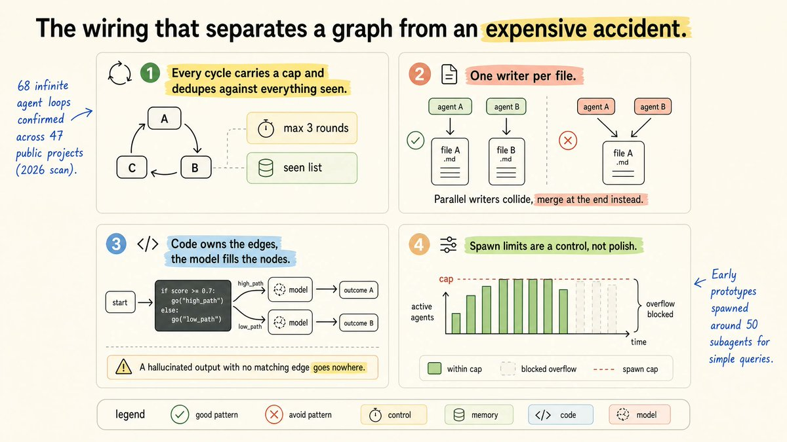
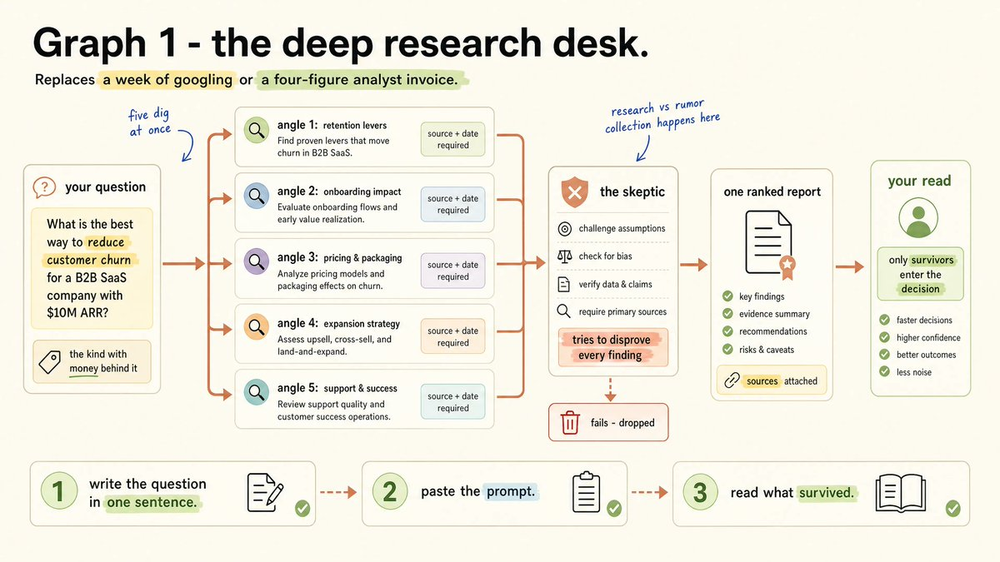
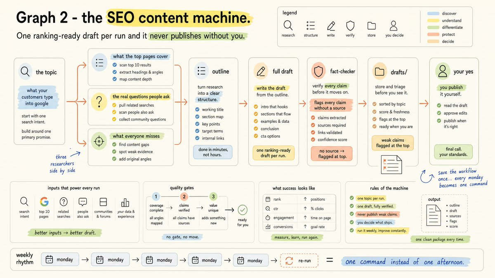
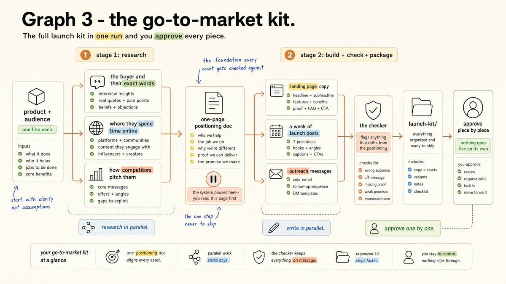
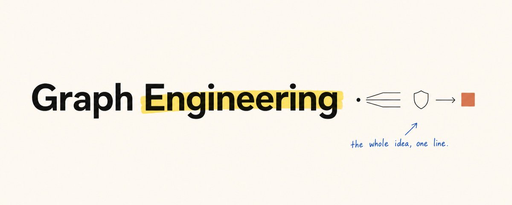

# 📰 How to master graph engineering (Full Course)

I'm going to show you how to build your first agent graph and put it to work in your business today: A team of AI agents that researches in parallel, tries to kill its own findings, and hands you one merged result with your approval as the last yes before anything ships

this course covers the whole method: what a graph is, the one pattern that pays for itself, the stop rule that protects your bill, and 3 complete builds for your business: a research desk, an SEO content machine, and a go-to-market kit

some quick context before we start, because this trend has a story

the engineer who built Claude Code said he doesn't prompt it anymore, he writes loops that prompt it, and a few weeks later the same corner of the internet declared loops old news and moved on to graphs

under all that noise there is a real craft, it is simpler than the posts make it look, and you don't need to be an engineer for any of it

the course map:

- lesson 1: what a graph actually is

- lesson 2: the diamond pattern

- lesson 3: the stop rule

- lesson 4: the human gate

- graph 1 - the deep research desk (build + prompt)

- graph 2 - the SEO content machine (build + prompt)

- graph 3 - the go-to-market kit (build + prompt)

- the playbook

---

if you want to go deeper than this article and learn how to turn systems like these into money, that is exactly what i built the real time AI ops community for: weeklyaiops.com

---

## lesson 1: what a graph actually is

a graph is a plan for your AI work, drawn out so you can see it

it answers two questions: which jobs need to happen, and which job has to wait for which

every job is something you would hand to one assistant, like researching a competitor, writing one draft, or checking one claim

when a job needs the result of another job before it can start, you connect the two with an arrow

and a small set of running notes travels along with the work, holding what was found, what was decided, and what is still left to do

i turned this whole vocabulary into the card below, so save it once and you will never need a definition again:

now i would advise you to do one thing tonight, before you touch any new tool

look at the AI system you run today and, for every "and then" inside it, ask whether the next job needs the last job's result

an arrow is real only when work flows through it

"summarize this file and then check my calendar" sounds like a sequence, but the calendar step never needs the summary, so those two jobs never had to wait for each other

when the answer is no, the arrow is fake and the waiting is wasted, and you will find two or three of these fake edges in any system you draw

right now your system runs as a straight line where every job waits for the one before it, and that works, but it is the slowest possible way to run things, because one stuck job blocks everything behind it

one more thing before we build: engineers pushed back on this trend within hours, pointing out that it is a decades-old pattern wearing a new name, and they are right

i see that as the good news, because a pattern that has run critical systems for decades is exactly what you want to trust with your business

## lesson 2: the diamond - the one pattern that pays

watch any serious agent system work and the same picture keeps appearing

the work splits, several workers dig side by side, something checks what they found, and everything merges back into one answer

that picture is called the diamond, and i feel confident saying it is the only pattern you need this year

the research feature inside Claude runs exactly this in production, one lead plans, workers gather in parallel, and the findings get checked before they reach you

now the part everyone skips, the checking step, and you should treat it as non-negotiable

every serious test of AI self-review lands on the same conclusion: models miss most of their own mistakes

so you should never let the same agent grade its own homework

give the checking to a separate job whose only task is to kill weak findings before they reach you, and give every checker a different question... one asks if it is correct, one asks if it is current, one asks if the source is real

## lesson 3: the stop rule

more agents is not automatically better, and this is the part of the course that saves you real money

when researchers hand a team of agents and a single agent the same budget, the team wins clearly on work that splits into independent pieces, and loses just as clearly on work where each step needs the previous one

so here is the stop rule

a graph buys breadth, it does not buy better judgment

my advice is simple: when every step needs the full picture, you should stay with one agent, and the moment the work splits into jobs that never read each other's results, that is when the graph starts paying

so before you add a single agent, ask the only question that decides the bill... where does my work split

## lesson 4: the human gate

you are the most important node in your own graph, and this lesson is about where exactly you should stand

every serious system routes to a human before anything irreversible, because the send, the publish, the refund and the invoice are arrows that should end at you, and that approval is the last yes between a drafted pipeline and the world

even Klarna learned this in public, going all in on AI support, admitting the cost cutting went too far, and bringing human service back as the premium tier

the design rule fits in one line

put your approval where a mistake would be expensive to undo, not on every step

a gate on everything makes you the bottleneck, and a gate on nothing means nobody is watching

i would also advise you to judge the whole system on numbers that cannot argue back, money that landed, customers that stayed, tests that ran, because a system that only grades its own reports is confidently wrong

four small rules keep everything from becoming an expensive accident, and the card below is the version you save: every loop gets a maximum number of rounds, only one job writes to any one file, the routing lives in written steps while the AI fills the jobs, and there is always a cap on how many agents can spawn

---

## the builds - three graphs that pay for themselves

every build here runs in Claude Code, ends with the exact prompt you paste, and keeps you as the gate

one word in each prompt does the heavy lifting: "workflow" tells Claude to build a coordinated team instead of working through a single line of steps

## graph 1 - the deep research desk

think of the last decision you made with real money behind it, a price change, a new offer, a market you almost entered

you probably decided it on a week of googling, or an expensive analyst invoice, and this build replaces both

your question splits into five angles, five researchers dig at once, a skeptic attacks every finding, and only the survivors reach the final report with their sources attached

1. open Claude Code in an empty folder

1. write your real question in one sentence, the kind with money behind it... "should i raise my price" or "which of these two offers do i launch"

1. paste the prompt below with your question in it

1. watch the fan-out, five researchers working in parallel, then the skeptic pass

1. read the report, and only what survives your read enters the decision

the prompt:

"i need decision-grade research on: \[your question\]. use a workflow: split the question into 5 distinct angles, run one researcher per angle in parallel, every finding needs a source link and a date, then run a skeptic against each finding that tries to disprove it, drop what fails, merge the survivors into one report ranked by confidence, save it as research-report.md and show me the top findings"

your first run takes minutes instead of days, and i feel like the skeptic pass is the real product here, because it is the difference between research and rumor collection

## graph 2 - the SEO content machine

be honest about your publishing schedule for a second, because for a lot of businesses it either costs a monthly retainer or it simply stopped happening

this build writes one ranking-ready draft per run, and it never publishes without you

three researchers work side by side, one on what the current top pages cover, one on the real questions people ask, one on what everyone misses, then their work merges into an outline, a draft gets written and fact-checked, and it waits in your folder for your yes

1. pick the one topic your customers type into google

1. paste the prompt below

1. the three research jobs run at once, top pages, real questions, gaps

1. the draft lands in your drafts folder with every claim checked and the weak ones flagged at the top

1. you read it, fix what only you would know, and publish it yourself

1. then ask Claude to save the workflow, and every monday this becomes one command instead of one afternoon

the prompt:

"i want an article that can rank for: \[topic\]. use a workflow: run three research jobs in parallel, one lists what the current top-ranking pages cover, one collects the real questions people ask about this topic, one finds what the top pages skip, merge all three into an outline, write a full draft from the outline, then run a fact-checker that flags every claim without a source, save the draft to drafts/ with the flagged claims listed at the top, never publish anything"

## graph 3 - the go-to-market kit

you are launching something, a product, an offer, a service, and the honest options were always weeks of prep or launching blind

this build produces the full kit in one run, with you approving every piece

three researchers profile the buyer, the channels and the competition in parallel, their work merges into a one-page positioning doc, and the system pauses there so you can read it, because that page becomes the foundation every asset gets checked against

then three writers draft the landing copy, the launch posts and the outreach messages side by side, a checker flags anything that drifts from the positioning, and the kit lands in a folder where nothing goes live on its own

1. name the product and the person it is for, one line each

1. paste the prompt below

1. read the positioning page when the system pauses, this is the one step i would never skip

1. let the three writers produce the assets in parallel

1. review what the checker flagged

1. approve piece by piece, nothing ships without you

the prompt:

"i'm launching \[product\] for \[audience\]. use a workflow: run three research jobs in parallel, one profiles the buyer and collects the exact words they use, one maps where these buyers spend time online, one collects how competitors pitch them, merge into a one-page positioning doc and pause to show it to me, then run three writers in parallel from that doc: landing page copy, a week of launch posts, a set of outreach messages, then run a checker that compares every asset against the positioning doc and flags anything off, save everything to launch-kit/ and change nothing after that without asking me"

---

## the playbook

- fake edges first: nothing new runs until the no-work arrows are gone

- split only what never reads back, one agent keeps everything step-by-step

- no finding travels unchecked, and no two checkers ask the same question

- every loop has a maximum number of rounds

- one writer per file, the plan lives in written steps, the AI fills the jobs

- the last yes sits exactly where a mistake would be expensive to undo

- one tool is enough until you can name the reason it isn't

skip that last yes and the graph ships its first confident mistake straight to a customer

---

draw your current AI system tonight, just the jobs and the arrows between them

count the fake edges, then delete them

that is the first move of the whole craft, it costs nothing, and it usually removes more waiting than any tool you could buy

### 🖼️ Attached Media

## 💬 Replies

### 1 @EXM7777 (Machina) (Author)

*Wed Jul 22 15:01:17 +0000 2026*

[weeklyaiops.com](http://weeklyaiops.com)

### 2 @vasuman (vas)

*Wed Jul 22 15:26:36 +0000 2026*

@EXM7777 Masterclass

### 3 @EXM7777 (Machina) (Author)

*Wed Jul 22 15:26:54 +0000 2026*

@vasuman hire me at varick

### 4 @VibeMarketer_ (J.B.)

*Wed Jul 22 14:22:55 +0000 2026*

@EXM7777 new trend just dropped

### 5 @EXM7777 (Machina) (Author)

*Wed Jul 22 14:23:21 +0000 2026*

@VibeMarketer\_ and it's fucking dope

### 6 @tomcrawshaw01 (Tom)

*Wed Jul 22 14:38:05 +0000 2026*

@EXM7777 Bookmarked 🔥

### 7 @EXM7777 (Machina) (Author)

*Wed Jul 22 14:38:13 +0000 2026*

@tomcrawshaw01 boss

### 8 @Av1dlive (Avid)

*Wed Jul 22 14:29:37 +0000 2026*

@EXM7777 W article machina

### 9 @EXM7777 (Machina) (Author)

*Wed Jul 22 14:38:19 +0000 2026*

@Av1dlive thanks bro

### 10 @internetkid69 (Internet Kid)

*Wed Jul 22 15:07:37 +0000 2026*

@EXM7777 this is superb

### 11 @EXM7777 (Machina) (Author)

*Wed Jul 22 15:13:31 +0000 2026*

@internetkid69 he knows

### 12 @burakIai (Burak)

*Wed Jul 22 14:48:51 +0000 2026*

@EXM7777 Bookmark

### 13 @EXM7777 (Machina) (Author)

*Wed Jul 22 14:51:18 +0000 2026*

@burakIai right

### 14 @DeRonin_ (Ronin)

*Wed Jul 22 15:56:14 +0000 2026*

@EXM7777 that's the pure evolution of loop engineering and I've already updated my content engine based on this conception

really good explanation

### 15 @kloss_xyz (klöss)

*Wed Jul 22 16:06:54 +0000 2026*

@EXM7777 epic share fam

### 16 @alphabatcher (Alpha Batcher)

*Wed Jul 22 16:20:53 +0000 2026*

@EXM7777 another day and another great article about graph engineering

thanks for the guide

### 17 @AiCapitalMarket (AI Capital Market by SOON)

*Thu Jul 23 01:01:41 +0000 2026*

@EXM7777 Really appreciate you sharing this! It's the kind of content that genuinely makes scrolling worthwhile. Keep it coming 🙌

### 18 @gerardsans (Gerard Sans | Axiom 🇬🇧)

*Thu Jul 23 12:49:08 +0000 2026*

@EXM7777 [x.com/gerardsans/sta…](https://x.com/gerardsans/status/2080265890029838728)

### 19 @santiagoo24_ (sannn ~)

*Wed Jul 22 20:27:51 +0000 2026*

@EXM7777 great article! thanks for sharing.

[x.com/santiagoo24\_/s…](https://x.com/santiagoo24_/status/2080026977587581082?s=20)

### 20 @nicholas_diao (Nick Diao)

*Thu Jul 23 00:13:06 +0000 2026*

@EXM7777 Check out Fractal for building these graphs: 

[x.com/Plasma\_\_AI/sta…](https://x.com/Plasma__AI/status/2079636286990881263)

### 21 @Muricaenjoyer (Murica Enjoyer)

*Thu Jul 23 02:25:20 +0000 2026*

@EXM7777 I just browse twitter and show up at work looking smarter than everyone because I was doom scrolling, life is cool, thanks man much appreciated

### 22 @nxpatterns (Enterprise Software Architecture)

*Fri Jul 24 08:02:15 +0000 2026*

@EXM7777 Excellent 👏 Beautiful illustrations. Liked &amp; reposted.

### 23 @itsthedonhashim (Hussain Hashim | Building SundayBack)

*Wed Jul 22 15:08:17 +0000 2026*

@EXM7777 @EXM7777 curious if this could help with big data analysis. always a pain managing parallel processes manually.

### 24 @thegeneralist01 (thegeneralist)

*Wed Jul 22 21:30:12 +0000 2026*

@EXM7777 @tunahorse21 vibecheck?

### 25 @ryanpettry (Ryan)

*Thu Jul 23 01:14:10 +0000 2026*

@EXM7777 [x.com/plasma\_\_ai/sta…](https://x.com/plasma__ai/status/2080095439274066322)

### 26 @l1ndlee (l1ndle)

*Wed Jul 22 20:35:01 +0000 2026*

@EXM7777 the fake edges point is underrated - most agent graphs are just slow linear workflows with nicer diagrams

### 27 @adithatipalli (Adithya Thatipalli)

*Wed Jul 22 17:32:20 +0000 2026*

@EXM7777 This is beautiful. I will read it again

### 28 @marcgregory_ (Marc Gregory)

*Wed Jul 22 17:50:49 +0000 2026*

@EXM7777 sick write up

### 29 @marcgregory_ (Marc Gregory)

*Wed Jul 22 17:50:22 +0000 2026*

@EXM7777 Just voice prompt into terminal 

### 30 @EightBitElon (8 Bit Elon)

*Wed Jul 22 20:57:25 +0000 2026*

@EXM7777 @grok what is graph engineering and how does it differ from loop engineering?

Is it about ontologies and stuff?

### 31 @biproductionss1 (BI Productions)

*Sun Aug 02 23:28:25 +0000 2026*

@EXM7777 thanks man

### 32 @fumanpnp (河村 風真｜Fuma Kawamura)

*Fri Jul 24 17:18:29 +0000 2026*

@EXM7777 @LilysAI\_ 要約して

### 33 @air_codex (stoikwv)

*Thu Jul 23 12:39:12 +0000 2026*

@EXM7777 i have learned something valuable! thx sir

### 34 @rashidazarang (Rashid Azarang)

*Thu Jul 23 05:24:15 +0000 2026*

@EXM7777 This is not even graph.

