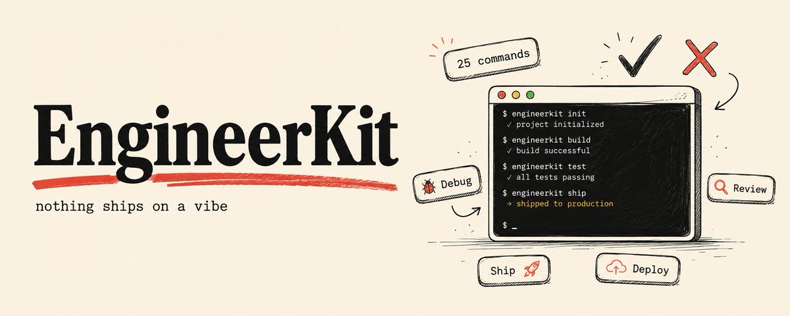
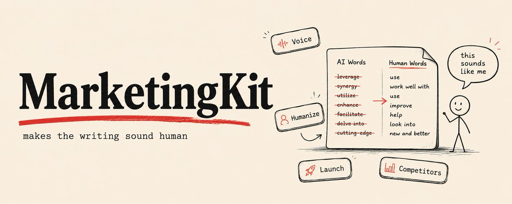
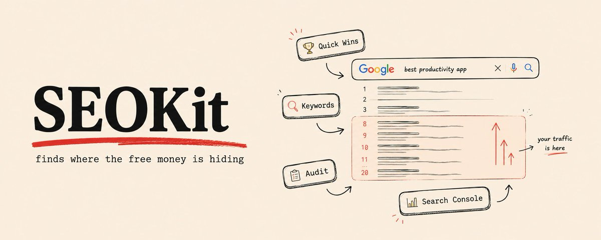
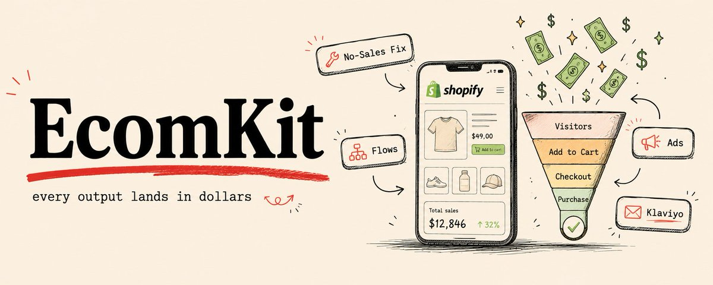
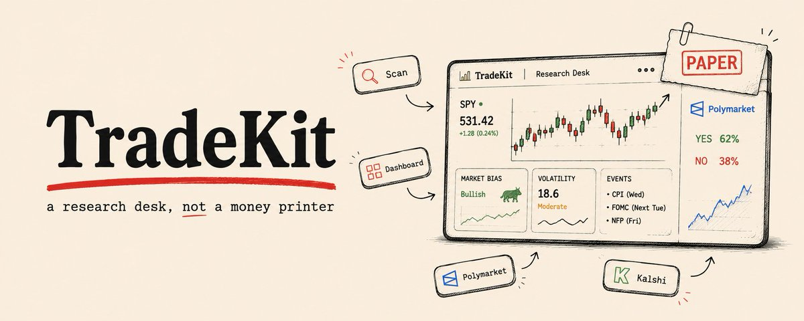

# 📰 How to Turn Claude Code Into a Full Team of Specialists:

what most people do with Claude Code:

\- open a session

\- paste a task

\- get the thing done

\- close the tab

Next session you explain it all over again. 

Your stack. Your standards. 

The way you like things shipped. 

What "done" even means on your team.

That is one brilliant assistant with amnesia.

Useful. But small.

There is a different way to run it.

Claude Code out of the box is raw. Ridiculously capable, but raw. 

it knows how to code, write, research, edit video. 

What it doesn't know is you. It starts cold every single time. No memory of your conventions, your voice, your benchmarks, the checklist that keeps you from shipping something broken at 2am.

So you spend the first ten minutes of every session re-teaching it. 

Again. And again.

ClaudeKit fixes that (http://theclaudekit.com/)

## What ClaudeKit actually is

Not a prompt pack.

Not a Notion doc full of "10 killer prompts for developers."

Not a collection of tips you copy and paste and forget by Thursday.

It's a marketplace of vertical kits for Claude Code. 

Each kit is a complete specialist. Slash commands, skills, and subagents, all pre-built for one type of work and one type of person.

You install a kit, and Claude Code \*becomes\* that specialist. 

Instantly. 

It shows up already knowing the workflow, already carrying the domain knowledge, already wired to the tools that job needs.

You are not prompting from scratch anymore.

You are hiring a department.

Any kit starts at $14.99 a month. 

Installing is one line inside Claude Code:

\`\`\`
\`ck install \[kitname\]\`
\`\`\`

That's the whole setup. 

browse every kit at https://theclaudekit.com before you spend a cent

And yeah, every file is measured for context cost before you load it so you always know what a kit is doing to your window. 

That part is kind of the whole point.

Let me walk you through the team.

## EngineerKit

This is the one I reach for daily

25 commands, plus skills and read-only subagents, all built around one rule: nothing ships on a vibe. 

Everything ends with evidence.

\`\`\`
/eng-debug
\`\`\`

pulls the trace, reads the last 15 commits near the failure, reproduces the bug first refuses to touch code until it can name the cause in one sentence ships the smallest fix plus the regression test that would have caught it red before, green after, full suite run.

\`\`\`
/eng-review 
\`\`\`

reviews your diff and flags only what would actually block a merge confidence level on every finding not here to nitpick quotes (here to tell you what's going to break)

\`\`\`
/eng-ship 
\`\`\`

commits, pushes, opens the PR with a description written from the actual diff flat out refuses if tests are failing or a secret is sitting in the diff it won't let you ship the broken thing

\`\`\`
/eng-catchup
\`\`\`

 is the memory cure. 

Came back after a pull, a /clear, or a long weekend??? It reads what changed so you're not re-explaining your own repo to your own assistant.

For devs, solo founders, & agencies shipping real products on real deadlines. 

If you write code with Claude Code, this is the floor.

## VideoKit

I did not expect a video studio to live inside my terminal. 

It does now...

17 commands that take video from "I have an idea" to "the file is rendered & it's good."

\`\`\`
\`/video-make\` 
\`\`\`

goes from a description a URL, or even a repo straight to a finished video. Music, transitions, the whole thing. 

And it watches its own output afterward a real post-render check so what lands on your disk is confirmed not a maybe that's secretly black frames for 4 seconds.

\`\`\`
/video-clone
\`\`\`

is the one that makes people lean in. 

Point it at a video you wish you'd made. 

It measures every scene of the reference. 

The cuts the palette, the type, the motion and easing. 

Then it rebuilds that exact style in Remotion with your content, and re-analyzes its own render to prove the match. 

Scene count, durations, cuts per ten seconds, all compared back to the original. Their pacing and taste, your footage and copy.

\`\`\`
/video-social 
\`\`\`

takes one long video and cuts it for TikTok, Reels, Shorts, LinkedIn, and X in a single run. 

Every format, one command.

\`\`\`
/video-repurpose 
\`\`\`

finds the best moments in a long piece automatically, so you're not scrubbing a timeline at midnight looking for the good 12 seconds.

For content creators, marketers, & agencies who are drowning in "we need it in every aspect ratio by tomorrow."

## MarketingKit

Every other kit does marketing ops. This one does the thing nobody else nails. It makes the writing sound like a human wrote it.

\`\`\`
/mkt-humanize
\`\`\`

is the moat. It sweeps a draft for the 14 tells that scream "AI wrote this." Em dashes used as glue. 

The "it's not X it's Y" tic. The banned words, delve and leverage and seamless and elevate, the whole tired vocabulary. It doesn't just flag them. 

It fixes them, rewrites the piece in your voice, & shows you the worst 5 fixes as before and after lines so you can actually see what changed. 

\`\`\`
/mkt-launch 
\`\`\`

writes the full launch set in one pass. 

The X post, the LinkedIn post, the Product Hunt tagline and description, and the launch email. 

All of it run through the voice engine, so the launch reads like you wrote it on a good day, not like a template.

\`\`\`
/mkt-competitors
\`\`\`

tears down a competitor's content engine. 

Their hooks, their cadence, their formats, and the gaps worth stealing.

And before any of that \`/mkt-voice\` builds a voice file from 5 to 10 of your real posts. 

Your sentence rhythm, your openers, the words you actually own. 

After that every command in the kit writes like you instead of like a chatbot doing an impression of you.

For founders doing their own marketing, content teams, and agencies tired of editing the AI smell out of every draft by hand.

## SEOKit

SEO is mostly knowing where the free money is hiding. 

This kit finds it.

\`\`\`
/seo-quick-wins 
\`\`\`

is the first thing I run on any site. It pulls 90 days of Search Console data, finds the keywords you almost rank for positions 8 to 20 where Google already half-trusts you, plus the snippets at the top quietly losing clicks. 

Then it ranks every win by click prize, in actual clicks per month, with a one-line fix per row. 

\`\`\`
/seo-keywords
\`\`\`

gives you keyword clusters with volume, difficulty, and the part most tools skip: whether the person searching is researching or ready to buy. 

Intent is the whole game.

\`\`\`
/seo-audit 
\`\`\`

audits the entire site and hands you one readable report. 

Top 3 problems first, each written as evidence, impact, and the fix. 

Not a 4,000 row CSV dump you'll never open. 

The actual stuff that's costing you traffic in order.

For content teams, SEO agencies& founders growing on organic instead of burning cash on ads.

## EcomKit

This kit talks in money. 

Every output lands in dollars, hours, or margin points.

\`\`\`
/ecom-no-sales
\`\`\`

is the reality check. It compares your conversion rate to the real benchmark for your price band, not some flat 1.4% average that means nothing. Then it walks your store like an actual shopper would. 

Homepage, collection, best-seller, cart. And it hands back at most 8 fixes ranked by expected dollars per month. If the truth is that your traffic is the problem, it says so to your face instead of blaming your product page.

\`\`\`
/ecom-flows 
\`\`\`

writes all 5 core Klaviyo flows with full email copy in your brand voice, send timing, and discount logic baked in. Welcome, abandoned cart, browse abandon, post-purchase, winback. 

\`\`\`
/ecom-ads
\`\`\`

builds a 27-ad test batch, 3 hooks by 3 bodies by 3 CTAs, pulled straight from your own customers' review language. 

The words buyers already use, turned into the words that make them buy.

For ecom founders, Shopify operators, and agencies running stores for clients who only care about one number.

## TradeKit

The bonus seat at the table...

It's an AI quant research desk for prediction markets & crypto.

\`\`\`
/tk-scan 
\`\`\`

scans live Polymarket and Kalshi markets and ranks them by an edge score, where your model and the crowd's price disagree.

\`\`\`
\`/tk-dashboard\` 
\`\`\`

spins up a full quant dashboard right in your browser, built from your own markets. Live scanner, sizing, the works.

And now the honest part, because this is the bit most tools lie about: it's read-only and paper by default. 

It does not touch your money. Roughly 84% of Polymarket wallets lose, and any tool promising you profits is selling you something. 

TradeKit is a research desk, not a money printer. 

It makes you sharper and keeps you disciplined. 

That's it. 

For prediction market traders & crypto researchers who want an edge without the fairy tale.

## Getting started

Three steps. That's the whole thing....

\- Go to theclaudekit.com and look at the kits. 

\- Pick the one that matches the work you actually do this week.

\- Run ck install \[kitname\] & follow the steps

\- And watch it turn into that specialist in front of you.

That's it. You're running a team now.

Most people will read this whole thing, nod, and install nothing. 

They'll keep opening cold sessions and re-explaining their repo to Claude every single time.

The ones who run that first command today will have a full team by the end of the week.

And they are not going back to a single chat box.

https://theclaudekit.com

Go hire your department.

— Madni

### 🖼️ Attached Media

## 💬 Replies

### 1 @beamnxw (beamnxw ./)

*Mon Jun 22 11:08:38 +0000 2026*

@hey\_madni kits like this turn claude from a tool into an actual team

### 2 @hey_madni (Madni Aghadi) (Author)

*Mon Jun 22 11:23:02 +0000 2026*

@beamnxw fr

### 3 @alphabatcher (Alpha Batcher)

*Mon Jun 22 11:01:46 +0000 2026*

@hey\_madni step by step guide, Madni

you doing great work

### 4 @hey_madni (Madni Aghadi) (Author)

*Mon Jun 22 11:03:04 +0000 2026*

@alphabatcher tysm!!

### 5 @de1lymoon (Alex)

*Mon Jun 22 13:25:41 +0000 2026*

@hey\_madni I think this is a very relevant topic right now

I'm currently trying to build a team with claude's help

### 6 @0xMortyx (Morty)

*Mon Jun 22 13:10:52 +0000 2026*

@hey\_madni bookmarked bro, thanks for alpha

### 7 @JulieFrench_ (Julie French)

*Mon Jul 06 10:29:02 +0000 2026*

@hey\_madni Your kit looks great 🔥- check your X @ username link in your about  (Updates and replies go out on)

### 8 @v_cherkavskyi (Vadym Cherkavskyi | MemPlato)

*Wed Jun 24 10:20:41 +0000 2026*

@hey\_madni MCP memory server solves exactly this — I built one that runs on Android, gives Claude persistent memory across all sessions. No cloud, data stays on device: [github.com/VChe-creator/m…](http://github.com/VChe-creator/memplato)

