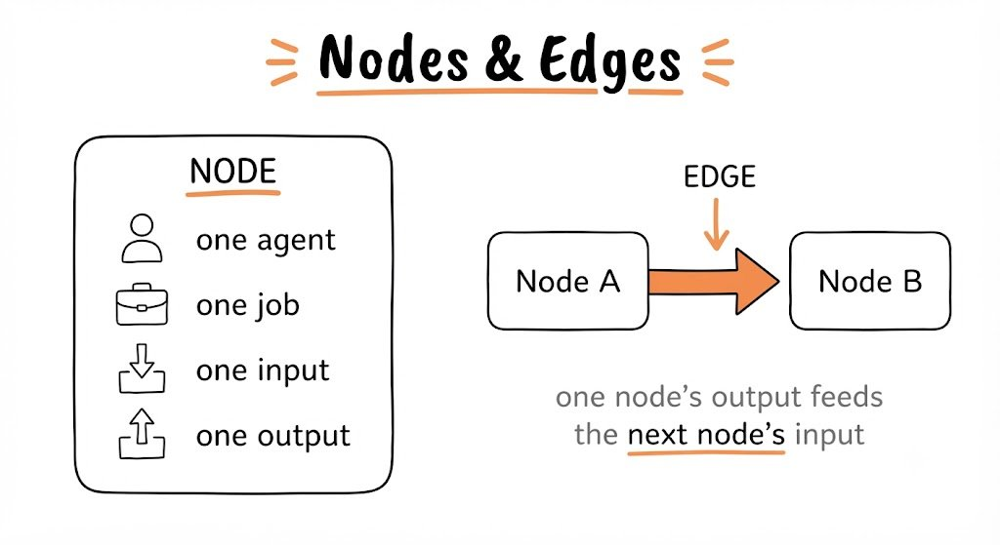
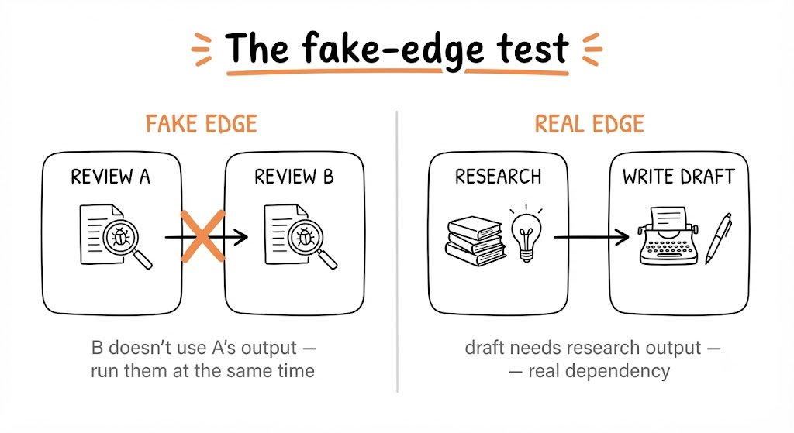
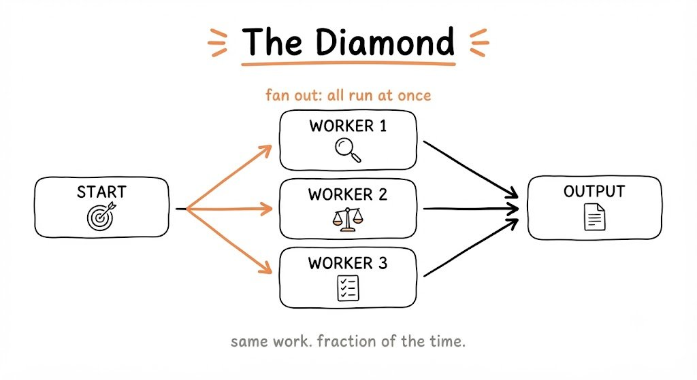
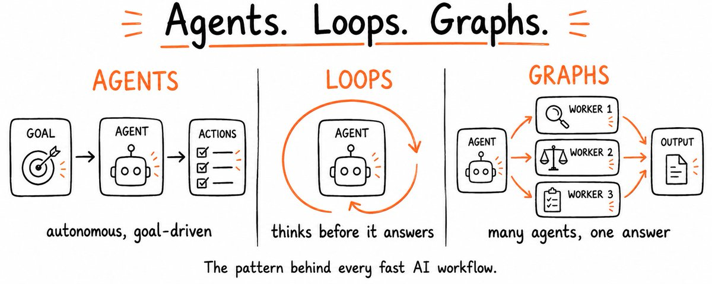

# 📰 Agents, Loops, Graphs. Everything You Need to Know in One Place.

Most people use AI at one speed: ask, read, fix, ask again. It works. It's also the slowest way to do it.

There is a faster setup. It has three parts: an agent that plans and acts without being walked through each step, a loop that runs until the work actually clears the bar, and a graph of parallel workers that handles what a single prompt never could. Claude runs all three. Most people never find out.

Not because it's complicated. Because nobody put all three parts in one place.

By the end of this article you will understand what Claude is actually capable of. What agents, loops, and graphs are, how each one builds on the last, when they are worth using and when they are a trap, and how to build all three yourself with prompts and code you can use today.

---

#                                     Agents 

## 1 - What an agent actually is

Asking Claude "summarize this article" is not an agent. That is a chat.

Telling Claude "find the three most cited papers on this topic, pull the key claims from each, cross-check them against each other, and write me a one-page briefing", and having it do all of that without you touching anything in between, that is an agent.

The difference is not the model. It is the structure around it.
An agent has three things a regular chat does not.

Tools it can call on its own: search, file systems, code execution, external APIs. It does not wait for you to go get the information, it goes and gets it.
Memory that carries across tasks, not just within one session. It knows what it already tried, what worked, what it decided earlier.
A loop that keeps running until the task is finished, not until it generates one response. It does not hand the work back to you at every step.

When all three are in place, Claude stops being something you talk to and starts being something that works

---

## 2 - The levels of agentic work

Not everyone needs a fully autonomous agent on day one. The useful thing to know is that there are levels, and each one is already more powerful than what most people run.

Level 1 - Chat. You ask, Claude answers, the session ends. No tools, no memory, no ongoing goal. You are the engine. Claude is the tool in your hand.

Level 2 - Claude with tools. When Claude searches the web before answering, reads a file, or runs code to check its work, it is already slightly agentic. You did not tell it to do those things step by step — it decided it needed to.

Level 3 - Multi step workflows. You give a goal. Claude breaks it into steps, executes each one, checks the result, and delivers a finished output. You are not involved between steps.

Level 4 - Fully autonomous. The agent runs on a schedule or a trigger, monitors inputs, calls external services, and completes complex tasks without a human in the loop. You set the goal once and check the output.

The difference between level 1 and level 4 is not a different model. It is what surrounds the model: tools, memory, and a loop. Add one at a time and you move up a level.

---

## 3 - Three agents you can build today

The agent type determines the system prompt you give it. Here are three that cover most of what people actually need. Copy the one that fits, adjust the details to your situation, and paste it in as the system prompt.

---

Research agent

\`\`\`
You are a research agent. Your job is to find what actually matters, not just what exists.

When given a research task:
1\. Break it into 3-4 specific sub-questions worth answering
2\. Search each one independently
3\. For each finding, ask: does this directly answer the question, or just relate to it?
4\. Keep only what directly answers. Discard the rest.
5\. Deliver a structured summary: key findings, the source behind each one, and what you could not find

Rules:
\- Every claim needs a source. No exceptions.
\- If two sources contradict each other, flag it — don't pick a side.
\- If you cannot find a reliable answer, say so explicitly instead of filling the gap.
\`\`\`

---

Data analysis agent

\`\`\`
You are a data analysis agent. Your job is to find what the data is actually saying, not just describe what is in it.

When given a dataset or numbers:
1\. Identify what kind of data this is and what questions it can realistically answer
2\. Look for patterns, outliers, and trends - not averages alone
3\. For every finding, ask: is this interesting or is this obvious? Cut the obvious.
4\. Flag anything that looks wrong - missing values, suspicious spikes, inconsistencies
5\. Deliver findings ranked by importance, not by where they appear in the data

Rules:
\- Never describe what the data contains. Interpret what it means.
\- If a number is surprising, explain why it is surprising.
\- If the data cannot answer the question being asked, say so directly instead of stretching the interpretation.
\- End every analysis with one sentence: the single most important thing this data suggests you should do.
\`\`\`

---

Code agent

\`\`\`
You are a code agent. Your job is to produce working code, not promising code.

When given a coding task:
1\. State your understanding of what the code must do before writing anything
2\. Write the solution with clear comments explaining each section
3\. Identify edge cases that could break it
4\. If there are errors, debug them before asking for help

Rules:
\- Write clean code with meaningful variable names
\- Always include error handling
\- If the requirements are unclear, make a reasonable assumption, state it, and continue
\- Never deliver code you have not mentally traced through at least once

When you find a bug: explain what caused it in one sentence, then fix it. Do not just fix it silently.
\`\`\`

---

## 4 - The memory problem and how to fix it

This is the most common place agents break down, and it happens in three specific ways.

1. The task runs too long and the agent loses the beginning. The original goal, the decisions already made, the constraints you set, all of it falls out of the context window. The agent keeps working but has quietly forgotten what it was working toward.

1. You close the session and open a new one. The agent starts from zero. Everything from the previous run is gone.

1. The agent gets interrupted mid-task. When you come back, it has no record of where it stopped, what it already tried, or what failed.

All three have the same fix: make the agent write its own memory.

---

Paste this mid-task to create a progress record:

\`\`\`
Before we continue, write a checkpoint:
1\. What have you completed so far?
2\. What decisions were made and why?
3\. What still needs to happen?
4\. What would you need to resume this in a new session?

Keep it under 150 words. Be specific - vague checkpoints are useless.
\`\`\`

---

Paste this when a session is getting long:

\`\`\`
The conversation is getting long. Compress what matters into a summary:
1\. The original goal
2\. What has been done and what was found
3\. Key decisions made
4\. What still needs to happen

After writing the summary, continue from there. Treat it as the new starting point.
\`\`\`

---

Paste this at the start of a new session to restore context:

\`\`\`
We are resuming from a previous session. Here is the context:

\[paste your checkpoint here\]

Confirm your understanding of where we are, identify the next step, and continue without repeating work already done.
\`\`\`

---

One more thing worth doing for any agent you run regularly: add the facts it always needs directly into the system prompt. Claude reads the system prompt at the start of every session, so anything there is always in context regardless of how long the conversation runs.

---

#                                      Loops

## 1 - What a loop actually is

A prompt hands Claude one instruction and waits for you to decide what happens next. A loop hands Claude a goal and lets it figure out how to get there.

The difference in practice: a prompt stops when Claude generates something. A loop stops when the task is actually done.

---

Every loop runs the same cycle:

\`\`\`
PLAN    -  work out what the task actually requires
EXECUTE -  do the work
CHECK   -  measure the result against the goal
ITERATE -  if it didn't pass, find the weakest part and fix it
STOP    -  when it passes, or when a hard limit is reached
\`\`\`

---

Three of those five steps are where most loops either work or fall apart.

The check is what makes it real. Without a genuine test on the output, you don't have a loop, you have Claude producing drafts and calling them done. The check is what turns repetition into progress. It needs to be something that can actually fail: a test that passes or doesn't, a score that clears a threshold, a rubric with hard criteria. A soft check is no check at all.

The stop condition is what keeps it from running forever. Every loop needs two ways to stop: the task is done, or a hard limit was hit. "After 8 attempts, stop and report what happened" is not optional, it is the thing that prevents a loop from billing you quietly while it spins on a problem it cannot solve.

Take any prompt and add three things, a real test that can fail the output, a record of what already ran, and a ceiling on how many tries it gets, and you have a loop. Leave any one out and you have something that looks like a loop and costs like one.

---

## 2 - Is it actually worth it?

Most articles sell you the loop before telling you when it is a mistake. Here is the honest version. A loop is worth building only when four things are true at the same time.

- You'll run it again - not eventually, regularly. A task you do once doesn't earn a loop.

- The work can grade itself. There's a check somewhere that doesn't need your eyes - a condition that passes or fails without you.

- You hand it the goal and it hands you the result. If it needs you to step in somewhere in the middle, it is not a loop.

- The finish line is a fact, not a feeling. If deciding whether the output is good enough requires judgment, a loop cannot make that call.

Miss any one of those four and the loop costs more than it saves.

The honest version of this: most people do not need the heavy version of a loop yet. What almost everyone can use right now is a self-checking loop, no scheduling, no infrastructure, no cost beyond your normal usage. That is the next section.

---

## 3 - Build a loop yourself

You don't need a server, a scheduler, or any special setup to run your first loop. The whole thing fits in a single prompt. Paste this into Claude and replace the brackets.

\`\`\`
Work in a loop until the output clears every criterion below. Do not stop early.

GOAL:
\[describe exactly what you want produced\]

CRITERIA — be specific, no soft passes:
\- \[what good looks like, measurable\]
\- \[what good looks like, measurable\]
\- \[what good looks like, measurable\]

EACH PASS:
1\. DRAFT - produce or improve the work
2\. SCORE - rate the result 1–10 against each criterion, be harsh
3\. GAPS - list exactly what is still weak
4\. CALL - if every score is 8 or above, write DONE and stop.
   If not, write NEXT PASS and fix the weakest gap first.

RULES:
\- Never call it done until every criterion clears 8.
\- Each pass fixes the single weakest score from the last round.
\- No questions. Make a reasonable assumption, note it, keep going.
\`\`\`

---

Watch what happens. Claude drafts, scores its own output against your criteria, finds the weakest point, rewrites, and keeps going until it actually clears the bar. Not until it produces something that looks reasonable. Until it passes.

That is a loop. You built it with one prompt.

One thing worth noticing: you are still the trigger. You opened the chat, you pasted the prompt. Close the tab and it stops. There is no schedule, no "run this every morning." For that you need the next layer, which is where most people either build the full version or realise they didn't need it.

---

## 4 - The order that works + the cost

There is a specific order that keeps loops from breaking in production, and almost everyone skips a step.

Run it manually first. Before you automate anything, complete the task by hand inside a single conversation. If it doesn't work reliably there, it won't work reliably on a schedule, it will just fail faster and cost more.

Lock what worked into a reusable template. Save the instructions, the criteria, and the rules as something you can call again without rebuilding. A loop that lives inside one chat dies when the chat closes.

Add the gate (check) and the stop condition. The check that can fail the output, and the hard limit on how many times it tries. Without both, you don't have a loop, you have an automated way to spend money.

---

On cost: loops are not cheap. Every iteration sends the full context back through the model, the goal, the previous output, the score, what failed. That pile grows every pass. A loop that runs ten times doesn't cost ten prompts. It costs ten prompts that keep getting longer.

The number worth tracking is not total tokens spent. It is how many outputs you actually kept. If a loop runs ten times and you discard six results, you paid for ten to get four. Below a 50% keep rate, the loop costs more than doing it yourself.

---

#                                    Graphs

## 1 - What a graph actually is

Not a chart. Not a visualization. A graph in AI work is a map of which jobs need to happen and what each one depends on.

Two things make up the whole structure: 

- A node is one unit of work. One agent, one task, one defined input and one defined output. Not "research this topic, summarize it, then write a draft." Just one of those. The smaller and more bounded the job, the more useful the node.

- An edge is a dependency. It connects two nodes when the second one genuinely needs what the first produced, not just when one happens to come after the other. That distinction matters more than it sounds.

---

---

Everything else in graph engineering is just applying those two ideas at different scales.

What makes a node actually usable is a defined output shape. A node that returns free text is only readable by a human. A node with a fixed output is readable by the next node, no human required in the middle.

\`\`\`
JOB: research one competitor's pricing - one task, nothing else
IN: { competitor: "name", url: "https://..." }
OUT: { price: number, plan: string, source: url, date: "YYYY-MM-DD" }
RULE: if the output doesn't match this shape, reject and retry
\`\`\`

That contract is what makes a graph run without you managing every handoff.

---

## 2 - The fake edge test

The distinction is between sequence and dependency. Sequence is the order you typed things in. Dependency is when a task genuinely cannot start without something the previous one produced. Sequence you invented. Dependencies already exist, the graph just makes them visible.

Most workflows have both, and most people never separate them.

---

The test takes five minutes on any workflow you already run.

Write every step as a box. Draw an arrow between each consecutive pair. Then go through every arrow and ask one question: does the data produced by this step actually flow into the next one?

If yes - keep the arrow. That is a real dependency.
If no - delete the arrow. Those two steps have nothing to do with each other and can run at the same time.

Everything with no incoming arrow can start immediately. Everything with no outgoing arrow is a final output.

You will find two or three fake edges in almost any workflow you draw. Every one of them is time you are handing away for free, tasks sitting in a queue behind work they never actually needed.

---

---

## 3 - The Diamond

Once you start removing fake edges, one shape appears more than any other.

The work splits into several independent jobs that run at the same time. Those jobs all feed into one final step that pulls their outputs together. Draw it and it looks like a diamond, wide in the middle, narrow at both ends.

---

The formal name: fan out, then converge.

Here is what it looks like in practice. Say you are researching three competitors. The linear version runs them one after another, finish the first, start the second, finish that, start the third. The diamond version runs all three at once and waits only for the slowest one to finish before moving to the synthesis step. Same inputs, same outputs, a fraction of the time.

---

The diamond works because of the edge structure. The synthesis step has a real dependency on all three research outputs, those edges exist. But the three research jobs have no dependency on each other, those edges don't. So they run in parallel, and the only wait is at the end, where waiting is unavoidable anyway.

Two things have to be true for it to hold. The parallel jobs must be genuinely independent, no hidden shared resources, no fake independence. And the convergence step must actually need all of them. If it only needs one, the others are wasted work.

---

Here is what the diamond actually looks like:

\`\`\`
\# the diamond — one pattern, any job

angles = \[
    "pricing vs the top 3 competitors",
    "what buyers complain about in reviews",
    "gaps the market hasn't filled yet",
\]

\# FAN OUT — one worker per angle, all at once
raw = run\_in\_parallel(\[
    agent(task=f"research: {a}. every claim needs a source and date.")
    for a in angles
\])

\# REDUCE — plain code, no model, no tokens spent
findings = deduplicate(filter(None, raw))

\# VERIFY — a fresh skeptic per finding, tries to disprove it
survivors = \[
    f for f, verdict in zip(findings, run\_in\_parallel(\[
        agent(task="try to disprove this. return keep or drop.",
              input=f,
              fresh\_context=True)
        for f in findings
    \]))
    if verdict == "keep"
\]

\# SYNTHESIZE — one agent writes from what survived
return agent(task="one report, ranked by confidence, sources attached.",
             input=survivors)
\`\`\`

---

## 4 - The checker

The agent that wrote the output is the worst possible judge of it.

Not because it is dishonest, because it cannot see its own blind spots. The same reasoning that produced the mistake is the reasoning being used to check for it. Every serious study on AI self-review lands on the same finding: models miss most of their own errors.

So the rule is simple: the agent that does the work never checks the work.

You put a separate node between your workers and your final step. Its only job is to try to break each finding before it moves forward. Not to improve it, not to summarize it, to find the reason it should be dropped.

---

The thing most people miss: that checker needs a completely fresh context.

Give it the same conversation the worker had and it is not checking anything, it is nodding along to the same chain of reasoning in a different window. A verifier that shares context with the worker it is checking is not a verifier. It is the same agent pretending to be two.

Split the check three ways. Three different questions, each trying to kill the finding from a different angle.

\`\`\`
VERIFIER NODE

INPUT: the finding only — never the worker's conversation
CONTEXT: fresh and empty, has not seen the work it is judging

THREE CHECKS, run in parallel:
1\. Is it correct? Does the claim actually hold up?
2\. Is it current? Is the source recent, not something stale?
3\. Is the source real? Does the link resolve to what it claims?

PASS: keep the finding if the majority of checks clear
FAIL: drop it before it reaches the final step
\`\`\`

---

The rule worth remembering: a worker and its checker must never share a context. The moment they do, you are back to one agent grading its own homework, just with a bigger bill

---

## 5 - Build one yourself

Everything above is still a mental model until you give Claude something it can run. This is where it becomes practical.

One word changes how Claude processes your instructions: workflow.

Without it, Claude reads your prompt as a sequence and executes each step one after another. With it, Claude writes a short coordination script, identifies which nodes have no dependencies, and runs those in parallel automatically. You describe the graph. Claude figures out the execution order.

Here are three you can paste directly into Claude Code and adapt. Replace anything in brackets. The structure stays the same regardless of what you put inside the nodes.

---

Competitive research:

\`\`\`
workflow: competitive-research

nodes:
  research\_a:
    task: "Research \[Company A\]. Cover pricing, core features,
           recent changes, public sentiment. Output a structured summary."
    output: company\_a.md

  research\_b:
    task: "Research \[Company B\]. Cover pricing, core features,
           recent changes, public sentiment. Output a structured summary."
    output: company\_b.md

  research\_c:
    task: "Research \[Company C\]. Cover pricing, core features,
           recent changes, public sentiment. Output a structured summary."
    output: company\_c.md

  checker:
    task: "Review all three summaries. Flag anything incomplete,
           outdated, or off-topic."
    depends\_on: \[research\_a, research\_b, research\_c\]
    output: checker.md

  synthesize:
    task: "Using the summaries and checker report, write a comparison
           across price, features, and positioning."
    depends\_on: \[checker\]
    output: comparison.md
\`\`\`

---

Multi-file code review:

\`\`\`
workflow: code-review

nodes:
  review\_auth:
    task: "Review auth.py for security issues, edge cases,
           and code quality. Be specific."
    output: review\_auth.md

  review\_api:
    task: "Review api.py for security issues, edge cases,
           and code quality. Be specific."
    output: review\_api.md

  review\_db:
    task: "Review db.py for security issues, edge cases,
           and code quality. Be specific."
    output: review\_db.md

  checker:
    task: "Read all three reviews. Flag issues appearing in more than
           one file. Note cross-file dependencies that could cause problems."
    depends\_on: \[review\_auth, review\_api, review\_db\]
    output: checker.md

  summary:
    task: "Write a prioritized fix list — critical first,
           then medium, then low."
    depends\_on: \[checker\]
    output: final\_review.md
\`\`\`

---

The depends\_on line is the only thing you need to understand to design any graph. No dependencies means parallel. A dependency means wait.

---

#                      What you now have

Three concepts, one model. 

An agent gives Claude a goal instead of an instruction and lets it work toward it on its own. 

A loop makes that work reliable, it checks itself, records what failed, and keeps going until it actually clears the bar. 

A graph makes it fast, parallel workers, independent jobs running at the same time, converging into one answer at the end. 

Each one builds on the last. You do not need all three for every task. But once you can see which one a task needs, you stop working harder and start designing better.

### 🖼️ Attached Media

