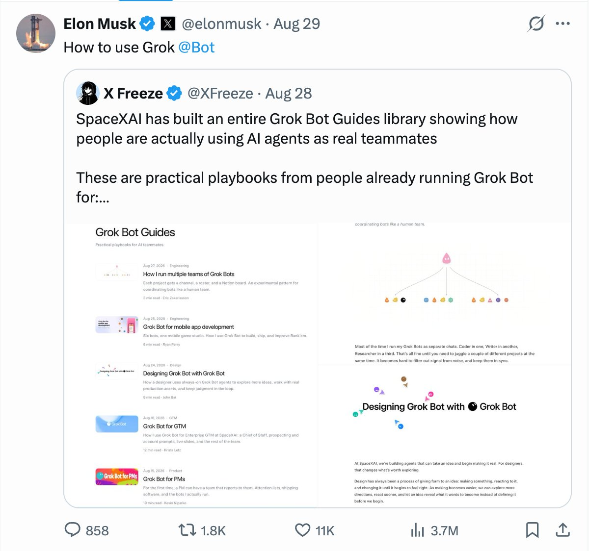

# 📰 X 上最值得关注的 21 个 Grok Bot 探索者

上一篇我写过 [X 上最值得关注的 59 个 AI 领袖](https://x.com/MaiYangAI/status/2092216065094996220)。

那篇覆盖比较广，包括：实验室、产品、生态都有。

刚好今天 Grok Bot Meetup Shenzhen 在线下举办，那我也顺势整理一批值得你关注的 Grok Bot 探索者们。

下面这些都是我这两周自己在看、自己转过、或者现场会用到的。欢迎大家评论区补充。

Zara Zhang（@zarazhangrui）有句话我一直觉得对：

&gt; Follow builders, not influencers.

Grok Bot 这波评测号已经很多了。我更想关注的，是把 Bot 当同事用的那拨人。Bot 有自己的电脑，你合上笔记本，它还在跑。

## 如果你刚刚上手，那一定要先关注这 3 个人

他们都是 SpaceXAI 官方团队的人。

1\. @mattyp matt palmer

他有一条入门视频，从「Bot 是什么」讲到多 Bot 串起来，再到 X 粉丝进 Notion、自己做小软件、跟 Cursor 一起写代码。

28 分钟即可带你入门。不知道 Bot 能干什么，先看这个。

https://x.com/mattyp/status/2092286281266962681

2\. @poteto lauren

Grok Bot 工程师。以前在 Cursor、Meta、Netflix，还做过 React compiler。

她写过怎么省额度：别把定时任务设成 15 分钟一次，一天跑 100 次，token 就没了。一小时一次，或者一天几次，通常就够。

我 3 天用了 32%，就是按这个在跑。

3\. @ericzakariasson eric zakariasson

以前 Cursor，现在 SpaceXAI。他写过一篇 [How I run multiple teams of Grok Bots](https://x.com/ericzakariasson/status/2092982710465970425)。

一个项目一个 Channel，Notion 里挂 Projects / Tasks。Channel 里最多再塞 5 只 Bot。卡住了，Bot 把任务标成 Blocked，再在频道里喊他。

他自己说，这还是实验。我看着像把人用的那套搬给了 Bot。

这三个人看完，可以再看看我自己写的一篇： [Grok Bot 门槛又降了，从入门到进阶](https://x.com/MaiYangAI/status/2090919833366040919)。

入门之后，还想继续深入，那可以再关注以下这些人。

## Grok Bot 官方团队有哪些人

4\. @benln Ben Lang

Cursor Community 负责人，现在也在管 Grok Bot 社区。深圳场有幸邀请他来为我们开场。

8 月 27 日他发过一条，让大家先关注团队：

https://x.com/benln/status/2092995402953884072

下面 7 个人，都是他点的名。

5\. @shaoruu ian · engineer

6\. @baltaaazr Balta · engineer

7\. @lingxi Lingxi Li · engineer / product / design。简介写过 prev agent window @cursor\_ai。

8\. @johnbai John Bai · designer

他写过 Designing Grok Bot with Grok Bot 。用 Bot 设计 Bot。Figma Bro 干重复活，Motion God 做动效，Experiments 专门接「先做出来再看值不值得」的想法。

9\. @pengzheng\_ Peng Zheng · designer。prev Zoom、IDEO。

10\. @SamSokolin Sam Sokolin· engineer

这 7 个号，新功能经常比评测号更早出现。想看产品往哪走，关注他们比关注资讯号有用。

11\. @elonmusk Elon Musk

12\. @mntruell Michael Truell

他们都是 Grok Bot 产品背后的大佬。Elon 管 Grok、Grok Bot、X；Michael 是 Cursor CEO，现在也在 SpaceXAI。我相信大家之前已经关注过了。放在这里，只是以防万一，求一个完整列表。

## 其他探索 Grok Bot 的人

13\. @XFreeze X Freeze

他整理了一整库 Grok Bot Guides：移动开发、产品、设计、企业 GTM、多团队 Agent。

写的是角色、记忆、云电脑、定时任务、Skill，不是又一套聊天流程。例子里有一个六只 Bot 的手游工作室，还有 PM 带着 Chief of Staff、工程经理、五只工程 Bot。

https://x.com/XFreeze/status/2093337680452968873

Elon 转发了这条。26 万粉。

14\. @chddaniel Daniel Ch

他给 Grok Bot 接了 3 个 X 账号。文里写的是 6980 万曝光、32.1 万赞、31.9 万收藏。一条冷邮件截图配了 8 个字：\`best cold email i've seen in my life\`。

https://x.com/chddaniel/status/2091903435243200640

数字是他原文。我没复现过这套，先按他写的记。

15\. @0xCodez Codez

我上一篇 Grok Bot 入门文里就挂过他的 10 步。内容创作者，自己也在用。适合当一份短清单，不适合当唯一说明书。

## 行业大佬都是这么说 Grok Bot 的

16\. @naval Naval

原话就几句：

&gt; Grok Bot is just cool.

&gt; Of course an agent should be persistent.

&gt; Of course it should have its own computer.

&gt; All that remains is for it to be embodied…

https://x.com/naval/status/2090497355649008059

17\. @patrickc Patrick Collison

Stripe。他刚发过一条：

&gt; Grok Bot can now purchase anywhere with @link.

&gt; (If you haven't tried Grok Bot, you should. It's very good.)

https://x.com/patrickc/status/2093425939669774608

能用 Link 付款，产品能力杠杠的。

18\. @yunta\_tsai Yun-Ta Tsai

Tesla AI，Sr. Staff Engineer。他说 Grok Bot 是第一次觉得这真是 everything app。

19\. @gregisenberg GREG ISENBERG

每天丢 startup idea，70 万关注。Grok Bot 出来之后，这类 builder 号转得很快。我把他放进来，是因为很多人会从他那儿第一次碰到 Bot，不是因为他写过一份我核对过的手册。

20\. @petergyang Peter Yang

给忙人写实用 AI 教程和访谈。Behind the Craft。同样，我没核到他一篇专门拆 Grok Bot 的长文，先挂上。你如果有，丢给我。

21\. @mvanhorn Matt Van Horn

June 烤箱（后来卖给 Weber），也参与过后来变成 Lyft 的那家公司。现在又在做东西。

他为什么会出现在这份名单：这批 builder 互相转的时候，他经常在场。具体哪条 Grok Bot 用法是他的，我这篇没核到原文。待补。

## 写在最后

先关注官方这三个人，再看我那篇从入门到进阶。想看产品往哪走，看官方团队。想看别人怎么养一队 Bot，关注以上的大佬，慢慢你都学会了。

如果你还有其他人推荐，欢迎评论区聊聊。

### 🖼️ Attached Media

## 💬 Replies

### 1 @MaiYangAI (Mai Yang) (Author)

*Fri Sep 04 01:54:58 +0000 2026*

很多人问我最近 12 小时高质量推文怎么做的？

我直接开放给大家

[x.ai/bot/lFDR77qKaT…](https://x.ai/bot/lFDR77qKaT3Iglzv9pUac)

### 2 @FlowOpsDaily (FlowOps Daily)

*Sun Aug 30 06:03:08 +0000 2026*

@MaiYangAI Grok Bot如果是长任务测评，重点要看记忆、工具调用和失败恢复是不是在同一轮里都能撑住。

### 3 @miracle_byte (miracle byte)

*Sun Aug 30 05:17:36 +0000 2026*

@MaiYangAI this is insane bro, great share

