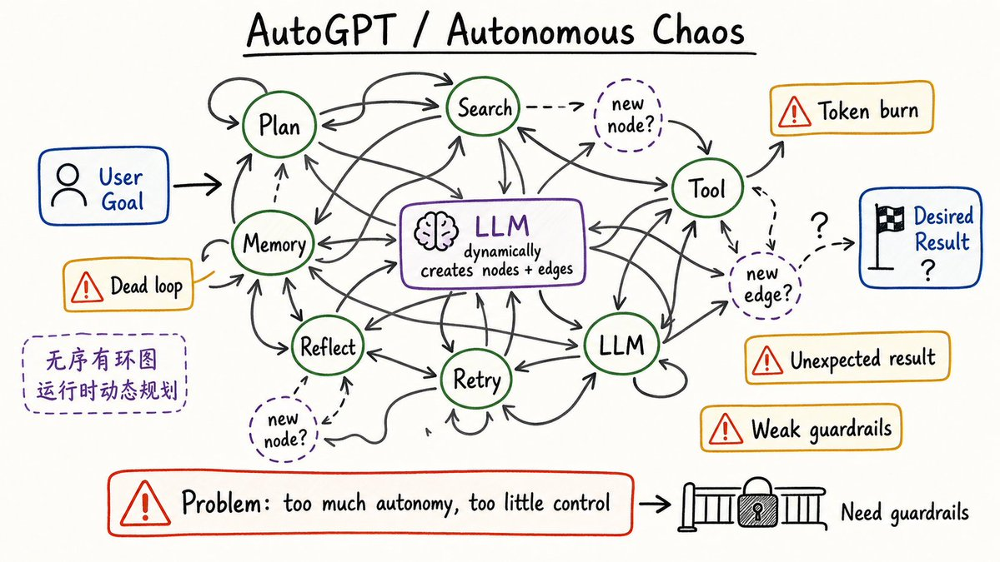
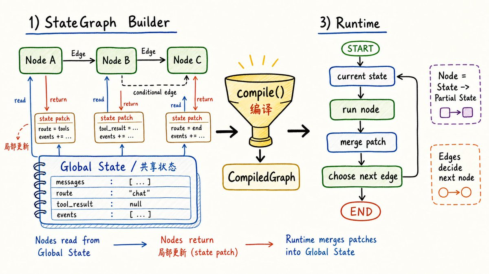
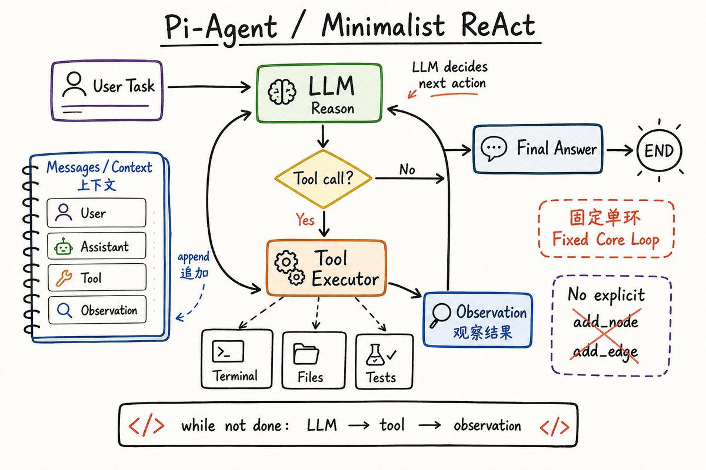
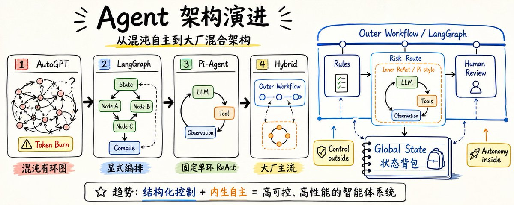

# 📰 Agent 底层状态机编排演进-让你搭建出大厂标准的 Agent 架构

上一篇文章介绍了一下状态机的图表示和二维矩阵表示，反响不错：

[Embedded Tweet: https://x.com/i/status/2073300890505908727]

看来大家对这类文章颇有兴趣，趁热打铁，今天继续深入 agent 底层状态编排系统内部，一探究竟，通过对比 AutoGPT、LangGraph、Pi-Agent 的实现，理解原理，由内而外的吃透，最终能搭建出一个符合大厂标准的 Agent 架构；走向 agent 架构师之路，就在脚下；关注我 @mate\_mattt , 后续持续分享该系列文章。

## 序幕：AutoGPT 与无序的有环图（Autonomous Chaos）

两三年前，AutoGPT 的出现惊艳了整个行业。它的核心是一个全自主编排的架构。

- 基本原理：在底层，它是一个极度自由的 有向有环图（DCG）。人类程序员只定义了起始点和终点，中间的节点（Node）和连线（Edge）完全由大模型（LLM）在运行时动态生成和规划。

- 致命痛点：由于缺乏铁轨的约束，LLM 在复杂的业务场景下极易在图里“鬼打墙”（死循环），一个下午就能烧掉数万 Token，却只能得到一堆意外的垃圾结果。这种“混沌状态机”无法在严谨的企业级生产环境中落地。

为了解决这种不可控性，行业迫切需要一种“把大模型关进代码笼子里”的框架，于是 LangGraph 应运而生。

## LangGraph 的显式图编排

LangGraph 的核心哲学是“人类织网，AI 局部干活”。它将状态机的控制权重新收回到程序员手中。
底层原理：显式多节点有环图，在 LangGraph 中，所有的节点和连线必须在编译期（Compile Time）由人类开发者显式地用代码定义。它引入了三个核心数学模型：

1. State（状态背包）：贯穿整张图的唯一数据源，采用 Reducer 模式，节点只能对其进行追加或合并，不能随意覆盖。

1. Node（节点）：图的顶点，可以是硬编码的传统业务逻辑（如校验权限），也可以是包裹了 LLM 的智能操作。

1. Conditional Edge（条件边）：图的动态路由器。LLM 可以决定去哪条分支，但分支的去向必须是人类提前建好的铁轨。

我们用一段直观的伪代码，看看 LangGraph 是如何用数据结构来收敛流程的：

\`\`\`python
\# 1. 定义贯穿全局的“状态背包”
class GraphState(TypedDict):
    messages: List\[BaseMessage\]
    retry\_count: int  # 防御性控制变量

\# 2. 定义各个独立的节点（高内聚、解耦）
def verify\_node(state):
    # 纯硬编码校验，不耗 Token
    return {"messages": \[SystemMessage("权限通过")\]} if state\["user\_id"\] == "admin" else {"messages": \[SystemMessage("拒绝")\]}

def agent\_node(state):
    # 如果重试次数超限，强行拦截（防御式编程）
    if state\["retry\_count"\] &gt;= 3:
        return {"messages": \[AIMessage("抱歉，系统连续报错，终止流转。")\]}
    # 局部释放 AI 智能：让 LLM 决策
    response = llm\_with\_tools.invoke(state\["messages"\])
    return {"messages": \[response\]}

def action\_node(state):
    # 执行具体的 Tool，并累加重试计数
    try:
        result = call\_nano\_banana\_generator(state)
        return {"messages": \[ToolMessage(result)\]}
    except Exception as e:
        return {"messages": \[ToolMessage(f"Error: {e}")\], "retry\_count": state\["retry\_count"\] + 1}

\# 3. 编排有向图的拓扑拓扑结构
workflow = StateGraph(GraphState)
workflow.add\_node("verify", verify\_node)
workflow.add\_node("agent", agent\_node)
workflow.add\_node("action", action\_node)

\# 设置唯一的入口
workflow.set\_entry\_point("verify")

\# 4. 配置条件路由器（人类硬编码路由字典）
workflow.add\_conditional\_edges(
    "agent",
    router\_function, # 检查最新的消息是想调用 Tool 还是直接回答
    {
        "to\_tool": "action", 
        "to\_end": END
    }
)
\# 局部环路：Action 执行完必须回到 Agent，让 LLM 观察结果并反思
workflow.add\_edge("action", "agent") 

\# 编译成可执行状态机
app = workflow.compile()
\`\`\`

再来一个简化版本的代码，就可以看出使用 langGraph 构建一个图的基本步骤：

\`\`\`python
// 1、 构建全局状态
workflow = StateGraph(TicketState)

// 2、定义节点和边的关系
workflow.add\_node("load\_ticket", load\_ticket)
workflow.add\_node("policy\_check", policy\_check)
// ...
workflow.add\_edge(START, "load\_ticket")
workflow.add\_edge("load\_ticket", "policy\_check")
workflow.add\_conditional\_edges(
  "llm\_reasoning",
  choose\_resolution\_path,
  {
    "auto\_refund": "auto\_refund",
    "human\_review": "human\_review",
  },
)
workflow.add\_edge("finalize", END)

// 3、编译图
workflow.compile()
\`\`\`

langGraph 是全局状态管理，所以每个节点函数的函数签名也比较固定：

输入：当前全局 state 快照
输出：对 state 的局部更新 patch

整体架构图

LangGraph 并没有显式抽象一组图结构类型；它提供的是图构造原语和状态合并机制。顺序、分支、并行、循环、map-reduce、子图这些，开发者可以通过组合 node、edge、conditional edge、reducer、Send、Command 得到的图拓扑。

常用的几种图包括：

\| 图结构拓扑                       \| 底层源码实现机制                                                                \| 核心运作原理                                                               \| 工业级核心适用场景                                                                                                                       \|
\| --------------------------- \| ----------------------------------------------------------------------- \| -------------------------------------------------------------------- \| ------------------------------------------------------------------------------------------------------------------------------- \|
\| 1. 顺序图 (链表式 DAG)            \| 依赖 add\_edge(node\_A, node\_B)，最新源码提供快捷的 add\_sequence 链式 API。              \| 前一个节点执行完毕后，其返回的局部状态（Partial State）自动更新进全局背包，\*\*无条件（100% 确定）\*\*触发下一个节点。 \| 强合规与固定流水线： \* 用户发起请求前的风控前置校验。 \* 业务结束后的异步数据清洗与合规审计日志上报。                                                                           \|
\| 2. 条件分支图 (if/else 动态路由)     \| 依赖 add\_conditional\_edges(source, path\_func, path\_map) 注册路由器。            \| 节点结束时触发人类或 LLM 编写的 path\_func，根据其返回的字符串在 path\_map 字典中\*\*动态寻找下一个铁轨分支\*\*。 \| 规则分流与风控审核流： \* 根据订单金额分流（&lt;100元自动秒退，&gt;100元分流至人工审核）。 \* 客服系统中根据用户意图（投诉、退货、咨询）分流至不同 Agent。                                             \|
\| 3. 并行汇聚图 (Fan-out / Fan-in) \| 边指向多个节点实现 Fan-out（并发）；汇聚时强依赖全局状态里配的 Reducer 函数（如 operator.add）。         \| 多个节点在底层线程池/协程中异步并行执行，结束后强行交汇到同一个节点，利用 Reducer 进行状态增量合并，防止数据脏写。       \| 多路检索（RAG）与群组决策： \* Map-Reduce 模式：写行业报告时，同时并发搜索技术、财务、市场数据，最后由汇聚节点合并大纲。 \* 3 个不同的 LLM 节点并行思考，最后交汇由一个裁判节点投票表决。                       \|
\| 4. 循环图 (有向有环图 DCG)          \| 允许边回指上游节点。源码引入 Checkpointer（检查点） 机制进行状态持久化，防死锁。                         \| 拓扑允许出现“环路”。由大模型观察上一步的执行结果（或报错信息）来调整下一步输出，通过数据驱动直到满足终止条件后跳出循环。        \| LLM 自我反思修正与工具调用： ReAct 模式：LLM 决定 Call Tool -&gt; 拿到结果反馈给 LLM -&gt; LLM 反思再次决定 Call Tool。 AI 程序员：大模型写代码 -&gt; 运行单测报错 -&gt; 丢回给大模型改代码，直到单测通过。 \|
\| 5. 子图组合 (嵌套状态机)             \| 编译后的子图符合标准可调用接口，源码支持 parent\_graph.add\_node("name", compiled\_sub\_graph)。 \| 图里套图（分治法）。子图拥有完全独立的私有状态背包，在内部如何转圈、重试、报错，都不会污染或撑爆父图的全局上下文。            \| 超大型复杂系统与多团队解耦： Multi-Agent 团队协同：大总管图下挂“前端专家子图”和“后端专家子图”，各个子图由不同业务团队维护，实现高度解耦和模块复用。                                              \|

你可以直接把这张表当作选型字典：

- 凡是涉及流程确定、必须留下审计痕迹的，用 顺序图 或 条件分支图 焊死铁轨。

- 凡是涉及高并发、提效、或者需要多角度参考的，用 并行汇聚图。

- 凡是涉及需要大模型自主摸索、试错、自我纠正的，用 循环图，但记得在 State 里加个计数器防止 Token 爆炸。

- 凡是发现业务线拉得太长、图的连线乱得像蜘蛛网时，立刻用 子图组合 进行模块化重构。

## 对比：Pi-Agent 与内生固定单环图（Minimalist ReAct）

当 LangGraph 走向“重度编排”的极端时，以 Pi-Agent 为代表的流派则走向了另一个极致——极简的轻量化计算闭环。  Pi-Agent（以及很多轻量级自动编码 Agent）不推崇让开发者去画复杂的图。它的底层图结构是固定死的一个大循环（也就是经典的 ReAct 模式）。

- 核心单一循环（The Loop）：你看不到像 LangGraph 那样千奇百怪的节点连线。Pi-Agent 核心就一个状态机。

- 数据驱动流转：用户输入一个复杂任务（比如：“帮我重构这个前端组件并修复单测”）。LLM 核心思考后，输出一个特殊的 JSON（表明它想使用工具），例如：{ "action": "read\_file", "path": "Button.tsx" }。
状态机捕捉到这个输出，立刻跳转到环境执行器（Terminal/File System），替大模型去读文件。
读到的文件内容作为 Observation（观察结果） 重新塞回上下文，指针直接指回 LLM 核心。

- 为什么适合编码？ 因为写代码需要极高频的“修改-报错-再修改”的闭环。Pi-Agent 这种紧凑的单环结构，把控制权完全交给了大模型，让它自己在图里转圈，直到它自己发出 { "action": "finish" } 的指令，才会跳出循环。

## 终极横向对比与演进路径

我们可以将这三种截然不同的状态机实现总结成一张对比矩阵：

\|维度 \\ 框架\|AutoGPT\|LangGraph\|Pi-Agent\|
\|---\|---\|---\|---\|
\|🔀 图的结构\|动态、无序的有环图 (DCG)\|显式编排、错综复杂的多节点有环图\|固定的、极简的单环有环图 (ReAct)\|
\|🎮 控制权在谁\|完全交给大模型自主规划\|牢牢掌握在人类程序员手中\|框架固定大框，执行期交给大模型自主循环\|
\|🛡️ 防御性控制\|极差，极易发生 Token 爆炸\|极强，可以通过 State 计数器强行拦截\|较强，通常由运行环境（Sandbox）做硬超时控制\|
\|🏢 最佳商用场景\|仅适合实验与灵感激发\|企业复杂 B端 业务流、多智能体协同\|垂直领域的极速自动化工具（如 AI 编码）\|

## 你该如何选型-实现大厂真实的 Agent 钢筋混凝土架构

- LangGraph ‭-&gt; 就像 Spring WebFlow / 工作流引擎。你需要精细控制每一步路由，适合做重业务逻辑、重合规性的企业级 Agent 编排。

- Pi-Agent ‭-&gt; 就像一个 while(true) 的守护进程（Daemon Loop）。内部是一个极其高效、纯粹的计算/执行闭环，适合做高度自主的垂直领域工具（如 AI 程序员、AI 数据分析师）。

在真实的商业级复杂场景下，绝对没有任何一种单一架构能够包治百病。

如果全盘使用 LangGraph 显式画大图，图会臃肿得像蜘蛛网一样无法维护；如果全盘使用 Pi-Agent 那种纯自主的 ReAct 单环，业务流程又会完全失控。

现代顶尖的 AI 架构，百分之百是 “多流派/多架构混合模式（Hybrid/Multi-Architecture Pattern）”。

经典钢筋混凝土架构：“外层 Workflow + 内层 ReAct”

在现代复杂 Agent 系统的标准设计中，通常采用一种“分层治理”的策略：

- 外层（宏观调度）：采用 LangGraph 的编排流派（严格工作流 DAG）。用确定性的铁轨，把控住公司的核心业务命脉、财务安全、以及合规审批。这一层是完全不容许 LLM 瞎指挥的。

- 内层（微观局部）：在工作流的某一个特定节点上，挂载一个 Pi-Agent 流派或 LangGraph 的 ReAct 子图（自主有环图 DCG）。在这个小沙盒（Sandbox）里，充分释放大模型的自主性，让它去高频地查资料、改代码、调工具、自我纠错，直到得出结果后再回传给外层。

我们拿一个复杂的金融/保险业务来对号入座，看看这种混合架构在现实中长什么样：

\`\`\`
\[ START \] 
   │
   ▼
【节点 1：硬编码规则校验（Workflow 顺序图）】
   │ ➔ 自动拉取用户保单，核对是否在有效期内（100%硬编码，0 Token 浪费）
   ▼
【节点 2：反欺诈风险分流（Workflow 条件分支图）】
   │ ➔ 金额 &lt; 5000 元 ➔ 走快捷通道
   │ ➔ 金额 ≥ 5000 元 ➔ 走深度审计通道
   ▼
【节点 3：深度合规审计官（🔥 核心：ReAct 自主子图模式）】
   │
   │   大模型进入了一个高度自由的自主“局部闭环”：
   │   🔄 Loop 开始：
   │     1. LLM 发现：“医院发票模糊不清”，自主决定调用【图像增强工具】。
   │     2. 增强后，LLM 识别到用药名称，反思：“这个药好像不在医保报销目录里”。
   │     3. 自主调用【医保局最新药品类目 API】进行比对核实。
   │     4. 比对后发现确实违规，自主决定调用【历史判例向量库】寻找拒赔条款。
   │   🔄 Loop 结束（得出最终审计报告，打上标签：建议拒赔，跳出子图）
   ▼
【节点 4：人工终审（Workflow 汇聚图）】
   │ ➔ 将大模型生成的深度报告推送给业务主管，等待人类点“通过”或“驳回”
   ▼
\[ END \]
\`\`\`

为什么必须采用“多架构混合模式”？

1、复杂度的降维打击（解耦）

如果把“深度审计官”里那种千奇百怪、反复调用各种 API 纠错的逻辑，全部平铺画在 LangGraph 的主图里，主图会有上百条线，不仅代码 review 的人要崩溃，而且稍微改动一个工具，整张图的拓扑排序都会崩掉。
改成主图套子图后，主图开发团队只需要关心“输入保单，输出报告”；子图开发团队（甚至大模型本身）只需要在沙盒里玩好 ReAct 即可。

2、极致的成本与防御控制

你可以极其优雅地给不同的子图设置不同的安全边界：

- 比如外层的主工作流：绝对不限制超时，必须等人类审批。

- 内部的 ReAct 智能子图：在子图的全局状态里写死 max\_loops = 5，或者设置单次最高 Token 消费额度。如果这个局部 Agent 5次转圈还没查明发票，子图直接强制 RAISE EXCEPTION 退出，主图捕获异常后走“转人工”的兜底铁轨。局部失控，绝不影响大局。

## 有没有其他架构

除了 LangGraph 和 Pi-Agent，最近比较火的 Hermes 实现了事件总线型（Event-Driven Bus / Harness）架构，在编排界确实是独树一帜、另辟蹊径的。

还有 Meta 最近新出的一款专为实时 AI Agent 打造的反应式框架，这个我还没来得及深入研究。大概看了下，按照 Meta 的技术特点，应该是重度结合了 FRP 响应式范式的思想。

如果感兴趣，可以先关注我，后续会持续更新该系列文章。

### 🖼️ Attached Media

## 💬 Replies

### 1 @mate_mattt (MateMatt) (Author)

*Tue Jul 07 02:12:32 +0000 2026*

最新文章：Hermes Agent 架构详细拆解-一个工业级的 Agent 框架底层运行时揭秘

[x.com/mate\_mattt/sta…](https://x.com/mate_mattt/status/2074313623523271010)

### 2 @leo_xiaolei (XiaoLei Liu)

*Sun Jul 05 13:38:19 +0000 2026*

@mate\_mattt 每天带我学习

### 3 @mate_mattt (MateMatt) (Author)

*Sun Jul 05 13:50:58 +0000 2026*

@leo\_xiaolei 帮忙转发😂

### 4 @dliphotos (dli 🇺🇸)

*Mon Jul 06 00:03:52 +0000 2026*

@mate\_mattt 学习了，我也要试试LangGraph好不好用

### 5 @Ethan_AIz (Ethan)

*Mon Jul 06 07:51:28 +0000 2026*

@mate\_mattt 欢迎大家尝试一下我们的connectonion架构，非常适合初学者，可操作性强[github.com/openonion/conn…](https://github.com/openonion/connectonion) 目前积累1.2k🌟，求大家一个🌟

