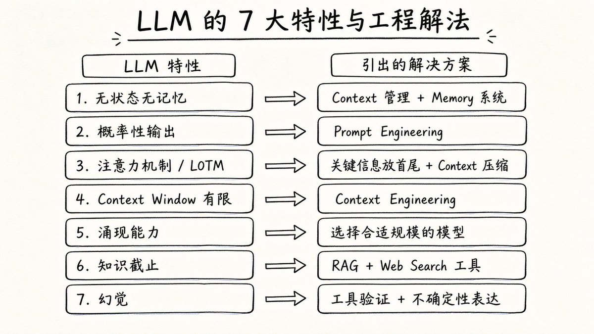
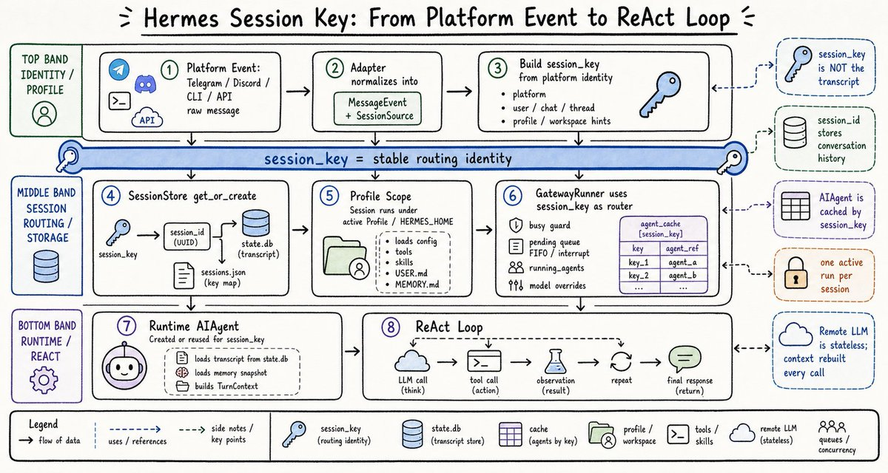
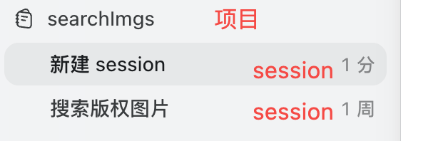
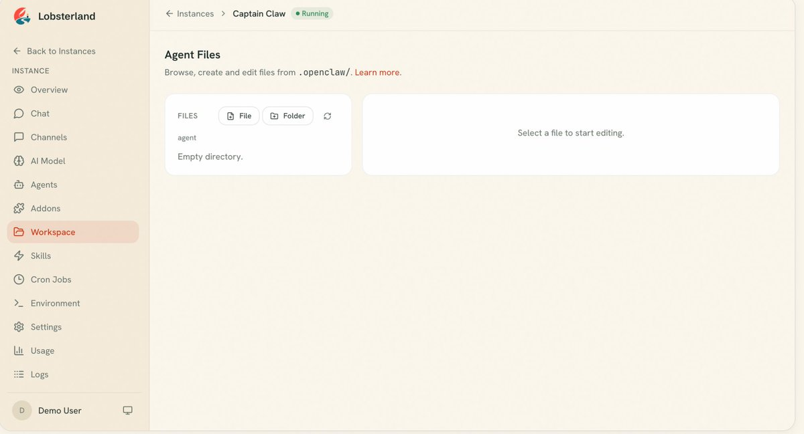
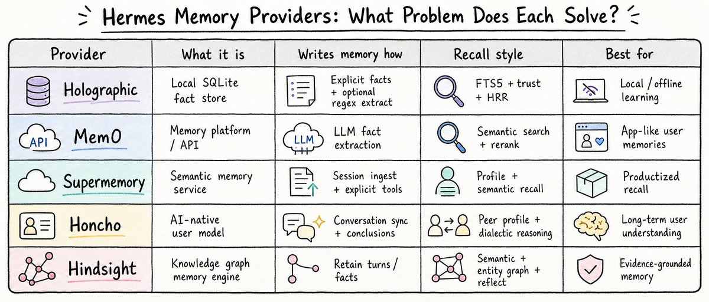
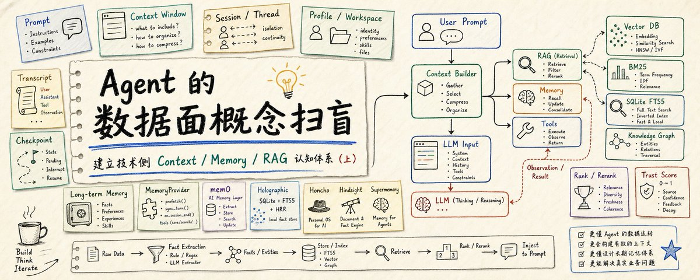

# 📰 Agent 的数据面概念扫盲-建立技术侧(Context Memory RAG) 认知体系(上)

Agent 的控制平面 (Runtime、事件调度、状态机) 和数据平面 (Prompt、Context、RAG、Memory)是相辅相成的。如果控制平面是操作系统的“进程调度与安全外壳”，那么数据平面就是操作系统的“内存管理单元 (MMU) 与虚拟内存寻址”。

> 为了架构讲解清晰，这里的控制面，和数据面，是我个人定义的，并不是领域术语。

之前写过 3 篇文章介绍 Agent Runtime 架构体系：

[Embedded Tweet: https://x.com/i/status/2074313623523271010]

感兴趣，可以进去阅读。从这篇开始，我会陆续写 Agent 数据面相关的文章。

数据面是近几年 Agent 的重点研究方向，特别是 Context Engineering，知识库检索、召回，长期记忆的处理，RAG 技术等等。这部分知识点非常多，我的思路是先建立宏观的知识结构体系，把术语、专有名词、工作路径捋清楚。后续再逐个深入。    

## LLM 大语言模型特点-背景知识补充

由于整个上下文工程的核心是围绕 LLM 提示词来构建的，所以很有必要了解 LLM 的基本特性。LLM 比较重要的 7 大特性，这里我直接放一张图：

篇幅有限，这里就不做 7 大特性细节展开；但是这部分很重要，不能不提，LLM 的 7 大特性就是 Agent  Context 工程第一性原理的起点， 是为什么要做 Context Engineering 的事实基础。

## Context Engineering 上下文工程

Context Engineering 的前身是 Prompt Engineering，Prompt Engineering 研究的是每一轮发给 Agent 的对话如何写更好；当 Agent 从单轮回答变成多轮行动系统时，模型在推理时看到的输入越来越复杂，就变成了 Context；

上下文 (Context) 这个词，在编程领域经常看见，例如各种开发框架下的绘图引擎(canvas)，经常都需要先创建一个绘图上下文，方便后续把笔触、路径、颜色、坐标系，图形、动画路径等等绘图相关的信息注入进去，统一管理起来。

关于 Agent 领域的上下文工程的定义，OpenAI 的 Prompt Caching 文章里有一句很实用的定义

> context engineering 本质上是决定每次请求中哪些内容进入模型输入，并有意识地管理固定 context window 带来的成本、延迟、注意力分散和截断风险。

来自 [OpenAI Cookbook](https://developers.openai.com/cookbook/examples/prompt_caching_201)

Context 包括但不限于用户输入、工具集合、Memory 记忆，本地环境，Profile 模版，历史对话逐字稿 ，文件内容、网页观察，知识库 RAG 等等；

之所以叫工程 (Engineering)，原因是所有这些数据来源，不是无脑塞入到提示词中，需要检索，匹配，召回，重复判断等等工作，是个较为琐碎和复杂的独立工程。

## Session / Thread / Profile / Workspace 概念

如果你长期玩各种 Agent，例如 OpenClaw，LangGraph，Hermes 等会经常看到这些词。不同的实现中大家叫法也不同，导致学习 Agent 开发一头雾水。

这里的 thread 不是编程里的线程。通俗的说，当你使用 codex 这类产品，每次点击新建对话，就是一个 session，或者叫一个 thread (LangGraph 中喜欢这么叫)。创建 session 后，后台通过 session id 来管理，实现工作流串联。

前一篇 [Hermes Runtime 架构文章](https://x.com/mate_mattt/status/2074313623523271010)中，可以看到 session key 串联每一层的工作流，是个关键的 identifier：

不同的 Agent 设计，对 session 的归属也不同，例如 codex 的 session 可以归属于某个项目，也可以是不属于任何项目的顶层 session：

Hermes 的 session 表示某个从外部聊天入口进来，关联一个具体 Profile (可以设定一个身份模版) 的完整路径。

默认情况下 session 之间的历史对话都是隔离的，工具列表、skill 等可以根据 session 隔离，也可以共享，这个要看具体的设计。

例如 OpenClaw 的 Workspace 、Hermes 的 Profile 设计，本质是就是定义一套身份模版，来隔离不同 session 的背景，工具列表，Skill，User.md 偏好等。

创建 Profile 模版后，可以把这些 Profile 挂载关联到某个 session 上。尽管产品层面，OpenClaw 和 Hermes 都把这个叫做不同的智能体。但是作为开发者，你应该知道，底层只不过是用一个文件夹和一些静态 md 文件，定义了一套身份模版，挂载给某个 session，然后每一轮 session 对话都固定注入给 LLM。来实现表现层上他们是不同的智能体。

Codex 没有像 Hermes/OpenClaw 那样显式命名为 Profile 的模板系统，但它通过 workspace、AGENTS.md、session instructions、skills/tool 配置等机制，实现了类似的上下文注入能力。

总结，OpenClaw / Hermes 通过 workspace 显化，让用户可以自定义一些轻量级的身份定义，记忆，工具集，skill 集。codex 则是通过 LLM 对话来隐式实现这些能力。

## session-scoped 记忆和长期记忆 (long-term memory)

一般说 Agent Memory 时，通常会隐含两类：session-scoped memory 和 long-term memory。LangGraph 中常用 thread 表示一次会话或任务上下文，因此也叫 thread-scoped memory。session-scoped memory / thread-scoped memory 通常对应 short-term memory，指当前会话内的历史消息、状态和 checkpoint；long-term memory 则指跨 session / thread 持久保存、可复用的记忆。

session-scoped memory 

通常指的是“当前 session 能继续运行所依赖的短期上下文/工作状态”：

\`\`\`
1\. Transcript
   当前 session 的 user / assistant / tool / observation 历史

2\. Checkpoint / Runtime State
   当前执行到哪一步、pending tool call、interrupt 点、graph state

3\. Compressed Summary
   transcript 太长时，对旧上下文做摘要压缩

4\. Temporary Session Vars
   当前任务状态、cwd、临时选择、当前文件、运行中工具状态

5\. 当前可用工具/身份配置的引用
   注意：工具列表、身份定义本身通常属于 profile/agent config；
   但当前 session 会“引用/加载”它们，成为本 session 的运行上下文。
\`\`\`

这些数据会参与每轮 prompt construction，但不一定全部以原文形式注入给 LLM。

long-term memory 是跨 session 的长期共享记忆

一般来说，长期记忆，才是研究的重点，因为它是跨 session 共享的，会真正影响 Agent 的持续人格、用户理解、项目知识和未来行为

长期记忆重点研究的是以下问题：

> 沉淀什么 ?
什么时候写入 ?
如何结构化 ?
归属到谁 ?
如何检索 ?
如何召回 ?
如何重排 ?
如何注入 ?
如何更新/删除 ?

也是现阶段 agent 能力提升的重点。

## Hermes 中的 long-term memory 设计

1、Profile 模版 （Built-in Curated Memory）

如果你使用过 Hermes 的自定义 Profile 功能 (或者 OpenClaw 的 workspace)，就会看到里边经常包含：

> USER.md
= 用户偏好、沟通风格、工作习惯

MEMORY.md
= Agent 对环境、项目、工具、长期经验的笔记

这些是一些快捷的，可用户输入的记忆模版文件，以 Profile 为视角，可以绑定给不同的 session。这一部分，也经常被称作：Built-in Curated Memory

2、Main Agent Inline Write

主 Agent 在正常 ReAct loop 里发现值得记的内容，直接调用 memory tool 来保存 memory，这里说的主 Agent 是包含了 ReAct loop 实现的实际工作 Agent。

特点：实时、显式、当前任务内完成。

3、Background Review Agent

主回复结束后，Hermes fork 一个后台 review agent，复盘 conversation snapshot，用专用 prompt 判断是否应该保存。通常这个 review agent 是个独立的，有自己的 system prompt，并且不为用户感知的后台 agent。

特点：不阻塞主对话，更适合“事后沉淀”。

4、MemoryProvider Lifecycle / Tools

外部长期记忆 provider，这是 Hermes 长期记忆工具的核心插件，工程实现和 memory 重心都在这个 Provider 插件里。内部使用了：mem0 / supermemory / honcho / hindsight / holographic 等工具。

MemoryProvider 是 Hermes 记忆系统的核心插件模块，用来对接不同形态的长期记忆后端，包括本地事实库、语义检索服务、用户建模系统和知识图谱记忆引擎。它可以承接检索、召回、抽取、重排、写入和上下文注入等能力。其内部概念较多，我会分为上下两篇逐步拆解。

## Agent Memory 工具箱

Memory 是个概念，实现 Memory 通常需要借助各种工具，Agent Memory 领域的常用概念和工具如下：

写入层：fact extraction / summarization / explicit save
存储层：SQLite / Postgres / vector DB / cloud memory service
索引层：FTS5 / embedding / KG / metadata index
检索层：keyword search / semantic search / graph traversal
排序层：rank / rerank / trust / recency / filters
注入层：把召回内容放进 prompt

## RAG (Retrival-Augumented Generation) 增强检索生成

RAG 可以简单分为两个阶段：

1、存储阶段：文档/记忆 -&gt; chunk -&gt; embedding/索引 -&gt; 存储

2、检索阶段：user query -&gt; 检索相关内容 -&gt; 排序/重排 -&gt; 注入 prompt

现代知识库通常都采用混合检索：

向量检索（密文检索 / Dense Retrieval）：管语义理解。用户搜“如何让代码更安全”，它能捞出包含“数据加密”、“权限防范”的文档（即使文档里没有“安全”这个词）。

向量检索的直观理解：

[Embedded Tweet: https://x.com/i/status/2074479762257682917]

BM25 检索（稀疏检索 / Sparse Retrieval）：管精准匹配。用户搜“AES-256”，它能一字不差地把包含这个精准型号的文档全部揪出来。

## BM25（Best Matching 25）算法

BM25 是知识库和搜索领域中最经典、最核心的“文本匹配相关性得分算法”。在做知识库或 RAG 时，如果你只用向量检索，有时会遇到一个尴尬的情况：用户输入了一个非常精确的专有名词（比如一个特定的错误码 ERR\_404\_AUTH），向量数据库因为算的是“语义相似度”，可能会觉得它和“认证失败”差不多，反而把带有精准错误码的文档排到了后面。这时候，就需要 BM25 算法 来撑场子。

BM25 的核心任务是：BM25 计算一个 query 和一篇 document 的相关性。
query 里可以有多个词，每个词贡献一部分分数。得分越高，说明文档和用户想找的内容越相关。为了给出这个得分，BM25 融合了三个聪明的设计（你可以类比为前端在做多重条件权重过滤）：

- 词频（TF - Term Frequency）：用户搜“加密”，文档 A 里出现了 10 次，文档 B 里出现了 1 次，那文档 A 胜出。但 BM25 会做词频饱和，避免关键词堆砌无限加分。

- 逆文档频率（IDF - Inverse Document Frequency）：如果用户搜“的加密逻辑”，其中“的”这个词在所有文档里都存在（俗称停用词），那它的权重就很低；而“加密逻辑”非常罕见，它的权重就极高。

- 文档长度惩罚（Document Length Optimization）：如果文档 C 只有 50 个字，里面出现了 2 次“加密”；文档 D 有 5000 个字，里面也出现了 2 次“加密”。那显然文档 C 的纯度更高，得分应该更高。

## 向量检索和 BM25 匹配协同作战

用户输入一个问题，检索层会同时发出两个检索匹配请求：

1、一个让向量检索引擎去算几何距离，拿到前 10 条（向量结果）。

2、一个让本地 SQLite（利用 FTS5 插件，底层就是 BM25 算法）去查关键词，拿到前 10 条（BM25 结果）。

3、把两份结果合并，再通过 RRF、加权融合或 Rerank 模型重新排序，筛选出最无敌的上下文喂给大模型。

## SQLite FTS5

FTS5 是 SQLite 的全文搜索模块，用来给大量文本做 full-text search，支持 tokenizer、MATCH 查询、支持 tokenizer、MATCH 查询、rank等能力，特点是低成本、离线、可控。

官方定义是：SQLite 的 virtual table module，具体见[官方文档](https://www.sqlite.org/fts5.html)，注意它不是向量库。

BM25 是 FTS5 常用/内置的相关性排名函数之一，用来对命中的结果打分排序。

FTS5 工作流程可以简单分为：

1、写入时建立索引

> 文本 -&gt; tokenizer 分词 -&gt; 建倒排索引

2、搜索分词查询

> query -&gt; tokenizer 分词
  -&gt; 查倒排索引，快速找到候选 rows
  -&gt; 计算 BM25 / rank
  -&gt; 按相关性返回

可以把它想象成实体书后边的索引：

> memory -&gt; 第 3 页、第 8 页、第 20 页
agent  -&gt; 第 8 页、第 15 页

这样，搜索的时候，不用从第一页开始读，而是直接通过索引找到相关页。找到相关页后，BM25 开始工作：

> 这个词在当前文档出现多少次？
这个词在所有文档里稀不稀有？
当前文档是不是太长，导致词频虚高？

总结：FTS5 靠倒排索引避免全表扫描，BM25 基于索引统计信息对命中的文档做相关性评分。

## 总结

Context 上下文工程里概念非常多，知识体系复杂，零碎，所以本篇介绍一些基础概念。下一篇我计划重点分析 Hermes 的 HRR (Holographic Reduced Representations) 等技术来整体串联碎片知识。

关注我，我会持续更新 Agent Memory 相关技术分析文档。

### 🖼️ Attached Media

## 💬 Replies

### 1 @PaidaxingZhou (Paidaxing)

*Fri Jul 10 01:42:33 +0000 2026*

@mate\_mattt 好文

### 2 @mate_mattt (MateMatt) (Author)

*Fri Jul 10 04:53:07 +0000 2026*

@PaidaxingZhou 感谢

