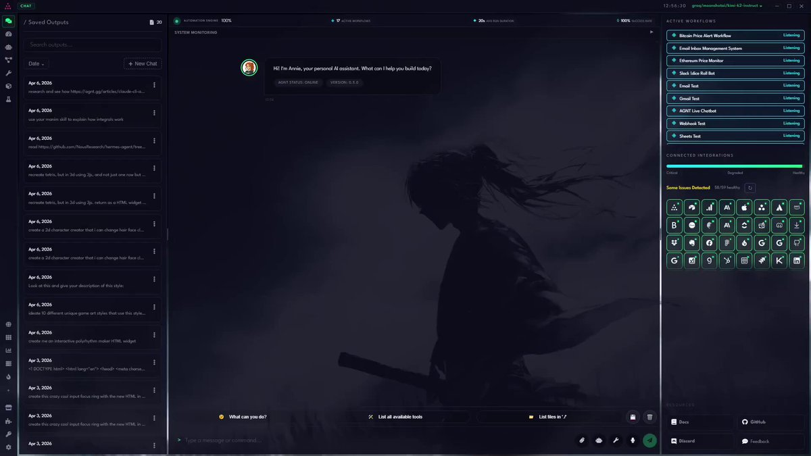
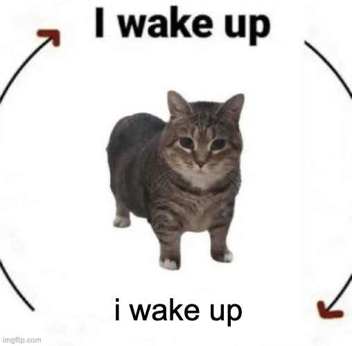

Everyone's banging on about loops

When they should be thinking about queues

## 💬 Replies

### 1 @mattpocockuk (Matt Pocock) (Author)

*Tue Jun 09 13:40:20 +0000 2026*

Your issue tracker is a queue of tasks

Agents pick tasks off that queue, and complete them

They then go into a different queue - human review

The cycle begins anew

### 2 @mattpocockuk (Matt Pocock) (Author)

*Tue Jun 09 13:47:00 +0000 2026*

If the British know anything, it's queuing

### 3 @DavidKPiano (David K 🎹)

*Tue Jun 09 13:46:10 +0000 2026*

@mattpocockuk I'm thinking about state machines

(which would be the "cycle" part of the queue processing)

### 4 @dexhorthy (dex)

*Tue Jun 09 13:46:13 +0000 2026*

@mattpocockuk Yeah but who stacks the queue!

### 5 @mattpocockuk (Matt Pocock) (Author)

*Tue Jun 09 13:46:43 +0000 2026*

@dexhorthy Exactly

### 6 @A1g0rithmIc (A1g0rithmIc)

*Tue Jun 09 14:28:43 +0000 2026*

@mattpocockuk But what’s going to manage the agent managing the loop thats managing the queues!?!?

### 7 @mattpocockuk (Matt Pocock) (Author)

*Tue Jun 09 14:32:18 +0000 2026*

@A1g0rithmIc The user manages the queue

### 8 @jordak6200 (Jordak)

*Wed Jun 10 16:45:18 +0000 2026*

@mattpocockuk I slept on this post, and I still think I disagree with the logic behind it. A queue is a data structure. A loop is a process. Yes the queue is important, but the loop is how you move through the queue. That's true of traditional programming as well as the new AI school.

### 9 @mattpocockuk (Matt Pocock) (Author)

*Wed Jun 10 16:50:56 +0000 2026*

@jordak6200 There is more than one way to pick things off a queue. A loop implies a single node. What about multiple nodes picking things off?

### 10 @unclebobmartin (Uncle Bob Martin)

*Wed Jun 10 11:44:36 +0000 2026*

I have found queuing the handoffs between agents to be very useful. I have the agents manage own and manage their queue. I also have certain agents create high priority, hand offs that go to the top of the receiving queue. 

It is extremely important to severely limit the amount of information that goes into a queued handoff. If you allow the agents to offer too much information, their roles will leak into each other, and they will devolve into a homogenous mass of useless bumbling fools working at cross purposes to each other.

### 11 @NathanWilbanks_ (Nathan Wilbanks)

*Tue Jun 09 13:47:59 +0000 2026*

@mattpocockuk 100%. this is exactly how ive been approaching it too

\- turn a Todo list / GH issues list / PR list into a prioritizing queue or DAG graph of tasks

\- run continuously prioritizingz planning &amp; delegating tasks to agents 

\- seperate eval judge to confirm completion to standard 

### 12 @simeonGriggs (simeonGriggs)

*Tue Jun 09 13:57:14 +0000 2026*

@mattpocockuk 

### 13 @meekaale (Mikael Brockman)

*Tue Jun 09 15:17:05 +0000 2026*

@mattpocockuk if you liked it then you should have put a ring buffer on it

### 14 @joshmanders (Josh)

*Tue Jun 09 16:34:26 +0000 2026*

@mattpocockuk queue deez nuts

### 15 @bendee983 (Ben Dickson)

*Tue Jun 09 16:41:50 +0000 2026*

@mattpocockuk Dude, please! Don't invent a new catchphrase. We're dealing with enough loop insanity as it is.

### 16 @FUCORY (fucory)

*Tue Jun 09 14:28:28 +0000 2026*

@mattpocockuk Reinventing all control flow from first principles

### 17 @sethrosen (Seth Rosen)

*Tue Jun 09 16:58:34 +0000 2026*

@mattpocockuk The demand for this type of content is unparalleled [x.com/sethrosen/stat…](https://x.com/sethrosen/status/2064389719144665219?s=20)

### 18 @pirosb3 (Daniel Pyrathon)

*Tue Jun 09 16:18:35 +0000 2026*

@mattpocockuk What is your thought about agents running on durable workflows like Temporal?

### 19 @odysseus0z (George)

*Tue Jun 09 15:47:17 +0000 2026*

@mattpocockuk the loop creates the queues

### 20 @imRazvanBadea (Razvan Badea)

*Tue Jun 09 18:52:28 +0000 2026*

@mattpocockuk loops are reactive. queues are the infrastructure underneath everything that actually scales.

### 21 @sebuzdugan (Sebastian Buzdugan)

*Wed Jun 10 07:50:07 +0000 2026*

@mattpocockuk watched queue first designs collapse without idempotency keys and dead letter handling

### 22 @david_zhang_sf (David Zhang)

*Tue Jun 09 14:59:22 +0000 2026*

@mattpocockuk Car is a queue engine

[github.com/Git-on-my-leve…](https://github.com/Git-on-my-level/codex-autorunner)

### 23 @StatisticsFTW (Robert Balicki (👀 @IsographLabs))

*Wed Jun 10 00:03:43 +0000 2026*

@mattpocockuk True! [x.com/StatisticsFTW/…](https://x.com/StatisticsFTW/status/2063761132469248440)

### 24 @rishidean (Rishi Dean)

*Tue Jun 09 22:48:44 +0000 2026*

@mattpocockuk What about a queue that feeds the loop?

### 25 @vgrichina (Vlad Berrry)

*Tue Jun 09 19:56:36 +0000 2026*

@mattpocockuk Also we really need to think more about trees if we want agents that work fast

### 26 @fcesco (Francesco)

*Tue Jun 09 15:40:48 +0000 2026*

@mattpocockuk drum, buffer, rope

### 27 @mrmagan_ (Michael Magán)

*Wed Jun 10 02:58:22 +0000 2026*

@mattpocockuk I’ve got a post coming about this…

### 28 @m3mnoch (m3mnoch)

*Tue Jun 09 13:45:05 +0000 2026*

@mattpocockuk that's the thing, tho.

queues end.

recursion ends.

the loop talk is about input-making loops, not output-making loops, and people are talking past each other.

### 29 @Web3Twon (Twon.)

*Tue Jun 09 13:57:06 +0000 2026*

@mattpocockuk Y'all confusing me and my agent 🤣

### 30 @dotmariusz (Mariusz)

*Tue Jun 09 14:42:50 +0000 2026*

@mattpocockuk Vibe coders just discovered recursion, give them a couple of months to discover queues, race conditions and the like

### 31 @nedwize (Nakshatra Saxena)

*Tue Jun 09 13:56:41 +0000 2026*

@mattpocockuk Hey I thought about queues — [x.com/nedwize/status…](https://x.com/nedwize/status/2064299639759909340)

### 32 @not_ebx (ebx)

*Thu Jun 11 01:30:17 +0000 2026*

@mattpocockuk just one more buzzword and we will reach AGI.

