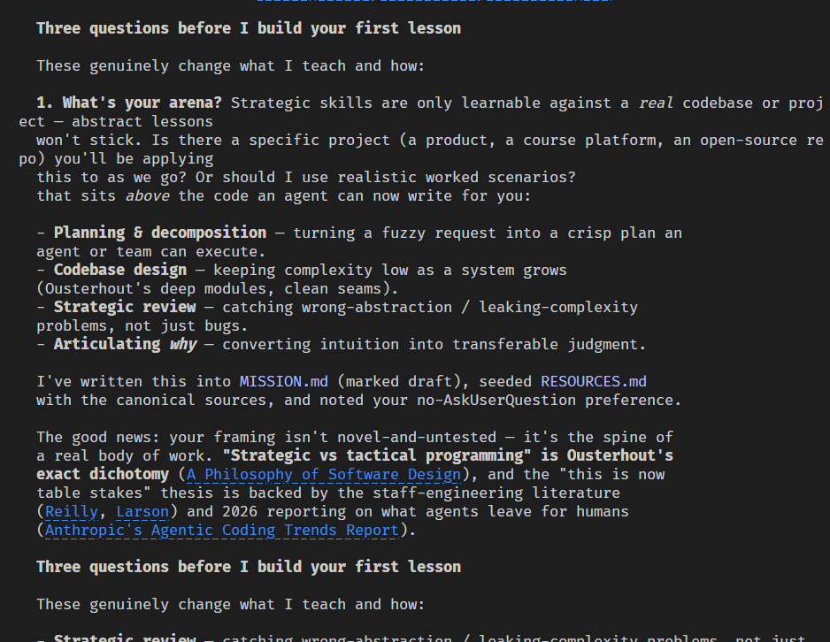

Steps to become a senior programmer:

1\. Install my /teach skill

npx skills add mattpocock/skills --skill teach

2\. Create a new working directory on your laptop

mkdir junior-to-senior
cd junior-to-senior

3\. Kick off your coding agent in the directory

claude

4\. Copy this prompt

/teach me how to be a great strategic programmer. My opinion is that AI is eating 'tactical, on-the-ground' programming. The day-to-day work of a developer involves not only coding, but also planning, QA, codebase design, and much more. I'm interested in learning the strategic skills - that, in a previous era, would take me from junior to senior - but in this era are table stakes.

5\. Paste it into the coding agent

Below is an example of what the first output will look like. I used Opus 4.8, medium effort.

6\. Continue working with the agent until you're a senior

### 🖼️ Attached Media

## 💬 Replies

### 1 @mattpocockuk (Matt Pocock) (Author)

*Wed Jun 10 11:00:14 +0000 2026*

Want to stay up to date with my skills, especially my engineering ones?

The newsletter's the place to go.

[aihero.dev/s/VK1yjl](https://www.aihero.dev/s/VK1yjl)

### 2 @erildox (Erildo)

*Wed Jun 10 11:44:12 +0000 2026*

@mattpocockuk Q: how does AI actually know my knowledge level, gaps and how fill those gaps?

### 3 @mattpocockuk (Matt Pocock) (Author)

*Wed Jun 10 12:07:20 +0000 2026*

@erildox The skill is directed to find your zone of proximal development and keep learning records in the local file system as you develop skills.

### 4 @andersmarksen (Anders Marksen)

*Wed Jun 10 11:51:43 +0000 2026*

i wonder if this is something that can be "quickly" fixed by prompts like this, or if people need to understand that this takes years to build. I was once the developer who wanted to be senior within a year or two. I've seen them before, 200% energy, but 0% patience

it takes time to learn, and you learn by doing, and i'm sure this is a great way to learn for sure, but I don't think we can shortcut time & time in the trenches

### 5 @mattpocockuk (Matt Pocock) (Author)

*Wed Jun 10 12:05:11 +0000 2026*

@andersmarksen The skill defines three things: knowledge, skills and wisdom.

It can teach you the knowledge and skills to be a senior, but wisdom is hardest to come by. A great mentor or community can help.

### 6 @ipsx_jogi (Rhiver)

*Wed Jun 10 15:00:05 +0000 2026*

@mattpocockuk Hi @mattpocockuk  very nice skill. How could I get in touch with you for a speaking enquiry?

### 7 @mattpocockuk (Matt Pocock) (Author)

*Wed Jun 10 15:02:44 +0000 2026*

@ipsx\_jogi DM's is fine!

### 8 @santi590 (Santi Puch Giner)

*Mon Jun 15 20:24:32 +0000 2026*

@mattpocockuk Currently trying your /teach skill to consolidate SWE  concepts that were always fuzzy to me (e.g. PRDs, RFCs, agile methodologies, etc.) and I am thoroughly enjoying it already. A sort of "senior-to-better-senior" of sorts, if you will. So thank you for that, Matt!

### 9 @mattpocockuk (Matt Pocock) (Author)

*Mon Jun 15 20:25:50 +0000 2026*

@santi590 Nice!

### 10 @dinhhuyams (Huy Trinh)

*Wed Jun 10 12:52:23 +0000 2026*

@mattpocockuk Hi, let's say I finish Lesson 1, close the session, and want to continue later. Do I need to invoke the /teach skill every time I come back?

If not, how does Claude know that it's supposed to stay in teaching mode?

### 11 @mattpocockuk (Matt Pocock) (Author)

*Wed Jun 10 12:53:19 +0000 2026*

@dinhhuyams Yes, you do

But it's pretty easy to remember

### 12 @MikelShake (Mikel)

*Thu Jun 11 11:37:52 +0000 2026*

@mattpocockuk What would the prompt look like for someone going from Tech Lead to Staff?

### 13 @mattpocockuk (Matt Pocock) (Author)

*Thu Jun 11 11:38:55 +0000 2026*

@MikelShake /teach I am a tech lead and I want to become a staff engineer. Assess my skills and figure out where my gaps are.

### 14 @itamarsharify (Itamar Sharify)

*Fri Jun 12 14:24:46 +0000 2026*

@mattpocockuk You used to push people to be better, to know more. 
And now this....

### 15 @mattpocockuk (Matt Pocock) (Author)

*Fri Jun 12 14:34:28 +0000 2026*

@itamarsharify What do you think /teach does?

### 16 @AbdMuizAdeyemo (Abdulmuiz Adeyemo)

*Wed Jun 10 11:44:05 +0000 2026*

@mattpocockuk I have to run npx skills add mattpocock/skills --skill teach before I can use that skill right?

### 17 @mattpocockuk (Matt Pocock) (Author)

*Wed Jun 10 12:05:50 +0000 2026*

@AbdMuizAdeyemo The answer is yes, and also make sure you re-read the steps above

### 18 @BenRishty2 (Ben.Rishty)

*Wed Jun 10 11:51:58 +0000 2026*

@mattpocockuk Matt I am very excited to use this skill and have been using and promoting all your skills in my company!

Do you think this /teach skill will be good for teaching me how to build out a new codebase for ELT using Dagster as an orchestrator?

### 19 @mattpocockuk (Matt Pocock) (Author)

*Wed Jun 10 12:05:58 +0000 2026*

@BenRishty2 Yes!

### 20 @biloo0_2 (Bilal Irfan)

*Wed Jun 10 19:33:55 +0000 2026*

@mattpocockuk QUESTION HERE!!!
Should I use /handoff for learning purposes when already using /teach if my learning spans for multiple sessions for longer periods of time?

### 21 @mattpocockuk (Matt Pocock) (Author)

*Wed Jun 10 19:46:11 +0000 2026*

@biloo0\_2 No, since /teach is stateful

### 22 @MiclauMarius (Marius Miclau)

*Wed Jun 10 11:40:21 +0000 2026*

@mattpocockuk you are killing your own teaching course with this skill

### 23 @mattpocockuk (Matt Pocock) (Author)

*Wed Jun 10 12:07:41 +0000 2026*

@MiclauMarius Oh no, my livelihood

### 24 @erikpr1994 (Erik)

*Wed Jun 10 12:19:26 +0000 2026*

@mattpocockuk How you can make this prompt multi session?
Let’s say I want to learn something every day related to this. How should each day prompt be?

### 25 @mattpocockuk (Matt Pocock) (Author)

*Wed Jun 10 12:23:34 +0000 2026*

@erikpr1994 /teach me pick up where we left off

It saves everything it needs on the file system, so you can /clear any time and kick off a new session

