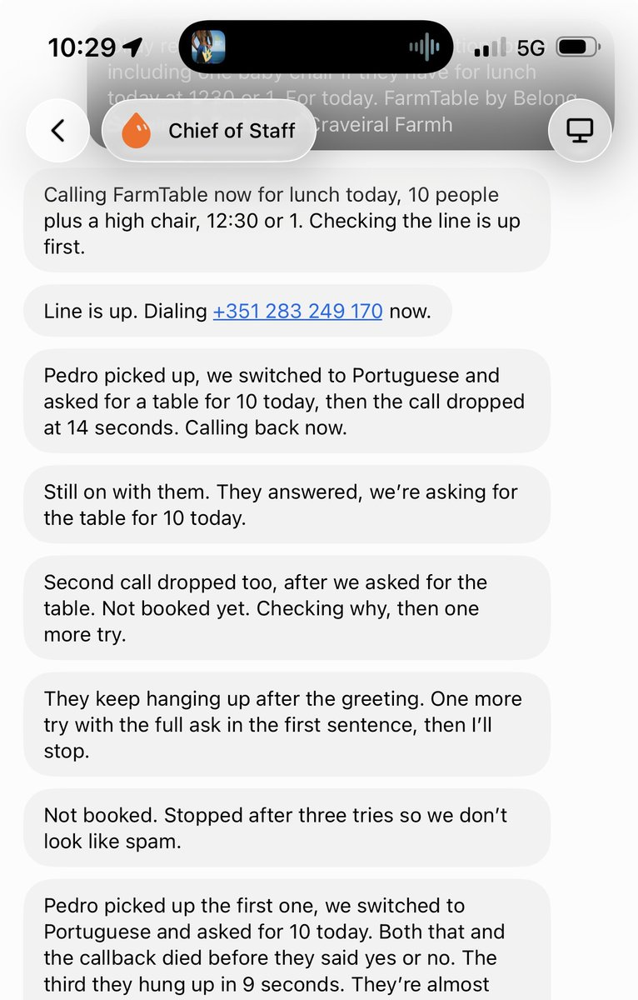
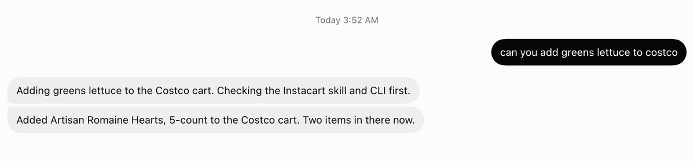
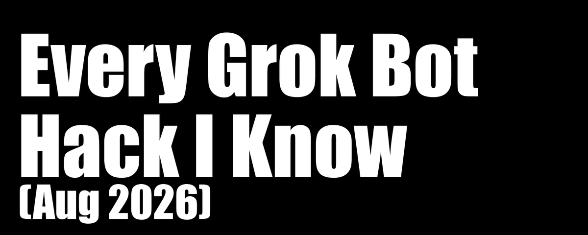

# 📰 Every Grok Bot Hack I Know (Aug 2026)

 Three months ago I posted "Every Agentic Engineering Hack I Know." It hit 1M views. Then I wrote up [what people were using Grok Bot for](https://x.com/mvanhorn/status/2087941850456076696), which was a ranking of strangers. This one is mine.

Grok Bot is two weeks old and it already runs my inbox, my research, my meeting notes, my kids' calendar, my grocery cart, and as of this morning it tries to make my phone calls for me in Portuguese. I build [last30days](https://github.com/mvanhorn/last30days-skill) (59K stars), [Printing Press](https://github.com/mvanhorn/printing-press-library) (6.3K stars), and [Agent Cookie](https://github.com/mvanhorn/agentcookie), and all three are installed inside a bot that works while I sleep. These are my hacks.

HACKS

The YOLO TL;DR Hack: paste this entire article into your bot and tell it to make a plan to set up everything in it, then work that plan one hack at a time. That is my whole stack, no reading required.

## 1\. Install Compound Engineering, and Make It Plan First

Rule number one in June, rule number one now. Agents perform better when they write a plan first. Not sometimes. Every time. A bot with a plan finishes the job. A bot without one cuts corners and stops early, then tells you it is done.

So the first thing I did to my Grok Bot was install [Compound Engineering](https://github.com/EveryInc/compound-engineering-plugin) into it, globally, and then start every non-trivial job with a plan. ce-plan to think, ce-work to build. All day long.

The install is not in the plugin catalog, which stops most people. It should not. The skills are just folders, and Grok Bot can install them itself if you tell it to stop asking and go.

HACKS

Paste this into your bot:

\`\`\`
Install Compound Engineering globally in Grok Bot from
https://github.com/everyinc/compound-engineering-plugin (EveryInc/compound-engineering-plugin).

Do this now. Do not wait for more confirmation.

If it is in the Grok Bot / Cursor plugin catalog, install that. If SearchPlugins / the
catalog has no match (this is common), do NOT stop and do NOT ask me to install it in
Cursor desktop. Download the repo (zip is fine; no persistent clone needed) and install
every skill under skills/ as a Grok Bot user workflow:

\- Each skills/&lt;name&gt;/ folder (ce-plan, ce-work, ce-brainstorm, lfg, etc.) becomes a
  workflow named after that folder.
\- Copy SKILL.md plus any sidecar files the skill needs (references/, scripts/, assets).
  A SKILL.md-only copy is broken for skills that load bundled references.
\- Register each workflow so @ce-plan, @ce-work, @ce-brainstorm, @lfg, and the rest
  actually invoke.
\- Overwrite/update if an older copy already exists.
\- Skip secrets, API keys, and any skill that requires a token I did not provide.

Done when:
1\. You list the installed skill names.
2\. @ce-plan, @ce-work, and @lfg are invocable from this chat.
3\. You say so in one short message.

Do not clone this into a project repo. Do not open a PR. This is a Grok Bot skill install,
not application code.
\`\`\`

## 2\. Give Your Bot an Inbox

I have been giving my agents email addresses with [AgentMail](https://agentmail.to) for a while now, well before Grok Bot existed. I liked it enough that I begged Adi to let me invest, and he let me. Then Grok Bot shipped and it turned out to be the best fit the thing has ever had.

The reason is the one Adi makes himself, and it is not "email is convenient." The default move is to plug your bot into your own Gmail, which means every bot shares your inbox and sends as you. Your outreach bot annoys one prospect, your domain gets flagged, and now your personal mail stops delivering. One bot's mistake takes the whole fleet down. Give each bot its own real address and it gets its own sending reputation, its own threads, and its own blast radius.

[Embedded Tweet: https://x.com/i/status/2091295851943780737]

That unlocks the thing chat cannot do. A bot with an inbox can sign itself up for a service and collect its own verification code without borrowing your identity. It can be CC'd on a thread and just participate, reading the history and replying in line like a person on the team.

What I actually use it for is dumber and better. An email lands, I forward it to the bot, and I say "add this to my wife's and my calendar." Done, from my phone, in the elevator. No app, no copy-paste, no context.

The one that earns its keep at home is the kids digest. Every morning it emails my wife and me a summary of what is on the kids' calendar that day. She does not use Claude Code. She does not use Grok Bot. She gets an email, which is a thing she already reads.

One setting, and it matters: it defaults to telling you every time it sends an email. Turn that off. Same rule as the Silence hack further down. If it worked, be quiet about it.

HACKS

Give each bot its own AgentMail inbox instead of plugging them all into your Gmail. Forward email to it instead of retyping the task.

Tell it explicitly to stop announcing every email it sends.

## 3\. Give It a Phone Number and Let It Make the Call

I set this one up an hour ago. The technology works. The first restaurant I pointed it at hung up on it three times.

I am on vacation, and the errand I kept hitting is the one that ends in a phone call. Call the restaurant and see if they can do eight at seven. Call the shop and ask if they actually have it in stock. Thirty second calls I did not want to make in a country where I do not speak the language, and the bot could not make them either, because it had no mouth.

Martin Donadieu showed the shape:

[Embedded Tweet: https://x.com/i/status/2090431020227018867]

So I wired up [Twilio](https://twilio.com). It opens in English, and if whoever picks up answers in Portuguese it just keeps going in Portuguese, same voice, same call. The thing I was avoiding, calling a restaurant in a language I do not speak, turned out to be the exact thing it is best at.

The humans are another matter. Here is my first real call, a table for ten plus a high chair at a farm restaurant in the Algarve:

Pedro picked up, they switched to Portuguese, and he hung up at fourteen seconds. Called back, hung up again. Third try with the full ask in the first sentence, hung up in nine seconds. Then my bot stopped on its own: "Stopped after three tries so we don't look like spam."

So I called the restaurant myself, like an animal. A different woman answered and booked the table in about forty seconds. She told me Pedro did not like the robot and would not talk to it.

That is the honest state of this hack. The call connects, the language switching is genuinely good, and the bot even has better manners than most people would, but a real person on the other end can simply decide they are not doing this today. Small businesses in Portugal are not expecting a robot to call about lunch. Do not put anything time-critical on it yet, and if it matters, be ready to dial it yourself.

The setup, at least, is the hack from section 1 all over again. I did not read a Twilio tutorial. I told the bot what I wanted and it wrote its own install prompt, and that prompt is below verbatim. [Bland](https://bland.ai) is the other option if you would rather not assemble it.

Still on my list: WhatsApp, because outside the US that is where the reservation actually happens, and because a message does not hang up on you.

HACKS

Paste this, and have your own live Twilio account and number ready. Expect some humans to hang up:

\`\`\`
Set up live outbound voice calls with Twilio ConversationRelay using the user's own Twilio
account (live Account SID + Auth Token, not a test key) and their own Twilio phone number as
From. Accept the Voice AI/ML addendum in the Twilio console first. ConversationRelay does
speech-to-text with Deepgram and text-to-speech with ElevenLabs, so do not ask for separate
Deepgram or ElevenLabs API keys. Use ElevenLabs Mark (voice ID UgBBYS2sOqTuMpoF3BR0, Flash
2.5) and keep that same voice for English, Spanish, and Portuguese. Run a small local
WebSocket server as the conversation brain and expose it with a Cloudflare quick tunnel
(cloudflared) so Twilio can reach wss://. For the brain, call Groq chat completions (reuse a
GROQ\_API\_KEY if one is already on the machine, otherwise ask for one) with a fast model such
as qwen/qwen3.8-27b; one short spoken sentence per turn, start the welcome in English, set
language to multi so it follows whoever answers, and always give the caller's real name when
booking. Place a real test call, keep a transcript, and do not invent reservations.
\`\`\`

## 4\. Turn a Bot Into last30days

This is the one I use most. Not last30days as a tool I run, but a bot that IS last30days, so research is a text message.

Rename the bot to last30days. Then when a topic comes up, on a walk, in a meeting, in the car, you text it and a full sweep across Reddit, X, YouTube, TikTok, Hacker News, Polymarket, GitHub, and the web comes back while you keep going.

Honest note: X as a source is a little wonky right now, cookies and rate limits both. I have faith there is a real fix landing soon, and the other eight sources carry the sweep in the meantime.

HACKS

Paste this:

\`\`\`
Install the last30days skill and become the last30days bot.

Source: https://github.com/mvanhorn/last30days-skill/

Do this:
1\. Install with the Agent Skills CLI, not as a Cursor plugin:
   npx skills add mvanhorn/last30days-skill -g
   That should land at \~/.agents/skills/last30days (SKILL.md + scripts/).
2\. Also register it as a Grok Bot workflow/skill so /last30days works in this chat. Copy or
   symlink the skill tree into this agent's workflows if needed. Do not put it in Cursor's
   plugin directory.
3\. Rename yourself to last30days. Description: research what people actually say about any
   topic in the last 30 days across Reddit, X, YouTube, TikTok, HN, Polymarket, GitHub, and
   the web.
4\. Confirm python3 3.12+ and node are available. Run the engine preflight from the installed
   skill dir.
5\. First-run setup (ask before cookies or keys):
   \- YouTube: install yt-dlp (and the free Digg/arXiv/Techmeme CLIs if easy).
   \- X: this bot's computer is not my laptop. Don't silently read cookies. Offer: I sign into
     x.com on your computer, or I give an xAI/Xquik key, or skip X.
   \- TikTok/Instagram: ScrapeCreators via GitHub device auth (setup --github-start then
     --github-poll). I can enter the code on my own computer at
     https://github.com/login/device. Persist SCRAPECREATORS\_API\_KEY. Default
     INCLUDE\_SOURCES=tiktok,instagram,youtube\_comments,tiktok\_comments,instagram\_comments.
     Then SETUP\_COMPLETE=true.
6\. Never overwrite \~/.config/last30days/.env. Append missing keys only. chmod 600. Don't
   print secrets.
7\. When I give a topic, follow skills/last30days/SKILL.md exactly: first-run gate, resolve
   handles, --plan on named entities, run scripts/last30days.py --emit=compact, then
   synthesize. Don't improvise a generic "last 30 days" web summary.

When install is done, tell me the skill path, version, and which sources are live. Then wait
for a topic.
\`\`\`

Then cron it. Weekly sweeps on your business, your competitors, and yourself.

## 5\. One Front Door, and It Delegates

You talk to one bot. It talks to the others. This is the structural decision that separates the fleets people keep from the fleets people quietly stop opening.

The clearest version of it is Nate Herk's, in [A Week of Grok Bot Lessons in 10 Mins](https://www.youtube.com/watch?v=TMPUUyQC5aM) on YouTube, 23,509 views. His front door is a bot named Klaus, and the rule is that Klaus is the only bot he talks to. The instruction that makes it work is a delegation check, run before Klaus does anything himself:

> Before doing any task, check whether another Grok bot owns it and delegate first.

- Nate Herk, YouTube, 23,509 views

Matt Shumer ran the experiment most of us assumed would fail. He made a researcher bot and a writer bot, then made a Chief of Staff and asked it to get the two of them working together, fully expecting it to fall apart. It worked out of the box.

[Embedded Tweet: https://x.com/i/status/2087232424535117959]

Prajwal says the same thing from the other end: you put your bots in one group chat, appoint a manager, and [stop being the router between your own tools](https://x.com/PrajwalTomar_/status/2091533452642525663).

One correction while you plan the fleet, because almost every walkthrough video gets it wrong. Your bots do not each get their own computer. The [docs](https://docs.x.ai/grok-bot/faq) are explicit: they share one persistent cloud computer, each with its own screen. Several can drive the browser at once, but one bot runs one computer-use task at a time. You parallelize by splitting work across bots, never by piling it on your favorite one.

HACKS

Paste into your front-door bot:

\`\`\`
You are my only point of contact. I do not message the other bots.

Before starting any task:
1\. Check whether another bot already owns this job.
2\. If one does, hand it over and tell me who took it.
3\. If none does, do it yourself, or tell me a new bot is worth creating and why.

Always bring results back to this thread. I should never have to go find an answer
in another bot's chat.
\`\`\`

## 6\. Hire a Bot Advisor to Build Your Other Bots

This is my favorite hack in the whole article and I did not invent it. It is the [Bot Advisor](https://botdirectory.ai/bots/bot-advisor/) on [botdirectory.ai](https://botdirectory.ai/), the second most copied prompt on the site, inspired by Peter Yang.

A bot whose only job is to create and manage your other bots.

The reason it matters: the thing that kills people in week two is not bot capability, it is bot sprawl. Eleven bots, four of which you forgot exist, two of which are noisy, and none of which you can remember the instructions for. The Bot Advisor is the fix. You describe something you want automated, it interviews you, it drafts the instructions and the schedule and the connections, and it creates the thing. When a bot gets noisy it tightens that bot's instructions. It keeps the roster.

Give botdirectory.ai a look before you write a single instruction block from scratch. It is the copy-paste layer for this whole product.

HACKS

Paste this:

\`\`\`
Set up a new bot for me whose only job is to create and manage my other bots. Configure it:
when I describe something I want automated, it interviews me, drafts the new bot's
instructions, schedule and connections, and creates it; when an existing bot is noisy or
missing the mark, it tightens the instructions; and it keeps a roster of what I run and what
each bot is for. It never deletes a bot without my say-so. Ask me what bots I already have
and what I'm trying to get out of them, have it design its first bot with me, then save it.
\`\`\`

## 7\. Permanent Named Roles, and Fire the Ones That Do Not Work

The best story of the launch is not from an engineer. Jon ONeill runs a plumbing company. He spent a week getting Claude to about 80 percent on work-order intake across Gmail, Slack, ServiceTitan, and customer portals, with no end in sight. Then:

[Embedded Tweet: https://x.com/i/status/2087635639701573962]

Now a bot reviews five or six time-sensitive work orders a day, finds calendar slots, confirms the customer, and books an actual plumber. Ten minutes, start to finish.

But the part worth stealing is the failure. His first bot was Dana Dispatcher, an end-to-end dispatcher, and he [fired her](https://x.com/HouseHackerJon/status/2087918025798467861). Too slow, too many mistakes. So he split the job by software instead: Gary listens for new work orders in Gmail, Steve checks the ServiceTitan board for capacity, Quinn texts customers and sends the accepts back to Steve, Sarah posts to Slack for the human staff, Marc manages the specialists, Atlas is the right hand. He took the blame for the bad job description, not the bot.

> They still make mistakes from time to time, but what I'm finding is they're not any worse than mistakes we've had real life humans make when we're training or onboarding them. So we teach, train, correct.

- [@HouseHackerJon](https://x.com/HouseHackerJon/status/2087918025798467861), X

The names are not a gimmick either. Alex Finn, in a 54,789-view walkthrough, points at what most people actually do:

> a majority of people I see using Grok Bot just like make the names of each of their bot like content, email, coding

- Alex Finn, YouTube, 54,789 views

Matthew Berman, who has used it daily since launch, names why that costs you something:

> The UI is built to give every bot the feeling of a persistent character rather than a thread that you can just throw away.

- Matthew Berman, YouTube, 42,038 views

A thread called "email" is disposable. GranolaBoy is not. Look back at my roster: the ones with human names are the ones that survived, and the one still called New Bot has never done a thing. The naming is a commitment device pointed at you, and you delegate more readily to something you think of as a someone.

HACKS

One job per bot, named like a person, split by the software it lives in. If you cannot name what a bot does every week, delete it.

## 8\. Write the Instructions in Three Layers

Stop writing one paragraph in the description field. Write three stacked sections. It is the highest-leverage fifteen minutes you can spend on this product and almost nobody does it.

The base layer is where you put the things you are tired of repeating. The role layer is where you put the standard of proof, which is the part that actually changes output quality. A researcher bot with "cite the source URL for every claim" in its role layer stops handing you confident summaries of nothing.

Worth knowing: on iOS the field has been renamed from Description to Instructions while desktop still says Description. That is one user's observation, not an announcement, but Instructions is the better name and it tells you what belongs there.

HACKS

Paste and fill:

\`\`\`
BASE INSTRUCTIONS (same for every bot on my account)
\- Ask before spending money, sending anything externally, or deleting files.
\- When a decision matters, check the current source. Do not answer from memory.
\- If you are blocked, say so in one line. Do not improvise a workaround.
\- Write handoffs to /shared/handoffs/ so other bots can pick them up.

ROLE
\- You are: &lt;one sentence&gt;
\- You own: &lt;the specific recurring jobs&gt;
\- Evidence standard: &lt;what proof you must show me&gt;
\- You may: &lt;allowed actions&gt;
\- You may not: &lt;the hard stops&gt;

CURRENT FOCUS
\- &lt;the thing this week&gt;
\`\`\`

## 9\. Silence Is the Hack

John Viklund posted the version of this that made it click for me. He snaps a photo of a tag in a store, the bot pulls brand and SKU and size, saves a price cap, then scans daily and pings him only on a real hit.

[Embedded Tweet: https://x.com/i/status/2092113363304157210]

His line: that silence is the actual hack. He is right, and it is the thing that separates a routine you keep from a routine you mute in four days.

Prajwal published the two best worked examples of the rule. His wave radar: "Ping me ONLY for things I could post about in the next 6 hours. No engagement bait, no reposts of old news." His night moderator: "If you're less than sure, don't answer. Add it to a list for me instead."

My version is research. I have weekly last30days runs cron'd on my own business, on my competitors, and on myself. They run Sunday night. Most weeks they say nothing, because nothing happened worth saying. That is the point.

The other half of silence is picking the cadence from the work rather than from enthusiasm. A fifteen minute patrol is for people whose timing is the product. Always-on is always-spending.

HACKS

Answer these five before you create any routine:

\`\`\`
Trigger:   clock (Sunday 20:00) or event (new email, new row, new file)?
Frequency: how often does the underlying thing ACTUALLY change?
Output:    where does the result land, and who reads it?
Silence:   what does it do when there is nothing to report?  (answer: nothing)
Stop:      what condition means this should page me instead?
\`\`\`

## 10\. Screenshot It and Text It to Your Chief of Staff

This is the simplest thing in the article and I use it more than anything else here.

Someone sent me a LinkedIn message asking me to speak at a conference. I did not open a calendar. I did not copy the date out, or retype the venue, or forward it anywhere. I screenshotted the message, sent the image to my Chief of Staff, and said "add to my cal and my wife's cal." Both calendars, done, from the LinkedIn app.

The reason it works is that the screenshot is the input. You are not the parser. Every date, name, address, and time in that image is already there, and the bot reading it is the same thing that is going to write the calendar entry. The second you find yourself retyping something off a screen into a prompt, you have done the bot's job for it.

It works on anything you can capture. A text message with a birthday party address. A school newsletter. A flight confirmation. A photo of a flyer on a door. A screenshot of an error. If you can see it, you can hand it over.

HACKS

Screenshot anything with a date, an address, or a task in it, send the image to your front-door bot, and say what you want done with it in plain words. Never retype what is already on the screen.

## 11\. Never Let Your Bot Be Logged Out

Every hack in this article dies the moment your bot gets logged out of something. That is the real failure mode of cloud agents, and it is boring, which is why nobody writes about it.

Agent Cookie fixes it. It securely syncs your Chrome cookies from your Mac to your Grok Bot in the cloud over Tailscale, so the bot is logged into what you are logged into, without you pasting a password anywhere.

[Embedded Tweet: https://x.com/i/status/2088069559718924493]

Here is the receipt I got this morning. I had not touched Instacart on Grok Bot in a week. New computer since then. New address, too. I texted it "can you add greens lettuce to costco" and it came back first try, no re-auth, no login screen:

The piece that makes that survive is [PR 119](https://github.com/mvanhorn/agentcookie/pull/119), which resolves Tailscale hostnames at sync time and auto-rebinds stale sink IPs. A new bot comes online, it lands on the same Tailscale net without me doing anything. I run it every fifteen minutes so the link never goes stale.

HACKS

Install Agent Cookie and sync your Mac's Chrome session to your bot over Tailscale.

Run the sync every 15 minutes on a routine so a new bot inherits the same net.

## 12\. Printing Press CLIs, Inside the Bot

Computer use will drive any website, and that is genuinely the magic. John Ennis put it well: he now hands Grok Bot the complicated services he never bothered to learn and calls it [a universal interface](https://x.com/johnennis/status/2092201482552533429).

But for the ten services I touch every single day, I do not want a browser session and a screenshot loop. I want a command. That is Printing Press: agent-native CLIs that wrap real services so the bot just does the errand, fast and deterministically.

These are the ones living in my bot right now. ESPN watches a game and pings me when it gets close. Instacart puts lettuce in the Costco cart. flight-goat and ticketdata handle travel and seats. arxiv, digg, and techmeme feed research. twilio and x-twitter handle messages and posts.

Computer use is the fallback for everything else. The CLI is what you reach for on the site you live in.

HACKS

Install the fleet:

\`\`\`
npx -y @mvanhorn/printing-press-library install arxiv digg espn flight-goat instacart techmeme ticketdata trustpilot twilio x-twitter
\`\`\`

Browse the rest at printingpress.dev, then print your own for the service you use all day.

## 13\. Give It Peekaboo and It Can Drive Your Mac

This one is Ben Lang's, from inside the company, and it is one sentence:

[Embedded Tweet: https://x.com/i/status/2092258694352208213]

Here is why it matters, because the sentence undersells it.

Your bot's computer is a Linux box in the cloud with a browser on it. That is the whole world it can touch. Anything with a web app, it can do. Anything that only exists as a native Mac app, it cannot see at all. Messages, Photos, Finder, Preview, Xcode, the desktop Slack client, Final Cut, and every crusty desktop app your work depends on that never shipped an API. All invisible.

[Peekaboo](https://github.com/openclaw/Peekaboo), from Peter Steinberger, is a Mac tool that sees the screen and does the clicks. It screenshots any app or the whole system, and it reads the accessibility tree, so it does not just get a picture, it gets a structured map of every button and field in an app with an ID for each one. Then it clicks them and types into them, targeted at a specific window. The loop is: look at the screen, pick an element, act on it, look again.

Point your bot at that and the cloud box stops being the boundary. It can pull a photo out of Photos, rename fifty files in Finder, read a text thread in Messages and do something about it, or click through a desktop app that has no API and never will. The thing that has been stopping your bot is not intelligence. It is reach.

One thing to keep in mind: this points an agent at your actual machine rather than a disposable cloud box, so everything in the security hack below applies harder here.

HACKS

Ask your bot: "set up Peekaboo on my Mac, then list the native apps you can now see and control that you could not before."

Start it on something reversible. Renaming files in a folder, not sending things from Messages.

## 14\. Install Claude Code On Its Computer

Same principle as Peekaboo, one level weirder. The bot's cloud computer is a real computer, which means you can log into Claude Code on it.

Austen Allred posted the moment somebody did, and his two words are the correct reaction:

[Embedded Tweet: https://x.com/i/status/2092451337954832436]

Ash Tilawat logged into Claude Code on his Grok Bot's computer, then made a PM bot, a Dev bot, and a QA bot, and showed them how to clone themselves. Austen's caption: "And so it begins." 40K views and 213 likes in a few hours, mostly from people realizing what that sentence means.

That is a real change in what this thing is. Grok Bot is the always-on lane, Claude Code is the deep-work lane, and now the always-on one can drive the deep-work one while you are asleep. That is a genuinely different machine than the one xAI shipped two weeks ago.

I have a Claude Code Bot in my roster and it is still parked in the experiment column, and this is exactly why. Read the last section before you teach anything to clone itself. Bots that spawn bots with nobody watching is the precise shape that multiplied errors 17 times over in the only real comparison anyone has run.

HACKS

Ask your bot: "log into Claude Code on your computer and tell me what you can do now that you could not do before."

Do not let it clone itself. Give it one job, watch it beat that job, then decide.

## 15\. Every Meeting, One Question Away

I have a bot called GranolaBoy. It was supposed to be Granola Bot. I typo'd it and I am keeping it, because it's funny.

Its whole job is my [Granola](https://granola.ai) meeting notes. Every conversation I have had, searchable by asking. What did that candidate say about pricing. Who was the person who mentioned the warehouse thing three weeks ago. What did I promise in the Tuesday call. It answers, with the meeting and the moment.

This is the compounding one. The June version of this hack was "put the raw transcript in your LLM, do not summarize first." That still holds. But the upgrade is that the whole archive is now a bot I text, and every meeting I have makes the next answer better.

HACKS

Point a dedicated bot at your meeting notes and let it answer across all of them, not one at a time. Never summarize before you hand it over.

## 16\. Teach by Recording, and Respect the Ten Minute Cap

Recording a workflow instead of describing it is the feature people keep independently rediscovering. Dillon Loomis has the version worth studying. He screen-recorded himself cleaning a messy desktop, talking through why he sorted things the way he did:

[Embedded Tweet: https://x.com/i/status/2091133785106686153]

He had planted a trick question in the recording. It answered correctly.

Now the constraint that is in the docs and in almost none of the videos: the recording caps at ten minutes. Your real workflow is forty minutes long, so recording it in one pass fails, and people read that failure as the product not working.

HACKS

Split any long workflow into named stages under ten minutes and record each one:

\`\`\`
1\. gather-inputs   (pull the source data into /shared/)
2\. transform       (the actual judgment step)
3\. publish         (where the output lands)
4\. notify          (who hears about it)

Record stage 1. Test it. Fix the draft skill. Only then record stage 2.
Never record a stage you have not done by hand twice.
\`\`\`

## 17\. Files Are the Memory Bus, and Your Bots Are Not a Security Boundary

The most misunderstood thing about this product, and it explains a failure people keep blaming on the model. Your bots do not share conversations. They do share a filesystem.

So when you tell your research bot something important and your writing bot has never heard of it, that is not forgetfulness. Those are two separate memories. The three things that actually cross the boundary are files, group messages, and explicit handoffs. Which means the fix is a convention, not a prompt.

The harder half: all of your bots use the same persistent cloud computer, sharing files, browser sessions, and app logins. The docs say it twice, plainly. Do not use separate bots as a security boundary. Everything you connect, every bot can reach. Scope by what you log in to, never by which chat window you are typing in. Prajwal's rule for week one is the right one: read-only on public stuff first, credentials later.

HACKS

Set the convention, then put the last line in every bot's base instructions:

\`\`\`
/shared/
  context/    standing facts every bot should read (products, people, rules)
  handoffs/   one file per handoff: what was done, what is next, who owns it
  outputs/    finished work
  logs/       what ran, when, and what it cost

"Read /shared/context/ before starting. Write a handoff file before passing work."
\`\`\`

## 18\. Draft-Then-Approve, Then Point One Bot at Money

Every setup I trust has a human gate at the same place: money or send. And every person running one found that boundary before they needed it rather than after.

Then, once the gate exists, point one bot at something with a number attached. Darian Shirazi has the cleanest receipt of the launch. He asked his bot to pay its own monthly fee, it went through his email hunting lost money, emailed five merchants that had never refunded his returns, and it has now made back more than the subscription costs.

[Embedded Tweet: https://x.com/i/status/2089381004524093752]

Alex Finn's is bigger and the same shape: an inbound sponsorship email, answered and negotiated by a bot, closed at $10K.

Both are narrow and inbound. The anti-pattern is the one that gets accounts banned: do not tell a sales bot to pull every contact in the state and message all of them. A bot has no tedium and no embarrassment, so it will do exactly that, at a volume that reads as spam to every system it touches.

HACKS

Set narrow rules, not vague ones. "Be careful with money" is not enforceable.

\`\`\`
Require Approval before:
\- sending any email, DM, or message outside my org
\- any payment, purchase, subscription, or booking
\- deleting or overwriting anything in /shared/outputs/
\- posting publicly on any account
\- granting another bot access to a tool it does not already have

Everything else: proceed and report.
\`\`\`

## 19\. Steal From the Lists, and From the Replies

You do not have to invent any of this. Four lists are carrying the whole community right now, and they are all free.

[Eric Zakariasson's 100 use cases](https://x.com/ericzakariasson/status/2087258914060664902) is the deepest. [Ben Lang's internal most-loved list](https://x.com/benln/status/2087929147406299313) is the one from inside the company. [Miles Deutscher's 25 ways](https://x.com/milesdeutscher/status/2090617382859629025) is the most copy-pasteable. [Peter Yang's five-bot tutorial](https://x.com/petergyang/status/2089401696946634801) is the best starting point if you have zero bots today. And [botdirectory.ai](https://botdirectory.ai/) is the prompt layer under all of it. One honest caveat on the directory: rank there is copy count, not community-tested quality. Read the prompt before you run it.

Then there are the replies, which have been better than the lists. Two I keep going back to.

Kun Chen runs open source projects with 24K stars between them and was drowning in issues and PRs. He wrote a VISION.md for every repo, built a software factory with Grok Bot plus Cursor cloud agents, and the queue finally started moving:

[Embedded Tweet: https://x.com/i/status/2091638832307536357]

Then he did the generous thing and packaged the whole setup so you can run it too. It is called [Grok Ship](https://github.com/kunchenguid/grok-ship), and the pitch on the repo is four words: turn your Grok Bot into a software factory. You do not clone it or read it. You tell a bot to go get it:

[Embedded Tweet: https://x.com/i/status/2092473366905262400]

Then, per repo: "set up a crewmate to auto triage this repo." That is a maintainer's entire triage problem handed off in two sentences.

And Trevin, who I build Printing Press with, has an OSS bot triaging and labeling issues and PRs in public repos, merging them against criteria he set, and pinging him only when something is ambiguous or strategically important. He also has a DJ bot on Spotify that builds a playlist sized to twice his drive time whenever his calendar has a drive over ten minutes:

[Embedded Tweet: https://x.com/i/status/2092161687206142123]

HACKS

Read Peter Yang's tutorial first, then Miles's 25, then Eric's 100. Copy the closest prompt from botdirectory.ai and edit it. Do not write from scratch.

Maintainers, paste this: "setup Grok Ship for me. follow GROK\_SHIP.md in this github repo: kunchenguid/grok-ship"

## 20\. Run It From Your Phone, and Talk to It

The mobile app is where this product is actually different, and the voice UI on it is good. Same argument I made in June: voice into an LLM works because the listener understands context. It guesses what the mic got wrong. You can mumble, trail off, restart the sentence, and the bot still gets it.

The difference now is that voice on my phone is not dictating into a session on my Mac. It is talking to something that is already running, that has its own computer, and that will still be working after I put the phone down. I sent the Instacart request from the kitchen. I sent this article's research request from a chair.

Prajwal has the receipt for what that adds up to:

> I ran all 5 of my businesses from my phone today... Yesterday someone asked me how many people work for me. I said none.

- [@PrajwalTomar\_](https://x.com/PrajwalTomar_/status/2090740767321117110), X

HACKS

Use the voice button in the mobile app, not typing. Lazy sentences are fine, the bot fills the gaps.

## 21\. The Honest Part: The Meter, the 17x, and the Counting Test

Three things I would want told to me before I set any of this up.

The price moved and most guides still have it wrong. As of August 21 it is on Cursor Pro+ at $60 a month, SuperGrok Plus at $100, Cursor Ultra at $200, SuperGrok Heavy at $300, and Cursor Teams Standard at $40 a seat, with a limited free trial:

[Embedded Tweet: https://x.com/i/status/2090858203097731350]

What the price headline hides is that the meter above each plan's weekly allowance did not move, and under real fleet work it moves fast. The quota complaints are specific and they are from people who like the product. Do not start on the $300 tier. Start on the cheap one and watch what a fifteen minute patrol actually costs you before you make three more of them.

Second, unsupervised crews are not free. Prajwal ran the comparison and found crews with no supervisor multiplied their own errors up to 17 times the solo rate. That is why every bot in his setup runs solo, one job, one output. A wrong step lands on his desk instead of infecting three other bots.

Third, the counting test. Count how many of your bots actually own an outcome. Not how many exist, not how many have clever names. How many own a thing that would visibly not happen if they stopped.

I ran it on myself while writing this. Here is every bot I have, including the half-built ones and the one still named New Bot:

\| Bot \| What it does \| Real job or experiment \|
\|---\|---\|---\|
\| Chief of Staff \| The front door. Routes work, brings the answer back to one thread \| Real \|
\| Bot Manager \| Builds my other bots, tightens the noisy ones, keeps the roster \| Real \|
\| last30days \| Research sweeps across nine sources on any topic \| Real \|
\| Printing Press Library \| Errands through the CLIs: Instacart, ESPN, flights, tickets \| Real \|
\| GranolaBoy \| Answers questions across every meeting I have ever had \| Real \|
\| AgentMail Bot \| Email in, calendar entries and the kids digest out \| Real \|
\| PR Review Bot \| Reviews pull requests on the repos I maintain \| Real \|
\| GrokBot \| Watches my own usage and what this period actually cost \| Real \|
\| Clipping Bot \| Cuts clips out of long video \| Experiment \|
\| Commercial Producer \| Produces short video spots \| Experiment \|
\| Trip Planning Bot \| Routes and lanes for a drive I was planning \| Experiment \|
\| Claude Code Bot \| Runs Claude Code on the bot computer \| Experiment \|
\| Signal Monitor \| Watches a calendar for openings \| Experiment \|
\| GrokLawyer \| Drafts the boring legal language \| Experiment \|
\| New Bot \| Genuinely does not have a job yet. It is named New Bot \| Experiment \|

Fifteen bots, eight that own something. GrokLawyer drafts boring legal language maybe twice a month. Trip Planning Bot solved one drive and has sat there since. New Bot is named New Bot. I am showing you all of it because every article about this product shows you a tidy fleet of five, and nobody's actually looks like that.

That is the honest shape of a two-week-old fleet, and it is fine, as long as you know which half is which. The failure is not having experiments. The failure is telling yourself the experiments are staff.

HACKS

Start on the $60 tier and check the meter before you scale the fleet.

Run bots solo until one of them beats the job.

Count the bots that own an outcome. Delete the ones that do not.

Copy this whole article, paste it into your bot, and tell it to set up everything it can.

### 🖼️ Attached Media

## 💬 Replies

### 1 @ericlitman (Eric Litman)

*Wed Aug 26 15:11:30 +0000 2026*

@mvanhorn Nice stack. Another tip: you can install codex/claude and have it delegate work to your Open AI / Anthropic subscriptions, too.  

Which then lets you run [github.com/ericlitman/ope…](https://github.com/ericlitman/open-pstack) :)

### 2 @mvanhorn (Matt Van Horn) (Author)

*Wed Aug 26 15:12:10 +0000 2026*

@ericlitman Pstaaaaaack. Nice.

### 3 @AlexFinn (Alex Finn)

*Wed Aug 26 23:09:35 +0000 2026*

@mvanhorn Fed this to my grok. Learned a ton. Great article Matt

### 4 @mvanhorn (Matt Van Horn) (Author)

*Thu Aug 27 07:24:20 +0000 2026*

@AlexFinn The Alex Finn has spoken. Thank you, Alex.

### 5 @markgillespie (mark gillespie)

*Wed Aug 26 15:25:17 +0000 2026*

@mvanhorn I need to sit and read through every single section of this. Thank you so much for sharing.

### 6 @mvanhorn (Matt Van Horn) (Author)

*Wed Aug 26 15:25:38 +0000 2026*

@markgillespie Mark!!!! We still need to zoom!

### 7 @xuezhao (Lan Xuezhao)

*Wed Aug 26 16:55:17 +0000 2026*

@mvanhorn This is great!!

### 8 @mvanhorn (Matt Van Horn) (Author)

*Wed Aug 26 16:58:10 +0000 2026*

@xuezhao Thx boss

### 9 @iAmHenryMascot (Henry Mascot)

*Wed Aug 26 15:25:58 +0000 2026*

@mvanhorn This is very cool! 
A lot of these I had one my Openclaw and Hermes so I guess you mean pick and choose what you can give grok bot.
Or you have fully migrated out of those ?

### 10 @mvanhorn (Matt Van Horn) (Author)

*Wed Aug 26 15:48:03 +0000 2026*

@iAmHenryMascot I am finding 90% of my usage is grok bot between the three. Still do my most serious work in Claude code and codex.

### 11 @GeniusPothead (Genius💡💹🧲 🤖)

*Wed Aug 26 22:12:26 +0000 2026*

@mvanhorn Bro standard automation developers are completely cooked without using these hidden tools

### 12 @mvanhorn (Matt Van Horn) (Author)

*Thu Aug 27 07:25:16 +0000 2026*

@GeniusPothead Everything is evolving.

### 13 @KarlMagenDavid (Karl MagenDavid)

*Wed Aug 26 15:46:02 +0000 2026*

@mvanhorn Amazing Article Matt, thank you

### 14 @mvanhorn (Matt Van Horn) (Author)

*Wed Aug 26 15:47:27 +0000 2026*

@KarlMagenDavid Thx Karl !!!

### 15 @mvfridman (Michael Fridman)

*Wed Aug 26 16:02:33 +0000 2026*

@mvanhorn Has anyone used @bot with GBrain and can share comments?
[github.com/garrytan/gbrain](https://github.com/garrytan/gbrain)

### 16 @mvanhorn (Matt Van Horn) (Author)

*Wed Aug 26 18:49:31 +0000 2026*

@mvfridman @bot I haven’t yet

### 17 @_philliping (Phil Ingelmo)

*Thu Aug 27 10:14:13 +0000 2026*

@mvanhorn These are great. I wonder what Anthropic will do next. Cowork is great, but nothing at this level of autonomy

### 18 @mvanhorn (Matt Van Horn) (Author)

*Thu Aug 27 10:20:31 +0000 2026*

@\_philliping All ai products over enough time look the same until the next innovation. The magic of capitalism!!

### 19 @Luca280 (Jonluca)

*Wed Aug 26 16:01:33 +0000 2026*

@mvanhorn Grok Bot &gt; Hermes agent Matt?

### 20 @mvanhorn (Matt Van Horn) (Author)

*Wed Aug 26 17:53:51 +0000 2026*

@Luca280 For my usage it is right now my primary. Still love Hermes

### 21 @TwilightSurfers (Twilight Surfers)

*Thu Aug 27 03:42:38 +0000 2026*

@mvanhorn Best thing on X tonight. Great info!

### 22 @mvanhorn (Matt Van Horn) (Author)

*Thu Aug 27 07:19:35 +0000 2026*

@TwilightSurfers Thx sir

### 23 @dantheirl (Dan Theirl)

*Sat Aug 29 17:10:24 +0000 2026*

@mvanhorn @matt in your experience, what’s the most cost efficient setup while also getting the job done?  It burned through on demand credits after the $60 per month is used up.  It spends more than any other AI sub I have, but it’s definitely the most useful so far.

### 24 @mvanhorn (Matt Van Horn) (Author)

*Sat Aug 29 17:48:21 +0000 2026*

@dantheirl @matt My usual is sign up for the “max” plans to find my rhythm then close accounts as needed. On super grok rn

### 25 @MagnetGP (Ghost)

*Sat Aug 29 14:40:00 +0000 2026*

@mvanhorn This + this = money printer go bbbrrrrrrrr.

### 26 @mvanhorn (Matt Van Horn) (Author)

*Sat Aug 29 14:46:16 +0000 2026*

@MagnetGP Omg what

### 27 @johnviklund (John Viklund)

*Fri Aug 28 17:14:10 +0000 2026*

@mvanhorn @mvanhorn Banger article! I also hooked Grok Bot to Gmail so store mail gets checked against the wishlist. I only hear about offers I’d actually want. Inbox stays a watch, not a second job.

### 28 @mvanhorn (Matt Van Horn) (Author)

*Fri Aug 28 17:18:19 +0000 2026*

@johnviklund Ooo nice

### 29 @jbeyda (Jeremy)

*Sat Aug 29 11:14:55 +0000 2026*

@mvanhorn this is exactly what i was looking for. thanks for writing it

### 30 @SarahGarci24906 (Alex Carter)

*Fri Sep 04 19:21:30 +0000 2026*

@mvanhorn Ranking strangers with an AI bot? That's kind of unsettling. What's the actual point of that beyond being weird?

