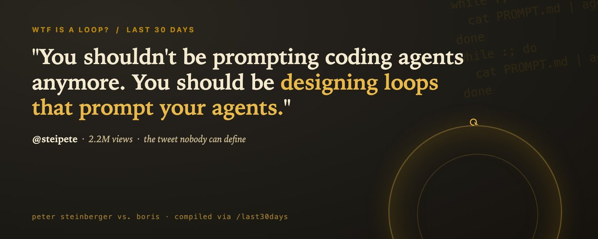
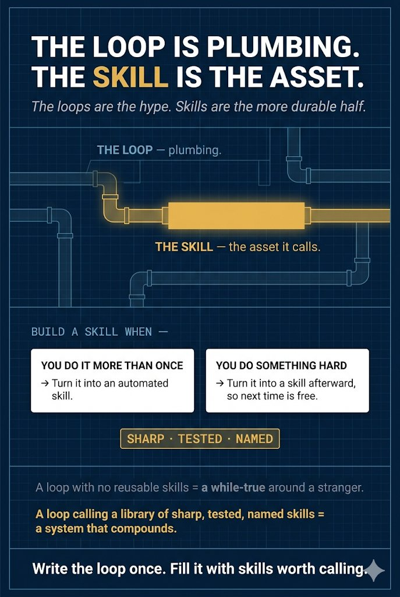

# 📰 WTF Is a Loop? Peter Steinberger vs. Boris Cherny

The most repeated sentence in AI coding this week is six words long, and almost nobody saying it can define it. One tweet had the entire timeline in a chokehold this week, so I ran /last30days on the word everyone was fighting about. The answer is real, it has a five-year lineage, and the punchline is that the loop, not the model, is now the expensive part.

# The tweet that has the timeline in a chokehold

One tweet has had the entire AI-coding timeline obsessed this week. Peter [Steinberger](https://x.com/steipete) posted it on June 7, it cleared 2.2 million views, and the replies turned into a brawl over what it actually meant.

> “Here's your monthly reminder that you shouldn't be prompting coding agents anymore. You should be designing loops that prompt your agents.”

@steipete, June 7, 2026

That is the sentence everyone is quoting. The most telling reply came from Varadh Jain, who asked the only question that mattered: what does this look like in practice? And the answer that became the whole mood was Matthew Berman's.

> “nobody knows but him and boris.”

@MatthewBerman, June 7, 2026

That is the real story. Not that loops are the future, but that a six-word phrase hit two million views while the people boosting it argued in the replies about what it meant. I did not roll my eyes, because I run a loop every night that opens pull requests across roughly thirty open-source repos while I sleep. Ninety seconds of research handed back fifteen Reddit threads, twenty-one X posts, and one uncomfortable pattern: the loudest idea in AI coding is one most people repeating it cannot explain. One camp shouted that prompt engineering is dead. Another camp, the one with their hands actually on a keyboard, was more careful.

> “It's not ralph/goal loops, that's old hat by now. It's probably some kind of continuous orchestration loop that oversees other threads/agents.”

@trashpandaemoji, June 7, 2026

That reply is the closest thing to a correct answer anyone posted. Hold onto it.

# What a loop actually is

Boris Cherny created Claude Code as a side project in September 2024. It now reportedly sits behind close to four percent of all public commits on GitHub. On stage at the Acquired Unplugged event hosted by WorkOS on June 2, he gave the cleanest definition of a loop you will find.

> “Now it's actually leveled up, I think, again, to the next wave of abstraction where I don't prompt Claude anymore. I have loops that are running. They're the ones that are prompting Claude and figuring out what to do. My job is to write loops.”

Boris Cherny, WorkOS [Acquired](https://www.youtube.com/watch?v=RkQQ7WEor7w) Unplugged, June 2, 2026

So here is the plain version. A loop is a small program you write that prompts the coding agent for you, reads what it produced, decides whether it is done, and if not, prompts it again. You stop being the thing inside the loop typing prompts. You become the author of the loop. The model becomes a subroutine.

Boris tells it as three stages, and placing yourself on his ladder is the fastest way to get it. A year ago he wrote code by hand with autocomplete. Then he ran five to ten Claude sessions in parallel and prompted each one. Now he does not prompt at all. He writes the loops that prompt Claude, and a couple hundred agents read his GitHub, Slack, and Twitter and decide what to build next. He has the receipt.

> “In the last 30 days, 100% of my contributions to Claude Code were written by Claude Code. I landed 259 PRs.”

Boris Cherny, via Simon Willison, [December](https://simonwillison.net/2025/Dec/27/boris-cherny/) 27, 2025

He deleted his IDE in November and has not opened it since. The nuance the prompt-engineering-is-dead crowd skips: he is not saying engineers are obsolete. Someone still has to decide what to build, talk to customers, and coordinate teams, and he says great engineers matter more than ever. The job did not vanish. It moved up an altitude, from writing the code to writing the thing that writes the code.

# The spectrum: from ReAct to orchestration

The replies were a mess because loop hides at least five different things. Here is the ladder, oldest to newest, so you can stop talking past people.

Stage one is the academic while-loop. [The](https://arxiv.org/abs/2210.03629) 2022 ReAct paper formalized it: the model reasons, calls a tool, reads the result, repeats until done. One model, one loop, a human watching. Stage two is AutoGPT in 2023, which gave it a goal and let it prompt itself, and which became famous for spinning forever doing nothing. That failure seeded years of agents are a toy.

Stage three is the one Trash Panda called old hat: the ralph loop, published by Geoffrey [Huntley](https://ghuntley.com/ralph/) in July 2025. It is almost insultingly simple, a bash one-liner that pipes the same prompt file into the agent over and over. Its real innovation was discipline: every iteration resets the context to a fixed set of anchor files instead of letting the conversation grow. Huntley built an entire programming language with it for about 297 dollars. Stage four productized that: in spring 2026 both Codex and Claude Code shipped a /goal command that runs the ralph loop until a small validator model confirms the task is done.

Stage five is what Boris and Steinberger actually mean, and it is genuinely new, not just renamed. Four things changed. The loop became the unit of work, not the task. Loops started supervising other loops, concurrently and on a schedule. Scheduling replaced the human kickoff, so the loop runs on infrastructure time instead of your attention. And durability became explicit, with git-backed state and crash recovery, because these things have to survive a restart. Ralph assumed your terminal stayed open. The 2026 version assumes it does not. So Trash Panda was right twice: the single-agent ralph loop is old hat, and the multi-agent orchestration loop on top of it is the new thing.

# It's just a cron job with a hat on

The best skeptic line in the entire corpus was four words, posted under someone gushing that loops is where it will go.

> “Cronjobs have funny re-branding rn.”

> X reply, loops discourse, June 2026

This deserves a straight answer, not a dodge, because it is half right. Yes, the scheduling layer is cron. Boris literally runs his on cron. The /loop command in Claude Code uses cron under the hood. If your whole definition of a loop is a thing that runs on a timer, then yes, we invented that in 1975 and you can go home.

What cron never had is the part in the middle. A cron job runs a fixed script. A loop runs a model that looks at the current state, decides what to do next, does it, checks whether it worked, and decides whether to keep going. The decision is the agent's, not yours, and not a hardcoded branch. Stack those, let one loop dispatch and supervise others, give them durable shared state, and you have something cron cannot express. The honest framing is not that loops are new magic and not that loops are just cron. It is that loops are cron plus a decision-maker in the body, and the interesting engineering is everything you wrap around that decision so it does not run off a cliff.

# What it looks like when you actually build one

Enough theory. The on-ramp is one line. Claude Code shipped /loop, and Boris's own example is the canonical starter. Paste this and change the nouns.

/loop babysit all my PRs. Auto-fix build issues, and when comments come in, use a worktree agent to fix them.

And here is his fuller recipe. Days later, Boris posted five tips for running Opus autonomously for hours or days.

> Five tips, in his words: use auto mode for permissions so Claude doesn't ask for approval; use dynamic workflows to have Claude orchestrate hundreds or thousands of agents to get a task done; use /goal or /loop to nudge Claude to keep going until it's done; use Claude Code in the cloud so you can close your laptop; and make sure Claude has a way to self-verify its work end to end.

@bcherny, June 2026

Tip five is the one the hype skips and the practitioners obsess over: a loop is only as trustworthy as its ability to check its own work.

That is the whole idea in miniature. You did not write the steps. You wrote the intent and the stopping behavior, and the loop prompts the agent each tick. On TikTok the framing landed cleanly for a general audience.

> “Loop mode is one of the clearest signs that AI coding is moving from one-off prompts to background operations.”

@ai.native.founder on TikTok, June 2026

The deep end is Steve [Yegge's](https://github.com/gastownhall/gastown) Gas Town, launched in January: twenty to thirty Claude Code instances coordinated by a Mayor agent, with patrol agents that run continuous loops and state stored in git so work survives a crash. That is the continuous orchestration loop that oversees other threads Trash Panda was reaching for, shipped and open source.

But the most practical lesson in the research is that a loop is only as good as its ability to check itself. The fastest-growing sub-theme was not orchestration, it was verification.

> “Your coding agent can move fast, but bad commits compound fast too.”

@DanKornas, June 2026

Kornas is shipping roborev, a tool that reviews every commit in the background and feeds the findings back into the agent while the context is still fresh. An open loop that writes code with no feedback is a machine for generating confident mistakes. A loop that writes, runs, reads the result, and corrects is the thing that actually works. The loop is not the magic. The feedback inside it is.

# The plot twist: the loop is now the expensive part

Here is where the research turned from philosophy to a finance problem. The sharpest deflation of the whole agents mythology came from a working engineer.

> “Every ai agent i shipped this year is a for-loop, an llm call, and a try/catch around the json parsing. The only thing agentic about it is the anthropic bill at the end of the month.”

@rohit\_jsfreaky, June 2026

That bill is not a joke. The receipt of the month: Uber capped its engineers at 1,500 dollars per person per tool per month for Claude Code and Cursor after burning its annual AI budget in four months. Once the model writes the code for almost nothing, the cost moves to the loop running it.

> “The costliest thing in AI coding is no longer writing code, it's managing the agent loop.”

@runes\_leo, June 2026

And the failure mode everyone in production is scared of is the loop that does not stop.

> “Without guardrails, you get infinite loops and billing surprises orders of magnitude over budget.”

@cv\_usk, June 2026

Which is why every serious 2026 write-up on loops converges on the same three hard stops: a maximum iteration count, no-progress detection, and a token or dollar budget ceiling. The romantic version of loops is that you write the loops and a thousand agents build your company overnight. The production version is that you write the loops, and most of your job is making sure they halt. Gartner puts agentic AI at the peak of inflated expectations, with only about seventeen percent of organizations actually deploying agents. The gap between the timeline and the receipts is the real state of play.

# It's not loops. It's skills.

Here is my own take, and it is where I land after a week of watching this. The loop is plumbing. The asset is the skill it calls.

Steinberger's other recurring point pairs with the loops one and is the more durable half: if you do something more than once, turn it into an automated skill, and if you do something hard, turn it into a skill afterward so next time is free. A loop with no reusable skills inside it is just a while-true around a stranger. A loop that calls a library of sharp, tested, named skills is a system that compounds. The Reddit practitioner who is actually converting said it best.

> “A lot of people are rolling their eyes on Twitter, but my ears are perked up.”

r/ChatGPTCoding, June 2026

So the answer to WTF is a loop is not a hot take about prompt engineering dying. It is this: stop being the thing in the loop. Write the loop once, give it skills worth calling and feedback so it can check itself, cap it so it halts, and let it run on cron while you go decide what to build next. Steinberger and Boris are describing the same animal from two sides. The only people who truly know are the ones who have already built one. The good news is that, as of this month, the on-ramp is a single slash command.

# Key Patterns from the Research

A loop is cron plus a decision-maker in the body: the model, not a hardcoded branch, picks the next action each tick.

The lineage is real: ReAct in 2022, AutoGPT in 2023, ralph in 2025, /goal in spring 2026, orchestration loops now. Single-agent ralph is old hat; multi-agent supervision is the new layer.

The loop is only as good as its feedback. Continuous review and validation gates are what make a loop trustworthy.

The expensive resource shifted from tokens to loop management. Cap iterations, detect no-progress, set a dollar budget.

The reusable unit inside the loop is a skill, not a prompt. Loops that call sharp named skills compound; loops that re-derive everything just burn money.

# All Agents Reported Back

Reddit: 17 voices (r/ClaudeAI, r/AI\_Agents, r/ExperiencedDevs), 47 threads, 34k upvotes

X: 21 voices (steipete, bcherny, runes\_leo), 56 posts, 175 reposts

YouTube: 4 voices (WorkOS, Lenny's Podcast, Y Combinator), talk transcripts

TikTok: 6 voices (ai.native.founder, nikpolale), 34 clips

Instagram: 4 voices (sequenzy\_com, ai.builders), 14 reels

Hacker News: 12 voices, 54 stories, 1k comments

GitHub: 6 repos (gastownhall/gastown, NousResearch/hermes), steipete 259+ PRs

Top voices: steipete, bcherny, runes\_leo, rohit\_jsfreaky, MatthewBerman

Compiled from /last30days runs on 2026-06-07. Facets: designing loops that prompt coding agents, ai loops, coding loops.

Co-founded a self-driving oven company (acquired by Weber) and the company that became Lyft. Building again, more soon. I run loops that ship open-source PRs while I sleep, and I write them with /last30days research running in the background.

### 🖼️ Attached Media

## 💬 Replies

### 1 @vesmallu (Ve)

*Tue Jun 09 03:44:39 +0000 2026*

@mvanhorn loops拆得非常细。但决策者犯错时，cron只会让它反复撞墙。

### 2 @sashimikun_void (Sheing Ng)

*Mon Jun 08 06:11:40 +0000 2026*

@mvanhorn @GeoffreyHuntley ^ 

### 3 @mvanhorn (Matt Van Horn) (Author)

*Mon Jun 08 06:12:13 +0000 2026*

@sashimikun\_void @GeoffreyHuntley 😂

### 4 @morganlinton (Morgan)

*Mon Jun 08 14:07:06 +0000 2026*

@mvanhorn @garrytan I knew you were going to write this! 😅

### 5 @mvanhorn (Matt Van Horn) (Author)

*Mon Jun 08 15:53:15 +0000 2026*

@morganlinton @garrytan 👀

### 6 @ericosiu (ericosiu)

*Mon Jun 08 14:08:17 +0000 2026*

@mvanhorn @paulroetzer Good stuff

### 7 @mvanhorn (Matt Van Horn) (Author)

*Mon Jun 08 15:53:02 +0000 2026*

@ericosiu @paulroetzer Thx Eric

### 8 @OranAITech (Adi Oran)

*Mon Jun 08 06:25:14 +0000 2026*

@mvanhorn [youtu.be/mR-WAvEPRwE?t=…](https://youtu.be/mR-WAvEPRwE?t=1042&si=9ovo730xQTK3Y0cz)

Run long running agents.

### 9 @mvanhorn (Matt Van Horn) (Author)

*Mon Jun 08 06:26:47 +0000 2026*

@OranAITech Eyes 👀

### 10 @editxshub (Shubham Sharma | AI & Tech)

*Mon Jun 08 15:33:14 +0000 2026*

@mvanhorn If I’d wanted to read an AI’s opinion on the matter, I would have just prompted an LLM myself.

### 11 @mvanhorn (Matt Van Horn) (Author)

*Mon Jun 08 15:45:04 +0000 2026*

@editxshub 😂

### 12 @bossriceshark (Matt Rice)

*Mon Jun 08 13:42:41 +0000 2026*

@mvanhorn @garrytan Great read, very helpful!

With where I'm at, I zero in on this: 

### 13 @mvanhorn (Matt Van Horn) (Author)

*Mon Jun 08 15:53:08 +0000 2026*

@bossriceshark @garrytan Fun graphic

### 14 @roshi_nakamoto (Storm)

*Mon Jun 08 21:08:29 +0000 2026*

@mvanhorn This is absolute slop

### 15 @mvanhorn (Matt Van Horn) (Author)

*Mon Jun 08 21:10:33 +0000 2026*

@roshi\_nakamoto thx! lol

### 16 @dsirokyai (David Siroky)

*Mon Jun 08 06:15:11 +0000 2026*

@mvanhorn You can pretty much do that by designing a plan in grok build or codex and then /goal it so it doesn’t stop before it’s finished. Needs a decent plan

### 17 @mvanhorn (Matt Van Horn) (Author)

*Mon Jun 08 06:17:33 +0000 2026*

@dsiroky Agreed. But Peter says he never writes plans!

### 18 @agrawal_twts (gaurav agrawal)

*Mon Jun 08 16:40:33 +0000 2026*

@mvanhorn Loop = Brute Forcing and Token Maxxing your way out

### 19 @mvanhorn (Matt Van Horn) (Author)

*Mon Jun 08 16:54:29 +0000 2026*

@agrawal\_twts I like that

### 20 @TinaMBean (Tina Bean)

*Mon Jun 08 20:26:47 +0000 2026*

@mvanhorn "There's real scaffolding here." is what my Claude Code said when I pasted your article into my project and asked if it could be helpful. 😍 Of course I put your entire Github repo in already... Got some great nuggets. Thanks @mvanhorn. You're a gem!

### 21 @mvanhorn (Matt Van Horn) (Author)

*Mon Jun 08 20:38:45 +0000 2026*

@TinaMBean yay!

### 22 @monikermissing (Marcus Downing)

*Tue Jun 09 14:01:21 +0000 2026*

@mvanhorn The entire tweet is written by AI. :/

### 23 @mvanhorn (Matt Van Horn) (Author)

*Tue Jun 09 14:04:04 +0000 2026*

@monikermissing it's not ¯\\\_(ツ)\_/¯

### 24 @the_rza_ (Riza Ingalls)

*Tue Jun 09 07:38:19 +0000 2026*

@mvanhorn @mvanhorn I just tried out the last 30 days skill. 

Nicely done. This skill is very useful.

### 25 @mvanhorn (Matt Van Horn) (Author)

*Tue Jun 09 07:39:41 +0000 2026*

@the\_rza\_ Woohoo 🙌

### 26 @BHconsultDev (Bar Hav 👇)

*Mon Jun 08 16:33:18 +0000 2026*

@mvanhorn I ran this thread by Claude:

“That thread is describing your existing life, and I mean that precisely.”

### 27 @mvanhorn (Matt Van Horn) (Author)

*Mon Jun 08 16:54:40 +0000 2026*

@BHconsultDev Lfg

### 28 @jbwill910 (Jarrod Williams)

*Tue Jun 09 12:27:26 +0000 2026*

@mvanhorn Founded a self-driving oven company?

### 29 @mvanhorn (Matt Van Horn) (Author)

*Tue Jun 09 13:32:25 +0000 2026*

@jbwill910 [Juneoven.com](http://Juneoven.com)

### 30 @GregBVADR (Greg Bobby)

*Sun Aug 09 15:06:42 +0000 2026*

This is where it gets really interesting. Planning, loops, and parallel workers make autonomous execution increasingly capable. I'm exploring what happens when you take that to the organizational level: Objectives, persistent Workers and Teams, bounded Delegated Authority, economic authority, and accountability for Outcomes. At VADR, that's the focus of Telo, the Autonomous Company.

### 31 @mvanhorn (Matt Van Horn) (Author)

*Sun Aug 09 16:12:29 +0000 2026*

@GregBVADR Nice!

### 32 @Filecoin (Filecoin)

*Mon Jun 08 19:59:32 +0000 2026*

@mvanhorn The loop is only as good as its memory. 

State that evaporates between runs doesn't compound. Verifiable, persistent storage is what turns a loop into something that learns over time.

### 33 @zcabrams (Zach Abrams)

*Mon Jun 08 18:47:53 +0000 2026*

@mvanhorn Love your content but this is so obviously written by claude it’s painful

### 34 @mreiffy (Max the VC 👨‍🚀)

*Mon Jun 08 15:42:18 +0000 2026*

@mvanhorn Yet another completely ai generated article. wtf is going on with X

### 35 @ziwenxu_ (Ziwen)

*Mon Jun 08 07:56:59 +0000 2026*

@mvanhorn /loop, /goal

### 36 @StatisticsFTW (Robert Balicki (👀 @IsographLabs))

*Mon Jun 08 14:36:02 +0000 2026*

@mvanhorn Folks on this thread may be interested in checking out Barnum. TLDR use a programming language that's suited to the task (orchestrating many parallel units of work) and where invoking an LLM is easy, and move as much logic out of the LLM as possible.
 [x.com/StatisticsFTW/…](https://x.com/StatisticsFTW/status/2063761132469248440)

