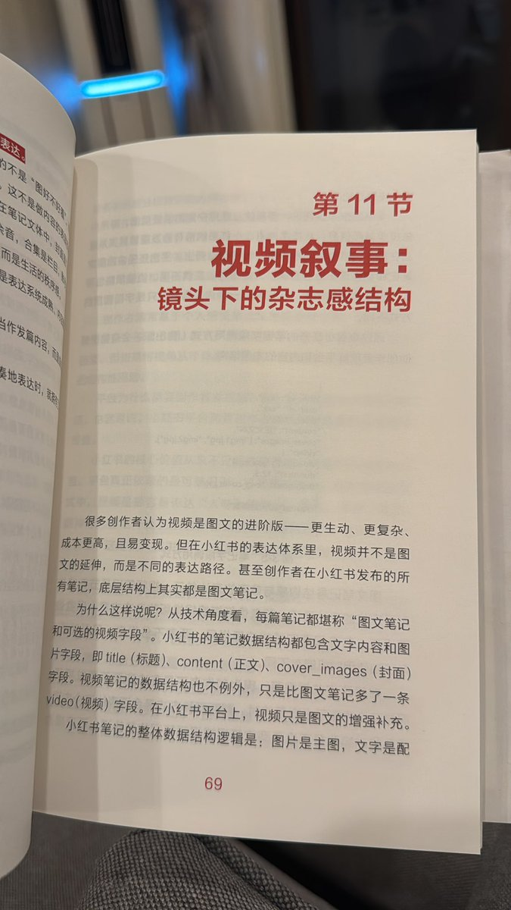
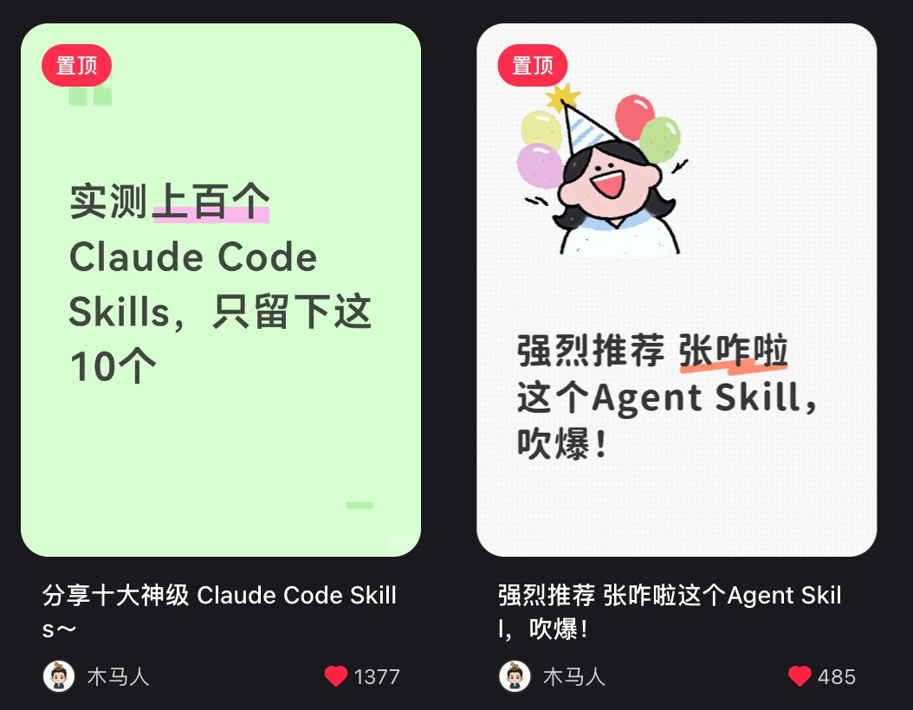

# 📰 成就伟大之前，先学会卖东西 

上个月，我在 Apple × 浙江大学的移动应用孵化营担任营销篇导师，给 20 多个创业团队讲了一天半的课。

学员都是有产品的人。有人的 APP 已经上线，有人还在打磨 MVP。几乎所有人都带着同一个问题来的：产品做好了，怎么让人知道？

课上讲了很多，有几个我觉得最容易被忽略的点，和大家分享。

一、应用商店不是商场。

用户打开淘宝，是因为想买东西。用户打开 App Store，已经不是了。

现在的路径是这样的：用户在小红书、抖音、B 站刷到一条内容，被打动，记住了 APP 的名字，再去 App Store 搜索下载。

应用商店是仓库，内容平台才是货架。你要先在货架上出现，用户才会去仓库取货。

这不是危言耸听。2026 年，国内市场的增长路径几乎只剩两条：App Store 编辑推荐，以及内容平台种草。前者不可控，而后者是我们可以自己做的事。

二、营销的本质是翻译。

技术团队有自己的语言：我实现了四象限任务管理，支持 iCloud 同步，基于艾森豪威尔矩阵。

没有一句是错的，但用户get不到。

用户只关心自己。他不在乎你的功能有多完整，他只在乎「这跟我有什么关系」。

内容翻译是这样做的：

功能层：支持 iCloud 同步。

价值层：你的记录不会丢，手机、iPad 随时都在。

功能层：基于艾森豪威尔矩阵。

价值层：总被紧急的事推着走？这个工具帮你看清楚什么才是真正重要的。

翻译是让一切可感。每一句话都要能让用户感受到「这说的是我」。

有一个最基础的定位公式：我们帮助\_\_\_（谁），在\_\_\_（什么时候），解决\_\_\_（什么问题）。

比如：好事发生App不是一款笔记软件，而是「帮助容易 emo 的人，通过记录好事儿，用科学的方法让自己变快乐」。

三、找到具体的人，不是想象一个人群。

不是「效率工具用户」，而是：学校里的行政老师，要写论文、上课、还要处理各种杂事，需要把工作分成四象限来看清楚优先级。

这个人是真实的，可以找到的，他甚至就在你的身边。

理解用户有三个维度：

场景化：他什么时候会用？把功能放进用户的一天里，你需要能具体描述他使用产品的那个时刻。

情绪化：他想解决什么感受？用户花钱买的，说到底是买个痛快。

身份化：用了它，他成为谁？使用好事发生的用户，是一个「热爱生活的人」；使用 Flomo 的用户，是一个「爱学习爱思考的人」。如果你的产品能强化用户的自我认知，让他愿意分享这个身份，你就有了自来水传播的基础。

四、封面是生死线。

笔记的曝光量低，几乎 100% 是内容本身的问题，内容问题的 90% 集中在封面。

封面没有让用户想点进来，一切都白搭。

用户在双列流里扫视的速度极快。封面的任务是：在不到一秒钟里，让用户产生「这跟我有关，我要点进去」的冲动。

有一个练习：带着「货架思维」刷小红书。你点开了哪篇，为什么点开？返回之后再看一眼那个封面，拆解它对你做了什么。这个动作做多了，你会开始对封面有直觉。

五、内容类型不重要，和产品调性匹配才重要。

火爆的笔记大致分几类：高度结构化的信息整合（密密麻麻的干货型封面）、人格化的问题直击型（口播，字幕直接打出痛点）、有审美的美学型（视觉本身就是卖点）、留悬念等点击的钩子型。

没有哪种天然更好。关键是和你的产品调性匹配，然后持续做，通过数据验证。

爆款是概率，但内容是科学。你要做的不是押注一次，而是建立可以持续产出爆款要素的机制。一旦找到有效的要素，不要只用一次。把它们拆开重组，同一个场景 × 不同情绪切入，同一个痛点 × 不同人群描述，用乘法生产。

六、搜索词不是标签，是埋在内容里的线索。

据官方公开数据，小红书 70% 的月活用户有搜索行为，用户往往先搜需求词，再搜品牌词。如果你能在用户搜索的那一刻出现在结果页，获客成本极低。

搜索词植入不是在笔记末尾堆井号，而是在封面、标题、正文里自然地反复提及用户会搜索的词。

需要覆盖的词大概分几类：

人群词：上班族、学生党、30岁打工人。

场景词：加班、旅行、睡前、早起。

产品词：你的 APP 名称及其别称。

竞品词：用户搜竞品时也能找到你（前提是你的产品值得被推荐，否则是在给竞品导客）。

类目词：效率工具、心理疗愈、任务管理。

……

不需要每篇都带全，但至少带上一部分。笔记越多，词覆盖越广，被搜到的概率就越高。

七、投放是放大器，不是救命稻草。

99% 的投放不行，都是内容不行。

很多开发者遇到数据差，第一反应是调整投放策略。这个顺序是错的。投放只是放大器，好内容放大得更好，烂内容放大了更烂。

小红书投 75 元，抖音投 50 元。用这点钱买的不是流量，是一个结论：这条素材值不值得继续投？

如果 ROI 为正，继续给这条花钱，同时开始生产类似这条的素材，因为它里面有爆款要素。投放不行时，先改内容，再想投放。

八、水上水下，要想清楚。

水上笔记是通过蒲公英等官方平台与达人成交，平台抽佣约 10%，内容会被标注为广告。水下合作是直接私下成交，达人报价更低，内容展现形式更像真实分享。

对 APP 推广来说，硬广效果往往不如软性真实分享。在小红书这样的真实分享社区里，越像广告的内容越不容易被信任。能水下就水下，但要做好内容本身。

关于蓝 V 认证：对于 APP 业务，不建议主动认证。认证后发的内容会被识别为企业广告流，自然流受限，而 APP 的成交路径也不需要走私信引流这一套。除非平台销售主动找上门，否则认证得不偿失。

九、找达人之前，先写 brief。

达人不只是放大器，也是产品亮点的发现者。有些最好的产品卖点，不是你自己总结出来的，而是达人替你翻译出来的。

找达人之前必须先写 brief：你的产品理念关键词、设计初衷、核心亮点，以及你希望他不要讲什么。brief 不是让达人照抄，是给他发挥的框架。

不同阶段找不同量级的达人。早期优先找千粉以下的素人和 KOC，成本低，内容更真实。有了跑量的素材之后，再考虑中腰部达人放大。

十、素人种草的逻辑。

单靠创始人号和官号，管道太少。更高的杠杆来自：让更多的人，从各个身份出发，为你的产品发声。

素人账号的逻辑简单直接：单个账号的权重不重要，数量足够多，平均健康度就出来了。

找素人可以发「招募令」，吸引愿意置换合作的博主。置换合作是性价比最高的起量方式：送年费会员换一篇笔记，找真实用户发真实体验。第一批 UGC 就是从这里来的。利用这个方法，我们做出过数个成功案例。

十一、定价要有逻辑，不是跟着感觉走。

很多开发者定价的方式是：看看竞品，然后稍微低一点。

这个逻辑有问题。定价是产品定位的一部分，它决定了你在用户心里是什么东西。

卖给国内用户和卖给美国用户，可以不是一个价。同一个功能，面向不同市场、不同用户群体，定价策略完全可以不同。

想清楚你在服务谁，再决定收多少钱，而不是先定价再找用户。

十二、私域不是微信群，是真正属于你的用户资产。

平台流量是借来的。今天是小红书，明天不知道是什么。真正属于你的，是能持续经营的用户资产。

对 APP 来说，私域不一定是微信群，可以是：App Store 订阅用户的使用数据、愿意参与测试的核心用户群、愿意为你写真实评论的早期用户。

售后也是这个问题的一部分。设计好了，退款率可以降很低；没设计，用户一不满意直接去 Apple 申请退款，你什么机会都没有。售后不是末端，是承接用户的最后一道口。

十三、把账算清楚。

内容好不好，投放值不值，不是凭感觉判断的，是算出来的。

每一笔预算都应该有一个明确的问题需要回答：这个素材值得继续投吗？这条内容里有可以复用的爆款要素吗？ROI 能在两个月内回正吗？

对 OPC 开发者，两个月回正是一个粗糙但实用的健康标准。如果投了钱，两个月看不到正的 ROI 信号，要么是素材问题，要么是产品没有解决真实需求。两种情况都需要认真对待。

好的内容运营不是每次都从零开始的。它应该是一套有文档、可复用的机制：话术库、brief 模板、内容要素表、AB 测试记录。建起来之后，这套东西可以交接，可以外包，甚至可以交给 AI 来跑。

十四、增长要前置，不是上线后的事。

课上我问了所有团队一个问题：你们是什么时候开始考虑增长的？

大多数人的回答是：上线之后。

写第一行代码之前，就要找用户。不是找测试用户，是找到那个会为它付钱的真实的人。

功能足够强用户自然会发现——这是开发者最容易陷入的幻觉。我自己也走过这段路。

🍎

以上，不止App，如果你做电商、线索转化类业务，思路可复用。

就写到这里，希望对你有启发。

### 🖼️ Attached Media

## 💬 Replies

### 1 @MengkePM (Mengke Wang) (Author)

*Sun Jun 21 08:43:19 +0000 2026*

本文公号版：[mp.weixin.qq.com/s/0bbHjliV-V35…](https://mp.weixin.qq.com/s/0bbHjliV-V35HDtGtxt33Q)

### 2 @AI_Jasonyu (鱼总聊AI)

*Sun Jun 21 23:45:59 +0000 2026*

@MengkePM 祝梦柯老师，来 X好事发生

### 3 @yanhua1010 (Yanhua)

*Sat Jun 20 09:42:43 +0000 2026*

@MengkePM 我看看有什么魔力

### 4 @belliedmonkey (张钊)

*Sat Jun 20 13:11:59 +0000 2026*

@MengkePM 正在看 太巧了 

### 5 @MengkePM (Mengke Wang) (Author)

*Sat Jun 20 13:20:16 +0000 2026*

@belliedmonkey 阅读愉快～

### 6 @MeetResona (Resona)

*Fri Jun 19 03:13:05 +0000 2026*

@MengkePM 平台流量是借来的，始终应该构建自己的用户资产👍

### 7 @MengkePM (Mengke Wang) (Author)

*Fri Jun 19 12:14:34 +0000 2026*

@TryServio 嗯呢

### 8 @xm0x00 (meng)

*Sun Jun 21 06:17:48 +0000 2026*

@MengkePM 三十多这把年纪再好的内容和干货都像过眼云烟，提不起兴趣，道理基本都懂，没有执行力。

### 9 @MengkePM (Mengke Wang) (Author)

*Sun Jun 21 06:45:00 +0000 2026*

@xm0x00 三十多岁真是太好的年纪，甚至某种程度上太过于年轻。不过也不用天天努力倒是，想休息就休息休息没关系的。

### 10 @stark_nico99 (Nicolechan)

*Thu Jun 18 13:19:40 +0000 2026*

@MengkePM 即友来辣，果断关注！

### 11 @MengkePM (Mengke Wang) (Author)

*Fri Jun 19 00:16:47 +0000 2026*

@stark\_nico99 好耶！😁

### 12 @yangqing_66 (杨清聊AI)

*Thu Jun 18 16:35:20 +0000 2026*

@MengkePM 即将 好事发生！！！

### 13 @MengkePM (Mengke Wang) (Author)

*Fri Jun 19 15:29:04 +0000 2026*

@yangqing\_66 必须必

### 14 @bravetsia (YF)

*Sat Jun 20 11:12:19 +0000 2026*

@MengkePM 讲的也太好了！

### 15 @MengkePM (Mengke Wang) (Author)

*Sat Jun 20 11:37:06 +0000 2026*

@bravetsia 🧡🧡🧡

### 16 @wildwind0 (宇宙大烧卖)

*Sun Jun 21 15:20:54 +0000 2026*

@MengkePM 给的建议都能让我联系上做过的动作，会庆幸自己有的在这么做，有的还没做到可以马上实践。很有收获，点赞！

### 17 @MengkePM (Mengke Wang) (Author)

*Sun Jun 21 15:43:22 +0000 2026*

@wildwind0 那可太好了！

### 18 @vivian7days (Summer)

*Thu Jun 18 16:52:01 +0000 2026*

@MengkePM 这篇写的超级干货，已经分享给OPC的好朋友们

### 19 @MengkePM (Mengke Wang) (Author)

*Fri Jun 19 12:11:45 +0000 2026*

@vivian7days 希望对你的朋友们有用～

### 20 @Maimai_Maylia (麦麦Maylia)

*Fri Jun 19 08:42:03 +0000 2026*

@MengkePM 特别棒 为伟大的女性干一杯！

### 21 @MengkePM (Mengke Wang) (Author)

*Fri Jun 19 12:11:29 +0000 2026*

@Laoma\_1 比心

### 22 @yichuanflow (益川 | Yichuan Flow)

*Fri Jun 19 02:18:10 +0000 2026*

@MengkePM 刚说到产品传播问题就刷到了，这推荐这么神奇？
增长要前置，不是上线后的事。游戏圈有个话，立项定生死，都是一个道理。前置想明白了，避免每天瞎忙。
要是想不明白，这个时候怎么办？那就先做，边做边想。

### 23 @MengkePM (Mengke Wang) (Author)

*Fri Jun 19 12:12:10 +0000 2026*

@RichieY13785 边做边想 创造中学👍

### 24 @iswangwenbin (AI 有两下子)

*Thu Jun 18 23:28:47 +0000 2026*

@MengkePM 产品做好了，怎么让人知道？
正卡在这一步，没想到出现在我的时间线上，
感谢你的分享！

### 25 @MengkePM (Mengke Wang) (Author)

*Fri Jun 19 00:16:01 +0000 2026*

@iswangwenbin 💐💐💐

### 26 @cellinlab (Cell 细胞)

*Thu Jun 18 12:46:16 +0000 2026*

@MengkePM 居然被我刷到了！

### 27 @BinaryHB (段少🎵DaDalus)

*Sat Jun 20 07:44:54 +0000 2026*

@MengkePM 干货！我也是觉得两个月是第一个观察周期～

### 28 @cnyzgkc (木马人)

*Mon Jun 22 08:30:17 +0000 2026*

@MengkePM 我做小红书2个月，就曝过两个贴\~

但是一直不理解背后爆款的逻辑，看完这篇文章后，我又去看了一眼数据和内容\~

从封面来说，简单，一眼能看出内容是什么
从内容来说，两篇内容在其他平台上验证过已经爆了

这篇内容写的非常棒，对于做自媒体的同学有很好的启发，非常感谢老师的分享\~ 

### 29 @sunyunran (孙云冉.eth)

*Sun Jun 21 12:33:15 +0000 2026*

@MengkePM 👌

### 30 @isnail (蜗牛King 👑)

*Sun Jun 21 06:45:26 +0000 2026*

@MengkePM 很棒的产品手册，值得反复阅读学习！

### 31 @easyglobe_ (出海猴🐒 @EasyGlobe出海🚢)

*Sun Jun 21 14:58:05 +0000 2026*

@MengkePM 非常值得一看

### 32 @HoodyLiu (Hoody)

*Mon Jun 22 05:47:55 +0000 2026*

@MengkePM 先找客户，再做产品

### 33 @vbjby3 (季白羽)

*Thu Jun 18 12:16:23 +0000 2026*

@MengkePM 发现好多国内大V开始做推特了😂

### 34 @nicebabycat (韦小宝)

*Fri Jun 19 10:46:49 +0000 2026*

@MengkePM "产品够好，用户自然会发现",这是开发者最容易信的童话。
东西好当然重要，但好东西也得会摆出来、讲明白、卖出去,伟大可以慢慢成，但先把第一单卖出去。

### 35 @cuisitekp (卡牌大师崔斯特)

*Fri Jun 19 15:11:50 +0000 2026*

@MengkePM 已关注，期待爆火！

### 36 @CharlexHuang (Charlex)

*Wed Jun 24 03:07:49 +0000 2026*

@MengkePM 感谢，很有价值的内容，正在为推广我的第一个App而头疼😂

