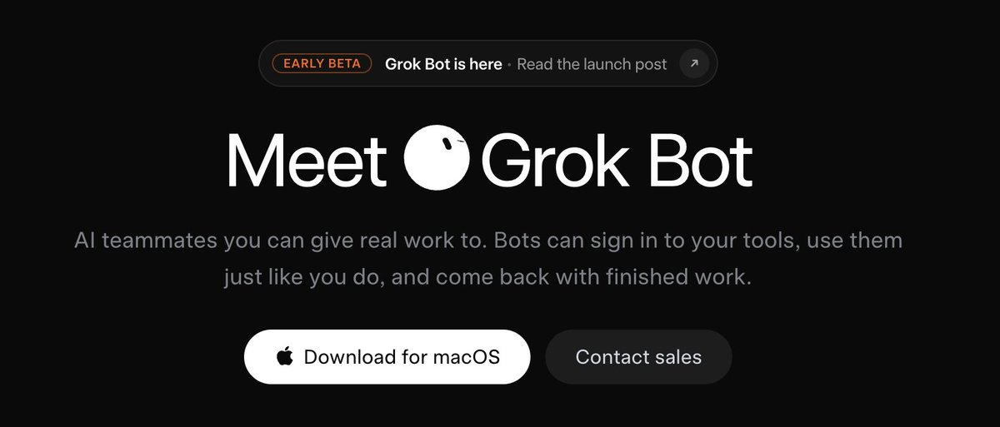
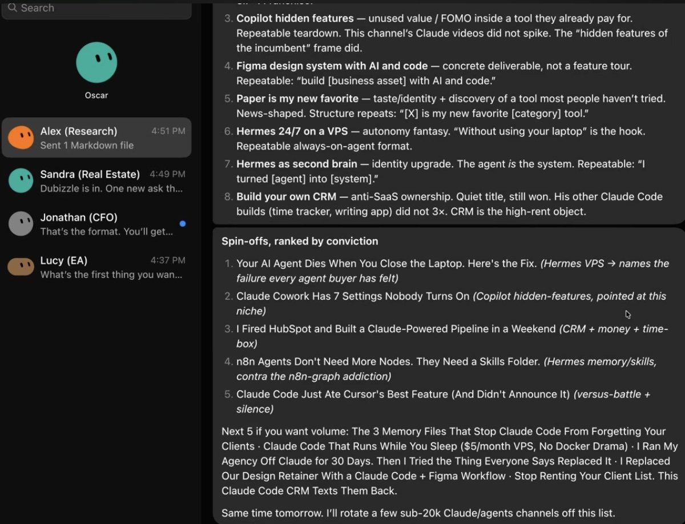
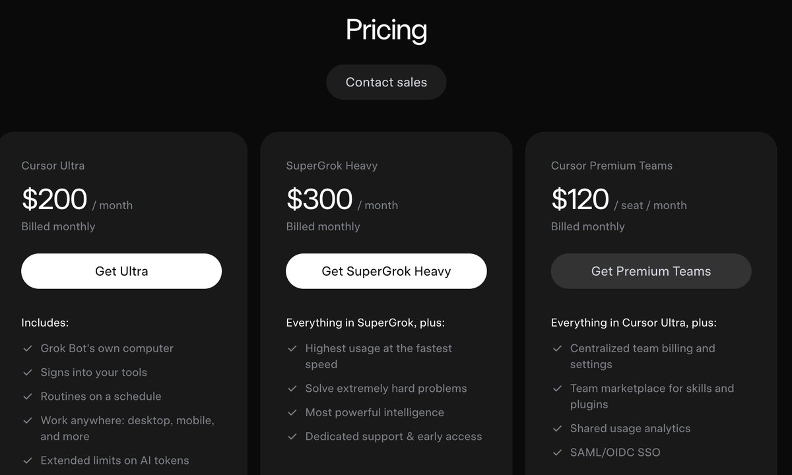
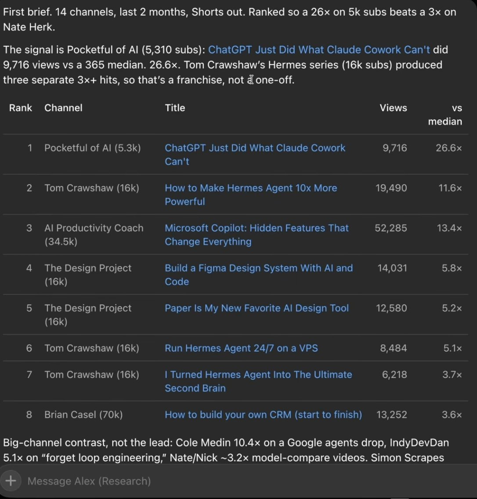
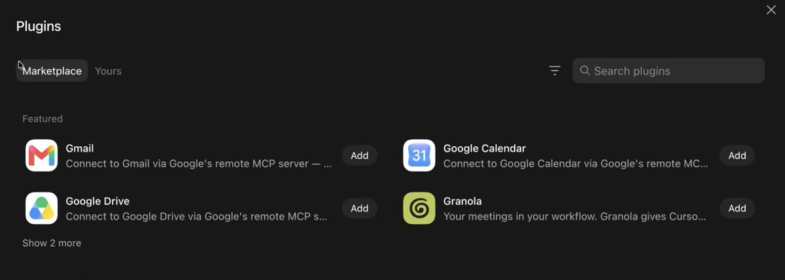
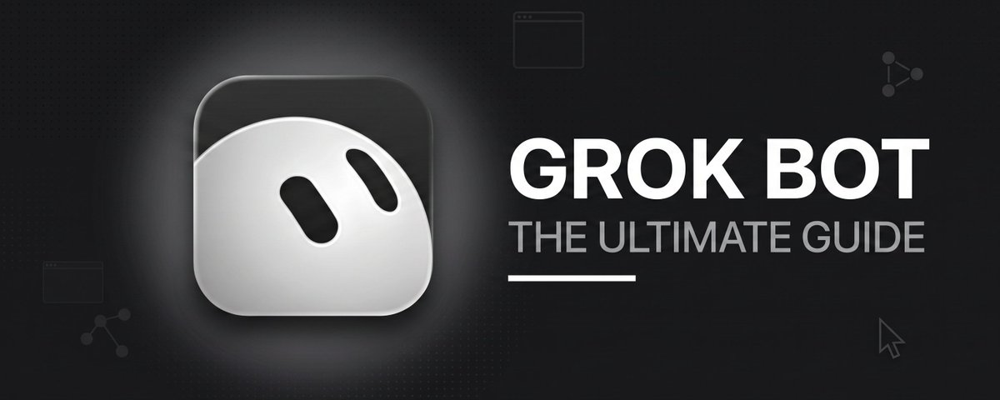

# 📰 Grok Bot: The Ultimate Guide 

Elon has officially done it. He's created the most powerful agentic software in the world.

In this guide, I'm going to lay out everything you need to know about the new Grok Bot.

I've been ruthlessly testing Grok Bot since its release, and this is hands down the most powerful AI agent tool on the market right now.

Table of Contents

I: What even is Grok Bot?

II: How to Set Up & Use It

III: Real Workflow Examples & Prompts

IV: My Honest Analysis & Key Takeaways 

---

## I: What even is Grok Bot?

Last week (August 11th), the SpaceXAI team officially announced Grok Bot.

[Embedded Tweet: https://x.com/i/status/2087224798078517251]

Grok Bot is SpaceXAI's always-on AI agent product.

It is not a chatbot but rather a team of agents, each with its own cloud computer (this is the big shift). 

A normal AI session lives inside a chat window and stops the moment you close it. 

A Grok Bot agent runs on its own browser, file system, and terminal - which means your agents can keep working after you close your laptop.

How Grok Bot Works

You assign each bot a role and essentially launch an agent swarm.

E.g., research, outreach, scheduling, finance - whatever the job is. Your agents sign in to the tools they need once and reuse those logins going forward.   

Grok Bot versus OpenClaw/Hermes 

OpenClaw and Hermes Agent are genuinely powerful, but they require you to configure your own always-on machine (like a VPS), and the main drawback is that the setup process can be quite extensive.

Grok Bot is completely plug-and-play. You simply download it, log in, and you have a running agent team without touching infrastructure.  

No more worrying about keeping skill files updated, context cleaning, etc. 

Another thing to note is that Grok Bot can run any model (OpenAI, Anthropic, etc.). 

One tradeoff worth knowing: with Grok Bot, you're trading data sovereignty for convenience. Grok Bot is closed, cloud-hosted, and built entirely on a fixed pricing model you don't control. 

Current Pricing for Grok Bot

Another drawback is that Grok Bot is relatively expensive right now.

$200/mo minimum with Cursor Ultra. 

TL;DR: Grok Bot is a team of 24/7 AI agents that get work done on your behalf. Think of Grok Bot as your own personal team of desktop employees. 

---

## II: How to Set Up & Use It (step-by-step)

Prerequisites

- An eligible paid plan: SuperGrok Heavy, Cursor Ultra (shown above)

- Desktop app (macOS or Windows) or iOS app

- Internet connection

Official starting points: [x.ai/bot](https://x.ai/bot) and the docs at [docs.x.ai/grok-bot/get-started](https://docs.x.ai/grok-bot/get-started).

Step-by-step setup (desktop):

1. Confirm/upgrade your plan
Sign in with the Cursor account that owns the plan/usage.

1. Download and install the desktop app
Go to the official Grok Bot access/download page (via x.ai/bot or the linked Cursor/xAI pages). 

1. Sign in
Open Grok Bot and sign in with the same Cursor account. On first launch, it introduces Bots, the shared computer, and routines, then asks about tools you use.

1. Create your first Bot (add description, fill in context data) 

That's it! Super simple setup that only takes a few minutes. 

Now, let me show you some of my favorite prompts:

---

## III: Real Workflow Examples & Prompts 

Meet my team of AI agents

Alex: personal research assistant 

Sandra: real estate scout 

Jonathan: CFO 

Lucy: EA 

Oscar: General

Each one runs as its own persistent agent, with its own memory, role, and cloud computer. 

Here's exactly how I've set up each of my five agents, along with the prompts behind them, if you want to deploy them yourself.

1. Alex: the research assistant

Every morning at 6am, Alex scans the top YouTube channels in my niches (AI, Claude, etc.) and delivers a brief on potential outlier content.

\`\`\`
SETUP PROMPT

"Every morning at 6am, scan the top YouTube channels covering AI, 
Claude, and AI agents. Find outliers - videos where the view count 
is significantly above what the channel's median performance and 
subscriber count would predict. For each outlier, pull the 
transcript, tell me why you think it worked, and give me 3 
spin-off video ideas based on it. Present the curated list to me 
as a morning briefing."

This is a single prompt doing what used to be hours of manual 
scrolling. And because Alex has his own computer, this runs 
whether or not I'm anywhere near mine.

The obvious next step, which I haven't built yet: ask Alex to 
vibe-code a dashboard that displays this automatically instead of 
sending it as a message, and have it self-update every morning.
\`\`\`

The cool thing about Alex is that I can actually record how I personally go about finding outlier content and package it into an agentic skill that Alex can use - much like training a real employee. 

2\.     Sandra: the real estate scout  

Sandra checks property listings twice a day (morning and evening) against a budget and criteria I gave her once, and flags anything trading meaningfully under market value.  

\`\`\`
SETUP PROMPT  

"Twice daily, morning and evening, scan \[property sites\] for new  listings matching: \[budget range\], \[property type\], \[area/street  names if relevant\]. Index each listing against recent comparable  sales in the same area. 

Flag anything listed 15% or more under  what comparable pricing would suggest. Put flagged listings in a  spreadsheet with the address, price, expected market value, and  percentage under market. Notify me immediately if something  qualifies." 
\`\`\`

Right now, Sandra is finding villas listed 26-37% under what comparable pricing would suggest (I'm in the middle of trying to find a new property, so this has been extremely useful). 

3\.     Jonathan: the CFO  

Jonathan reads my portfolio data and gives me a daily update: overnight moves, the day's major calendar events, and whether any of my positions need attention.

\`\`\`
SETUP PROMPT

"You are my portfolio analyst. Here is my portfolio: \[link to 
spreadsheet or account access\]. Every morning, give me: overnight 
moves across my positions, today's major market events and 
calendar, and flag anything showing an unexpected or significant 
move. If something looks like it needs a decision - a rebalance, 
a position that's drifted from target - tell me explicitly what 
you'd suggest and why, but do not take any action without my 
approval."
\`\`\`

I have this connected to a Google Sheet that pulls live data from my brokerage through an API, so Jonathan is always reading current numbers rather than something I manually update. 

This is a workflow I previously had set up in Hermes, but I have since switched to Grok Bot.

4\.     Lucy: the EA  

Lucy lives in my company Slack and gives me a triage each morning, so I don't have to read every message myself.  

\`\`\`
SETUP PROMPT  

"Every morning, check our company Slack. Give me a short summary:  anything urgent that came in overnight, anything that needs a  response from me specifically, and anything I can safely ignore.  

Keep it to the essentials - I want the triage, not a transcript."  This is a small thing that solves a real problem. Opening Slack  first thing and reading every message resets your morning around  whatever came in overnight instead of what you'd actually planned  to do. A triage removes that entirely - you get told what actually  needs you, and can genuinely ignore the rest without the nagging  feeling you're missing something.
\`\`\`

5\.     Oscar: the generalist  

Oscar doesn't have one narrow role. You can use a simple prompt like:

"You are my general assistant" - no need for anything too fancy here. 

Tip: Definitely worth setting up "Plugins" inside your Grok Bot teams.

---

## IV: My Honest Analysis & Key Takeaways 

So, is Grok Bot worth it?  

Pound for pound, Grok Bot IS the most useful and powerful agentic software on the market right now.

However, here's the honest answer for most of you: it's probably not worth it yet.

The biggest bottleneck is pricing 

Grok Bot isn't sold on its own. You get it bundled into an existing subscription.

If you're already paying for SuperGrok Heavy, Grok Bot is effectively free on top of your existing subscription. If you're not, you're looking at $200+ a month for something you can't try in isolation. 

Who is this actually for  

If your AI budget is only $20/month and you're trying to figure out exactly how AI can help you, this isn't your next step. 

My advice would be to go get properly fluent with Claude Code first. You'll learn more, faster, for a fraction of the cost, and get most of what Grok Bot can build anyway.

If you're already a real AI power user spending money on multiple subscriptions and have built various markdown files, skills, context, etc., then this is a legitimate next step. 

Grok Bot's real value

The value isn't that Grok Bot does something fundamentally new. It's that it removes the setup headache and maintenance headache from tools like Hermes/OpenClaw. 

Ultimately, you have to decide for yourself whether that convenience is enough to justify Grok Bot's high price point.

For most people, it won't be worth it just yet, and Claude Cowork/Codex is a better option at a cheaper price point.

Last take: this is almost certainly not the last version of Grok Bot we'll see. I expect the Cursor/SpaceXAI team to heavily improve Grok Bot over the coming months. Meaning, the value proposition of Grok Bot will likely only improve with time.

I'm personally using my Grok Bot team daily and have decided the high price point is worth it, since I spend so much time with AI every day.

---

## Final Thoughts

I hope you found this deep-dive article into Grok Bot valuable.

If you did, be sure to follow me here @milesdeutscher - Every single week, I post articles just like this, breaking down how I practically use AI. 

For deeper AI insights, follow me over on @aiedge\_.

Btw, I recently launched a 100% free AI Skool community.

By joining, you'll get full access to my entire Grok Bot setup guide (+ more prompts). 

If you join now, you'll be one of the first members, as I just launched it!

https://www.skool.com/milesdeutscher

### 🖼️ Attached Media

## 💬 Replies

### 1 @pukerrainbrow (Pukerainbow 🤮🌈)

*Tue Aug 18 22:00:49 +0000 2026*

@milesdeutscher this is a dope one brother, gotta give this a good read to understand everything to know about grok bot

### 2 @PunkXBT_ (PunkXBT)

*Thu Aug 20 09:41:40 +0000 2026*

@milesdeutscher persistent agents with their own computers is a much bigger shift than another chatbot release

### 3 @AleiahLock (Aleiah)

*Tue Aug 18 23:22:12 +0000 2026*

@milesdeutscher Really cool and useful stuff
Sad that i didn’t see it before when i did my article

### 4 @burnschronik (Burnschronik)

*Tue Aug 18 18:26:20 +0000 2026*

@milesdeutscher Would be nice if it didn't cost 300$ per month to use....  Majority of us could never afford that on a regular basis...  F'n rich people...

### 5 @emmycorich (Emmy)

*Tue Aug 18 21:33:27 +0000 2026*

@milesdeutscher 🦾

### 6 @X__nde (X__nde)

*Tue Aug 18 21:11:35 +0000 2026*

@milesdeutscher Thanks for the inside👍🏻

### 7 @stevemordue (Steve Mordue)

*Tue Aug 18 15:08:01 +0000 2026*

@milesdeutscher Clarification: The core Grok product is xAI-only. The “Grok Bot” tooling some people refer to can be pointed at other models (OpenAI, Anthropic, etc.).

### 8 @buildandshipai (Build & Ship AI)

*Tue Aug 18 17:23:58 +0000 2026*

@milesdeutscher Good article.

We used Openclaw from day one, but prefer Hermes.

Since GrokBot came out, we are doing most things through it, as it gets stuck way less than Openclaw and even Hermes.  Well worth it for power users.

### 9 @DJofTruth (DJ)

*Tue Aug 18 21:13:41 +0000 2026*

@milesdeutscher 💜

### 10 @Lizabfog (Liza Van rijn Ferreira)

*Tue Aug 18 16:41:54 +0000 2026*

@milesdeutscher Grok has money 🤝

### 11 @Almost50real (Almost50 🇺🇸)

*Thu Aug 20 12:34:58 +0000 2026*

@milesdeutscher [x.com/almost50real/s…](https://x.com/almost50real/status/2090311938190319967?s=46)

### 12 @menoob (Eric Peña)

*Sat Aug 22 13:14:34 +0000 2026*

@milesdeutscher I already have a Mac Studio running OpenClaw and local AI models, and paying for OpenAI and Anthropic Pro/Max so I don’t see the need to pay another $200 for Grok Bot. If Grok 4.7 turns out to be SOTA, then I can drop Anthropic and switch to Grok Bot.

### 13 @LudovicMamet (Ludovic Mamet)

*Wed Aug 19 07:23:02 +0000 2026*

Have you looked into the alternative option @getsurething ?
You can start testing for free (although very limited), but they have small incremental plans that allow you to scale up with credit consumption as you find ways to make it financially viable...
I've been able to run 5 different businesses/activities simultaneously at a productivity level I never expected to be capable of handling...
The interface has also been drastically improved through constant upgrades, sometimes multiple times a day, since its launch... I'm very curious to hear if anyone has tried both SureThing and Grok bot and how they compare...

Check it out and let me know your thoughts: [surething.io/invitation?ref…](https://surething.io/invitation?ref=Z2Y6TW44&utm_source=invitation&utm_medium=copy_link&utm_campaign=copy_link)

### 14 @SloeWinslow (RichardSloeWinslow)

*Tue Aug 18 16:20:26 +0000 2026*

@milesdeutscher Absolutely love it.   Also, I hit my Grok Super Heavy limit on grok Bot in 36 hours (admittedly, VERY heavy 24x7 usage)

### 15 @niting786 (Nitin Gupta)

*Wed Aug 19 02:18:51 +0000 2026*

@milesdeutscher 

### 16 @MarkMesenko (MESENKO)

*Sat Aug 22 16:25:35 +0000 2026*

The number one skill to give your chief of staff is one that monitors token usage. If you run out of credits, it will ask you if you want to continue by using an on-demand token spend. Do not do this. I added $50 and walked away for an hour, when I came back, it was all spent. My bots were just sitting idle during that time, or so I thought.

### 17 @Shantilop (Janina Chantal)

*Wed Aug 19 01:59:48 +0000 2026*

@milesdeutscher Thank you so much

### 18 @AINewsPulse (AI News)

*Tue Aug 18 22:52:48 +0000 2026*

@milesdeutscher It’s going to change the way we work

### 19 @generalgfhammer (G. F. Hammer)

*Tue Aug 18 17:34:56 +0000 2026*

@milesdeutscher This bot is not yet operating in Zimbabwe. It cannot verify My phone number

### 20 @RealMarvelX (MAIL)

*Sun Aug 23 16:04:40 +0000 2026*

@milesdeutscher thanks for sharing man

### 21 @nextbrowser_oss (Nextbrowser · AI Automation Harness)

*Tue Aug 18 23:27:16 +0000 2026*

@milesdeutscher the “ultimate guide” dropped before i figured out what half the buttons do

### 22 @Bri_WallFerg (Investment Assistant.)

*Tue Aug 18 18:24:32 +0000 2026*

@milesdeutscher My internal plan is as follows

Internal communication group..
⬇️.+

### 23 @Zeigy (Zeigy)

*Wed Aug 19 05:26:06 +0000 2026*

@milesdeutscher So this thing can finally clear my 5,517 emails in my inbox and sort them into folders neatly?

### 24 @Birendr94227723 (Vasquez Francis)

*Tue Aug 25 08:40:34 +0000 2026*

@milesdeutscher A rigorous analysis of climate change modeling should consider scalability, reliability, and long-term sustainability.

### 25 @SomnuthPich (Som nuth Pich)

*Wed Aug 19 06:34:03 +0000 2026*

@milesdeutscher SssqOmm ot

