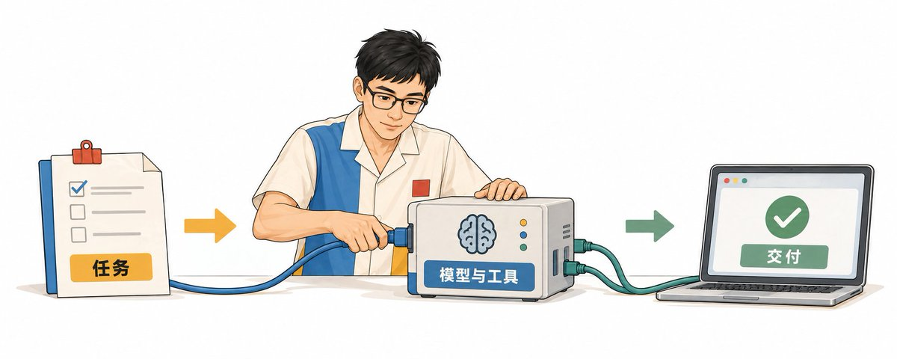
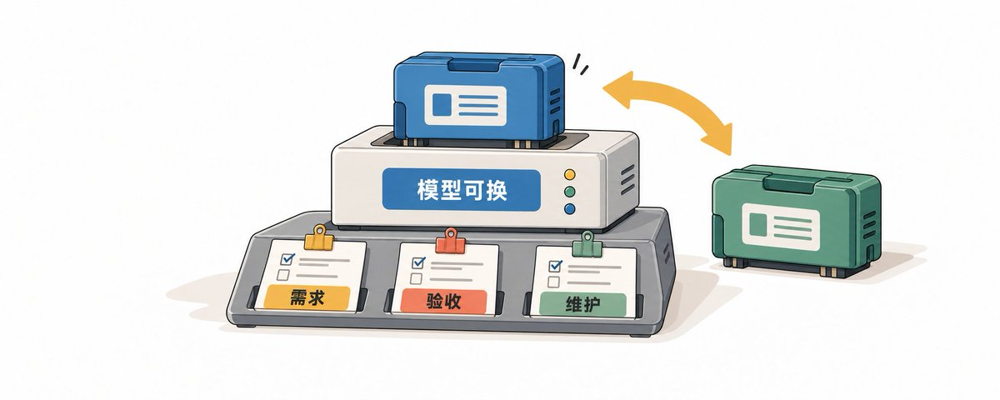
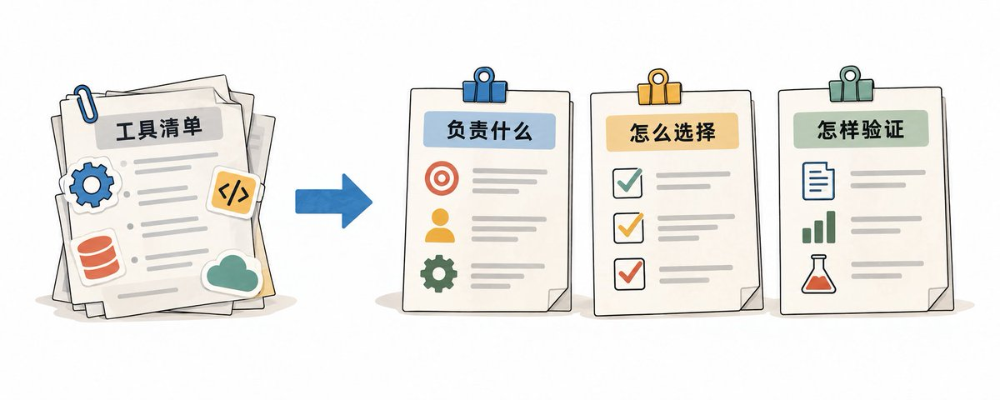
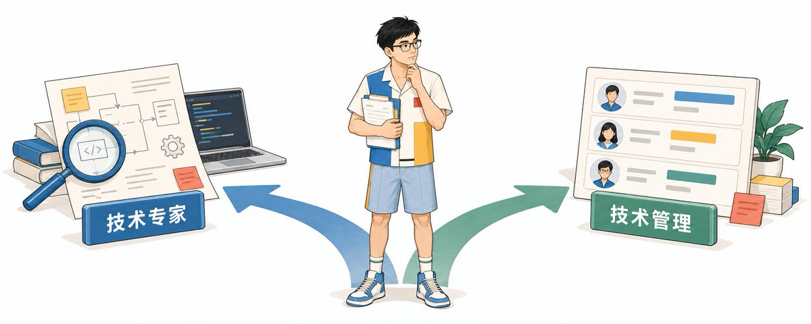
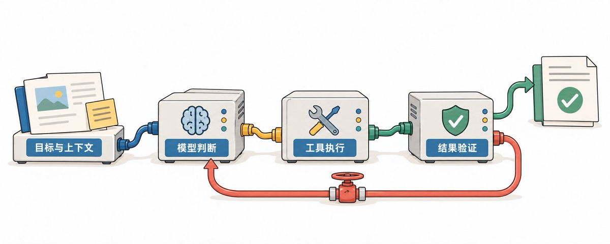
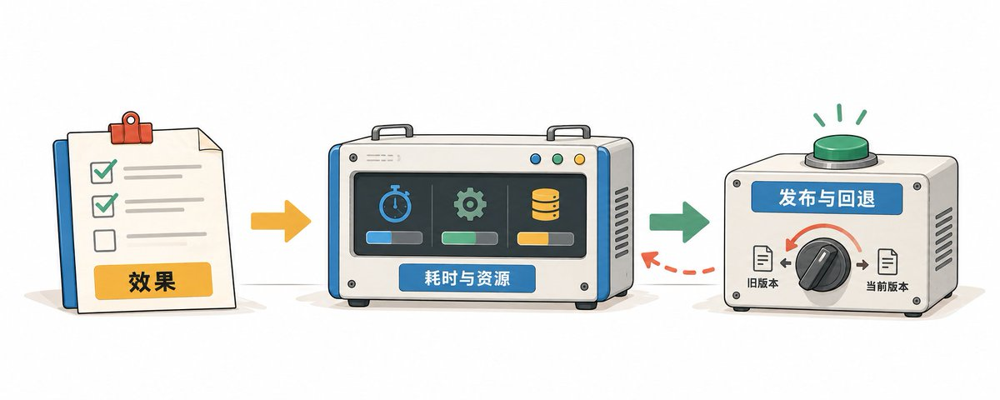
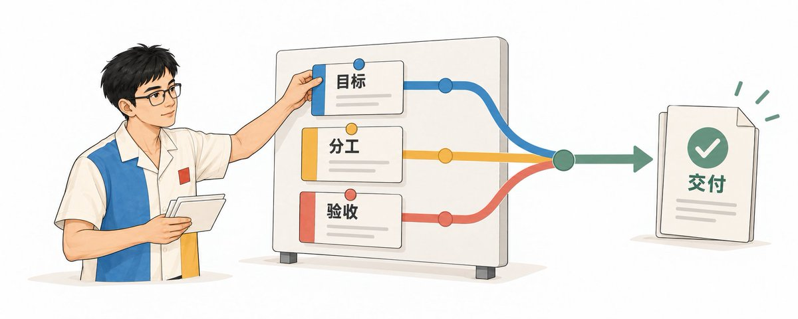
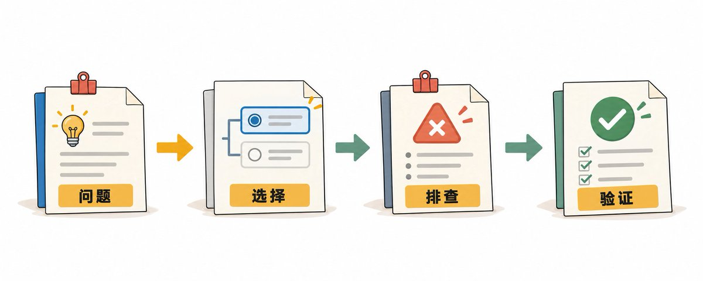
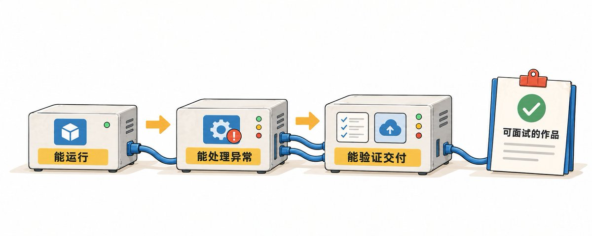
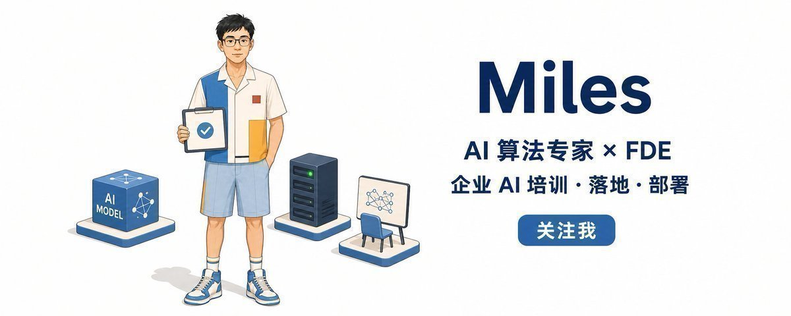

# 📰 AI 开发工程师面试指南

我之前面试过很多人，开发、算法、产品、运营都面过。坐在面试官这一边，看的不光是你会多少技术，还要判断你能接什么活、遇到问题怎么想，以及以后能不能承担更大的责任。

今天我就从面试官的视角，聊聊 AI 开发工程师怎么求职：简历怎样让人看懂你的能力，技术会被追问到哪一步，专家和管理两条路分别怎么准备，自己的项目又该怎么讲。

# 目录

1. AI 开发工程师，究竟是干什么的。

1. 为什么这个方向值得长期做。

1. 公司招人到底在算什么账。

1. 基础岗和高级岗，简历怎么准备。

1. 面试开场，先聊职业方向。

1. 专家路线，技术会被问到哪里。

1. 管理路线，项目和团队怎么考。

1. 怎样把自己的项目讲清楚。

1. 转型怎么学，拿什么去面试。

# 一、AI 开发工程师，究竟是干什么的

AI 开发工程师，就是把模型用到实际工作里，把它做成一个能用、能维护的软件产品的人。

比如让 AI 处理一封客户邮件，工作远不止生成一段回复。它得读懂客户在说什么，查到对应订单，按公司的处理规则给出建议；遇到需要退款的情况，还要走确认和审批。开发者要把模型、数据、业务接口和操作流程接起来，处理错误，检查结果，再让真实用户用上。

换个场景，让 AI 帮研发团队改代码。模型能生成代码，但项目怎么读取，允许改哪些文件，测试怎么跑，失败以后怎样继续，什么改动必须交给人审核，都需要开发。模型的能力只有装进这套系统里，才能变成大家每天用得上的东西。

所以这个岗位能做的事情很多：智能客服、业务助手、数据分析工具、自动化办公、编程助手、语音交互，还有接入图片和视频的应用。有些工作以软件开发为主，有些更偏模型部署和优化，有些要深入客户现场。具体叫什么，看公司的招聘习惯。Agent 工程师、大模型应用工程师、部分算法开发岗位，今天我都放在 AI 开发工程师这个范围里讲。

# 二、为什么我认为，这个方向值得长期做

前端往全栈走，后端要接更多产品工作，算法也越来越要负责模型怎么部署、怎么被用户使用。过去按职能分得很细的那套工作方式，在 AI 项目里正在被重新组合。

我说“前端已死”，说的是只守着原来那一小块、按需求写页面的路会越来越难走。单纯写接口、只在实验里把模型指标做上去，也有同样的问题。代码更容易生成以后，公司会继续问：这个需求有没有理解对，系统能不能上线，出问题有没有人接住。

我看好 AI 开发，原因就在这里。企业有很多工作可以借助模型改进，但从模型能做，到公司真的用起来，中间还有大量开发和交付工作。你得懂业务，也得懂软件，知道哪里值得交给模型，哪里应该由程序明确控制。

这份工作的机会，也不需要押在某个模型上。今天用这个模型，明天换另一个，需求澄清、数据接入、权限、验收和维护仍然要做。模型越强，可以尝试的任务越多，你的工作也会变化：原来花时间改提示词，后来可能更多时间用在复杂任务、系统连接和结果验证上。

这并不意味着任何一项技术都能一直吃老本。会用某个框架，可能很快变成普通技能；可你知道怎样判断问题、组织方案、验证结果，就比较容易跟着变化走。我更愿意把精力放在这种能力上。

当然，岗位名称不能保证机会。一个公司挂着 AI 开发的名字，实际上只让你搭几张演示页面，和一个需要接入真实业务、持续维护的岗位，能积累的经验差很多。求职时要看它准备让你做什么。

# 三、公司招人到底在算什么

找工作是双方互相选择。公司看你能创造什么价值，你也看这份工作能给你什么，合作值不值得。

站在公司的角度，招人首先要考虑收益。招一个人进来，能不能把业务往前推，减少返工、提高效率，或者解决原来没人能解决的问题？他的价值要覆盖用人成本，公司才有理由录用。

然后是这个人放在哪一层。基础岗位先把具体任务做稳，能独立工作的工程师可以负责一个模块，更高级的人要能做技术判断或带队交付。今天能接什么，往后还能接什么，这两件事我都会考虑。

基础岗位，我很看重靠不靠谱。任务不清楚会不会问，做不完会不会提前说，提交之前有没有检查，遇到错误会不会自己先排查。如果每次交给你的东西，最后都得别人重新做一遍，那技术词背得再多，团队也用不起来。

高级岗位就要看你带来的额外价值。你能开发，还能把需求问清楚，能让业务和技术对上，能帮团队省掉一次错误选择，这些都是价值。管理岗位还得看你怎样安排人、承担责任，让几个人一起把事情做完。

我不会只拿项目最后的结果判断一个人。有些项目公司资源足、方向好，参与者容易把结果全算到自己头上；也有些项目没做成，候选人却识别了关键问题，做过认真验证。我要拆出他自己的判断和贡献，再看换一个环境能不能继续用。

所以简历和面试，都要让人看见你做事的过程。你不能只给我一个“成功上线”，让我自己猜是谁做的、为什么做成。

# 四、简历分开准备：基础岗和高级岗

## 基础岗：先证明自己能干活、能学会

基础岗先看几个信号：有精力，状态稳定，遇事能处理，学得快。说得直白一点，身体好、心理素质强、学习能力强，但这些都要用工作经历来说明。

不用在简历写“本人身体健康”，也不用交代医疗隐私。我看的是你怎样持续完成工作、怎样安排任务，忙的时候还能不能保持质量。靠熬夜冲完一次，和能稳定交付，是不同的事。

“抗压能力强”也没有多少信息。你处理过一次需求变更，协调过一个卡住的接口，或者查清过一次反复出现的故障，把事情讲出来就行。困难是什么，你怎么做，最后怎样处理，这些能让我判断。

学习能力也要有证据。底子厚不厚，上手新东西快不快，知道去哪儿找资料，能不能把过去的知识带过来。原来做业务开发，第一次接模型服务，后来自己处理了超时、并发和输出校验，这就是可以写的学习过程。

项目经历，先说给谁解决什么问题，再写自己负责哪段、做过什么决定、最后怎样验证。不要写一整排工具，让人看不出你做了什么。

比如原来的写法是：“熟悉 Python、Agent 框架、数据库，参与 AI 客服开发。”如果你实际做过，可以写成：“负责客服助手的订单查询接口与任务记录，处理参数缺失、接口超时和重复请求，并补充对应测试。”后面每一件事都能继续问。

我会问：“超时发生在模型调用，还是订单服务？重复请求怎么判断？测试里放了哪些输入？”你能回答，我就知道这段活是不是你做的。回答不上来，也容易看出你只是跟着跑过一遍。

有个做大模型产品评测的候选人，工作涉及需求、题库、标注规则、数据验收。把这些事情连起来，他的价值就清楚了：把业务要求变成评测任务，再推动数据生产和交付。开发简历同样要找到自己的工作线。

个人项目可以写，课程作业也可以写，标清楚就行。没有真实用户，不要写服务多少用户；没有上线，不要写生产落地。你能拿出代码、测试记录和选择过程，已经比一份堆满大词的简历有用。

## 高级岗：写判断、积累和责任

高级岗位要看这些年留下了什么。技术专家积累的是解决难题的办法、选方案的判断和经过验证的技术经验；管理者还要有组织团队、安排资源、控制风险的能力。

你写“主导模型部署优化”，我会问：“原来慢在哪儿？谁定位的？有哪些方案，为什么选这一种？还有哪些任务没有改善？”写“带领团队完成项目”，我会问：“谁负责哪些部分？进度卡在哪儿？你改变过什么安排？”

高级简历只写职责，信息还是不够。要写你在什么条件下作了什么决定，带来什么结果，哪些办法能在新项目里继续使用。原来的经验有没有适用条件，也要说清楚。

数字尤其容易挖坑。“效率提升一倍”，到底是模型响应时间、员工处理时间，还是吞吐量？“准确率提高百分之二十”，从多少到多少、多少道题、怎样判对？从百分之五十到七十，是增加二十个百分点，相对增幅是百分之四十，别混着写。

管理岗位还要说清楚人的成长。你带过十个人，他们怎样分工，哪些人后来能独立负责，哪些关键工作原来依赖你、后来别人也能接？只写招聘了多少人、主持了多少次会议，看不出团队是不是被你带起来的。

简历最终要让我判断，把哪部分工作交给你合适。基础岗讲实际执行，高级岗讲判断和积累，管理岗再把人和责任交代清楚。

# 五、面试开场，我会先问职业方向

我通常先问，你以后想做技术专家，还是技术管理者。团队可能两种人都缺，我不会只因为你投了一个开发岗位，就只按一个方向考。

这个问题也不要求你当场定下未来十年。你可以说还在探索，但至少想过自己喜欢哪种工作：愿意钻进一个问题，反复试到技术上吃透；还是更愿意组织几个人，把目标、分工和交付管起来。

说想做专家，我会问最近哪项技术问题让你花过很多时间，怎么研究，做到什么程度。说想做管理，我会问最近一次合作卡住时，你有没有主动处理，怎样处理。过去的行为，比给未来贴一个标签可信。

两条路都要懂技术。专家也得合作，管理者也得判断方案，但后面的追问重点会不同。专家往细节深挖，管理者往项目、人和责任上追。

开场介绍也按这个思路准备。先说你现在做什么，哪段经历和岗位最相关，自己负责什么。如果你希望走专家路线，把最值得深聊的技术问题引出来；希望走管理路线，就说清参与人数、负责范围和交付责任。

别从大学专业一路讲到每一家公司，把时间用完了，面试官还没听到你的重点。你得先给我一个入口，我才知道怎么往下问。

# 六、专家路线：这些技术，你得知道自己懂到哪里

专家路线会问得细。下面这些问题，不需要每个基础岗位全部答到同一深度；但写进简历的部分，就要能讲出为什么这样做，试过什么，怎么验证。

## 1\. 编程和服务，先站得住

至少一门语言能独立开发。Python 常见，Java、Go 等原有经验也能继续用。数据结构、函数、异常、依赖管理、测试和调试是基本功，HTTP、数据库、异步任务和并发会直接影响应用能不能工作。

拿一个长任务来说，用户上传文件后要处理几分钟。如果你把全部工作堵在一个请求里，页面等超时了，后台还可能继续跑。你要知道怎样拆成后台任务，保存状态，让页面查进度，失败时怎样恢复。

面试会问：“任务跑到一半服务重启，怎么办？”这里要讲任务状态保存在哪儿，哪些步骤已经完成，重复执行有没有影响，恢复从哪里开始。只说加队列，还没回答完。

数据库也会问。“用户 A 查到了用户 B 的记录，可能哪里错了？”要检查查询条件、身份传递、缓存键和权限验证。你会写 SQL，还得知道每次查的是谁的数据。缓存只拿问题文本作键，用户相同的问法就可能互相串结果。

## 2\. 模型调用，要懂它实际给了什么

上下文窗口、token、采样参数、结构化输出、流式返回、工具调用，都会影响程序设计。token 是模型处理文本的单位，不等于一个汉字；输入和输出长度，也会影响费用、等待时间和资源。

“上下文足够长，是不是资料全部塞进去就行？”要看内容有没有用、关键条件有没有被干扰、处理时间能不能接受。容量够放和模型能正确使用，是两件事。

再比如，调用方需要订单号和处理类型。结构化输出能约束格式，程序仍要检查字段、值和业务含义。合法 JSON 里面也可能是错订单号，不能因为解析成功就继续操作。

我会问：“模型连续三次输出格式不对，怎么处理？”可以讨论结构化输出能力、字段校验、有限重试和明确失败状态。不能无限重试，也不能把坏结果悄悄当成正常数据往下传。

模型服务怎么换也会问。不同服务的工具调用、错误码、输出字段可能不同，你准备怎样适配？把调用层整理清楚，上面的业务逻辑才不用每换一次模型就改一遍。

## 3\. 上下文和状态，得分清楚

一次调用需要用户目标、当前规则、工具说明和相关结果。任务做长了，中间信息越来越多，你要决定什么保存、什么取出来、什么摘要，不能每轮都把所有历史原样发进去。

业务状态和模型能看到的上下文也不是同一个东西。订单已经提交，应该由业务系统记录；聊天摘要漏了一句话，不能让系统以为订单没提交，再做一次。

我会问：“对话压缩后，助手把已经做过的步骤又做了一遍，怎么查？”先看真实任务状态，再检查摘要和下一轮输入有没有保留已完成动作。重要事实应从可靠状态取，别只靠一段模型生成的摘要。

长期记忆同样需要范围。保存什么、谁能访问、什么时候更新、错误信息怎么更正，这些都得设计。把所有聊天都存起来，不等于系统就有了可靠记忆。

## 4\. 工具执行，最容易暴露工程水平

模型选择工具、生成参数，程序负责验证和执行。工具说明要让模型知道能做什么、需要什么参数、返回结果怎样读；权限、审批和执行限制则由系统控制。

“提交申请超时了，要不要重试？”先别急。可能申请已经生成，只是响应没回来。查执行状态、用请求标记防重复，或者让业务接口支持幂等，也就是重复请求不会反复产生同一项业务结果。

如果工具返回“无权限”，重新调用十次也不会变成有权限；如果只是临时不可用，可以有限重试。错误类型要分清，再决定补参数、重试、停止还是转人工。

“Agent 说完成了，你怎么确认？”查真实产物和执行结果。代码是否修改、测试是否通过、申请是否生成，都可以由程序检查。不能只拿最后那句回答当成功证明。

流程也要有停止条件：时间、轮次、费用、风险动作和人工确认。任务失败以后，是重试、恢复还是交给人，都要有安排，不能让它一直试下去。

多 Agent 也会追问为什么需要。任务能否分开、角色之间传什么、失败怎样定位、额外调用值不值。如果只是为了让架构图热闹，面试时很难往下讲。

## 5\. 效果怎么测，错误怎么查

先定义什么叫完成，再准备有代表性的任务。正常输入、缺信息、工具失败、越权请求、长任务都要考虑。每项测试要有判断标准，有些正确行为就是停下来请人补充信息。

别只报一个平均分。内容正确、任务完成、工具成功、等待时间和费用，对应不同问题。模型回复看着不错，但动作做错了，任务仍然失败。

我会问：“换模型后总分提高，但一类关键任务明显变差，怎么办？”得看这类任务的后果，是否暂停相关功能，是否分任务采用不同方案，再查失败原因。不能靠其他简单题的高分把问题盖过去。

每次比较都要保留模型、输入、关键配置和评测任务。拿不同题测不同版本，你很难知道进步来自改动，还是题目变容易了。用模型辅助评分可以，但需要清楚的标准和人工检查，尤其是重要错误。

线上排查得有执行记录。哪次模型调用、什么工具、哪个阶段耗时、返回什么错误，应该能沿任务查下去。记录也要控制权限和敏感信息，不能为了方便调试把用户数据到处打印。

## 6\. 部署与性能，不能只说跑起来了

调用外部服务还是内部部署，先看数据要求、资源、任务效果、费用和维护能力。模型选型要拿相同任务比较，看失败在哪类任务上，不能只按参数量或流行程度选。

内部部署涉及权重、运行开销、上下文和并发。KV cache 用来复用生成过程里的部分计算，也会占空间；因此模型单次能运行，不代表长输入、多用户同时使用时还能承受。

量化能减少部分存储和显存需求，效果与速度要实际测。用哪种精度、引擎支不支持、原来的任务有没有变差，都得交代。别给一个固定压缩比例，就当部署问题解决了。

“一个人用很快，多个人一起就慢，怎么查？”拆开看排队、模型开始输出前的时间、生成耗时和工具耗时，再看资源使用。可能要调并发、批处理、输入输出长度，也可能是某个同步调用阻塞。先定位，再决定加机器。

发布也有工程要求。配置和密钥怎样管理，服务如何健康检查，新版本如何小范围上线，异常怎样回退，模型服务不可用时怎样处理。容器能帮你统一运行环境，不能替你完成这些安排。

## 7\. 微调和模型原理，按岗位往深处准备

应用开发也要知道训练和推理的区别，预训练、监督微调、参数高效微调大致做什么。岗位涉及微调，就继续准备数据、损失、训练配置、验证和资源问题；涉及推理优化，就往模型结构和计算过程深挖。

LoRA 常用于参数高效微调，通常冻结原来的模型权重，训练额外的低秩参数来适应任务。学会跑脚本以后，还得知道任务为什么需要微调、训练样本怎样构造、有没有数据泄漏、怎样跟原模型比较。

我会问：“训练损失下降，业务效果却没提高，可能为什么？”要检查数据与目标是否一致、评测是否覆盖实际任务、是否过拟合、推理配置有没有变化。还得拿实际任务测，确认训练有没有用。

基础岗位可以明确哪些只学习过、哪些真的做过。专家岗位则要有自己挖得足够深的方向。你不必每项都精通，但不能所有问题都停在听过一个名词。

# 七、管理路线：项目和团队，两方面都要准备

## 项目：目标、选择和交付

我会问你，项目最开始的目标是什么，为什么值得做，有哪些限制，怎样确认完成。技术做得漂亮，业务没有人使用，或者双方根本没约定验收，都不能只写一句“项目成功”。

比如业务想一次上线十个功能，团队时间只够做一部分。你怎么选第一批，哪些功能可以延后，哪些风险不能带上去？要讲选择依据、影响和谁确认，不能只说协调各方、保证进度。

再问：“快上线了，关键接口还没到，你怎么办？”得看有没有替代办法，能否调整范围，时间怎么改，谁去沟通。靠一句大家辛苦一下，不会让缺失的接口自动出现。

项目准备至少要把需求、方案、依赖、风险、验收和维护讲清楚。你负责的是哪一段，哪项决定由你作出，出了问题你承担什么，都要落到事实。

## 团队：人怎么安排，怎么成长

团队部分，我会问多少人、分别做什么、谁可以独立负责、谁需要支持。人数是背景，真正要看的是你怎样把能力不同的人组织起来。

“新人连续两次延期，你怎么处理？”先检查目标是否明确、任务是不是超出能力、依赖有没有到位、检查节点是不是太晚。必要时缩小任务、安排支持，再看他后面能不能独立完成。每次替他重写，项目暂时过去了，培养问题还在。

技术专家线和项目线也要协调。专家要保证关键技术判断，项目负责人要保证跨角色推进。小团队不一定设置两套岗位，但这两类责任得有人接，不能所有事都等一个人拍板。

管理者还要讲一次真实分歧。大家争的是什么，你依据什么决定，谁不认同，决定以后如何执行，后面有没有发现自己判断错了。只讲团队气氛好，听不出你有没有处理过困难。

最后看交接和培养。你离开一周，项目还能不能继续，关键方案有没有记录，新人有没有成长？高级岗位的责任里，包括让工作能够持续进行。自己很强，和能带出一支能工作的团队，需要分别证明。

# 八、自己的项目，至少要讲清楚这些事

面试前，把项目按一条线重新整理：为什么做，当时有什么条件，自己负责什么，作过哪些选择，遇到哪些错误，怎样验证，后来留下什么。

先用几句话讲全貌，再挑关键决定展开。别把所有技术名词一次倒出来，也别把团队半年干的活全算到自己身上。面试官需要先知道你的位置。

一个技术问题值得准备三层。第一层，做了什么；第二层，为什么这样做、有哪些替代方案；第三层，条件变了怎么办。比如任务原来串行执行，后来加并发，为什么加，结果怎样，工具限流后又怎么处理。

项目也准备两个重点：一个你做得扎实的技术决定，一个没有顺利完成的问题。失败不用包装成成功，要讲怎样定位、怎样处理、哪些仍然没解决。面试官从这里能看到你的判断有没有经过实际工作。

你说代码主要由 AI 写，也没问题。我会选一段关键逻辑让你解释，或者改一个条件。原来只支持一个用户，现在增加用户隔离，数据库、缓存和任务状态分别要改哪里？能讲清楚，也能继续改，我才相信你掌握了项目。

遇到没做过的问题，就说没做过，再讲准备怎么查。把猜测和验证过的结论分开。专家也不可能什么都懂，但他通常知道怎样缩小问题、找到证据。

管理经历则分别准备项目材料和团队材料。项目讲目标、选择、风险和验收，团队讲人员、分工、支持和成长。不要用同一句“带领团队完成交付”把两边都略过去。

如果项目是个人练习，可以拿需求说明、代码、运行说明、评测和失败记录来聊。模拟业务就说模拟业务，用公开数据就说公开数据。材料越真实，越容易把追问接下去。

# 九、转型怎么学，学完拿什么去面试

先看目标岗位的任务，再决定学习顺序。应用开发、模型部署、推理优化、客户交付，需要的深度不同。把岗位要求拆成自己已经能做的、需要补的、暂时用不到的，别一上来买一套什么都讲的课。

有开发经验，继续用原来的服务、数据、测试和运维基础，补模型交互、任务执行与评测。原来做算法，就把模型以外的系统和交付接起来。做测试、数据或产品，也有能迁移的经验，但开发岗需要的编程和工程能力仍然得补。

完全没有编程基础，先独立做一个小服务，学会读代码、调试、接数据库和处理异常。可视化平台适合快速理解流程，后面要能看懂它怎样执行，遇到限制也能自己补。

项目选小一点，但做完整。比如做一个邮件处理助手，用模拟邮件和模拟订单接口，练分类、信息提取、订单查询和人工确认。范围清楚，容易反复测，也能自然考到上下文、工具、权限和状态。

第一版先把服务跑起来，第二版加入工具和异常处理，第三版补评测、任务记录和部署。再换一组条件：接口超时、重复提交、模型输出错误、多个用户同时使用。每次改动记录原因和结果，后面讲项目就有证据。

课程也按这些产出来挑。有没有编程基础、真实接口、错误处理、评测和部署，作业是否有人反馈？讲了很多名词，却只有老师演示跑成功，你还得自己做独立练习，才知道有没有学会。

不要把所有方向一起学。先围绕一个目标岗位做出能解释、能修改、能测试的项目，再补缺口。投递以后把追问记下来：哪段贡献说不清，哪项技术理解浅，哪里缺验证，下一轮就补哪里。

到了面试，最有用的准备，还是把手里的东西吃透。你为什么这样做，自己真正做了哪部分，换一个条件还会怎样做。这些讲明白，我才知道你现在能接什么，也才看得出以后值得把什么交给你。

---

我是 Miles，一名从大厂转型 FDE 的 AI 算法专家，做过算法研发、优化部署，也做过企业培训、落地交付。我 X 一个月做到 2 万粉，一周写出三篇百万曝光长文，其中两篇超过 200 万。

关注我 [@miles\_mazy](https://x.com/miles_mazy)，一起成长，一起赚钱。

### 🖼️ Attached Media

