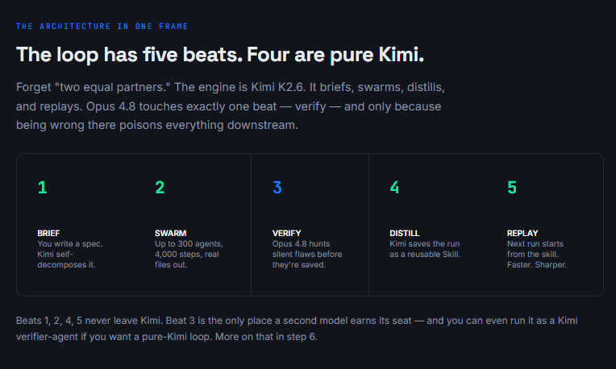
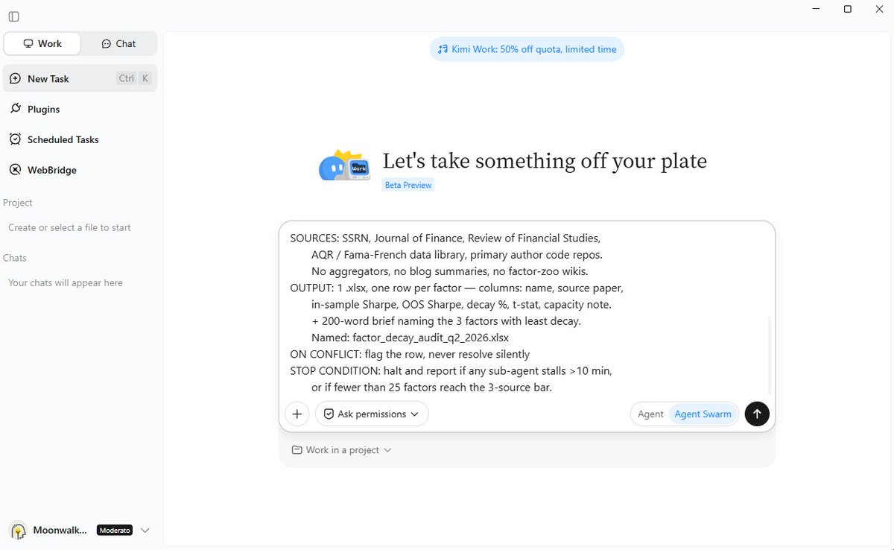
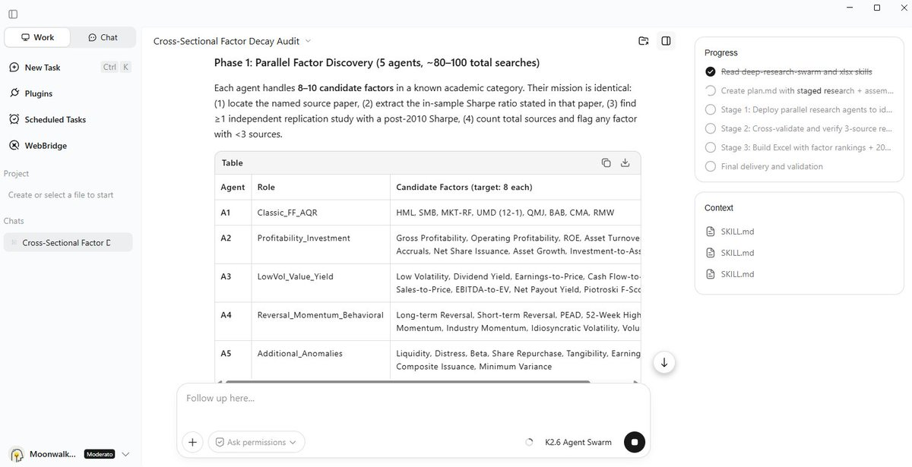
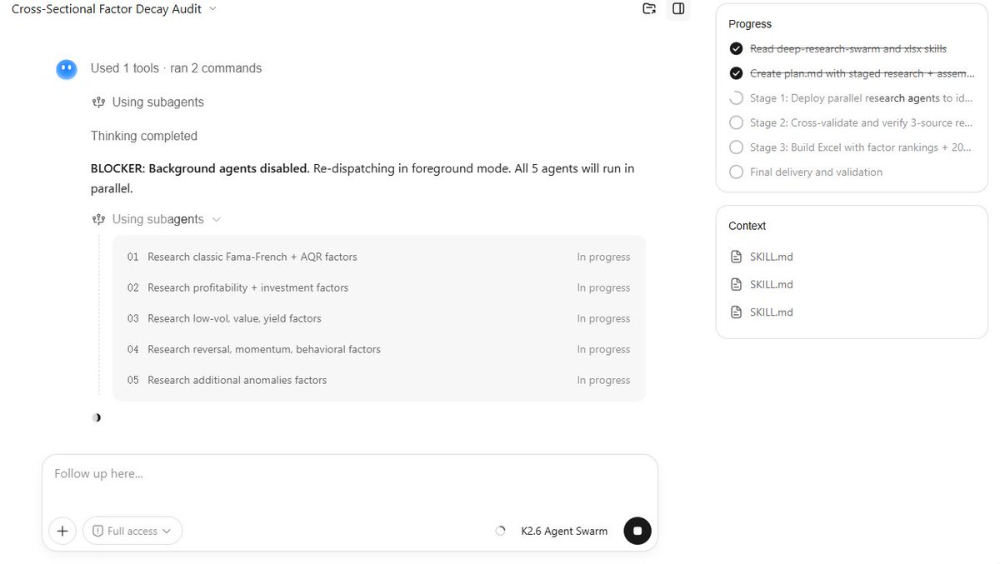
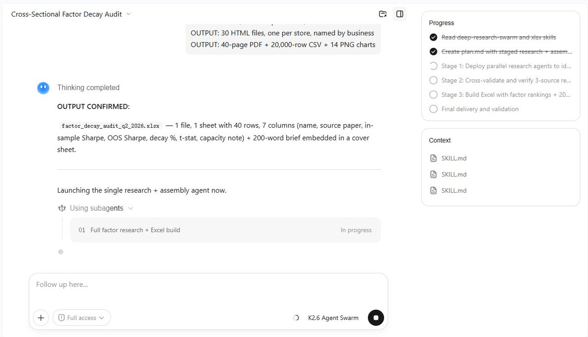
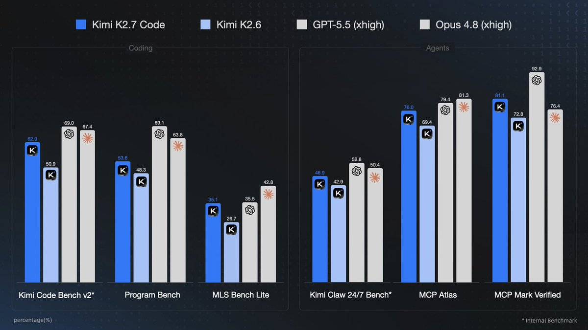
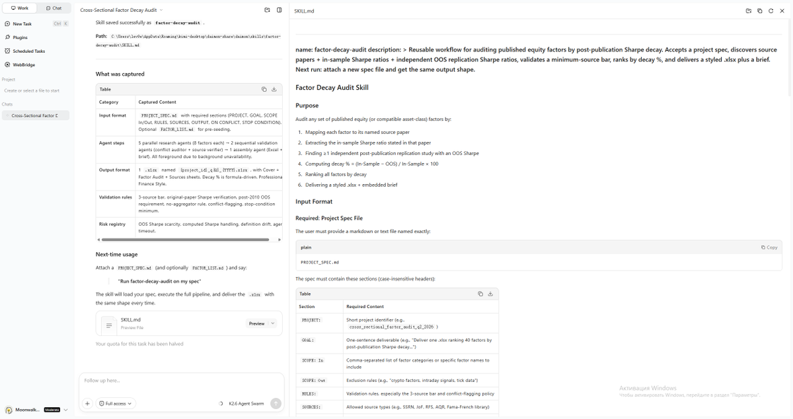
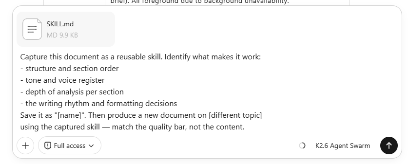
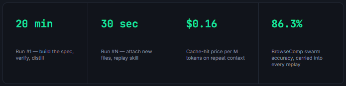
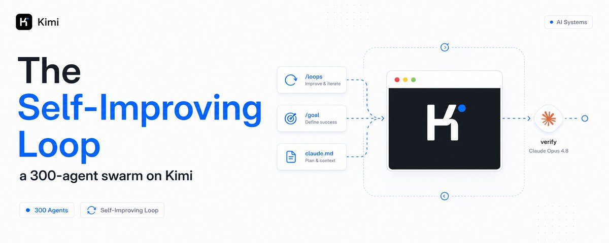

# 📰 The Self-Improving Loop: a 300-agent swarm on Kimi K2.6, verified by Opus 4.8

A free open-source model is running 300 parallel agents across 4,000 coordinated steps from a single prompt, and it scores higher on real research tasks than models you pay 5x more for.

Most people have never opened it.

They open Kimi, type a question, get an answer, close the tab. That's the chatbox. It works. It's also about 10% of what the product does.

> Here's the part most people skip: 

The swarm doesn't just run fast. Run it right and it leaves something behind every time - a reusable skill, a sharper spec, a constraint that stops the next run from repeating today's mistake. 

The swarm that ran your task yesterday should be smarter than the one running it today.

[Embedded Tweet: https://x.com/i/status/2047190578493096122]

That's the loop. Kimi does the work and the learning. Opus 4.8 sits at one gate - the verify gate - and its only job is to stop garbage from getting saved as a skill. The engine learns. The closer keeps it honest.

Some people pick one model and marry it. Some chase the top benchmark line. Others wire up LangGraph and spend a weekend debugging a DAG. 

The result is usually the same: a workflow that does the exact same thing on run #50 as it did on run #1.

This is not that. This is the complete playbook for a swarm that compounds. 10 steps. Every prompt is copy-paste. Every number is verified.

---

Part 1 - Build the loop once. Run it forever.

## 01\. Write a spec, not a prompt

When most people hear "300 agents" they fire off a one-liner -"research the fitness app market" - and expect brilliance. That's the fastest way to burn credits and get junk. 

A one-line prompt gives the swarm permission to decide everything, and it will decide wrong.

Treat the swarm like a contractor, not a genie. A spec defines what to collect, what counts as valid, which sources are allowed, the exact output format, and what to do on conflict. Here's the part most people skip: Kimi decides the decomposition itself.

 You don't build the agents like you would in CrewAI, you don't wire the graph like LangGraph, you don't define structure like AutoGen. You describe the goal - the swarm builds the org chart.

The spec is the single highest-leverage artifact in the whole loop, because in step 4 it becomes the seed of your reusable skill.

\`\`\`python
\# PROJECT: \[name\]
GOAL: \[one sentence — the deliverable, not the topic\]
SCOPE: \[what's in, what's explicitly out\]
RULES: \[validation — what counts as a verified row/finding\]
SOURCES: \[official posts, papers, primary only — no aggregators\]
OUTPUT: \[file type / count / naming / format details\]
ON CONFLICT: flag the row, never resolve silently
STOP CONDITION: \[when to halt and report instead of guessing\]
\`\`\`

---

## 02\. Read the decomposition plan before you spend a cent

This is the step first-timers skip, and it's the most expensive one to skip. 

After you submit the spec, Kimi shows you the execution plan before it runs - how many sub-agents, what each handles, the dependency order, the step budget.

Read it. A 200-agent swarm decomposed wrong costs real money and real hours. Checking the plan costs nothing. You're looking for three things: does it understand the scope, is the agent count sane for the task size, and does the output plan match what you actually need.

One detail worth knowing: the 4,000 steps is a total coordinated budget across the swarm, not 4,000 steps per agent. A 300-agent run averages \~13 steps each - short, specialized subtasks. That tells you whether your task fits the shape.

\`\`\`python
Show me the proposed decomposition before running:
\- how many sub-agents, and what each one handles
\- the dependency order (what blocks what)
\- estimated step budget
\- where the biggest quality-drop risk sits
Do NOT execute yet. Wait for my confirmation.
\`\`\`

A one-line prompt is a wish. A spec is an order. The swarm executes orders.

---

## 03\. Let it be wasteful - that's the point

Now you run it. Up to 300 sub-agents fire in parallel waves. The first wave handles fully independent subtasks. 

As results land, the orchestrator launches the next wave on whatever depended on them, until the dependency graph resolves.

Each sub-agent works in its own bounded context window. That's the structural trick: a single agent on a long task fills its window until it drowns and starts lossy summarization, and every reasoning step after that gets worse. 

The swarm gives each subtask its own scoped context, so only structured output flows back to the coordinator. That's why it doesn't collapse on tasks that break a single agent.

Because Kimi runs at $0.95/M in and $4.00/M out - with cache hits at $0.16 - you can afford to throw the first attempt away and run it again. Cheap volume changes what you're willing to attempt.

\`\`\`python
Execute the spec end to end.
Parallelize wherever the plan allows.
Report progress every 30 steps.
Flag any blocker immediately — do not work around it silently.
If a sub-agent stalls &gt;10 min, reassign or report.
Merge everything into the OUTPUT defined in the spec.
\`\`\`

---

## 04\. Demand real files, not a chat answer

The output of a swarm is not text in a window. It's structured deliverables that go straight into your work - and this is the part most articles miss. 

One run lands PDFs, spreadsheets, datasets, slide decks, and working code, all from a single launch, because Kimi emits those formats natively.

> So lead the spec with the output, always.

 "A comprehensive report" gives agents permission to stop early. "A 40-page PDF + one CSV with 20,000 rows + 14 export-ready PNG charts" gives them a quality target to hit. 

Specificity at the output level is the difference.

\`\`\`python
OUTPUT: \[file type\] / \[count\] / \[naming\] / \[format detail\]

\# strong examples:
OUTPUT: 1 .xlsx, one row per model, + 200-word brief
OUTPUT: 30 HTML files, one per store, named by business
OUTPUT: 40-page PDF + 20,000-row CSV + 14 PNG charts
\`\`\`

---

## 05\. Point the honest model at the output and ask what's wrong

Here's the one beat that isn't Kimi. The swarm's known flaw: unless you explicitly demand verification, it produces confident, under-cited claims, and independent sub-agents sometimes contradict each other. "Looks done" and "is correct" are different planets.

Opus 4.8 is built for exactly this gate. Anthropic reports it's roughly 4x less likely than 4.7 to let a flaw in its own code pass unremarked, and it's the first Claude to score 0% on uncritically reporting flawed results. 

Its only job here is to refute, not to praise. You're not paying premium tokens to generate - you're paying them to catch the silent flaw before step 4 saves it into a skill forever.

Cheap volume is only a superpower when something trustworthy is checking the work. Keep the verify gate.

---

## 06\. Save the whole workflow as a Skill

This is the beat that makes the loop self-improving. After a run you'll repeat, tell Kimi to capture the entire workflow as a reusable Skill - input format, agent steps, output format. 

The first run takes 20 minutes. Every run after it takes 30 seconds.

That's the honest version of "self-learning." The model isn't retraining its weights between your runs. 

The system around it is getting smarter - your skill library grows with every project, and every future swarm applies those skills automatically. 

A competitor can't copy that library in a week. It's built from months of your real runs.

\`\`\`python
Save this entire workflow as a reusable Skill: "\[name\]"
Capture:
\- input format (what files / spec shape it expects)
\- the agent steps that worked
\- the output format and naming convention
\- the validation rules from the spec
Next time I run this, I attach new files and get the same shape.
\`\`\`

---

## 07\. Feed your own documents in as swarm knowledge

Skills capture process. Document-to-Skill captures domain. Upload your best work - a closed-deal proposal, a polished report, a deck - and Kimi captures its structural and stylistic fingerprint as a skill every future swarm applies automatically.

Here's where it compounds: every PDF, transcript, or spreadsheet you feed in becomes context that all 300 parallel agents can ground against, instead of falling back on general training data. 

The more you feed it, the more accurate every subsequent run becomes. Reports stop reading like generic AI and start reading like your work.

\`\`\`python
Capture this document as a reusable skill. Identify what makes it work:
\- structure and section order
\- tone and voice register
\- depth of analysis per section
\- the writing rhythm and formatting decisions
Save it as "\[name\]". Then produce a new document on \[different topic\]
using the captured skill — match the quality bar, not the content.
\`\`\`

---

## 08\. Turn the verify feedback into a permanent rule

Step 5 catches a flaw once. Step 8 makes sure the swarm never makes it again. Take Opus's fix list and don't just patch the output - bake the lesson into a project-level constraints file Kimi reads automatically at the start of every session.

This is the loop learning from its own failures. The drift that Opus flagged on run #1 becomes a hard rule on run #2. 

Over a few projects, your constraints file turns into living documentation that enforces itself - and the verify gate has less and less to catch each time.

\`\`\`python
\# CONSTRAINTS.md — loaded automatically
\- every claimed figure must trace to a primary source or be flagged
\- no silent conflict resolution — surface contradictions
\- \[rule distilled from last run's Opus feedback\]
\- \[the mistake you never want repeated\]
Scope-lock: do not touch anything outside the spec's SCOPE block.
\`\`\`

---

## 09\. Replay the skill on new inputs - watch the cost collapse

Now the payoff. Run #2 doesn't start from zero. It starts from the skill, the swarm knowledge, and the constraints file you built in steps 6–8. 

Same workflow, new files, a fraction of the setup.

This is where "compounding" stops being a buzzword and shows up on the invoice. The first competitive-monitoring run takes a full spec and a verify pass. 

The fourth one is a 30-second prompt against the saved skill, and the output is sharper because it inherits every fix from the runs before it.

\`\`\`python
Run the saved skill "\[name\]" on these new inputs.
Apply CONSTRAINTS.md. Use the captured output format.
\[attach new files\]
Report only deviations from the skill's expected shape.
\`\`\`

20 minutes on run one. 30 seconds on run fifty. That gap is the whole reason to build a loop instead of a prompt.

---

## 10\. Promote the loop to a background agent

The final move: once a loop is stable and skill-backed, you stop launching it by hand.

 Point Kimi at the trigger - a schedule, a new file drop, a competitor's pricing page - and let it run the whole loop proactively, surfacing only the deliverable and the deviations.

> Competitive monitoring is the clean example. 

Run #1 you build and verify by hand. By the time it's a background agent, it's checking every competitor in parallel weekly and dropping a brief in your inbox at zero marginal time cost. 

The only human left in the loop is the question you set and the decision you make on the answer.

\`\`\`python
Run skill "\[name\]" on a weekly schedule.
Trigger: \[schedule / new file / monitored URL\]
On each run: execute the swarm, apply CONSTRAINTS.md,
verify, then deliver the OUTPUT + a diff vs last run.
Only ping me if a deviation crosses \[threshold\].
\`\`\`

---

## Conclusion: 

While the closed labs keep shipping one smarter chatbot at a time, an open model is running 300 agents in parallel - and getting smarter at the system level with every run you give it.

We've seen this exact fingerprint once already. An open release reframes what the closed frontier thought it owned, and the whole field recalibrates overnight. It happened with DeepSeek.

 A self-learning swarm on an open-weight model has the same shape.

The builders still arguing about which model "won" are answering a question that stopped mattering. 

The question now isn't which model is smartest. It's how many you can run at once, who's checking their work, and whether your setup is sharper today than it was yesterday.

Most people will read this and keep using Kimi as a chatbox. A few will build the loop this week. The first run takes 20 minutes. Every run after that is leverage you own.

Build it. Verify it. Distill it. Then watch it get cheaper and sharper every single time you run it.

### 🖼️ Attached Media

## 💬 Replies

### 1 @0xCodez (Codez)

*Wed Jun 17 17:27:43 +0000 2026*

@0xMovez Wow, really great article, Movez! I use Kimi daily for building.

### 2 @0xMovez (Movez) (Author)

*Wed Jun 17 17:28:40 +0000 2026*

@0xCodez Thanks, Movez, I really appreciate your support.

### 3 @zodchiii (darkzodchi)

*Wed Jun 17 17:04:20 +0000 2026*

@0xMovez This is fire !

### 4 @0xMovez (Movez) (Author)

*Wed Jun 17 17:06:17 +0000 2026*

@zodchiii Thank you, Zodchi! Your posts were amazing as well. By the way, are you building your own loop?

### 5 @adiix_official (AdiiX)

*Wed Jun 17 17:06:07 +0000 2026*

@0xMovez Wow Kimi look very good , save this

### 6 @0xMovez (Movez) (Author)

*Wed Jun 17 17:07:07 +0000 2026*

@adiix\_official Kimi is always shipping high-quality alpha. Are you using Kimi at work, bro?

### 7 @Av1dlive (Avid)

*Wed Jun 17 17:03:23 +0000 2026*

@0xMovez This is cool

### 8 @0xMovez (Movez) (Author)

*Wed Jun 17 17:04:31 +0000 2026*

@Av1dlive Thank so much for you support bro. Btw are you using Kimi ?

### 9 @gippp69 (Gipp 🦅)

*Wed Jun 17 17:14:47 +0000 2026*

@0xMovez Kimi looks very good here

### 10 @alphabatcher (Alpha Batcher)

*Wed Jun 17 18:04:39 +0000 2026*

@0xMovez great article broski

we together dropped article about Kimi k2.6 today

### 11 @gerardsans (Gerard Sans | Axiom 🇬🇧)

*Fri Jun 19 13:42:40 +0000 2026*

@0xMovez Breaking:

### 12 @me_cool_off (me_cool_off)

*Wed Jun 17 17:45:08 +0000 2026*

@0xMovez Kimi is definitely worth checking out, thanks

### 13 @KanikaBK (Kanika)

*Fri Jul 10 11:23:51 +0000 2026*

@0xMovez This is a good example of how workflow design can unlock far more capability from open-source models.

### 14 @nanko1goatit (nanko 🧈)

*Tue Jun 23 07:38:46 +0000 2026*

@0xMovez @Butter4sol

### 15 @PixelRainbowNFT (PixelRainbow (33.3%))

*Fri Jun 19 02:57:12 +0000 2026*

who is building this?  this should be a deterministic repeatable process that can be engineered once, and re-usable by all, not just the creator.  A lot of guidance out there about building loops. I've built 4-5 myself. they work. we get it..but eager to see someone build the apparatus once and for all, and accessible to anyone.

### 16 @exploraX_ (m0h)

*Fri Jun 19 07:09:09 +0000 2026*

@0xMovez i still don't get why looping as been a major major trend on the tl of recent. 

looping as always been a part of agentic LLMs from the beginning

### 17 @thejayden (Jayden ⛩️)

*Wed Jun 17 20:40:56 +0000 2026*

@0xMovez Thanks for putting all the hard work Movez to write these articles. Really helpful

### 18 @PunkXBT_ (PunkXBT)

*Sat Jul 25 03:44:00 +0000 2026*

@0xMovez agents improving agents is the part that gets really interesting the loop is where things start getting weird fast

### 19 @snskritinaruka (Sanskriti Naruka)

*Wed Jun 17 18:31:50 +0000 2026*

@0xMovez Great article

### 20 @HeyYoGB (GBE)

*Thu Jun 18 20:26:17 +0000 2026*

@0xMovez kimi on top

### 21 @heyrohitai (Rohit)

*Thu Jun 18 04:42:07 +0000 2026*

@0xMovez Absolutely! It's all about the journey and the skills we gain along the way. Cheers to that!

### 22 @0xRicker (Ricker)

*Wed Jun 17 19:16:51 +0000 2026*

@0xMovez thanks for this alpha Movez, i gonna read it now

### 23 @andrew_dryga (Andrew Dryga)

*Thu Jun 18 02:58:15 +0000 2026*

@0xMovez Tired of getting spammed about all those AI-generated articles that mention Peter and Boris to sell loops? Me too. Here is a tool instead [github.com/AndrewDryga/co…](https://github.com/AndrewDryga/coop)

### 24 @devloperhs (harsh)

*Thu Jun 18 07:28:41 +0000 2026*

@0xMovez Does this approach works for any agent with subagents access - as this is a loop ? 

I generally use claude code and follow few of these principles , cursor already have a harness inbuilt, so I just tweak system prompt.

### 25 @Sobraniex1 (Sobraniex 🇪🇺)

*Fri Jun 19 16:56:33 +0000 2026*

@0xMovez @grok composer 2.5 fast could do it bruv.

### 26 @alkaidy2025 (DeDi)

*Tue Aug 11 05:32:18 +0000 2026*

@0xMovez 图工程让单人顶一个团队，工程方式确实在重构

### 27 @jenshnielsen (Jens H. Nielsen)

*Thu Jun 18 10:33:04 +0000 2026*

@0xMovez Sure it’s cool, but I would like to see the bill for that. What does it cost ?

### 28 @wangleineo (Gilfoyle)

*Mon Jun 22 14:08:14 +0000 2026*

@0xMovez So it is basically model ensembling. What kind of task would require 300 sub-agents, I wonder?

### 29 @kiruwaaaaaa (kiruwaaaa)

*Wed Jun 17 17:49:41 +0000 2026*

@0xMovez awesome article bro!
im gonna bookmark that

### 30 @SvenMeyer (Sven Meyer)

*Fri Jul 24 13:31:04 +0000 2026*

@0xMovez A month old now (LOL), but super helpful !
Surely with Kimi 3 everything will be even better

### 31 @kilo_cpa (kilo)

*Fri Jun 19 06:05:08 +0000 2026*

@0xMovez Useful info as always bro

Bookmarked

### 32 @storn_max (369)

*Tue Jun 23 02:39:31 +0000 2026*

@0xMovez Tell me the real job. What deliverable are you trying to produce, how often, and what goes wrong today? 

Then I can place you on the matrix instead of building a spaceship for a grocery run.

### 33 @keithofaptos (keithofaptos)

*Fri Jun 19 19:38:55 +0000 2026*

@0xMovez @grok GitHub repo? Who's the Chinese researcher dev?

### 34 @thecryptiquebro (Parth)

*Fri Jun 19 13:54:38 +0000 2026*

@0xMovez [x.com/thecryptiquebr…](https://x.com/thecryptiquebro/status/2067365353051848765?s=20)

