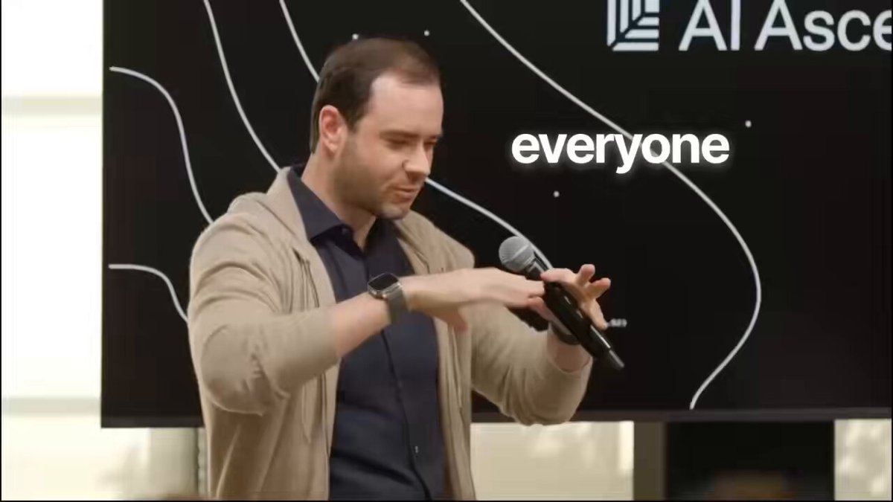

Andrej Karpathy:

“Vibe coding is incredible. But agentic engineering is the next level. 

90% of my coding routine is automated by AI agents.”

In this 30-minute talk, Andrej Karpathy explains how to build an AI agent workflow from scratch.

Worth more than 500$ agentic engineering course on the internet.

Watch it today, then read the article below.

### 🖼️ Attached Media

## 💬 Replies

### 1 @algomizercom (Algomizer | LLM Optimization)

*Mon Jun 08 17:40:33 +0000 2026*

@0xMovez Andrej made the surface and the medium that we are optimizing for today! full-circle moment

### 2 @vesmallu (Ve)

*Wed Jun 10 02:30:31 +0000 2026*

@0xMovez "Your 90% isn't my 90%. You literally built the stack."

### 3 @alphabatcher (Alpha Batcher)

*Mon Jun 08 14:23:38 +0000 2026*

@0xMovez let's be honest bro

Andrej Karpathy definitely says only smart things

### 4 @0xMovez (Movez) (Author)

*Mon Jun 08 14:25:50 +0000 2026*

@alphabatcher Yeah true bro. Andrej shipping real alpha. This agentic share is amazing

### 5 @Av1dlive (Avid)

*Mon Jun 08 14:48:53 +0000 2026*

@0xMovez This is nice

### 6 @0xMovez (Movez) (Author)

*Mon Jun 08 14:55:47 +0000 2026*

@Av1dlive Thanks Avid. Btw are you using coding agents

### 7 @HarryTandy (Harry Tandy)

*Mon Jun 08 18:23:10 +0000 2026*

@0xMovez vibe coding got lazy, agents do real work

### 8 @0xMovez (Movez) (Author)

*Mon Jun 08 18:24:07 +0000 2026*

@HarryTandy Yeah. True esp if you know how to build dynamic workflows. That’s real banger feature

### 9 @insomnia_vip (Insomnia)

*Mon Jun 08 14:32:11 +0000 2026*

@0xMovez I saved al his lecture bro

### 10 @0xMovez (Movez) (Author)

*Mon Jun 08 14:39:40 +0000 2026*

@insomnia\_vip Thanks bro. Btw are you using coding agents yourself ?

### 11 @zodchiii (darkzodchi)

*Mon Jun 08 14:23:18 +0000 2026*

@0xMovez banger

### 12 @0xMovez (Movez) (Author)

*Mon Jun 08 14:24:05 +0000 2026*

@zodchiii Thanks bro. Really useful watch in my opinion and amazing article

### 13 @Dexoryn (Dexoryn)

*Mon Jun 08 14:20:33 +0000 2026*

@0xMovez Always useful, Thanks @0xMovez

### 14 @0xMovez (Movez) (Author)

*Mon Jun 08 14:22:02 +0000 2026*

@Dexoryn Thanks bro. Btw are you using coding agents in your coding setup ?

### 15 @Serantych (sunick)

*Mon Jun 08 14:30:06 +0000 2026*

@0xMovez bookmarked before I even finished reading

### 16 @0xMovez (Movez) (Author)

*Mon Jun 08 14:39:21 +0000 2026*

@Serantych Thanks bro. Hope it will be a useful watch for you

### 17 @Rubikx_ai (Rubikx)

*Mon Jun 08 14:56:49 +0000 2026*

@0xMovez agentic engineering is the next level fr. Karpathy never misses bro

### 18 @0xMovez (Movez) (Author)

*Mon Jun 08 15:16:46 +0000 2026*

@Rubikx\_ai thanks bro ! are you using coding agents in your daily work ?

### 19 @ziwenxu_ (Ziwen)

*Mon Jun 08 21:01:05 +0000 2026*

@0xMovez Nice one!!

Love karpathy

### 20 @RAFA_AI (RAFA Finance)

*Tue Jun 09 03:15:37 +0000 2026*

@0xMovez Vibe coding died quite a while ago. Why do it yourself when it's already built for you?

### 21 @ihteshamali (Ihtesham Ali)

*Mon Jun 08 16:11:45 +0000 2026*

@0xMovez Agentic engineering means AGI and we are not going to witness it in the next 5 to 10 years.

### 22 @adiix_official (AdiiX)

*Mon Jun 08 14:44:18 +0000 2026*

@0xMovez Bookmark , and time to watch

### 23 @kar4arodon (karcharodon)

*Mon Jun 08 17:22:26 +0000 2026*

@0xMovez Bro you nailed it keep it up

### 24 @ajs6888 (安叫兽|Bird🕊️ 🔶 BNB)

*Tue Jun 09 00:42:30 +0000 2026*

@0xMovez 听起来像从写代码变成带实习生了

### 25 @Argona0x (Argona)

*Mon Jun 08 20:28:20 +0000 2026*

@0xMovez good video about agents

bookmarked for sure

### 26 @2ctv (Emmy)

*Tue Jun 09 10:23:43 +0000 2026*

@0xMovez karpathy always makes it sound too easy lol bruh serrrrrr

### 27 @gerardsans (Gerard Sans | Axiom 🇬🇧)

*Mon Jun 08 21:03:21 +0000 2026*

@0xMovez [x.com/gerardsans/sta…](https://x.com/gerardsans/status/2063977910327709820)

### 28 @420blazeitbro (SplitDaWig 🪴)

*Mon Jun 08 19:20:07 +0000 2026*

@0xMovez Bookmarked and already had grok write up an .md with what it learned

### 29 @Hrundel75 (Hrundel75 🐷)

*Tue Jun 09 08:31:53 +0000 2026*

@0xMovez great article

### 30 @Crypto_Briefing (Crypto Briefing)

*Mon Jun 08 14:59:02 +0000 2026*

@0xMovez [x.com/Crypto\_Briefin…](https://x.com/Crypto_Briefing/status/2063983555823235194)

### 31 @josesilesdata (José Siles | AI | Data)

*Tue Jun 09 09:02:51 +0000 2026*

@0xMovez Karpathy diciendo que el 90% de su rutina está automatizada por agentes es la mejor validación del cambio que está pasando. Obligatorio ver esto.

### 32 @quroolarc (qurool)

*Mon Jun 08 14:50:12 +0000 2026*

@0xMovez bookmarked, interesting things

### 33 @aiseomastery (AI Mastery Guide)

*Mon Jun 08 23:20:38 +0000 2026*

@0xMovez 90% automated and Karpathy is still the one saying it... that number hits different coming from him

### 34 @Granite0x (Granite)

*Mon Jun 08 20:55:26 +0000 2026*

@0xMovez this guy is the reason I have a few agents now

he knows how to teach people

