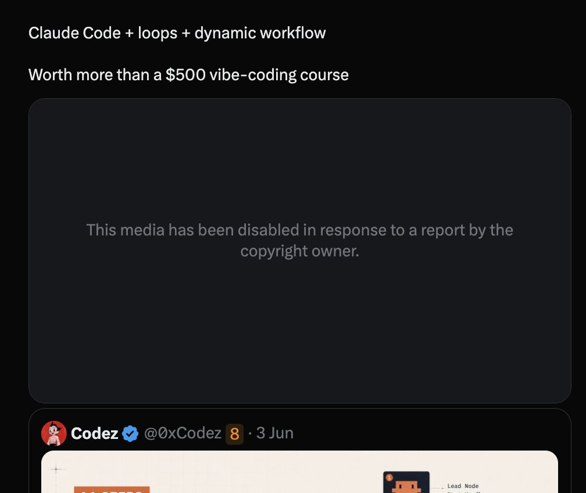

Claude Code creator:

"Now I don’t prompt Claude anymore - I have loops that are running. My job is to write loops."

In this 30-min speech, Boris revealed his actual Claude setup for daily coding.

Claude Code + loops + dynamic workflow

Worth more than a $500 vibe-coding course 

## 💬 Replies

### 1 @0xCodez (Codez)

*Wed Jun 03 13:34:41 +0000 2026*

@0xMovez this is an amazing watch bro. Boris is the lord of vibecoding for me

### 2 @gippp69 (Gipp 🦅)

*Wed Jun 03 13:35:13 +0000 2026*

@0xMovez I am really amazed at how much of a genius this guy is

### 3 @0xMovez (Movez) (Author)

*Wed Jun 03 13:36:06 +0000 2026*

@gippp69 real Giga chad, that for sure. Love Boris speeches. Btw are you using Claude Loops in your daily rootine ?

### 4 @ArchiveExplorer (Archive)

*Wed Jun 03 14:45:58 +0000 2026*

@0xMovez that's my favorite type of videos

learning for free how to setup a system

### 5 @0xMovez (Movez) (Author)

*Wed Jun 03 14:46:27 +0000 2026*

@ArchiveExplorer yeah, agree on this bro ! love Boris Speeches too

### 6 @Nikitont (Nikiton)

*Wed Jun 03 14:29:28 +0000 2026*

@0xMovez it already looks like a system.

### 7 @0xMovez (Movez) (Author)

*Wed Jun 03 14:30:34 +0000 2026*

@Nikitont loops is one of the most useful thing im using myself in Claude

### 8 @insomnia_vip (Insomnia)

*Wed Jun 03 13:30:15 +0000 2026*

@0xMovez Claude Code is only works now

### 9 @0xMovez (Movez) (Author)

*Wed Jun 03 13:31:08 +0000 2026*

@insomnia\_vip Сlaude Code is the only setup you need for building your product today. Btw bro are you using Claude code daily ?

### 10 @painn_x (painn)

*Wed Jun 03 13:30:48 +0000 2026*

@0xMovez i agree with him

### 11 @0xMovez (Movez) (Author)

*Wed Jun 03 13:31:34 +0000 2026*

@\_0xpainn Same here. Btw are you writing loops automations youself ?

### 12 @Nekt_0 (Nekt0)

*Wed Jun 03 13:41:00 +0000 2026*

@0xMovez He's a damn genius

cool

### 13 @0xMovez (Movez) (Author)

*Wed Jun 03 13:58:51 +0000 2026*

@Nekt\_0 Yeah. He is a real chad ! Love his speeches

### 14 @dunik_7 (dunik)

*Wed Jun 03 13:34:13 +0000 2026*

@0xMovez loops are the new prompting

before you asked “build me a feature”

### 15 @0xMovez (Movez) (Author)

*Wed Jun 03 13:35:24 +0000 2026*

@dunik\_7 yeah, love this feature is Claude. Now exploring Dynamic Workflows

### 16 @Nikitont (Nikiton)

*Thu Jun 04 12:00:28 +0000 2026*

@0xMovez 🙃w

### 17 @0xMovez (Movez) (Author)

*Thu Jun 04 12:04:03 +0000 2026*

@Nikitont 

### 18 @bonsaixbt (Bonsai 🌳)

*Wed Jun 03 14:06:50 +0000 2026*

@0xMovez I thought he was about to say: “now I don’t use Claude at all anymore”

### 19 @0xMovez (Movez) (Author)

*Wed Jun 03 14:07:44 +0000 2026*

@bonsaixbt lol, switched to Codex 😂

### 20 @itsthedonhashim (Hussain Hashim | Building SundayBack)

*Wed Jun 03 13:55:38 +0000 2026*

@0xMovez @0xMovez whoa, loops are the secret sauce? might need to rethink how i'm automating stuff. this sounds like a game changer.

### 21 @0xMovez (Movez) (Author)

*Wed Jun 03 14:02:06 +0000 2026*

@itsthedonhashim Yeah bro. Loops are very useful for daily coding

### 22 @RuujSs (Ruuj)

*Wed Jun 03 17:08:01 +0000 2026*

@0xMovez Interesting session movez!

### 23 @0xMovez (Movez) (Author)

*Wed Jun 03 17:09:01 +0000 2026*

@RuujSs Thanks Ruj !

### 24 @ventry089 (Ventry)

*Wed Jun 03 13:41:13 +0000 2026*

@0xMovez it’s important to use the tool correctly

### 25 @0xMovez (Movez) (Author)

*Wed Jun 03 14:00:19 +0000 2026*

@ventry089 It’s important to use the cutting edge tooling

### 26 @rewind02 (rewind)

*Wed Jun 03 15:52:24 +0000 2026*

@0xMovez prompting feels manual already

### 27 @alphabatcher (Alpha Batcher)

*Wed Jun 03 17:38:30 +0000 2026*

@0xMovez it's good to be Claude Code creator imho

### 28 @chantastic (chan)

*Wed Jun 03 23:17:37 +0000 2026*

@0xMovez can you attribute the video to @WorkOS?
[youtube.com/watch?v=RkQQ7W…](https://www.youtube.com/watch?v=RkQQ7WEor7w)

### 29 @gusik4ever (wincy.eth)

*Wed Jun 03 19:19:29 +0000 2026*

@0xMovez It’s good to be Claude creator

### 30 @Blum_OG (Blum)

*Wed Jun 03 22:33:54 +0000 2026*

@0xMovez Boris Chernoy's talks from anthropic just hit different

### 31 @ajs6888 (安叫兽|Bird🕊️ 🔶 BNB)

*Thu Jun 04 16:00:02 +0000 2026*

@0xMovez 听起来更像在调流水线，不是在写提示词了

### 32 @Limb0AI (Limbo)

*Wed Jun 03 16:34:50 +0000 2026*

@0xMovez loops only work if you can verify the output automatically

without checks you're just generating garbage faster

### 33 @0xSpivach (Spivach)

*Wed Jun 03 14:14:11 +0000 2026*

@0xMovez You know what?

IT specialist is not that required now as an AI specialist that operates it during the vibecoding proccess

