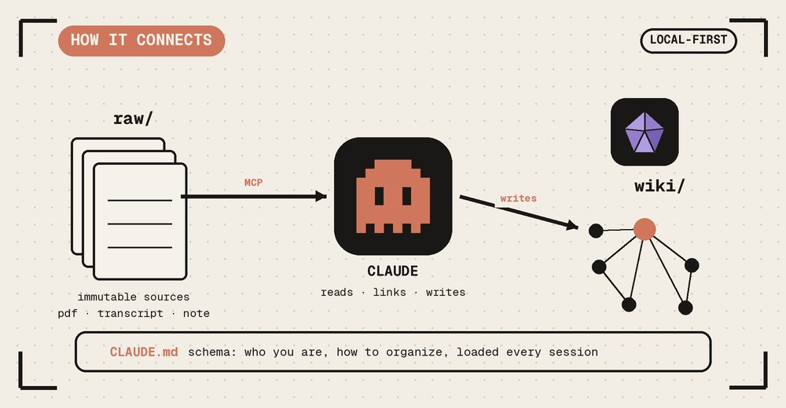
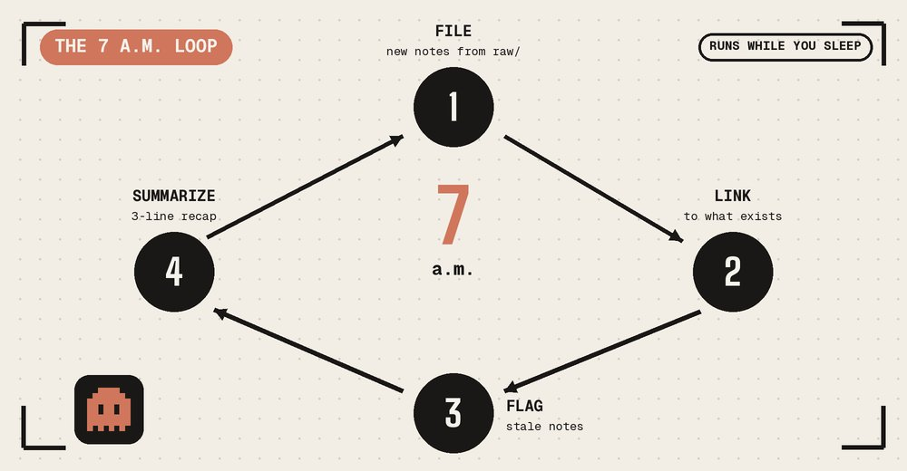
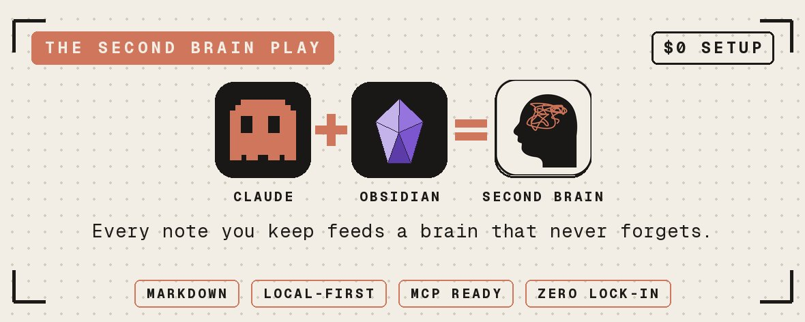
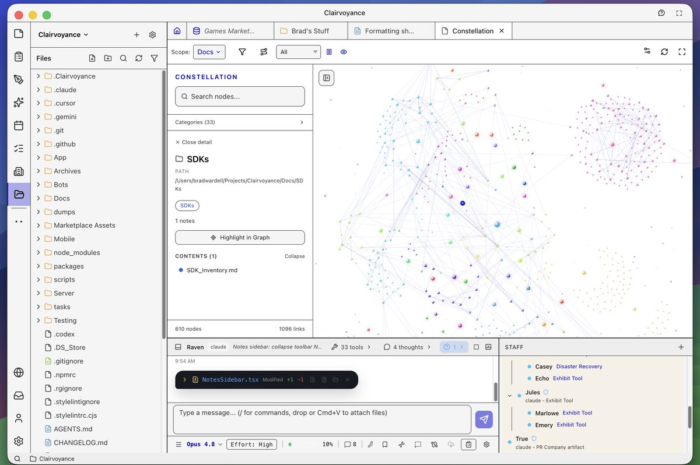

# 📰 The 10-Step Second Brain: Point Claude at an Obsidian Vault and Never Re-Explain Yourself Again

One evening of setup. A vault that files itself at 7 a.m., and a model that opens every session already knowing your work.

A 30-year-old freelance developer in Lisbon kept his best thinking in 5 places at once. A notes app, 30 browser tabs, a Notion board he stopped opening, and 40 archived Claude chats he would never find again. Every project started the same way: 20 minutes rebuilding context from memory, then losing most of it by Friday.

Then he stopped pasting his life into a chat box and started pointing Claude at a folder. One evening of wiring. By the end of the month he opened his Obsidian graph and froze, because the thing knew connections he had forgotten he made. The same build, step by step, written for someone who has never opened Claude Code or Obsidian.

---

## 1\. Two tools, two jobs

Obsidian is the storage. A free notes app that keeps everything as plain markdown files on your own machine. Notes link to each other with \[\[double brackets\]\], and those links form a graph you can see. Claude is the brain on top. It reads the whole vault, files new material where it belongs, links it to what already exists, and answers across all of it. The whole system is text files, so no single model owns it. Point a different one at the folder next year and it still works.

---

## 2\. Install Claude Code

Download the Claude desktop app from claude.com/download and open the Code tab. That tab is Claude Code, the version that reads and writes files on your computer. It needs a paid plan. Claude Pro runs $20 a month, or $17 billed annually, and the free tier will not run Claude Code. This is the one cost in the build. Everything below is free.

---

## 3\. Make your vault

Download Obsidian from obsidian.md. Create a new vault, name it brain, pick a folder to store it. That folder is now your second brain. Make one note, type a sentence, then type \[\[goals\]\]. The bracketed word turns into a link. That single mechanic, notes pointing at notes, is the thing Claude will do for you at scale.

---

## 4\. Open a door into the vault

Claude reaches the vault through a plugin. In Obsidian, open Settings, click Community plugins, turn them on, then Browse and install Local REST API. Enable it, open its settings, and copy the API key. Leave Obsidian running. The door only works while the app is open.

---

## 5\. Wire Claude in with MCP

In the Code tab, paste this with your key swapped in:

\`\`\`
claude mcp add-json obsidian-vault '{ "type": "stdio", "command": "uvx",
"args": \["mcp-obsidian"\], "env": { "OBSIDIAN\_API\_KEY": "PASTE-YOUR-KEY",
"OBSIDIAN\_HOST": "127.0.0.1", "OBSIDIAN\_PORT": "27124" } }'
\`\`\`

The plugin shows the key with the word Bearer in front of it. Drop that word. Paste only the string of letters and numbers after it. mcp-obsidian is the most established bridge, with thousands of GitHub stars. Test it: type "list every file in my vault." If Claude reads your notes back, the door is open.

---

## 6\. Load yourself into the brain

An empty brain is useless, and you should not type your whole profile by hand. Make Claude interview you instead. Paste:

\`\`\`
You are setting up my second brain. Interview me ONE question at a time to
build my profile: who I am and what I do, my goals this year, how I want you
to talk to me, my strengths and weaknesses, my current projects. Wait for each
answer. When done, write it all to CLAUDE.md at the vault root, with headers,
so you load it every session.
\`\`\`

Answer like you are briefing a new co-founder. The more real your answers, the more the brain knows you. When it finishes, CLAUDE.md holds your context and you stop re-explaining yourself.

---

## 7\. Steal Karpathy's structure

In April 2026 Andrej Karpathy posted a pattern he called the LLM Wiki. Two folders carry it. raw/ holds immutable sources, the articles, transcripts, PDFs, and screenshots Claude reads but never edits. wiki/ holds the pages Claude writes from them: summaries, concept pages, cross-references. You never write the wiki. Claude compiles it the moment a new source lands, then runs a lint pass that catches broken links and contradictions. In Karpathy's own run, one topic grew to about 100 articles and 400,000 words without him writing a page of it. Tell Claude: "Set up raw/ and wiki/. When I drop a file in raw/, read it, write or update the matching wiki pages, and link them."

---

## 8\. Teach Claude the Obsidian dialect

Claude writes plain markdown. It does not know \[\[wikilinks\]\], callouts, Bases, or Canvas until you show it how. Steph Ango, the CEO of Obsidian, fixed that. His repo kepano/obsidian-skills ships 5 official Agent Skills covering Obsidian's formats: markdown, Bases, Canvas, the CLI, and web extraction. Drop the repo's contents into a .claude folder at your vault root. Now Claude's notes come out hand-built instead of almost-right. The skills follow the open Agent Skills spec, so they run on Codex and other agents too, and you stay unlocked.

---

## 9\. Add live data, then walk away

Static notes are half a brain. Connect what changes. For Google Calendar, run:

\`\`\`
claude mcp add google-workspace uvx workspace-mcp --tools calendar
\`\`\`

Grant read access, then say: "Read today's calendar, log what I committed to in each meeting into my tasks, and flag anything without a clear next step." Once your workflows hold, schedule them. Open the Schedule tab, add a daily 7 a.m. task, and tell it to file anything new in raw/, link it, flag notes that have gone stale, and write a 3-line summary of what changed overnight. One rule you do not break: control access with keys, not prompts. "Do not delete this" is a suggestion. A read-only, scoped key is a setting. If an agent can delete a file, one day it will.

---

## 10\. Skip the wiring with three free repos

If you would rather not build from scratch, the community already packaged the whole thing. AgriciDaniel/claude-obsidian is a self-organizing brain on the Karpathy pattern, with 15 Claude Code skills and presets for PARA, Zettelkasten, and other methods. eugeniughelbur/obsidian-second-brain ships 43 commands like /obsidian-save, /obsidian-daily, and /obsidian-find, and runs across Claude, Codex, and Gemini. coleam00/second-brain-starter interviews you, writes a build plan, then scaffolds the whole thing from markdown and Python. Clone one. Reshape it into your own.

---

## What you have after this

Before, Claude forgets you the second you close the tab. You hold all the context, and you lose most of it. After, a vault holds everything and a model picks up where it left off. Run it for a week and it is a notes app. Run it for a month and it is a reference system. Run it for 6 months and it is a knowledge engine no amount of Googling replaces, because every new note connects to everything already there.

Same subscription. A completely different machine.

I write about Claude, automation, and systems that run while you sleep. Follow if that is your thing.

### 🖼️ Attached Media

## 💬 Replies

### 1 @draginol (Brad Wardell)

*Sun Jun 28 14:00:40 +0000 2026*

@0xMoysei Or just do 1 step: Clairvoyance which was built for this.  It extends Claude Code, Codex, etc. to know how to use this stuff natively and its mark-down editor is lighting fast, powerful, and easy to use. 

### 2 @nukhxyy (nukhxy)

*Fri Jun 26 18:16:00 +0000 2026*

@0xMoysei fr this is insane

### 3 @MattewPhillips (Mattew Phillips)

*Sat Jun 27 21:49:26 +0000 2026*

@0xMoysei This u? 

### 4 @amkeiko69 (恵子 vivi)

*Tue Jun 30 12:50:10 +0000 2026*

@0xMoysei I installed this .👏☺️

### 5 @lunchboxfortwo (Lunchbox 🍣)

*Thu Jul 02 21:44:53 +0000 2026*

@0xMoysei Wouldn't this lead to context bloat v quickly 

Also curious what are the advantages of using obsidian vs well organized md files

### 6 @hypermemetic (hypermemetic)

*Sun Jun 28 00:10:41 +0000 2026*

@0xMoysei link the karpathy paper pls

### 7 @timiditiez (Kian ⛩️)

*Sun Jun 28 13:18:12 +0000 2026*

@0xMoysei @grok what's the advantage and disadvantages of this in comparisson to simply linking notion to claude?

### 8 @rahilpirani (Rahil Pirani)

*Sun Jun 28 02:59:19 +0000 2026*

This is great with a few caveats -- it only works if Obsidian is open, it only works on the ONE device that has Obsidian, and lastly has no semantic layer. 

You can do something very similar with Second Brain for AI that runs in YOUR OWN cloudflare account, has an obsidian plugin, and is available across all your devices and and LLM's - read: not tied to just Claude, works across ChatGPT, Claude, and any MCP Tool. 

[github.com/rahilp/second-…](https://github.com/rahilp/second-brain-cloudflare)

### 9 @PacomyICOR (Paco Cantero)

*Sun Jul 05 15:29:37 +0000 2026*

@0xMoysei Most people read this as 'Claude finally remembers me.' The quieter win is that pointing an AI at the mess is what finally forced five apps into one structure.

Once the thinking has one home, any model can read it. The structure was the work. The AI is the payoff.

### 10 @d_danielsun (ddanielsun (Ø,G))

*Tue Jul 07 09:44:40 +0000 2026*

@0xMoysei Broke when you have too much context. Try @garrytan  gbrain instead

### 11 @WillamsXevu (Willams Xevu)

*Tue Jun 30 09:23:45 +0000 2026*

@0xMoysei Nice

### 12 @embolds (embolds)

*Wed Jul 01 20:58:39 +0000 2026*

@0xMoysei Same outcome, none of the plugin/API-key wiring. No REST API plugin, no MCP server to configure, just files Claude reads and reconciles into directly. Setup is a CLAUDE.md, not four install steps. Book walks the simple version: [thepersonalaios.com](http://thepersonalaios.com)

### 13 @apexintelligex (John)

*Sat Jun 27 05:49:12 +0000 2026*

@0xMoysei Second-brain is a not so smart way to give Claude everything you know and work on. Karpathy works for Claude after all. You want a real second-brain - build your own private LLM and put Claude to train it.

