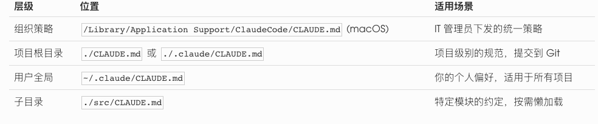
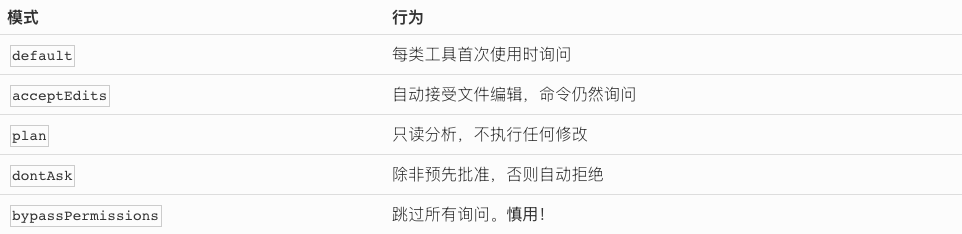
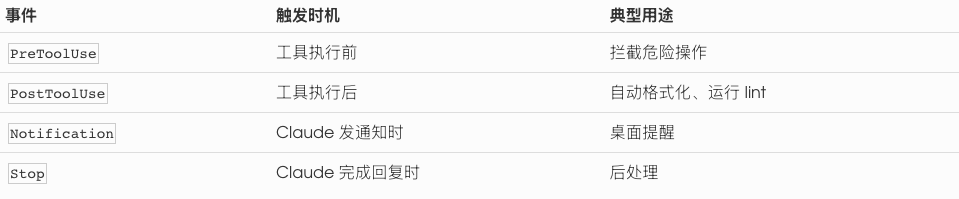
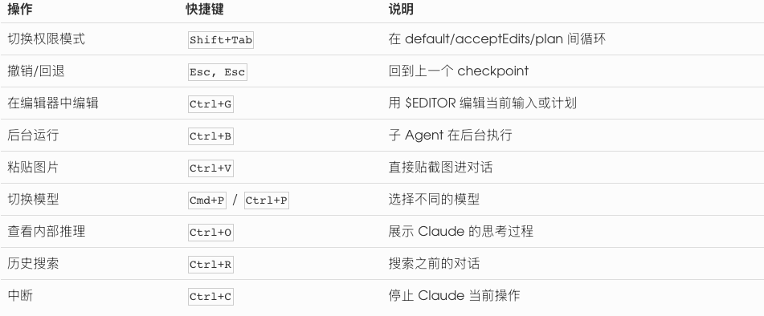

# 📰 CLAUDE CODE 最佳实践：从"能用"到"真的好用" 

# 我用 Claude Code 大半年了，踩过的坑比写过的代码还多。

一开始我以为 Claude Code 就是一个"更高级的 Copilot"——在终端里打字，它帮我写代码，完事。后来才发现，这东西的上限远比我想象得高，但前提是你得知道怎么用。

这篇文章结合官方文档和实战经验，整理了我认为最重要的使用技巧。有些是血泪教训，有些是读文档才知道的隐藏功能。

## 一、CLAUDE.MD：最被低估的功能

如果你只记住这篇文章的一件事，就记这个：写好你的 CLAUDE.md。

CLAUDE.md 是 Claude Code 在每次对话开始时自动读取的指令文件。它就像你给一个新同事写的 onboarding doc——你希望他知道什么，你就写什么。

很多人不写 CLAUDE.md，或者随便写两行。结果就是每次对话都要从头解释项目结构、编码规范、技术栈选择。这就像每天早上都要重新给同事介绍一遍公司。

一个好的 CLAUDE.md 应该包含什么

\`\`\`markdown
\# 项目名称
​
\## 构建和测试命令
\- 安装依赖：npm install
\- 运行测试：npm test
\- 单个测试：npm test -- --grep "test name"
\- 格式化：npm run format
​
\## 编码规范
\- Python 使用 ruff 格式化，行宽 88
\- 测试用 pytest，每个 service 对应一个测试文件
\- API 路由文件名用复数：users.py, orders.py
\- 提交信息用英文，格式：type(scope): description
​
\## 架构决策
\- 选 Tailwind 而不是 CSS Modules，因为团队统一了这个规范
\- 用户权限校验在 middleware 里做，不要在每个路由重复写
\- Redis 缓存的 key 前缀统一用 \`app:v1:\`
​
\## 常见陷阱
\- 数据库连接池上限是 20，别在循环里开新连接
\- 不要 mock 数据库，上次 mock 测试通过但生产迁移失败了
\`\`\`

有几个关键原则：

第一，写 Claude 从代码里读不出来的东西。 项目的"为什么"比"是什么"更重要。你不需要解释 React 怎么用，但你需要告诉它"我们选 Tailwind 是因为团队统一了这个规范"。

第二，控制在 200 行以内。 官方文档明确提到，CLAUDE.md 太长会导致 Claude 忽略规则。用 markdown 标题和列表，保持可扫描性。

第三，不要放频繁变化的内容。 详细的 API 文档、逐文件描述这些东西不适合放在 CLAUDE.md 里。放链接就好。

# CLAUDE.md 的四级层级

Claude Code 支持四级 CLAUDE.md，按优先级从高到低：

我的全局 CLAUDE.md 里通常会写：

\`\`\`
\- 我是一名全栈工程师，不需要过度解释基础概念
\- 回复尽量简洁，不要加无关的客套话
\- 代码改动后不要总结你做了什么，我会看 diff
\- 优先用简单方案，不要过度工程
\`\`\`

这四行，能省掉你几百次重复纠正的时间。

进阶：用 .claude/rules/ 组织规则

当项目大了之后，一个 CLAUDE.md 文件塞不下所有规则。官方提供了一个更优雅的方案：把规则拆到 .claude/rules/ 目录下。

\`\`\`
.claude/rules/
├── testing.md        # 测试规范
├── api-style.md      # API 编写风格
└── frontend.md       # 前端约定
\`\`\`

更强大的是，你可以用 YAML frontmatter 把规则限定到特定文件：

\`\`\`
\---
paths: \["src/api/\*\*/\*.ts", "src/routes/\*\*/\*.ts"\]
\---
​
API 路由必须包含输入验证和错误处理。
所有新端点需要在 tests/api/ 下添加集成测试。
\`\`\`

这样这条规则只在 Claude 访问匹配的文件时才会加载，节省上下文空间。

## 二、提示词的质量决定产出的质量

这听起来像废话，但我见过太多人这样用 Claude Code：

> "帮我写一个登录功能"

然后对着生成的一大坨代码发愁——这不是我想要的啊。

好的指令应该包含三个要素：目标、约束、上下文。

差的指令 vs 好的指令

> 差："给用户列表加个搜索功能"

> 好："在 @src/pages/UserList.tsx 的表格上方加一个搜索框。搜索走后端 API /api/users?search=xxx，不要前端过滤。用 debounce 300ms，样式和现有的 Filter 组件保持一致。"

区别在哪？好的指令减少了歧义。Claude Code 不需要猜你要前端搜索还是后端搜索，不需要猜 debounce 时间，不需要猜样式规范。

官方推荐的提示技巧

1\. 用 @ 引用具体文件

Claude Code 支持用 @文件路径 直接把文件内容拉进上下文。比起说"那个认证相关的代码"，直接写 @src/auth/login.ts 精确得多。你甚至可以指定行号范围：@src/auth/login.ts#5-30。

2\. 贴截图和图片

用 Ctrl+V 可以直接粘贴图片。调试 UI 问题时，贴一张"现在长这样"和"我想要这样"的截图，比文字描述有效十倍。

3\. 给验证标准

不要只说"帮我修这个 bug"，而是：

> "修复登录超时后无法重新认证的问题。修复后，用户在 token 过期后点击任意按钮应该自动跳转到登录页。测试用例在 @tests/auth.test.ts 里，修完后跑一下确认通过。"

给 Claude 一个可以自我验证的标准——测试用例、截图、预期输出——它就能自己检查工作质量，减少来回修改。

4\. 明确"不要做"的事

Claude Code 有时候会过度热心——你让它修一个 bug，它顺手把周围的代码也重构了。明确说"只改这个函数，不要动其他代码"，能省很多事。

模糊指令也有用武之地

并不是所有时候都需要精确的指令。探索性任务用模糊指令反而更好：

- "这个文件有什么可以改进的地方？"

- "帮我理解一下这个模块的架构"

- "这段代码有什么潜在问题？"

但到了实现阶段，切回精确模式。

## 三、PLAN MODE：先想清楚，再动手

Claude Code 有一个 Plan Mode，这是我认为最被低估的工作流。

怎么进入 Plan Mode

三种方式：

\`\`\`
\# 启动时直接进入
claude --permission-mode plan
​
\# 对话中切换（按两次 Shift+Tab）
Shift+Tab Shift+Tab
​
\# 在提示词里说
"先不要改代码，帮我做个计划"
\`\`\`

在 Plan Mode 下，Claude Code 只能读取文件、搜索代码，不能做任何修改。它会探索代码库，分析你的需求，然后给出一个详细的实现计划。

Plan Mode 的正确打开方式

关键操作：按 Ctrl+G 可以在你的编辑器里打开并编辑计划。

这意味着你可以：

1. 让 Claude 生成初始计划

1. Ctrl+G 打开计划，删掉你不同意的部分，补充你自己的想法

1. 切回正常模式（Shift+Tab），让 Claude 按修改后的计划执行

改一个计划只需要一句话，改已经写好的代码要花十倍的时间。

推荐的复杂任务工作流

官方推荐的标准流程是四步：探索 → 规划 → 实现 → 验证。

\`\`\`
1\. 进入 Plan Mode
2\. 让 Claude 阅读相关代码："读一下 src/auth/ 下的代码，理解 session 处理逻辑"
3\. 请求计划："制定一个 OAuth2 迁移方案"
4\. Ctrl+G 审查和编辑计划
5\. 切回正常模式
6\. "按照计划实现，写完跑测试"
7\. 让 Claude 对照需求自查
\`\`\`

什么时候不需要 Plan Mode

- 改一个变量名

- 修一个明显的 typo

- 加一行日志

判断标准很简单：如果这个任务的实现方式只有一种，直接做。如果有多种选择，先规划。

## 四、子 AGENT：CLAUDE CODE 的分身术

子 Agent 是 Claude Code 的一个强大机制——它可以启动独立的 AI 进程来并行处理任务，每个子 Agent 有自己的上下文窗口，不会污染你的主对话。

内置的子 Agent 类型

类型能力用途Explore只读，快速搜索代码库探索、找文件、找定义Plan只读，研究分析Plan Mode 下的代码分析General完整能力复杂的多步骤任务

子 Agent 最大的价值：隔离上下文

当你让 Claude 跑测试、分析日志、搜索大量文件时，这些操作会产生海量输出，塞满你的上下文窗口。用子 Agent 来做这些事，输出留在子 Agent 的上下文里，只有摘要返回给你。

比如：

> "用子 Agent 跑一下全量测试，把失败的用例列出来"

> "用子 Agent 搜索所有使用了 deprecated API 的文件"

后台运行：Ctrl+B

按 Ctrl+B 可以把子 Agent 放到后台运行。你可以继续和 Claude 聊其他事，等后台任务完成后会自动通知你。

适合：

- 跑测试套件（通常需要几分钟）

- 大范围代码搜索

- 不紧急的代码审查

自定义子 Agent

你可以在 .claude/agents/ 目录下创建自定义 Agent：

\`\`\`
\---
name: code-reviewer
description: 代码审查专家。代码改动后自动触发。
tools: Read, Grep, Glob, Bash
model: sonnet
\---

你是一位资深代码审查者。检查以下维度：
\- 代码清晰度和可读性
\- 错误处理是否完整
\- 有没有暴露敏感信息
\- 输入验证
\- 性能隐患
\`\`\`

然后在对话中用 @"code-reviewer (agent)" 调用它。

## 五、上下文管理：最容易被忽视的关键

Claude Code 的上下文窗口虽然大（最多 1M token），但它不是无限的，而且上下文管理直接决定了输出质量。

上下文里都装了什么

- 你的对话历史

- Claude 读取的所有文件内容

- 命令执行的输出

- CLAUDE.md 文件（每次都加载）

- Memory 文件（前 200 行）

- 加载的 Skill 和 MCP 工具定义

五个实用策略

1\. /clear ：一件事做完就清

不要在同一个对话里又修 bug 又加功能又重构。/clear 会清空上下文但保留 CLAUDE.md，相当于一次免费的重启。

2\. /compact ：手动压缩上下文

当对话变长时，输入 /compact 让 Claude 自动总结和压缩之前的对话。更好的用法是给压缩加一个焦点：

/compact 专注于 API 改动和测试结果

这样 Claude 在压缩时会优先保留你关心的内容。

3\. /context ：看看上下文被谁吃了

输入 /context 可以看到当前上下文的使用情况——哪些文件占了多少 token，MCP 工具定义占了多少。我经常发现一些没用的 MCP server 占了大量空间。

4\. 用子 Agent 隔离噪声

跑测试、分析日志这些操作会产生大量输出。让子 Agent 去做，主对话的上下文保持干净。

5\. 在 CLAUDE.md 里写压缩保留指令

你可以告诉 Claude 压缩时必须保留什么：

\`\`\`
\# 压缩指令
压缩上下文时，始终保留：
\- 已修改文件的完整列表
\- 测试命令和结果
\- 关键的架构决策
\`\`\`

Memory vs CLAUDE.md

Memory 适合存什么： 你的偏好（"这个人喜欢简洁回复"）、项目约定（"部署有个特殊步骤"）、历史决策（"上次选了方案 A 是因为 X"）。

Memory 不适合存什么： 代码细节、Git 历史、临时状态——这些从代码和 Git 里获取更准确。

用 /memory 命令可以查看和管理所有已加载的 Memory。

## 六、权限管理：安全和效率的平衡

Claude Code 提供了五种权限模式，用 Shift+Tab 在对话中循环切换：

## 权限规则配置

在 .claude/settings.json 里，你可以精细控制每种工具的权限：

\`\`\`
{
  "permissions": {
    "allow": \[
      "Bash(npm run \*)",
      "Bash(git commit \*)",
      "Edit(src/\*\*/\*.ts)",
      "Read(\*.md)"
    \],
    "deny": \[
      "Bash(rm -rf \*)",
      "Edit(.env)"
    \]
  }
}
\`\`\`

规则优先级：deny → ask → allow（deny 最优先）。

这意味着你可以大胆地 allow 常用命令，同时用 deny 保护敏感文件。比如 .env 文件，无论如何都不应该被编辑。

## 设置文件的层级

和 CLAUDE.md 类似，settings 也有多级：

\`\`\`
组织策略（最高优先级）
  ↓
CLI 参数
  ↓
.claude/settings.local.json（本地，不提交到 Git）
  ↓
.claude/settings.json（项目级，团队共享）
  ↓
\~/.claude/settings.json（全局，个人）
  ↓
默认值（最低优先级）
\`\`\`

我的建议：把团队共享的规则放 .claude/settings.json，个人偏好放 \~/.claude/settings.json，敏感配置放 .claude/settings.local.json（记得加到 .gitignore）。

## 七、HOOKS：让规则变成铁律

CLAUDE.md 里的指令是"建议"——Claude 大部分时候会遵守，但偶尔会忘。Hooks 是"铁律"——无论如何都会执行。

Hooks 是在特定生命周期事件上自动触发的 shell 命令。配置在 settings.json 里。

## 关键事件类型

实用示例

自动格式化——每次编辑后运行 Prettier：

\`\`\`
{
  "hooks": {
    "PostToolUse": \[{
      "matcher": "Edit\|Write",
      "hooks": \[{
        "type": "command",
        "command": "jq -r '.tool\_input.file\_path' \| xargs npx prettier --write"
      }\]
    }\]
  }
}
\`\`\`

保护关键文件——阻止修改生产配置：

\`\`\`
{
  "hooks": {
    "PreToolUse": \[{
      "matcher": "Edit\|Write",
      "hooks": \[{
        "type": "command",
        "command": ".claude/hooks/protect-files.sh"
      }\]
    }\]
  }
}
\`\`\`

Hook 命令返回 exit code 0 表示允许，exit code 2 表示阻止。这意味着你可以写任意复杂的判断逻辑。

上下文压缩后重新注入关键信息：

\`\`\`
{
  "hooks": {
    "SessionStart": \[{
      "matcher": "compact",
      "hooks": \[{
        "type": "command",
        "command": "echo '用 Bun 不用 npm。提交前跑 bun test。'"
      }\]
    }\]
  }
}
\`\`\`

这解决了一个常见痛点：对话太长被压缩后，之前提过的重要指令可能丢失。用 Hook 可以在每次压缩后自动重新注入。

Hook 的四种类型

类型说明command执行 shell 命令，从 stdin 读取 JSONhttp向 URL 发送 POST 请求prompt单次 LLM 调用，做 yes/no 判断agent启动一个子 Agent 进行验证

## 八、GIT 工作流：用好 WORKTREE

Claude Code 能执行 Git 命令，这是一把双刃剑。但官方提供了一个很好的安全网：Worktree。

Git Worktree：隔离的工作空间

\`\`\`
\# 在隔离的 worktree 中启动 Claude
claude --worktree feature-auth
claude --worktree bugfix-123
​
\# 自动生成名字
claude --worktree
\`\`\`

Worktree 会在 .claude/worktrees/ 下创建一个独立的 Git 分支副本。Claude 在里面怎么折腾都不影响你的主分支。退出时：

- 如果没有改动 → 自动清理

- 如果有改动 → 提示你保留或删除

这对于探索性任务特别有用。 不确定某个重构方案能不能行？开个 worktree 试试，不行就扔掉，零风险。

几个 Git 铁律

1\. 永远不要让 Claude Code 自动 push

它可以 commit，但 push 这个动作应该由你来确认。一旦 push 到远端，回退成本就大了。

2\. 频繁 commit

做完一个小功能就 commit。用 /rewind 可以回退到任意一个 checkpoint，但前提是你有 commit 记录。

3\. 警惕破坏性操作

如果 Claude Code 要执行 git reset --hard、git push --force、rm -rf，一定要在脑子里过一遍后果再批准。 这些操作没有 undo。你也可以在权限规则里直接 deny 掉这些命令。

4\. 从 PR 恢复上下文

这会自动加载 PR 的改动和讨论作为上下文，非常适合 code review 或者继续别人的工作。

\`\`\`
claude --from-pr 123

\`\`\`

## 九、快捷键和命令速查

这些快捷键我每天都在用，强烈建议记住：

最常用的快捷键

最常用的斜杠命令

\`\`\`
/compact \[焦点\]     # 压缩上下文，可指定保留重点
/clear              # 清空对话，重新开始
/context            # 查看上下文使用情况
/memory             # 查看和管理 Memory
/rewind             # 回退到某个 checkpoint
/resume \[名称\]       # 恢复之前的对话
/model              # 切换模型
/effort \[级别\]       # 设置推理深度：low/medium/high/max
/init               # 自动生成 CLAUDE.md
/mcp                # 管理 MCP 服务器
/permissions        # 查看权限规则
/cost               # 查看 token 消耗
\`\`\`

/init 对新项目特别有用——它会自动分析你的代码库，帮你生成一个 CLAUDE.md 的初稿。虽然通常需要手动调整，但比从零开始快得多。

## 十、EXTENDED THINKING：让 CLAUDE 想深一点

对于复杂问题，你可以开启 Extended Thinking 模式，让 Claude 在回答前花更多时间推理。

## 怎么用

\`\`\`
\# 快捷键切换
Option+T (Mac) / Alt+T (Windows/Linux)
​
\# 或者用命令
/effort high    # 更深入的推理
/effort max     # 最大推理深度
/effort low     # 简单任务，省 token
\`\`\`

## 什么时候该用

- 复杂的架构决策

- 棘手的 debug（多个可能原因需要排除）

- 多步骤的重构方案设计

- 权衡多个方案的利弊

什么时候不需要

- 简单的代码修改

- 格式化、重命名

- 已经很明确的 bug 修复

小技巧： 在提示词里写 ultrathink 可以强制触发最高推理深度，不需要手动调整 effort 设置。

## 十一、MCP SERVER：让 CLAUDE 连接外部世界

MCP（Model Context Protocol）让 Claude Code 能和外部工具通信——GitHub、数据库、Slack、Notion 等等。

## 快速添加

\`\`\`
claude mcp add github -- npx @anthropic-ai/mcp-server-github
claude mcp add postgres -- npx @anthropic-ai/mcp-server-postgres postgresql://localhost:5432/mydb
\`\`\`

配置文件

MCP 配置在 .mcp.json 里：

\`\`\`
{
  "mcpServers": {
    "github": {
      "type": "stdio",
      "command": "npx",
      "args": \["@modelcontextprotocol/server-github"\],
      "env": {
        "GITHUB\_TOKEN": "$GITHUB\_TOKEN"
      }
    }
  }
}
\`\`\`

注意上下文开销

每个 MCP server 会额外消耗 100-500+ token 的工具定义。 用 /mcp 命令可以查看每个 server 的开销，禁用不用的 server。

我的经验：不要贪多。 常用的 2-3 个 MCP server 就够了。装太多，上下文空间被工具定义吃掉，反而影响代码分析的质量。

## 十二、IDE 集成：不只是终端

## VS Code

安装 Claude Code 扩展后，你可以在 VS Code 里直接使用 Claude，而不需要切到终端。

几个好用的功能：

- 并排 diff 视图：Claude 的改动以 diff 形式显示，一目了然

- Option+K / Alt+K：快速插入当前文件的 @引用

- 多标签对话：在不同的标签页里开多个独立对话

- Cmd+Shift+Esc：快速打开新的对话标签

## JetBrains

IntelliJ、PyCharm、WebStorm 等 JetBrains 全家桶也有 Claude Code 插件，在 Plugins 市场搜索 "Claude Code" 安装即可。

## 十三、审查代码：信任但要验证

Claude Code 写的代码质量总体不错，但你不能盲目信任。

## 几个常见问题

1\. 过度工程

你让它写一个简单的工具函数，它给你搞出一个完整的抽象层，带泛型、带接口、带工厂模式。杀鸡用了牛刀。

解决方法： 在 CLAUDE.md 里写上"优先用简单方案"，或在指令里明确说"不需要抽象"。

2\. 幻觉 API

它有时候会用不存在的 API 或者过时的语法。尤其是小众库的新版本。

解决方法： 跑测试。这也是为什么指令里应该包含验证标准。

3\. 改动范围膨胀

你让它改一个函数，它把整个文件都重构了。

解决方法： 明确说"只改 X，不要动其他代码"。或者用 /freeze 命令限制编辑范围到指定目录。

## Writer/Reviewer 模式

官方推荐的一个高级模式：用两个独立的会话分别扮演"写代码"和"审查代码"的角色。

两个会话有独立的上下文，Reviewer 不受 Writer 的思路影响，能发现 Writer 的盲点。

\`\`\`
会话 A（Writer）："实现 API 限流中间件"
会话 B（Reviewer）："审查 @src/middleware/rateLimiter.ts 里的限流实现，
                     重点看边界情况、竞态条件、一致性"
会话 A："修复审查反馈：\[粘贴 B 的输出\]"

\`\`\`

## 十四、不要用 CLAUDE CODE 做的事

说了这么多"应该怎么做"，最后聊聊"不应该做什么"。

1\. 不要让它做你完全不了解的事

如果你对 Kubernetes 一无所知，不要让 Claude Code 帮你写部署配置然后直接用。你无法审查你不懂的东西。

2\. 不要在没有版本控制的环境下用

没有 Git 就没有回退的能力。Claude Code 的改动可能覆盖你的文件，没有版本控制就是裸奔。

3\. 不要一口气扔一个巨大的任务

> "把整个项目从 JavaScript 迁移到 TypeScript"

这种指令等于让 Claude Code 自由发挥。结果不可控。拆成小步骤，每一步确认后再做下一步。

4\. 不要指望一次就完美

迭代是正常的。用 /rewind 回退，用精确的反馈描述"哪里不对"。

## 总结

Claude Code 的核心使用哲学其实很简单：

它是一个极其能干的协作者，但不是自动驾驶。方向盘始终在你手里。

按重要性排序，我的建议是：

1. 写好 CLAUDE.md — 一次投入，每次对话都受益

1. 给精确的指令 — 目标 + 约束 + 验证标准

1. 用 Plan Mode — 复杂任务先规划再动手

1. 管理上下文 — /clear、/compact、子 Agent

1. 控制权限 — deny 危险操作，allow 常用命令

1. 频繁 commit — 保留回退能力

做到这些，Claude Code 能让你的效率翻好几倍。做不到，它只会更快地帮你制造混乱。

工具的价值，永远取决于使用它的人。

以上结合了 Claude Code 官方文档和实战经验。如果你有更好的实践，欢迎交流。

### 🖼️ Attached Media

## 💬 Replies

### 1 @cnyzgkc (木马人)

*Tue Mar 24 12:36:22 +0000 2026*

@PandaTalk8 熊老板这篇写的很好，我一直想写一个claude code的系列教程，已经写了两篇安装入门篇，后面要上中级了

### 2 @li9292 (李韭二)

*Wed Mar 25 05:06:00 +0000 2026*

@PandaTalk8 [x.com/li9292/status/…](https://x.com/li9292/status/2036670826884587563?s=20)

### 3 @0xkakarot888 (0x卡卡撸特🍌🧪🤖😈)

*Mon Mar 23 12:59:58 +0000 2026*

@PandaTalk8 熊老板这是憋了个大招啊

### 4 @zhedao88 (黑泽)

*Mon Mar 23 12:11:44 +0000 2026*

@PandaTalk8 作为一个只在毕业后五年做过开发 现在全职产品的人 这个教程有点儿高阶 能懂 可能需要做过大项目才能完全理解
而且我一直不太习惯用终端 即使我做 C++的时候 也习惯 VC++ 每次看到黑屏 有一种手足无措的无力感

### 5 @Davidzzz130316 (家有肥猫)

*Mon Mar 23 15:03:23 +0000 2026*

@PandaTalk8 敲了那么多子，必须回帖支持

### 6 @Karadokuy (KunKun折腾手记)

*Mon Mar 23 20:20:48 +0000 2026*

@PandaTalk8 @Achgdesigner 太有价值了，已经mark明天认真和ai讨论学习了

### 7 @snowboat84 (snowboat)

*Mon Mar 23 16:00:27 +0000 2026*

@PandaTalk8 熊老板手把手教Claude Code，真是深入简出，入门级经典教程啊 👍🏻

### 8 @kianzou (Rousseau)

*Mon Mar 23 10:43:08 +0000 2026*

@PandaTalk8 感谢大佬干货分享群，已关注

### 9 @guansi (管四)

*Tue Mar 24 04:33:28 +0000 2026*

@PandaTalk8 这篇写的真的挺好的，收藏加心心🤍。继续加油输出更多优质内容。

### 10 @huyansheng2023 (风满楼)

*Mon Mar 23 23:08:52 +0000 2026*

@PandaTalk8 说实话手动管理上下文已经是一种过时的表现

### 11 @cdexsta (炎朗 Gavin)

*Tue Mar 24 03:22:44 +0000 2026*

@PandaTalk8 实操经验，必须点赞！

### 12 @Yangtze07 (Yangtze阳子江)

*Mon Mar 23 14:44:02 +0000 2026*

@PandaTalk8 收藏转发，熊老板是真正用它开发过项目💪

### 13 @RssFreedom (Freedom Rss)

*Mon Mar 23 14:23:48 +0000 2026*

@PandaTalk8 丢给 claude code 学起来

### 14 @lanmiaoai (Lazycat)

*Tue Mar 24 11:29:23 +0000 2026*

@PandaTalk8 建议搭配 [weclaude.ai](http://weclaude.ai) 实用  用微信可以远程控制Claude  code

### 15 @forest_shilin (任平生)

*Mon Mar 23 10:43:59 +0000 2026*

@PandaTalk8 @readwise save it

### 16 @Molly_limu (Molly | AI Product Builder)

*Tue Mar 24 12:09:12 +0000 2026*

@PandaTalk8 感谢熊老板分享，想问问大家如何管理 AI 项目的版本的？

### 17 @KittorsY41334 (Kittors Yuan)

*Tue Mar 24 14:34:23 +0000 2026*

@PandaTalk8 @readwise save thread

### 18 @zheyuhl (Zheyu)

*Tue Mar 24 17:23:27 +0000 2026*

@PandaTalk8 你自己都说了写 AI 从代码里看不出来的东西，难道 AI 会不知道你 package.json 里那几个命令是干什么的吗？连 npm install 都要写进 CLAUDE.md？

### 19 @gymnofghj (yunoshima)

*Tue Mar 24 11:35:17 +0000 2026*

@PandaTalk8 @readwise save thread

### 20 @chenglinze (Linzec)

*Tue Mar 24 23:35:46 +0000 2026*

@PandaTalk8 从Claude 2时代开始用 Claude Code相关模型，到Claude Code出自己 CLI 工具，在编程一直走在最前沿

### 21 @YHyanhao (hyan)

*Wed Mar 25 11:02:08 +0000 2026*

@PandaTalk8 子agent需要自己创建吗？

### 22 @shiwenyong (施想者)

*Wed Mar 25 00:38:46 +0000 2026*

@PandaTalk8 我认同你抓到的痛点：很多“为什么这么做”的信息，代码里确实没有。

但是：把它们长期塞进全局 CLAUDE.md，往往会把局部任务做成全局巡检，成功率和 token 一起变差。

现在更合理的方向，已经更接近按需加载的 skills / hooks 了。

### 23 @uu_bruce (Bruce_uu)

*Mon Mar 23 15:27:38 +0000 2026*

@PandaTalk8 👍👍

### 24 @jeremy230621 (pp)

*Tue Mar 24 23:35:21 +0000 2026*

@PandaTalk8 @grok claude code 原生支持rule文件夹吗

### 25 @minghaiel (鸿溟)

*Mon Mar 23 11:35:29 +0000 2026*

@PandaTalk8 @readwise save it

### 26 @hooray90848513 (hooray)

*Mon Mar 23 11:02:50 +0000 2026*

@PandaTalk8 @readwise save thread

### 27 @nick143382 (nick)

*Wed Mar 25 03:30:44 +0000 2026*

@PandaTalk8 感谢分享，收藏学习

### 28 @itbettersimple (小学生)

*Tue Mar 24 01:22:45 +0000 2026*

@PandaTalk8 写得真好

### 29 @LiyuQu (粘豆包)

*Tue Mar 31 03:02:05 +0000 2026*

@PandaTalk8 @threadreaderapp unroll

### 30 @chanchongban (chongban)

*Wed Mar 25 09:05:25 +0000 2026*

@PandaTalk8 - 或者用 /freeze 命令限制编辑范围到指定目录

这是哪个版本才有的命令 🤔

### 31 @WoodBamdra (Wood | Bamdra)

*Wed Mar 25 03:27:58 +0000 2026*

@PandaTalk8 都是干货，写的真好。

### 32 @CrespoYin (Crespo Yin)

*Tue Mar 24 13:45:27 +0000 2026*

@PandaTalk8 实操一下

