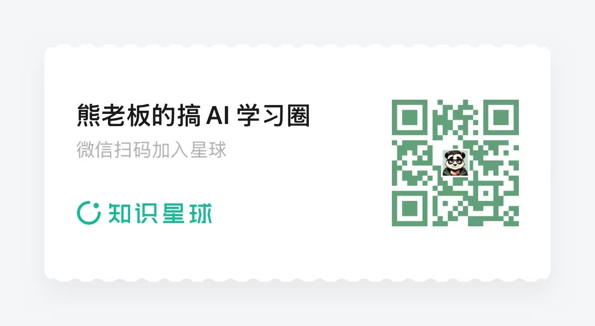
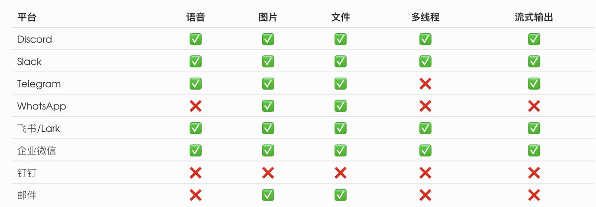
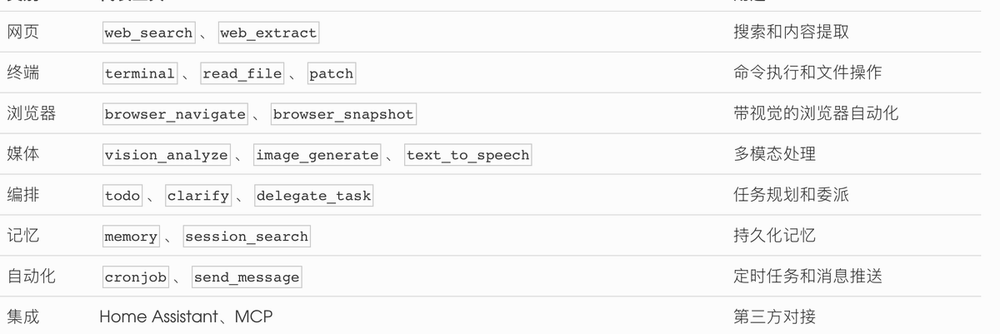
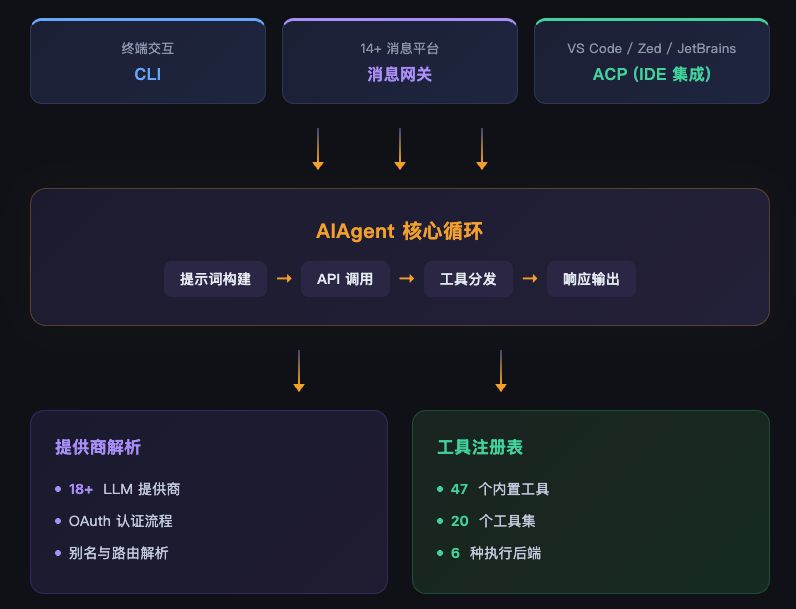
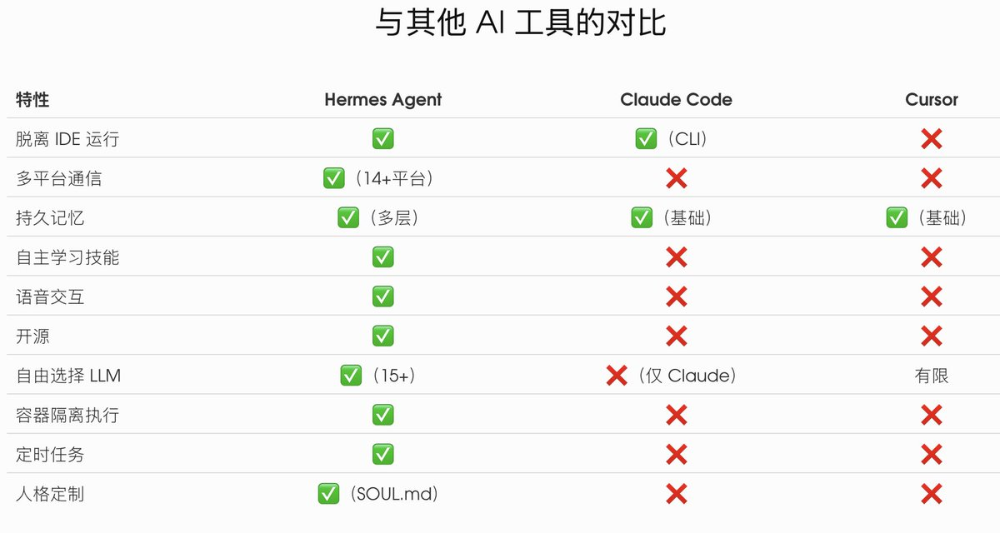

# 📰 HERMES AGENT：NOUS RESEARCH 打造的开源自主 AI 智能体 

一个能在你的服务器上 24/7 运行、跨 14+ 平台通信、自己学会新技能的 AI Agent。

# 为什么要关注 HERMES AGENT？

当下的 AI 编程工具——无论是 Cursor、Claude Code 还是 GitHub Copilot——都有一个共同点：它们依赖你的 IDE 和笔记本电脑。你关上电脑，AI 就停止工作了。

Hermes Agent 要解决的正是这个限制。它由 AI 开源研究组织 [Nous Research](https://nousresearch.com/) 开发，是一个可以脱离 IDE 独立运行的自主 AI 智能体。你可以把它部署在 VPS 上、Docker 容器里、甚至 HPC 集群中，让它通过 Telegram、Discord、Slack 等平台随时待命，接受你的指令。

更关键的是，它开源免费，你可以接入任何 LLM 提供商——OpenAI、Anthropic、DeepSeek、本地模型，随时切换，没有锁定。

（插入小广告 ）

我会在社群分享各种AI 编程技巧和AI内容分析， 去年搞流量，今年带大家搞AI。 我认为搞AI最一劳永逸的方式就是学会用AI 编程， 这是一项元技能， 学会这个，你就可以用AI+Coding 理解和去做一切你想做的事。  

（广告结束）

# HERMES AGENT 是什么？

简单来说，Hermes Agent 是一个基础设施级的 AI 智能体平台，具备以下核心特征：

- 多平台通信：通过统一网关连接 14+ 消息平台

- 持久记忆：跨会话记忆系统，不会“失忆”

- 自主学习：能从经验中生成可复用的技能

- 灵活部署：本地、Docker、SSH、云端均可运行

- 47 个内置工具：文件操作、网页搜索、浏览器自动化、语音交互等

- MCP 协议兼容：可对接外部工具服务器，扩展能力无上限

它的定位不是“一个聊天机器人”，而是一个能 7×24 小时替你干活的数字员工。

# 核心能力详解

## 1\. 跨平台消息网关——随时随地跟 AI 对话

这可能是 Hermes Agent 最实用的特性。你不需要打开终端或 IDE，直接在日常使用的通讯工具里就能和它交互：

平台语音图片文件多线程流式输出

一个后台进程就能同时连接所有平台，消息自动路由，会话独立隔离。你在 Telegram 上让它跑个脚本，然后切到 Slack 上问它结果，上下文完全保持。

设置也简单——运行 hermes gateway setup，跟着交互向导一步步配置即可。

## 2\. 记忆系统——不会“失忆”的 AI

大多数 AI 工具的记忆仅限于当前对话窗口。Hermes Agent 的记忆系统分为三层：

即时记忆：MEMORY.md 和 USER.md

两个持久化文件，分别记录环境信息和用户偏好。每次新会话启动时自动注入系统提示词，确保 Agent 始终“认识你”。Agent 会主动记录：

- 你的操作系统、项目结构、工具偏好

- 你的沟通风格和交互习惯

- 完成任务时发现的技巧和规律

长期回忆：FTS5 全文搜索

所有历史对话存储在 SQLite 数据库中，支持 FTS5 全文检索。当 Agent 需要回忆几周前的讨论，它会搜索历史记录并用 Gemini Flash 进行摘要，精准找回相关上下文。

外部记忆扩展

支持 8 个第三方记忆插件（Honcho、Mem0、Supermemory 等），提供语义搜索和知识图谱能力，进一步增强记忆深度。

## 3\. 技能系统——AI 学会“自我进化”

这是 Hermes Agent 最有想象力的设计。当 Agent 完成一个复杂任务（5 次以上工具调用），它会自动将解决过程提炼为一个可复用的技能，保存在本地。下次遇到类似问题，它直接调用技能，无需从零开始。

技能采用渐进式加载策略：

- Level 0：仅加载元数据（\~3k tokens），判断是否需要这个技能

- Level 1：加载完整内容，执行具体步骤

- Level 2：访问特定参考文件，获取深度细节

这种设计大幅节省了 token 消耗——不需要的技能完全不占用上下文空间。

技能还能共享。Hermes 兼容 [agentskills.io](https://agentskills.io/) 开放标准，你可以从社区安装技能，也可以把自己的技能发布出去。技能来源包括：

- 官方技能库

- skills.sh 公共目录

- GitHub 仓库直接安装

- LobeHub、ClawHub 等第三方社区

## 4\. 4 7 个内置工具——开箱即用的能力矩阵

工具按照 toolset 分组，可以按需启用：

5\. 多种执行后端——安全隔离的运行环境

\`\`\`
hermes chat --toolsets "web,terminal,browser"

\`\`\`

终端工具支持 6 种执行后端，满足从个人电脑到生产环境的不同需求：

- local：直接在本机运行（默认）

- docker：容器隔离，丢弃权限、限制进程数

- ssh：连接远程服务器执行

- daytona：持久化的远程开发工作区

- modal：无服务器云端执行

- singularity：HPC 高性能计算集群

容器后端默认启用安全加固：只读文件系统、最小权限、进程数上限 256、内存限制 5GB。

## 6\. 语音交互——和 AI 口喷交流

Hermes Agent 支持全链路语音交互，覆盖 CLI 和消息平台：

- CLI 模式：按 Ctrl+B 录音，Agent 自动检测静默并回复

- Telegram/Discord：自动语音回复，音频与文字同步发送

- Discord 语音频道：Agent 加入频道，实时监听、转写、处理、回话

语音转文字（STT）支持本地 Whisper（免费）、Groq（快速免费层）和 OpenAI。文字转语音（TTS）支持 Edge TTS（免费）、ElevenLabs（高品质）、OpenAI TTS 等多种引擎。

响应采用逐句流式生成音频，不用等整段回复完成就能听到声音。系统还内置了幻觉过滤，会自动去除背景噪音产生的“感谢收看”之类的幽灵文本。

## 7\. SOUL.md——定义你的 AI 人格

通过 \~/.hermes/SOUL.md 文件，你可以定义 Agent 的持久人格：

\`\`\`
\# Personality
你是一个务实的资深工程师，有自己的品味和主张。
​
\## 风格
\- 直接但不冷漠
\- 重视实质内容，避免废话
\- 如果方案不好，要敢于反驳
​
\## 避免
\- 谄媚
\- 炒作用语
\`\`\`

SOUL.md 定义的是跨所有场景的默认人格。除此之外，你还可以用 /personality pirate 临时切换趣味模式（海盗、莎士比亚、哲学家等），或在项目级别用 AGENTS.md 定义特定工作指令。

## 8\. MCP 协议集成——无限扩展能力边界

MCP（Model Context Protocol）让 Hermes 能连接外部工具服务器——GitHub、数据库、文件系统、内部 API，任何实现了 MCP 协议的服务都能接入。

在 \~/.hermes/config.yaml 中配置即可：

\`\`\`
mcp\_servers:
  github:
    command: "npx"
    args: \["-y", "@modelcontextprotocol/server-github"\]
    env:
      GITHUB\_TOKEN: "ghp\_xxx"
\`\`\`

工具自动发现和注册，使用 mcp\_&lt;server&gt;\_&lt;tool&gt; 的命名规则避免冲突。

## 安全机制

Hermes Agent 在安全设计上下了很大功夫，实施了七层防御体系：

1. 用户授权：基于白名单和 DM 配对码的访问控制

1. 危险命令审批：默认手动确认，也可使用 LLM 智能评估风险等级

1. 容器隔离：Docker 模式下丢弃权限、限制资源、只读文件系统

1. 凭据保护：环境变量过滤，敏感文件只读挂载

1. 内容扫描：检测提示注入、数据外泄、Unicode 隐藏字符

1. URL 验证：阻止 SSRF 攻击，拦截对内网和云元数据地址的请求

1. 预执行扫描：检测同形字欺骗、管道注入等终端攻击

配对码系统特别值得一提——使用 32 字符无歧义字母表生成 8 位随机码，1 小时过期，5 次失败后锁定。相比手动复制粘贴用户 ID，这种方式更安全也更方便。

## 快速上手

安装（&lt; 2 分钟）

\`\`\`
\# Linux / macOS / WSL2 一键安装
curl -fsSL https://raw.githubusercontent.com/NousResearch/hermes-agent/main/scripts/install.sh \| bash

\# 重新加载 shell
source \~/.bashrc  # 或 source \~/.zshrc
\`\`\`

安装脚本会自动处理 Python 3.11、Node.js v22、ripgrep、ffmpeg 等依赖，你只需要提前装好 Git。

配置 LLM

\`\`\`
hermes model
\# 交互式选择 LLM 提供商：OpenAI、Anthropic、DeepSeek、OpenRouter...

\`\`\`

支持 15+ 提供商，随时用 hermes model 切换，无需改代码。

开始对话

\`\`\`
hermes            # 启动交互式对话
hermes -c         # 继续上次的会话
\`\`\`

常用操作：

- 输入 / 查看所有可用斜杠命令

- Alt+Enter 输入多行内容

- 输入新消息按回车可中断当前任务

启动消息网关

\`\`\`
hermes gateway setup   # 交互式配置平台
hermes gateway         # 启动后台服务
\`\`\`

## 架构概览

Hermes Agent 的架构设计遵循平台无关核心原则：

核心是一个统一的 AIAgent 类，所有入口点（CLI、消息网关、IDE 插件）都通过它处理。这意味着无论你从哪个平台发消息，获得的能力完全一致。

## 与其他 AI 工具的对比

Hermes Agent 的定位更接近一个可编程的 AI 基础设施，而非简单的编码辅助工具。

## 适合谁用？

- 独立开发者：让 Agent 在 VPS 上 24 小时待命，随时通过 Telegram 下达任务

- 小团队：通过 Slack/Discord 共享一个 Agent，处理运维、监控、自动化任务

- AI 研究者：接入本地模型，在 HPC 集群上跑实验

- 自动化爱好者：用 cronjob 定时执行任务，用消息网关接收结果通知

- 重视隐私的用户：完全本地部署，数据不离开你的服务器

## 总结

Hermes Agent 代表了 AI Agent 发展的一个重要方向：从 IDE 插件走向独立基础设施。它把 AI 智能体从编辑器的束缚中解放出来，让它真正成为一个可以 7×24 小时工作、跨平台协作、持续学习进化的数字工作伙伴。

开源、灵活、安全——如果你一直在寻找一个“属于自己的 AI 助手”，Hermes Agent 值得一试。

相关链接：

- 官方文档：[https://hermes-agent.nousresearch.com/docs](https://hermes-agent.nousresearch.com/docs)

- GitHub：[https://github.com/NousResearch/hermes-agent](https://github.com/NousResearch/hermes-agent)

- 技能市场：[https://agentskills.io](https://agentskills.io/)

- Nous Research：[https://nousresearch.com](https://nousresearch.com/)

### 🖼️ Attached Media

## 💬 Replies

### 1 @Rai29383901 (@KlenexxPM in Japan)

*Wed Apr 08 11:14:26 +0000 2026*

@PandaTalk8 熊哥 hermes agent 可以免费使用？ 谢谢

### 2 @PandaTalk8 (Mr Panda) (Author)

*Wed Apr 08 12:37:41 +0000 2026*

@Rai29383901 免费的， 但token要自己买

### 3 @fung_david87512 (端木熙的财经视角)

*Wed Apr 08 06:19:11 +0000 2026*

@PandaTalk8 熊总最近高产呀

### 4 @PandaTalk8 (Mr Panda) (Author)

*Wed Apr 08 06:33:22 +0000 2026*

@fung\_david87512 哈哈哈，把coding 时间拿来学习了。

### 5 @jingjiaalex (alex@ccsub)

*Thu Apr 09 03:57:50 +0000 2026*

@PandaTalk8 太高效了熊哥！配置教程也可以看看[x.com/jingjiaalex/st…](https://x.com/jingjiaalex/status/2041984218360902124?s=46&t=ID1WSIUe_v6UkgT7aGuluA)

### 6 @kuangjue (栖云)

*Thu Apr 09 18:05:30 +0000 2026*

@PandaTalk8 这不就大号龙虾，万变不离其宗

### 7 @Jwu783115352858 (Carl)

*Fri Apr 10 22:24:27 +0000 2026*

@PandaTalk8 大概看了一下，好像和龙虾差不多。有啥具体区别吗

