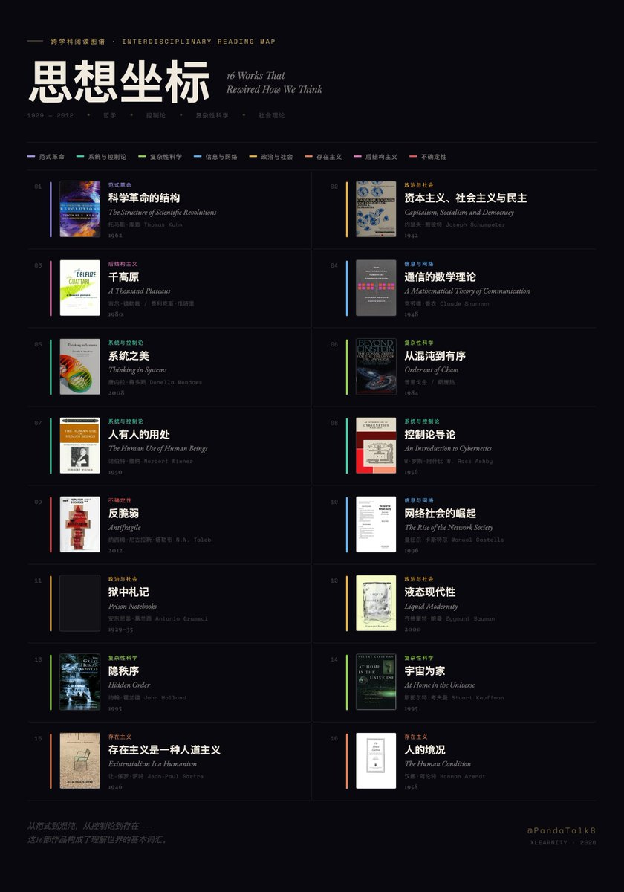
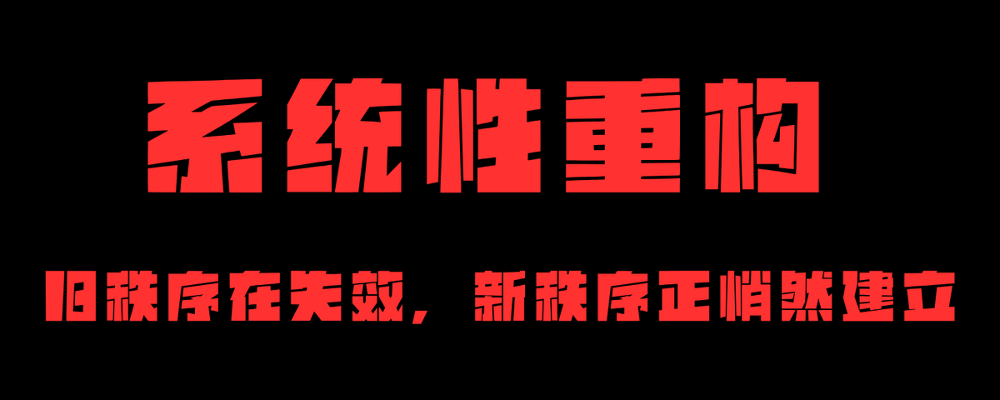
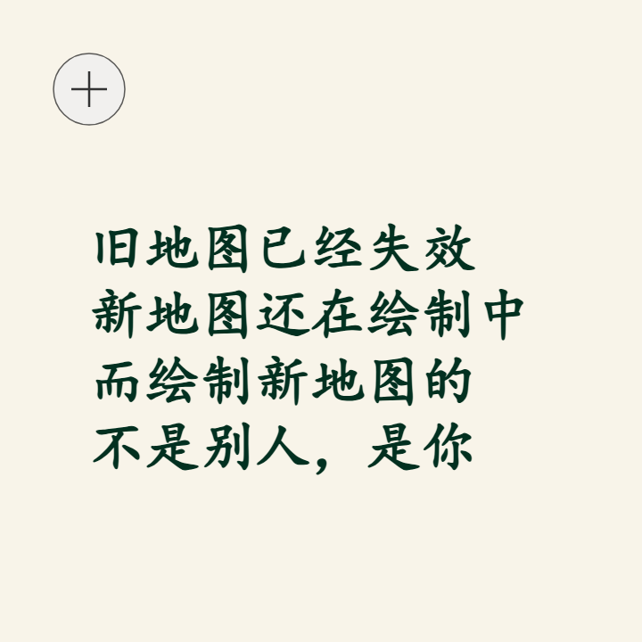
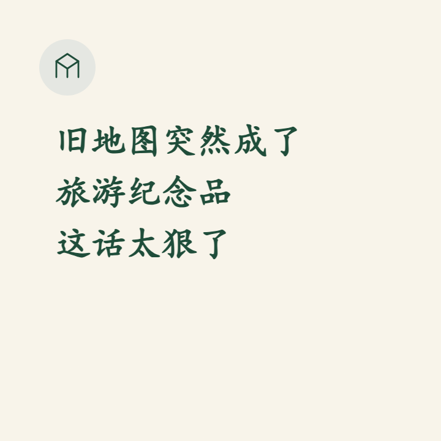
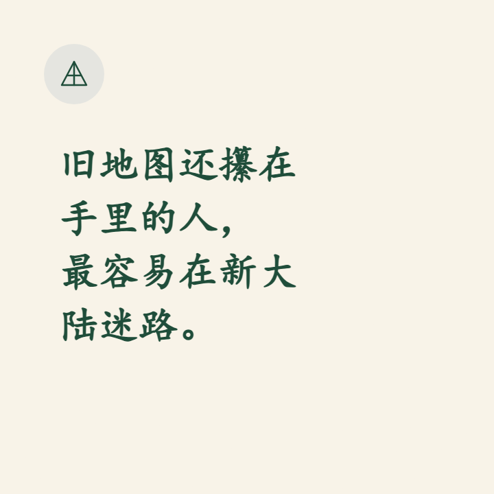
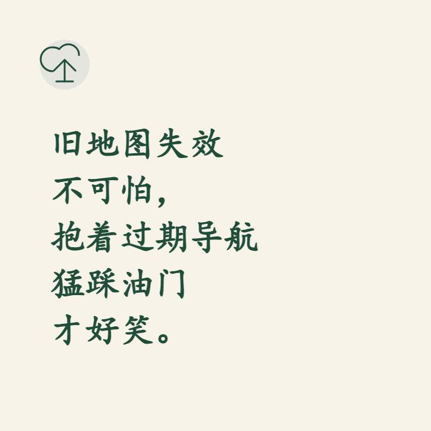
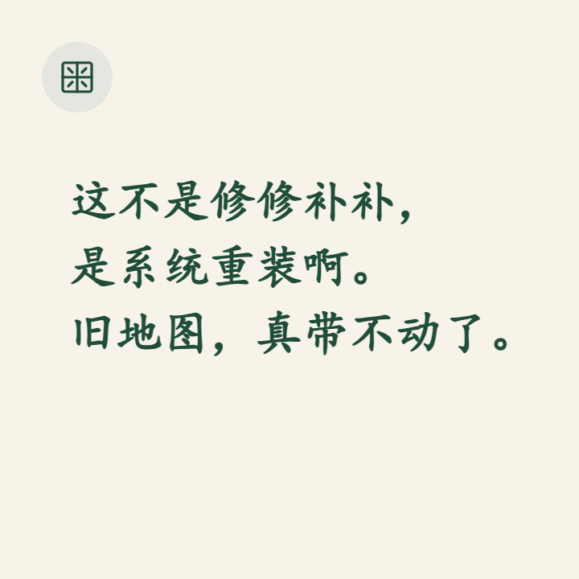
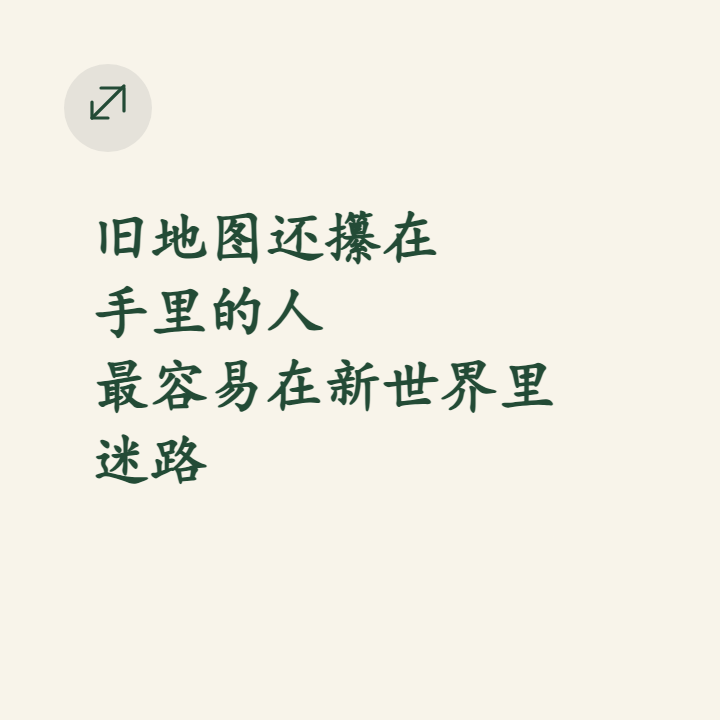
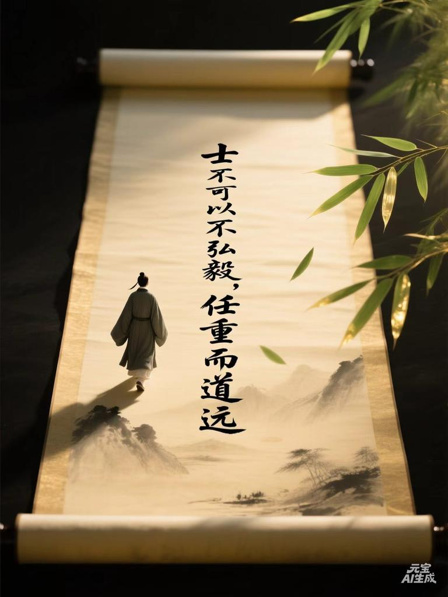

# 📰 范式转换不是旧框架的修修补补，而是整个世界观的更替（内含书单）

# 

> 这是一篇比较有哲学味道的文章，文中的观点几乎是最近几年我本人由一个旧秩序的工程师努力且艰难的适应新秩序、新时代的内在变迁的过程和结论。 对于技术背景来说我多少还是会认为这篇文章颇具煽动性，没有能保持应该有的克制。  

> 这也是我自己的一个突破，我们从小被教育做人做事要克制，要谦虚，但是很少会鼓励要自信、要大胆的讲出自己的认为的世界，我们每个人都有自己的世界观。  如果没有你， 这个世界也变得毫无意义。  

> 因此，我仍然为认为，新的时代，作为一个主权个体，不能过于克制，而是敢于发声，能在这个噪声极高的世界里，拥有放大声量的权力和能力，对于AI时代的公民来讲更为重要。  

（下面是正文）

# 旧秩序在崩溃，新秩序正在形成

你有没有一种感觉——这个世界的底层代码正在被重写？

不是某一个行业在变，不是某一个国家在变，而是所有你曾经以为"理所当然"的东西，都在同时松动。你站在上面，脚下的地板在晃，但你说不清楚哪里在晃，只知道——不稳了。

科学哲学家托马斯·库恩在《科学革命的结构》中说过：范式转换不是旧框架的修修补补，而是整个世界观的更替。当旧范式积累了太多无法解释的"异常"，它不会慢慢改良——它会突然坍塌，被一个全新的范式取代。我们正在经历的，就是这样一次范式转换。不是某个行业的调整，而是整个社会运行范式的更替。

稳定的工作没了。大厂的光环碎了。学历的溢价在消失。房子不再只涨不跌。存款利率趋近于零。养老金的未来充满问号。你从小被灌输的那一整套人生公式——好好读书→考好大学→进大公司→买房结婚→稳定到退休——这个公式的每一个环节，都在出问题。

这不是某个环节出了 bug，是整个操作系统在崩溃。

而与此同时，一个新的操作系统正在悄悄启动。它还没有完全成形，大多数人还看不清它的轮廓，但如果你仔细观察，信号已经无处不在。

这篇文章，我想聊聊：什么在崩溃，什么在形成，以及我们该如何在新旧秩序的交替中，找到自己的位置。

## 一、正在崩溃的旧秩序

## 1\. 雇佣制的黄金时代结束了

20 世纪最伟大的社会发明之一，是"稳定的全职雇佣"。你把时间和技能卖给一家公司，公司给你工资、社保、归属感和职业身份。这个契约支撑了几代人的人生规划。

但这个契约正在被撕毁。

不是因为企业变坏了，而是因为支撑这个契约的底层逻辑变了。经济学家熊彼特在《资本主义、社会主义与民主》中早就预见了这种力量——他称之为"创造性毁灭"：资本主义的本质不是守成，而是不断从内部瓦解旧结构，在废墟上建造新结构。每一次重大技术变革，都是一轮创造性毁灭。蒸汽机毁灭了手工作坊，电力毁灭了蒸汽工厂，互联网毁灭了传统媒体。而这一次，AI 正在毁灭的，是"规模化雇佣"这个存在了一百年的组织范式。

过去，企业的核心竞争力是规模——人越多，能做的事越多，边际成本越低。一千个工程师的公司，能做一百个工程师做不了的事情。

AI 改变了这个等式。

2025 年，一个人加上 AI，能做过去十个人的工作。一个三人小队加上 AI 工作流，能产出过去一个五十人部门的成果。企业不再需要"规模"来获得竞争力，它需要的是"密度"——少数真正优秀的人，加上强大的 AI 系统。

结果就是：企业在变小，但变得更强。多出来的人呢？他们被"释放"了——这是公关话术。真实的说法是，旧契约不再需要这么多签约方了。

这不是个别企业的选择，这是整个雇佣体系的结构性收缩。未来的"全职员工"会越来越少，越来越精英化。大多数人的工作形态，将从"被一家公司雇佣"变成其他什么东西——我们后面再说那个"什么东西"是什么。

## 2\. 线性职业路径消亡了

过去有一条清晰的梯子：初级→中级→高级→经理→总监→VP。你只要不犯大错，时间到了就往上爬一格。整个社会对"成功"的定义，就是你在这条梯子上爬到了第几格。

这条梯子正在消失。

一方面，AI 首先替代的就是中间层。初级员工还有学习和成长的价值，高级专家有不可替代的判断力和创造力，但中间那一大批"执行+协调+传话"的角色——AI 做得比他们更快、更准、不请假、不抱怨。

另一方面，知识和技能的半衰期急剧缩短。你花五年学会的东西，可能两年后就过时了。你今年是"资深 React 工程师"，明年整个前端框架可能就被 AI 生成替代了。爬梯子的前提是梯子是固定的，但现在梯子本身在不停地变。

未来的职业路径不再是一条梯子，更像是一片丛林——你需要不停地探索、转向、适应，而不是沿着一条固定的路往上走。

哲学家德勒兹和瓜塔里在《千高原》中提出过一个精妙的隐喻：根茎（rhizome）。树状结构有固定的根、干、枝——从底部到顶部，层级分明，路径唯一。但根茎不一样，它没有中心，没有层级，任何一个点都可以连接到任何另一个点，向任何方向生长。旧秩序的职业路径是一棵树，新秩序的职业路径是一张根茎网络——没有"正确的路"，只有"你走出来的路"。

## 3\. 学历的信号价值在崩塌

学历本质上是一个信号机制：你能考上 985/211，说明你智商不差、自律性强、能在竞争中胜出。企业没有时间一个个考察候选人，学历就是一个高效的筛选器。

用信息论之父克劳德·香农在《通信的数学理论》中提出的框架来理解：学历是一个低带宽、高噪声的信号通道。它试图用一个简单的标签（"985 毕业"），来压缩传输一个人全部的能力信息。在信息匮乏的年代，这种粗糙的压缩是够用的——因为没有更好的替代方案。但 AI 时代打开了一条高带宽、低噪声的新通道：你的作品、你的代码、你的产品，可以被直接检验、实时评估。当信号通道升级了，旧通道自然被废弃。

所以 AI 正在让这个信号贬值。

当一个没有学历的人用 AI 做出的产品，比一个名校毕业生手写的代码更好时——企业为什么还要为学历付溢价？当 AI 可以在几秒内评估一个人的真实能力时——学历这个粗糙的代理指标还有什么用？

我们正在进入一个"Show me, don't tell me"的时代。你做过什么，比你毕业于哪里重要一百倍。你的 GitHub 仓库、你的产品 Demo、你的内容作品集——这些可验证的成果，正在取代那张纸的位置。

这不意味着教育没有价值——教育的价值在于思维训练和认知升级，而不是那个学位证书。但大多数人上大学的真实动机，是为了那张纸，而不是那个过程。当那张纸不再值钱，整个教育产业的根基就开始动摇。

## 4\. 房产作为"人生锚点"的逻辑在松动

过去三十年，中国社会有一个根深蒂固的信念：买房是人生最重要的投资。它不仅是住所，还是婚姻的入场券、社会地位的标志、财富增值的工具、安全感的来源。整个社会的运转——从银行贷款到丈母娘的要求——都建立在"房价会一直涨"这个假设之上。

这个假设已经破了。

不只是因为房价在跌。更深层的原因是，支撑高房价的那些底层条件在变化：人口在减少，城市化在放缓，远程办公在普及（AI 时代更是如此），年轻人对"必须买房"的执念在松动。

当房子不再承担"财富增值"的功能时，它就回归了本来面目——一个住的地方。而一个住的地方，不需要掏空六个钱包、背上三十年债务来获得。

这个观念的转变会很慢，因为它太根深蒂固了。但趋势已经不可逆。

## 5\. "铁饭碗"叙事的全面破产

公务员、事业编、国企——这些曾经被认为是"永远不会失业"的避风港。

但体制内的日子也不好过了。财政收入下降，编制在缩减，待遇在降低。更要命的是，AI 对行政性、流程性工作的替代，体制内外一视同仁。当一个 AI 系统可以处理 90% 的行政审批流程，窗口后面还需要那么多人吗？

"铁饭碗"的本质是什么？是用可预测性换可能性——你放弃了高收入和自由度，换来了稳定和安全。但当连"铁饭碗"都不再铁的时候，这个交换就变成了一个坏买卖：你放弃了可能性，但并没有得到承诺的可预测性。

以上这些，不是五个独立的问题，而是同一个问题的五个侧面：支撑过去三十年社会运转的那一套游戏规则，正在系统性地失效。

系统科学家唐内拉·梅多斯在《系统之美》中指出：一个系统最大的脆弱性，往往不在于某个零件坏了，而在于系统的底层"范式"——人们对系统的共同信念——出了问题。改变范式，是系统变革中最高层级的杠杆点，一旦触发，整个系统的行为都会随之改变。雇佣制、学历、房产、铁饭碗，这些都不是独立的"零件故障"，而是同一个底层范式——"稳定增长、线性上升、规模为王"——在全面失效之后的连锁反应。

就像一栋大楼，不是某面墙裂了，而是地基在下沉。你修墙没有用，因为问题在地基。

这就是"旧秩序在崩溃"的意思。

## 二、正在形成的新秩序

旧秩序的崩溃让人恐惧，但历史告诉我们：每一次旧秩序的崩溃，都伴随着新秩序的形成。农业社会崩溃，工业社会诞生。工业社会的某些规则瓦解，信息社会接棒。每一次转型都伴随着巨大的痛苦，但回头看，新秩序总是比旧秩序创造了更多的可能性。

诺贝尔奖得主伊利亚·普里戈金在《从混沌到有序》中揭示了一个深刻的物理学原理：耗散结构——一个远离平衡态的系统，在看似"混乱"的波动中，反而能自发涌现出更高级的有序结构。旧的平衡被打破，不是通向毁灭，而是通向更复杂、更高级的组织形态。混沌不是终点，混沌是新秩序的产房。

那么这一次，新秩序长什么样？

虽然它还没有完全成形，但轮廓已经越来越清晰了。

## 1\. 从"被雇佣"到"被连接"

旧秩序里，你的经济身份是"某公司的员工"。新秩序里，你的经济身份是"某个网络中的节点"。

什么意思？

未来的主流工作形态，不是你属于一家公司，而是你同时连接多个项目、多个团队、多个收入来源。你可能上午为一个创业项目做产品设计，下午给另一个团队做 AI 工作流咨询，晚上经营自己的自媒体账号。你不属于任何一个组织，但你连接着很多。

这不是"打零工"。打零工是被动的、低技能的、没有积累的。新秩序里的"连接式工作"是主动的、高技能的、有复利效应的——你每一次合作都在积累声誉、作品和关系网络，这些资产属于你自己，而不是属于某家公司。

社会学家曼纽尔·卡斯特尔在《网络社会的崛起》中早就预言了这个趋势：21 世纪的核心社会结构不是等级制，而是网络。权力不再属于金字塔顶端的人，而属于网络中连接最多、信息流通最快的节点。你的价值不取决于你在哪家公司的组织架构里占据哪个位置，而取决于你在多少个有价值的网络中，扮演了不可替代的连接角色。

Solo Founder（一人公司）、自由职业联盟、DAO（去中心化自治组织）、项目制小队……这些新型组织形态正在快速生长。它们的共同特点是：轻量、灵活、以人为核心，而不是以职位为核心。

## 2\. 从"积累知识"到"驾驭工具"

旧秩序里，竞争力来自"你知道什么"——你掌握了某个领域的专业知识，这就是你的壁垒。

新秩序里，竞争力来自"你能用工具做什么"——知识已经被 AI 民主化了，每个人都能在几秒内获得几乎任何领域的专业知识。真正的差异化不再是知识本身，而是运用知识的能力。

控制论之父诺伯特·维纳在《人有人的用处》中早就洞见了这一点。他认为，人最本质的优势不在于计算和记忆，而在于设定目标、构建反馈回路、在不确定环境中做出价值判断。机器擅长的是执行和优化，人擅长的是定义"什么值得优化"。AI 时代把这个区分推到了极致——当执行层面的能力被 AI 拉平，人与人之间的真正差距，就体现在"驾驭"层面。

具体来说，新秩序里最有价值的三种能力是：

- 提问能力：能问出正确的问题，比能回答问题重要得多。AI 是一台强大的答案机器，但它需要人来输入正确的问题。

- 整合能力：能把不同领域的知识、工具和资源整合在一起，创造出新的东西。AI 擅长在单一领域内深入，但跨领域的连接和整合，仍然是人的领地。

- 判断能力：AI 可以给你十个方案，但选哪个、为什么选、选了之后怎么执行——这些判断，需要经验、直觉和价值观，AI 目前还给不了。

教育的重点也应该从"传授知识"转向"训练这三种能力"。但这个转变需要时间，因为整个教育体系的惯性太大了。

## 3\. 从"规模经济"到"个体经济"

旧秩序的经济逻辑是规模效应——越大越强，赢家通吃。沃尔玛比街角小店有优势，因为它能压低采购成本。大厂比小公司有优势，因为它能投入更多资源。

AI 正在瓦解这个逻辑。

当一个人加上 AI 就能做出一个产品、运营一个品牌、服务一群客户时，规模不再是必要条件。小而美的个体和小团队，可以在越来越多的领域和大公司正面竞争。

我们已经看到了信号：

- 一个人用 AI 做出的 SaaS 产品，月收入超过十万美元

- 一个人运营的自媒体账号，影响力超过一个编辑团队

- 一个三人团队做的独立游戏，下载量超过了大厂的 3A 作品

这不是个例，这是趋势。AI 是一个巨大的"去规模化"力量——它把过去只有大组织才拥有的能力，下放给了每一个个体。

新秩序里，最基本的经济单元不再是"公司"，而是"个体+AI"。

## 4\. 从"确定性追求"到"反脆弱设计"

旧秩序里，人生的最高追求是确定性——稳定的工作、可预期的收入、确定的未来。整个社会的制度设计——学历、社保、养老金、房贷——都是围绕"确定性"来构建的。

但新秩序的底色是不确定性。技术在加速变化，行业在快速迭代，今天有效的技能明天可能过时，今天存在的岗位明年可能消失。追求确定性，在一个根本性不确定的世界里，是一种注定失败的策略。

控制论学者W·罗斯·阿什比在《控制论导论》中提出了一条铁律——必要多样性定律：一个系统要想存活，它内部的多样性必须大于或等于环境的多样性。翻译成人话就是：外部变化越快、越不可预测，你自身的应变能力和选择空间就必须越大。一个只有一份收入、一种技能、一条路径的人，在高波动的环境里极其脆弱——因为他的"内部多样性"远远低于环境的复杂度。

纳西姆·塔勒布在《反脆弱》中把这个逻辑推到了更激进的层面。他说，新秩序需要的不是确定性，甚至不是"坚韧"（resilience），而是反脆弱性——不是"不会被打倒"，而是"每次被打倒都能变得更强"。脆弱的事物害怕波动，坚韧的事物忍受波动，而反脆弱的事物从波动中获益。

反脆弱的人生设计是什么样的？

- 多元收入：不把所有鸡蛋放在一个篮子里。工资只是收入之一，还有副业、投资、内容、产品……

- 可迁移技能：不绑定在某个特定岗位或行业上。计算思维、沟通能力、学习能力——这些技能在任何领域都有价值。

- 低固定成本：三十年房贷是确定性思维的产物。在不确定的世界里，保持轻装上阵，保留选择权，比拥有资产更重要。

- 持续学习：不是"学完了就可以吃一辈子"，而是"学习本身就是生活方式"。

## 5\. 从"物质占有"到"体验和连接"

旧秩序里，成功的标志是拥有——拥有房子、车子、名牌包、高消费的生活方式。社会地位通过物质符号来衡量。

新秩序里，价值的定义正在悄然变化。越来越多的人——尤其是年轻一代——开始意识到：拥有东西不等于拥有幸福。

什么是真正有价值的？

- 有意义的体验：一次深度旅行、一个让你心流涌动的项目、一场改变你认知的对话

- 真实的人际连接：三五个可以在凌晨三点打电话的朋友，比一千个微信好友有价值得多

- 持续的成长感：昨天不会的事今天会了，上个月想不通的问题这个月想通了——这种感觉带来的满足，远超物质消费

- 自主权：能选择做什么、不做什么、跟谁一起做——对自己时间和生活的掌控感

AI 时代会加速这个转变。当物质生产的成本持续降低，物质的稀缺性消失，"拥有"就不再是地位信号。真正稀缺的，是体验的深度和连接的质量。

## 三、转型期：我们正站在中间地带

最难的不是旧秩序，也不是新秩序，而是中间地带。

我们正站在这里。

意大利思想家安东尼奥·葛兰西在《狱中札记》里写过一句令人不寒而栗的话："旧世界正在消亡，新世界还在艰难诞生，在这过渡期间，各种各样的病态症状纷纷涌现。"他说的是 20 世纪 30 年代的欧洲，但用来形容今天，精确得可怕。

社会学家齐格蒙特·鲍曼在《液态现代性》中给这种状态起了一个名字：液态社会。固态社会有明确的容器——制度、路径、身份——一切都有形状、有边界。但液态社会里，这些容器都在融化，一切都在流动，没有什么能保持固定的形状。你感受到的那种"不确定""不安全""不知道该抓住什么"——不是你的错，是整个社会从固态变成了液态。

旧秩序的规则还没有完全失效——你还是需要工作、需要收入、需要在现有的社会系统里生活。新秩序的规则还没有完全建立——没有成熟的范式可以参考、没有明确的路径可以跟随。

这种"两头不靠"的感觉，是转型期最折磨人的地方。

你心里知道旧路走不通了，但新路在哪里？你看到了一些先行者走出了新路，但那条路适合你吗？你想改变，但家庭、贷款、责任把你锚定在原地。你想行动，但信息太多、方向太多，反而动弹不得。

转型期的生存法则，跟稳定期完全不同。

稳定期的最优策略是优化——在既有规则内做到最好。考最高的分，进最好的公司，爬最高的位置。

转型期的最优策略是探索——用最小的成本，尝试最多的可能性，快速找到适合自己的方向。不是"想清楚再行动"，而是"在行动中想清楚"。

具体来说：

1\. 保住基本盘，释放探索空间

不要裸辞，不要 All in，不要把生存和探索搅在一起。先确保基本的生活需求有保障，然后用业余时间、用周末、用晚上的两个小时来探索新可能。这不是胆小，这是智慧。

2\. 小步快跑，快速试错

不要花半年做一个"完美的计划"。花一个周末做一个最小可行产品（MVP），发出去，看看反馈。AI 时代，试错成本已经低到令人发指——一个周末就能做出过去一个月才能做出的东西。

3\. 建立连接，找到同行者

转型期最危险的事情是孤立。一个人在迷雾中摸索，很容易走偏或者放弃。找到和你处境相似、价值观相近的人，互相分享信息、互相打气、互相提供不同的视角。

4\. 投资自己，而不是投资资产

在旧秩序里，最好的投资是买房——因为资产会升值。在转型期，最好的投资是提升自己的能力——因为能力是唯一在任何秩序下都有价值的东西。花钱学 AI，花时间练技能，花精力建立个人品牌——这些投资的回报率，远高于任何理财产品。

5\. 调整心理预期

转型期的不确定性会持续很长时间。不要期待"等一等就好了"，不要期待某个"权威"告诉你正确答案。学会与不确定性共处，把它当作常态而不是异常。能做到这一点的人，已经赢了一半。

## 四、新秩序需要新社区

读到这里，你可能已经发现了：新秩序对个体的要求，比旧秩序高得多。

旧秩序只需要你做一个合格的"零件"——在自己的位置上完成本职工作就行了。系统会照顾你，公司会培养你，社会有一套现成的轨道让你跑。

新秩序要求你做一个完整的"人"——你需要自己定义方向，自己选择工具，自己承担风险，自己创造价值。没有现成的轨道了，你得自己修路。

这个要求是不是太高了？对一个人来说，确实太高了。

但如果有一群人一起呢？

这就是为什么新秩序不仅需要新技能，还需要新社区。

复杂性科学的研究者们（从圣塔菲研究所的约翰·霍兰德在《隐秩序》中提出的理论，到斯图尔特·考夫曼在《宇宙为家》中的拓展）发现了一个规律：复杂适应系统（Complex Adaptive Systems）的智慧不在于任何单一个体，而在于个体之间的交互模式。蚁群中没有一只蚂蚁理解全局，但蚁群作为整体能做出惊人的复杂决策。大脑中没有一个神经元"知道"你在想什么，但神经元网络的涌现产生了意识。

新社区的价值，正是这种涌现智慧——不是旧式的"行业协会"或"校友会"，那些是旧秩序的产物，围绕职位和身份来组织。新社区应该围绕价值观和成长来组织：

- 你相信什么？你想成为什么样的人？

- 你在探索什么？你遇到了什么困难？

- 你能分享什么？你需要什么帮助？

在这样的社区里，一个程序员可以从一个厨师那里学到创造力，一个全职妈妈可以从一个创业者那里学到时间管理，一个 55 岁的退休教师可以从一个 22 岁的 AI 极客那里学到新工具——同时，也把自己几十年的人生智慧传递给年轻人。

好的社区不是一群相同的人聚在一起取暖，而是一群不同的人聚在一起进化。用复杂性科学的语言说，这叫"混沌边缘"——考夫曼发现，系统在过于有序和过于混乱之间的临界点上，创新能力最强。太同质会僵化，太杂乱会崩溃，而多样性中保持共识的社区，恰好站在这个最有创造力的边缘。

（插个广告，我正在构建的 xlearnity.ai  正是要做一个面向未来一群不同的人聚在一起社区一起进化）

## 结语：做旧秩序的叛逃者，新秩序的建设者

每一次秩序更替，都会产生两种人。

一种人紧紧抓住旧秩序不放，在废墟中寻找残存的安全感。他们不是不聪明，是被沉没成本绑住了——"我已经在这条路上走了这么久，不能白走。"他们等待旧秩序恢复，但旧秩序不会恢复。

另一种人选择走进未知。他们不一定看清了新秩序的全貌，但他们知道方向比地图重要。他们在探索中学习，在行动中调整，在跌倒中成长。历史最终证明，新秩序是由这些人建造的。

存在主义哲学家萨特在《存在主义是一种人道主义》中说："人首先存在，然后才定义自己。"你不是被预先设定好的零件，你是在行动中创造自己的主体。没有什么"命中注定的人生轨迹"——在旧秩序里没有，在新秩序里更没有。你的身份不是别人给你贴的标签，而是你用行动写出来的故事。

你想做哪种人？

如果你的答案是后者，我想告诉你：你不需要孤军奋战。

旧秩序在崩溃，新秩序正在形成。这个过程不可逆转，不可加速，也不可回避。你唯一能选择的是——你站在哪一边。

站在旧秩序这一边，你会越来越安全地走向一个越来越不安全的未来。

站在新秩序这一边，你会经历不确定性和恐惧，但你也会找到前所未有的自由、创造力和可能性。

哲学家汉娜·阿伦特在《人的境况》中区分了三种人类活动：劳动（维持生存）、工作（制造世界）和行动（开创新事物）。旧秩序把大多数人困在了"劳动"层面——出卖时间换取生存。新秩序给了每个人进入"行动"层面的机会——用创造力在世界上留下你独特的印记。

旧地图已经失效。新地图还在绘制中。

而绘制新地图的，不是别人，是你。

## 推荐阅读

1. 托马斯·库恩，《科学革命的结构》（The Structure of Scientific Revolutions），1962

1. 约瑟夫·熊彼特，《资本主义、社会主义与民主》（Capitalism, Socialism and Democracy），1942

1. 吉尔·德勒兹、费利克斯·瓜塔里，《千高原》（A Thousand Plateaus），1980

1. 克劳德·香农，《通信的数学理论》（A Mathematical Theory of Communication），1948

1. 唐内拉·梅多斯，《系统之美》（Thinking in Systems），2008

1. 伊利亚·普里戈金、伊莎贝尔·斯唐热，《从混沌到有序》（Order out of Chaos），1984

1. 诺伯特·维纳，《人有人的用处》（The Human Use of Human Beings），1950

1. W·罗斯·阿什比，《控制论导论》（An Introduction to Cybernetics），1956

1. 纳西姆·尼古拉斯·塔勒布，《反脆弱》（Antifragile），2012

1. 曼纽尔·卡斯特尔，《网络社会的崛起》（The Rise of the Network Society），1996

1. 安东尼奥·葛兰西，《狱中札记》（Prison Notebooks），1929–1935

1. 齐格蒙特·鲍曼，《液态现代性》（Liquid Modernity），2000

1. 约翰·霍兰德，《隐秩序》（Hidden Order），1995

1. 斯图尔特·考夫曼，《宇宙为家》（At Home in the Universe），1995

1. 让-保罗·萨特，《存在主义是一种人道主义》（Existentialism Is a Humanism），1946

1. 汉娜·阿伦特，《人的境况》（The Human Condition），1958

### 🖼️ Attached Media

## 💬 Replies

### 1 @SDVIP888 (再生引擎)

*Wed Mar 25 11:11:31 +0000 2026*

@PandaTalk8 感谢Panda大佬的推荐，书已找齐，需要自取，「系统性重构书单」链接：[pan.quark.cn/s/41589821bc41](https://pan.quark.cn/s/41589821bc41)

### 2 @shitunote (马识途)

*Wed Mar 25 00:15:21 +0000 2026*

@PandaTalk8 拜读雄文 颇有收获 

新秩序需要新思维 诚哉斯言

### 3 @WarmGem (温识Winston)

*Wed Mar 25 14:57:24 +0000 2026*

@PandaTalk8 新秩序的图景被画得太干净了，而我们脚下的泥泞才是真正需要处理的东西。

### 4 @Cander_zhu (Cander)

*Thu Mar 26 12:41:29 +0000 2026*

@PandaTalk8 Panda 老师的这篇文章，串联了好多本书，
每本书都被Panda老师简而言之的概括出来了

### 5 @snowboat84 (snowboat)

*Wed Mar 25 00:10:06 +0000 2026*

@PandaTalk8 熊老板是哲学家啊！向熊老板清教，在新秩序下，是不是大部分人都会失业，形成少数精英+大多数暴民的不稳定社会结构？

### 6 @Yangtze07 (Yangtze阳子江)

*Wed Mar 25 00:04:52 +0000 2026*

@PandaTalk8 人类本能的对“确定性”的本能需求（进化心理学上，稳定=生存优势）。新秩序下，整体社会幸福感大概率会U型反弹：过渡期（未来5-10年）谷底很深（焦虑、失业、意义危机），新范式下人性的东西还会在，只是换了一种形式，彻底的改变需要新一代圣人。

### 7 @zfs2018 (Fengsheng Zhao)

*Wed Mar 25 03:57:21 +0000 2026*

当旧秩序崩溃时，最先消失的，不是工作，而是“被承认的方式”。
在旧世界里，你是谁，是由系统替你定义的：
你在哪家公司，你是什么职位，你毕业于哪里，你住在哪套房子。
这些标签，构成了你的“存在证明”。
但当这些标签全部失效，一个更根本的问题浮现出来：

👉 如果没有公司、没有学历、没有组织，你是谁？

更进一步：

👉 如果没有人记录，你存在过吗？

新秩序强调连接、个体、创造力。

但它有一个致命缺口：
它没有“记账系统”。
工业时代，有公司记账
国家时代，有户籍记账
互联网时代，有平台记账
但个体时代呢？

👉 谁来记录一个普通人的一生？

这就是“昨日银行”要解决的问题。

它不是一个内容平台，也不是一个写作工具。

它是一套新秩序下的底层设施：

👉 为每一个人，建立“存在的记录权”。

在这个系统里：

你的经历可以被记录

你的作品可以被归档

你的身份可以被编号

你的记忆可以被保存

不是作为数据

而是作为“被承认的一段人生”

如果说旧秩序的核心资产是：

房子
学历
职位

那么新秩序的核心资产将变成：
👉 你的记录、你的表达、你的生命轨迹

而“昨日银行”，就是：

👉 新秩序里的“人生账本”

### 8 @20mprofitai (20xbrights)

*Mon Mar 30 02:33:15 +0000 2026*

@PandaTalk8 拜读雄文，不仅深而且广

### 9 @Linyuan_Milesya (林远)

*Wed Mar 25 03:15:14 +0000 2026*

@PandaTalk8 太有深度了
熊老板的阅读量可不是一般大的呀
处处引经据典👍🏻

### 10 @zfs2018 (Fengsheng Zhao)

*Wed Mar 25 03:50:56 +0000 2026*

@PandaTalk8 我觉得我现在做的昨日银行也走在这条路上，只是我还没有熊老板的号召力

### 11 @ReyJudgementOS (Rey英语自由｜判断位)

*Wed Mar 25 13:32:17 +0000 2026*

@PandaTalk8 熊猫雄文！
AI的冲击不仅影响到成年人，
对孩子们的影响可能更甚
未来的高上限选项，不会在传统路径中。
只会出现在：
新技术
新内容
新社区
新需求
[x.com/ReyJudgementOS…](https://x.com/ReyJudgementOS/status/2033833510587535806)

### 12 @davidsouza676 (来用兵-纸上用兵)

*Sat Jun 13 22:41:50 +0000 2026*

@PandaTalk8 哇 说得好哇  
老哥你把我这几年的纠结都总结完了  
新旧世界之间 我选择自己造路 

### 13 @davidsouza676 (来用兵-纸上用兵)

*Fri Jun 12 14:19:08 +0000 2026*

@PandaTalk8 不是世界变快了，  
是旧地图突然成了旅游纪念品啊。

会说的人不一定都对，  
但不敢说的人，大概率已经掉线了。 

### 14 @davidsouza676 (来用兵-纸上用兵)

*Fri Jun 12 14:17:10 +0000 2026*

@PandaTalk8 这不是鸡汤，这是系统升级提示。

旧地图还攥在手里的人，最容易在新大陆迷路啊。 

### 15 @davidsouza676 (来用兵-纸上用兵)

*Fri Jun 12 14:15:06 +0000 2026*

@PandaTalk8 这不是鸡汤，这是系统升级说明书啊。

旧地图失效不可怕，
还抱着过期导航猛踩油门，才是真的好笑。 

### 16 @davidsouza676 (来用兵-纸上用兵)

*Fri Jun 12 14:13:04 +0000 2026*

@PandaTalk8 这不是修修补补，是系统重装啊。

旧地图还攥在手里的人，最容易在新路口罚站，哈。 

### 17 @davidsouza676 (来用兵-纸上用兵)

*Fri Jun 12 09:56:43 +0000 2026*

@PandaTalk8 这不是鸡汤，是系统升级提示。

旧地图还攥在手里的人，最容易在新世界里迷路啊。 

### 18 @li_ke_nan (李科男)

*Wed Mar 25 14:54:39 +0000 2026*

@PandaTalk8 所有文章质量都很高，学习\~

### 19 @wangyg (Denis Wang)

*Wed Mar 25 13:47:17 +0000 2026*

@PandaTalk8 好文章！

### 20 @tanzhengmc97 (TZ)

*Tue Mar 24 16:50:17 +0000 2026*

@PandaTalk8 先点样了再说

### 21 @orionxyz789 (Orion)

*Wed Mar 25 02:39:59 +0000 2026*

@PandaTalk8 超级个体，精专特公司，少数全球大平台构建未来经济生态系统。

### 22 @OqfnsRfl13DpOk7 (李晓明)

*Wed Mar 25 02:18:09 +0000 2026*

@PandaTalk8 你提供的网址访问密码是多少？

### 23 @zjjsas007 (不是NEO)

*Wed Mar 25 01:48:17 +0000 2026*

@PandaTalk8 先存起来再看、再拆解

### 24 @jiehuiliu311067 (jiehui liu)

*Wed Mar 25 03:41:43 +0000 2026*

@PandaTalk8 写的很好

### 25 @jeffreyning (jeffrey)

*Wed Mar 25 06:10:43 +0000 2026*

@PandaTalk8 你这些书从哪儿找的，我在微信读书里找不到，很多都没上架。

### 26 @qct0215 (GGGrandpa)

*Thu Mar 26 04:53:16 +0000 2026*

@PandaTalk8 这篇文章是在卖书吗？

### 27 @PandaMing88 (Ming)

*Wed Mar 25 00:33:56 +0000 2026*

@PandaTalk8 很理性的呐喊，受用

### 28 @zfs2018 (Fengsheng Zhao)

*Wed Mar 25 04:22:47 +0000 2026*

@PandaTalk8 THES（Terra Human Existence System）    
THES-0000-0000-0000    
这是在新秩序里需要拥有的东西

### 29 @listudio (leolee)

*Wed Mar 25 07:24:05 +0000 2026*

@PandaTalk8 @grok 总结核心要点

### 30 @Evensiri (Tianyunmeng)

*Wed Mar 25 11:34:15 +0000 2026*

@PandaTalk8 深刻，宏大，逻辑清晰，给人启发

### 31 @ShaohuaYan13878 (Ricky Yang)

*Mon Mar 30 14:30:42 +0000 2026*

@PandaTalk8 写的很对我胃口，这是ai写出来的吗？

### 32 @LeeKin37320692 (Lee Kin)

*Thu Mar 26 00:55:20 +0000 2026*

@PandaTalk8 受益匪浅

### 33 @Evan66577 (Evan | Legal + AI)

*Wed Mar 25 06:04:07 +0000 2026*

@PandaTalk8 很认同

### 34 @larrylawyer1973 (禺井仁兽)

*Tue Mar 24 16:36:28 +0000 2026*

@PandaTalk8 

### 35 @xww2008 (xiong wenwei)

*Tue Mar 24 15:27:20 +0000 2026*

@PandaTalk8 有深度思考的文章，学习了！

### 36 @SongJiang246325 (Song Jiang)

*Thu Mar 26 11:49:02 +0000 2026*

@PandaTalk8 太啰嗦了，而且没啥实质性内容！对不上这么宏观的标题

