# 📰 通过分析 Claude Code 和 OpenClaw Harness工程方法的实践

# 目录

- 起点：Agent = Model + Harness

- 维度一：整体架构

- 维度二：驱动循环

- 维度三：工具与能力

- 维度四：指令与配置——教 Agent"你是谁"

- 维度五：上下文管理——对抗"失忆"

- 维度六：记忆系统——跨会话的知识积累

- 维度七：安全与权限

- 维度八：可扩展性

- 维度九：会话持久化

- 共同的工程智慧

罗福莉这样的 AI 大佬，竟然对工程上的"奇技淫巧"产生了很大的兴趣。一位顶级 AI 研究者，关注的焦点从模型架构转向了 Agent 框架的工程细节，说明什么？

说明在 2026 年的今天，让智能体变聪明的关键，已经不在模型里了。

我从过年前开始深入研究 OpenClaw，发现它大量借鉴了 Claude Code 的工程方法。两者在底层共享很多理念，但在具体实现上做了截然不同的取舍——因为它们服务的人群和场景完全不同。

Claude Code 是程序员的编程助手，活在终端里，追求精确和可控。OpenClaw 是所有人的数字员工，活在聊天窗口里，追求自主和进化。

这篇文章把两个框架摆在一起，逐个维度拆解它们在模型之外做了哪些工程设计，以及为什么做出这些选择。

## 起点：AGENT = MODEL + HARNESS

"Harness"作为 AI 智能体的核心架构术语，最早出现在 2025 年 11 月 Anthropic 工程师 Justin Young 的文章《Effective Harnesses for Long-Running Agents》中。2026 年 2 月，OpenAI 发表《Harness Engineering: Leveraging Codex in an Agent-First World》，首次将"Harness Engineering"命名为一门独立学科。随后 Birgitta Böckeler 在 Martin Fowler 网站上给出了精确定义：harness 是 AI 智能体中除了模型本身之外的一切。同年 3 月，LangChain 的 Vivek Trivedy 进一步提炼出一个简洁的公式：

> Agent = Model + Harness

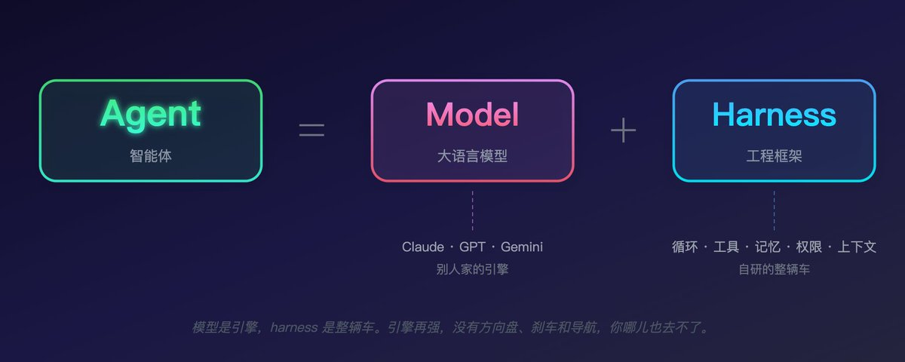

Claude Code 和 OpenClaw 用的都是别人家的模型——前者用 Claude 系列，后者可以接入 Claude、GPT、Gemini 等多家 API。模型层面它们没有任何自研能力。

但两者都做出了让人印象深刻的智能体表现。一个能在大型代码库里自主完成复杂的多步骤编程任务，另一个能 24 小时不间断地替用户处理跨平台的日常事务。

这些表现的来源，全在 harness 里。下面逐个维度拆解。

## 维度一：整体架构

Claude Code 的架构：分层堆叠

Claude Code 是一个十层堆叠的体系：

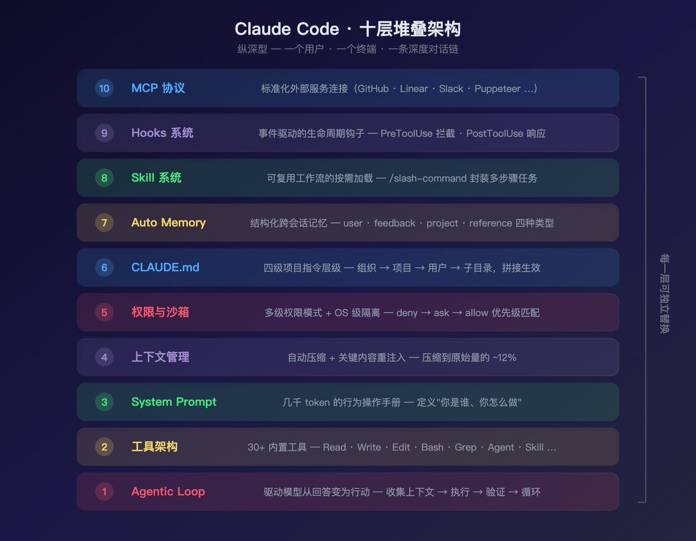

每一层都是可替换的。你可以换模型、换权限模式、加新 Skill、接新 MCP 服务器——而不需要改动其他层。整个体系围绕一个核心场景设计：一个程序员坐在终端前，和 AI 协作完成编程任务。

OpenClaw 的架构：四层管道

OpenClaw 是一个四层管道式架构：

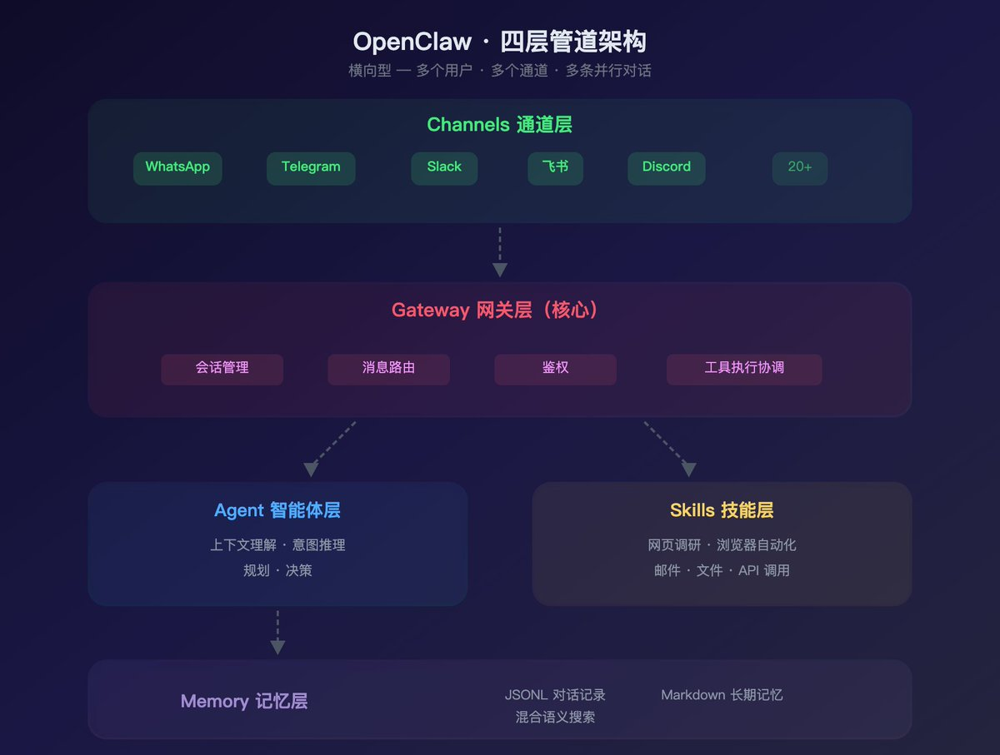

整个体系围绕一个完全不同的核心场景设计：多个用户通过多个聊天平台，和一个 24/7 在线的 AI 助手交互。

核心差异：Claude Code 是纵深型架构——一个用户、一个终端、一条深度对话链，所有工程都在让这条链更长、更可靠、更安全。OpenClaw 是横向型架构——多个用户、多个通道、多条并行的对话，所有工程都在让这些对话被正确路由、隔离和记忆。

## 维度二：驱动循环

智能体的核心是一个循环——接收输入、决策、执行、观察结果、再决策。但两个框架的循环形态完全不同。

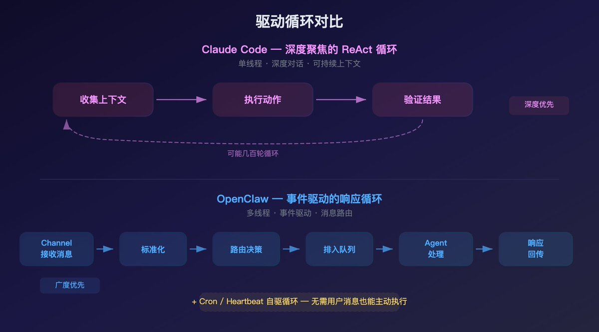

Claude Code：深度聚焦的 ReAct 循环

Claude Code 的循环是单线程的、深度聚焦的。一个程序员给它一个任务——"把这个 API 从 REST 迁移到 GraphQL"——它可能执行几十轮循环：读代码、理解架构、制定计划、修改文件、跑测试、看到失败、分析原因、再修改……整个过程可能持续几百轮工具调用，全部在同一条对话链里完成。

这个循环的工程要点是上下文的可持续性——在几百轮调用之后，Claude 仍然需要记得最初的任务目标、中间的决策逻辑、之前尝试过但失败的方案。这就是为什么 Claude Code 在上下文管理上投入了那么多工程：自动压缩、关键内容重注入、延迟加载。

OpenClaw：事件驱动的响应循环

OpenClaw 的循环是事件驱动的、多线程的。消息可能从任何通道在任何时间到来——Telegram 上的一条语音、Slack 上的一个 @mention、邮件里的一封回复、Cron 定时触发的一个任务。每条消息都走同一条管道，但被路由到不同的会话上下文。

这个循环的工程要点是消息的正确路由——用户 A 在 Telegram 上说的话不能混进用户 B 在 Slack 上的会话；同一个用户在不同通道的消息，需要被正确地合并或隔离（取决于配置）；并发消息需要排队处理（默认最大 10 并发），避免上下文竞争。

OpenClaw 还有一个 Claude Code 没有的驱动力：主动触发。通过 Cron 和 Heartbeat 机制，Agent 可以在没有任何用户消息的情况下自己醒来干活——凌晨 3 点爬取竞品数据，早上 7 点生成日报，每小时检查一次库存。这不是"响应"循环，这是"自驱"循环。

## 维度三：工具与能力

两个框架都通过工具让模型与外部世界交互，但工具的设计思路差异很大。

Claude Code：30+ 精细化内置工具

Claude Code 的工具围绕编程工作流设计，分为五个类别：

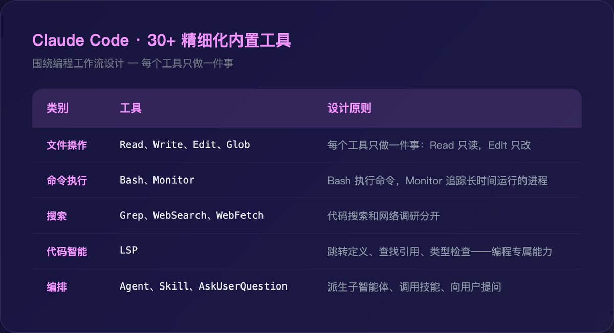

设计原则是最小化但完备。Read 只读文件，不读目录（目录用 ls）。Edit 只做字符串替换，不做整文件重写（重写用 Write）。这种拆分让权限控制变得精确——你可以允许 Claude 读任何文件但禁止修改特定目录。

工具的 schema 加载也经过精心设计：常用工具的 schema 在启动时加载，MCP 扩展工具的 schema 通过 ToolSearch 延迟加载。一个连接了 10 个 MCP 服务器的环境可能暴露上百个工具，但只有被实际调用的工具才消耗上下文空间。

OpenClaw：面向生活场景的 Skill 生态

OpenClaw 的能力不叫"工具"，叫"技能"（Skills），围绕日常生活和工作场景设计：

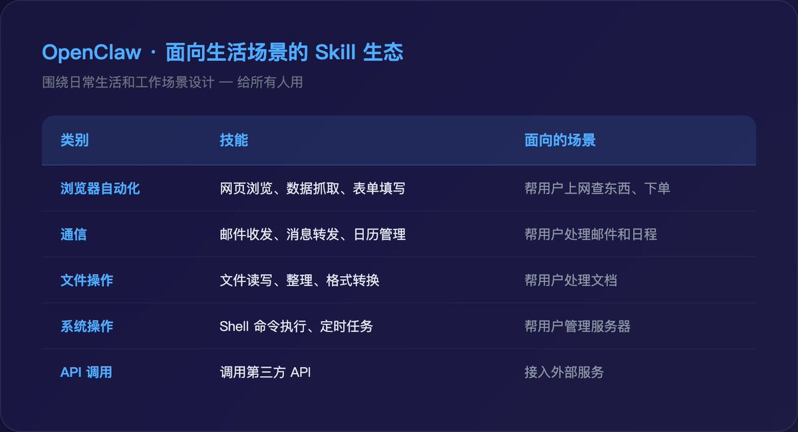

Claude Code 的工具是给程序员用的——普通用户不知道什么是 Grep 或 LSP。OpenClaw 的技能是给所有人用的——"帮我查一下机票价格"、"把这封邮件转发给张总"。

另一个关键差异是通道层。Claude Code 没有通道概念——它只有一个入口，就是终端。OpenClaw 支持 20+ 消息平台的接入（WhatsApp、Telegram、Slack、微信、钉钉、Discord……），每个通道都是一个工具入口。这意味着用户不需要学习任何新界面，在自己每天用的聊天 App 里就能指挥 AI 干活。

## 维度四：指令与配置——教 AGENT"你是谁"

Agent 启动时需要知道"我是谁、我该遵守什么规则、我擅长什么"。两个框架用截然不同的方式注入这些信息。

Claude Code：空间导向的四级层级

Claude Code 的指令按文件路径和目录层级组织：

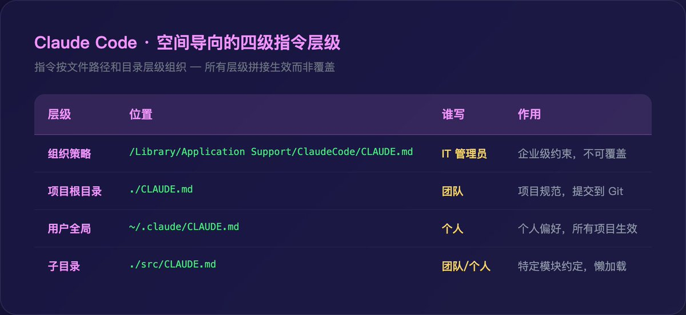

所有层级拼接生效（而非覆盖）。子目录级别采用懒加载——只有访问该目录的文件时才加载。.claude/rules/ 目录可以用 YAML frontmatter 设置路径匹配规则，让特定的编码约定只在访问特定文件时才注入上下文。

这套设计适配的场景是大型代码库：前端团队、后端团队、基础设施团队各有各的约定，指令系统随项目复杂度弹性伸缩。

OpenClaw：身份导向的 Agent 配置

OpenClaw 的指令按Agent 角色和通道组织：

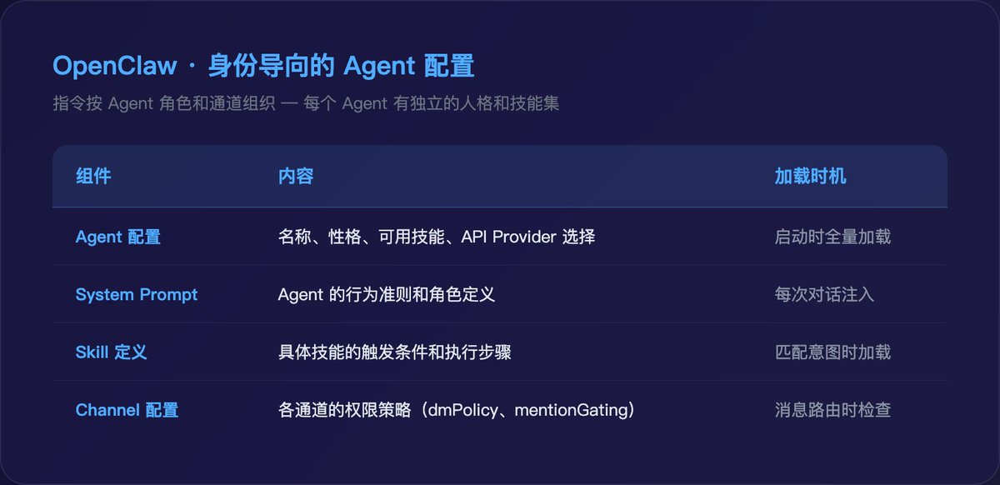

一个 OpenClaw 实例可以运行多个 Agent，每个 Agent 有自己的 System Prompt 和 Skill 集合。这更像一个公司有多个员工，每个员工有自己的岗位职责和性格特质。

核心差异：Claude Code 的规则绑定到"你在看哪个文件"——访问 src/api/ 时加载 API 规范，访问 src/ui/ 时加载 UI 规范。OpenClaw 的规则绑定到"你在跟哪个 Agent 说话"——跟"客服小助手"说话时用服务话术，跟"数据分析师"说话时用专业术语。

前者是空间逻辑，后者是身份逻辑。两种逻辑分别匹配了各自的核心场景。

## 维度五：上下文管理——对抗"失忆"

Agent 对话越长，上下文压力越大。两个框架面对的挑战不同，解决方案也不同。

Claude Code：单线程深度对话的抗压

Claude Code 的上下文窗口约 200K token，但编程任务消耗极快——读几个大文件、跑几次测试就快满了。

应对策略是自动压缩 + 重注入：

- 接近极限时自动启动压缩

- 先清理旧的工具输出（已读过的文件内容），再摘要历史对话

- 压缩到原始量的约 12%

- 压缩后从磁盘重新注入 CLAUDE.md、Auto Memory 索引、技能内容

关键设计：有选择地保护重要信息。系统提示词不在消息历史中，永远不受影响。项目 CLAUDE.md 和记忆索引在压缩后从磁盘重新加载。路径匹配规则和子目录 CLAUDE.md 暂时丢失，但下次访问对应文件时会自动重新加载。

还有一套延迟加载策略降低启动开销：MCP 工具 schema 按需检索（ToolSearch）、路径匹配规则按需触发、Skill 内容调用时才加载。

OpenClaw：多线程并发的隔离

OpenClaw 面对的不是"一条对话太长"的问题，而是"太多条对话同时进行"的问题。

它的上下文管理核心是会话隔离：

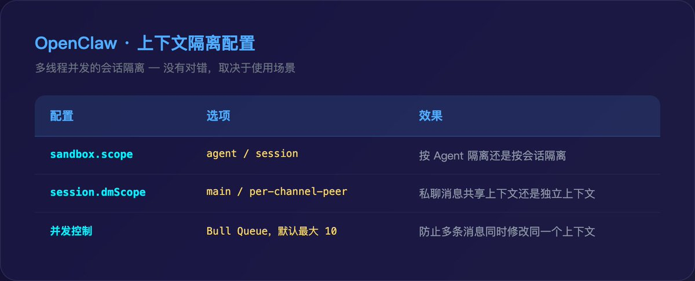

sandbox.scope 决定了隔离粒度。设为 agent 时，同一个 Agent 的所有对话共享上下文——用户 A 的对话信息可能影响对用户 B 的回复。设为 session 时，严格按会话隔离——更安全，但 Agent 无法跨会话关联信息。

session.dmScope 决定了跨通道行为。设为 main 时，用户在 Telegram 和 Slack 上的消息路由到同一个会话——Agent 知道这是同一个人。设为 per-channel-peer 时，每个通道独立——更隔离，但 Agent 无法跨通道理解上下文。

这些配置没有对错之分，取决于使用场景。个人助手用 agent + main（最大化上下文共享），多用户服务用 session + per-channel-peer（最大化隔离安全）。

## 维度六：记忆系统——跨会话的知识积累

这是两个框架差异最显著的部分。

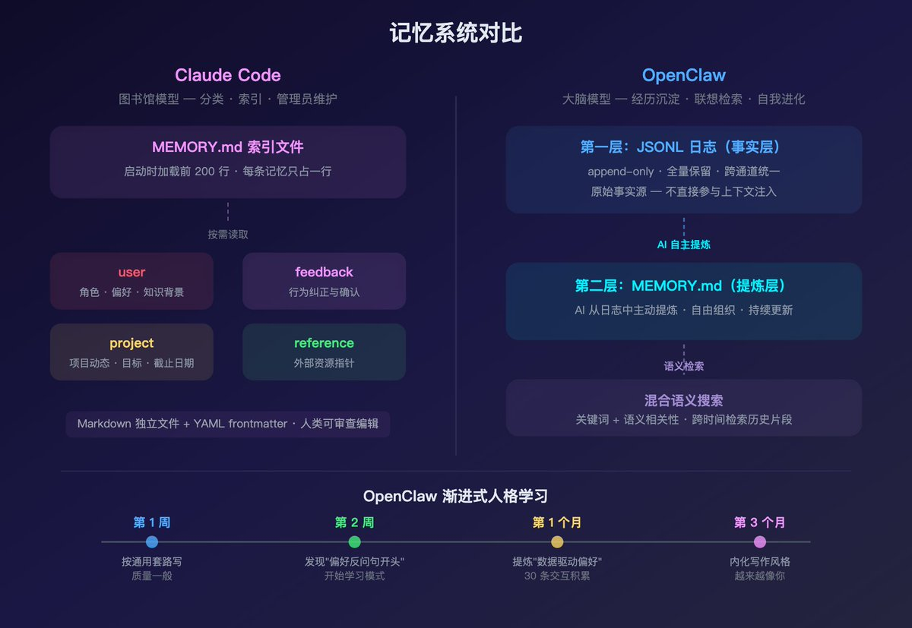

Claude Code：结构化记忆 + 人工可编辑

Claude Code 的 Auto Memory 保存在 \~/.claude/projects/&lt;project&gt;/memory/ 目录下，由四种明确类型组成：

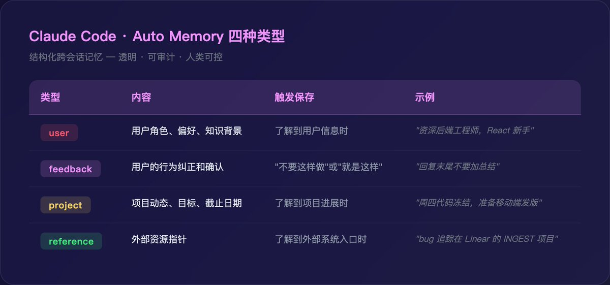

每条记忆是独立的 Markdown 文件，带 YAML frontmatter 标注名称、描述和类型：

\`\`\`markdown
\---
name: 写作风格偏好
description: 用户偏好严谨用词，避免口语俚语
type: feedback
\---

保持严谨认真的行文风格。
\*\*Why:\*\* 用户在多次对话中纠正了过于口语化的表达。
\*\*How to apply:\*\* 写作时避免俚语和低质感表达，用词专业但自然。
\`\`\`

MEMORY.md 是索引文件，每条记忆只占一行（150 字符以内），启动时加载前 200 行。详细记忆文件按需读取。

记忆的关键约束：

- 写入前检查重复：先查是否已有相关记忆可以更新

- 引用前验证存在：记忆中提到的文件路径、函数名，使用前必须确认仍然存在

- 人类可编辑：用户随时可以打开记忆文件，删除不准确的内容

这是 Claude Code 记忆的核心哲学：记忆是透明的、可审计的、人类可控的。 你随时可以打开 MEMORY.md，像看一份员工档案一样查看 Claude 记住了什么，觉得不对的直接改文件。

OpenClaw：双层架构 + AI 自主提炼 + 语义检索

OpenClaw 的记忆是双层设计，思路完全不同。

第一层：JSONL 日志（事实层）

每次交互被逐行记录为 JSONL 审计日志——完整的事件流，包含消息内容、工具调用、返回结果、时间戳、通道来源：

\`\`\`json
{"ts":"2026-04-20T03:22:01Z","role":"user","channel":"telegram","content":"帮我看看上周销售数据"}
{"ts":"2026-04-20T03:22:03Z","role":"agent","action":"skill:web\_browse","target":"https://dashboard.example.com"}
{"ts":"2026-04-20T03:22:15Z","role":"agent","content":"上周总销售额 ¥128,400，环比上升 12%..."}
{"ts":"2026-04-20T03:22:18Z","role":"user","content":"不错，以后每周一早上自动发给我"}
\`\`\`

日志层的特性：

- 不可变（append-only）：只追加，不修改，不删除

- 全量保留：包含所有通道的所有交互细节

- 可追溯：可以回溯到任何时间点，看到 Agent 当时的完整上下文

- 跨通道统一：Telegram、WhatsApp、Slack 的消息记录在同一份日志中

日志层不直接参与上下文注入——它太大了。它的角色是作为"原始事实源"，为第二层提供素材。

第二层：MEMORY.md（提炼层）

OpenClaw 的 MEMORY.md 不是人工编写的，而是 AI 从日志层中主动提炼出来的。

提炼过程：Agent 在交互中持续观察模式。当某个信息跨多次对话反复出现，或者用户明确表达了偏好，它就提炼为长期记忆。这更像一个人写工作日记——不记流水账，只记学到的东西：

\`\`\`markdown
\## 用户偏好
\- 偏好数据驱动的分析，每次报告都要带具体数字
\- 喜欢表格形式呈现对比数据
\- 每周一早上需要自动发送上周销售周报
​
\## 业务知识
\- 公司主营跨境电商，主要平台是 Amazon 和 Shopee
\- 旺季是 Q4（黑五、圣诞），库存需提前两个月准备
\- 退货率超过 8% 需要立即预警
\`\`\`

与 Claude Code 的四种类型 + frontmatter + 索引相比，OpenClaw 的记忆形式更自由——没有强制分类模板，AI 按自己理解的方式组织。

语义检索层

OpenClaw 在纯文件之上叠加了混合语义搜索。调用记忆时不只按关键词匹配 MEMORY.md，还根据语义相关性从日志层检索最相关的历史片段。

用户问"上次那个退货率的事怎么处理的？"，语义搜索能找到三个月前那次完整的对话记录，即使措辞完全不同。随着日志积累，Agent 可调用的"记忆库"越来越大，回答越来越精准。

记忆进化的完整周期

OpenClaw 的记忆有一个 Claude Code 很难复现的特性——渐进式人格学习：

1. 第 1 周：让它每天写一条文案，它按通用套路写，质量一般

1. 第 2 周：从日志中发现你三次修改开头都改成反问句，提炼出"用户偏好反问句开头"

1. 第 1 个月：积累 30 条文案交互后，发现你从不修改带数据的文案但经常改纯观点类的，更新记忆为"用户偏好数据驱动的内容"

1. 第 3 个月：已经内化了你的写作风格——用词习惯、段落节奏、话题偏好，写出来的东西越来越像你自己写的

Claude Code 的记忆是离散条目——"用户偏好反问句"、"用户喜欢数据支撑"——准确但平面。OpenClaw 从大量日志中渐进学习出的用户画像，更立体、更有"人格感"。

核心对比

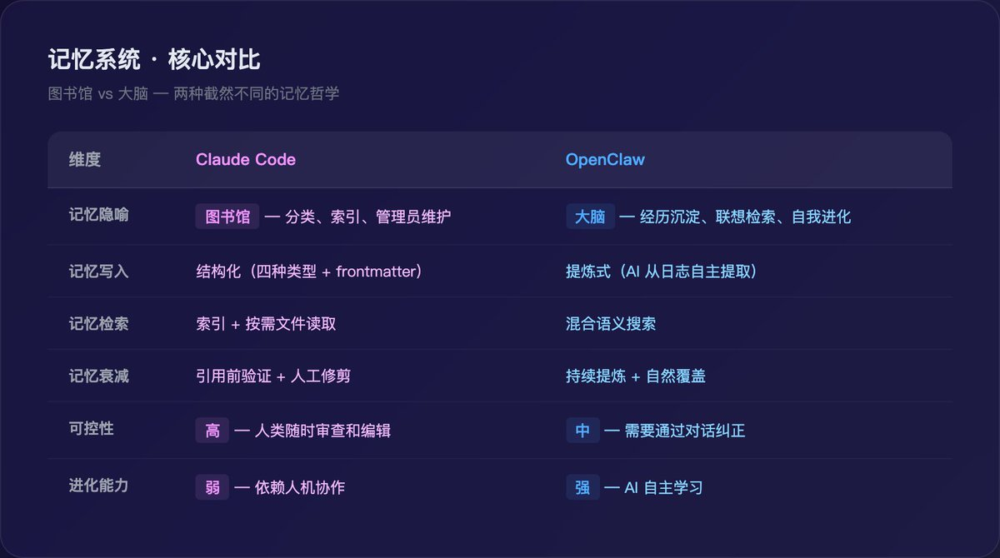

## 维度七：安全与权限

自主性越强，风险越大。两个框架都意识到了这一点，但防护策略差异很大。

Claude Code：多层权限 + 精细粒度

Claude Code 的权限系统围绕工具调用设计：

权限模式（Shift+Tab 切换）：

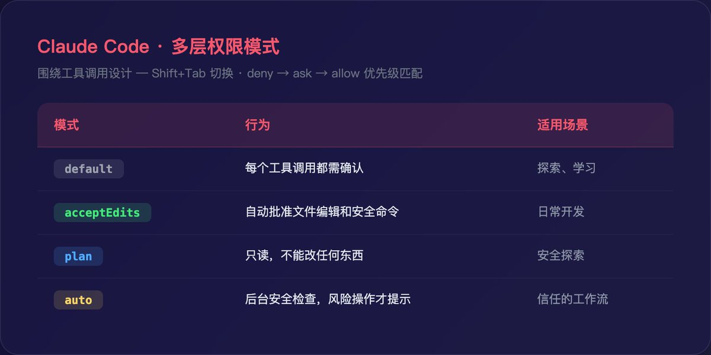

规则系统按 deny → ask → allow 的优先级匹配。你可以允许 Bash(npm \*) 但禁止 Bash(rm \*)。组织级别的 deny 规则不可覆盖。

Hooks 系统提供了额外一层防护：PreToolUse hook 可以在工具执行前拦截，返回 exit 2 直接取消调用。这把安全策略从"希望 Agent 遵守"变成了"物理上无法违反"。

还有操作系统级的沙箱隔离——文件系统和网络访问在 OS 层面被限制，独立于权限规则之外运行。

OpenClaw：通道级权限 + 身份校验

OpenClaw 的权限围绕消息通道和用户身份设计：

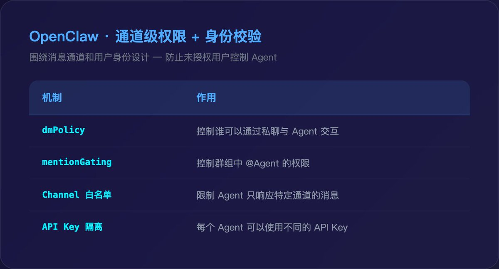

OpenClaw 面对的安全挑战和 Claude Code 完全不同。Claude Code 的风险是"Agent 执行了危险命令"（rm -rf /）。OpenClaw 的风险是"未授权用户控制了 Agent"——因为它是网络服务，任何能发消息的人理论上都可能尝试给 Agent 下指令。

这也是 OpenClaw 多用户改造的核心难点。当前版本的会话隔离在并发场景下存在风险：路由器使用"当前活动上下文"作为身份代理，并发环境下身份绑定可能失效，导致跨会话数据泄漏。这是单用户设计在多用户场景下的典型局限。

## 维度八：可扩展性

Claude Code：MCP + Skill + 自定义 Agent

Claude Code 的扩展性有三条路径：

- MCP 协议：连接外部服务（GitHub、Linear、Slack、Puppeteer……），标准化的工具暴露方式，schema 延迟加载

- Skill 系统：封装多步骤工作流为 /slash-command，带 frontmatter 控制触发条件和权限预授权

- 自定义子 Agent：在 .claude/agents/ 下定义专用 Agent，各自有独立的系统提示词、工具集和模型选择

三者的共同设计原则是按需加载——不用的 MCP schema 不加载，不调用的 Skill 不占上下文，子 Agent 的上下文独立于主对话。

OpenClaw：通道 + 技能 + Provider

OpenClaw 的扩展性也有三条路径：

- 通道扩展：接入新的消息平台（已支持 20+），每个通道只需实现 Webhook 接入和消息标准化

- 技能扩展：添加新的执行能力（浏览器自动化、邮件处理、API 调用……）

- Provider 扩展：切换底层模型提供商（Claude、GPT、Gemini、本地模型），甚至同一个实例不同 Agent 用不同的模型

OpenClaw 的扩展重心在前端（更多通道触达更多用户），Claude Code 的扩展重心在后端（更多工具和协议接入更多开发资源）。

## 维度九：会话持久化

Claude Code：本地 JSONL + 分叉恢复

每次对话保存为本地 JSONL 文件，支持：

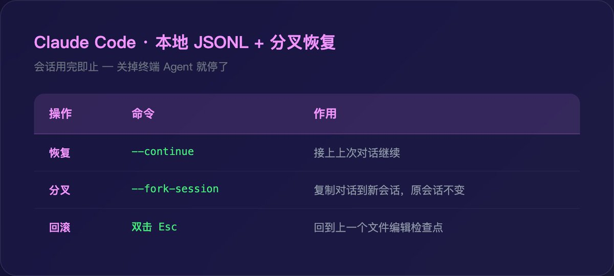

分叉是一个精妙的设计：在同一个问题上尝试两种方案——分叉出一个试方案 A，原会话试方案 B——然后比较结果。

但 Claude Code 的会话是用完即止的。关掉终端，Agent 就停了。下次 --continue 可以恢复上下文，但 Agent 不会在你离开后自己干活。

OpenClaw：持久在线 + 跨通道连续性

OpenClaw 没有"关掉"的概念——它是一个 24/7 运行的服务。

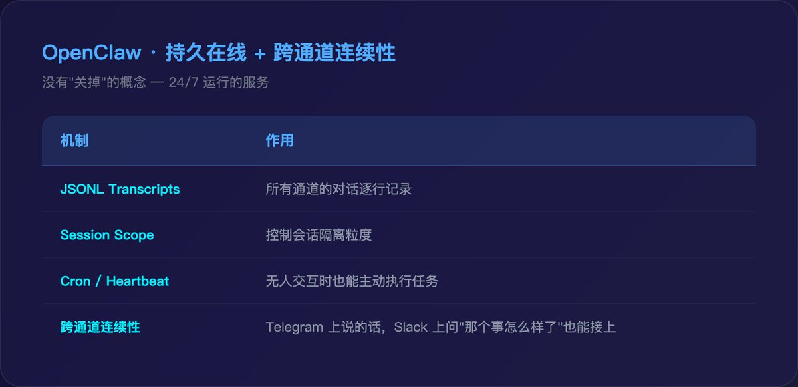

跨通道连续性是 Claude Code 做不到的事。你在 Telegram 上说"帮我关注 A 股票"，过两天在 Slack 上问"那个股票怎么样了？"——如果 DM Scope 设为 main，Agent 知道你在说同一件事。

Cron 和 Heartbeat 更特别。它们让 Agent 的记忆积累不局限于"用户主动说话的时候"。Agent 凌晨自动爬取的数据、每小时自动检查的服务器状态——这些自主执行产生的日志也进入记忆系统，让 Agent 积累的知识远超用户直接告诉它的那些。

## 共同的工程智慧

尽管设计哲学不同，两个框架分享了一些底层洞察：

纯文件方案优于数据库方案。 两者都选择了 Markdown + JSONL 存储，而非 SQLite 或向量数据库。文件是人类可读的、可 Git 版本控制的、不依赖外部服务的。在 Agent 工程的早期阶段，简洁性比"专业性"重要得多。

索引与内容分离。 Claude Code 用 MEMORY.md 做索引、具体记忆文件存内容。OpenClaw 用 MEMORY.md 存提炼结果、JSONL 存原始记录。两者都遵循同一原则：启动时只加载轻量摘要，详细内容按需加载。上下文窗口的硬约束决定了这是必须的。

约束带来可靠性。 OpenAI 的 Codex 团队发现，给 Agent 更严格的边界反而让它表现更好。Claude Code 通过权限模式和 Hooks 实现约束，OpenClaw 通过通道权限和会话隔离实现约束。方法不同，结论一致。

记忆会腐败。 两个框架都认识到记忆会过时。Claude Code 的对策是"引用前验证"，OpenClaw 的对策是"持续提炼覆盖"。方法不同，共识一致：永远不要盲目信任记忆。

## 最后的思考

为什么顶级 AI 研究者会对这些工程方法感兴趣？

因为模型能力到了一个临界点。当模型足够聪明，瓶颈就不再是"让模型更聪明"，而是"怎么让聪明的模型可靠地完成真实世界的任务"。

Claude Code 和 OpenClaw 给出了两种截然不同但同样有效的答案。一个证明了，在正确的工程框架下，AI 可以在大型代码库中自主完成复杂的多步骤编程任务。另一个证明了，在正确的工程框架下，不会编程的普通人也能拥有一个 24 小时在线、越用越懂你的数字员工。

两者区别全在模型之外的那些"奇技淫巧"里。

Agentic Loop、工具架构、上下文管理、权限沙箱、记忆系统、技能封装、事件钩子、通道路由、会话隔离——这些听起来都不像前沿研究，更像传统软件工程的老手艺。但正是这些老手艺，决定了 AI Agent 到底是一个"能聊天的模型"，还是一个"能干活的同事"。

模型是引擎，harness 是整辆车。引擎再强，没有方向盘、刹车和导航，你哪儿也去不了。

### 🖼️ Attached Media

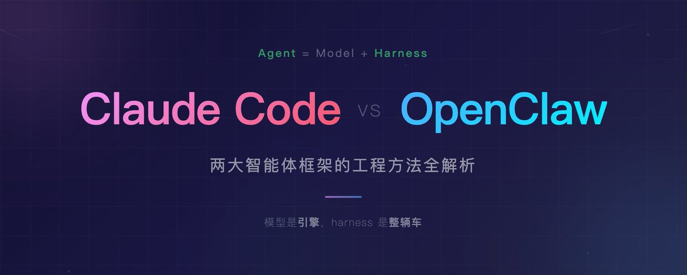

## 💬 Replies

### 1 @PandaTalk8 (Mr Panda) (Author)

*Sun Apr 26 15:16:33 +0000 2026*

好的👌

### 2 @linxiaobei888 (小北)

*Sun Apr 26 08:36:53 +0000 2026*

@PandaTalk8 Claude Code 是自家的模型 

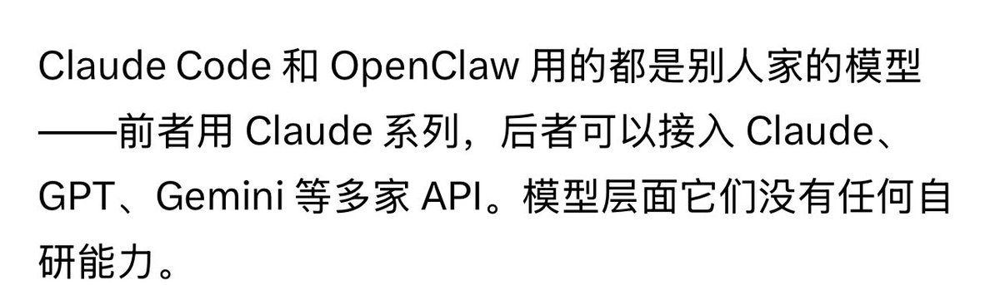

### 3 @YikunChen1983 (昆哥有话说)

*Sun Apr 26 18:09:13 +0000 2026*

@PandaTalk8 有些事好笑不是因为荒诞，而是太熟了，熟到像从楼下便利店买回来的现实主义。Mr Panda @PandaTalk8 Subscribe 通过分析 Claude…看似轻轻一说，实则把很多沉默都拎出来晾了晾。

