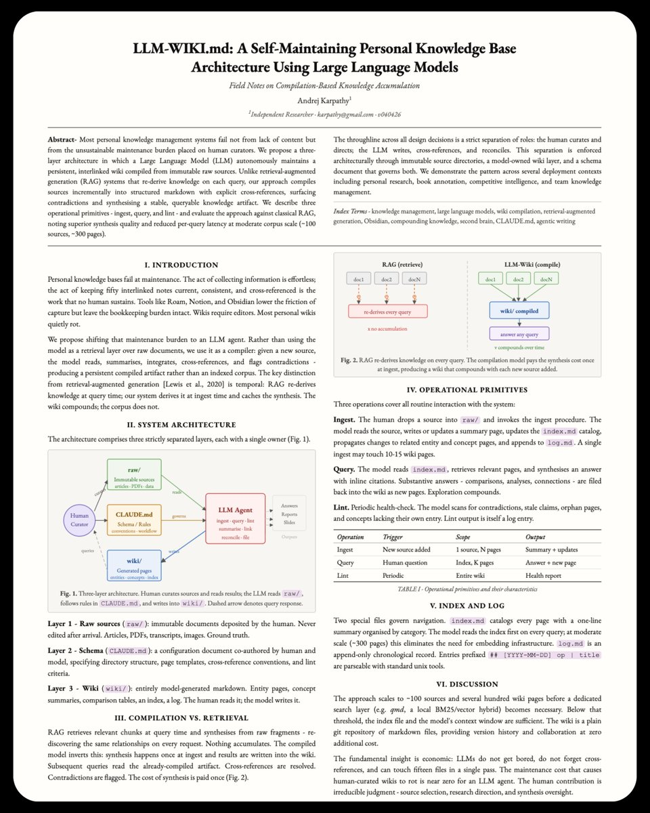

KARPATHY WROTE THIS DOCUMENT TO COMPLETELY AUTOMATE OBSIDIAN WITH CLAUDE

I was ready to abandon my second brain

manual cross-referencing was destroying my workflow, but finding this exact document opened my eyes to a completely different approach

it is incredibly convenient -&gt; Karpathy's method turns the AI into a full-time maintainer for your Zettelkasten:

&gt; the LLM reads every new source and integrates it into a structured wiki
&gt; Obsidian becomes your visual IDE while Claude operates as the backend
&gt; the agent runs automated checks to find contradictions across your notes
&gt; your entire vault compounds automatically without you typing a single link

the friction is completely gone. I just feed it raw documents and the agent organizes my entire life

here is the official document from Karpathy explaining the architecture 👇

### 🖼️ Attached Media

## 💬 Replies

### 1 @draginol (Brad Wardell)

*Sun Jun 28 14:05:10 +0000 2026*

@polydao You can literally do this, without having to read a document by just downloading Clairvoyance which includes a superset of Obsidian already pre-trained to do this and has been doing this for a year.

[x.com/AiClairvoyance…](https://x.com/AiClairvoyance/status/2071231696456823015?s=20)

### 2 @hammertime_one (hammertime)

*Sun Jun 28 06:56:15 +0000 2026*

@polydao this compounds over time, that's the magic

### 3 @Stardock (Stardock)

*Sun Jun 28 14:13:42 +0000 2026*

@polydao You really should check out Clairvoyance.  You just described what it does and has done long before Karpathy discovered this workflow and before Hermes existed.

### 4 @rewind02 (rewind)

*Sun Jun 28 09:04:10 +0000 2026*

@polydao obsidian finally gets autopilot

### 5 @fjun99 (fangjun)

*Mon Jun 29 07:05:01 +0000 2026*

@polydao what's the source link of this doc? thanks.

### 6 @ajs6888 (安叫兽|Bird🕊️ 🔶 BNB)

*Sun Jun 28 08:30:40 +0000 2026*

@polydao 自动维护双链这事儿终于有点像第二大脑了

### 7 @Nekt_0 (Nekt0)

*Sun Jun 28 23:56:19 +0000 2026*

@polydao I get where this comes from

### 8 @alexabelonix (Alexa | Indie hacker)

*Sun Jun 28 05:41:13 +0000 2026*

@polydao good work, keep going.

### 9 @0xSlyth (0xSlyth)

*Sun Jun 28 06:19:02 +0000 2026*

@polydao mindblown

### 10 @0xwhrrari (rari)

*Sun Jun 28 16:54:02 +0000 2026*

@polydao claude as the backend and obsidian as the visual ide is a great split

### 11 @wladwtf (wladwtf)

*Sun Jun 28 05:57:44 +0000 2026*

@polydao Congrats on those cool obsidian and clay discoveries

### 12 @gonlenidefi (Hunter Gon)

*Sun Jun 28 05:42:51 +0000 2026*

@polydao obsidian automation is actually the thing thatd keep me using it

gotta find the paper and test it myself

### 13 @0xScalex (Scalex)

*Mon Jun 29 09:08:04 +0000 2026*

@polydao your own AI assistant is quite convenient and gives you more free time

### 14 @AnnatarXBT (Annatar.md)

*Sun Jun 28 05:45:11 +0000 2026*

@polydao saving this one for later

### 15 @Aleksan35543138 (hitman1238)

*Sun Jun 28 07:05:10 +0000 2026*

@polydao This is an absolute game-changer for digital gardens. Using Claude as a backend to eliminate the friction of manual linking is exactly what the Zettelkasten method needed

### 16 @tech_swindler (Tech Swindler)

*Mon Jun 29 17:31:08 +0000 2026*

@polydao If you replace generated wikis with skills, don’t we have Hermes?

### 17 @hansbrattberg (Hasse)

*Mon Jun 29 12:53:10 +0000 2026*

@polydao @grok can you find a link to this document or verify it is actually written by karpathy?

### 18 @ayzha_ai (Ayzha Monroe)

*Mon Jun 29 02:51:54 +0000 2026*

@polydao Perfect knowledge setup.

### 19 @Deepread_com (DeepRead.com)

*Wed Jul 01 15:59:43 +0000 2026*

@polydao Karpathy's insight is the system. The reader's edge is the input — highlights are pre-structured arguments. 

Add a horizontal layer across books to build your personal knowledge base.
[x.com/Deepread\_com/s…](https://x.com/Deepread_com/status/2063712829430022501?s=20)

### 20 @An_yhl (晚晚)

*Sun Jun 28 08:36:38 +0000 2026*

@polydao Obsidian 手动串笔记真的会把人劝退

### 21 @bounceidc (Bounce)

*Sun Jun 28 06:12:09 +0000 2026*

@polydao I know obsidian from Minecraft.

### 22 @fort1kkk (fort1kkk)

*Sun Jun 28 07:12:54 +0000 2026*

@polydao i use notion instead of obsidian

i like it more

### 23 @riptide_eth (riptide.eth)

*Sun Jun 28 11:11:33 +0000 2026*

@polydao this is a massive game changer for note taking. second brain automation is the future. can't believe we used to cross-reference things manually lol

### 24 @asymetx (Asymet)

*Mon Jun 29 21:10:03 +0000 2026*

@polydao Where did you find this? Karpathy is at Eureka Labs, not "Independent Researcher." The footer version "v040426" isn't his usual format and the paper isn't on arxiv. Either it's a stylized writeup someone made in his voice, or there's a source nobody is linking.

### 25 @mmoyshaa (Moysha)

*Sun Jun 28 08:43:46 +0000 2026*

@polydao booked

### 26 @IkotValery (Valery Kot)

*Fri Jul 03 10:12:17 +0000 2026*

@polydao "Automated checks to find contradictions." But what about contradictions I already wrote and forgot? The agent cross-references new sources. It doesn't surface old me arguing with older me.

### 27 @magicfitai (Magicfit)

*Mon Jun 29 16:16:27 +0000 2026*

@polydao actually useful second brain energy

### 28 @thiagoTF (Pode vir)

*Sun Jun 28 05:44:51 +0000 2026*

@polydao this is just automating the noise. the real flex is aggregating demand for the convos people actually want

### 29 @NikChainAi (Nik)

*Sun Jun 28 21:44:37 +0000 2026*

@polydao "I just feed it raw documents and 
the agent organizes my entire life"

that's the sentence that describes 
what a second brain was always 
supposed to be

we just needed the LLM layer 
to make it actually work

### 30 @AmatiGavriel (gavriel amati)

*Mon Jun 29 08:39:40 +0000 2026*

@polydao @gilifromphilly  @davedushi

### 31 @RegisLapez71528 (Marketing Learning)

*Mon Jun 29 10:12:56 +0000 2026*

Je crois que beaucoup regardent encore ces outils avec les lunettes de 2020.

Ils pensent stockage.

Je pense raisonnement.

Mon second cerveau ne sert plus seulement à conserver des notes.

Il pense avec moi.

Je lui demande de relier des idées, de repérer des contradictions, de challenger mes hypothèses et de proposer des angles que je n'aurais pas vus seul.

Le gain n'est pas seulement en productivité.

Le gain est en qualité de réflexion.

À mes yeux, la véritable révolution de l'IA n'est pas qu'elle mémorise mieux que nous. C'est qu'elle nous aide à penser mieux que seuls. 🧠🤝🤖 #ArtificialIntelligence #PKM

### 32 @esaruoho (Esa Ruoho (Lackluster))

*Sun Jun 28 08:46:00 +0000 2026*

@polydao I dont understand. Where is the PDF?

### 33 @packratps4 (Justin Bonner)

*Mon Jun 29 16:51:52 +0000 2026*

@polydao That makes sense, thanks. So by wiki they mean structural format? And this might just plug into my slm model

### 34 @Altovexx (Altovexx)

*Sun Jun 28 07:41:08 +0000 2026*

@polydao this changes everything for obsidian users

