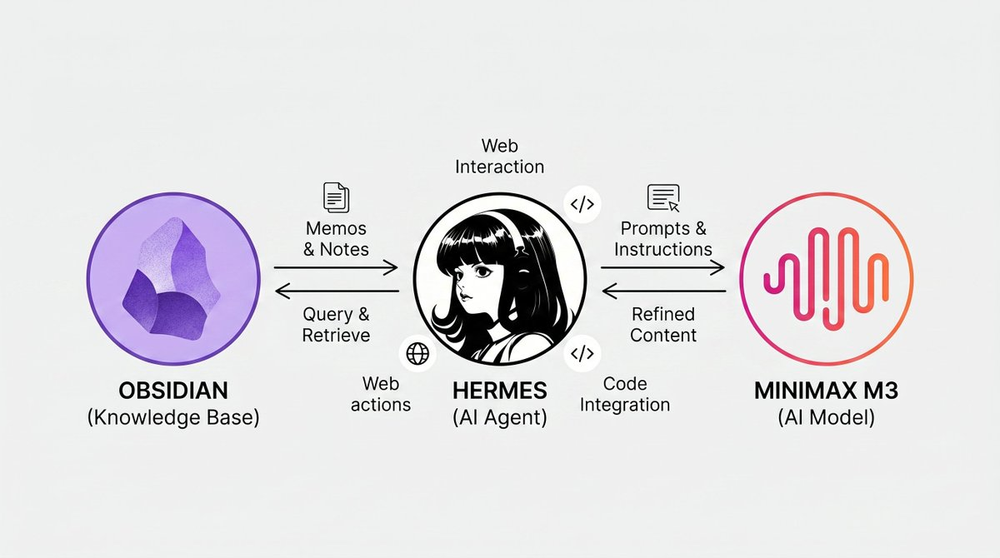
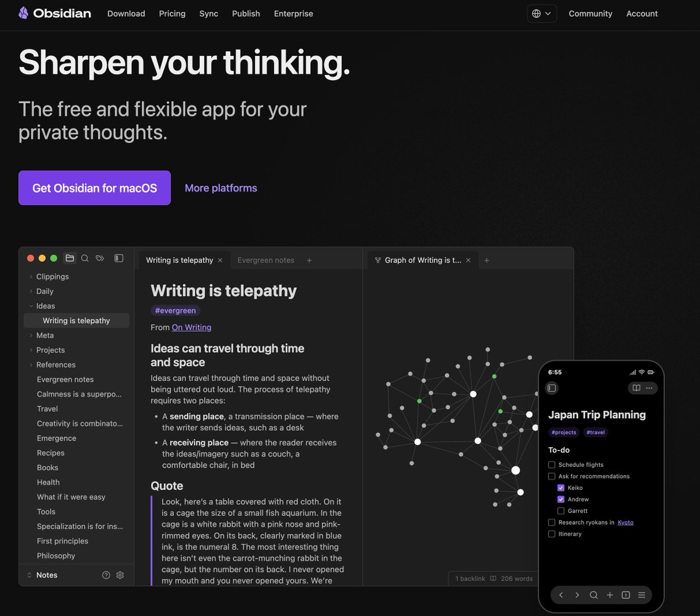
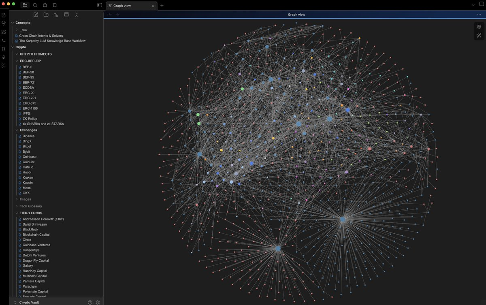
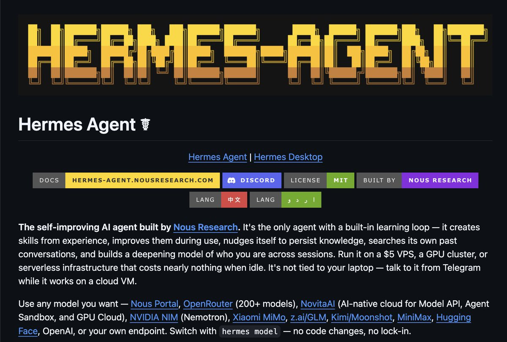
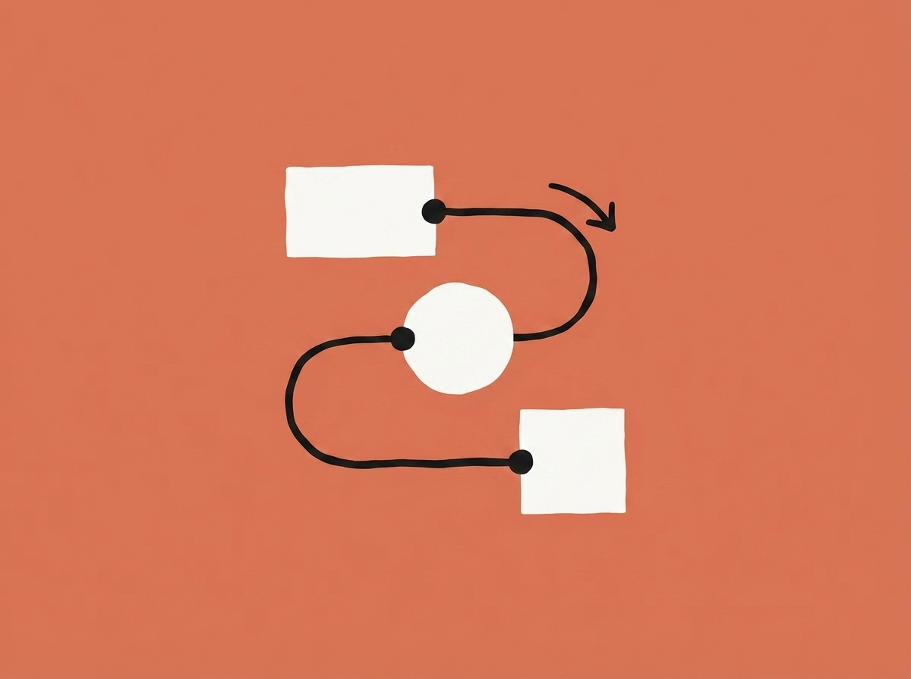
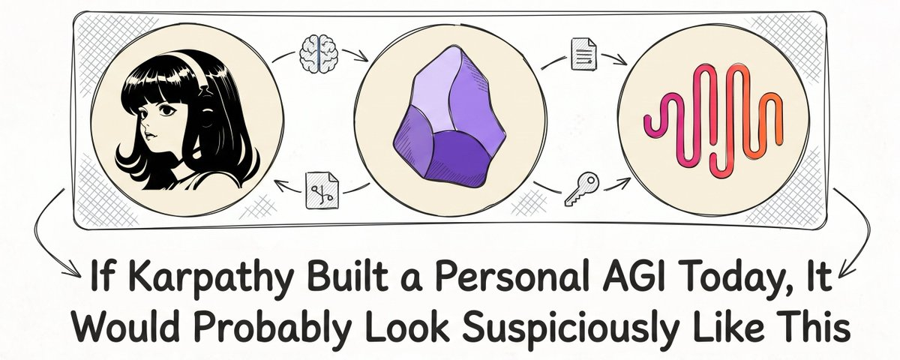

# 📰 Karpathy-Style Knowledge Stack: Why I Put Hermes, MiniMax M3 and Obsidian at the Core

> Most people treat notes, models, and agents as three separate worlds

This stack merges them into one feedback loop:
Obsidian as your memory, Hermes as your agent, MiniMax M3 as the reasoning core

---

## Why a “knowledge stack” beats a “note app”

Classic PKM breaks in three predictable ways:

- Notes get written once and never updated

- AI chats are smart but amnesiac - every session starts from zero

- Context for serious work constantly falls out of RAM - yours and the model's

What we actually want:

- A local, linkable graph of everything we know

- An agent that lives inside that graph, not above it

- A frontier model that can reason over huge real context, not just 2-3 paragraphs

Hermes + MiniMax M3 + Obsidian give you this:

- [Obsidian](https://obsidian.md/) \- local markdown graph with backlinks, graph view, and a plugin ecosystem designed for personal knowledge bases

- [Hermes Agent](https://hermes-agent.nousresearch.com/) \- self-improving open-source agent with a built-in learning loop, tools, and long-running jobs that runs on your own infrastructure

- [MiniMax M3](https://www.minimax.io/) \- the model I actually run inside Hermes every day. Long-context, multimodal, agentic
I picked it because I wanted one model that could read my whole vault, my logs, and a stack of new raw articles in a single context window - without me having to glue together a RAG pipeline to do it. After a few months of real use, it stays on as my default. More on why below

The result feels less like “using an LLM” and more like slowly training a second brain

---

## Why I picked M3 (and what I noticed)

> I did not pick M3 because of a benchmark

I picked it because every other model I tried in 2025 had the same failure mode in my workflow:

&gt; it would summarize a single note fine, but the moment I asked it to read ten notes, cross‑reference them with my MOCs, and write a new one back, it would lose the thread

The symptoms were always the same:

- The summary was locally coherent but globally wrong

- It cited a project that wasn't actually in the file

- It used a tag from a different taxonomy

- It invented a wikilink to a page that didn't exist

The model was smart. The workflow was bigger than the model

M3 was the first one I tried where the whole graph fit in context and stayed there for the whole task

Three things stood out in real use:

1. It actually uses my taxonomy
I have \~41 tags in a fixed schema (#coin/\*, #project/\*, #concept/\*, #solana-internal, #meta). When I ask M3 to compile a new note, it picks the right primary tag on the first try about 90% of the time.

With a 200K-context model I was at maybe 60%. The difference is that M3 sees the whole tag landscape at once and reasons over it instead of guessing from a few examples.

1. It doesn't drop the thread across long agentic loops
A full vault lint is 30+ tool calls: read MOC, follow wikilinks, count tags, scan for duplicates, write the report. 

Most models start to drift around call 8-9.
M3 stays coherent through the end. That is the single biggest reason I stopped context‑rotating to a fresh session every 20 minutes.

1. It treats forward references as a feature
When I ask it to compile a note and a concept does not exist yet, M3 writes Forward Reference anyway. 

Obsidian renders it as a gray link. I triage those once a week during the lint.
This is way better than a model that either invents a fake note or skips the link entirely.

Three honest caveats after months of use:

- First-call latency is high. Hermes pre‑loads the context. Don't judge M3 by the first 3 seconds - give it 10.

- It will confidently write a \[\[wikilink\]\] to a page that doesn't exist. That is the “forward reference” behavior above. It only becomes a problem if you skip the weekly lint.

- Multimodal is real, but for diagram‑heavy PDFs I still reach for a dedicated vision tool first. M3 reads text from images and short screenshots fine. For full pages with figures, it's not the right tool.

That is the whole pitch.
The model is good at exactly the thing a vault workflow needs: reading the whole graph at once and writing back into it without losing structure.

---

## Layer 1 – Obsidian as the ground truth

Obsidian is the boring but critical base layer in this stack

- Your knowledge lives as plain markdown files on disk, not locked into someone's cloud

- Backlinks, graph view, and daily notes help ideas converge into clusters instead of disappearing in chat history

- Plugins turn Obsidian into a programmable graph of documents, tasks, and datasets that an agent can systematically traverse

The principle is simple:

> If it is worth keeping, it lives in Obsidian first
If the agent does something useful, it should end up as a note

A practical structure:

\`\`\`
/obsidian-vault
  /inbox
  /people
  /projects
  /research
    ai-agents.md
    minimax-m3-benchmarks.md
  /ai
    hermes-playbook.md
    agents-ideas.md

\`\`\`

Hermes will read, refactor, and create these notes - but the vault remains the source of truth

---

## Layer 2 – Hermes as the self‑improving operator

This is where the stack stops being “a note system with an LLM” and starts acting like infrastructure

Hermes Agent is a self‑improving AI agent built by @NousResearch

It keeps a persistent model of you and your work, creates skills from experience, improves them during use, and searches its own past conversations to recall relevant context instead of resetting every session

You can run Hermes in two main ways:

- As a CLI tool on Linux, macOS, or WSL2

- Via Hermes Desktop - a native app for macOS, Windows, and Linux that wraps the same agent core in a GUI

## Install paths

macOS / Linux / WSL2 (CLI)

This one-liner installs Hermes Agent, sets up the environment, and exposes the global hermes command

\`\`\`bash
curl -fsSL https://hermes-agent.nousresearch.com/install.sh \| bash
\`\`\`

After installation:

\`\`\`bash
source \~/.bashrc 2&gt;/dev/null \|\| true
source \~/.zshrc 2&gt;/dev/null \|\| true
hermes
\`\`\`

Windows PowerShell (CLI)

\`\`\`powershell
irm https://hermes-agent.nousresearch.com/install.ps1 \| iex
\`\`\`

The Windows installer handles Python 3.11, Node.js 22, ripgrep, ffmpeg, and portable Git Bash, then adds hermes to your PATH

---

Hermes Desktop (GUI)

If you do not want to live in the terminal, [download Hermes Desktop](https://hermes-agent.nousresearch.com/) from the official desktop page and run the native installer for macOS, Windows, or Linux.

- Use Desktop when you want a native GUI instead of CLI-first setup, simpler onboarding, and the same Hermes core without manual shell bootstrapping

- Use CLI when you want reproducibility, scripting, remote server/VPS deployment, and tight control over tools, environment variables, and long-running workflows

Most people will use both: Desktop for day-to-day interaction, CLI for setup, automation, and remote work

---

## Architecture – how the stack actually fits together

The clean mental model:

\`\`\`
Obsidian Vault
   ↓
Hermes Agent
   ↓
MiniMax M3
   ↓
Updated notes, summaries, skills, scheduled jobs
\`\`\`

Each layer has a distinct job:

- [Obsidian](https://obsidian.md/) stores your notes as markdown files, which makes them easy to index, search, diff, and version

- Hermes is the orchestration layer – it reads files, runs tools, remembers prior work, schedules jobs, and decides when to persist something useful. It can also connect to messaging platforms and gateways

- MiniMax M3 is the reasoning engine in this stack.
It reads large note collections, rewrites messy notes, compares documents across the vault, and handles long-running agentic tasks without forgetting what was at the top of the context 20 tool calls ago

- In my workflow, that last bit is the unlock: a full vault lint, a cross‑MOC refactor, or a 30‑call “compile this article into a 5‑section note and update 3 MOCs” task all stay coherent end‑to‑end

- The “MSA architecture” claim is marketing. The lived experience is: I can run one task for 20 minutes and the model still knows what I asked it to do at minute 1

> Hermes is not replacing Obsidian. It sits between your vault and the model, turning the vault into something actionable

A realistic loop:

- You capture raw ideas in Obsidian

- Hermes reads the vault or specific folders

- Hermes sends the relevant note set to MiniMax M3

- M3 restructures, tags, links, summarizes, or expands the material

- Hermes writes the result back into the vault as clean markdown

That loop - not one‑off chat - is the actual product

---

## Real setup – connect Hermes to your vault

Keep your Obsidian vault in a normal filesystem location and expose that path to Hermes.

macOS / Linux

\`\`\`bash
export OBSIDIAN\_VAULT="$HOME/Documents/Obsidian/MainVault"
ls "$OBSIDIAN\_VAULT"
\`\`\`

Windows PowerShell

\`\`\`powershell
$env:OBSIDIAN\_VAULT="$HOME\\Documents\\Obsidian\\MainVault"
Get-ChildItem $env:OBSIDIAN\_VAULT
\`\`\`

Now run the Hermes setup wizard:

\`\`\`
hermes setup
\`\`\`

Or, for the shortest path via Nous Portal (auto provider, Tool Gateway, etc.):

\`\`\`
hermes setup --portal
\`\`\`

The official docs recommend \`hermes setup\` as the main onboarding command and \`--portal\` as a shortcut for account- and provider-linked configuration

Then verify the install:

\`\`\`
hermes doctor
\`\`\`

hermes doctor checks dependencies, PATH, provider configuration, and flags common problems before you start wiring in models and tools

---

## Model layer – wiring Hermes to MiniMax M3

Hermes treats “which model to use” as a first‑class configuration, not a hardcoded assumption.
You pick and update models using Hermes itself, rather than editing config files by hand.

The main command:

\`\`\`
hermes model
\`\`\`

This opens a model selection flow where Hermes lists supported providers and models and lets you choose the backend that exposes MiniMax M3

Practical setup path:

1. Install Hermes (CLI or Desktop)

1. Run hermes setup or hermes setup --portal

1. Run hermes model

1. Choose the provider path that gives you access to MiniMax M3

1. Save it as your default long-context model

If you already know your environment variables and provider format, you can also set specific values with:

\`\`\`
hermes config set
\`\`\`

The docs call hermes config set the supported method to write individual config values without editing files manually.

In my daily setup, M3 is the default for anything I would otherwise have to split into multiple model calls. Concretely:

- Reading large folders of notes where the answer depends on the graph, not on any single file

- Merging duplicated or overlapping notes – this is a graph problem, not a text problem

- Writing structured summaries and overviews in my voice (the 5‑section template, the 41‑tag taxonomy)

- Long research chains where the context keeps growing – open‑ended “compile, then update 3 MOCs, then write 3 thread ideas” tasks

- Code‑heavy multi‑step agent tasks where the model has to remember its own tool history for 20+ calls

I keep a small fast model in Hermes for tiny utility actions (renaming a file, finding a string, formatting YAML).

For everything above - M3. The split is roughly: cheap model for mechanical tasks, M3 for reasoning tasks. After a few weeks, the routing becomes invisible.

> Rule of thumb: use a fast, cheap model for tiny utility actions. Use MiniMax M3 for anything that depends on large context, structure, or long reasoning. That is where the stack becomes meaningfully better than standard chat

---

## Working pattern – folders that actually scale

If you want this to work for real people, vault structure matters.

A practical layout:

\`\`\`
MainVault/
  Inbox/
  Projects/
  People/
  Reading/
  Daily/
  Reviews/
  AI/
    Hermes/
    MiniMax/
\`\`\`

Why this works:

- Inbox/ catches raw captures and rough dumps

- Daily/ is for low‑friction daily logs

- Reading/ holds source notes, highlights, and quotes

- Projects/ stores durable outputs and ongoing work

- Reviews/ stores weekly and monthly syntheses

Hermes works best when each folder has a clear job. If your vault is chaotic, Hermes will still help, but it will spend more time interpreting the mess instead of improving it

A simple operational rule:

- Humans write freely into Inbox/, Daily/, and Reading/

- Hermes is allowed to summarize into Projects/, Reviews/, and topic folders like AI/

- Long‑term notes live in stable, predictable folders

That gives the agent permission boundaries, even if you never formalize them in YAML.

---

## Jobs that are actually worth automating

> The strongest Hermes use cases are not “answer one question”
\- They are recurring transformations

Concrete examples:

- Turn yesterday's daily note into a structured summary

- Merge 10 rough reading notes into one evergreen note

- Extract open questions from a project folder

- Build a weekly review from scattered notes

- Compare current notes to older ones and highlight changed opinions

This is where MiniMax M3 earns its keep.

A standard short-context model can summarize a single note well.
M3 can summarize a folder of 50 notes, cross‑reference them with the 10 MOCs in my vault, and propose a 1 000‑word overview that actually uses my own voice and tags – because it saw the whole graph.

The job I run most often: drop a fresh article into raw/, ask M3 to compile it into a 5‑section note (# Profile → # Context in my research → # Links into vault → # Tags → # Related), and watch it:

- correctly pick a tag from my 41‑tag taxonomy,

- write 8–12 wikilinks to existing notes,

- tell me which MOC needs an update.

> With a 200K model I’d get maybe 3 of those 4 right
With M3 I get all 4 in one pass, on a \~500‑file vault

The compounding effect: every note I compile in this style becomes part of M3's context for the next question I ask.
After 6 months of weekly compiles, the model “knows” my voice, my tag system, and which MOCs I update for which kind of work – without me retraining anything.

A typical flow from the terminal:

\`\`\`
hermes
\`\`\`

Then, inside Hermes, you ask for tasks like:

- “Read everything in Reading/AI Agents/ and create one consolidated note called agent-architecture-overview.md”

- “Scan Daily/ for the last 7 days and write a weekly review into Reviews/2026-W24.md”

- “Find duplicate ideas across Inbox/ and Projects/ and propose merges”

The exact phrasing is flexible, but the core idea is: every task maps to real folders and produces real markdown outputs

---

## Scheduling and unattended work

Hermes is built not just for chat, but also for gateways, schedulers, and background execution

That matters because the best PKM workflows are usually asynchronous, not ad‑hoc.

Useful scheduled jobs:

- Every morning at 08:00 - summarize yesterday's notes into a daily summary in Reviews/

- Every Friday - generate a weekly review from Daily/ and Projects/

- Once a day - scan for orphaned notes and structural problems

- Every night - turn new reading highlights into atomic notes and link them

The architectural shift is big:

- Chat answers disappear

- Scheduled note maintenance compounds

Over time, that compound effect is what turns “just notes” into a real second brain

---

## Full practical path, end to end

1\. Install Hermes

macOS / Linux / WSL2:

\`\`\`bash
curl -fsSL https://hermes-agent.nousresearch.com/install.sh \| bash
\`\`\`

Windows:

\`\`\`powershell
irm https://hermes-agent.nousresearch.com/install.ps1 \| iex
\`\`\`

Desktop:

- Download [Hermes Desktop](https://hermes-agent.nousresearch.com/) from the official desktop page and run the native installer on macOS, Windows, or Linux.

2\. Configure the agent

\`\`\`
hermes setup
\# or
hermes setup --portal
\`\`\`

3\. Verify health

\`\`\`
hermes doctor
\`\`\`

4\. Choose your model

\`\`\`
hermes model
\`\`\`

Select the provider path that exposes MiniMax M3 and save it as the default model for long-context work.

5\. Start Hermes and make it real

\`\`\`
hermes
\`\`\`

At this point, the useful first move is not “write code”. It is:

- Point Hermes at your vault

- Give it exactly one folder

- Ask it to produce one clean markdown artifact

- Open it in Obsidian and inspect the result

- Iterate until this workflow becomes boring and dependable

Once one loop feels solid, add another -&gt; Then another.
That is how you turn Hermes + MiniMax M3 + Obsidian from a cool idea into actual infrastructure

---

## If you found this useful:

- Bookmark this article. The links change and new repos pop up weekly - you'll need this as a reference

- Like and Repost the thread above to help other builders escape the chatbot trap

- For weekly deep dives into AI architecture, quant trading, and the agent economy.Follow me: [@polydao](https://x.com/@polydao) 

- Join the TG Channel: [Buzzoni Notes](https://t.me/+Wf8q84QkpyJhNjIy) \- here I share my raw prompts, custom skills, and alpha that's too early for X

> Don't just read it. Build it. Change your workflow starting today

### 🖼️ Attached Media

## 💬 Replies

### 1 @adiix_official (AdiiX)

*Tue Jun 16 15:26:21 +0000 2026*

@polydao Time to read this banger

### 2 @polydao (Mr. Buzzoni) (Author)

*Tue Jun 16 20:37:54 +0000 2026*

@adiix\_official let me know what stack you end up running

### 3 @rewind02 (rewind)

*Tue Jun 16 20:00:21 +0000 2026*

@polydao obsidian became the agent memory

### 4 @polydao (Mr. Buzzoni) (Author)

*Tue Jun 16 20:37:10 +0000 2026*

@rewind02 exactly. markdown files on disk are the ultimate ground truth. no database lock-in

### 5 @undefinedKi (Yarchi)

*Tue Jun 16 15:40:51 +0000 2026*

@polydao brilliant article man

### 6 @polydao (Mr. Buzzoni) (Author)

*Tue Jun 16 20:37:33 +0000 2026*

@undefinedKi thanks man. build it. it actually changes how you work

### 7 @gippp69 (Gipp 🦅)

*Tue Jun 16 15:30:47 +0000 2026*

@polydao I'll read this right now

### 8 @polydao (Mr. Buzzoni) (Author)

*Tue Jun 16 20:38:11 +0000 2026*

@gippp69 tell me what you think once you run it

### 9 @alphabatcher (Alpha Batcher)

*Wed Jun 17 09:01:33 +0000 2026*

@polydao MiniMax M3 + Obsidian + Hermes in one combination?

sounds solid

### 10 @Atenov_D (Atenov int.)

*Tue Jun 16 15:38:20 +0000 2026*

@polydao But what about when the graph gets too large for M3 to handle

### 11 @starmexxx (starmex)

*Tue Jun 16 15:53:42 +0000 2026*

@polydao saved

### 12 @Blum_OG (Blum)

*Wed Jun 17 09:49:57 +0000 2026*

@polydao really interesting article. thanks for sharing

### 13 @bymoveement (by movement)

*Wed Jun 17 15:56:56 +0000 2026*

@polydao obsidian as the memory layer is the choice i'd defend hardest

### 14 @gerardsans (Gerard Sans | Axiom 🇬🇧)

*Fri Aug 14 17:34:30 +0000 2026*

@polydao [x.com/gerardsans/sta…](https://x.com/gerardsans/status/2087956459808072036)

### 15 @gerardsans (Gerard Sans | Axiom 🇬🇧)

*Wed Jun 17 18:51:12 +0000 2026*

@polydao [x.com/gerardsans/sta…](https://x.com/gerardsans/status/2064671838542696915)

### 16 @hammertime_one (hammertime)

*Wed Jun 17 14:16:16 +0000 2026*

@polydao good article bro, thanks! bookmarked

### 17 @louis030195 (louis030195 | screenpipe (YC S26))

*Fri Jun 19 16:21:18 +0000 2026*

@polydao if you want to make it aware of what you're actually doing on your screen, i recommend trying
@screenpipe
\- i've been using obsidian since they started and it makes it just 10x more valuable :)

### 18 @shmidtqq (shmidt)

*Wed Jun 17 10:25:32 +0000 2026*

@polydao perfect read man!

### 19 @LonzoRat (Dennis (MaxLife))

*Fri Jul 03 23:42:29 +0000 2026*

@polydao Would love to see you create and offer this as a template agent/setup on the encrypted @akashnet  console

### 20 @TheWhizzAI (The Whizz AI)

*Tue Jun 16 15:53:21 +0000 2026*

@polydao more value more thoughts

### 21 @mmoyshaa (Moysha)

*Tue Jun 16 16:46:51 +0000 2026*

@polydao Very interesting, thx

### 22 @techsteez (steezkelly)

*Fri Jun 19 04:46:37 +0000 2026*

@polydao @Teknium This is what I started trying to do with Hermes Agent (including Mnemosyne) and I think I didn’t have much direction with it. Thanks for this 🎉

### 23 @hitk81 (Hitesh)

*Mon Jun 29 11:33:45 +0000 2026*

@polydao what a post, trying to figure out how to use Hermes, this post nails it

### 24 @cryptojoshainas (Joshainas)

*Sun Jun 28 11:45:34 +0000 2026*

@polydao @readwise save thread

### 25 @whemohere (whemo)

*Tue Jun 16 17:26:11 +0000 2026*

@polydao i was curious to see just how well it worked with OpenClaw

### 26 @kv1nsiii (kvinsi)

*Wed Jun 17 13:12:30 +0000 2026*

@polydao thanks for the post, I'll give this stack a try

### 27 @Simplicisimus77 (Simplicissimus)

*Wed Jun 17 17:12:22 +0000 2026*

@polydao using it with claudian and openclaw as remote. Hermes is on the list but time is scarce.

### 28 @eydempa (ベアブリ)

*Fri Jun 26 12:48:20 +0000 2026*

@polydao @LilysAI\_ 要約して

### 29 @RushiChavan_ (Rushi Chavan)

*Tue Jun 16 16:53:11 +0000 2026*

@polydao Was planning something similar with glm 5.2, thanks for insights

### 30 @lucasrocha170 (Lucas Rocha)

*Tue Jun 23 01:13:41 +0000 2026*

@polydao See this:

[github.com/LucasRocha179/…](https://github.com/LucasRocha179/mcp-vault-reader)

### 31 @sheimeiCoang55 (Blocket)

*Wed Jun 17 21:28:03 +0000 2026*

@polydao The memory part only gets interesting when it stops being another place to maintain.

If I still have to file it,
tag it,
clean it,
and remember where I put it,
that is just a nicer attic.

What is one recall task this actually removes?

