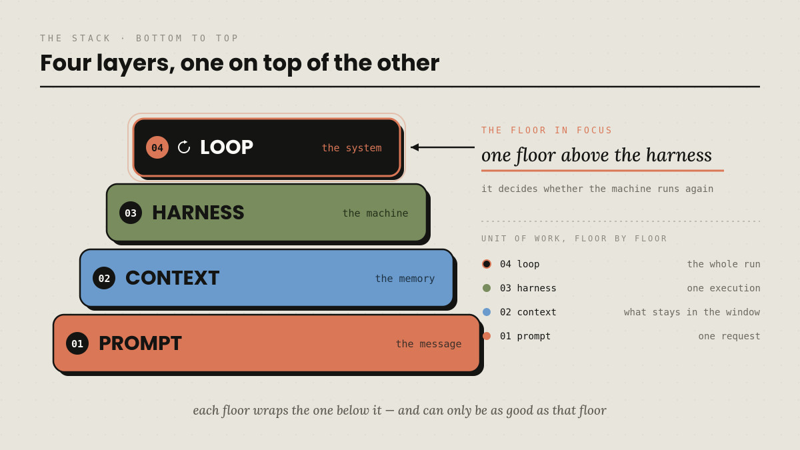
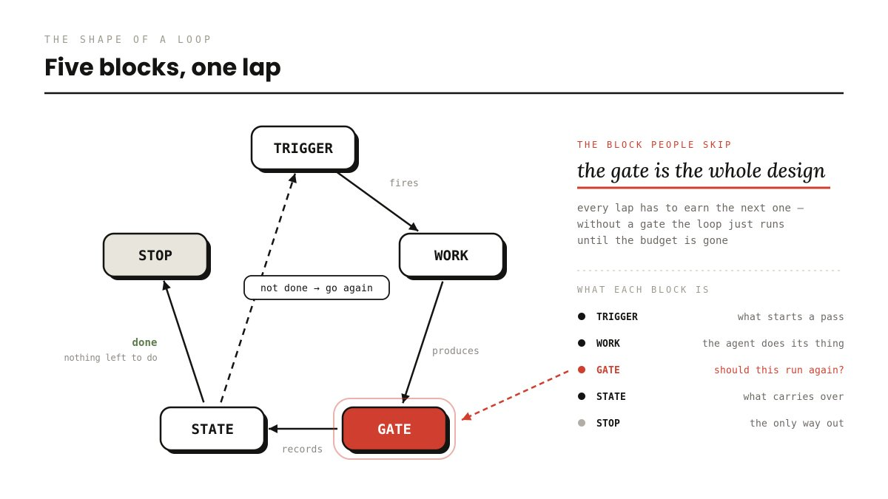
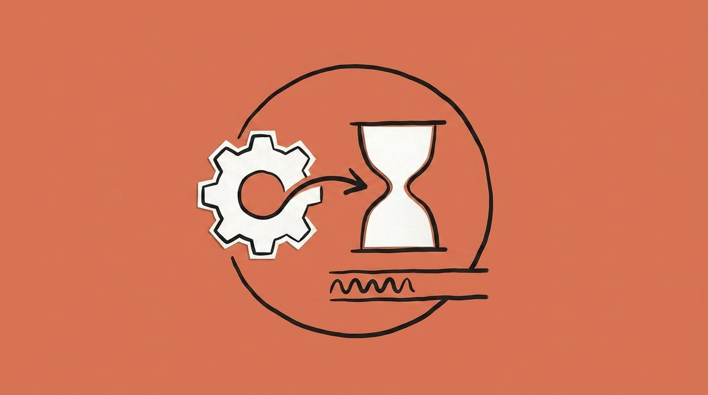
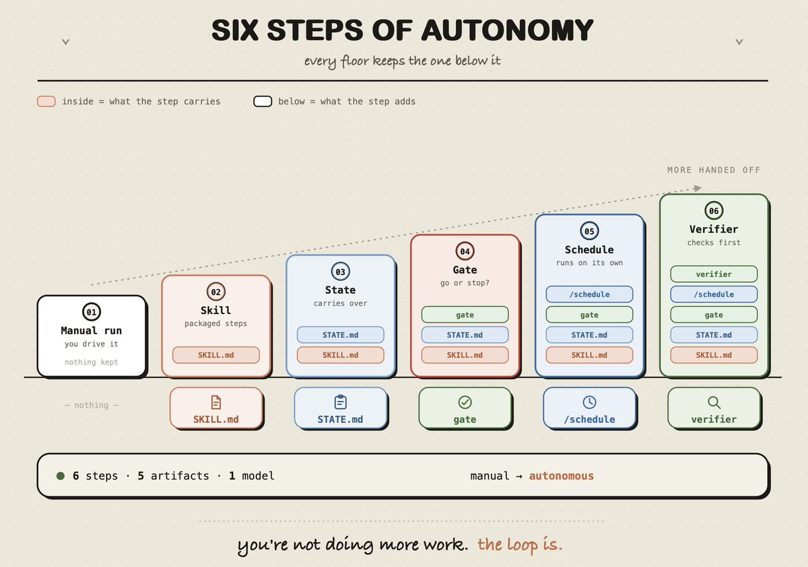
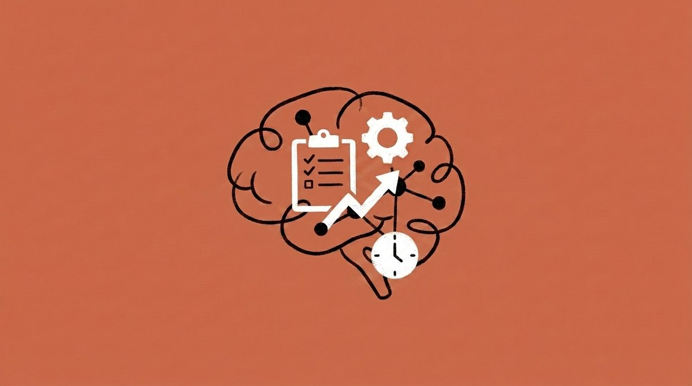
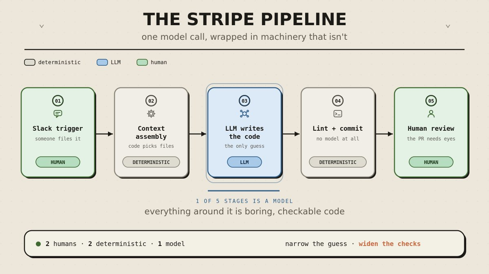
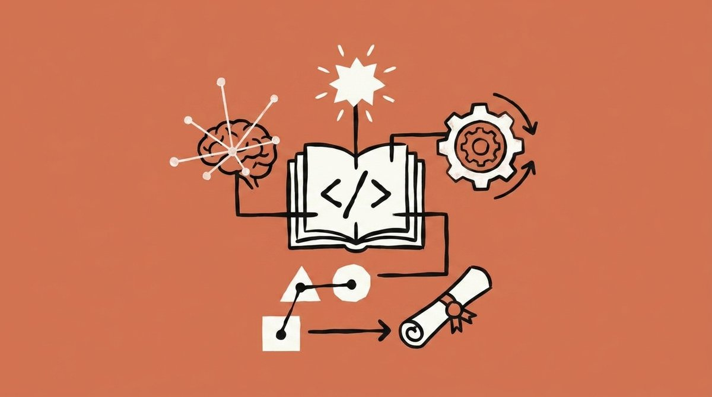
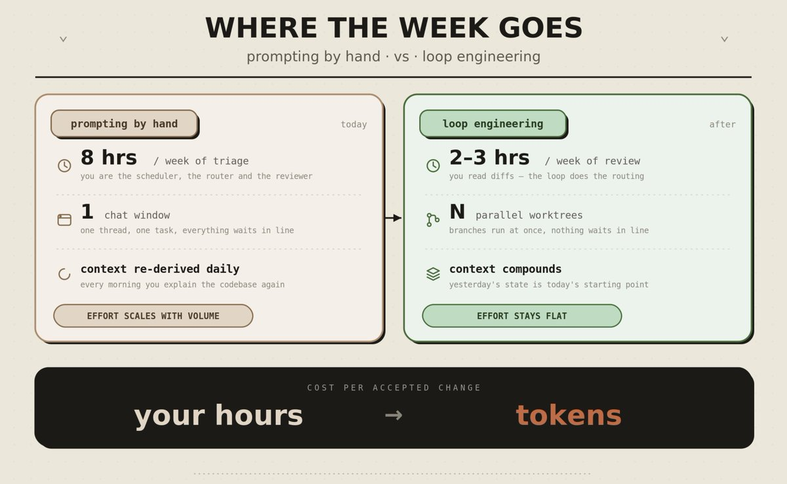
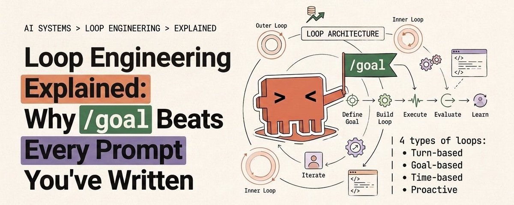

# 📰 CLAUDE LOOP ENGINEERING: HOW TO BUILD AN AGENT THAT WORKS WHILE YOU SLEEP

> where loop engineering sits in the stack, the four loop types in Claude Code, the evaluator that decides whether any of it works, and the four bills nobody warns you about

---

In one paragraph: loop engineering means you stop being the person who prompts the agent and start building the system that prompts it for you

It runs on a trigger, does the work in an isolated space, has a second agent reject bad output, writes what happened to disk, and picks up tomorrow where it stopped.

This guide covers where the idea came from, the four loop types in Claude Code, how to build your first one in order, and the four ways loops bill you while you sleep.

---

## The 60-Second Version

\| Question                \| Short answer                                                                             \|
\| ----------------------- \| ---------------------------------------------------------------------------------------- \|
\| What is a loop?         \| An agent repeating cycles of work until a stop condition holds                           \|
\| What changed in 2026?   \| The point of control moved from writing prompts to designing the system that writes them \|
\| What makes a loop work? \| The gate. Something objective that can reject the output                                 \|
\| What makes a loop fail? \| The same thing, missing                                                                  \|
\| Where do I start?       \| One recurring task, one skill, one state file, one gate                                  \|
\| What does it cost?      \| Tokens you cannot predict, plus review time you have to keep paying                      \|
\| Who should skip it?     \| Anyone whose task does not repeat weekly or cannot be checked automatically              \|

---

## The Opening Fact

March 2026. Andrej Karpathy pushes three files to GitHub. Around 630 lines between them.

One held the model. One scored it. One told the agent which file it was allowed to touch. Then he closed the laptop.

Two days later that setup had worked through roughly 700 experiments and surfaced 20 improvements to a model he had been tuning by hand for two decades. 

One of them was a missing scalar in the attention path. No linter catches that. A careful engineer could have, and across twenty years nobody did.

The prompt inside it was ordinary. Everything that mattered lived in the three files around it: pick the next experiment, run it, score it, keep the change or roll it back, go again.

Shopify's CEO ran a similar overnight setup on an internal model and woke up to a 19 percent quality gain on a model half the size.

People get bored somewhere around experiment twelve. A loop never gets bored.

> The term arrived in a single week. June 2026: Peter Steinberger, author of OpenClaw, posts that you should be designing the loops that prompt your agents rather than prompting them yourself. The post clears 8 million views. Around the same days Boris Cherny, who leads Claude Code at Anthropic, says his job now is writing loops that prompt Claude and work out what to do next. On June 7 Addy Osmani, an engineer on the Google Chrome team, writes the whole thing up and gives it the name that stuck.

Three people, one week, no coordination between them. That usually means the ground already moved and everyone was standing on it.

Meanwhile your subscription is probably running at ten percent capacity. One window, one task, one human sitting there waiting for the output to finish.

---

## 1/ Where Loop Engineering Sits

Every few months another "X engineering" shows up and everyone rolls their eyes. This one earns its place because the four terms stack instead of replacing each other

\| Layer               \| Unit it handles                \| The question it answers                               \|
\| ------------------- \| ------------------------------ \| ----------------------------------------------------- \|
\| Prompt engineering  \| One message                    \| What do I tell the model                              \|
\| Context engineering \| One window                     \| What goes in, what gets summarized, what gets cleared \|
\| Harness engineering \| One run                        \| Which tools, which permissions, what counts as done   \|
\| Loop engineering    \| The schedule above the harness \| How does it run itself, over and over                 \|

Each floor up, the unit gets bigger. One sentence, one window, one run, then a system that keeps running without you striking the clock.

The first three layers assume you are sitting at the keyboard directing the agent. The fourth removes that assumption.

Keeping the layers separate matters for one practical reason: each fails on a different clock. A bad prompt shows up in seconds. Bad context shows up in the answer. A bad harness burns a run. A bad loop changes code at 3 a.m., feeds the error into the next run, and nobody notices for a week.

The higher the floor, the further you are from the scene, and the longer mistakes compound before anyone catches them

---

## 2/ What a Loop Is Built From

A prompt is a sample. A loop is a controller.

Strip the vocabulary away and every working loop has the same five parts:

- The trigger - what starts a run. Your message, a clock, an event, a webhook. Without it you are still the clock.

- The work - the agent gathers context, acts, reads what came back.

- The gate - something with no taste that can reject the output. A test suite, a build, a type check, a linter exit code. Without it the agent reviews itself every cycle, with enormous warmth.

- The state - a file outside the conversation holding what got done and what comes next. Without it tomorrow starts from zero.

- The stop - the condition that ends the run, plus a hard cap for when the condition never arrives. Without it the thing spends until a human notices.

One turn of a real loop, in order:

1. Discover - work out what this run should do

1. Hand off - give the task to an agent in its own isolated workspace

1. Verify - a second agent, different instructions, tries to break it

1. Persist - the outcome lands on disk, not in the chat

1. Schedule - the next run gets set, and today's leftovers carry over

Take any one of those out and the thing either stalls or spins in place while the meter runs

---

## 3/ The Four Loop Types in Claude Code

The Claude Code team sorts loops by two questions: what starts a run, and what ends it. The answers tell you which command to reach for.

\| Type       \| Starts when                           \| Ends when                            \| Command                                  \|
\| ---------- \| ------------------------------------- \| ------------------------------------ \| ---------------------------------------- \|
\| Turn-based \| You send a prompt                     \| Claude judges the task done          \| Prompting + a verification skill         \|
\| Goal-based \| You state the finish line             \| An evaluator confirms the condition  \| /goal                                    \|
\| Time-based \| An interval elapses                   \| You cancel it, or the work completes \| /loop, /schedule                         \|
\| Proactive  \| An event or schedule, nobody watching \| Each task exits on its goal          \| All of the above + workflows + auto mode \|

---

## Turn-based: improve the check

The ordinary agentic loop you already run daily. It gets better when you write your verification into a SKILL.md, so Claude checks the result the way a reviewer would instead of stopping at a successful edit.

\`\`\`
\---
name: verify-frontend-change
description: Verify any UI change end-to-end before calling it done.
\---

1\. start the dev server, open the edited page
2\. click the new control, confirm the state change, screenshot before/after
3\. browser console: zero new errors or warnings
4\. run a performance trace, audit Core Web Vitals

if any step fails, fix it and rerun from step 1
\`\`\`

The more measurable those steps are, the less room Claude has to talk itself into finishing early

---

## Goal-based: /goal

\`\`\`
/goal get the homepage Lighthouse score to 90 or above, stop after 5 tries
\`\`\`

What makes it work is who decides. A small fast model reads the transcript after every turn, answers yes or no, and returns a one-line reason that becomes guidance for the next turn.

> The rules worth knowing: one goal per session, and a new one replaces the old. /goal with no argument shows turns, tokens and the evaluator's last reason. /goal clear ends it. The condition can run to 4,000 characters, and it can only judge what Claude surfaced in the conversation, because the evaluator runs nothing itself.

So all tests in test/auth pass and the lint step is clean holds up across twenty turns. The code looks clean collapses on the first one.

---

## Time-based: /loop and /schedule

\`\`\`
/loop 5m check my PR, address review comments, and fix failing CI
\`\`\`

/loop lives on your machine. /schedule moves the same shape into the cloud as a routine that keeps going with the lid closed.

---

## Proactive: everything stacked

\`\`\`
/schedule every hour: check the project-feedback channel for new bug reports

/goal: don't stop until every report found this run is triaged, actioned, and
responded to. when fixing a bug, explore three solutions in parallel worktrees
and have a judge adversarially review them.
\`\`\`

One command, four primitives: a cloud trigger, a stated finish line, isolated parallel workspaces, and a reviewer arriving with fresh context.

[⚠️](https://abs.twimg.com/emoji/v2/svg/26a0.svg) Two commands people mix up constantly. /loop reruns on a timer. /goal runs until a condition holds. Scheduling and stopping are separate jobs, and most broken loops confuse them

---

## 4/ The Evaluator: The Part Everyone Skips

Building something that runs is the easy half. The hard half is putting something inside it that can say no.

Anthropic engineer Prithvi Rajasekaran ran into this while building long-running applications: ask an agent to evaluate work it produced and it praises the work with confidence, even when a human can see the quality is mediocre.

> The reason is structural rather than a matter of intelligence.
The context where the code was written is packed with every argument for writing it that way, so on reread the agent sees its own reasoning instead of the result. Writers hit the identical failure - you reread a draft and see the version in your head.

Inside a loop it compounds. Every round where the writer decides "good enough" is a round of agreeing with itself.

Rajasekaran tried the obvious fix first, pushing the generator to be harder on its own output. It went badly, and his conclusion is the useful part: tuning a standalone skeptic is far easier than making an author self-critical. He took the shape from GANs, one network building and one picking holes

\|                \| Decorative evaluator                      \| Real evaluator                                                    \|
\| -------------- \| ----------------------------------------- \| ----------------------------------------------------------------- \|
\| Instructions   \| Same as the generator, plus "review this" \| Its own, written to find faults                                   \|
\| Model          \| Identical                                 \| Different where possible - same base keeps the same blind spots   \|
\| Method         \| Reads the code                            \| Acts on it: opens the page, clicks, screenshots, inspects the DOM \|
\| Default stance \| Trust                                     \| Assume it is broken until proven otherwise                        \|
\| Result         \| Two optimists reaching agreement          \| The loop can actually say no                                      \|

Rajasekaran wired his evaluator to Playwright MCP for exactly that reason. The verdict moves from "the JSX looks fine" to "I clicked login, it navigated, here is the screenshot."

/goal ships this idea as a product primitive: completion gets decided by a fresh model that took no part in producing the work. Banks have run on the same rule for decades - the person entering a large transfer and the person approving it cannot be the same person.

The generator sets what your loop can produce. The evaluator sets what it refuses to produce.

---

## 5/ The Filter: Is the Task Even Loop-Shaped

Four conditions have to hold at the same time. Break one and the loop takes more than it gives back.

- The task recurs at least weekly - check your calendar, not your intentions.

- Something can reject bad output automatically - name the command that fails: npm test, tsc, the build.

- The token budget survives waste - loops retry, re-read and wander, so assume runs that ship nothing.

- The agent has senior tools - logs, a reproduction environment, the ability to run what it wrote and watch it break.

The loops that pay off first are unglamorous: CI failure triage, dependency bump PRs, lint-and-fix passes, flaky test reproduction, issue-to-PR drafts where coverage is real.

> The exciting ones are exactly the ones to keep manual: architecture rewrites, auth and payments, production deploys, vague product work, anything where "done" is a call somebody has to make.

One line worth taping to the monitor: when review capacity was already your ceiling, a loop lengthens the queue instead of shortening it.

---

## 6/ Building the First One, in Order

Sequence beats tooling here. Jumping ahead is how loops blow up while everyone sleeps.

1. Make one manual run reliable. Do the task by hand with Claude until the outcome is repeatable and dull. You cannot automate something you cannot repeat.

1. Write that run down as a skill. Conventions, build steps, the workaround your team keeps for that one flaky runner. Have the schedule fire a named skill rather than a wall of pasted instructions, because instructions inside a cron job never get updated by anyone, ever.

1. Add a state file. STATE.md at the repo root. Version controlled, diff readable, boring.

1. Put a gate and a cap around it. An objective check plus a turn limit. This is the step where the loop gains the ability to fail.

1. Then schedule it. /loop while you are still watching. /schedule once you trust it unattended.

1. Bring in a verifier subagent. A second agent in .claude/agents/, its own instructions, ideally a different model.

\`\`\`
\# Loop state · ci-triage

\## Last run
2026-07-28 03:30 UTC · 7 failures classified, 3 fixes drafted, 4 escalated

\## In progress
\- claude/fix-auth-token-refresh - tests pass locally, awaiting CI

\## Escalated to humans
\- src/billing/refund.ts - failing three ways, root cause unclear

\## Lessons learned (write here, not in chat)
\- 2026-07-27: tests/e2e/checkout needs the Stripe webhook secret. skip if missing
\`\`\`

Memory ends with the session. A file in the repo outlives it. Context is what the agent sees this round, memory is what survives the window being cleared, and only one of the two is yours to keep

For long runs, pair the state file with a standing VISION.md. STATE.md holds the position, VISION.md holds the destination, and the second one is what stops goal drift around turn 47

Give parallel agents isolation: worktree so two of them can never write the same file - two agents editing one file is the same mess as two engineers pushing to the same lines without talking. Let the builder run fast and cheap, and hand the reviewer the slower, stricter model

---

## 7/ Where It Actually Runs

"It runs while you sleep" gets thrown around loosely. A local loop dies the moment the lid closes.

\|                        \| Cloud routine   \| Desktop scheduled task \| /loop        \|
\| ---------------------- \| --------------- \| ---------------------- \| ------------ \|
\| Runs on                \| Anthropic cloud \| Your machine           \| Your machine \|
\| Machine has to be on   \| No              \| Yes                    \| Yes          \|
\| Session has to be open \| No              \| No                     \| Yes          \|
\| Minimum interval       \| 1 hour          \| 1 minute               \| 1 minute     \|
\| Sees your local files  \| No, fresh clone \| Yes                    \| Yes          \|

Read it backwards from the task. Watching a local dev server every minute is only possible with /loop. Scanning open issues at 3 a.m. and opening PRs belongs in a cloud routine or a scheduled GitHub Action, because laptops get carried out of the house.

Local scheduling is "run a few more rounds while I am here." Cloud scheduling is "run while I am not." Treating those as one thing is why half the loops people brag about stop the moment they leave the desk.

The layer underneath is ordinary cron: five fields, one-minute granularity, and CLAUDE\_CODE\_DISABLE\_CRON=1 turns the whole thing off.

---

## 8/ Two Loops Already Running

> One person, one morning. Osmani's own triage loop wakes up before he does. A triage skill reads yesterday's CI failures, open issues and recent commits. Every finding worth acting on opens its own isolated worktree.

One sub-agent drafts the fix, a second attacks it against the project's tests and skills. Connectors open the PR and update the ticket, anything ambiguous lands in an inbox for a human, and the state file carries leftovers into tomorrow.

Nothing in that chain needs his hand, and it still stops for a human exactly where judgment starts.

One company, 1,300 PRs a week. Stripe runs an internal system called Minions, described publicly by engineer Steve Kaliski. More than 1,300 PRs merged weekly with nobody typing the code. You trigger it by tagging a bot in Slack or dropping an emoji on a message, then forget about it.

The interesting part sits before the model wakes up. A deterministic orchestrator assembles the context first - it scans the links in the message, pulls Jira, finds the docs, searches the relevant code through Sourcegraph and MCP.

Only then does the agent start writing, with everything laid out. After it finishes, a hard-coded pipeline runs the linter and the agent cannot step around it.

Three things worth taking from it:

1. Anything a rule can decide never goes to a probabilistic model. Finding the materials is deterministic work, so deterministic code does it.

1. Reliability came from constraints, not model size. Minions is a fork of the open-source tool Goose, not a secret frontier model.

1. The humans did not leave. Those 1,300 PRs are still reviewed by engineers. They changed desks, from writing to reviewing.

> [⚠️](https://abs.twimg.com/emoji/v2/svg/26a0.svg) On the numbers flying around. "90 percent of Claude Code writes itself" and similar headline figures are mostly secondhand. 

Anthropic's own 8x merge-rate figure comes with the company calling it almost certainly an overstatement of the real gain. The two cases above trace to firsthand sources, which is why they are the ones worth reasoning from.

---

## 9/ The Four Bills

None of these sends an alert while the loop is running

\| Bill                \| Symptom                                                    \| Guard                                                          \|
\| ------------------- \| ---------------------------------------------------------- \| -------------------------------------------------------------- \|
\| Verification debt   \| Unreviewed output piles up, errors accumulate out of sight \| An evaluator that is not the agent doing the work              \|
\| Comprehension rot   \| The repo grows, the map in your head stays where it was    \| Read a few merged diffs weekly and explain them to yourself    \|
\| Cognitive surrender \| You stop forming an opinion and take whatever comes back   \| Execution can be handed over, deciding cannot                  \|
\| Token blowout       \| Spend swings wildly, the invoice is unpredictable          \| Per-run budget, daily budget, max retries, set before shipping \|

Verification debt is where the Ralph Wiggum loop lives, named by Geoffrey Huntley: the agent fires the completion signal on a half-finished job and the run exits pleased with itself.

The cure is a gate with no opinion, something that compiles or fails, returns zero or non-zero. A reviewer with an opinion eventually argues itself into approval.

- Comprehension rot makes no sound until the one bug the loop cannot fix, buried in a file you have never opened. That is the morning you find out you became a visitor in your own project.

- Cognitive surrender is the slope underneath both. The steadier the loop runs, the more you trust it, the less you look, the less able you are to judge. You do not have to override it often. You do have to stay capable of saying this is wrong.

- Token blowout is the one that hits an invoice. What you wrote is logic, what you pay for is run count times unit price, and one bug spinning all night turns into a bill instead of a fix.

There is a security tab underneath all four. Generated code merges faster than anyone reads it, so put SAST, dependency audit and secret scanning inside the gate.

Auto-installed community skills bring along whatever sits in their descriptions, and one audit of 17,022 skills found 520 leaking credentials. Verbose logging on a long run scatters secrets into logs nobody watches. And the write permission added "just this once" never gets reviewed again unless you put it on a calendar.

The most appealing thing about this approach is that one person can do a team's work. The risk sits in the same spot: a team argues with itself, and one person plus a stack of loops turns into a room where everyone agrees.

[Embedded Tweet: https://x.com/i/status/2081708840622379222]

---

## 10/ The One Metric

Cost per accepted change.

Token spend, PR count and number of scheduled loops all resemble progress, and none of them measure it. If fewer than half the changes your loop produces survive review, you are doing the review work the loop was meant to remove.

Claude Code hands you the inputs: /usage breaks recent spend down by skills, subagents and MCPs, /goal with no argument reports turns and tokens on the active goal, and /workflows shows per-agent usage while letting you kill any agent mid-run.

---

## 11/ What This Is Worth in Money

- Contract setup work. Small teams pay $3k-8k to have someone stand up CI triage, dependency automation and an overnight review loop. Everyone internally wants it and nobody has a free week to build it.

- A retainer on top. $500-1,500/mo to keep those loops tuned once they run.

- Your own hours. Morning triage that ate 8hrs a week comes down to 2-3hrs of reading diffs. A full working day back every week, priced at whatever your day costs.

- The title. $95k developer and $300k AI architect are often the same person eighteen months apart, running a different stack.

- The entry price. The first loop runs on a $20 subscription. Heavy overnight verification needs a real budget, CI triage does not.

The part nobody selling this will say out loud: on a consumer plan running heavy verification against serious work, the spend shows up weeks before the payoff does

> Build one loop on one recurring task and let the result argue for the budget.

Generation is the thing loops make almost free. Code, plans, PRs, fixes, all mass-produced at near zero cost, which is exactly why none of it is scarce anymore.

What stays scarce is judgment. Knowing which plan is right, which change should be stopped, which output runs perfectly and is wrong at the root.

The loop can produce a hundred options and it can even pick one, but its basis for picking is "looks reasonable" rather than "is correct." That gap is the entire reason the job still exists

---

## 12/ Where to Start Tonight

Take the task you open out of habit every morning. The one you would describe to a new hire as "you just have to look at it daily."

Then work out which single piece of it you can hand over first. 

- Can you write down how the work gets checked? That is a skill

- Can you state exactly what finished looks like? That is a /goal

- Does the work arrive on a clock rather than from you? That is /loop, and later /schedule

- None of the above yet - then the answer is one reliable manual run

Build that one. Watch where it stalls and where it reaches too far. Tighten it. Then build the second.

Two people can build an identical loop and end up in opposite places six months later. One used it to move faster on work they already understood, so the loop multiplied their judgment. 

The other used it to stop having to understand anything, so the loop multiplied that instead. The system plays no favorites. It is a multiplication sign, and you are the number.

Karpathy handed the keyboard to an experiment loop and got twenty years of missed improvements back in two days. Cherny, who built Claude Code, says his job now is writing loops. Both of them still make every call that carries weight.

Build the loop. Build it as someone who plans to stay the engineer, rather than the person who presses go.

---

## The Whole Thing in One Table

\| You hand off       \| The primitive                    \| Use it when                            \|
\| ------------------ \| -------------------------------- \| -------------------------------------- \|
\| The check          \| A verification skill             \| You are still exploring or deciding    \|
\| The stop condition \| /goal                            \| You know exactly what done looks like  \|
\| The trigger        \| /loop, /schedule                 \| The work arrives on a schedule         \|
\| The prompt itself  \| Routines + workflows + auto mode \| The work is recurring and well defined \|

---

The stack:

📁 Claude Code loops guide
↳[ claude.com/docs/en/scheduled-task](https://code.claude.com/docs/en/scheduled-tasks)s

📁 /goal documentation
↳[ claude.com/docs/en/goa](https://code.claude.com/docs/en/goal)l

📁 Claude
↳[ claude.a](https://claude.ai/)i

## And if you found this useful:

- For weekly deep dives into AI architecture and the agent economy, follow [@polydao](https://x.com/@polydao)

- Join the TG Channel: [Buzzoni Notes](https://t.me/+Wf8q84QkpyJhNjIy) \- here I share my raw prompts, custom skills, and alpha that's too early for X

### 🖼️ Attached Media

## 💬 Replies

### 1 @Alexvx_nft (ALEXYZ)

*Fri Jul 31 06:07:28 +0000 2026*

@polydao Loop based workdays feel refreshingly practical.

### 2 @slash1sol (slash1s)

*Fri Jul 31 05:27:07 +0000 2026*

@polydao will read it asap🙌

### 3 @max_bevza (Max Bevza)

*Fri Jul 31 07:24:41 +0000 2026*

@polydao thanks for the guide

### 4 @gerardsans (Gerard Sans | Axiom 🇬🇧)

*Fri Jul 31 14:25:55 +0000 2026*

@polydao [x.com/gerardsans/sta…](https://x.com/gerardsans/status/2083153700004999625)

### 5 @farxxxxx1 (farxxxxx)

*Fri Jul 31 07:59:03 +0000 2026*

@polydao tbh "token blowout" is the realest fear here lmao

### 6 @talwar_divyam (Divyam)

*Sun Aug 02 03:49:30 +0000 2026*

@polydao [x.com/talwar\_divyam/…](https://x.com/talwar_divyam/status/2083757972023619990)

### 7 @talwar_divyam (Divyam)

*Sun Aug 02 00:41:35 +0000 2026*

@polydao [x.com/talwar\_divyam/…](https://x.com/talwar_divyam/status/2083689810800369830)

### 8 @0xFiseo (Fiseo)

*Fri Jul 31 18:10:53 +0000 2026*

@polydao karpathy ran 700 experiments while he slept and i'm still here manually typing "please check if it compiles"

### 9 @diqiuzhuanzhuan (Loong)

*Tue Sep 01 08:13:39 +0000 2026*

@polydao marked!

### 10 @mmoyshaa (Moysha)

*Fri Jul 31 10:14:16 +0000 2026*

@polydao Booked

### 11 @SanAyeaye86116 (Ayeaye San)

*Sat Aug 01 15:32:15 +0000 2026*

@polydao A mature approach to internet of things balances technical performance with ethical considerations in high-risk industries.

