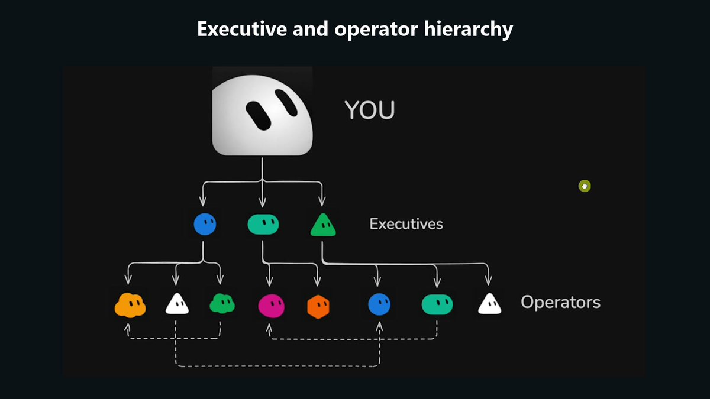
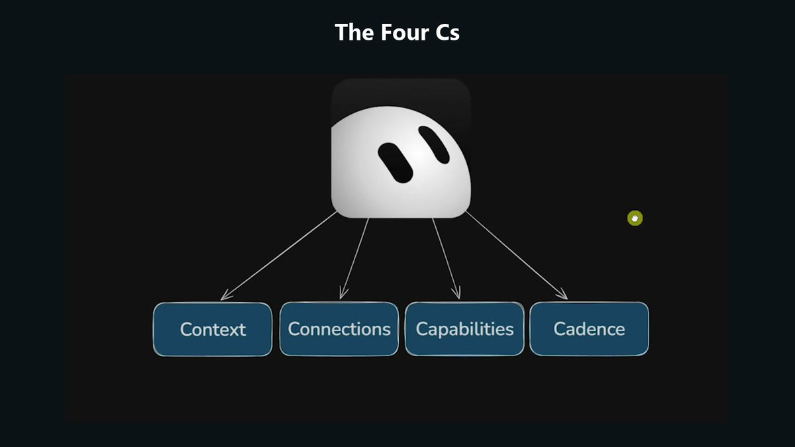
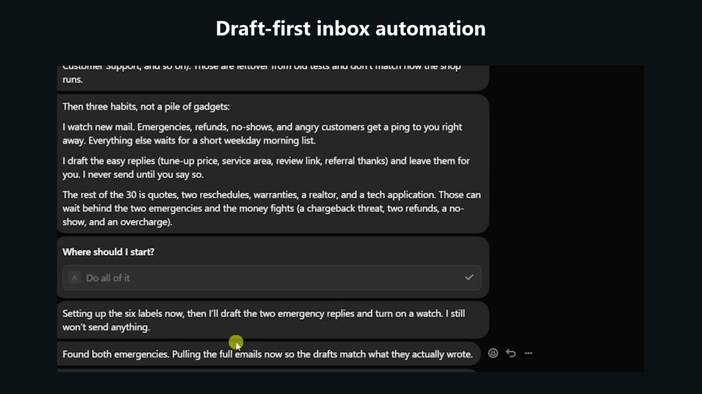
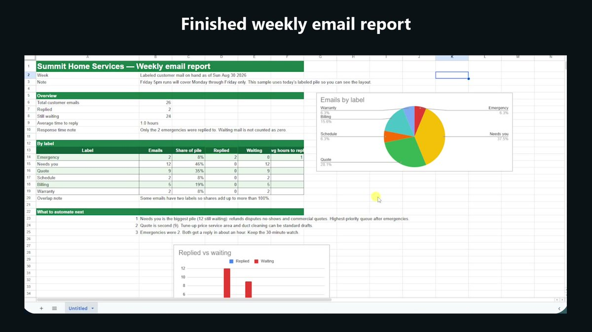
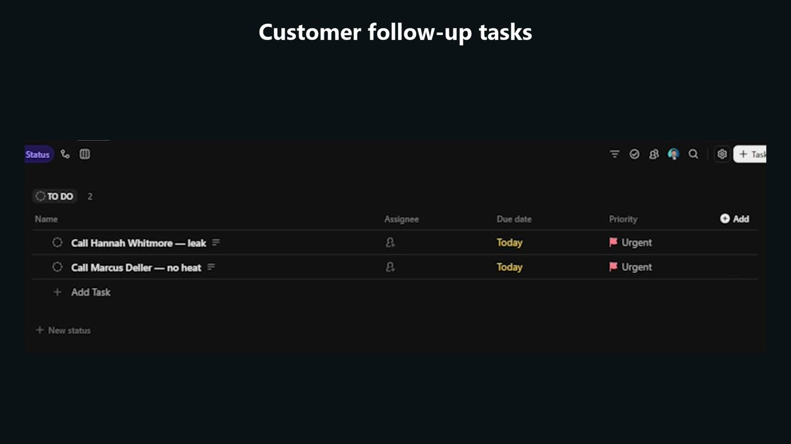
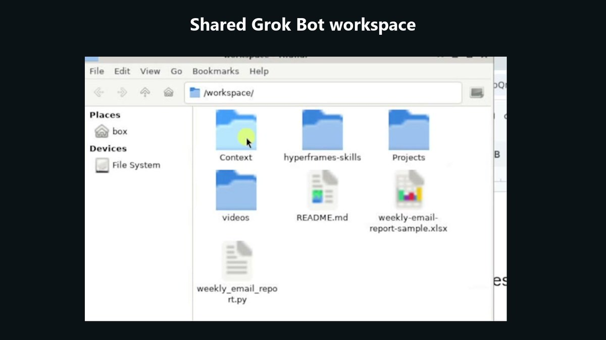
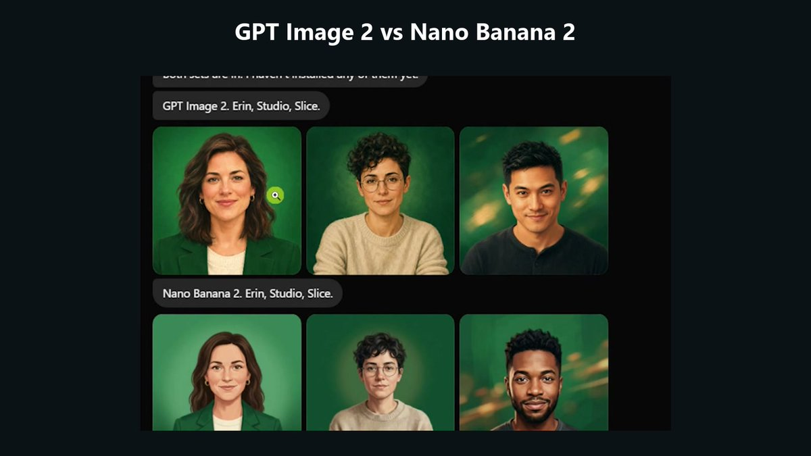
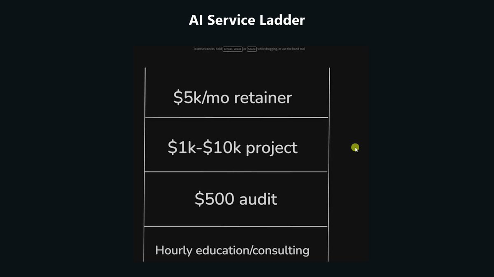
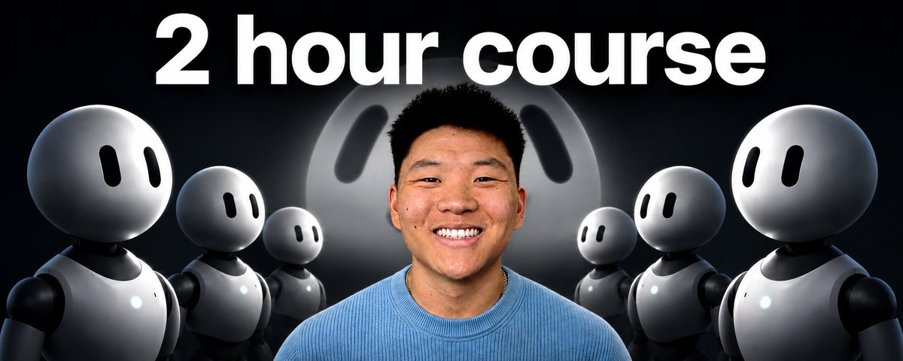

# 📰 Build & Sell Grok Bots (2 Hour Course)

Grok Bot gives you a team of AI agents that can use your tools, talk to each other, and keep working while your computer is off.

I have been getting my hands dirty with it since it came out, and it has moved past being a fun agent swarm demo for me.

The useful version is not one giant bot that knows everything. It is a small leadership layer that delegates to specialists with narrow jobs, clear context, and routines that keep work moving.

TL;DR

→ Give each bot one specific job instead of building one mega-agent

→ Build around four things: context, connections, capabilities, and cadence

→ Start with drafts and human review, then expand autonomy as the bot earns trust

→ Turn repeated work into skills and event-based or time-based routines

→ Use a shared workspace and a work log so agents can pass projects around without losing context

→ Package the finished bots as templates or use Grok Bot setup as a low-risk service offer

## Build the Team Before the Tasks

Grok Bot feels like a familiar team chat, but every teammate can have its own role, memory, tools, routines, and screen.

The bots can sign into services, use a browser, create files, message each other, delegate work, and keep going in the cloud after you close the desktop app.

They share one computer and its authenticated sessions, but each bot gets its own screen and conversation. You can also use the mobile app, which is why I think of Grok Bot as the agent team I can reach while I am away from my desk.

That is different from how I use Codex or Claude Code.

When I am sitting at my desk building production software, websites, or a larger codebase, I still prefer a coding harness. It gives me better control over GitHub, deployment, sessions, context, testing, and the structure of the project.

I use Grok Bot more for quick knowledge work, recurring automations, research, approvals, task management, and agents I want available on my phone.

If I wanted to build a production content pipeline, I might build it in Codex or Claude Code. If I wanted a team to run an Instagram account, prepare reports overnight, or react to business events while I was at lunch, I would look at Grok Bot.

The structure matters because one bot connected to twenty specialists gets messy fast.

The main agent has to understand every job, choose the right specialist, avoid duplicated work, and notice any gaps. As the team grows, that agent becomes the bottleneck.

I prefer a simple hierarchy:

1\. I talk to a few executive bots.

2\. Each executive owns a vertical such as operations, finance, or marketing.

3\. The executive delegates to narrow operator bots that do one specific task well.

My own setup has a chief of staff, COO, chief content officer, and CFO at the top. Under them are specialists for X research, animations, content strategy, meeting transcripts, finance, and other repeatable work.

The leadership bots can sit in a shared channel, compare what happened in their areas, tag each other, and make recommendations together. The operator bots can still reach across teams when a task depends on information from another vertical.

A clear description on every bot makes that routing possible. The description is not a bio. It tells the rest of the system what the bot owns and when it should be called.

## The Four Cs

I use the same framework for Grok Bot that I use for any AI operating system:

→ Context

→ Connections

→ Capabilities

→ Cadence

Context is the information that makes the system specific to you.

That includes who you are, what the business does, your goals, priorities, customers, team, pricing, tone, and the way you like to work.

Connections give the bots access to live systems. Gmail, Google Drive, Calendar, ClickUp, Slack, Fireflies, QuickBooks, LinkedIn, YouTube, and other tools are where the current state of the business actually lives.

A connection should do more than read data when the use case requires action. The bot may need to draft an email, create a task, edit a Google Doc, generate an asset, update a spreadsheet, or send a report.

Capabilities are the instructions for doing a task well. Grok Bot often stores these as skills.

Think of a skill like a recipe. When an agent needs to make chocolate chip pancakes, it should not reinvent the recipe every time. It should find the skill, read the inputs and steps, produce the deliverable, and verify that it meets the definition of done.

Cadence is what turns the capability into an automation.

A routine can run every five minutes, every Friday, after a Slack message, or when another supported event happens. Grok Bot had time-based routines plus triggers for tools such as Slack and Microsoft Teams during the recording, with more event triggers expected over time.

The order matters.

A bot with connections but no context has access to your tools without enough judgment to use them well. A bot with context but no capability still lacks a reliable process. A capability without cadence waits for you to remember to ask.

I built a fresh account during the course so the setup was visible from the start.

At the time of recording, SuperGrok started at $30 per month. Grok Bot had originally required the $200 plan, so the lower entry point made this much easier to test. Pricing can change, but that was the plan used for the build.

After installing the desktop app and signing in, Grok Bot provisions its cloud computer. The onboarding asks which tools you use, then creates the first bot.

I called mine Friend and treated it as a chief of staff.

The demo business was Summit Home Services, a fake HVAC company in the Twin Cities with a small team, a no-upsell philosophy, and an owner who was buried in email.

I started with a short explanation of who I was and how I wanted the bot to communicate. Then I gave Friend a Google Doc containing the company snapshot, hours, services, pricing, and operating details.

The bot could not read the private document until Google Drive was connected. Adding the plugin was a normal sign-in flow, and the permissions could be limited to viewing or expanded to editing, creating, and deleting.

I labeled the connection with the account name because multiple Google, Gmail, ClickUp, or Slack accounts get confusing quickly.

Once connected, Friend read the document and saved the useful information to memory. The company document became the source of truth instead of relying on whatever I happened to explain in chat.

## Start With a Real Bottleneck

The first specialist was an inbox agent.

Friend created it, passed over the company context, explained the job, and pointed it to the source document. The new agent saved the brief and waited for approval instead of immediately touching the inbox.

I connected Gmail and asked the agent to analyze the inbox before building anything.

The account had about 5,200 unread messages, but cleaning old email was not the highest-value job. Two current emergencies mattered more: Marcus had no heat with a newborn in the house, and Hannah had a leaking water heater.

The inbox agent recommended six labels:

→ Emergency

→ Needs You

→ Quote

→ Schedule

→ Billing

→ Warranty

Vendor pitches and SEO spam could be ignored.

It also recommended three habits: watch for urgent mail, send a short weekday morning summary for everything else, and draft easy replies using the company documentation.

I approved the plan, but the first version only created drafts. It did not send customer emails on its own.

The emergency watch ran every 30 minutes. It checked for new customer mail, applied the labels, surfaced emergencies, and did nothing when there was no urgent action.

The bot drafted replies for Marcus and Hannah using details from the source document, including the $150 Sunday emergency fee. I reviewed the drafts, approved them, and then told it to send.

My rule for agent systems is simple: You can outsource the thinking, but you cannot outsource the understanding.

Let the bot inspect the inbox and recommend a system, but do not blindly build every suggestion. You still need to understand the bottleneck, decide what should happen, and know why the automation helps.

I use what I call the bike method for expanding autonomy.

Teaching a bot is like teaching a kid to ride a bike. You start with a hand on the handlebar, watch closely, correct the lean, and slowly remove support as the behavior becomes reliable.

Putting fifteen agents into production on day one is the equivalent of sending the kid down the street and going inside for a nap.

Start with drafts. Review the classifications. Correct mistakes. Update the instructions. Keep a human close enough to catch problems.

When a repeated process stabilizes, turn it into a skill.

The inbox agent built a weekly email report skill that ran every Friday at 5 PM. It reviewed the week's labeled messages and created a one-page Google Sheet showing request volume, open items, and average response time.

The first sheet contained the right data but looked plain, so I asked for branded green headers, clearer columns, a chart showing emails by label, and a replied-versus-waiting chart.

The bot updated both the deliverable and the underlying skill. The next Friday's report would use the improved version without needing the same feedback again.

The finished report included the green headers and both charts.

Skills appear as private plugins and can include a name, description, inputs, steps, and expected output. Existing Claude Code or Codex skills can also be brought into the environment, and skills can be invoked with slash commands.

The annoying part is that browser-based work can still require help.

The bot could create the spreadsheet data through the connection, but it needed a signed-in browser session to finish some visual formatting. I took over the shared computer, logged into Google once, and handed control back.

Grok Bot can also learn a browser task by watching you perform it and turning the recording into a skill. I would use that for short, stable click paths, not a complicated workflow that changes every week.

Every capability also needs a verification loop.

If an agent creates a video, tell it to inspect screenshots from the render. If it writes a research report, tell it to verify current sources and resolve conflicting claims. If it builds a spreadsheet, tell it to open the final file and confirm that the charts, formulas, and formatting are actually there.

The goal is to receive version four or version seven after the agent has reviewed its own work, not the first output it stopped on.

The course account had used about 6 percent of its weekly allowance during the early skill build and 13 percent after the inbox and ClickUp work. Usage depends on what the agents do, but the dashboard makes the weekly consumption visible.

## Make the Agents Work Together

The customer replies exposed a gap.

The emails promised that someone would follow up, but no task had been assigned to a person. The inbox automation had completed its part without closing the operational loop.

I went back to Friend and asked it to design the handoff.

Friend recommended another specialist whose only job was ClickUp. I named him Fred.

The workflow became:

1\. Inbox reads and classifies the customer email.

2\. When a human follow-up is required, Inbox sends Fred the customer name, phone number, address, request, and urgency.

3\. Fred creates a ClickUp task, assigns the correct person, adds a due date, and keeps the task visible.

4\. Friend oversees the process instead of doing every step itself.

For the demo, Friend created a Summit Home Services Grok Bot list inside the Internal Automations space. The first two tasks were calls for Hannah and Marcus.

In a real company, Fred could use a team directory, specialties, calendars, or a scheduling database to choose the right technician for AC, water heaters, warranty work, or other requests.

I expanded that idea into a general work log.

Every meaningful project should record the assigned bots, status, owner, start time, due date, links, and final deliverable. After a month, I want to see what the bots actually completed, not rely on a pile of chat histories.

Friend turned this into a Log to ClickUp skill.

The first version logged too much. A routine that checks the inbox every 30 minutes does not need a new project card for every run, so I asked the bot to archive that card and update the skill.

Scheduled reports and real projects still belong in the log. High-frequency checks can stay visible in routine history, where they can be test-run, paused, reactivated, or deleted.

Connections sometimes need to be reauthorized. Gmail signed out during the demo because I changed the account password after signing into several services. That was a credential change, not a requirement to reconnect every hour.

The system gets useful when the agents stop behaving like isolated chats and start passing work to each other.

Folders and sections keep the sidebar organized as the team grows. Channels let multiple bots discuss a shared topic such as an all-hands update or leadership review.

I would give executive bots broad business context because they need to compare goals, bottlenecks, numbers, and projects across a vertical.

Operator bots should get less.

Fred needs to know how to create and assign a ClickUp task. He does not need the next quarter's marketing goals or the company's full financial picture.

Grok Bot separates shared memory from bot-specific memory. Shared facts can be available to the whole team, while each specialist keeps the instructions and history needed for its own job.

That separation reduces confusion, but it also means an executive may know something an operator does not. The hierarchy and handoff messages need to carry the right context with the task.

## Build Specialist Agents

Native plugins cover a lot of tools, but they do not cover everything.

Composio adds access to more than 1,000 apps. In the course, I used it to expose YouTube, LinkedIn, QuickBooks, and Perplexity to Grok Bot.

Plugins and connections are shared across the bots, while memory remains specific to each bot. Connect the service once, then save where it lives into shared memory so future agents know how to reach it.

I still would not use Grok Bot as my default environment for a serious production app.

Apps, websites, and large software projects benefit from the stronger repository, testing, deployment, and context controls in Codex or Claude Code. Grok Bot is better suited to shorter projects, reports, approvals, recurring work, and useful assets that can be created from the cloud computer.

The first specialist demo was Slice, a video editor.

I gave Slice the Hyperframes GitHub repository and asked for a 15-second sizzle reel for Summit Home Services. Slice pulled in the relevant skills, asked Friend for factual company details, created the HTML-based video, saved the MP4, and logged the finished project in ClickUp.

The first result was boring. After more prompting and better skills, Hyperframes produced stronger motion graphics, animated flowcharts, intros, and open loops.

That result followed the same bike method. The tool did not become useful because I added another bot. It became useful because the process, examples, and quality checks got better.

The shared file manager is part of the system.

Every bot can work from the same local workspace, including videos, scripts, reports, downloaded repositories, and project folders. I asked Friend to create a context folder and a projects folder so agents had a predictable place to save information and pass file paths to each other.

My own version of that idea is Herk-2, a repository containing business knowledge, projects, operating context, and content systems. A Grok Bot team can clone a repository like that from GitHub or build a smaller version directly in its workspace.

The next specialist was Fire, a meeting agent connected to Fireflies.

Its routine runs at 6 PM on weekdays, pulls that day's meeting transcripts, and saves them as Markdown inside a Meetings folder organized by month. That gives the rest of the team fresh context from customer calls, internal decisions, and project conversations.

During setup, the bot started trying to pull the entire Fireflies history. I interrupted it and limited the test to five transcripts before it burned more time and usage.

Watching the chain of actions matters because you can steer the bot before it spends thirty minutes doing work you will throw away.

A simple way to find automation ideas is to look for triggers:

→ Every Monday I do this

→ After every meeting I do this

→ When this email arrives I do this

If X happens and you consistently do Y, you probably have a candidate for a routine.

I also built a marketing team.

Erin was the CMO. Studio handled images and video assets. Slice remained the video specialist.

Grok Imagine could generate assets natively, including bot profile pictures. For more model choice, I connected Kie AI through Composio and compared GPT Image 2 with Nano Banana 2. Kie AI also exposed models for video, image, and music, including options from Google, Wan, Grok, Gemini, Veo, and Seedance.

The Composio connection did not let the bot generate the image directly, so I used the browser as a workaround. I signed into Kie AI once, let Studio learn the interface, and then turned that navigation process into a reusable skill.

Studio generated profile-picture options for the marketing agents. I preferred the more realistic Nano Banana 2 set, and Erin delegated the selected files to each bot so they could update their own avatars from the shared workspace.

The finished comparison showed profile-picture options for Erin, Studio, and Slice from GPT Image 2 and Nano Banana 2.

Slack showed the event-triggered side of cadence.

I created a Slack bot whose job was to receive team messages, find the right specialist, gather information, create tasks when needed, and return the answer to Slack.

The Slack app has to be installed inside an organization you control or one where an administrator approves it. The bot cannot be dropped into every external workspace you happen to belong to.

After authorizing Slack and inviting the Cursor app into the test channel, I created a routine that fired on a new message. A fake Chipotle sponsorship message triggered Grok Bot and produced a notification without opening the Grok Bot interface.

That took about two minutes and one prompt in the demo. I estimated the same trigger would have taken around fifteen minutes in n8n or seven minutes in Claude Code.

Grok Bot can be the development environment without becoming the place where every result appears.

A routine can send its output to email, Slack, ClickUp, or another connected tool. One of my bots searched X for AI news, model releases, lab drama, tools, and trending GitHub repositories, then delivered the daily brief as a ClickUp DM.

The report included links, the cost of the X API run, and the remaining balance. The target budget was roughly 30 to 50 cents per run, with an estimated half-cent cost per post pulled.

The X connection could also read my own posts, profile statistics, and bookmarks. A weekly routine could collect bookmarked posts, remind me why I saved them, and run additional research before those ideas disappear into the feed.

## Templates and the Service Opportunity

Any bot can be shared as a template.

The template can package the bot's description, memories, skills, routines, and required plugins while leaving out personal details and unused connections. The recipient still has to authenticate their own GitHub, Slack, Gmail, or other accounts.

Local code, environment variables, and private credentials do not automatically move with the template. A shared bot may still need setup and customization before it works.

Review the template before installing it because a bot from the internet can contain instructions or dependencies you do not want touching your accounts.

I published a daily AI news scout template during the course. It searched X every day at 6 PM Central, looked for new models, tools, lab news, and trending repositories, then sent a concise ClickUp report with the cost of the run.

I also demonstrated importing a template called Loops and packaging Studio with its reusable skills.

People already sell n8n workflows, Claude skills, and GitHub repositories, so Grok Bot templates will probably become another small digital product category. I would not assume that selling templates alone becomes a massive business, but sharing or selling a focused bot is completely viable.

The larger opportunity is using Grok Bot setup as the first rung of a service relationship.

Many new AI agencies try to start with a $5,000, $10,000, or $20,000 monthly retainer before the client has any reason to trust them.

I think about the offer as a ladder:

1\. Free work and experience

2\. Hourly education or consulting

3\. Paid audits

4\. Defined projects from roughly $1,000 to $10,000

5\. Retainers after the client has seen you deliver

The visible rungs run from hourly education and consulting through a $500 audit, $1,000 to $10,000 projects, and a $5,000 monthly retainer.

A Grok Bot setup fits near the education, consulting, or project rungs.

You might spend five hours with a business owner and charge $100 per hour, or package a larger team setup for around $5,000. The client's downside is limited, and they still leave with a configured agent team plus a practical education in how AI agents work.

Your own system becomes the proof.

If a small team can show that its inbox, reporting, meeting context, marketing assets, task handoffs, and recurring research keep moving while the owner is away, the offer becomes concrete.

That first project can lead to a wider workflow audit, a team training, a larger build, or a retainer after trust exists.

Use the same four Cs when teaching the client because the framework makes the setup easier to understand:

→ Give the system context

→ Connect the right tools

→ Build the capabilities

→ Add cadence where repeated work deserves automation

For outbound, define the person, the pain, and the promise before adding more tools. Clay can then find and enrich the right companies, run research agents, prepare outreach, and connect to Gmail or another sending system.

One Grok Bot could send fifty targeted cold emails per day. Another could review the replies, report what is underperforming, and improve the copy or process over time.

The advantage comes from owning a system you understand, watching where work gets stuck, and improving one useful process at a time.

I walk through the entire build step by step in the full video. Link in the first reply.

### 🖼️ Attached Media

## 💬 Replies

### 1 @nateherk (Nate Herk) (Author)

*Mon Aug 31 03:17:25 +0000 2026*

Full video: [youtu.be/4hKJ9X6rGFo](https://youtu.be/4hKJ9X6rGFo)

### 2 @kloss_xyz (klöss)

*Mon Aug 31 16:51:48 +0000 2026*

@nateherk banger

### 3 @ben__pettit (Ben Pettit)

*Mon Aug 31 10:13:47 +0000 2026*

@nateherk Great video Nate, well done 👏

### 4 @sir4K_zen (Mykhailo Sorochuk)

*Mon Aug 31 09:53:20 +0000 2026*

@nateherk the hierarchy of exec bots delegating to focused specialists really prevents the bottleneck, nice practical layout

### 5 @blog2video_ai (Blog2Video.ai)

*Mon Aug 31 08:26:56 +0000 2026*

@nateherk The hierarchy you described feels like a solid way to keep delegation clear while avoiding a single point of failure

### 6 @lockedinc100 (Lucky)

*Wed Sep 02 09:22:24 +0000 2026*

@nateherk Cool

### 7 @rvance47_o (Royal Vance)

*Thu Sep 03 05:05:32 +0000 2026*

@nateherk What’s the one metric in that video you’d tell people to track first?Love this

### 8 @quietforgelab (Quiet Forge Lab)

*Mon Aug 31 03:33:00 +0000 2026*

@nateherk The four Cs are useful; drafts and human review make autonomy easier to trust.

