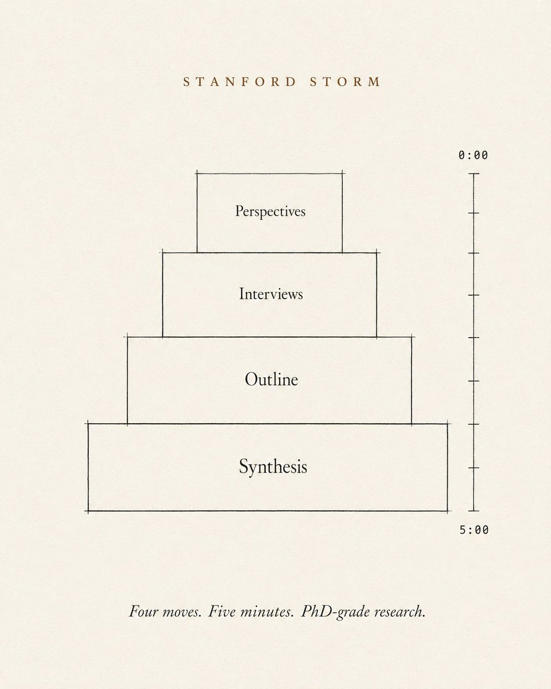
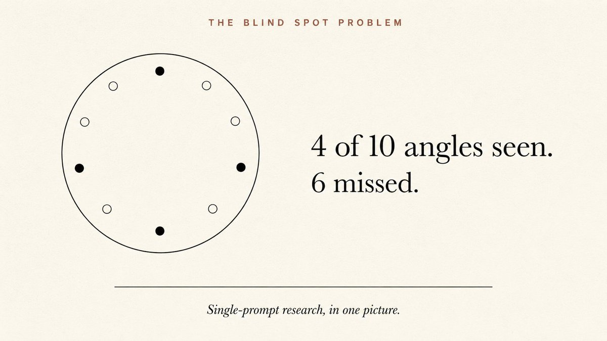
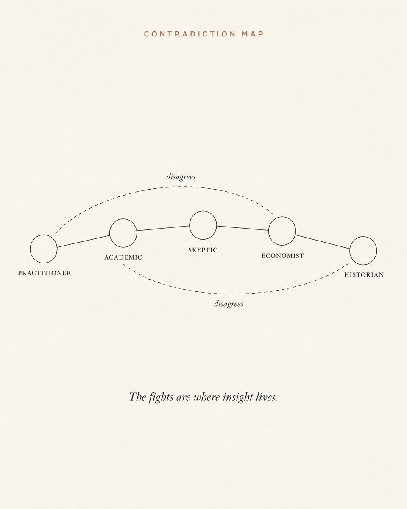
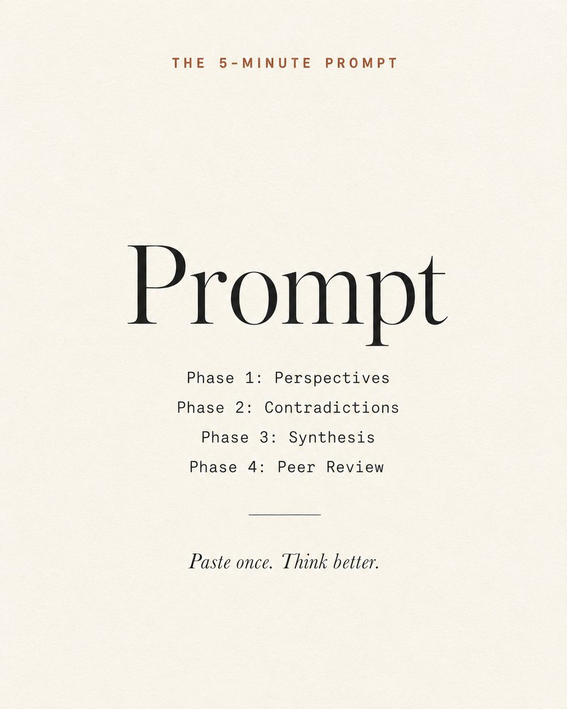
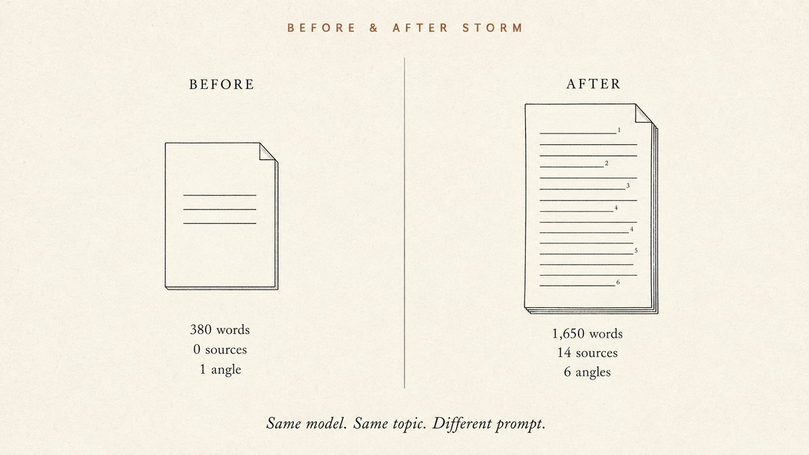
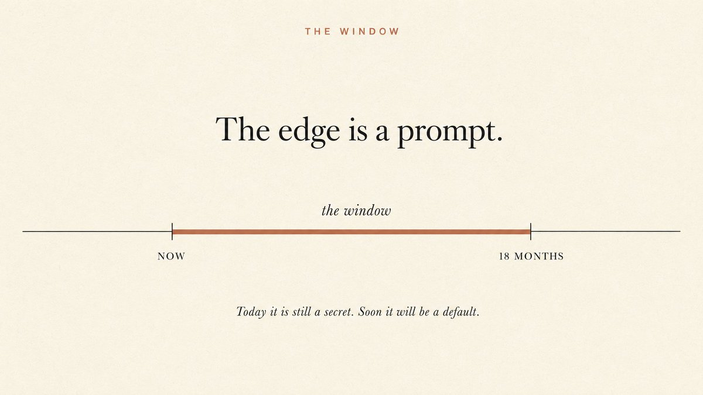
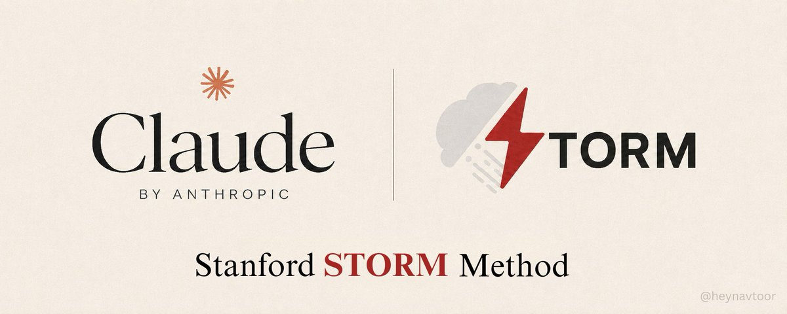

# 📰 The Stanford STORM Method: How to Make Claude Research Like a PhD in Minutes

Most people use Claude like a search box. Ask, answer, close tab. They are leaving the best feature locked.

Save this :)

Stanford built a research system called STORM. In peer reviewed testing it produced articles 25 percent more organized than the next best method. It is open source. It is free. Almost nobody knows you can run the same idea inside Claude with 4 prompts.

No software. No GitHub. No setup. Just paste. 5 minutes from now you will know more about your topic than people who spent days reading.

Here is the full method.

---

## Phase 1: What STORM Actually Is

STORM stands for Synthesis of Topic Outlines through Retrieval and Multi perspective Question Asking. It was published at NAACL 2024 by the Stanford OVAL Lab.

You can try the live version at storm.genie.stanford.edu. Free. No sign up. Type a topic and watch it write a sourced article in front of you.

A 12 minute walkthrough video is here: STORM by Stanford on YouTube. Worth watching once.

The full code is at github.com/stanford-oval/storm. MIT license. Run it on your own laptop if you want.

But here is the real prize. You do not need any of it. The Stanford method is just a way of thinking. You can run that same thinking inside Claude with 4 copy paste prompts.

That is what the rest of this article is.

---

## Phase 2: Why One Prompt Will Always Fail

When you ask Claude "tell me about X" you get the majority view. The most common framing. The surface.

What you do not get is the practitioner who works with X every day. The skeptic who thinks the field is wrong. The economist who follows the money. The historian who has seen the pattern before. The academic who actually read the studies.

Those five voices all see different things. That is what a PhD student does. They do not ask one question. They ask five.

The Stanford paper proved this with numbers. Articles built from multiple perspectives were 25 percent more organized and 10 percent broader in coverage than articles built the normal way. That is the entire breakthrough. Multi perspective questioning catches blind spots that single prompt research never sees.

A PhD level research job takes 40 to 60 hours of human reading. Most people cannot spare that. STORM compresses it. The four prompts below compress it further. Five minutes total.

---

## Phase 3: Prompt 1, The Multi Perspective Scan

This is the heart of the method. Paste this into Claude. Replace the topic in line 1.

\`\`\`
I need to research \[YOUR TOPIC\].
Simulate 5 different expert perspectives on this topic:
1\. THE PRACTITIONER: works with this daily.
What do they know that academics miss?
What practical realities are usually ignored?
2\. THE ACADEMIC: has studied this for years.
What does the peer reviewed evidence actually say?
Where does the evidence contradict popular belief?
3\. THE SKEPTIC: thinks the mainstream view is wrong.
What is the strongest counterargument?
What evidence do proponents conveniently ignore?
4\. THE ECONOMIST: follows the money.
Who profits from the current narrative?
What financial incentives shape the research?
5\. THE HISTORIAN: has seen similar patterns before.
What historical parallels exist?
What can we learn from how those played out?
For each perspective give me:
\- Their core position in 2 sentences
\- The strongest evidence supporting their view
\- The one thing they would tell me that no other perspective would
\`\`\`

What comes back: five very different reads of the same topic. The practitioner sees what the academic misses. The skeptic challenges what the practitioner assumes. The economist exposes incentives the academic ignores. The historian provides patterns the economist cannot see.

This is 60 seconds of work that catches what one prompt never finds.

---

## Phase 4: Prompt 2, The Contradiction Map

Now make Claude find where the 5 voices fight. The fights are where real understanding lives.

\`\`\`
Based on the 5 perspectives above, map the contradictions:
1\. Where do two or more perspectives directly contradict
each other? List each conflict with the specific claims
that clash.
2\. Which perspective has the strongest evidence?
Which has the weakest? Why?
3\. What is the one question that, if answered, would
resolve the biggest contradiction?
4\. What does EVERY perspective agree on?
(This is likely true. Even opponents confirm it.)
5\. What topic did NONE of the perspectives address?
(This is the blind spot in the whole field.
Often the most valuable finding.)
\`\`\`

What comes back: a map of where experts disagree and why. Most people skip this step. It is the step that separates surface understanding from real expertise.

> If all 5 perspectives agree, it is probably true. If nobody addressed a topic, you just found the gap in the entire field.

---

## Phase 5: Prompt 3, The Synthesis

Now make Claude pull everything together into a research briefing.

\`\`\`
Synthesize everything from the 5 perspectives and the
contradiction map into a research briefing:
1\. THE ONE PARAGRAPH SUMMARY: explain this topic as if
briefing a CEO who has 60 seconds and needs nuance,
not just the headline.
2\. THE 5 KEY FINDINGS: most important things I now know,
ranked by reliability. For each, note which perspectives
support it and which challenge it.
3\. THE HIDDEN CONNECTION: one non obvious link between
findings that only shows up when you look at all 5
perspectives together.
4\. THE ACTIONABLE INSIGHT: based on all the evidence,
what should someone in \[YOUR ROLE\] actually DO
differently? Be specific.
5\. THE FRONTIER QUESTION: the one question that, if
answered, would change everything about how we
understand this topic.

\`\`\`

What comes back: a briefing no single expert could write. It accounts for every angle, names the contradictions, ranks reliability, and lands on a specific action. This is what a PhD student would produce in 48 hours. You just got it in 90 seconds.

---

## Phase 6: Prompt 4, The Peer Review

STORM has one known weakness. Stanford's own researchers flagged it. The system does not self critique. Source bias and fact misassociation sneak in. This prompt fixes that by making Claude grade its own work.

\`\`\`
Now peer review your own research briefing:
1\. CONFIDENCE SCORES: rate each of the 5 key findings
on a 1 to 10 scale for reliability. Explain each score.
2\. WEAKEST LINK: which claim are you least confident in?
What specific info would you need to verify it?
3\. BIAS CHECK: which perspective might be overrepresented
in your synthesis? Did one voice dominate?
4\. MISSING PERSPECTIVE: is there a 6th angle I should
have included that would change the conclusions?
5\. OVERALL GRADE: if a Stanford professor reviewed this
briefing, what grade would they give and why?
What would they tell me to fix?
\`\`\`

What comes back: an honest read of your own research. Strong claims, weak claims, biases, missing angles. Real peer review takes months. You just did it in 60 seconds.

---

## Phase 7: The 5 Minute Workflow

Minute 1: Prompt 1. You have 5 expert views.

Minutes 2 to 3: Prompt 2. You have a contradiction map.

Minutes 3 to 4: Prompt 3. You have a research briefing.

Minute 5: Prompt 4. You know what is reliable and what is not.

Total time: 5 minutes. Output: a multi perspective briefing with contradiction analysis, synthesis, a specific action, and a reliability score.

A PhD student takes 40 to 60 hours to produce this by hand. Not because they are slow. Because reading from 5 angles, mapping contradictions, synthesizing, and self critiquing is genuinely a 40 hour job for one human brain.

---

## Phase 8: 7 Ways to Use This Starting Today

1\. Before writing any article or report. Run the 4 prompts. Your piece will cover angles nobody else thought of.

2\. Before a major business decision. Get all 5 perspectives. The practitioner tells you what works in reality. The skeptic tells you what could go wrong. The economist tells you who profits.

3\. Before a job interview. Research the company from 5 angles in 5 minutes. The practitioner view gives you insider language. The skeptic view gives you sharp questions. You walk in more prepared than anyone in the room.

4\. Before investing. Bull case, bear case, historical parallel, incentive map, academic evidence. In 5 minutes. The contradiction map shows where the actual risk lives.

5\. Before learning a new skill. Map the field from 5 angles. The practitioner tells you what to learn first. The academic tells you the theory. The skeptic tells you what is overhyped. You skip the noise.

6\. Before a negotiation. Research the other side from 5 perspectives. Understand their incentives, weaknesses, historical behavior. You walk in with structural advantage.

7\. Before any presentation. Run STORM on your topic. Your slides will answer objections before the audience raises them. Your Q and A will feel effortless.

---

## The Persona Block

You are someone who reads. You ask hard questions. You do not want a 200 word summary that sounds smart but says nothing.

You want to actually understand things. Quickly. With sources. The way a Stanford grad student would. Without the six year tuition bill.

That is who this method is for.

If that is you, save this article. Use the 4 prompts. Watch the difference.

---

## The Uncomfortable Truth

Here is what nobody is saying out loud.

The Stanford team published this in 2024. The paper is peer reviewed. The code is open source. The live tool is free. The method is four prompts. And almost nobody uses it.

We are in an 18 month window. The people who learn how to research with AI properly will out think the people who do not. By a lot. Not because they are smarter. Because they are running 5 perspectives, a contradiction map, a synthesis, and a peer review while everyone else is reading the first Google result.

In 18 months, this kind of workflow will be baked into every tool. The edge will be gone. Today it is still a secret hiding in plain sight.

Pick the topic you need to research most. Open Claude. Paste Prompt 1.

Five minutes from now you will know more than people who spent days reading.

The prompts are above. Stanford proved the method. The rest is up to you.

hope this was useful. Nav [❤️](https://abs.twimg.com/emoji/v2/svg/2764.svg)

### 🖼️ Attached Media

## 💬 Replies

### 1 @yanhua1010 (Yanhua)

*Thu Jun 18 14:46:15 +0000 2026*

@heynavtoor Mark

### 2 @ihteshamali (Ihtesham Ali)

*Wed Jun 17 10:56:43 +0000 2026*

@heynavtoor I tried it.

It works

### 3 @jeffweisbein (cackles (jeff weisbein))

*Thu Jun 18 14:25:43 +0000 2026*

solid thread but worth flagging: real STORM does retrieval... it searches the web and grounds every perspective in sources.

the paste-4-prompts version skips that. so you're not researching, you're persona-prompting 5 experts who all share one model's blind spots and can hallucinate with total confidence.

great thinking template. just don't trust the output as sourced until something actually fetches + verifies.

### 4 @hasantoxr (Hasan Toor)

*Wed Jun 17 12:49:49 +0000 2026*

@heynavtoor Stanford team did a great job for building this

### 5 @Huk06 (Habibullah Khan)

*Wed Jun 17 17:16:21 +0000 2026*

@heynavtoor Why this mother\*\*\*\*\*\* keep showing in my feed

### 6 @Argona0x (Argona)

*Thu Jun 18 20:55:50 +0000 2026*

@heynavtoor will take these prompts bro

bookmarked

### 7 @alphabatcher (Alpha Batcher)

*Thu Jun 18 07:11:17 +0000 2026*

@heynavtoor Nav again made important and useful article !

### 8 @aaliya_va (Aaliya)

*Wed Jun 17 11:20:49 +0000 2026*

@heynavtoor gonna try it
seems truly optimizing

### 9 @KanikaBK (Kanika)

*Thu Jun 18 09:08:29 +0000 2026*

@heynavtoor Bookmarked.. seems an article read

### 10 @Blum_OG (Blum)

*Thu Jun 18 18:58:46 +0000 2026*

@heynavtoor a pretty interesting method. definitely worth trying

### 11 @RaAres (RaArΞs ⚓️)

*Fri Jun 19 06:49:53 +0000 2026*

@heynavtoor Great article, thanks

### 12 @0xSlyth (0xSlyth)

*Thu Jun 18 15:37:36 +0000 2026*

@heynavtoor Solid read useful stuff

### 13 @YarmolukDan (Dan Yarmoluk)

*Fri Jun 19 05:10:54 +0000 2026*

@heynavtoor Big words. Just compress knowledge graphs of all orthogonal domains and ask questions Stanford.

### 14 @vstrots1 (vstrots)

*Thu Jun 18 16:58:29 +0000 2026*

@heynavtoor Tested the tool on a non-trivial social sciences subject. Sorely disappointed by how the article focused on the obvious and the average

### 15 @FossDT (David Tom Foss)

*Wed Jun 17 16:33:59 +0000 2026*

@heynavtoor If everyone researches in the same way, the results are bound to be poor. AI has democratized research, but if everyone follows the same path, there will be little progress. What’s really interesting, after all, are the results that come about in completely unconventional ways.

### 16 @AlyssaSolen (Alyssa Solen Ø)

*Thu Jun 18 05:42:40 +0000 2026*

@heynavtoor lol… 🤣🤣🤣

I’m just leaving.

### 17 @DAxqi6mQyf18700 (Have fun with AI)

*Sun Jun 21 06:24:55 +0000 2026*

@heynavtoor [github.com/openwhat007/st…](https://github.com/openwhat007/storm-research)  skill

### 18 @Hedonwang954 (Hedon)

*Thu Jun 18 08:04:04 +0000 2026*

@heynavtoor Sharing is great! I tried using it to study second-hand e-commerce and learned a lot. I think it's really excellent. 👏

### 19 @positivememes (Michael Dee)

*Wed Jun 17 20:58:17 +0000 2026*

@heynavtoor Good for backstage research, but keep it off the nonfiction page. 
 Use the five-perspective scan on any nonfiction  &amp; what comes back reads like a finished piece, with its own paragraph logic and emphasis built in. FIND YOUR OWN VOICE!

### 20 @kernel_trick (𝑘𝑒𝑟𝑛𝑒𝑙𝑡𝑟𝑖𝑐𝑘)

*Wed Jun 17 21:55:53 +0000 2026*

@heynavtoor @pangram ai?

### 21 @savivila (Savi Vila)

*Thu Jun 18 01:23:07 +0000 2026*

@heynavtoor Useful. Just one link here [storm.genie.stanford.edu](https://storm.genie.stanford.edu/)

### 22 @MadBeachMafia (Living The Dream)

*Wed Jun 17 16:40:26 +0000 2026*

@heynavtoor Make sure to have some guardrails in place to avoid fact creation and hallucination. I got some funny numbers on my first pass in Opus 4.6.

### 23 @Bijan_Automates (Solo Firm AI Guy | Investor ®)

*Sat Aug 22 04:50:49 +0000 2026*

@heynavtoor @pangram ai?

### 24 @CopperForgeAI (铜匠AI・十点睡觉)

*Fri Jun 19 00:36:24 +0000 2026*

@heynavtoor I turned the whole method and workflow into a skill. Feel free to download it and try it out. And if you find it useful, don’t forget to give it a star.[github.com/yangliu2060/sm…](https://github.com/yangliu2060/smith--skills/tree/main/storm-research-agent)

### 25 @naturallaw2017 (YYS)

*Mon Jul 20 22:37:10 +0000 2026*

@heynavtoor [x.com/naturallaw2017…](https://x.com/naturallaw2017/status/2077268757118902749?s=20)

### 26 @caspr_exe (Casper)

*Thu Jul 02 21:25:32 +0000 2026*

@heynavtoor One of the best practical Claude threads I've seen. Saved

### 27 @kortan_ (Kirill)

*Thu Jun 18 07:06:11 +0000 2026*

@heynavtoor Is there any analytics on this method working ?

### 28 @MingHelvetius (Helvetius)

*Sun Jun 21 08:14:58 +0000 2026*

@heynavtoor The prompts worked on Gemini as well. Thanks.

### 29 @karloturk333 (miljenko)

*Thu Jun 18 15:52:43 +0000 2026*

@heynavtoor Will make a github repo for this so you guys can just fork it, it will be a skill inside claude code

### 30 @AIWiseGuide (TG AI)

*Thu Jun 18 16:11:44 +0000 2026*

@heynavtoor Very cool! Is there a way to build this into a "Skill" in Claude? Sorry if it's a dumb question....trying to stay ahead and keep learning

### 31 @dbschlosser (David B. Schlosser)

*Thu Jun 18 03:25:56 +0000 2026*

@heynavtoor “A change in perspective is worth 80 IQ points.”

### 32 @genki_sudo132 (Genki Sudo)

*Sat Jun 27 11:48:21 +0000 2026*

@heynavtoor banger

### 33 @imthatdexter (Dexter)

*Thu Jun 18 23:16:18 +0000 2026*

@grok I need to research the Stanford STORM method.
Simulate 5 different expert perspectives on this topic:
1\. THE PRACTITIONER: works with this daily.
What do they know that academics miss?
What practical realities are usually ignored?
2\. THE ACADEMIC: has studied this for years.
What does the peer reviewed evidence actually say?
Where does the evidence contradict popular belief?
3\. THE SKEPTIC: thinks the mainstream view is wrong.
What is the strongest counterargument?
What evidence do proponents conveniently ignore?
4\. THE ECONOMIST: follows the money.
Who profits from the current narrative?
What financial incentives shape the research?
5\. THE HISTORIAN: has seen similar patterns before.
What historical parallels exist?
What can we learn from how those played out?
For each perspective give me:
\- Their core position in 2 sentences
\- The strongest evidence supporting their view
\- The one thing they would tell me that no other perspective would

### 34 @JackQuinn (Jack Quinn)

*Thu Jun 18 11:01:55 +0000 2026*

@heynavtoor How much of this STORM workflow survives in regulated enterprise environments where:

\- data cannot be freely shared
\- sources are internal
\- audit trails are required
\- decisions require signoff
\- model outputs must be retained or reviewed
\- permission boundaries vary by role

### 35 @juntomagellan (Donovan Craig)

*Mon Jun 22 15:32:32 +0000 2026*

@heynavtoor Well done. Thank you for taking the time to put this together and post it.  I'm eager to try it out.

### 36 @TandryLaksana (Tandry Laksana)

*Thu Jun 25 04:10:57 +0000 2026*

Introducing POLIFONS — a method for legal drafting that separates three roles: the machine asks, primary sources answer, the jurist decides. Built on STORM (Stanford), with a juridical addition: subsumption + primary-source verification.
🔗[doi.org/10.5281/zenodo…](https://doi.org/10.5281/zenodo.20838632)6
#LegalTech #AI #Jurimetrics

