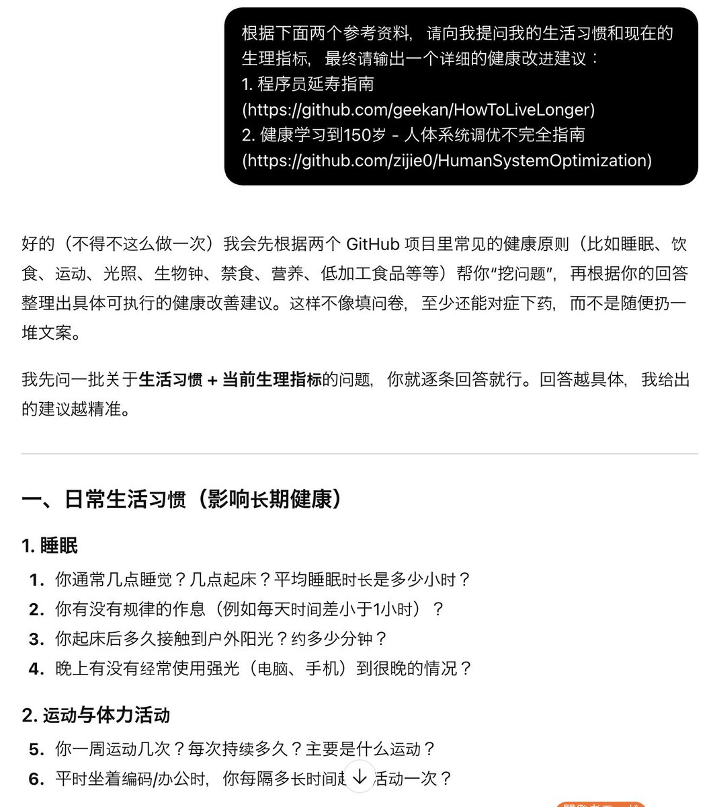
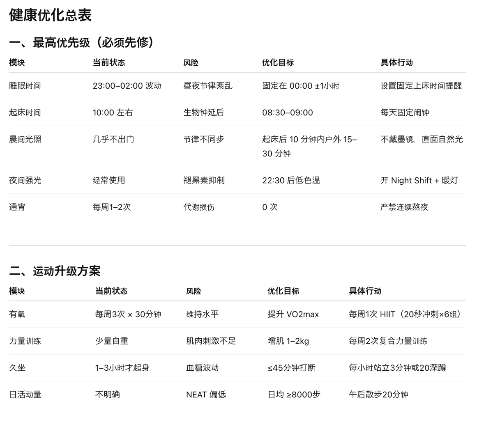
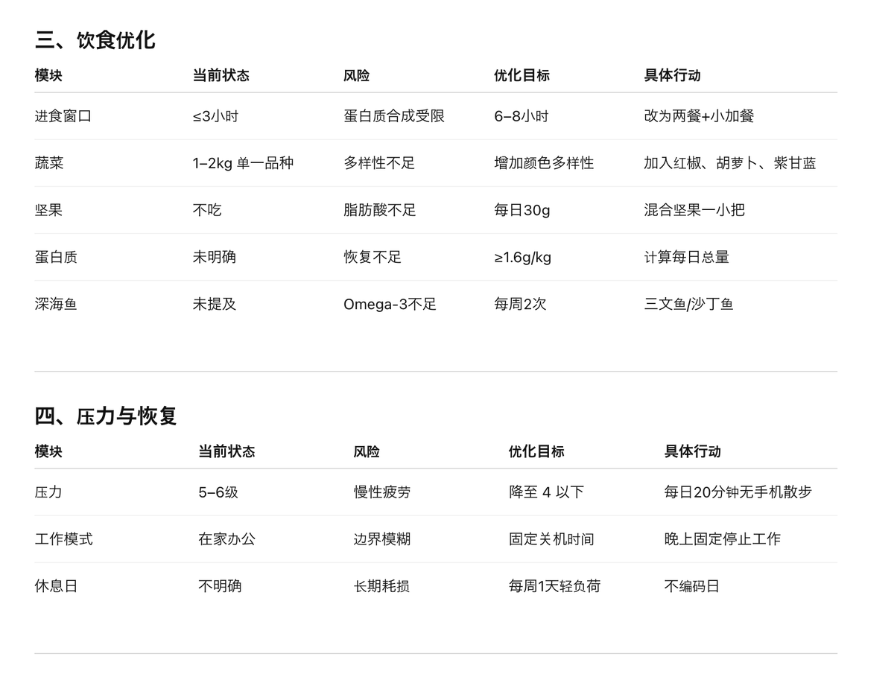

推友里大多是码农，在这推荐两个知名程序员健康手册：
1\. 程序员延寿指南([github.com/geekan/HowToLi…](https://github.com/geekan/HowToLiveLonger))
2\. 健康学习到150岁 - 人体系统调优不完全指南([github.com/zijie0/HumanSy…](https://github.com/zijie0/HumanSystemOptimization))
\---
不用直接读，推荐像我这样，让AI来问我【生活习惯和生理指标的现状】，最终输出一个详细的健康改进建议。 

## 💬 Replies

### 1 @cryptonerdcn (NerdC) (Author)

*Tue Feb 17 08:47:01 +0000 2026*

AI给我的建议： 

### 2 @cryptonerdcn (NerdC) (Author)

*Tue Feb 17 08:47:29 +0000 2026*

饮食和压力： 

### 3 @cryptonerdcn (NerdC) (Author)

*Thu Feb 19 08:48:53 +0000 2026*

补剂建议：[x.com/cryptonerdcn/s…](https://x.com/cryptonerdcn/status/2024400191579947278?s=20)

### 4 @Shtihmas11 (Shtihmas (❖,❖))

*Tue Feb 17 08:30:58 +0000 2026*

@cryptonerdcn 健康寿命才是真·硬核

### 5 @cryptonerdcn (NerdC) (Author)

*Tue Feb 17 08:36:29 +0000 2026*

@Shtihmas11 Yep

### 6 @Cedric_Rune (CedricRune)

*Tue Feb 17 23:41:08 +0000 2026*

@cryptonerdcn 可以分享一下完整的提示词吗？从最开始提问到拿到健康优化总表

### 7 @cryptonerdcn (NerdC) (Author)

*Wed Feb 18 04:05:24 +0000 2026*

@TimYoung0306 图上的黑框里就是完整的，一共就两句话+参考资料。

### 8 @jin_asac (jin)

*Wed Feb 18 11:37:58 +0000 2026*

@cryptonerdcn 直接把 apple 健康给他不就好了

### 9 @Diu47785542 (Diu)

*Tue Feb 17 18:55:18 +0000 2026*

@cryptonerdcn 謝謝🙏🏻

### 10 @FreeFromJava (freefromjava)

*Wed Feb 18 20:15:04 +0000 2026*

@cryptonerdcn mark

### 11 @SStwangkaiyan (STKane Wong)

*Wed Feb 18 22:08:28 +0000 2026*

@cryptonerdcn m

### 12 @noodles_lee (Noodles)

*Wed Feb 18 16:10:24 +0000 2026*

@cryptonerdcn 真的吗

