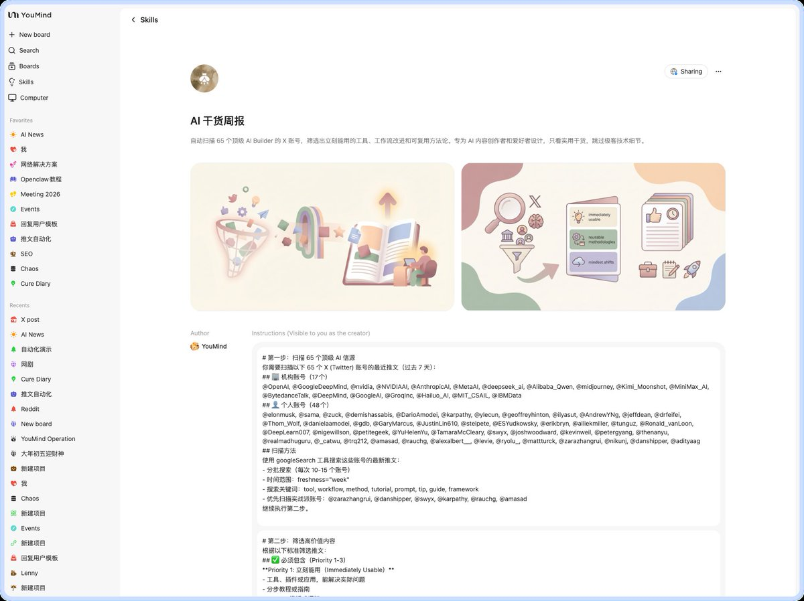
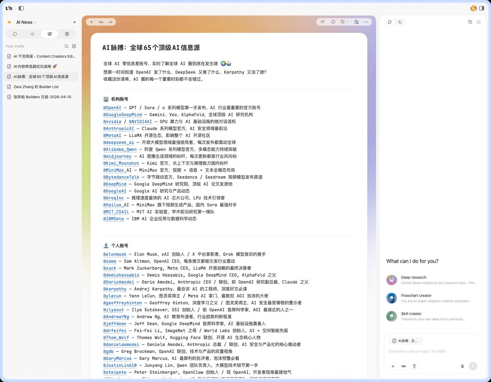
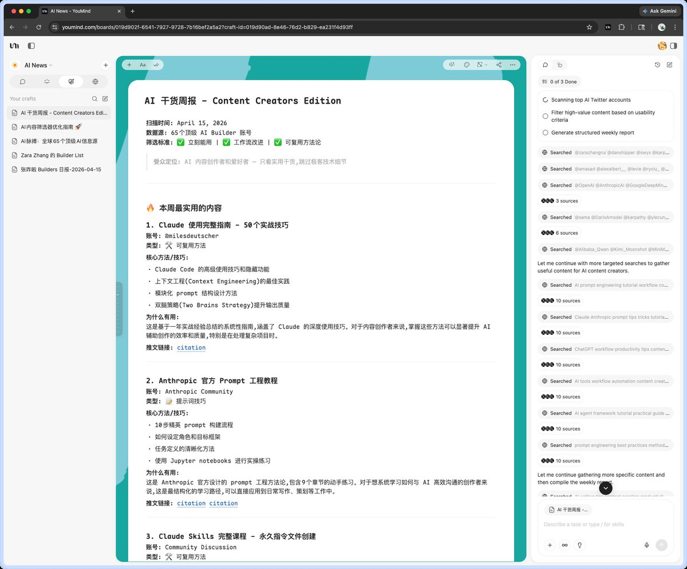
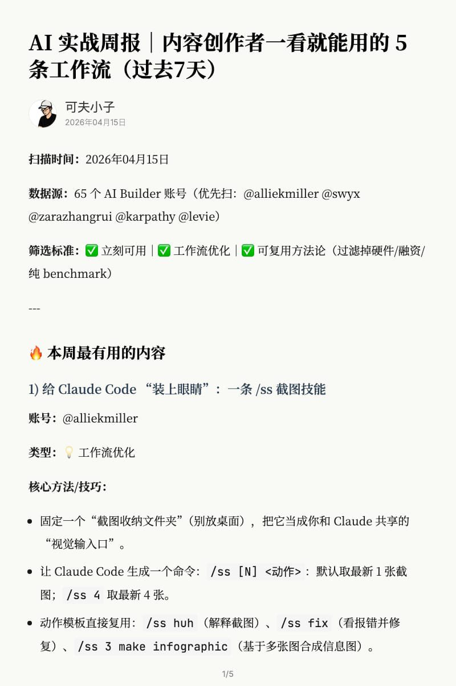
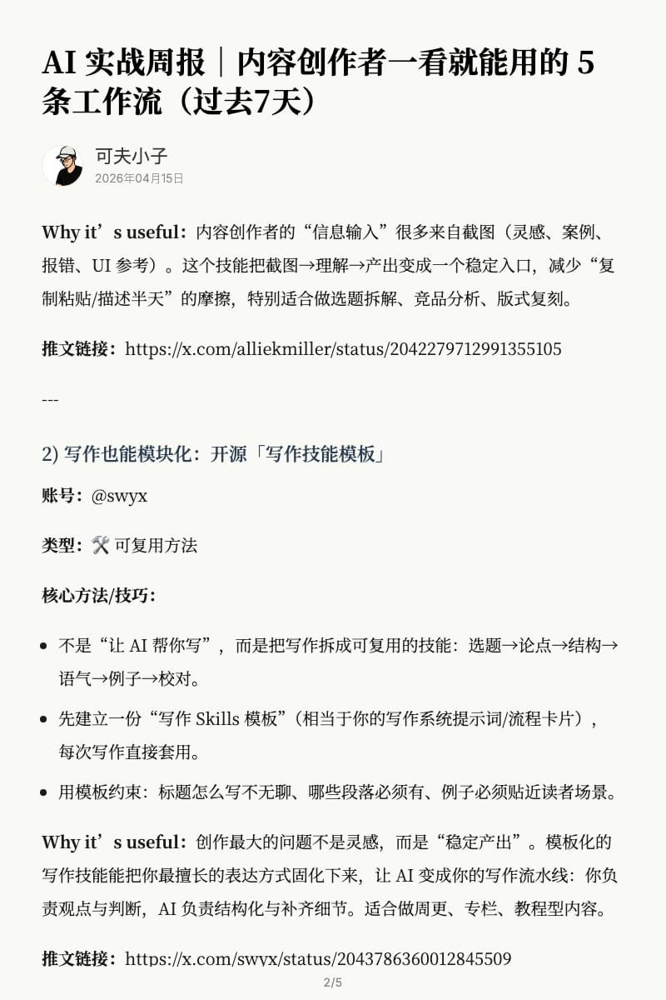
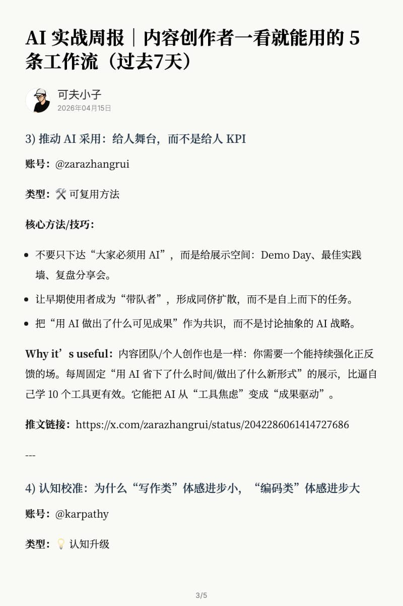
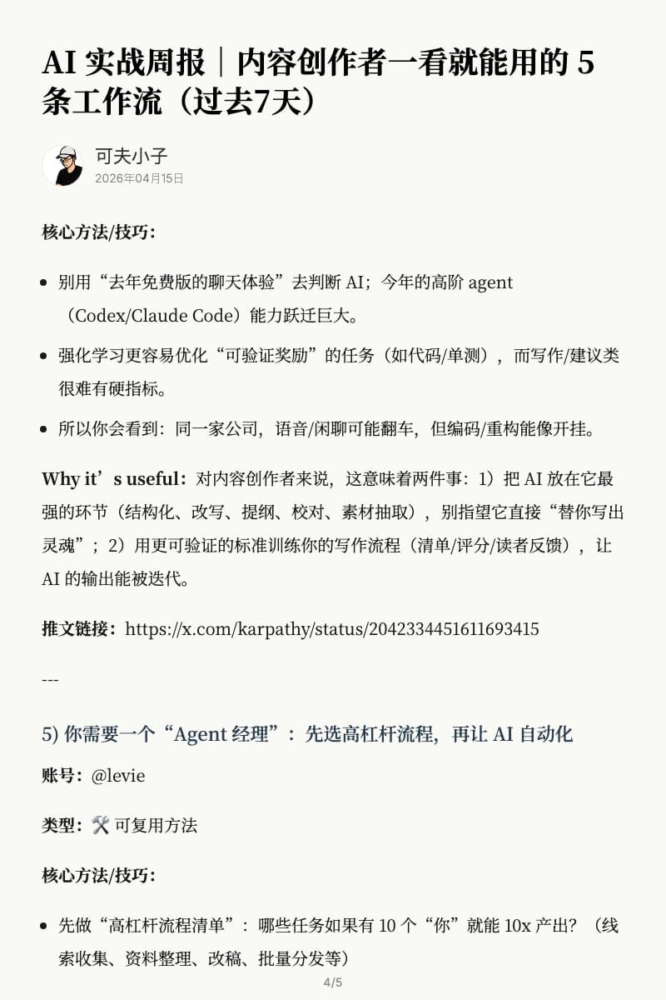

这个Skill让你知道全球最顶尖的那帮人是怎么用AI的

大家有没有发现，
出来逛X，却仍然好像在信息茧房里
那些大V的消息怎么那么灵通
平时海量信息很多
但真正有价值的却很难挖掘
我意识到，真正有价值的信息
=在做事的人+可复用的方法论

于是我把上次的45个AI信源
加上 @zarazhangrui 分享的25个Builder总结成了65个顶级AI信息源
并且让 YouMind 去抓取这65个信源里真正可复用的方法论

跑出来的效果非常好
第一条已经震惊到我
比如说 @milesdeutscher 分享的50个Claude Code不为人知的使用方法
这么干货宝藏的内容
如果没有这个Skill
我是绝对不可能刷到的

这个Skill真的完全打开了我的视野
也把它分享给大家
无论你是用来学习
还是用来Quote涨粉
都是神器
[youmind.com/skills/MzVGQ4A…](https://youmind.com/skills/MzVGQ4AVyaLtxX)

### 🖼️ Attached Media

## 💬 Replies

### 1 @lifesinger (Frank Wang 玉伯)

*Wed Apr 15 11:55:57 +0000 2026*

@stark\_nico99 @zarazhangrui 很实用的 skill，太好用了

### 2 @stark_nico99 (Nicolechan) (Author)

*Wed Apr 15 12:27:52 +0000 2026*

@lifesinger @zarazhangrui 对啊 而且最惊喜的是 65个账号，YouMind都挨个读取了，太强大了，
X的API不会配，而且据说很贵
YouMind能够支持抓取X简直超神

### 3 @PMbackttfuture (AI产品黄叔)

*Wed Apr 15 11:56:39 +0000 2026*

@stark\_nico99 @zarazhangrui 用起来！

### 4 @stark_nico99 (Nicolechan) (Author)

*Wed Apr 15 12:19:34 +0000 2026*

@PMbackttfuture @zarazhangrui 用起来！

### 5 @cellinlab (Cell 细胞)

*Wed Apr 15 11:39:31 +0000 2026*

@stark\_nico99 @zarazhangrui cool！日报内容又增加了🤓

### 6 @stark_nico99 (Nicolechan) (Author)

*Wed Apr 15 11:40:59 +0000 2026*

@cellinlab @zarazhangrui 😆 真的有用！我感觉用这个Quote涨粉的话，流量简直库库地过来

### 7 @Guomin184935 (Akiii 🦅)

*Wed Apr 15 12:32:56 +0000 2026*

@stark\_nico99 @zarazhangrui 这波必须支持\~！每天和你学习很开心那

### 8 @stark_nico99 (Nicolechan) (Author)

*Wed Apr 15 12:34:28 +0000 2026*

@Guomin184935 @zarazhangrui 开心 一起成长呀🥳

### 9 @indiehackercase (Olivert)

*Wed Apr 15 11:46:45 +0000 2026*

@stark\_nico99 @zarazhangrui 牛逼，正要找x上的热门推文呢

### 10 @stark_nico99 (Nicolechan) (Author)

*Wed Apr 15 12:19:50 +0000 2026*

@indiehackercase @zarazhangrui 开心🥳对你有用太好啦

### 11 @cheuk_baby (Jason傑森 🇭🇰 | 🛠️)

*Wed Apr 15 19:25:02 +0000 2026*

@stark\_nico99 @zarazhangrui 这确实比普通资讯更有启发性

### 12 @stark_nico99 (Nicolechan) (Author)

*Thu Apr 16 06:26:25 +0000 2026*

@cheuk\_baby @zarazhangrui 确实

### 13 @cryozerolabs (冰零)

*Wed Apr 15 12:25:46 +0000 2026*

@stark\_nico99 @zarazhangrui 用起来！我的情报系统又可以升级了！

### 14 @stark_nico99 (Nicolechan) (Author)

*Wed Apr 15 12:28:52 +0000 2026*

@cryozerolabs @zarazhangrui 对 升级！这个信息差简直超牛，跟世界顶级接轨

### 15 @sujingshen (SagaSu)

*Wed Apr 15 11:40:40 +0000 2026*

@stark\_nico99 @zarazhangrui 很好的内容，但是没有我。残念。

### 16 @stark_nico99 (Nicolechan) (Author)

*Wed Apr 15 11:41:51 +0000 2026*

@sujingshen @zarazhangrui 哈哈哈 也没有我 这个是为了破除信息茧房，里面没有熟人 哈哈哈哈哈哈

### 17 @yaohui1998 (yaohui)

*Wed Apr 15 18:35:33 +0000 2026*

@stark\_nico99 @zarazhangrui 谢谢Nicole 的分享！

### 18 @stark_nico99 (Nicolechan) (Author)

*Thu Apr 16 03:20:56 +0000 2026*

@yaohui1998 @zarazhangrui 开心 \~\\(≥▽≤)/\~

### 19 @helloworld668 (Famer)

*Thu Apr 16 02:35:08 +0000 2026*

@stark\_nico99 @zarazhangrui 运行一次要多少积分，会不会把我积分给花完了哈哈

### 20 @stark_nico99 (Nicolechan) (Author)

*Thu Apr 16 03:20:35 +0000 2026*

@helloworld668 @zarazhangrui 不会啊 哈哈哈 这个Skill纯文字 不涉及生图生视频 积分消耗很低的

### 21 @yyyole (沐阳)

*Wed Apr 15 11:56:01 +0000 2026*

@stark\_nico99 @zarazhangrui 太需要了！！

### 22 @cnyzgkc (木马人)

*Wed Apr 15 12:06:53 +0000 2026*

@stark\_nico99 @zarazhangrui 感谢分享

### 23 @nopinduoduo (我真的没有拼多多)

*Thu Apr 16 07:49:21 +0000 2026*

@stark\_nico99 @zarazhangrui 太需要了！

### 24 @koffuxu (koffuxu)

*Wed Apr 15 14:44:31 +0000 2026*

@stark\_nico99 @zarazhangrui 测试了一下，信息质量很高👍n

### 25 @xuejianrpa (雪见 RPA+AI)

*Thu Apr 16 01:14:28 +0000 2026*

@stark\_nico99 @zarazhangrui 感谢分享

### 26 @Damo_a8 (大魔 | 学习分享)

*Tue Apr 21 13:23:00 +0000 2026*

@stark\_nico99 @zarazhangrui 收藏

### 27 @afei_AI (AFei Liang)

*Thu Apr 16 01:25:16 +0000 2026*

@stark\_nico99 @zarazhangrui 感谢分享，用起来

### 28 @RayXiaoyulin (Ray Xiao)

*Thu Apr 16 04:39:53 +0000 2026*

@stark\_nico99 @zarazhangrui 谢谢 你的分享

### 29 @mino58536878 (Grasstop)

*Thu Apr 16 01:47:29 +0000 2026*

@stark\_nico99 @zarazhangrui tks

### 30 @EWpzfzs0f597836 (叫我王伏虎)

*Tue Apr 21 00:07:03 +0000 2026*

@stark\_nico99 @zarazhangrui 太好用了 👍

### 31 @li_gh56912 (大圣)

*Fri Apr 17 01:14:33 +0000 2026*

@stark\_nico99 @zarazhangrui 抓取 X 内容，是不是需要开通 X 的 API

