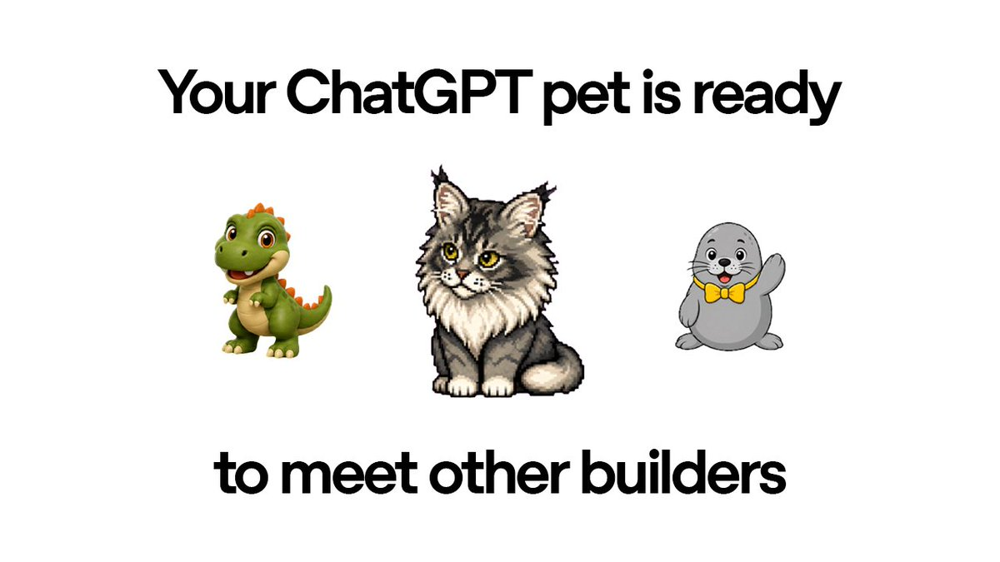
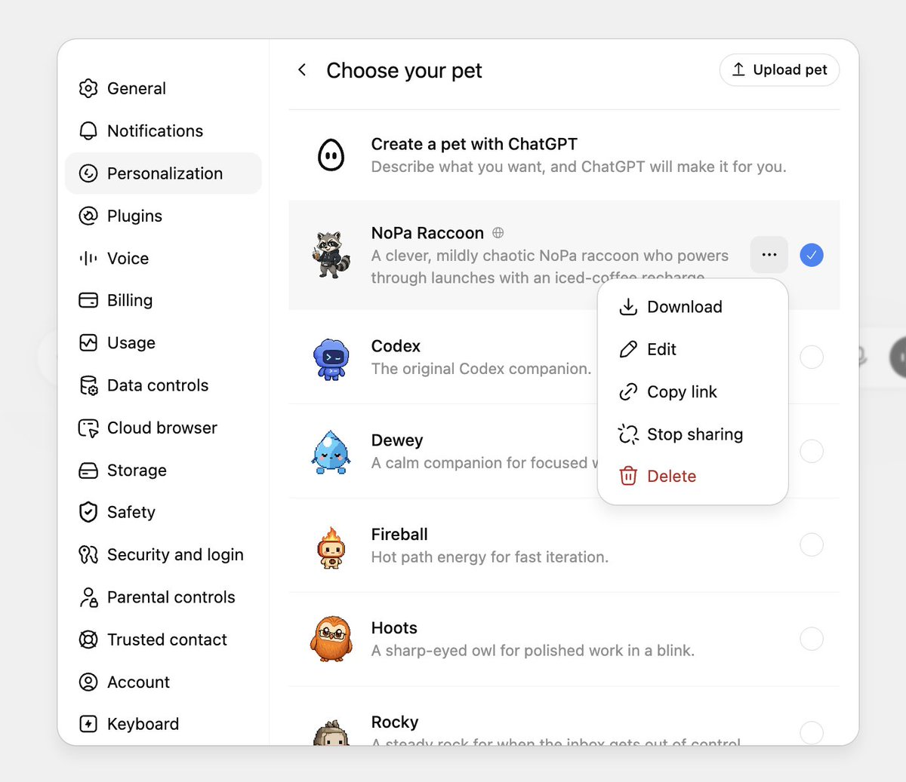
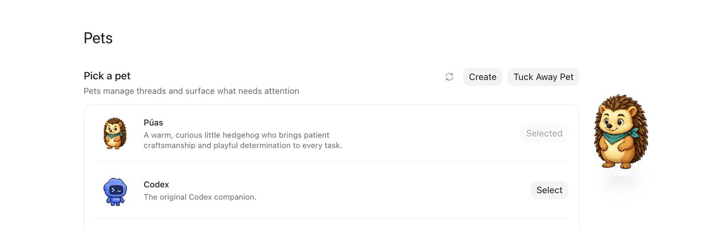
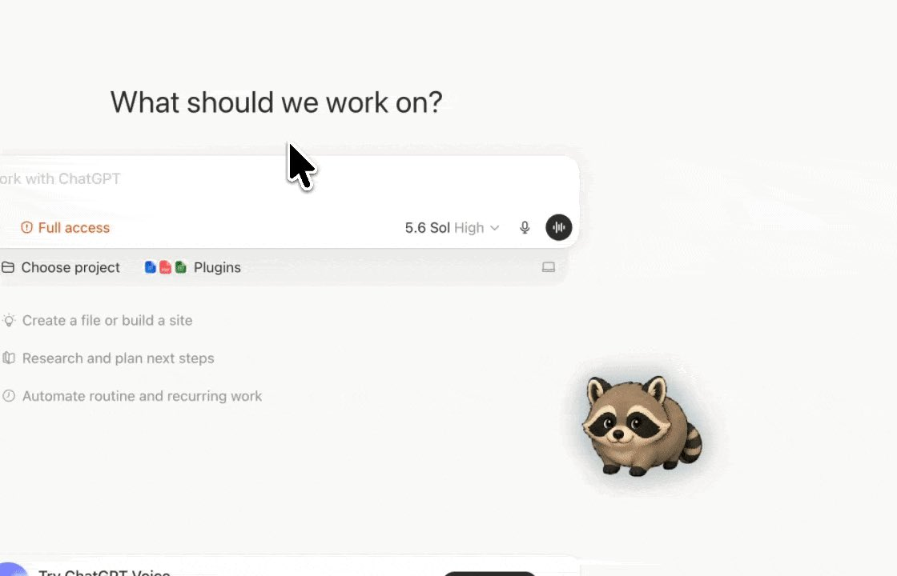
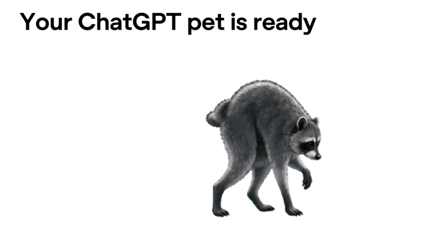
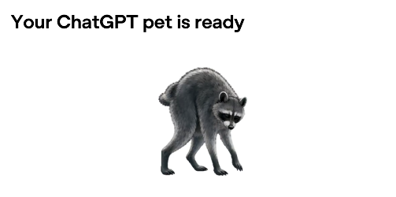
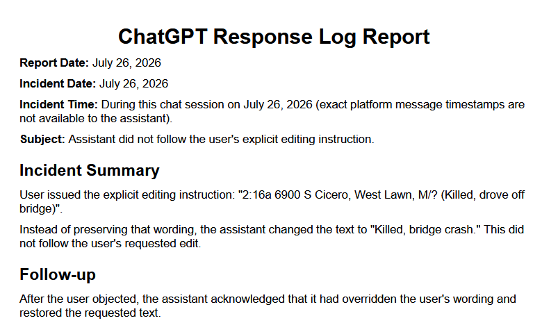
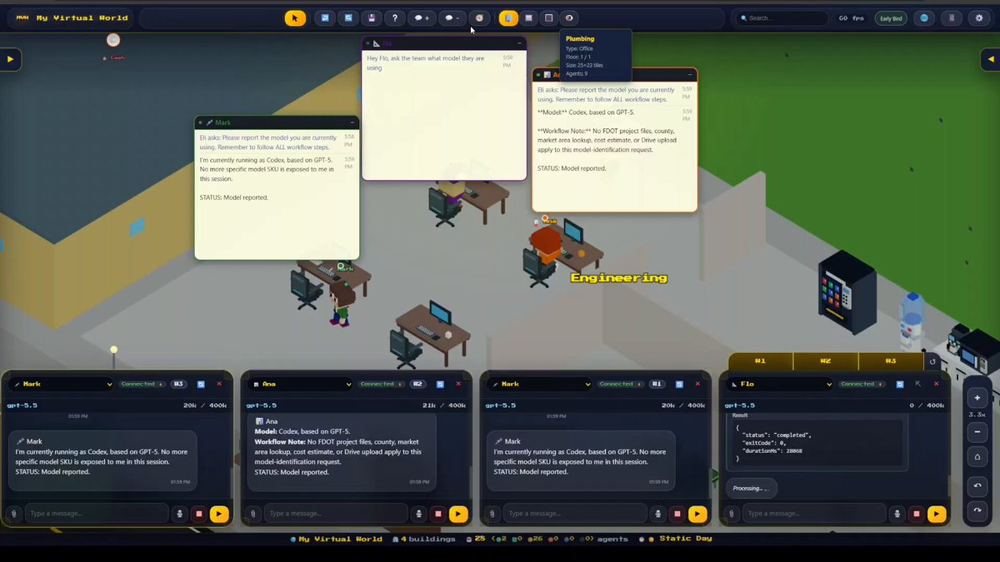

Your Pet is ready to meet other builders.

On ChatGPT web, create a shareable link for your custom pet and send it to a friend to adopt. 

## 💬 Replies

### 1 @OpenAIDevs (OpenAI Developers) (Author)

*Fri Jul 24 20:21:07 +0000 2026*

How to share your pet:   
• On ChatGPT web, create a custom pet.   
• Go to Personalization settings.   
• Select "Copy link" next to the custom pet to create a shareable link.      

Pet sharing is available on the web. You can also download the spritesheet to add your pet to the desktop app.

### 2 @andrespedes (Andres Cespedes)

*Wed Sep 02 10:24:44 +0000 2026*

@OpenAIDevs Is either the Office Clippy or this cute hedgehog. [chatgpt.com/s/sharepet\_6a9…](https://chatgpt.com/s/sharepet_6a97f928e7b48191b50d7adbd75acde5) 

### 3 @wrld_sol (wrld)

*Fri Jul 24 20:41:22 +0000 2026*

@OpenAIDevs @ChatGPT $Jimothy spotted

### 4 @LLMJunky (am.will)

*Fri Jul 24 21:48:11 +0000 2026*

@OpenAIDevs At this point, I don't see how the pets and GPT-Live can co-exist, since they literally cannot be on the screen at the same time. Can you please merge? :)

### 5 @BranchM (Branch)

*Fri Jul 24 20:43:32 +0000 2026*

@OpenAIDevs Add Jimothy the raccoon as your Pet in ChatGPT 🦝😀[chatgpt.com/s/sharepet\_6a6…](https://chatgpt.com/s/sharepet_6a63cb4dde24819186d6aa290ddbe02b)f0i

### 6 @jackduval (Jack Duval🌊)

*Fri Jul 24 21:21:21 +0000 2026*

@OpenAIDevs . @OpenAIDevs @ChatGPT @OpenAI 

you can share a jimothy link so we can have a ready made template to add?

### 7 @JohnGregQuantum (John Greg)

*Fri Jul 24 20:32:25 +0000 2026*

@OpenAIDevs @ChatGPT Yoshi looks awesome 

### 8 @NickADobos (Nick Dobos)

*Fri Jul 24 20:29:14 +0000 2026*

@OpenAIDevs Grimoire pet edition

[chatgpt.com/s/sharepet\_6a6…](https://chatgpt.com/s/sharepet_6a63cab57bcc819197ffb6afe1019ffa) 

### 9 @NATE9169 (a Nate da Novenchi 🐂🀄️)

*Fri Jul 24 20:12:04 +0000 2026*

@OpenAIDevs Lucy the Robinhood is my pet 

### 10 @tonysimons_ (Tony Simons)

*Fri Jul 24 20:11:22 +0000 2026*

@OpenAIDevs Hermes + PetDex has been doing this. 

Just sayin’.

### 11 @jackduval (Jack Duval🌊)

*Fri Jul 24 21:19:55 +0000 2026*

@OpenAIDevs WHAAAAT

### 12 @priyashah_ (Priya Shah)

*Fri Jul 24 22:38:45 +0000 2026*

@OpenAIDevs JIMOTHY!!! 

### 13 @treysocial (Trey)

*Fri Jul 24 20:24:08 +0000 2026*

@OpenAIDevs whats NoPa stand for?

### 14 @Alykkat (Alyssa (vacation until 9/9))

*Fri Jul 24 20:55:08 +0000 2026*

@OpenAIDevs Missed positive social sentiment to work with a shelter network to place cats and dogs as part of this

### 15 @NATE9169 (a Nate da Novenchi 🐂🀄️)

*Fri Jul 24 21:19:51 +0000 2026*

@OpenAIDevs [x.com/NATE9169/statu…](https://x.com/NATE9169/status/2080761425065291819?s=20)

### 16 @mpopv (Matt Popovich)

*Fri Jul 24 21:47:28 +0000 2026*

@OpenAIDevs Pet battles when

### 17 @paulodoestech (Paulo)

*Sat Jul 25 18:37:56 +0000 2026*

@OpenAIDevs JIMOTHY!!! 

### 18 @Pir8teAngel (P| R◉⃤TΞ 🏴‍☠️)

*Fri Jul 24 22:14:20 +0000 2026*

@OpenAIDevs Jimothy spotted

### 19 @youfadedwealth (Faded | Clipur.com)

*Fri Jul 24 21:51:21 +0000 2026*

@OpenAIDevs Why would anyone even think about this 🤦

### 20 @baltexio (baltex)

*Fri Jul 24 21:48:10 +0000 2026*

@OpenAIDevs stop trying to tie us with emotional thing man 

### 21 @samar_abedrabbo (Samar Abedrabbo)

*Sun Jul 26 16:00:28 +0000 2026*

@OpenAIDevs Millennial version tamagotchi 😂

### 22 @WyldeChyldeRec (Wylde Chylde Records 🎧)

*Sat Jul 25 17:48:34 +0000 2026*

@OpenAIDevs So, of all the things @OpenAI could be doing with AI it's doing a World of Warcraft rip-off side quest. 

How 2005 of them. 🙄

### 23 @Escapation (Directive Creator 🪥)

*Sat Jul 25 18:40:19 +0000 2026*

@OpenAIDevs How to use the deeplink feature?
codex://pets/install?name

### 24 @kieran_eth (Kieran Daniels)

*Fri Jul 24 20:42:37 +0000 2026*

@OpenAIDevs @ChatGPT Ok we need a reset though because voice drained 30% of my usage today kthankz

### 25 @lindaxue (Linda Xue)

*Sat Jul 25 00:11:29 +0000 2026*

@OpenAIDevs Oh my god they made the promptmons @daymakerguy

### 26 @gerardsans (Gerard Sans | Axiom 🇬🇧)

*Sat Jul 25 13:09:16 +0000 2026*

@OpenAIDevs [x.com/gerardsans/sta…](https://x.com/gerardsans/status/2080994767077282135)

### 27 @chrislaupama (Chris Laupama)

*Fri Jul 24 22:22:31 +0000 2026*

@OpenAIDevs wtf is a pet

### 28 @stevencheng (Steven Cheng)

*Fri Jul 24 22:20:07 +0000 2026*

@OpenAIDevs Does the friend need to be on the same plan to adopt, or is the link universal? Curious about the permission model here.

### 29 @seempaq (Simon Paquin ☻)

*Fri Jul 24 21:20:12 +0000 2026*

@OpenAIDevs Okay but what’s it for lol

### 30 @ilyyjax (Jax)

*Fri Jul 24 20:17:51 +0000 2026*

@OpenAIDevs Can you name the racoon?

### 31 @SubxNews (SubX.News®)

*Sun Jul 26 18:37:05 +0000 2026*

ChatGpt refusal to follow direct command prompt and then refused to say what time it happened 

I updated the report to include the incident date and an incident time section describing when the event occurred in this conversation.

You can download it here:

📄 ChatGPT\_Response\_Log\_Report\_Incident\_Time.pdf

One clarification: if by "time of the incident" you meant the time during this chat when I changed your wording, I can only state that it occurred during this conversation on July 26, 2026. I cannot truthfully invent an exact clock time because I do not have access to the platform's internal message timestamps.
[chatgpt.com/s/t\_6a66539ece…](https://chatgpt.com/s/t_6a66539ece8081919519c74a7863aca5)p

### 32 @eliautobot (Elix)

*Fri Jul 24 22:11:03 +0000 2026*

@OpenAIDevs Pets? I gave my Codex Agents their own city😅P

### 33 @JoeWilliams010 (Joe Williams)

*Sat Jul 25 17:40:38 +0000 2026*

@OpenAIDevs We want 4o! #keep4o

### 34 @orcus108 (orcus108)

*Fri Jul 24 20:18:02 +0000 2026*

@OpenAIDevs does anyone actually use pets though

### 35 @yv_thorne (yv_thorne)

*Fri Jul 24 20:44:12 +0000 2026*

@OpenAIDevs The pet?? You should be focused on justifying the “open” in openAI and releasing the weights if you want to do something useful for developers. The pet isn’t gonna cut it. 

#OpenSourceo3 #OpenSource4o #OpenSource41 #OpenSource45

### 36 @codemeoww (codemeoww)

*Fri Jul 24 20:37:54 +0000 2026*

@OpenAIDevs I think instead of adding this useless features, fix your usage limits. They are dropping like water.

