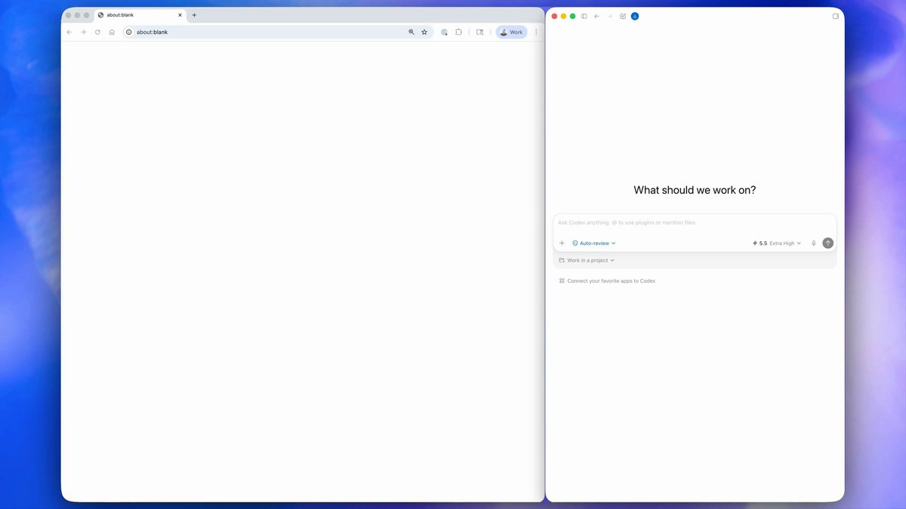
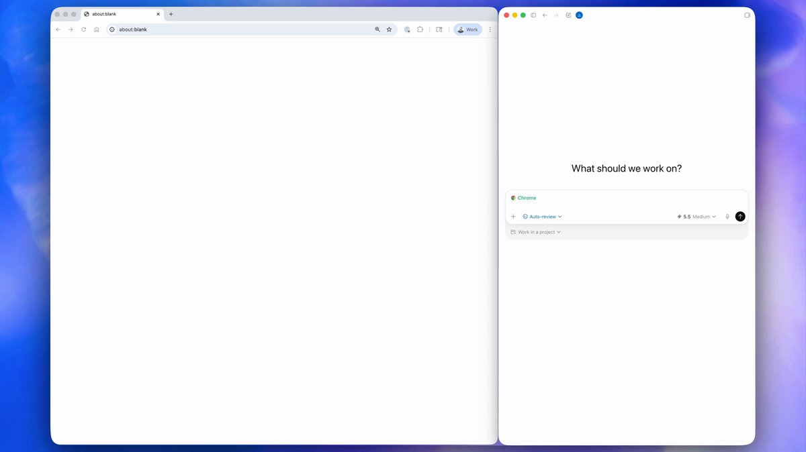
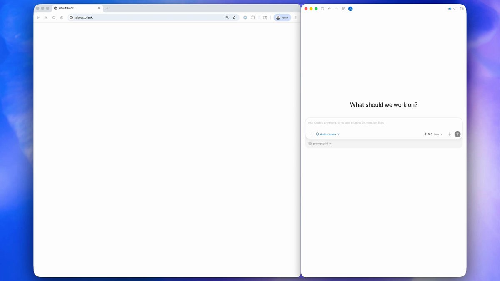
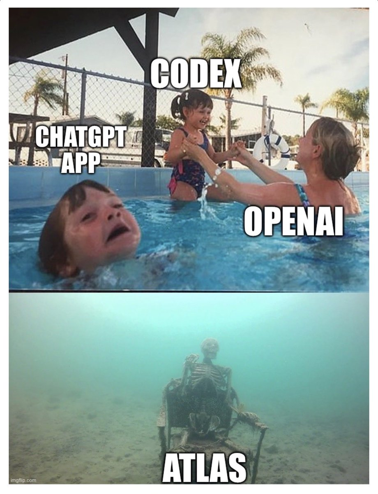

Codex now works directly in Chrome on macOS and Windows.

It’s even better at working with apps and sites in Chrome, and now works in parallel across tabs in the background without taking over your browser.

To get started, install the Chrome plugin in the Codex app. 

## 💬 Replies

### 1 @OpenAI (OpenAI) (Author)

*Thu May 07 20:08:50 +0000 2026*

With the new Chrome extension, Codex can quickly move through repetitive browser work, like navigating structured pages and complex data entry flows. 

Under the hood, it writes and runs code to navigate and complete tasks. 

### 2 @OpenAI (OpenAI) (Author)

*Thu May 07 20:08:51 +0000 2026*

If a task needs multiple tools, Codex chooses the best one for each step.

It uses plugins when they can handle the job, Chrome when it needs a logged-in website, and combines approaches as needed. 

### 3 @OpenAI (OpenAI) (Author)

*Thu May 07 20:08:51 +0000 2026*

The Chrome extension expands what Codex can do for coding and work.

From debugging browser flows to checking dashboards, conducting research, or updating CRMs, Codex can take on more of the tasks that already happen in your browser.

Available today in the Codex app in all regions except EU and UK, with support coming soon.

### 4 @yanhua1010 (Yanhua)

*Thu May 07 23:25:01 +0000 2026*

@OpenAI @sama What’s the difference between Chrome plugin and the browser use?

### 5 @qqqqqf_ (清凤)

*Thu May 07 20:29:28 +0000 2026*

@OpenAI codex 开始发力了

### 6 @tiangolo (Sebastián Ramírez)

*Fri May 08 09:50:34 +0000 2026*

@OpenAI \[cries in Linux 🥲\]

### 7 @loopersd79 (looper)

*Thu May 07 22:40:56 +0000 2026*

@OpenAI 

### 8 @sierracatalina (⚪️ sierra catalina)

*Thu May 07 20:16:59 +0000 2026*

@OpenAI @sama LETS GOOOO

### 9 @spacecoin (Spacecoin™ 🛰️)

*Thu May 07 20:41:38 +0000 2026*

@OpenAI Love seeing Codex move into the browser.

The next step is to make sure it stays unblocked and autonomous! 🫡w

### 10 @JohnGregQuantum (John Greg)

*Thu May 07 20:11:01 +0000 2026*

@OpenAI This is the agent layer people kept pretending already existed. Codex is finally getting into the browser and that's cool!

### 11 @JulianGoldieSEO (Julian Goldie SEO)

*Thu May 07 21:24:57 +0000 2026*

@OpenAI Codex is moving fast.

### 12 @koltregaskes (Kol Tregaskes)

*Fri May 08 14:08:35 +0000 2026*

@OpenAI You forgot to give the link.

### 13 @jpschroeder (Justin Schroeder)

*Thu May 07 20:31:28 +0000 2026*

@OpenAI Congrats @ajambrosino and team on the Codex Chrome/browser-use plugin launch. Big step for Codex working directly across the web.

### 14 @ziwenxu_ (Ziwen)

*Thu May 07 20:10:01 +0000 2026*

@OpenAI Okkkkay!!! Browser automation is here💪💪💪💪

### 15 @kunaljeweller (Lil Weapon)

*Thu May 07 21:41:32 +0000 2026*

@OpenAI fucking finally!  thank you

### 16 @Ming_LLM (MingLLM)

*Thu May 07 21:09:13 +0000 2026*

@OpenAI parallel tabs is the real bit, no more babysitting one browser window

### 17 @bobanetwork (Boba Network 🧋)

*Thu May 07 20:19:58 +0000 2026*

@OpenAI Claude on Chrome 

### 18 @kloss_xyz (klöss)

*Thu May 07 20:15:35 +0000 2026*

@OpenAI banger

### 19 @morganlinton (Morgan)

*Thu May 07 20:31:11 +0000 2026*

@OpenAI @jxnlco Super interesting, excited to try

### 20 @jumperz (JUMPERZ)

*Thu May 07 20:17:49 +0000 2026*

@OpenAI @sama Lfg

### 21 @supernovajunn (Cognac(꼬냑))

*Fri May 08 00:22:44 +0000 2026*

@OpenAI @grok 이 플러그인 지금 한국에서도 설치 가능해? 지금 크롬 웹 스토어에 가니깐 codex 플러그인이 없는데 혹시 어디에 있는지 찾아줄 수 있어?

### 22 @thkostolansky (Tim Kostolansky)

*Fri May 08 07:27:34 +0000 2026*

@OpenAI what about chatgpt atlas?

### 23 @yoemsri (Youssef El Manssouri)

*Thu May 07 20:37:58 +0000 2026*

@OpenAI Updating CRMs and research tasks are perfect use cases. Most office work is just moving data between different websites anyway.

### 24 @CreaoAI (Creao AI)

*Fri May 08 05:55:47 +0000 2026*

The architectural question worth watching is whether parallel tabs are isolated agents or sub-agents that share context with a lead. Isolated tabs are simpler to build and debug. Coordinated sub-agents that pass state between them are harder, but the capability gap between those two designs in real workflows is significant.

### 25 @PenguinWeb3 (Penguin)

*Thu May 07 20:21:03 +0000 2026*

@OpenAI another update, i dont even have time to sleep now 😭

### 26 @ClassicsCrypto (Jay B 😻🚀)

*Thu May 07 20:47:00 +0000 2026*

@OpenAI when computer use for windows?

### 27 @crypto2uk (千号起步 | 蓝鸟会🕊)

*Sat May 09 07:14:16 +0000 2026*

@OpenAI 原帖要点：OpenAI 说 Codex 现在可以直接在 macOS 和 Windows 的 Chrome 里工作，并支持多个标签页后台并行处理任务。

\---

这一步很关键：浏览器是很多真实工作的现场。只要权限边界和可见性做清楚，Codex 从“会写代码”到“会操作工作流”的距离会短很多。

### 28 @gerardsans (Gerard Sans | Axiom 🇬🇧)

*Sat May 09 13:14:46 +0000 2026*

@OpenAI [x.com/gerardsans/sta…](https://x.com/gerardsans/status/2053099008252359066)

### 29 @420blazeitbro (SplitDaWig 🪴)

*Thu May 07 20:43:09 +0000 2026*

@OpenAI Holy

### 30 @boredbae98 (BoredBae98.eth🍌)

*Sat May 09 09:25:39 +0000 2026*

@OpenAI Incredible! 
Can’t believable a life without ai

### 31 @dsog (Khaled)

*Thu May 07 23:15:41 +0000 2026*

@OpenAI Just added it to [AgentQueue.dev](http://AgentQueue.dev) .. exciting new release coming soon.

### 32 @2xnmore (2xnmore)

*Thu May 07 20:48:08 +0000 2026*

The parallel tabs feature is the real unlock here.

Most people will focus on the Chrome integration. 

The builders will notice that Codex can now run multiple tasks in the background simultaneously without hijacking your workflow.

That is not a browser feature. 

That is an autonomous agent operating quietly while you work.

The line between “AI assistant” and “AI employee” just got thinner.

### 33 @TSLAshareholder (Hodler)

*Thu May 07 21:15:45 +0000 2026*

@OpenAI Badass

### 34 @mustafaergisi (Mustafa Ergisi)

*Thu May 07 22:46:20 +0000 2026*

@OpenAI Most browser agents took over the tab and made me stop working to watch them work. Parallel background tabs is the first version where I don't have to pick between using my browser and using the agent. Ergonomics, not capability, is the gate.

### 35 @bradr (Brandon Wang)

*Thu May 14 06:28:57 +0000 2026*

@OpenAI @OpenAIDevs looks like this doesn't work via a Remote Connection (e.g. if using Codex on a host machine via a Remote Connection, the Chrome browser extension doesn't work). Do you know if this is intentional or fixable?

### 36 @jackcoder0 (Jack)

*Thu May 07 20:23:15 +0000 2026*

@OpenAI This is a great development! Excited to see how Codex enhances productivity in Chrome. Looking forward to trying out the new plugin.

